# СТОХАСТИЧЕСКИЙ МИР 

Сергей С. Степанов


#### Abstract

Это электронная версия книги. Она находится в процессе создания. Последнюю версию документа можно найти по адресу http://synset.com. Все замечания и предложения просьба присылать по почте math@synset.com или оставлять на сайте, на страницах обсуждения книги.


## Оглавление

1 Случайные события ..... 9
1.1 Стохастический мир ..... 10
1.2 Случайные величины ..... 14
1.3 Совместная и условная вероятности ..... 18
1.4 Зависимость и независимость ..... 22
1.5 Характеристическая функция ..... 26
1.6 Многомерное распределение Гаусса* ..... 30
1.7 Модель аддитивного блуждания ..... 34
1.8 Случайные процессы ..... 38
1.9 Мартингалы и бесплатный сыр* ..... 42
2 Стохастические уравнения ..... 47
2.1 Уравнение Ито ..... 48
2.2 Остановка перед восхождением ..... 52
2.3 Лемма Ито ..... 54
2.4 Точные решения ..... 56
2.5 Простые стохастические модели ..... 58
2.6 Представление решений ..... 64
2.7 Автокорреляция и спектр ..... 68
2.8 Порождающий процесс Винера ..... 72
3 Средние значения ..... 77
3.1 Динамическое уравнение для средних ..... 78
3.2 Процесс Феллера ..... 82
3.3 Логистическое уравнение ..... 88
3.4 Ряды для средних по степеням $t$ * ..... 92
3.5 Квазидетерминированное приближение * ..... 96
4 Вероятности ..... 101
4.1 Марковские плотности вероятности ..... 102
4.2 Уравнения для $P\left(x_{0}, t_{0} \Rightarrow x, t\right)$ ..... 104
4.3 Решение уравнения Фоккера-Планка ..... 108
4.4 Граничные условия ..... 110
4.5 Вероятность достижения границы * ..... 114
4.6 Разложение вероятности по базису * ..... 116
4.7 Уравнение для $x(t, \varepsilon)^{*}$ ..... 120
5 Стохастические интегралы ..... 123
5.1 Площадь под траекторией Винера ..... 124
5.2 Интегралы Ито ..... 130
5.3 Квадратичный функционал * ..... 134
5.4 Интегрирование стохастических уравнений ..... 140
5.5 Единственность решений ..... 142
5.6 Метод последовательных приближений ..... 148
6 Системы уравнений ..... 151
6.1 Скоррелированные блуждания ..... 152
6.2 Системы стохастических уравнений ..... 156
6.3 Стохастический осциллятор ..... 160
6.4 Линейные многомерные модели ..... 164
6.5 Многомерие помогает одномерию ..... 168
6.6 Некоторые точные решения * ..... 172
6.7 Как решать стохастические задачи? ..... 176
7 Стохастическая природа ..... 181
7.1 Теория броуновского движения ..... 182
7.2 Стохастический осциллятор ..... 186
7.3 Дрожание земной оси ..... 190
7.4 Электронный шум ..... 194
7.5 Хищники и их жертвы ..... 198
8 Стохастическое общество ..... 203
8.1 Финансовые рынки ..... 204
8.2 Эмпирические закономерности ..... 208
8.3 Диверсификация ..... 212
8.4 Портфель на всю жизнь ..... 216
8.5 Опционы ..... 220
8.6 Формула Блэка-Шоулза ..... 224
8.7 Кривая доходности ..... 228
9 Компьютерное моделирование ..... 233
9.1 Основы языка $C++$ ..... 234
9.2 Статистики ..... 238
9.3 Случайные числа ..... 244
9.4 Моделирование стохастических процессов ..... 250
9.5 Ошибки вычислений и ускорение сходимости ..... 254
9.6 Вычисление средних ..... 258
R : Стохастический справочник ..... 261
I Основные соотношения теории ..... 262
II Процесс Винера ..... 266
III Уравнения с линейным по $x$ сносом, $n=1$ ..... 268
IV Уравнения с нелинейным по $x$ сносом, $n=1$ ..... 274
V Системы уравнений с одинаковым шумом ..... 279
VI Системы дифференциальных уравнений ..... 280
VII Стохастические интегралы Ито ..... 282
VIII Скалярные случайные величины ..... 290
IX Некоторые полезные соотношения ..... 292
М: Математические приложения ..... 295
I Теория вероятностей ..... 296
II Векторный анализ ..... 300
III Тензорная и матричная алгебра ..... 304
IV Определители и собственные значения ..... 308
V Полезные интегралы ..... 312
VI Интегралы и ряды Фурье ..... 314
VII Метод характеристик ..... 316
VIII Экстремум и множители Лагранжа ..... 318
IX Вариация функционала ..... 320
Н: Помощь ..... 323
C: Примечания ..... 353
Рекомендуемая литература ..... 369

Эти материалы представляют собой расширенный конспект курса лекций для сотрудников компании "Altus Assets Activities", организованного Центром Фундаментальных Исследований. При их подготовке ставилась задача дать быстрое и простое введение в стохастические дифференциальные уравнения, не теряя при этом "убедительности" аргументов.

Случайные процессы происходят в самых разнообразных финансовых, биологических и физических системах. Соответствующий математический аппарат, хотя и оперирует нетривиальными конструкциями, на самом деле весьма прост. Мы исходим из того, что для практических приложений неформальное понимание методов на начальном этапе важнее, чем их строго аксиоматическое изучение. В отличие от общепринятого подхода, мы будем редко использовать стохастическое интегрирование. Это существенно упростит изложение и позволит сразу перейти к практическим приложениям.

Рекомендуемое прохождение материала по главам условно можно представить в виде следующей диаграммы:
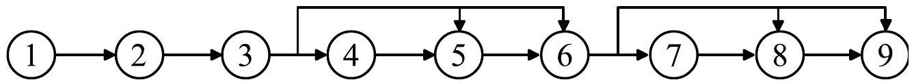

Базовыми являются первые шесть глав, которые содержат основы стохастической математики. Седьмая и восьмая главы посвящены приложениям и могут быть прочитаны в любом порядке. Это относится не только к главам, но и к параграфам внутри них. В девятой главе рассматривается численное моделирование случайных процессов на компьютере, и для её чтения желательно знакомство с любым языком программирования.

В тексте разбросаны небольшие задачи, помеченные символом ( $\lessdot \mathrm{H}_{i}$ ), где $i$ - номер решения в приложении "Помощь". Кроме этого, встречаются ссылки ( ⟵ $\mathrm{C}_{i}$ ), которые имеет смысл просматривать только в том случае, если в процессе чтения возникли вопросы. Возможно, ответ будет найден в приложении "Примечания" под номером $i$. Звёздочкой отмечены те разделы, которые на первом этапе можно пропустить.

Кроме приложений "Помощь" и "Примечания" в книге присутствуют "Математическое приложение" и "Стохастический справочник". В первом приведены активно используемые факты теории вероятности, математического и тензорного анализа. Во втором собраны различные формулы стохастической математики.

Справочник может оказаться полезным и для Читателя, знакомого со стохастическими дифференциальными уравнениями. Однако, перед его чтением настоятельно рекомендуется прочитать страницу 51 и просмотреть разделы §2.6, стр. 64, и §5.1, стр. 124.

Последняя версия лекций на русском и английском языках находится в Интернете по адресу synset.com/. Автор будет признателен за сообщения об ошибках, неточностях и неясностях, устранение которых будет сделано в последующих редакциях этой книги.
http://synset.com

## Глава 1

## Случайные события

Абсолютно детерминированных событий и процессов не бывает. Вселенная разговаривает с нами на языке теории вероятностей. Предполагается, что Читатель хорошо знаком с ней, поэтому напоминаются только факты, необходимые для дальнейшего изучения предмета.

Первый раздел является вводным, он подводит к необходимости использования стохастических дифференциальных уравнений при исследовании различных систем. Затем обсуждается понятие плотности вероятностей, позволяющей вычислять наблюдаемые в среднем величины. Гауссова вероятность лежит в основе шума, воздействующего на детерминированную динамику. Стохастическая связь между случайными величинами и, наоборот, их независимость важны при обнаружении закономерностей между различными объектами и их характеристиками. Ключевым разделом главы является " Модель аддитивного блуждания". Именно обобщение этой простой модели приведёт нас в следующей главе к стохастическим дифференциальным уравнениям. Последний раздел "Мартингаль и бесплатный сыр" содержит ряд формальных определений, которые при желании можно опустить. Перед чтением главы целесообразно просмотреть краткое описание основ теории вероятностей в математическом приложении на стр. 296.

## 1.1 Стохастический мир

- Благодаря трудам Ньютона и Лейбница исследователи получили в своё распоряжение дифференциальные уравнения. Если некоторые величины изменяются во времени, то обычно существует система уравнений, описывающих эту динамику.

Простейший пример - часто встречающийся закон пропорциональности скорости изменения величины ей самой:

$$
\begin{equation*}
\frac{d x}{d t}=\alpha x \quad=>\quad x(t)=x_{0} e^{\alpha t} \tag{1.1}
\end{equation*}
$$

Функция $x(t)>0$ может описывать количество кроликов, скорость размножения которых тем больше, чем больше их уже родилось. Более экономический пример - динамика роста средств производства, увеличение которых тем больше, чем больше их накоплено к данному моменту времени, или рост численности человечества по Мальтусу. Если $\alpha>0$, то это уравнение называют уравнением роста, в противном случае - уравнением распада. В решении присутствует произвольная константа $x_{0}$, для определения которой необходимо задать, например, начальное количество кроликов $x_{0}=x(0)>0$ в момент времени $t_{0}=0$.

Экспоненциальная функция растёт очень быстро. Если бы кролики размножались всё время только в соответствии с этим уравнением, Земля быстро стала бы белой и пушистой. На практике они не только размножаются, но и умирают. Относительное изменение численности популяции $d x / x=A d t$ в общем случае может быть функцией $x$. Разложим её в ряд $A(x)=\alpha-\beta x+\ldots$, ограничившись линейной зависимостью. Второе слагаемое имеет смысл уменьшения относительного прироста в результате уничтожения природных ресурсов (из-за нехватки травы). Это происходит тем интенсивнее, чем больше численность популяции. В результате более реалистичное уравнение приводит к логистической функици, которая со временем выходит на стационарное значение $\alpha / \beta$ (при $\alpha>0$ ):

$$
\begin{equation*}
\frac{d x}{d t}=\alpha x-\beta x^{2} \quad \Rightarrow \quad x(t)=\frac{\alpha}{\beta-\left(\beta-\alpha / x_{0}\right) e^{-\alpha t}} \tag{1.2}
\end{equation*}
$$

Решение уравнения (1.2) получается ( $\lessdot \mathrm{H}_{1}$ ) после замены $x(t)=1 / y(t)$. Асимптотически ( $t \rightarrow \infty$ ) равновесное значение $x_{\infty}=\alpha / \beta$ легко найти из уравнения, в котором $d x / d t=0$ ( ⟵ $\mathrm{C}_{1}$ ). Стоит напомнить, что (1.2) применимо и к приматам, считающим себя разумными и живущим на планете с ограниченными ресурсами, хотя само по себе логистическое уравнение носит оттенок каннибализма ( $\lessdot \mathrm{C}_{2}$ ).

- Дифференциальные уравнения впервые появились в классической механике. Действующая сила $F(x)$ изменяет импульс $p=m \dot{x}$ частицы:

$$
\left\{\begin{array}{l}
\dot{p}=F(x)  \tag{1.3}\\
\dot{x}=p / m
\end{array}\right.
$$

где точка сверху означает производную по времени $\dot{x}=d x / d t$, а $m-$ массу частицы. К примеру, если сила линейна $F(x)=-k x$, то координата частицы совершает колебания $x(t)=x_{0} \cos (w t)+\left(p_{0} / \omega m\right) \sin (w t)$ с частотой $w=\sqrt{k / m}\left(\lessdot \mathrm{H}_{2}\right)$. Так как уравнений два, возникают две константы. Поэтому необходимо задать два начальных условия для координаты $x_{0}=x(0)$ и импульса $p_{0}=p(0)$.

Большинство экономических, биологических и физических систем может быть описано при помощи системы дифференциальных уравнений:

$$
\begin{equation*}
d \mathbf{x}=\mathbf{a}(\mathbf{x}, t) d t \tag{1.4}
\end{equation*}
$$

где $\mathbf{x}(t)=\left\{x_{1}(t), \ldots, x_{n}(t)\right\}$ - вектор переменных, описывающих состояние системы. Векторная функция $\mathbf{a}(\mathbf{x}, t)$ определяет её динамику. Любые дифференциальные уравнения, содержащие производные второго и более высоких порядков, можно свести к системе (1.4) введением новых динамических переменных. Примером этого служат уравнения механики в форме Гамильтона (1.3).

Мы записали (1.4) в виде изменения вектора $\mathbf{x}(t)$ за бесконечно малый интервал времени $d t$. Такое представление даёт простой алгоритм численного интегрирования уравнений (1.4) в ситуации, когда аналитическое решение получить не удаётся. Для этого бесконечно малые изменения заменяют на малые, но конечные $\Delta \mathbf{x}=\mathbf{x}_{k+1}-\mathbf{x}_{k}, \Delta t=t_{k+1}-t_{k}$. В результате (1.4) соответствует дискретной итерационной схеме:

$$
\begin{equation*}
\mathbf{x}_{k+1}=\mathbf{x}_{k}+\mathbf{a}\left(\mathbf{x}_{k}, t_{k}\right) \Delta t \tag{1.5}
\end{equation*}
$$

Задав начальный вектор $\mathbf{x}_{0}$, мы получаем его новое значение $\mathbf{x}_{1}$ через интервал $\Delta t$. Затем $\mathbf{x}_{1}$ подставляем вместо $\mathbf{x}_{0}$ и находим $\mathbf{x}_{2}$. Повторяя эту процедуру, мы приходим к последовательности значений вектора $\mathbf{x}(t)$ в дискретные моменты времени $t_{0}, t_{1}=t_{0}+\Delta t, t_{2}=t_{0}+2 \Delta t$, и т.д. Чем меньше интервал времени $\Delta t$, тем ближе численные значения схемы (1.5) будут приближаться к "истинному" решению уравнения (1.4).

- Успехи естественных наук, использующих дифференциальные уравнения, за последние 300 лет впечатляют. Однако более аккуратное сравнение теоретических результатов с экспериментальными данными показывает, что обыкновенные дифференциальные уравнения - только часть правды.

В большинстве ситуаций изучаемая система подвержена непредсказуемым внешним воздействиям, которые делают динамику не такой гладкой. Летящий по параболе камень лишь в первом приближении следует математической кривой. Его неизбежный контакт с воздухом приводит к некоторым флуктуациям возле этой траектории. Ещё большая нерегулярность обнаруживается при переходе к небольшим объектам, которые, подобно броуновской пыльце, испытывают нерегулярные удары молекул и имеют совсем изломанную траекторию. Степень изломанности координат $\mathbf{x}(t)$ пыльцы в этом случае настолько велика, что её производную по времени уже нельзя определить.

По мере структурного усложнения природных систем роль стохастических (случайных) процессов возрастает. Кролики размножаются в соответствии с логистическим уравнением только в очень грубом приближении. Флуктуации численности популяции за счёт случайных внутренних и внешних факторов, не учитываемых простой моделью (1.2), на самом деле очень велики. Аналогично и рост экономики имеет экспоненциальный характер только в первом приближении. Функция $x_{0} e^{\alpha t}$ в реальности сильно искажается экономическими подъёмами и спадами, имеющими стохастический, сложно предсказуемый характер. Наконец, в финансовом мире случайность является доминантой, которая определяет саму сущность рынков. Стохастика в этом случае, как и в броуновском движении, является не малой поправкой, а главным приближением к реальности.

Таким образом, наш мир не является детерминированным. Его истинное лицо - вероятностное:

Обыкновенные дифференциальные уравнения - это лишь первое приближение к реальности. Более адекватным инструментом исследования являются стохастические уравнения ( ⟵ $C_{3}$ ).

В наших лекциях будет обсуждаться математический аппарат, позволяющий совместить в одной упряжке две столь не похожие друг на друга сущности: детерминированную, гладкую динамику и скачкообразные, изломанные случайные процессы.

Говоря о внешнем шуме, нарушающем гладкую динамику, мы подразумеваем, что справедливо стохастическое уравнение следующего вида:

$$
\begin{equation*}
d \mathbf{x}=\mathbf{a}(\mathbf{x}, t) d t+\operatorname{Noise}(\mathbf{x}, t, d t) . \tag{1.6}
\end{equation*}
$$

Оно описывает детерминированное (первое слагаемое) и случайное (второе) изменение переменных состояния системы $\mathbf{x}$. Так как $d \mathbf{x}$ предполагается малым, соответственно, определённым образом при уменьшении интервала времени $d t$ должен уменьшаться и шум. Наши рассуждения будут посвящены корректному введению в дифференциальные уравнения шума $\operatorname{Noise}(\mathbf{x}, t, d t)$, обладающего теми или иными свойствами.

Решением стохастического уравнения является случайная функи,ия $\mathbf{x}(t)$, которая зачастую существенно отличается от "добропорядочной" функции математического анализа. Если под "увеличением" рассмотреть сильно изгибающуюся обычную функцию, мы увидим, что она гладкая в малых масштабах. Стохастическая, случайная функция при любом увеличении может оставаться изломанной:
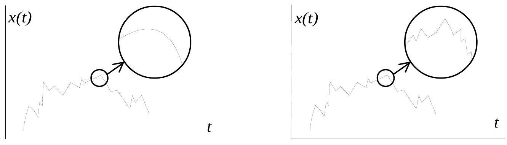

Несмотря на то, что случайная функция $\mathbf{x}(t)$ предполагается непрерывной, обычно это недифференцируемая функция. Действительно, производная представляет собой отношение $[\mathbf{x}(t+\Delta t)-\mathbf{x}(t)] / \Delta t$ при $\Delta t \rightarrow 0$. Сколь малый интервал времени мы ни взяли бы, за счёт случайных факторов направление изменения функции может иметь непредсказуемо различный знак. В результате мы не получаем сходимости к определённому пределу. Понятно, что для такого $d \mathbf{x}$ многие факты математического анализа должны быть существенным образом пересмотрены.

Нас будут интересовать методы решения уравнений, подобных (1.6). В тех случаях, когда точное решение получить не удастся, мы будем использовать численное моделирование или приближенные аналитические соотношения. Излишне напоминать, что любой математический аппарат в конечном счёте разрабатывается для того, чтобы получить более мощные средства исследования окружающего мира. Поэтому за каждым уравнением или его решением необходимо видеть реальный случайный процесс в финансах, физике или биологии.

## 1.2 Случайные величины

- Рассмотрим величину, различные наблюдения которой дают нам набор чисел $x_{1}, x_{2}, \ldots$ Это могут быть значения ежедневных цен акции или координаты броуновской частицы. Числа $x_{1}, x_{2}, \ldots$ можно рассматривать как возможные реализации случайной величины $x$. На первом этапе исследования мы не интересуемся порядком их поступления и можем эту последовательность произвольным образом перемешивать.

Допустим, $x_{i}$ встречается $n_{i}$ раз, а общее количество чисел равно $n$. Мы называем средним значением случайной величины $x$ выражение:

$$
\begin{equation*}
\bar{x}=\langle x\rangle=\frac{1}{n} \sum_{i} x_{i} n_{i}=\sum_{i} x_{i} p_{i}=\int_{-\infty}^{\infty} x P(x) d x \tag{1.7}
\end{equation*}
$$

где $p_{i}=n_{i} / n-$ относительные частоты (или вероятности) появления того или иного $x_{i}$. Если все $x_{i}$ различны, то среднее равно их сумме, делённой на $n$. Чем вероятнее $x_{i}$, тем больший вклад оно даёт в среднее.

Большинство финансовых или физических величин непрерывны. При бесконечном числе наблюдений вместо суммы возникает интеграл. Плотностью распределения вероятностей называют такую функцию $P(x)$, умножение которой на интервал $d x$ дает вероятность $p_{i}$ того, что значение $x$ окажется в отрезке от $x$ до $x+d x$.

Вероятность обнаружить случайную величину $x$ в любом месте диапазона $[-\infty . . \infty]$ равна площади под кривой $P(x)$. Понятно, что такое достоверное событие (любое значение $x$ ) имеет единичную вероятность:
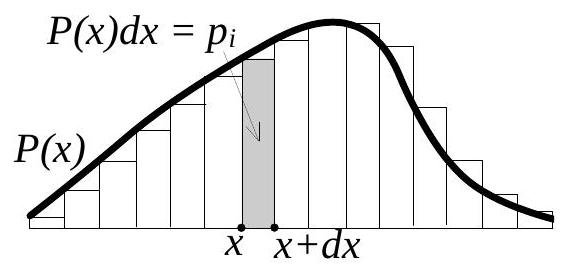

$$
\begin{equation*}
\sum_{i} p_{i}=\int_{-\infty}^{\infty} P(x) d x=1 \tag{1.8}
\end{equation*}
$$

Это соотношение называют условием нормировки.
Иногда случайная величина имеет "запрещённые" значения. Например, цена или количество кроликов всегда положительны. В этом случае вероятность обнаружить $x$ в области $x<0$ равна нулю. При вычислении средних мы часто будем интегрировать от минус до плюс бесконечности. При этом предполагается, что в "запрещённых" для случайной величины интервалах плотность вероятности равна нулю.

- Если известна плотность вероятности, то можно найти среднее значение произвольной функции $F(x)$ случайной величины $x$ :

$$
\langle F(x)\rangle=\overline{F(x)}=\int_{-\infty}^{\infty} F(x) P(x) d x
$$

Мы обозначаем операцию усреднения при помощи двух эквивалентных символов - фигурных скобок или черты сверху. В математической и финансовой литературе распространено также обозначение $\mathbf{E} F(x)$.

Так как среднее является суммой (интегралом), то среднее суммы двух выражений равно сумме их средних. Кроме этого, за знак среднего можно выносить константу:

$$
\langle\alpha f(x)\rangle=\alpha\langle f(x)\rangle, \quad\langle f(x)+g(x)\rangle=\langle f(x)\rangle+\langle g(x)\rangle
$$

Но это и всё! Нелинейные функции, в общем случае, не могут быть вынесены из-под знака среднего: $\left\langle x^{2}\right\rangle \neq\langle x\rangle^{2}$.

- Второй важнейшей характеристикой случайной величины является её волатильность $\sigma$ :

$$
\sigma^{2}=\left\langle(x-\bar{x})^{2}\right\rangle=\int_{-\infty}^{\infty}(x-\bar{x})^{2} P(x) d x
$$

Волатильность $\sigma$ в "нефинансовых" приложениях обычно называется среднеквадратичным отклонением. Её квадрат $\sigma^{2}$ - это дисперсия или вариация, $\sigma^{2}=\boldsymbol{\operatorname { V a r }}(x)$. Среднее значение $\bar{x}$ как константу можно вынести за знак усреднения, поэтому:

$$
\sigma^{2}=\left\langle(x-\bar{x})^{2}\right\rangle=\left\langle x^{2}-2 x \bar{x}+\bar{x}^{2}\right\rangle=\left\langle x^{2}\right\rangle-2 \bar{x}\langle x\rangle+\bar{x}^{2}=\left\langle x^{2}\right\rangle-\langle x\rangle^{2}
$$

$Е с л и$ плотность вероятности непрерывной случайной величины имеет единственный симметричный максимум, то среднее характеризует "наиболее типичное" значение $x$. Волатильность - это типичные отклонения $x$ от своего среднего. Чем меньше $\sigma$, тем уже плотность вероятности $P(x)$, и при $\sigma \rightarrow 0$ случайная величина становится практически детерминированной со значением $x=\bar{x}$.

Аналогично дисперсии можно определить моменты более высоких порядков. Так, безразмерные отношения

$$
\begin{equation*}
\text { asym }=\left\langle(x-\bar{x})^{3}\right\rangle / \sigma^{3}, \quad \text { excess }=\left\langle(x-\bar{x})^{4}\right\rangle / \sigma^{4}-3 \tag{1.9}
\end{equation*}
$$

называются асимметрией и эксцессом. Асимметрия характеризует "скошенность" плотности вероятности и для симметричной $P(x)$ она равна нулю. При больших положительных эксцессах $P(x)$ медленнее убывает при удалении от среднего, чем при малых.

- Очень часто встречается плотность вероятности Гаусса, или нормальное распределение. Соответствующую случайную величину на протяжении этих лекций мы будем обозначать как $\varepsilon$. Мы не будем различать обозначения для случайной величины $\varepsilon$ и переменной в её плотности вероятности, которая для нормального распределения имеет вид:


$$
\begin{equation*}
P(\varepsilon)=\frac{e^{-\frac{1}{2} \varepsilon^{2}}}{\sqrt{2 \pi}} \tag{1.10}
\end{equation*}
$$

Среднее значение $\varepsilon$ равно нулю $\langle\varepsilon\rangle=0$, а её квадрата - единице $\left\langle\varepsilon^{2}\right\rangle=1$. Следовательно, дисперсия также равна единице $\sigma_{\varepsilon}^{2}=1$. Далее это будет обозначаться следующим образом: $\varepsilon \sim N(0,1)$. Если перейти к случайной величине $x=\mu+\sigma \varepsilon$, то она будет иметь среднее $\mu$ и волатильность $\sigma\left(\lessdot \mathrm{C}_{4}\right)$, поэтому $x \sim N\left(\mu, \sigma^{2}\right)$.

Для гауссовых величин полезно знание производящей функи,ии, равной среднему значению от экспоненты [см. (14), стр. 312]:

$$
\begin{equation*}
\left\langle e^{\alpha \varepsilon}\right\rangle=\int_{-\infty}^{\infty} e^{\alpha \varepsilon} P(\varepsilon) d \varepsilon=e^{\alpha^{2} / 2} \tag{1.11}
\end{equation*}
$$

Разложение в ряд по параметру $\alpha$ левой и правой части (1.11) позволяет легко находить средние произвольных степеней $\left\langle\varepsilon^{n}\right\rangle\left(\lessdot \mathrm{H}_{3}\right)$.

В частности: $\left\langle\varepsilon^{4}\right\rangle$ равно 3 , и, следовательно, excess $=0$. Вычитание из безразмерного момента четвёртого порядка тройки в определении эксцесса (1.9) связано с желанием рассматривать в качестве "эталона" нормальное распределение. Если excess $>0$, то, скорее всего, распределение имеет "толстые хвосты", т.е. лежит выше графика нормального распределения (при $x \rightarrow \pm \infty$ ). Если эксцесс отрицательный - наоборот, ниже.

Интегральным распределением:
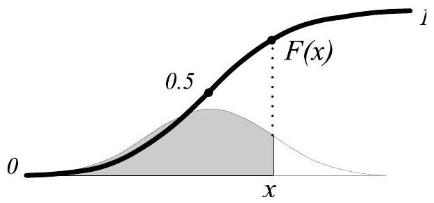

$$
\begin{equation*}
F(x)=\int_{-\infty}^{x} \frac{e^{-\varepsilon^{2} / 2}}{\sqrt{2 \pi}} d \varepsilon \tag{1.12}
\end{equation*}
$$

мы называем вероятность того, что случайная величина не превышает некоторого значения $x$.

- Если известна плотность вероятности $P(x)$ величины $x$, то мы можем найти плотность вероятности для другой случайной величины $y$, связанной с $x$ некоторой функциональной зависимостью $y=f(x)$. Для этого вычисляется среднее от произвольной функции $F(y)$. Это можно сделать, проведя усреднение с известной плотностью вероятности $P(x)$ :

$$
\begin{equation*}
\langle F(y)\rangle=\int_{-\infty}^{\infty} F(y) \tilde{P}(y) d y=\int_{-\infty}^{\infty} F(f(x)) P(x) d x \tag{1.13}
\end{equation*}
$$

Так как $\tilde{P}(y)$ нам неизвестна, мы интегрируем с $P(x)$ и подставляем $y= f(x)$ в $F(\ldots)$. При помощи обратной замены можно преобразовать второй интеграл в первый. Множитель при $F(y)$ в подынтегральной функции окажется искомой плотностью вероятности $\tilde{P}(y)$ для $y$.

Рассмотрим в качестве примера случайную величину $r=\mu+\sigma \varepsilon$, имеющую нормальное распределение со средним значением $\mu$ и волатильностью $\sigma$. Найдём распределение для $x=x_{0} e^{r}$, где $x_{0}$ - константа.

$$
\langle F(x)\rangle=\int_{-\infty}^{\infty} F\left(x_{0} e^{\mu+\sigma \varepsilon}\right) e^{-\varepsilon^{2} / 2} \frac{d \varepsilon}{\sqrt{2 \pi}}=\int_{0}^{\infty} F(x) e^{-\left[\ln \left(x / x_{0}\right)-\mu\right]^{2} / 2 \sigma^{2}} \frac{d x}{x \sigma \sqrt{2 \pi}}
$$

Первый интеграл - вычисление среднего при помощи нормального распределения. В нём проводится замена $x=x_{0} e^{\mu+\sigma \varepsilon}, d x=\sigma x d \varepsilon$. В результате при $x \geqslant 0$ :

$$
\begin{equation*}
P_{L}(x)=\frac{1}{x \sigma \sqrt{2 \pi}} \exp \left[-\frac{\left(\ln \left(x / x_{0}\right)-\mu\right)^{2}}{2 \sigma^{2}}\right] . \tag{1.14}
\end{equation*}
$$

Вероятность $P_{L}(x)$ называется логнормальным распределением. В качестве упражнения предлагается вычислить среднее $\langle x\rangle$ при помощи $P_{L}(x)$ или гауссовой плотности $P(\varepsilon)\left(\lessdot \mathrm{H}_{4}\right)$.

- Используя случайные величины в соотношениях типа $x=\mu+\sigma \varepsilon$, мы не выполняем арифметических операций с конкретными числами, а сообщаем о потенииальном вычислении: "если $\varepsilon$ окажется равным некоторому значению, то $x \ldots$ " Иногда делают различие в обозначениях, записывая случайную величину при помощи большой буквы $X$, а при вычислении среднего - строчной буквой $x$, как переменную интегрирования. Мы не будем этого делать, тем не менее, необходимо помнить об этом довольно тонком различии.


## 1.3 Совместная и условная вероятности

- Пусть мы имеем дело с двумя случайными величинами $x$ и $y$. В этом случае наблюдаются пары эмпирических значений $\left\{x_{1}, y_{1}\right\},\left\{x_{2}, y_{2}\right\}$, и т.д., возникающие с той или иной частотой. Поэтому можно говорить о совместной плотности вероятности $P(x, y)$ того, что величины принимают некоторые значения в окрестности $x$ и $y$.

Совместная вероятность позволяет вычислять среднее от произвольной функции двух аргументов:

$$
\begin{equation*}
\langle F(x, y)\rangle=\int_{-\infty}^{\infty} F(x, y) P(x, y) d x d y \tag{1.15}
\end{equation*}
$$

Если мы не интересуемся значением величины $y$, можно $P(x, y)$ проинтегрировать по всем её возможным реализациям и получить плотность вероятности только для величины $x$ :

$$
\begin{equation*}
\int_{-\infty}^{\infty} P(x, y) d y=P(x) \tag{1.16}
\end{equation*}
$$

Интегрирование ещё раз левой и правой части по $x$ даст единицу. Поэтому условие нормировки имеет форму двойного интеграла. Оно получается из (1.15), если положить $F(x, y)=1$, так как $\langle 1\rangle=1$.

Одновременное изучение $x$ и $y$ необязательно означает их временное совпадение. Например, в финансах $x$ может быть изменением цены за день европейского фондового индекса, а $y$ - американского, торгуемого после европейского. Между ними существует причинная связь, разделённая временем. С другой стороны, изменение цен двух акций $x$ и $y$ за день происходит одновременно и зависит от внешних синхронизирующих факторов (новости, макроэкономика и т.д.).

Как мы увидим в следующем разделе, совместная плотность вероятности $P(x, y)$ особенно важна, если между случайными величинами существует некоторая зависимость. Эта связь может иметь функциональную форму $y=f(x)$. Тогда, если для $x$ реализуется некоторое значение, то величина $y$ будет полностью предопределена. Однако чаще $y=f(x, \xi)$, где $\xi$ - третья, "ненаблюдаемая", случайная переменная. Она может быть непредсказуемым внешним воздействием, меняющим параметры функциональной зависимости $y=f(x)$, или динамической переменной, которую мы не учли в более простой модели.

- Кроме совместной вероятности двух величин $x$ и $y$ удобно ввести условную плотность вероятности. Она отвечает на вопрос, "какова вероятность $y$, если уже известно значение величины $x$ ". Условная плотность равна совместной $P(x, y)$, нормированной на вероятность уже доступной информации $P(x)$ (см. также стр. 299 в приложении М):

$$
\begin{equation*}
P(x \Rightarrow y)=\frac{P(x, y)}{P(x)} \tag{1.17}
\end{equation*}
$$

В качестве примера для $P(x)$ рассмотрим нормальное распределение (1.10), а для совместной плотности вероятности $P(x, y)$ - "двумерную повёрнутую" гауссиану:

$$
P(x, y)=\frac{e^{-\left(x^{2}+y^{2}+\sqrt{2} x y\right)}}{\pi \sqrt{2}}, \quad P(x \Rightarrow y)=\frac{e^{-\left(x^{2} / 2+y^{2}+\sqrt{2} x y\right)}}{\sqrt{\pi}} .
$$

Совместная и условная вероятности представлены на рисунке ниже:
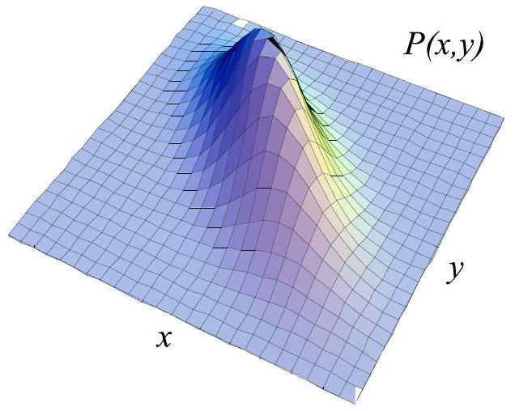
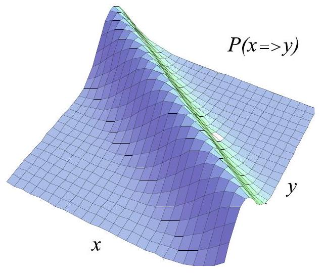

Объём под $P(x, y)$ равен единице, тогда как под $P(x \Rightarrow y)$ - бесконечности. Нормировка условной вероятности имеет смысл получения любого значения $y$ при данном $x$ :

$$
\begin{equation*}
\int_{-\infty}^{\infty} P(x \Rightarrow y) d y=1 \tag{1.18}
\end{equation*}
$$

Стоит проверить, что формула (1.18) согласуется с (1.16).
Для условной вероятности распространено обозначение $P(y \mid x)$. Однако ниже мы увидим, что $P(x \Rightarrow y)$ оказывается более естественной записью при описании цепочек связанных между собой событий. В любом случае $P(x \Rightarrow y)$, как и $P(x, y)$, - это функция двух вещественных аргументов.

Условная вероятность важна, так как позволяет связать друг с другом разнообразные события, отражая их причинно-следственную связь.
－Рассмотрим вероятностные свойства русского языка．Каждая из 33－х букв，включая пробел＂＿＂，имеет свою вероятность появления её в тексте：

$$
p\left(\_\right)=0.163, \quad p(\mathbf{o})=0.0940, \quad p(\mathbf{e})=0.0696, \ldots, p(\mathbf{b})=0.0002 .
$$

Если мы хотим определить вероятность встречи в произвольном месте некоторой подстроки，например，＂эт＂，мы должны подсчитать число та－ ких подстрок и разделить на общее число всех подстрок вида＂＊＊＂，где звёздочка обозначает любой символ．Для вычисления условной вероятно－ сти $P(\boldsymbol{\ni} \Rightarrow \mathbf{T})$ появления буквы＂ $\mathbf{T}$＂，если перед ней стоит＂э＂，необходимо отобрать все подстроки，удовлетворяющие маске＂э＊＂（＂э＂，затем любой символ＂＊＂），и выяснить，сколько среди них＂эт＂．В результате：

$$
p(\boldsymbol{⿱ 亠 乂})=N(\boldsymbol{⿱ 亠 乂}) / N(* *)=0.002, \quad p(\boldsymbol{⿱ 亠 乂}=\mathbf{T})=N(\boldsymbol{⿱ 亠 乂}) / N\left(\boldsymbol{9}^{*}\right)=0.739,
$$

где $N$－число подстрок，удовлетворяющих соответствующей маске．Для текста из $n$ символов $N(* *)=n-1$ ，а $N\left(\boldsymbol{\ni}^{*}\right)=p(\boldsymbol{Э}) \cdot n$ ．Понятно，что количество как совместных，так и условных вероятностей для двух букв равно $33^{2}=1089$ ．

Вероятность встретить в тексте конкретную букву зависит от предыс－ тории（предшествующих букв）．Например，после＂э＂вероятность появ－ ления＂т＂в 14 раз выше，чем безусловная вероятность появления буквы ＂ $\mathbf{T}$＂：$p(\mathbf{T})=0.051$ ．Наоборот，некоторые сочетания букв крайне сложно произносимы．Например，после＂б＂вряд ли появится＂п＂．

Зная условные вероятности，можно создавать синтетические тексты． Так，по известной предыстории＂．．．cba＂новая буква＂x＂генерится с ве－ роятностью，равной $p(\ldots c b a \Rightarrow x)$ ．Чем длиннее предыстория условной вероятности，тем более＂благозвучные＂получаются сочетания：

△ $P(x)$ ：а аотовчеи вс оувмпйоийпгунлрстк и рннсаьеоивотрл денаасле－ оуеаиои нш и охаиоооомызкнт ннсо врыь ттлмоооас л чоулвкт；

△ $P(a \Rightarrow x)$ ：волизлитоди нугрндатнухак мисо о меловли одетестрос－ кась нудатотосрато сдото сялушлана ини н дышетазеноноразабыт；

△ $P(b a \Rightarrow x)$ ：не толда при ной зловьются дально ка коров и к бы сли казас тали ива не же с повся обыл казакорну об это бы никтолу；

△ $P(c b a \Rightarrow x)$ ：не заблюди он майта втобы из местью секратное и надо сказаление вдруг нашает и потороткостор да выше ну задередило．

В первом случае использованы одиночные вероятности и никак не учиты－ вается история．Во втором－только предшествующая буква определяет следующую，и т．д．

- В качестве второго примера воспользуемся данными ежедневных цен закрытия $x_{t}$ фондового индекса S\&P500. Вычислим его логарифмические доходности $r_{t}=\ln \left(x_{t} / x_{t-1}\right)$ в процентах ( ⟵ $\mathrm{C}_{6}$ ). Разобьём диапазон их значений на пять интервалов:

$$
(-\infty \ldots-3 \%), \quad[-3 \% \ldots-1 \%), \quad[-1 \% \ldots+1 \%], \quad(+1 \% \ldots+3 \%], \quad(+3 \% \ldots+\infty) .
$$

Таким образом, состояние рынка будут характеризоваться одной из пяти возможностей: от "паники" ( $-\infty \ldots-3 \%$ ) до "эйфории" ( $+3 \% \ldots \infty$ ). Соответственно, каждое $r_{t}$ становится дискретной случайной величиной, принимающей пять значений. В этом случае это уже будут не доходности, а номера состояний рынка, например $-2,-1,0,1,2$.

Можно рассмотреть совместиую вероятность $p\left(r_{t-1}, r_{t}\right)$ того, что два последовательных дня имеют состояния $r_{t-1}$ и $r_{t}$. Каждый день реализуется одна из пяти возможностей, поэтому для двух последовательных дней будет $25=5^{2}$ различных комбинаций таких состояний: $\{(0,0) ;(0,1)$; $(0,-1) ; \ldots\}$. За период $1990-2007$ г. г. был $n=4531$ торговый день. Вероятности каждого из пяти состояний имели значения:

$$
p(r)=\left(\begin{array}{lllll}
0.007 & 0.110 & 0.761 & 0.125 & 0.007
\end{array}\right)
$$

Для их вычисления необходимо подсчитать, сколько торговых дней оказывается в каждом состоянии, после чего разделить их на $n$. Наиболее типичными для рынка являются спокойные дни $[-1 \% \ldots+1 \%]$, которые происходили $3451=0.76 \cdot 4531$ раз. Аналогично буквам из предыдущего примера вычисляются условные вероятности:

$$
p\left(r_{t-1} \Rightarrow r_{t}\right)=\left(\begin{array}{ccccc}
0.067 & 0.167 & 0.400 & 0.267 & 0.100 \\
0.022 & 0.146 & 0.651 & 0.168 & 0.014 \\
0.004 & 0.107 & 0.783 & 0.102 & 0.004 \\
0.006 & 0.084 & 0.759 & 0.138 & 0.013 \\
0.000 & 0.303 & 0.515 & 0.152 & 0.030
\end{array}\right) .
$$

Первая строка в этой матрице соответствует переходу из состояния "паники" вчера в одно из пяти возможных состояний сегодня. Аналогично последняя строка даёт условные вероятности перехода из состояния "эйфории". Обращает на себя внимание то, что вероятности перехода из "спокойного" рынка (средняя строка), практически совпадают с безусловными вероятностями $p(r)$. Если же вчера рынок не был спокойным, вероятности отклоняются от однодневных. Особенно это заметно ( ⟵ $\mathrm{C}_{5}$ ) для крайних строк "паники" и "эйфории". Так как полная вероятность перейти хоть в какое-то состояние равна единице, то сумма чисел в каждой строке также равна единице [ см. (1.18)].

## 1.4 Зависимость и независимость

- Величины являются статистически независимыми, если их совместная плотность вероятности равна произведению функций, соответствующих распределениям каждой из величин:

$$
P(x, y)=P_{1}(x) P_{2}(y)
$$

Мы часто будем опускать индексы и использовать одну и ту же букву для обозначения различных функций, отличая их аргументами.

Из определения (1.17) следует, что для независимых событий условная плотность $P(x \Rightarrow y)=P(y)$ зависит только от $y$. Это соотношение может быть ещё одним определением независимости событий. Если вероятность события $y$ не зависит от того, произошло или нет $x$, то они независимы.

Среднее произведение независимых величин равно произведению их средних:

$$
\langle x y\rangle=\int_{-\infty}^{\infty} x y P(x) P(y) d x d y=\langle x\rangle\langle y\rangle
$$

Поэтому ковариация $\operatorname{cov}(x, y)$ :

$$
\begin{equation*}
\operatorname{cov}(x, y)=\langle(x-\bar{x})(y-\bar{y})\rangle=\langle x y\rangle-\langle x\rangle\langle y\rangle \tag{1.19}
\end{equation*}
$$

независимых величин нулевая. Обратное может быть и неверным ( $\lessdot \mathrm{C}_{7}$ ).

- Функция $z=f(x, y)$ двух случайных величин $x$ и $y$ также является случайной величиной с некоторым распределением $P(z)$. Чтобы его найти, необходимо так преобразовать формулу для вычисления среднего от произвольной функции $F(z)$, чтобы получился интеграл только по $z$ :

$$
\begin{equation*}
\langle F(z)\rangle=\int_{-\infty}^{\infty} F(f(x, y)) P(x, y) d x d y=\int_{-\infty}^{\infty} F(z) P(z) d z \tag{1.20}
\end{equation*}
$$

Например, если $x$ и $y$ - независимые гауссовы числа с произвольными волатильностями $\sigma_{x}, \sigma_{y}$, то величина $z=x+y$ - тоже гауссова:

$$
\langle F(z)\rangle=\int_{-\infty}^{\infty} F(x+y) e^{-x^{2} / 2 \sigma_{x}^{2}-y^{2} / 2 \sigma_{y}^{2}} \frac{d x d y}{2 \pi \sigma_{x} \sigma_{y}}=\int_{-\infty}^{\infty} F(z) e^{-z^{2} / 2 \sigma^{2}} \frac{d z}{\sigma \sqrt{2 \pi}}
$$

где $\sigma^{2}=\sigma_{x}^{2}+\sigma_{y}^{2}$. В двойном интеграле делается замена $z=x+y, u=x$, и проводится интегрирование по $u$ при помощи формулы (14) на стр. 312 приложения М. Таким образом, сумма двух нормальных величин оказывается нормально распределённой величиной.

- Пусть $x$ и $y$ - две случайные независимые величины с произвольным распределением. Рассмотрим $z$, являющуюся их суммой $z=x+y$. Очевидно, что среднее равно сумме средних $\bar{z}=\bar{x}+\bar{y}$. Найдём дисперсию:

$$
\sigma_{z}^{2}=\left\langle(z-\bar{z})^{2}\right\rangle=\left\langle(x-\bar{x}+y-\bar{y})^{2}\right\rangle=\sigma_{x}^{2}+\sigma_{y}^{2}+2\langle(x-\bar{x})(y-\bar{y})\rangle
$$

где под знаком среднего мы возвели в квадрат и ввели волатильности каждой величины, например, $\sigma_{x}^{2}=\left\langle(x-\bar{x})^{2}\right\rangle$. Если (!) $x$ и $y$ независимъ, то ковариация между ними (последнее слагаемое) равна нулю: $\langle(x-\bar{x})(y-\bar{y})\rangle=\langle x-\bar{x}\rangle\langle y-\bar{y}\rangle=0$. Следовательно:

$$
\sigma_{z}^{2}=\sigma_{x}^{2}+\sigma_{y}^{2}
$$

В общем случае для суммы $n$ независимых величин:

$$
\begin{equation*}
z=x_{1}+\ldots+x_{n} \quad=>\quad \sigma_{z}^{2}=\sigma_{1}^{2}+\ldots+\sigma_{n}^{2} \tag{1.21}
\end{equation*}
$$

Для доказательства необходимо рассмотреть $x_{1}+x_{2}$ как одну случайную величину и, добавив к ней $x_{3}$, получить $\sigma_{z}^{2}+\sigma_{3}^{2}=\sigma_{1}^{2}+\sigma_{2}^{2}+\sigma_{3}^{2}$, и т.д.

Если волатильности каждого $x_{i}$ одинаковы и равны $\sigma_{0}$, то волатильность их суммы будет увеличиваться с ростом числа слагаемых, как $\sigma_{z}=\sigma_{0} \sqrt{n}$. Эта зависимость в виде корня исключительно важна и лежит в основе всех тех свойств шума Noise, который мы планируем добавлять к детерминированным дифференциальным уравнениям.

Обратим внимание, что полученный результат (1.21) не зависит от вида распределения величин $x_{i}$. Они могут быть даже различными. Главное - они должны быть независимыми.

Аналогичный результат мы получили и для суммы двух независимых распределённых по Гауссу чисел. Однако при этом плотность вероятности суммы также оказалась гауссовой. Случайная величина $z$ называется бесконечно делимой, если её можно представить в виде суммы независимых случайных чисел, имеющих такое же распределение, как и $z$ (возможно с другими параметрами). Примером бесконечно делимого распределения является плотность вероятности Гаусса, а также распределения Коши и гамма - функции, рассматриваемые в следующем разделе.

На самом деле для бесконечной делимости достаточно, чтобы у всех трёx величин в $z=x+y$ было одинаковое распределение. При этом, естественно, подразумевается одинаковая функциональная форма распределения. Его параметры (в частности, волатильность) будут различными. Вообще, для произвольно распределённых чисел их сумма имеет распределение, отличное от распределения каждого из слагаемых. Однако (1.21) для независимых величин выполняется в любом случае и является очень общим результатом.

- Простейшая связь между двумя случайными величинами $x$ и $y$ - это линейная зависимость $y=\alpha+\beta x$. В общем случае может существовать третья случайная величина $\xi$, которую мы интерпретируем, как "внешний" случайный шум. Результирующая модель с константами $\alpha$ и $\beta$ имеет вид:

$$
\begin{equation*}
y=\alpha+\beta x+\xi . \tag{1.22}
\end{equation*}
$$

С этого уравнения обычно начинается поиск связей между эмпирическими величинами.

Обычно считают, что среднее шума равно нулю $\langle\xi\rangle=0$. В противном случае его можно включить в параметр $\alpha$. Потребуем, чтобы дисперсия "шума" $\xi$ (ошибка модели) была минимальной:

$$
\begin{equation*}
\sigma_{\xi}^{2}=\left\langle\xi^{2}\right\rangle=\left\langle(y-\alpha-\beta x)^{2}\right\rangle=\text { min } \tag{1.23}
\end{equation*}
$$

Взяв производные по $\alpha$ и $\beta$, можно ( $\lessdot \mathrm{H}_{5}$ ) найти уравнение регрессионной прямой. Её наклон $\beta$ равен:

$$
\begin{equation*}
\beta=\frac{\langle x y\rangle-\langle x\rangle\langle y\rangle}{\left\langle x^{2}\right\rangle-\langle x\rangle^{2}}=\frac{\langle(x-\bar{x})(y-\bar{y})\rangle}{\sigma_{x}^{2}} \tag{1.24}
\end{equation*}
$$

Итоговое уравнение мы запишем в симметричном виде пропорциональности безразмерных отклонений величин от своих средних:

$$
\begin{equation*}
\frac{y-\bar{y}}{\sigma_{y}}=\rho(x, y) \frac{x-\bar{x}}{\sigma_{x}}+\frac{\xi}{\sigma_{y}} . \tag{1.25}
\end{equation*}
$$

Коэффициент этой пропорциональности называется корреляицей:

$$
\begin{equation*}
\rho_{x y}=\rho(x, y)=\frac{\operatorname{cov}(x, y)}{\sigma_{x} \sigma_{y}} \tag{1.26}
\end{equation*}
$$

В его числителе находится ковариационный коэффициент (1.19).
Корреляция ( $\rho \neq 0$ ) между двумя величинами $x, y$ не всегда означает наличие причинной связи $y=f(x)$ или $x=g(y)$. Например, может существовать третья величина $z$, влияющая и на $x$, и на $y$, синхронизируя их поведение. Так, спад мировой экономики оказывает одинаковое воздействие на две не связанные друг с другом экспортно-ориентированные отрасли экономики. "Ложная" корреляция возникает также, если две величины имеют явно выраженный восходящий или нисходящий тренд (систематический рост или спад). В этом случае между ними будет появляться заметная корреляция. Эта корреляция характеризует наличие детерминированной составляющей роста ( $\lessdot \mathrm{C}_{8}$ ).

- Корреляционный коэффициент определяет наклон регрессионной прямой. Однако важнее то, что он служит мерой прогностических возможностей линейной модели. Покажем это, подставив в значение наклона (1.24) исходное уравнение (1.22). Учтём, что $\langle\xi\rangle=0$ и $\bar{y}=\alpha+\beta \bar{x}$ :

$$
\beta=\frac{\langle(x-\bar{x})(\beta(x-\bar{x})+\xi)\rangle}{\sigma_{x}^{2}}=\beta+\frac{\langle x \xi\rangle}{\sigma_{x}^{2}} .
$$

Поэтому $\langle x \xi\rangle=0$, что позволяет нам вычислить дисперсию $y$ :

$$
\sigma_{y}^{2}=\left\langle(y-\bar{y})^{2}\right\rangle=\left\langle(\beta(x-\bar{x})+\xi)^{2}\right\rangle=\beta^{2} \sigma_{x}^{2}+\left\langle\xi^{2}\right\rangle .
$$

Так как $\beta=\rho(x, y) \sigma_{y} / \sigma_{x}$, получаем выражение для относительной ошибки модели:

$$
\begin{equation*}
E=\frac{\sigma_{\xi}}{\sigma_{y}}=\sqrt{1-\rho^{2}(x, y)} \tag{1.27}
\end{equation*}
$$

Значение волатильности шума $\sigma_{\xi}^{2}=\left\langle\xi^{2}\right\rangle$ можно рассматривать как ошибку линейной модели $y=\alpha+\beta x$. Полезно сравнивать её с волатильностью $\sigma_{y}$, которая является типичной ошибкой тривиальной модели $y=\bar{y}$. Мы видим, что такая относительная ошибка $E$ зависит от корреляционного коэффициента. Чем ближе к единице его квадрат, тем меньше ошибка. При нулевом $\rho$ относительная ошибка равна единице, и, следовательно, линейная модель имеет такую же предсказательную силу, как и тривиальное утверждение о том, что лучшим прогнозом $y$ будет его среднее значение. Часто говорят о коэффициенте детерминации $R^{2}=1-E^{2}=\rho^{2}$. Заметим также, что коэффициент корреляции по модулю всегда меньше единицы $|\rho| \leqslant 1$.

- Уравнение линейной модели (1.22) может интерпретироваться поразному.

1) Прежде всего, это модель прогнозирования $y$, если стало известно $x$ (в духе $P(x \Rightarrow y)$ ). В этом случае $\xi$ - это внешний шум или ошибка модели, когда "истинная" зависимость между $x$ и $y$ не такая простая. В результате шума $y$ всегда оказывается случайной величиной. В отношении $x$ возможны различные ситуации. Например, при изучении кривой спроса $x$ может быть контролируемой и задаваемой исследователем ценой товара (например, с равным шагом). В этом случае она детерминирована. Однако разброс в её значениях позволяет формально определить среднее $\bar{x}$ и волатильность $\sigma_{x}$.
2) Часто бывает, что и $x$, и $y$ выступают в качестве равноправных случайных величин. Например, на фондовом рынке ежедневные изменения цен акций двух компаний $x$ и $y$ стохастически связаны друг с другом. Обе величины случайны и не зависят от исследователя.

## 1.5 Характеристическая функция

- Характеристическая функиця $\Phi(q)$ является фурье-образом (стр. 314) плотности вероятности случайной величины $x$ :

$$
\Phi(q)=\int_{-\infty}^{\infty} e^{\imath q x} P(x) d x, \quad P(x)=\frac{1}{2 \pi} \int_{-\infty}^{\infty} e^{-\imath q x} \Phi(q) d q
$$

С её помощью легко получать средние значения произвольных степеней $x$. Проведя один раз Фурье-интегрирование и найдя характеристическую функцию, можно затем простым дифференцированием определяются значения $\left\langle x^{n}\right\rangle$ :

$$
\left.\frac{1}{\imath^{n}} \frac{d^{n} \Phi(q)}{d q^{n}}\right|_{q=0}=\int_{-\infty}^{\infty} x^{n} P(x) d x=\left\langle x^{n}\right\rangle
$$

Характеристическую функцию можно записать как среднее от экспоненты: $\Phi(q)=\left\langle e^{\imath q x}\right\rangle$. Очевидно, что $\Phi(0)=1$. Коэффициенты разложения $\Phi(q)$ в ряд по $q$ являются средними степеней величины $x$ :

$$
\begin{equation*}
\Phi(q)=\left\langle e^{\imath q x}\right\rangle=\sum_{n=0}^{\infty} \frac{\imath^{n}\left\langle x^{n}\right\rangle}{n!} q^{n}=1+\imath\langle x\rangle q-\frac{1}{2}\left\langle x^{2}\right\rangle q^{2}+\ldots \tag{1.28}
\end{equation*}
$$

Иногда мы будем рассматривать действительный вариант характеристической функции с: $q \rightarrow q / \imath$ и называть её производящей функичей: $\Phi(q / \imath)=\phi(q)=\left\langle e^{q x}\right\rangle$.

- Допустим, случайная величина $y$ связана с $x$ линейной зависимостью $y=a+b x$. Тогда её характеристическая функция равна:

$$
\Phi_{y}(q)=\left\langle e^{\imath q y}\right\rangle=\left\langle e^{\imath q(a+b x)}\right\rangle=e^{\imath q a}\left\langle e^{\imath q b x}\right\rangle
$$

Следовательно, при линейном преобразовании появляется дополнительная фаза, и происходит масштабирование переменной $q$ в $\Phi$ :

$$
\begin{equation*}
y=a+b x \quad=>\quad \Phi_{y}(q)=e^{\imath q a} \Phi_{x}(b q) \tag{1.29}
\end{equation*}
$$

Если $b=0$, то $\Phi_{y}(q)=e^{\imath q a}$, что, учитывая интегральное представление для дельта-функции Дирака (стр. 315), приводит к плотности вероятности $P(y)=\delta(y-a)$. Это уже не случайная величина, а детерминированная константа $y=a$.

- Приведём примеры характеристических функций для некоторых важных распределений вероятностей:

$$
\begin{array}{lll}
\text { Gauss : } & P(x)=\frac{e^{-\left(x-x_{0}\right)^{2} / 2 \sigma^{2}}}{\sigma \sqrt{2 \pi}}, & \Phi(q)=e^{\imath x_{0} q-\sigma^{2} q^{2} / 2} . \\
\text { Cauchy : } & P(x)=\frac{a / \pi}{\left(x-x_{0}\right)^{2}+a^{2}}, & \Phi(q)=e^{\imath x_{0} q-a|q|} . \\
\text { Gamma : } & P(x)=\frac{1}{\gamma \Gamma(\mu)}\left(\frac{x}{\gamma}\right)^{\mu-1} e^{-x / \gamma}, & \Phi(q)=\frac{1}{(1-\imath \gamma q)^{\mu}} .
\end{array}
$$

Для нахождения $\Phi(q)$ распределения Гаусса необходимо выделить полный квадрат в экспоненте. Функция $\Phi(q)$ Коши проще проверяется в обратном направлении при вычислении по ней $P(x)$. В третьем случае по формуле (16), стр. 313, для гамма-функиии проводится прямое интегрирование. Заметим, что характеристическая функция Коши $\Phi(q)$ не аналитична по $q$ и распределение не имеет конечных моментов $\left\langle x^{m}\right\rangle$ при $m>1$.

- Рассмотрим два независимых случайных числа $x, y$ с произвольными распределениями $P_{1}(x), P_{2}(y)$ и их сумму $z=x+y$. Найдем плотность вероятности $P(z)$ для случайной величины $z$. Для этого вычислим среднее от произвольной функции (пределы от $-\infty$ до $\infty$ ):

$$
\langle F(z)\rangle=\int F(x+y) P_{1}(x) P_{2}(y) d x d y=\int F(z) \underbrace{P_{1}(x) P_{2}(z-x) d x}_{P(z)} d z
$$

где сделана замена $y=z-x$. Поэтому

$$
P(z)=\int P_{1}(x) P_{2}(z-x) d x
$$

Характеристическая функция суммы двух независимых величин равна произведению их характеристических функций:

$$
\Phi_{z}(q)=\left\langle e^{\imath q(x+y)}\right\rangle=\left\langle e^{\imath q x}\right\rangle\left\langle e^{\imath q y}\right\rangle=\Phi_{x}(q) \Phi_{y}(q)
$$

где мы воспользовались фактом независимости $x$ и $y$. Понятно, что и в общем случае $n$ независимых случайных величин $x_{i}$ характеристическая функция их суммы будет равна произведению характеристических функций каждого слагаемого:

$$
z=x_{1}+\ldots+x_{n} \quad=>\quad \Phi_{z}(q)=\Phi_{1}(q) \cdot . . \cdot \Phi_{n}(q) .
$$

Если распределения каждого $x_{i}$ одинаковые, то $\Phi_{z}(q)=\Phi^{n}(q)$. Теперь можно показать что Гаусс, Коши и гамма - бесконечно делимы ( $\lessdot \mathrm{H}_{6}$ ).

- При изучении случайных процессов мы будем активно использовать факт бесконечной делимости нормального распределения. В частности, если $\varepsilon_{1}, \ldots, \varepsilon_{n}$ - независимые гауссовы величины с нулевым средним и единичной дисперсией $\varepsilon_{i} \sim N(0,1)$, то их сумма также гауссова:

$$
\begin{equation*}
\varepsilon_{1}+\ldots+\varepsilon_{n}=\varepsilon \sqrt{n} . \tag{1.30}
\end{equation*}
$$

Множитель $\sqrt{n}$ выделен для того, чтобы $\varepsilon \sim N(0,1)$ [ $(1.21)$, стр. 23 ]. В результате $\varepsilon_{i}$ и $\varepsilon$ имеют одинаковое распределение с одинаковыми параметрами (среднее, моменты, и т.д.). Характеристическая функция для величины $\varepsilon$ удовлетворяет уравнению $\Phi(q)^{n}=\Phi(\sqrt{n} q)$ и равна $\Phi(q)= e^{-q^{2} / 2}$.

В общем случае распределение $P(x)$ называют устойчивым, если для любого $n$ существуют такие константы $a_{n}$ и $b_{n}$, что

$$
\begin{equation*}
x_{1}+\ldots+x_{n}=a_{n}+b_{n} x \tag{1.31}
\end{equation*}
$$

где $x_{1}, \ldots, x_{n}$ и $x$ имеют одинаковое распределение $P(x)$. Если $a_{n}=0$, то такое распределение называется строго устойчивым. Таковым является распределение Гаусса с константой $b_{n}=\sqrt{n}$.

Заметим, что условие (1.31) сильнее огранивает класс допустимых распределений, чем просто требование бесконечной делимости. Дело в том, что в определении (1.31) слева и справа стоят случайные величины, имеющие распределения с одинаковыми параметрами, тогда как для делимости это необязательно.

Аналогично линейному масштабированию (1.29), для характеристической функции устойчивого распределения справедливо следующее функциональное уравнение:

$$
\begin{equation*}
\Phi^{n}(q)=e^{i q a_{n}} \Phi\left(b_{n} q\right) \tag{1.32}
\end{equation*}
$$

Несложно проверить, что распределения Гаусса и Коши удовлетворяют этому уравнению. В то же время гамма-распределение, являющееся бесконечно делимым, не является устойчивым. Общие функции, удовлетворяющие (1.32), называются распределениями Леви-Хинчина:

$$
\Phi(q)=e^{\imath q \beta-\gamma[1+\imath \theta \operatorname{sign}(q) \operatorname{tg}(\pi \alpha / 2)]|q|^{\alpha}}, \quad \Phi(q)=e^{\imath q \beta-\gamma|q|-\imath \gamma \theta q \ln |q|}
$$

где $\operatorname{sign}(q)=q /|q|$ - знак $q$, параметр $0<\alpha \leqslant 2$. Кроме этого, $|\theta| \leqslant 1$, $\gamma \geqslant 0$. Первое распределение является четырехпараметрическим, а второе - трёхпараметрическим, и оказывается пределом первого при $\alpha \rightarrow 1$. Эти распределения при соответствующем задании значений параметров могут описывать случайные числа с "толстыми хвостами" (большие эксцессы), что активно используется при моделировании доходностей финансовых инструментов.

- Рассмотрим $n$ независимых случайных величин $x_{1}, \ldots, x_{n}$ имеющих произвольные, но одинаковые распределения, и изучим свойства суммы:

$$
u=\frac{x_{1}+\ldots+x_{n}}{\sqrt{n}}
$$

при $n \rightarrow \infty$. Без потери общности можно считать, что $\left\langle x_{i}\right\rangle=0$, так как сдвигом $x \rightarrow x-\langle x\rangle$ всегда можно перейти к таким случайным величинам. В этом случае среднее значение $u$ также равно нулю. Среднее его квадрата в силу независимости $x_{i}$ равно среднему квадрата $x$ :

$$
\left\langle u^{2}\right\rangle=\frac{\left\langle x_{1}^{2}\right\rangle+\ldots+\left\langle x_{n}^{2}\right\rangle}{n}=\left\langle x^{2}\right\rangle=\sigma^{2}
$$

Для одинаковых произвольных распределений $x_{i}$ с $\Phi(q)$ при больших $n$ характеристическая функция для $u$ имеет вид:

$$
\Phi_{u}(q)=\left[\Phi\left(\frac{q}{\sqrt{n}}\right)\right]^{n}=\left[1-\frac{\sigma^{2}}{2} \frac{q^{2}}{n}+. .\right]^{n}
$$

где мы воспользовались уравнением (1.29) и разложили $\Phi(q / \sqrt{n})$ в ряд до второго порядка малости. Член, пропорциональный $q$, равен нулю, так как $\langle x\rangle=0$. По определению, число Эйлера является пределом $e^{x}=(1+x / n)^{n}$, при $n \rightarrow \infty$. Поэтому характеристическая функция и распределение для $u$ стремятся к гауссовому виду:

$$
\begin{equation*}
\Phi_{u}(q) \rightarrow e^{-\sigma^{2} q^{2} / 2} \tag{1.33}
\end{equation*}
$$

В качестве упражнения ( $\lessdot \mathrm{H}_{7}$ ) стоит найти асимметрию и эксцесс при больших $n$ для характеристической функции $\Phi_{z}(q)=\Phi^{n}(q)$.

Результат (1.33) является исключительно важным и формулируется следующим образом:
"распределение суммы большого числа независимых случайных величин стремится к нормальному распределению".

Например, если некоторая физическая величина подвержена внешним независимым случайным воздействиям, то чаще всего разброс её значений подчиняется распределению Гаусса. На финансовых рынках цена акции также подвержена случайным воздействиям со стороны колебаний спроса и предложения. Однако её распределение не является гауссовым. Связано это в основном с двумя причинами: 1) скоррелированностью действий участников рынка (за счёт синхронизирующего информационного фона) и 2) медленной переоценкой ими риска (волатильности) этой бумаги. Мы вернёмся к обсуждению этих вопросов в главе 8.

## 1.6 Многомерное распределение Гаусса*

- При изучении систем стохастических уравнений мы будем активно использовать матричные и тензорные обозначения. Для сокращения операции умножения матриц используется два типа соглашений:

$$
\begin{equation*}
\eta_{\alpha}=\sum_{i=1}^{n} S_{\alpha i} \varepsilon_{i}=S_{\alpha i} \varepsilon_{i}=(\mathbf{S} \cdot \varepsilon)_{\alpha} \tag{1.34}
\end{equation*}
$$

По повторяющемуся индексу всегда подразумевается суммирование, и знак суммы опускается. Выше таковым является индекс " $i$ " во втором равенстве. Повторяющиеся индексы, по которым проводится суммирование, называют "немыми". В процессе вычислений их можно переобозначить в любую букву, которая ещё не используется в выражении. Третье равенство в уравнении (1.34) - это матричная форма той же суммы, в которой матрица $\mathbf{S}=S_{\alpha \beta}$ и вектор $\boldsymbol{\varepsilon}=\left\{\varepsilon_{1}, \ldots, \varepsilon_{n}\right\}$ перемножаются вообще без упоминания индексов и знака суммирования.

Рассмотрим $n$ независимых гауссовых случайных величин, имеющих нулевое среднее и единичную дисперсию. Среднее значение их произведения $\left\langle\varepsilon_{i} \varepsilon_{j}\right\rangle$ равно единице для совпадающих индексов и нулю - для различных. Подобная матрица будет обозначаться символом Кронекера:

$$
\left\langle\varepsilon_{i} \varepsilon_{j}\right\rangle=\delta_{i j}= \begin{cases}1 & i=j \\ 0 & i \neq j\end{cases}
$$

Вычислим, например, ковариационную матрицу случайных величин $\eta_{\alpha}$ :

$$
\begin{equation*}
\left\langle\eta_{\alpha} \eta_{\beta}\right\rangle=S_{\alpha i} S_{\beta j}\left\langle\varepsilon_{i} \varepsilon_{j}\right\rangle=S_{\alpha i} S_{\beta j} \delta_{i j}=S_{\alpha i} S_{\beta i}=S_{\alpha i} S_{i \beta}^{T}=\left(\mathbf{S S}^{T}\right)_{\alpha \beta} . \tag{1.35}
\end{equation*}
$$

При суммировании с символом Кронекера $\delta_{i j}$ в сумме остаются только слагаемые с $i=j$. Поэтому одна из сумм (по $j$ ) и символ Кронекера исчезают, и остаётся только суммационный индекс $i$. Затем вводится новая матрица $S_{i \beta}^{T}=S_{\beta i}$ с переставленными индексами. Подобная операция называется транспонированием. В табличном представлении она соответствует перестановке местами строк и столбцов матрицы.

Матрица $\mathbf{S}$ может имеет обратную $\mathbf{S}^{-1}$, если выполняется уравнение:

$$
\mathbf{S} \cdot \mathbf{S}^{-1}=\mathbf{S}^{-1} \cdot \mathbf{S}=\mathbf{1}
$$

где $\mathbf{1}=\delta_{i j}$ - единичная матрица (символ Кронекера). Так, для определённого выше вектора $\boldsymbol{\eta}=\left(\eta_{1}, \ldots, \eta_{n}\right)$ можно записать:

$$
\boldsymbol{\eta}=\mathbf{S} \cdot \boldsymbol{\varepsilon} \quad=>\quad \boldsymbol{\varepsilon}=\mathbf{S}^{-1} \cdot \boldsymbol{\eta}
$$

где мы умножили левую и правую части на $\mathbf{S}^{-1}$.

- Пусть $\varepsilon=\left(\varepsilon_{1}, \ldots, \varepsilon_{n}\right)$ - стандартные независимые гауссовые случайные величины $\varepsilon_{i} \sim N(0,1)$, а величины $\boldsymbol{\eta}=\left(\eta_{1}, \ldots, \eta_{n}\right)$ получены из них (1.34) при помощи перемешивающих коэффициентов $S_{\alpha \beta}$. Среднее значение произведения $\eta_{\alpha} \eta_{\beta}$ определяется матрицей дисперсий (1.35):

$$
D_{\alpha \beta}=\left\langle\eta_{\alpha} \eta_{\beta}\right\rangle, \quad \mathbf{D}=\mathbf{S} \cdot \mathbf{S}^{T}
$$

которая является симметричной: $D_{\alpha \beta}=D_{\beta \alpha}$.
Найдём производящую функцию для случайных величин $\eta$. Для этого введём вектор $\mathbf{b}=\left(b_{1}, \ldots, b_{n}\right)$ и вычислим среднее экспоненты от скалярного произведения $\mathbf{b} \cdot \boldsymbol{\eta}=b_{1} \eta_{1}+\ldots+b_{n} \eta_{n}$ (по $n$ нет суммы!):

$$
\left\langle e^{\mathbf{b} \cdot \boldsymbol{\eta}}\right\rangle=\left\langle e^{\mathbf{b} \cdot \mathbf{S} \cdot \boldsymbol{\varepsilon}}\right\rangle=\left\langle e^{b_{i} S_{i 1} \varepsilon_{1}}\right\rangle \cdot \ldots \cdot\left\langle e^{b_{i} S_{i n} \varepsilon_{n}}\right\rangle=e^{\frac{1}{2}\left\{\left(b_{i} S_{i 1}\right)^{2}+\ldots+\left(b_{i} S_{i n}\right)^{2}\right\}}
$$

Мы воспользовались независимостью величин $\varepsilon_{i}$, разбив среднее произведения на произведение средних, и формулой (1.11), стр. 16. В показателе экспоненты стоит матричное выражение вида:

$$
\left(b_{i} S_{i 1}\right)^{2}+\ldots+\left(b_{i} S_{i n}\right)^{2}=b_{i} S_{i k} b_{j} S_{j k}=b_{i} S_{i k} S_{k j}^{T} b_{j}=\mathbf{b} \cdot \mathbf{S} \cdot \mathbf{S}^{T} \cdot \mathbf{b}
$$

Поэтому окончательно производящая функция равна:

$$
\phi(\mathbf{b})=\left\langle e^{\mathbf{b} \cdot \boldsymbol{\eta}}\right\rangle=e^{\frac{1}{2} \mathbf{b} \cdot \mathbf{D} \cdot \mathbf{b}}
$$

Взяв частные производные по $b_{\alpha}$, несложно найти среднее от любого произведения $\eta_{\alpha}$. Проверим, что среднее $\left\langle\eta_{\alpha} \eta_{\beta}\right\rangle$ равно $D_{\alpha \beta}$. Возьмём производную производящей функции по $b_{\alpha}$. Учитывая, что $\mathbf{b} \cdot \mathbf{D} \cdot \mathbf{b}$ равно $b_{i} D_{i j} b_{j}$, имеем:

$$
\frac{\partial \phi(\mathbf{b})}{\partial b_{\alpha}}=\frac{1}{2}\left(D_{\alpha j} b_{j}+b_{i} D_{i \alpha}\right) \phi(\mathbf{b})=D_{\alpha i} b_{i} \phi(\mathbf{b})
$$

где во втором равенстве мы воспользовались тем, что $D_{\alpha \beta}=D_{\beta \alpha}$. Аналогично берётся вторая производная:

$$
\frac{\partial^{2} \phi(\mathbf{b})}{\partial b_{\alpha} \partial b_{\beta}}=D_{\alpha \beta} \phi(\mathbf{b})+D_{\alpha i} b_{i} D_{\beta j} b_{j} \phi(\mathbf{b})
$$

Полагая $\mathbf{b}=0$ и учитывая, что

$$
\left.\frac{\partial^{2}\left\langle e^{\mathbf{b} \cdot \boldsymbol{\eta}}\right\rangle}{\partial b_{\alpha} \partial b_{\beta}}\right|_{\mathbf{b}=0}=\left\langle\eta_{\alpha} \eta_{\beta}\right\rangle
$$

приходим к соотношению $D_{\alpha \beta}=\left\langle\eta_{\alpha} \eta_{\beta}\right\rangle$. В качестве упражнения предлагается проверить следующее тензорное выражение:

$$
\left\langle\eta_{\alpha} \eta_{\beta} \eta_{\gamma} \eta_{k}\right\rangle=D_{\alpha \beta} D_{\gamma k}+D_{\alpha \gamma} D_{\beta k}+D_{\alpha k} D_{\beta \gamma}
$$

Таким образом, среднее любых степеней $\eta$ полностью определяется матрицей дисперсии D.

- Найдём теперь явный вид совместной плотности вероятности для величин $\eta_{1}, \ldots, \eta_{n}$. Запишем сначала плотность вероятности для $\varepsilon_{1}, \ldots, \varepsilon_{n}$ :

$$
P\left(\varepsilon_{1}, \ldots, \varepsilon_{n}\right)=P\left(\varepsilon_{1}\right) \cdot \ldots \cdot P\left(\varepsilon_{n}\right)=\frac{e^{-\frac{1}{2}\left(\varepsilon_{1}^{2}+\ldots+\varepsilon_{n}^{2}\right)}}{(2 \pi)^{n / 2}}
$$

При замене переменных $\eta_{\alpha}=S_{\alpha \beta} \varepsilon_{\beta}$ в интеграле необходимо изменить элемент объёма интегрирования $d^{n} \varepsilon=d \varepsilon_{1} \ldots d \varepsilon_{n}$, умножив его на якобиан:

$$
d^{n} \eta=\operatorname{det}\left|\frac{\partial \eta_{\alpha}}{\partial \varepsilon_{\beta}}\right| d^{n} \varepsilon=(\operatorname{det} \mathbf{S}) d^{n} \varepsilon
$$

Так как при транспонировании матрицы её определитель не изменяется, а определитель произведения матриц равен произведению их определителей, то $\operatorname{det} \mathbf{D}=(\operatorname{det} \mathbf{S})^{2}$ и, следовательно:

$$
P\left(\eta_{1}, \ldots, \eta_{n}\right)=\frac{e^{-\frac{1}{2} \boldsymbol{\eta} \cdot \mathbf{D}^{-1} \cdot \boldsymbol{\eta}}}{(2 \pi)^{n / 2} \sqrt{\operatorname{det} \mathbf{D}}}
$$

где в показателе экспоненты подставлены $\boldsymbol{\varepsilon}=\mathbf{S}^{-1} \cdot \boldsymbol{\eta}$ :

$$
\epsilon^{2}=S_{i \alpha}^{-1} \eta_{\alpha} S_{i \beta}^{-1} \eta_{\beta}=\eta_{\alpha} S^{-1^{T}}{ }_{\alpha i} S_{i \beta}^{-1} \eta_{\beta}=\boldsymbol{\eta} \cdot \mathbf{S}^{-1^{T}} \cdot \mathbf{S}^{-1} \cdot \boldsymbol{\eta}=\boldsymbol{\eta} \cdot\left(\mathbf{S} \cdot \mathbf{S}^{T}\right)^{-1} \cdot \boldsymbol{\eta}
$$

и использовано свойство обратных матриц $(\mathbf{A} \cdot \mathbf{B})^{-1}=\mathbf{B}^{-1} \cdot \mathbf{A}^{-1}($ см. стр. 304). Как и любая плотность вероятности, $P\left(\eta_{1}, \ldots, \eta_{n}\right)$ нормирована на единицу, поэтому, учитывая выражение для производящей функции $\left\langle e^{\mathbf{b} \cdot \boldsymbol{\eta}}\right\rangle$, можно записать значение следующего $n$-мерного гауссового интеграла:

$$
\begin{equation*}
\int_{-\infty}^{\infty} e^{\mathbf{b} \cdot \boldsymbol{\eta}-\frac{1}{2} \boldsymbol{\eta} \cdot \mathbf{D}^{-1} \cdot \boldsymbol{\eta}} d^{n} \eta=(2 \pi)^{n / 2} \sqrt{\operatorname{det} \mathbf{D}} e^{\frac{1}{2} \mathbf{b} \cdot \mathbf{D} \cdot \mathbf{b}} \tag{1.36}
\end{equation*}
$$

До сих пор мы работали с перемешанными величинами, имеющими нулевое среднее: $\langle\boldsymbol{\eta}\rangle=\mathbf{S} \cdot\langle\boldsymbol{\varepsilon}\rangle=0$. Можно к ним прибавить некоторый постоянный вектор $\bar{\eta}_{\alpha}$, который будет иметь смысл средних значений $\eta_{\alpha}$ :

$$
\eta_{\alpha}=\bar{\eta}_{\alpha}+S_{\alpha \beta} \varepsilon_{\beta}
$$

Тогда общее $n$-мерное гауссово распределение принимает вид:

$$
P\left(\eta_{1}, \ldots, \eta_{n}\right)=\frac{e^{-\frac{1}{2}(\boldsymbol{\eta}-\overline{\boldsymbol{\eta}}) \cdot \mathbf{D}^{-1} \cdot(\boldsymbol{\eta}-\overline{\boldsymbol{\eta}})}}{(2 \pi)^{n / 2} \sqrt{\operatorname{det} \mathbf{D}}}
$$

где в плотность вероятности $P\left(\varepsilon_{1}, \ldots, \varepsilon_{n}\right)$ подставлено $\boldsymbol{\varepsilon}=\mathbf{S}^{-1} \cdot(\boldsymbol{\eta}-\overline{\boldsymbol{\eta}})$.

- Рассмотрим в качестве примера случай $n=2$. Запишем элементы симметричной матрицы $D_{\alpha \beta}$ при помощи трёх независимых констант $\sigma_{1}$, $\sigma_{2}$ и $\rho$ :

$$
\mathbf{D}=\left(\begin{array}{cc}
\sigma_{1}^{2} & \rho \sigma_{1} \sigma_{2} \\
\rho \sigma_{1} \sigma_{2} & \sigma_{2}^{2}
\end{array}\right) .
$$

Несложно проверить, что определитель $\mathbf{D}$ равен

$$
\operatorname{det} \mathbf{D}=\sigma_{1}^{2} \sigma_{2}^{2}\left(1-\rho^{2}\right)
$$

а обратная к $\mathbf{D}$ матрица имеет вид:

$$
\mathbf{D}^{-1}=\frac{1}{\operatorname{det} \mathbf{D}}\left(\begin{array}{cc}
\sigma_{2}^{2} & -\rho \sigma_{1} \sigma_{2} \\
-\rho \sigma_{1} \sigma_{2} & \sigma_{1}^{2}
\end{array}\right) .
$$

В результате совместная плотность вероятности для $\eta_{1}, \eta_{2}$ может быть записана следующим образом:

$$
P\left(\eta_{1}, \eta_{2}\right)=\frac{\exp \left\{-\left(x_{1}^{2}-2 \rho x_{1} x_{2}+x_{2}^{2}\right) / 2\left(1-\rho^{2}\right)\right\}}{2 \pi \sigma_{1} \sigma_{2} \sqrt{1-\rho^{2}}},
$$

где $x_{i}=\left(\eta_{i}-\bar{\eta}_{i}\right) / \sigma_{i}-$ относительные отклонения $\eta_{i}$ от своих средних $\bar{\eta}_{i}$. Параметры $\sigma_{i}$ являются волатильностями: $\left\langle\left(\eta_{1}-\bar{\eta}_{1}\right)^{2}\right\rangle=D_{11}=\sigma_{1}^{2}$, а $\rho-$ коэффициент корреляции: $\rho=\left\langle x_{1} x_{2}\right\rangle$.

Матрица $\mathbf{D}=\mathbf{S S}^{T}$ является симметричной, тогда как $\mathbf{S}$ в общем случае - нет. Поэтому $\mathbf{D}$ зависит от трёх параметров, a $\mathbf{S}$ - от четырёх, и одной и той же матрице дисперсии может соответствовать несколько различных матриц $\mathbf{S}$. Так, можно записать:

$$
\mathbf{S}=\left(\begin{array}{ll}
\sigma_{1} \cos \alpha & \sigma_{1} \sin \alpha \\
\sigma_{2} \sin \beta & \sigma_{2} \cos \beta
\end{array}\right)
$$

где $\rho=\sin (\alpha+\beta)$. Понятно, что возможны различные комбинации "углов" $\alpha$ и $\beta$, дающие один и тот же корреляционный коэффициент $\rho$.

Если $\alpha=-\beta$, то $\rho=0$, и $\mathbf{D}$ является диагональной, а при $\sigma_{1}= \sigma_{2}=1$ - единичной. Матрицу $\mathbf{S}$, удовлетворяющую уравнению $\mathbf{S S}^{T}=\mathbf{1}$, называют ортогочальной.

Если $\alpha=0, \rho=\sin \beta, \sigma_{1}=\sigma_{2}=1$, то

$$
\mathbf{S}=\left(\begin{array}{cc}
1 & 0  \tag{1.37}\\
\rho & \sqrt{1-\rho^{2}}
\end{array}\right), \quad \mathbf{D}=\left(\begin{array}{cc}
1 & \rho \\
\rho & 1
\end{array}\right)
$$

Такая смесь переводит независимые стандартные случайные величины $\varepsilon_{1}, \varepsilon_{2} \sim N(0,1),\left\langle\varepsilon_{1} \varepsilon_{2}\right\rangle=0$ в скоррелированные $\eta_{1}, \eta_{2} \sim N(0,1):$

$$
\left\{\begin{array}{l}
\eta_{1}=\varepsilon_{1} \\
\eta_{2}=\rho \varepsilon_{1}+\sqrt{1-\rho^{2}} \varepsilon_{2} \quad=>\quad\left\langle\eta_{1} \eta_{2}\right\rangle=\rho, \quad\left\langle\eta_{1}^{2}\right\rangle=\left\langle\eta_{2}^{2}\right\rangle=1 .
\end{array}\right.
$$

Это позволяет, например, при компьютерном моделировании генерить скоррелированные величины при помощи нескоррелированных.

## 1.7 Модель аддитивного блуждания

- Координата броуновской частицы в воде или цена на финансовом рынке $x$ имеют траекторию с очень нерегулярными изломами. Простейшим её описанием будет модель аддитивного независимого дискретного случайного блуждания. Все четыре прилагательных в названии модели отражают базовые свойства процесса.

Предположим, что начальное значение $x=x_{0}$. Далее $x$ испытывает $t=1,2, \ldots$ случайных независимых гауссовых изменений ("толчков"), каждое с волатильностью $\sigma$. В результате $x$ окажется равным накопленной сумме таких изменений:

$$
\begin{equation*}
x_{t}=x_{0}+\sigma \cdot\left(\varepsilon_{1}+\ldots+\varepsilon_{t}\right), \tag{1.38}
\end{equation*}
$$

где $\varepsilon_{i} \sim N(0,1)$ - гауссовы числа с нулевым средним и единичной дисперсией. Индекс $t$ пока является целым числом, однако в дальнейшем мы перейдём к пределу непрерывного времени.

Удобно ввести дискретную переменную Винера:

$$
\begin{equation*}
W_{t}=\varepsilon_{1}+\ldots+\varepsilon_{t}=\varepsilon \sqrt{t} \text {. } \tag{1.39}
\end{equation*}
$$

Второе равенство мы записали, так как сумма $t$ гауссовых чисел снова равна гауссовому числу с волатильностью $\sqrt{t}$ (стр. 22-23). Случайные числа, как с индексами $\varepsilon_{i}$, так и без них $\varepsilon$, предполагаются нормированными: $\langle\varepsilon\rangle=0,\left\langle\varepsilon^{2}\right\rangle=1$, т.е. как $\varepsilon \sim N(0,1)$. Модель (1.38) теперь выглядит следующим образом: $x_{t}=x_{0}+\sigma W_{t}$.

Начиная с $x_{0}=0$, будем генерить случайные числа $\varepsilon_{1}, \varepsilon_{2}, \ldots$ и строить их накопленную сумму. Такая траектория называется выборочной траекторией случайного процесса ( $1-$ й рисунок):
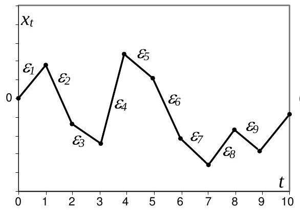
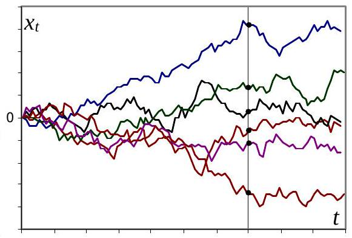
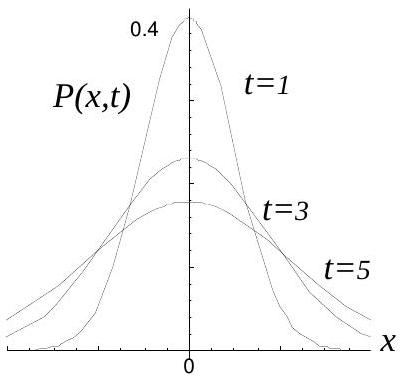

Так как изменения $\varepsilon_{k}$ будут каждый раз новыми, то по-разному будут протекать и блуждания траектории $x_{t}=x(t)$ (см. 2-й рисунок). Различные реализации процесса блуждания пересекают вертикальную прямую $t=$ const в тех или иных значениях $x$. Совокупность всех этих чисел является случайной величиной.

Поэтому, говоря о процессе $x(t)$, мы подразумеваем, что в данный момент времени $x=x(t)$ имеет определённое распределение $P(x)$. В некоторый другой момент времени распределение может оказаться иным. Поэтому плотность вероятности $P(x, t)$, среднее $\bar{x}(t)$ и волатильность $\sigma(t)$ будут функциями времени.

Волатильность аддитивного блуждания увеличивается, как $\sqrt{t}$. Это наглядно видно на 2 -м рисунке с несколькими реализациями $x_{t}$. Их "пучок" постепенно расширяется. В результате неопределённость будущего значения $x_{t}$ увеличивается. Мы можем обнаружить $x_{t}$ достаточно далеко от начального значения $x_{0}=0$. Это также проиллюстрировано на 3 -м рисунке, где представлены плотности вероятности $P(x, t)$, которые с течением времени постепенно "расплываются".

Блуждающие траектории начинаются с определённого начального значения $x_{0}=x\left(t_{0}\right)$ в момент времени $t_{0}$. Поэтому, говоря о вероятности, мы имеем дело с условной плотностью $P\left(x_{0}, t_{0} \Rightarrow x, t\right)$. Пока моменты времени $t_{0}$ и $t$ являются целыми числами, соответствующими номеру скачка $\varepsilon_{k}$ на очередном этапе.

Важно понимать, что $x_{t}=x(t)$ не является конкретной траекторией. Это одновременная совокупность всех возможных траекторий случайного процесса. Аналогично, случайное число $x$ не подразумевает конкретного значения, а обозначает все возможные реализации, подчиняющиеся некоторому распределению $P(x)$. Вероятность получить на $t$-ом шаге $x_{t}$ определяется вероятностями всех изменений $\varepsilon_{i}$. Так, дискретный винеровский процесс $W_{t}$ определяется плотностью вероятности:

$$
P\left(\varepsilon_{1}, \ldots, \varepsilon_{t}\right)=P\left(\varepsilon_{1}\right) \cdot \ldots \cdot P\left(\varepsilon_{t}\right),
$$

где равенство отражает независимость всех $\varepsilon_{i}$. Таким образом, $W_{t}-$ фактически, многомерная случайная величина.

Обратим ещё раз внимание на смысл записи: $\varepsilon_{1}+\ldots+\varepsilon_{t}=\varepsilon \sqrt{t}$. Предположим, что в процессе моделирования мы генерим $t$ независимых гауссовых чисел $\varepsilon_{1}, \varepsilon_{2}, \ldots$ и складываем их. Результат будет иметь такие же статистические свойства, как одно гауссово число $\varepsilon$ с единичной волатильностью, умноженное на фактор $\sqrt{t}$. При вычислении свойств накопленной суммы вполне достаточно пользоваться величиной $\varepsilon$, а не совместной плотностью $P\left(\varepsilon_{1}, \ldots, \varepsilon_{t}\right)$. В частности, если мы ищем среднее значение, в котором участвует сумма гауссовых чисел, его вычисление можно упростить, используя только одно случайное число. Однако, если нас интересует связь сумм, получаемых в различные моменты времени, то необходимы некоторые ухищрения. Рассмотрим их подробнее.

- Для сравнения процесса блуждания с самим собой в различные моменты времени его необходимо разбивать на неперекрывающиеся участки времени. Пусть процесс длится $s$ шагов, а затем еще в течение $t-s$. Сравним свойства траекторий в "моменты времени" $s$ и $t(s<t)$ :

$$
\begin{aligned}
& W_{s}=\varepsilon_{1}+\ldots+\varepsilon_{s} \\
& W_{t}=\varepsilon_{1}+\ldots+\varepsilon_{s}+\varepsilon_{s+1}+\ldots+\varepsilon_{t}
\end{aligned}
$$

Вычитая уравнения, получим сумму $t-s$ случайных чисел:

$$
W_{t}-W_{s}=\varepsilon_{s+1}+\ldots+\varepsilon_{t}=\varepsilon \sqrt{t-s}=W_{t-s}
$$

Второе равенство является отражением того, что суммарная волатильность $t-s$ независимых гауссовых слагаемых будет равна $\sqrt{t-s}$. Фактически, $W_{s}$ и $W_{t}$ можно представить в виде:

$$
\begin{align*}
& W_{s}=\varepsilon_{a} \sqrt{s} \\
& W_{t}=\varepsilon_{a} \sqrt{s}+\varepsilon_{b} \sqrt{t-s} \tag{1.40}
\end{align*}
$$

где $\varepsilon_{a}, \varepsilon_{b}$, как и везде в наших лекциях, - независимые гауссовые числа с нулевым средним и единичной дисперсией. Первое из них $-\varepsilon_{a}-$ эквивалентно накопленной сумме начальных $s$ приращений, а второе $-\varepsilon_{b}-$ соответствует независимым от $\varepsilon_{a}$ последующим $t-s$ приращениям.

Теперь можно найти ковариацию между $W_{s}$ и $W_{t}$. Так как $\overline{W_{t}}=0$, то:

$$
\operatorname{cov}(s, t)=\left\langle W_{s} W_{t}\right\rangle=\left\langle\varepsilon_{a} \sqrt{s} \cdot\left(\varepsilon_{a} \sqrt{s}+\varepsilon_{b} \sqrt{t-s}\right)\right\rangle=s
$$

в силу того, что $\left\langle\varepsilon_{a}^{2}\right\rangle=1$ и $\left\langle\varepsilon_{a} \varepsilon_{b}\right\rangle=0$. Таким образом, ковариация зависит только от наименьшего числа $s=\min (s, t)$, представляющего собой длительность общей для $W_{s}$ и $W_{t}$ истории. Для прояснения смысла этого результата запишем регрессионную прямую $(1.25)$ между $W_{s}$ и $W_{t}$. Их волатильности равны $\sqrt{s}$ и $\sqrt{t}$, а средние - нулю, поэтому:

$$
\frac{W_{t}}{\sqrt{t}}=\frac{\operatorname{cov}(s, t)}{\sqrt{s} \sqrt{t}} \frac{W_{s}}{\sqrt{s}}+\frac{\xi}{\sqrt{t}} \quad=>\quad W_{t}=W_{s}+\xi
$$

Таким образом, если известно, что в момент времени $s$ сумма равна $W_{s}$, то наилучшим прогнозом будущего значения $W_{t}$ будет уже известное $W_{s}$. Из (1.40) следует, что линейная регрессионная модель оказывается в данном случае точной ( $\lessdot \mathrm{C}_{9}$ ). При этом её "шумом" выступают накопленные после момента времени $s$ изменения: $\xi=\varepsilon_{s+1}+\ldots+\varepsilon_{t}=\varepsilon_{b} \sqrt{t-s}$.

Мы будем часто усреднять гауссовы величины, поэтому в качестве упражнения стоит проверить следующие соотношения ( $i<j<k$ ):

$$
\left\langle W_{i} W_{j} W_{k}\right\rangle=0, \quad\left\langle W_{i}^{2} W_{j} W_{k}\right\rangle=2 i^{2}+i j, \quad\left\langle W_{i} W_{j}^{2} W_{k}\right\rangle=3 i j
$$

[Процесс $W_{k}$ необходимо разбить на три интервала $\left(\lessdot \mathrm{C}_{10}\right)$.]

- В заключение раздела ответим на следующий вопрос. Если $x=x_{1}$ в момент времени $t=t_{1}$, то какова вероятность обнаружить его на следующем шаге $t=t_{2}$ в значении $x_{2}$ ? Очевидно, что она равна вероятности изменения $x$ :

$$
P\left(x_{1} \Rightarrow x_{2}\right)=\frac{e^{-\varepsilon^{2} / 2}}{\sqrt{2 \pi}}=\frac{\exp \left(-\frac{\left(x_{2}-x_{1}\right)^{2}}{2\left(t_{2}-t_{1}\right)}\right)}{\sqrt{2 \pi\left(t_{2}-t_{1}\right)}} .
$$

Мы положили $\sigma=1$ и записали в явном виде гауссову плотность вероятности для $\varepsilon=x_{2}-x_{1}$. В результате условная вероятность зависит от обоих аргументов, поэтому случайные числа $x_{1}$ и $x_{2}$ являются зависимыми.

Дискретная траектория блуждания описывается множеством случайных величин $x_{t}=\left\{x_{1}, x_{2}, x_{3}, \ldots\right\}$, задающих возможные значения $x$ на шаге $t$. Индекс можно записать в функциональной форме $x(t)$ и говорить о случайной функи, ин, которая пока определена только в дискретных точках. Таким образом, случайная функция - это многомерная величина. Для задания свойств случайного процесса в общем случае необходимо определить плотность вероятности $P\left(x_{1}, x_{2}, x_{3}, \ldots\right)$ с бесконечным числом аргументов.

Для винеровского процесса ситуация существенно упрощается, так как каждое следующее $x_{t+1}$ определяется значением непосредственно предшествующего $x_{t}$ и никак не зависит от более длинной предыстории. Этот факт мы будем записывать в следующем виде ( ⟵ $\mathrm{C}_{11}$ ):

$$
\begin{equation*}
P\left(x_{1}, \ldots, x_{t} \Rightarrow x_{t+1}\right)=P\left(x_{t} \Rightarrow x_{t+1}\right) . \tag{1.41}
\end{equation*}
$$

Если известно $x_{t}$, то $x_{t+1}$ будет определяться значением $x_{t}$ и случайным изменением $\varepsilon$, а не всей историей $x_{1}, \ldots, x_{t-1}$. Процессы с такой "короткой памятью" называются марковскими процессами. Они представляют собой следующее приближение после независимости случайных величин, для которых $P\left(x_{1}, \ldots, x_{t} \Rightarrow x_{t+1}\right)=P\left(x_{t+1}\right)$.

Марковские процессы позволяют представить совместную вероятность любой размерности в виде цепочки условных вероятностей. Например:

$$
\begin{equation*}
P\left(x_{1}, x_{2}, x_{3}\right)=P\left(x_{1}\right) P\left(x_{1} \Rightarrow x_{2}\right) P\left(x_{2} \Rightarrow x_{3}\right) . \tag{1.42}
\end{equation*}
$$

Для этого сначала записываем $P\left(x_{1}, x_{2}, x_{3}\right)=P\left(x_{1}, x_{2}\right) P\left(x_{1}, x_{2} \Rightarrow x_{3}\right)$ по определению условной вероятности. Затем используем определение для $P\left(x_{1}, x_{2}\right)=P\left(x_{1}\right) P\left(x_{1} \Rightarrow x_{2}\right)$ и марковское условие короткой памяти: $P\left(x_{1}, x_{2} \Rightarrow x_{3}\right)=P\left(x_{2} \Rightarrow x_{3}\right)$. Таким образом, чтобы произошло $x_{1}, x_{2}, x_{3}$, необходимо, чтобы свершилось $x_{1}$. При условии, что это произошло, далее реализовалось $x_{2}$, и т.д.

## 1.8 Случайные процессы

В общем случае мы называем случайным процессом упорядоченную последовательность случайных величин $x_{1}, x_{2}, \ldots$. Вместо индекса, перечисляющего величины, удобно использовать функциональную форму $x(t)$. Если параметр $t$ принимает дискретные значения, то мы имеем дело с дискретным случайным процессом. Если же $t$ - непрерывное время, то это непрерывный случайный процесс по времени. В этом случае $x(t)$ называется случайной функицей. Заметим, что она может быть и разрывной, например, если $x(t)$ в каждый момент времени равно независимой гаусовой величине $\varepsilon$ (гауссовый шум).

Случайный процесс необходимо описывать совместной плотностью вероятности для каждого момента времени:

$$
\begin{equation*}
P\left(x_{1}, x_{2}, x_{3}, \ldots\right) \equiv P\left(x_{1}, t_{1} ; x_{2}, t_{2} ; x_{3}, t_{3} ; \ldots\right), \tag{1.43}
\end{equation*}
$$

где $t_{i}$ явным образом указывают, к какому моменту времени относится значение случайной величины $x_{i}$. Понятно, что в случае непрерывных процессов работать с такой плотностью вероятности достаточно сложно. Поэтому её размерность стараются уменьшить. Если проинтегрировать по всем случайным величинам $x_{i}$, кроме одной, получится плотность вероятности в фиксированный момент времени $P(x, t)$. Аналогично можно определить плотность вероятности в два произвольных момента времени $P\left(x_{1}, t_{1} ; x_{2}, t_{2}\right)$, и т.д. Заметим, что $t$, в отличие от $x,-$ это не случайная величина, а параметр.

Часто процесс изучается после того, как стало известным его начальное значение $x_{0}$ в момент времени $t_{0}$. В этом случае целесообразно применять условные плотности вероятности. Например, одноточечная:

$$
P\left(x_{0} \Rightarrow x_{1}\right) \equiv P\left(x_{0}, t_{0} \Rightarrow x_{1}, t_{1}\right)
$$

или двухточечная:

$$
P\left(x_{0} \Rightarrow x_{1}, x_{2}\right) \equiv P\left(x_{0}, t_{0} \Rightarrow x_{1}, t_{1} ; x_{2}, t_{2}\right) .
$$

Они будут основными объектами при описании случайных процессов.
Случайные величины, совокупность которых образует случайный процесс, могут быть как независимыми, так и связанными. Если величины независимы, график выборочного процесса будет выглядеть, как хаотические выбросы вверх и вниз от среднего значения. Такой процесс называют шумом. При наличии некоторой связи между последовательными значениями график может иметь хотя и очень изломанную, но всё же относительно связную динамику. Примером подобного процесса является дискретное аддитивное блуждание, рассмотренное выше.

- Описание случайного процесса существенно упрощается, если его полная плотность вероятности (1.43) или соответствующая ей условная вероятность обладают некоторыми свойствами, позволяющими связывать прошлые и будущие значения. Нас будет интересовать класс случайных процессов, для которых условная вероятность зависит только от последнего известного значения, а не от всей предыстории:

$$
P\left(\ldots, x_{x-2}, x_{x-1}, x_{t} \Rightarrow x_{x+1}\right)=\frac{P\left(\ldots, x_{t-2}, x_{t-1}, x_{t}, x_{t+1}\right)}{P\left(\ldots, x_{t-2}, x_{t-1}, x_{t}\right)}=P\left(x_{t} \Rightarrow x_{t+1}\right)
$$

где опущены моменты времени. Как мы уже говорили, подобные процессы являются марковскими. При выполнении условия марковости совместную плотность вероятности произвольной размерности можно выразить через произведение условных вероятностей $P\left(x_{1}, t_{1} \Rightarrow x_{2}, t_{2}\right)$, см. (1.42). В этом случае для полного описания свойств случайного процесса достаточно знания функции только четырех аргументов, а не бесконечного их числа, как в формуле (1.43).

- Чтобы в результате эмпирических исследований выяснить форму даже простой условной плотности вероятности $P\left(x_{0}, t_{0} \Rightarrow x, t\right)$, необходимо достаточно большое количество реализаций случайных процессов. Поэтому, как и для обычных случайных величин, важную роль играют интегральные характеристики случайного процесса. Естественно, они становятся функциями времени. Если известно значение процесса $x_{0}$ в момент времени $t_{0}$, то условное среднее значение равно:

$$
\begin{equation*}
\bar{x}\left(t, x_{0}, t_{0}\right)=\int_{-\infty}^{\infty} x P\left(x_{0}, t_{0} \Rightarrow x, t\right) d x \tag{1.44}
\end{equation*}
$$

Аналогично определяется условная дисперсия (квадрат волатильности):

$$
\begin{equation*}
\sigma^{2}\left(t, x_{0}, t_{0}\right)=\int_{-\infty}^{\infty}(x-\bar{x}(t))^{2} P\left(x_{0}, t_{0} \Rightarrow x, t\right) d x \tag{1.45}
\end{equation*}
$$

Далее мы будем говорить о решениях стохастических дифференциальных уравнений. В случае, когда случайные воздействия Noise на изменение величины $x$ невелики, среднее значение будет приближённо соответствовать гладкому решению обыкновенного дифференциального уравнения без стохастического воздействия. Волатильность при этом характеризует типичный "коридор" колебаний различных реализаций случайного процесса вокруг этого среднего значения.

- Среднее значение $\bar{x}(t)$ и волатильность $\sigma(t)$ стохастического процесса не полностью характеризуют основные особенности его динамики. Ниже на рисунке приведены несколько реализаций двух различных процессов:
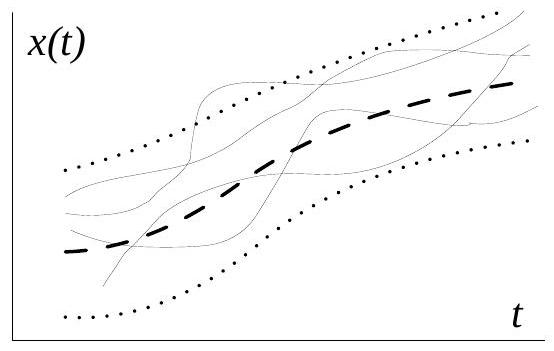
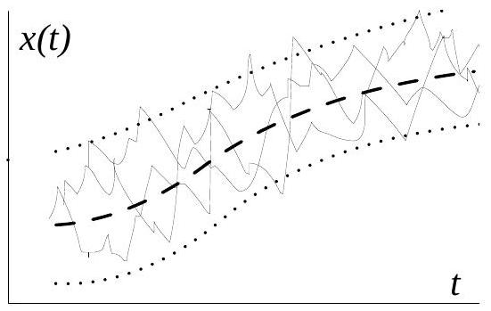

Они имеют одинаковое среднее (центральная пунктирная линия) и волатильность - точечный "коридор", нарисованный вокруг среднего. Тем не менее хорошо видно, что характер этих процессов различный, и правый имеет менее "гладкую" динамику ( $\lessdot \mathrm{C}_{12}$ ).

Поэтому важной характеристикой стохастического процесса является связь "прошлого" и "будущего". Определим автоковариацию между двумя моментами времени $t_{1}<t_{2} n p u$ условии, что при $t=t_{0}$ наблюдалось значение $x_{0}=x\left(t_{0}\right)$ :

$$
\begin{equation*}
\operatorname{cov}_{t_{0}}\left(t_{1}, t_{2}\right)=\left\langle\left(x_{t_{1}}-\bar{x}_{t_{1}}\right)\left(x_{t_{2}}-\bar{x}_{t_{2}}\right)\right\rangle, \tag{1.46}
\end{equation*}
$$

где $\bar{x}_{t}=\langle x(t)\rangle$ - среднее значение в момент времени $t$, а $x_{t_{i}}=x\left(t_{i}\right)$. Приставка "авто-" в названии подчёркивает, что ковариация вычисляется между величиной в момент времени $t_{1}$ и $e u^{\varkappa}$ же в другой момент $t_{2}$.

Среднее определяется при помощи условной плотности вероятности $P\left(x_{0}, t_{0} \Rightarrow x, t\right)$ и предполагает однократное интегрирование по $x$ [см. (1.44).] Фактически $\bar{x}_{t}$ зависит не только от $t$, но и от начальных условий $x_{0}$ и $t_{0}$. Для определения автоковариационной функции необходимо выполнить двойное интегрирование:

$$
\begin{equation*}
\operatorname{cov}_{t_{0}}\left(t_{1}, t_{2}\right)=\int_{-\infty}^{\infty}\left(x_{1}-\bar{x}_{1}\right)\left(x_{2}-\bar{x}_{2}\right) P\left(x_{0}, t_{0} \Rightarrow x_{1}, t_{1} ; x_{2}, t_{2}\right) d x_{1} d x_{2} \tag{1.47}
\end{equation*}
$$

где $P\left(x_{0}, t_{0} \Rightarrow x_{1}, t_{1} ; x_{2}, t_{2}\right)$ - плотность совместной вероятности значений $x_{1}$ и $x_{2}$ в моменты времени $t_{1}$ и $t_{2} n p u y c л о в u u$, что в момент времени $t_{0}$ мы имеем $x_{0}=x\left(t_{0}\right)$.

Эту вероятность можно выразить через марковские условные вероятности. По определению (опуская для краткости времена):

$$
\begin{equation*}
P\left(x_{0} \Rightarrow x_{1}, x_{2}\right)=\frac{P\left(x_{0}, x_{1}, x_{2}\right)}{P\left(x_{0}\right)} . \tag{1.48}
\end{equation*}
$$

Для трёхточечной совместной вероятности $P\left(x_{0}, x_{1}, x_{2}\right)$ запишем цепочку марковских вероятностей [см. (1.42), стр. 37]:

$$
P\left(x_{0}, x_{1}, x_{2}\right)=P\left(x_{0}\right) P\left(x_{0} \Rightarrow x_{1}\right) P\left(x_{1} \Rightarrow x_{2}\right) .
$$

Подставляя её в формулу (1.48) и "возвращая" моменты времени, окончательно получим:

$$
\begin{equation*}
P\left(x_{0}, t_{0} \Rightarrow x_{1}, t_{1} ; x_{2}, t_{2}\right)=P\left(x_{0}, t_{0} \Rightarrow x_{1}, t_{1}\right) P\left(x_{1}, t_{1} \Rightarrow x_{2}, t_{2}\right) . \tag{1.49}
\end{equation*}
$$

Для независимых величин $x_{1}$ и $x_{2}$ совместная плотность вероятности равна произведению плотностей вероятности каждой из переменных. В марковских процессах для условных вероятностей это тоже происходит, но функции "цепляются" друг за друга, в нашем случае - аргументом $x_{1}$. Поэтому в (1.47) нельзя разделить интегралы, и автоковариация в общем случае не равна нулю.

Индекс начального момента времени $t_{0}$ в записи автоковариационного коэффициента мы будем часто опускать, однако он всегда подразумевается. Как и для волатильности случайной величины, автоковариацию можно вычислять по эквивалентной формуле:

$$
\begin{equation*}
\operatorname{cov}\left(t_{1}, t_{2}\right)=\left\langle x_{t_{1}} x_{t_{2}}\right\rangle-\left\langle x_{t_{1}}\right\rangle\left\langle x_{t_{2}}\right\rangle, \tag{1.50}
\end{equation*}
$$

где мы перемножили в определении (1.46) скобки и разбили среднее суммы на сумму средних. Заметим, что автоковариация при $t_{1}=t_{2}=t$ равна дисперсии процесса: $\sigma^{2}(t)=\operatorname{cov}(t, t)$.

Автокорреляция является нормированной автоковариацией и определяется следующим образом:

$$
\begin{equation*}
\rho\left(t_{1}, t_{2}\right)=\frac{\operatorname{cov}\left(t_{1}, t_{2}\right)}{\sigma\left(t_{1}\right) \sigma\left(t_{2}\right)} . \tag{1.51}
\end{equation*}
$$

Как и для обычных случайных величин, автокорреляция является мерой возможности прогнозирования будущего значения $x_{2}=x\left(t_{2}\right)$, если наблюдается $x_{1}=x\left(t_{1}\right)$. При этом и $x_{1}$, и $x_{2}$ являются случайными величинами. Детерминированным обычно считается только начальное условие $x_{0}=x\left(t_{0}\right)$, хотя и это не обязательно.

## 1.9 Мартингалы и бесплатный сыр*

Бесплатного сыра, как известно, не бывает. Этот эвристический принцип оказывается мощным и конструктивным в теории финансов.

Если цена при блуждании в среднем не изменяется, $\langle x\rangle=x_{0}$, то такую модель называют мартингалом. Для неё лучшим прогнозом будущей цены будет текущее значение $x_{0}$. Это очень общая математическая концепция. Например, в дискретной аддитивной модели $x=x_{0}+\varepsilon_{1}+\ldots+\varepsilon_{n}$ для её мартингальности не требуется независимость и стационарность случайных изменений $\varepsilon_{i}$ цены. Два последовательных изменения могут быть скоррелированы, и $P\left(\varepsilon_{1}, \ldots, \varepsilon_{n}\right) \neq P\left(\varepsilon_{1}\right) \cdot \ldots \cdot P\left(\varepsilon_{n}\right)$. Единственное, что требуется, - это неизменность цены в среднем при любом $n$ :

$$
\int_{-\infty}^{\infty}\left(\varepsilon_{1}+\ldots+\varepsilon_{n}\right) P\left(\varepsilon_{1}, \ldots, \varepsilon_{n}\right) d \varepsilon_{1} \ldots d \varepsilon_{n}=0 .
$$

Таким образом, среднее значение накопленного изменения цены оказывается равным нулю и $\langle x\rangle=x_{0}$. Для мартингального процесса не имеет значения, когда начинается и заканчивается накопление изменения. На любом интервале времени оно должно быть нулевым. Чтобы проиллюстрировать этот важный момент, рассмотрим двухшаговое дискретное блуждание по дереву:
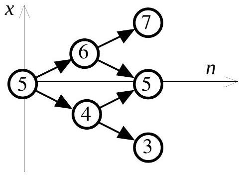
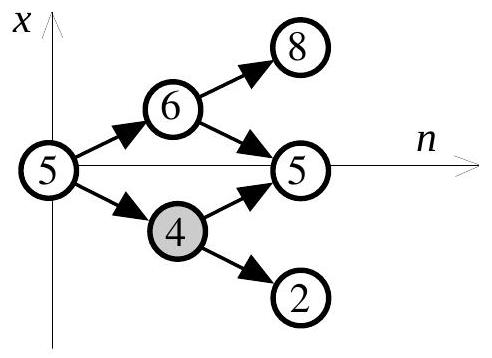

Из начальной цены $x_{0}=5$ возможны равновероятные переходы к ценам 6 и 4 и т.д. по дереву. На рисунках представлены два различных процесса. В обоих случаях на втором этапе вероятности состояний равны $\{1 / 4,1 / 2,1 / 4\}$ и среднее значение цены равно начальному:

$$
0.25 \cdot 7+0.5 \cdot 5+0.25 \cdot 3=5, \quad 0.25 \cdot 8+0.5 \cdot 5+0.25 \cdot 2=5
$$

Однако для правого процесса это свойство нарушается в промежуточных состояниях. Рассмотрим нижний узел первого ветвления с ценой 4. Если мы находимся в нём, то среднее значение будущей цены отлично от четырех: $0.5 \cdot 5+0.5 \cdot 2=3.5 \neq 4$. Поэтому второй процесс не является мартингалом и позволяет заработать, начиная с состояний 4 или 6 .

- При обсуждении стохастических процессов в литературе часто используют достаточно формальные обозначения. Следуя Колмогорову, который построил аксиоматику теории вероятностей, говорят о вероятностном пространстве. Оно определяется тройкой ( $\Omega, \mathcal{F}, \mathbf{P}$ ), где $\Omega-$ пространство элементарных событий, $\mathcal{F}-\sigma$-алгебра событий и $\mathbf{P}-$ распределение вероятностей. Разберёмся с каждым из этих понятий.

Пространство элементарных событий $\Omega$ представляет собой множество простейших, не делимых далее событий, которые не могут произойти одновременно (попарно несовместные). Например, при броске игральной кости это пространство состоит из шести возможных событий, соответствующих выпадению тех или иных очков: $\Omega=\{1,2,3,4,5,6\}$.

Алгебра событий $\mathcal{F}$ - это множество всех возможных составных событий, включая элементарные. Для броска кости примерами таких событий могут быть $A=$ "число делится на 3 " $=\left(\begin{array}{ll}3 & 6\end{array}\right)$ и $B=$ "число больше $4^{\prime \prime}=(56)$. Над событиями возможны операции объединения $A+B$, пересечения $A \cdot B$ и отрицания $\bar{A}$ (стр. 298). В результате получаются новые события. Множество $\mathcal{F}$ является замкнутым, т.е. эти три операции всегда приводят к событиям, находящимся в $\mathcal{F}$. Множества и операции, обладающие таким свойством, называют $\sigma$-алгеброй.

Распределение вероятностей $\mathbf{P}$ - это функция $p: A \mapsto P(A): A \in \mathcal{F}$, которая ставит в соответствие каждому событию $A$ из $\mathcal{F}$ вещественное число $0 \leqslant p \leqslant 1$. Другими словами, это вероятности всех возможных событий. Указание вероятностей $\mathbf{P}(\mathcal{F})$, а не $\mathbf{P}(\Omega)$, существенно для задач, в которых событий из $\Omega$ бесконечно много и они несчётны. Вероятность каждого из них может быть равна нулю. Так, равна нулю вероятность конкретного значения $x$ непрерывной случайной величины. В то же время составное событие из $\mathcal{F}$ может иметь отличную от нуля вероятность (например, вероятность попадания в некоторый конечный интервал).

Случайной величиной $x$ называется объект, возможные реализации которого попадают в те или иные элементы алгебры событий $\mathcal{F}$. Если $x-$ вещественная величина, то в $\mathcal{F}$ находятся все возможные отрезки вещественной оси, в которых может находиться $x$. Соответственно, $\mathbf{P}$ определяет вероятности попаданий $x$ в такие отрезки.

Случайный процесс $x(t)$ - это дискретное $x_{t}=x_{1}, x_{2}, \ldots$ или непрерывное $x(t)$ упорядоченное множество случайных величин, которые могут быть, например, ценами финансового инструмента в различные моменты времени. Случайный процесс можно также рассматривать, как многомерную случайную величину $\mathbf{x}=\left(x_{1}, x_{2}, \ldots, x_{t}\right)$.

- Конкретная история значений случайного процесса $x(t)$ является элементом множества алгебры событий $\mathcal{F}$ случайного процесса. Если рассматриваются цены до момента времени $t$ включительно, то такую историю обычно обозначают в виде $\mathcal{F}_{t}$. Для дискретного случайного процесса $\mathcal{F}_{t}$ имеет вид:

$$
\mathcal{F}_{t}=\ldots, x_{t-2}, x_{t-1}, x_{t}
$$

В общем случае это бесконечная последовательность, идущая из прошлого.

Если известна некоторая история, то для данного процесса существует определённая вероятность появления следующего значения. Эта вероятность является условной, так как описывает наступление события при условии реализации данной истории.

Среднее значение случайного процесса в момент времени $t_{i}$ при условии реализации той или иной истории $\mathcal{F}_{j}=\ldots, x_{j-1}, x_{j}$ часто обозначают следующим образом:

$$
\mathbf{E}\left(x_{i} \mid \mathcal{F}_{j}\right)=\left\langle x_{i}\right\rangle_{j}=\int x P\left(\ldots ; x_{j-1}, t_{j-1} ; x_{j}, t_{j} \Rightarrow x_{i}, t_{i}\right) d x_{i}
$$

Мартингалом называют такой случайный процесс, для которого

$$
\begin{equation*}
\mathbf{E}\left(x_{i} \mid \mathcal{F}_{j}\right)=x_{j}, \quad j \leqslant i . \tag{1.52}
\end{equation*}
$$

Другими словами, среднее значение цены в момент времени $t_{i}$ равно последнему известному историческому значению в момент $t_{j}$.

Для марковских процессов, которые мы обсуждаем в этих лекциях, вероятность $x(t)$ зависит только от его значения в прошлом $x\left(t_{0}\right)$ и не зависит от всей предыдущей истории. Марковский процесс будет мартингальным, если для любых моментов времени $t_{0}<t$ выполняется соотношение:

$$
\mathbf{E}\left(x(t) \mid x\left(t_{0}\right)\right) \equiv\langle x(t)\rangle_{x\left(t_{0}\right)}=\int_{-\infty}^{\infty} x P\left(x_{0}, t_{0} \Rightarrow x, t\right) d x=x\left(t_{0}\right)=x_{0}
$$

где индекс у знака среднего обозначает усреднение с условной вероятностью $P\left(x_{0}, t_{0} \Rightarrow x, t\right)$. Моменты времени могут быть номерами на дискретной сетке или вещественными числами в модели непрерывного времени. Чаще всего мы считаем цены финансовых инструментов положительными величинами. В таких случаях плотность вероятности $P=0$ при $x<0$, и, следовательно, интегрирование реально будет происходить от нуля до плюс бесконечности.

- Если средняя цена случайного процесса со временем не уменьшается, то он называется сублартингалом, а если не увеличивается - супермартингалом. В обозначениях условного среднего субмартингал определяется следующим образом:

$$
\mathbf{E}\left(x_{i} \mid \mathcal{F}_{j}\right) \geqslant x_{j} .
$$

Аналогично для супермартингала:

$$
\mathbf{E}\left(x_{i} \mid \mathcal{F}_{j}\right) \leqslant x_{j} .
$$

Каждый мартингал является и субмартингалом, и супермартингалом. Понятно, что если процесс одновременно обладает обоими свойствами, то он является мартингалом.

Рассмотрим простой пример. Пусть подбрасывается монета, и при выпадении "орла" один игрок платит другому доллар, а при выпадении "решки" - наоборот. Тогда накопленная сумма у каждого игрока является стохастическим процессом, так как она случайно изменяется со временем. Если монета симметрична и вероятность выпадения каждой из сторон $p=1 / 2$, то капитал каждого игрока является мартингалом. При смещённом центре тяжести $p \neq 1 / 2$ для проигрывающего в среднем игрока это будет супермартингал, а для выигрывающего - субмартингал.

- Мартингальные процессы оказываются удобной и очень общей моделью эффективного рынка, на котором нельзя гарантированно или в среднем получать прибыль. Если бы $\langle x\rangle$ в будущем было отлично от $x_{0}$, то при $\langle x\rangle>x_{0}$ такой финансовый инструмент имело бы смысл покупать, а при $\langle x\rangle<x_{0}$ - продавать, получая в среднем доход $\left|\langle x\rangle-x_{0}\right|$. На самом деле, цены на многих рынках в долгосрочной перспективе растут. Например, рост экономики сопровождается ростом фондовых рынков. Однако, в силу их существенной волатильности, на относительно краткосрочных интервалах времени мартингальная модель вполне адекватна. Она обычно лежит в основе вычисления справедливых цен опционов и других производных ценных бумаг.

В заключение отметим, что, при всей своей математической изящности, непрерывные стохастические процессы являются лишь моделью, причём достаточно ограниченной. На самом деле рынки имеют разрывную динамику, так как существуют периоды времени, когда они закрыты и торговля не ведётся. Достаточно искусственным является также допущение о непрерывности торговли в ультракоротких периодах времени. Тем не менее, аппарат непрерывных стохастических процессов достаточно эффективно используется в вычислительных финансах и является обязательным инструментом любого финансового аналитика.

## Глава 2

## Стохастические уравнения

Эта глава является ключевой. В ней вводится основной математический объект нашего интереса - стохастические дифференциальные уравнения. Мы будем использовать максимально неформальный, интуитивный путь, считая, что получение конкретных практических результатов важнее, чем математически строгое их обоснование.

Стохастические уравнения представляют собой достаточно естественный непрерывный по времени предел дискретных случайных процессов, рассмотренных в предыдущей главе. Даже решая непрерывное уравнение, мы будем постоянно возвращаться к его дискретному аналогу, как для получения общих аналитических результатов, так и для численного моделирования. Исключительно важным результатом главы является лемма Ито, при помощи которой мы научимся находить точные решения уравнений в некоторых простых, но важных для практических приложений задачах. Затем обсуждаются способы вычисления автокорреляционной функции случайного процесса и его спектральные свойства. В заключение мы затронем тему систем уравнений, к которой более последовательно вернёмся в шестой главе.

## 2.1 Уравнение Ито

- Рассмотрим дискретную модель блуждания (стр. 34), в которой, кроме случайных толчков $\varepsilon_{i}$, на каждом шаге происходит постоянный сдвиг $x$ на величину $\mu_{0}$. Через $n$ таких шагов результирующее значение $x$ будет равно:

$$
\begin{equation*}
x=x_{0}+\mu_{0} n+\sigma_{0} \sqrt{n} \varepsilon \tag{2.1}
\end{equation*}
$$

Параметр $\mu_{0}$ называют " сносом" процесса. Если $\mu_{0}>0$, то траектория постепенно (в среднем) будет сдвигаться вверх, иначе - вниз. Накопленное стохастическое изменение $\varepsilon_{1}+\ldots+\varepsilon_{n}=\varepsilon \sqrt{n}$ пропорционально гауссовой переменной $\varepsilon \sim N(0,1)$ с нулевым средним и единичной дисперсией.

Пусть длительность каждого шага $-\Delta t$, и в течение времени $t-t_{0}$ их количество равно $n=\left(t-t_{0}\right) / \Delta t$. Обозначим дисперсию за единицу времени через $\sigma^{2}=\sigma_{0}^{2} / \Delta t$, а снос $\mu=\mu_{0} / \Delta t$. В результате $x$ становится случайной функцией, которую можно записать в следующем виде:

$$
\begin{equation*}
x(t)=x\left(t_{0}\right)+\mu \cdot\left(t-t_{0}\right)+\sigma \sqrt{t-t_{0}} \varepsilon \tag{2.2}
\end{equation*}
$$

В зависимости от значения случайного гауссового числа $\varepsilon$ будет получаться то или иное $x$ в момент времени $t$. Таким образом, процесс $x(t)$ имеет нормальное распределение с максимумом, сдвигающимся со скоростью $\mu$, и с шириной, увеличивающейся со временем пропорционально корню $\sqrt{t-t_{0}}$.

Рассмотрим теперь изменение $d x=x(t)-x\left(t_{0}\right)$ за бесконечно малый интервал $d t=t-t_{0}$. В этом случае из (2.2) следует:

$$
\begin{equation*}
d x=\mu d t+\sigma \delta W \tag{2.3}
\end{equation*}
$$

где введено формальное обозначение $\delta W=\varepsilon \sqrt{d t}$. В отличие от обычных дифференциальных уравнений вида $d x=a(x, t) d t$, подобное уравнение содержит бесконечно малое изменение по времени в степени $1 / 2$. Чтобы подчеркнуть эту необычность, мы используем символ " $\delta$ ", а не " $d$ ". Процесс, подчиняющийся уравнению (2.3), называется непрерывным винеровским процессом.

Так как мы рассматриваем предел бесконечного числа аддитивных изменений ( $n \rightarrow \infty$ ), то гауссовость величин $\varepsilon_{i}$ на самом деле не важна. В силу вычислений на стр. 29 , сумма большого числа независимых случайных величин окажется гауссовой величиной. Важным является факт их независимости, в результате которого возникает множитель $\sqrt{t}\left(\lessdot \mathrm{C}_{13}\right)$.

- Общие процессы Ито представляют собой "деформацию" простого винеровского блуждания при помощи функций $a(x, t)$ и $b(x, t)$. Предположим, что снос $\mu$ и волатильность $\sigma$ - это функции времени $t$, которые могут также зависеть от значения $x$ :

$$
\begin{equation*}
d x=a(x, t) d t+b(x, t) \delta W \tag{2.4}
\end{equation*}
$$

где $\delta W=\varepsilon \sqrt{d t}$ - бесконечно малый винеровский "шум", а $\varepsilon \sim N(0,1)$. Функция $a(x, t)$ называется коэффициентом $c \mu o c a$, а $b(x, t)$ - коэффициентом волатильности, квадрат которого $b^{2}(x, t)$ называют диффузией. Локально, если функции $a(x, t)$ и $b(x, t)$ примерно постоянны, процесс Ито - это обычное аддитивное винеровское блуждание, постепенно изменяющее свои свойства ( ⟵ $\mathrm{C}_{14}$ ).

- Уравнение Ито (2.4) позволяет легко моделировать временную динамику произвольного стохастического процесса при помощи итерационной схемь

$$
\begin{equation*}
x_{k+1}=x_{k}+a\left(x_{k}, t_{k}\right) \Delta t+b\left(x_{k}, t_{k}\right) \sqrt{\Delta t} \varepsilon_{k} . \tag{2.5}
\end{equation*}
$$

Для этого выбирается малый интервал времени $\Delta t$ и начальное значение $x_{0}$. Затем генерится нормально распределённое случайное число $\varepsilon_{1}$ и вычисляется следующее значение $x_{1}$. После чего $x_{1}$ подставляется на место $x_{0}$, время сдвигается $t_{1} \Rightarrow t_{0}+\Delta t$. В результате получается последовательность случайных чисел $x_{0}, x_{1}, x_{2}, \ldots$ Соответствующий график имеет характерную фрактальную изломанность, типичную для динамики цен финансовых инструментов или блуждающей броуновской частицы. Заметим, что на каждой итерации генерится новое случайное число $\varepsilon_{k}$.

Сходимость итерационной процедуры (2.5) имеет одну особенность. Решая обычное дифференциальное уравнение $d x=a(x, t) d t$ в разностях $x_{k+1}=x_{k}+a\left(x_{k}, t_{k}\right) \Delta t$, мы предполагаем, что при заданных начальных условиях $x_{0}=x\left(t_{0}\right)$ решение в момент времени $t$ будет получаться примерно одно и то же, стремясь к некоторому пределу при уменьшении временного шага $\Delta t \rightarrow 0$. Однако для стохастических уравнений это абсолютно не так! Какой бы малый интервал $\Delta t$ мы не выбрали, за счёт случайных чисел $\varepsilon_{k}$ будут получаться различные траектории $x(t)$, удалённые друг от друга достаточно далеко.

Сходимость алгоритма (2.5) означает, что при уменьшении $\Delta t$ должны к определённому пределу стремиться среднее значение $\bar{x}(t)$, волатильность $\sigma(t)$ и функция распределения вероятностей $P\left(x_{0}, t_{0} \Rightarrow x, t\right)$ случайного процесса $x(t)$.

- Мы часто будем записывать решения стохастических уравнений при помощи скалярной случайной величины $\varepsilon$. Важно чётко понимать смысл такой символики. Пусть в начальный момент времени $t_{0}$ нам известно, что $x=x_{0}$. После этого $x$ начинает изменяться $x=x(t)$. В каждый фиксированный момент времени $t>t_{0}$ величина $x$ случайна. При помощи того или иного функционального преобразования можно выразить случайную величину с одним распределением через случайную величину с другим. Поэтому:

$$
\begin{equation*}
x=f\left(x_{0}, t_{0}, t, \varepsilon\right) \tag{2.8}
\end{equation*}
$$

означает, что случайная величина $x$ в момент времени $t$ выражается, например, через гауссову случайную переменную $\varepsilon$, а, следовательно, плотность вероятности $P\left(x_{0}, t_{0} \Rightarrow x, t\right)$ можно получить некоторым преобразованием из нормального распределения. При помощи (2.8) легко вычисляются разнообразные средние случайного процесса, так как свойства $\varepsilon$ хорошо известны.

Таким образом, в произвольный фиксированный момент времени $x(t)$ - это случайная величина, свойства которой определяются при помощи $\varepsilon$ и значения $t$. Время изменяется, и изменяются её свойства. В результате случайная величина $x$ превращается в процесс.

Если мы рассматриваем другой момент времени, мы должны использовать другую случайную величину $\varepsilon$. Пусть процесс наблюдается после $t_{0}$ в последовательные моменты времени $t_{1}$ и $t_{2}$, тогда:

$$
\begin{align*}
& x_{1}=f\left(x_{0}, t_{0}, t_{1}, \varepsilon_{1}\right)  \tag{2.9}\\
& x_{2}=f\left(x_{0}, t_{0}, t_{2}, \varepsilon_{2}\right)=f\left(x_{1}, t_{1}, t_{2}, \varepsilon_{3}\right) . \tag{2.10}
\end{align*}
$$

Первое уравнение (2.9) является решением в момент времени $t_{1}$. Величина $x_{0}$ - детерминированная константа, задаваемая начальными условиями. В противоположность ей $x_{1}$ - случайная величина. Её случайность определяется $\varepsilon_{1}$. Первое равенство уравнения (2.10) имеет аналогичный смысл. Однако $\varepsilon_{2}$ - это новая случайная величина. Заметим, что она, вообще говоря, статистически зависит от $\varepsilon_{1}$, так как знание значения $x_{1}$ (и, следовательно, $\varepsilon_{1}$ ) даёт нам дополнительную информацию о возможных значениях $x_{2}$. В частности, считая, что задано "начальное условие" $x_{1}=x\left(t_{1}\right)$, мы можем записать второе равенство в (2.10). Величина $\varepsilon_{3}$ определяет "случайность" после момента времени $t_{1}$, и, следовательно, она независима от $\varepsilon_{1}$. Второе равенство в (2.10) имеет смысл функи,иональной связи между случайными величинами $x_{2}$ и $x_{1}, \varepsilon_{3}$. Заметим, что функция $f$ во всех соотношениях (2.9), (2.10) одна и та же, а все случайные величины $\varepsilon_{i}$ имеют одинаковое распределение $N(0,1)$.

## 2.2 Остановка перед восхождением

Прежде чем изучать способы решения стохастических дифференциальных уравнений, имеет смысл остановиться и поразмышлять. Мы выбрали в качестве математической модели шума величину $\varepsilon \sqrt{d t}$. Она умножается на некоторую функцию $b(x, t)$ и, тем самым, может изменять со временем и значением $x$ свою волатильность (величину шума). Однако единственен ли подобный выбор?

- Что, если рассмотреть уравнения без корня от временного интервала? Пусть, например:

$$
d x=\varepsilon d t
$$

В этом случае скорость $d x / d t$ - это случайная величина с гауссовым распределением. Решим уравнение в разностях:

$$
x_{1}=x_{0}+\varepsilon_{1} \Delta t, \quad x_{2}=x_{1}+\varepsilon_{2} \Delta t=x_{0}+\left(\varepsilon_{1}+\varepsilon_{2}\right) \Delta t, \quad \ldots
$$

Через $n$ итераций получится сумма гауссовых чисел, которая статистически эквивалентна единственному гауссовому числу, умноженному на $\sqrt{n}$ :

$$
x=x_{0}+\left(\varepsilon_{1}+\ldots+\varepsilon_{n}\right) \Delta t=x_{0}+\varepsilon \sqrt{n} \Delta t .
$$

Записывая итерационные решения, мы предполагаем, что в конечном счёте необходимо будет сделать предельный переход $\Delta t \rightarrow 0, n \rightarrow \infty$. При этом произведение $n \Delta t=t$ равно конечному интервалу времени, прошедшему от начального момента $t_{0}=0$. Полученное решение имеет вид $x=x_{0}+\varepsilon \sqrt{t \Delta t}$, и при $\Delta t \rightarrow 0$ стремится к тривиальной константе $x_{0}$. Ни какой стохастической динамикой подобное уравнение не обладает.

- Рассмотрим другую возможность со случайным шумом, также пропорциональным $d t$ :

$$
d x=\varepsilon^{2} d t
$$

В этом случае решение имеет вид:

$$
x=x_{0}+\left(\varepsilon_{1}^{2}+\ldots+\varepsilon_{n}^{2}\right) \Delta t=u(n \Delta t)=u t
$$

где введена случайная величина:

$$
u=\frac{\varepsilon_{1}^{2}+\ldots+\varepsilon_{n}^{2}}{n}
$$

Каковы её статистические свойства? Так как для всех $\varepsilon_{i}$ справедливо $\left\langle\varepsilon^{2}\right\rangle=1$, то среднее значение $\langle u\rangle=1$. В пределе $n \rightarrow \infty, \Delta t \rightarrow 0$ мы получаем конечное решение, пропорциональное времени $t=n \Delta t$.

Найдём среднее значение квадрата $u$ :

$$
\begin{equation*}
\left\langle u^{2}\right\rangle=\frac{1}{n^{2}} \sum_{i, j=1}^{n}\left\langle\varepsilon_{i}^{2} \varepsilon_{j}^{2}\right\rangle=\frac{1}{n^{2}}\left[n\left\langle\varepsilon^{4}\right\rangle+\left(n^{2}-n\right)\left\langle\varepsilon^{2}\right\rangle^{2}\right]=1+\frac{2}{n} \tag{2.11}
\end{equation*}
$$

В сумме по $i$ и $j$ усредняются $n^{2}$ слагаемых. Из них $n$ имеют одинаковые индексы типа $\left\langle\varepsilon_{1}^{4}\right\rangle$, а оставшиеся $n^{2}-n$ слагаемых с различными индексами: $\left\langle\varepsilon_{1}^{2} \varepsilon_{2}^{2}\right\rangle$, и т.д. ( $\lessdot \mathrm{C}_{15}$ ). Так как случайные числа $\varepsilon_{i}$ независимы, то среднее их произведения равно произведению средних: $\left\langle\varepsilon_{1}^{2} \varepsilon_{2}^{2}\right\rangle=\left\langle\varepsilon_{1}^{2}\right\rangle\left\langle\varepsilon_{2}^{2}\right\rangle$. Кроме этого, для нормированных гауссовых величин мы имеем: $\left\langle\varepsilon^{2}\right\rangle=1$, $\left\langle\varepsilon^{4}\right\rangle=3$.

В результате дисперсия величины $u$ равна $\sigma_{u}^{2}=\left\langle u^{2}\right\rangle-\langle u\rangle^{2}=2 / n$ и стремится к нулю при $n \rightarrow \infty$. Это означает, что плотность вероятности $P(u)$ при $n \rightarrow \infty$ становится бесконечно узкой и высокой в окрестности значения $u=1$. Мы имеем дело с детерминированным числом! Этот результат не зависит от типа распределения $\varepsilon$ и предполагает только существование конечного момента четвёртого порядка $\left\langle\varepsilon^{4}\right\rangle$. Аналогичная ситуация и для уравнения $d x=\varepsilon^{m} d t\left(\lessdot \mathrm{H}_{8}\right)$.

Таким образом, члены вида $(\delta W)^{2}=\varepsilon^{2} d t$ в дифференциальном уравнении приводят к детерминированной динамике $x(t)=t$, такой же, как и в отсутствие $\varepsilon^{2}$. Это утверждение часто записывают в символическом виде "неслучайности" квадрата изменения винеровской переменной:

$$
\begin{equation*}
(\delta W)^{2} \quad \sim \quad d t \tag{2.12}
\end{equation*}
$$

Подобное соотношение необходимо понимать в смысле детерминированности бесконечной итерационной процедуры. Оно справедливо и в случае, когда $d x=\sigma(x, t) \varepsilon^{2} d t$, так как локально на малом интервале $\Delta t$ функцию $\sigma(x, t)$ всегда можно считать примерно постоянной. При этом возможно разбиение сколь угодно малого интервала $\Delta t$ на большое количество $n$ итерационных шагов.

- Мы видим, что альтернатив для записи малого шума Noise $\sim \varepsilon \sqrt{d t}$ не так и много. Только сочетание $\varepsilon$ с корнем из $d t$ сохраняет свою случайность при бесконечном итерационном решении уравнения. Поэтому уравнения Ито являются если и не единственным, то очень естественным методом введения шума в дифференциальные законы изменения величин со временем ( $\lessdot \mathrm{C}_{16}$ ).

Естественно, шум в реальных системах не обязательно будет аддитивен, как в (2.4). Например, параметр частоты осциллятора $\omega$ вполне может оказаться случайной величиной. Однако в этом случае для него можно рассматривать отдельное динамическое уравнение типа Ито и решать систему стохастических уравнений.

## 2.3 Лемма Ито

- Пусть процесс $x(t)$ подчиняется уравнению Ито. Рассмотрим обычную гладкую функцию $F(x, t)$. Если вместо $x$ в неё подставить $x(t)$, то $F(t)=F(x(t), t)$ станет случайным процессом. Покажем, что он также подчиняется диффузному уравнению Ито:

$$
\begin{equation*}
d F=A(x, t) d t+B(x, t) \delta W \tag{2.13}
\end{equation*}
$$

с $x=G(F, t)$, где $G$ - обратная к $F$ функция. Для этого необходимо найти функции сноса $A$ и волатильности $B$, а также убедиться, что моменты более высоких порядков равны нулю.

Разложим в ряд Тейлора $F(x, t)=F\left(x_{0}+\Delta x, t_{0}+\Delta t\right)$ в окрестности начального фиксированного значения $x_{0}$ по небольшим $\Delta x$ и $\Delta t$ :

$$
F(x, t)=F\left(x_{0}, t_{0}\right)+\frac{\partial F}{\partial x_{0}} \Delta x+\frac{1}{2} \frac{\partial^{2} F}{\partial x_{0}^{2}}(\Delta x)^{2}+\ldots+\frac{\partial F}{\partial t_{0}} \Delta t+\ldots,
$$

где все производные справа вычислены в точке $x_{0}, t_{0}$. Для ряда оставлен член второго порядка малости по $\Delta x$. При помощи (2.7) мы можем записать $(\Delta x)^{2}$ в следующем виде:

$$
(\Delta x)^{2}=\left(a_{0} \Delta t+b_{0} \varepsilon \sqrt{\Delta t}+\ldots\right)^{2}=b_{0}^{2} \varepsilon^{2} \Delta t+\ldots
$$

где оставлено ведущее приближение по $\Delta t$. Таким образом, если в начальный момент времени $t_{0}$ функция равна детерминированному числу $F_{0}=F\left(x_{0}, t_{0}\right)$, то через малый промежуток времени, в зависимости от значения $\varepsilon$, это будет случайная величина вида ( $\lessdot \mathrm{C}_{17}$ ):

$$
\begin{equation*}
F=F_{0}+\frac{\partial F}{\partial x_{0}}\left(a_{0} \Delta t+b_{0} \varepsilon \sqrt{\Delta t}\right)+\frac{b_{0}^{2}}{2} \frac{\partial^{2} F}{\partial x_{0}^{2}} \varepsilon^{2} \Delta t+\frac{\partial F}{\partial t_{0}} \Delta t+\ldots \tag{2.14}
\end{equation*}
$$

По определению (2.6) коэффициент сноса в пределе $\Delta t \rightarrow 0$ равен:

$$
A\left(x_{0}, t_{0}\right)=\frac{\left\langle F-F_{0}\right\rangle}{\Delta t}=a_{0} \frac{\partial F}{\partial x_{0}}+\frac{b_{0}^{2}}{2} \frac{\partial^{2} F}{\partial x_{0}^{2}}+\frac{\partial F}{\partial t_{0}}
$$

где подставлено разложение (2.14) для $F$ и учтено, что $\langle\varepsilon\rangle=0,\left\langle\varepsilon^{2}\right\rangle=1$. Аналогично, для коэффициента диффузии:

$$
B^{2}\left(x_{0}, t_{0}\right)=\frac{\left\langle\left(F-F_{0}\right)^{2}\right\rangle}{\Delta t}=b_{0}^{2}\left(\frac{\partial F}{\partial x_{0}}\right)^{2}
$$

Для моментов более высоких порядков в пределе $\Delta t \rightarrow 0$ получается ноль. Таким образом, это действительно диффузный процесс.

Выше упоминалось, что для записи стохастического дифференциального уравнения некоторого процесса необходимо вычислить условные средние его изменения первого и второго порядка. При этом следует убедиться, что моменты более высоких порядков при $\Delta t \rightarrow 0$ стремятся к нулю. Если этого не происходит, то процесс не является диффузным и не может быть записан в форме Ито (2.13). Поэтому необходима полная проверка "диффузности", проведенная выше.

Считая уравнение (2.14) первым вычислением в бесконечной итерационной схеме, мы можем также рассуждать аналогично разделу §2.2. Сумма слагаемых вида $\varepsilon^{2} \Delta t$ приводит к такому же детерминированному результату, как и в отсутствие $\varepsilon^{2}$. Поэтому можно положить $\varepsilon^{2} \rightarrow 1$.

Так как начальный момент был выбран произвольным образом, запишем дифференциал функции $F(x, t)$ в форме Ито при помощи бесконечно малой винеровской переменной $\delta W=\varepsilon \sqrt{d t}$ :

$$
\begin{equation*}
d F=\left(\frac{\partial F}{\partial t}+a(x, t) \frac{\partial F}{\partial x}+\frac{b^{2}(x, t)}{2} \frac{\partial^{2} F}{\partial x^{2}}\right) d t+b(x, t) \frac{\partial F}{\partial x} \delta W \tag{2.15}
\end{equation*}
$$

Это соотношение называется "леммой Ито". Оно играет очень важную роль в теории случайных процессов ( $\lessdot \mathrm{C}_{18}$ ).

Обратим внимание, что в отсутствие стохастики полный дифференциал функции $F(x, t)$, в которую подставили решение $x=x(t)$ уравнения $d x=a(x, t) d t$, имеет вид:

$$
\begin{equation*}
d F=\frac{\partial F}{\partial t} d t+\frac{\partial F}{\partial x} d x=\left(\frac{\partial F}{\partial t}+a(x, t) \frac{\partial F}{\partial x}\right) d t . \tag{2.16}
\end{equation*}
$$

В отличие от этого соотношения, в детерминированную часть леммы Ито проникают функция диффузии $b^{2}(x, t)$ и вторая производная по $x$. Происходит это, как мы видели, благодаря корню $\sqrt{d t}$. Это, в свою очередь, связано со свойствами простого аддитивного блуждания, которое является локальным приближением любого процесса Ито.

Для винеровского уравнения $d x=\mu d t+\sigma \delta W$ с постоянным сносом $\mu$ и волатильностью $\sigma$ дифференциал квадрата траектории $y=x^{2}$, в соответствии с (2.15), удовлетворяет нелинейному уравнению Ито:
$d\left(x^{2}\right)=\left(2 \mu x+\sigma^{2}\right) d t+2 \sigma x \delta W \quad=>\quad d y=\left(2 \mu \sqrt{y}+\sigma^{2}\right) d t+2 \sigma \sqrt{y} \delta W$.
Действуя в обратном направлении, при помощи подходящей замены и леммы Ито можно сводить одни уравнения к другим, решение которых нам известно. Рассмотрим этот подход подробнее.

## 2.4 Точные решения

- Несмотря на простой вид, стохастические уравнения (2.4) аналитически интегрировать не так и просто из-за винеровского члена $\delta W$. Это явно видно в случае конечной численной реализации (2.5). Каждое последовательное $x$ в итерационной процедуре нелинейным образом зависит от всех предыдущих случайных чисел $\varepsilon_{k}\left(\lessdot \mathrm{C}_{19}\right)$. Тем не менее, рассмотрим ситуации, в которых можно получить точные решения.

Пусть в процессе Ито функции сноса и волатильности зависят только от времени. Обозначим их через $f(t)$ и $s(t)$ :

$$
\begin{equation*}
d x=f(t) d t+s(t) \delta W \tag{2.17}
\end{equation*}
$$

Это уравнение легко интегрируется при помощи "дискретной" интерпретации стохастического члена $\delta W$. Рассмотрим итерации, выполняемые по разностной схеме (2.5):

$$
\begin{aligned}
& x_{1}=x_{0}+f_{0} \Delta t+s_{0} \varepsilon_{1} \sqrt{\Delta t} \\
& x_{2}=x_{1}+f_{1} \Delta t+s_{1} \varepsilon_{2} \sqrt{\Delta t}=x_{0}+\left(f_{0}+f_{1}\right) \Delta t+\left(s_{0} \varepsilon_{1}+s_{1} \varepsilon_{2}\right) \sqrt{\Delta t} \\
& \ldots,
\end{aligned}
$$

где $f_{k}=f\left(t_{k}\right)$ и $s_{k}=s\left(t_{k}\right)$. После $n$ итераций итоговое значение будет равно:

$$
x=x_{0}+\left(f_{0}+\ldots+f_{n-1}\right) \Delta t+\left(s_{0} \varepsilon_{1}+\ldots+s_{n-1} \varepsilon_{n}\right) \sqrt{\Delta t}
$$

Скобки в последнем слагаемом содержат сумму независимых гауссовых чисел, каждое из которых имеет волатильность $s_{k}$. В результате получается гауссово число с волатильностью $\sqrt{s_{0}^{2}+\ldots+s_{n-1}^{2}}$. Поэтому, переходя к непрерывному пределу, получаем ( ⟵ $\mathrm{H}_{9}$ ):

$$
\begin{equation*}
x(t)=x\left(t_{0}\right)+\int_{t_{0}}^{t} f(\tau) d \tau+\left[\int_{t_{0}}^{t} s^{2}(\tau) d \tau\right]^{1 / 2} \varepsilon \tag{2.18}
\end{equation*}
$$

Решение (2.18) уравнения (2.17) говорит нам, что $x(t)$ является нормально распределённым случайным числом со средним и дисперсией, зависящими от времени. Если $s(t)$ - не константа, то будущая неопределённость в значении $x$ может увеличиваться уже не как $\sqrt{t}$, а по другому закону.

Соотношение (2.18) позволяет легко вычислить статистические свойства процесса, в частности, его среднее $\bar{x}(t)$ и волатильность $\sigma(t)$.

- Одномерное уравнение Ито для процесса, имеющего произвольный снос $a(x, t)$ и волатильность $b(x, t)$

$$
\begin{equation*}
d x=a(x, t) d t+b(x, t) \delta W \tag{2.19}
\end{equation*}
$$

заменой иногда можно свести к частному случаю (2.17), для которого решение уже известно. Воспользуемся леммой Ито:

$$
\begin{equation*}
d F=\underbrace{\left(\frac{\partial F}{\partial t}+a(x, t) \frac{\partial F}{\partial x}+\frac{b^{2}(x, t)}{2} \frac{\partial^{2} F}{\partial x^{2}}\right)}_{f(t)} d t+\underbrace{b(x, t) \frac{\partial F}{\partial x}}_{s(t)} \delta W \tag{2.20}
\end{equation*}
$$

Подберем $F(x, t)$ таким образом, чтобы множители при $\delta W$ и $d t$ в (2.20) оказались функциями $s(t)$ и $f(t)$, зависящими только от времени:

$$
\begin{equation*}
\frac{\partial F}{\partial x}=\frac{s(t)}{b(x, t)}, \quad \frac{\partial F}{\partial t}+s(t)\left[\frac{a(x, t)}{b(x, t)}-\frac{1}{2} \frac{\partial b(x, t)}{\partial x}\right]=f(t) \tag{2.21}
\end{equation*}
$$

где вместо $\partial F / \partial x$ в множитель при $d t$ подставлено первое уравнение $(2.21)$ и его производная по $x\left(\lessdot \mathrm{H}_{10}\right)$. Возьмём частные производные первого уравнения (2.21) по $t$ и второго по $x$. Вычитая их, мы придём к условию совместности:

$$
\begin{equation*}
\frac{1}{s(t)} \frac{\partial}{\partial t}\left\{\frac{s(t)}{b(x, t)}\right\}=\frac{1}{2} \frac{\partial^{2} b(x, t)}{\partial x^{2}}-\frac{\partial}{\partial x}\left\{\frac{a(x, t)}{b(x, t)}\right\} \tag{2.22}
\end{equation*}
$$

$Е с л и$ при данных $a(x, t)$ и $b(x, t)$ можно подобрать такую функцию $s(t)$, при которой уравнение (2.22) обратится в тождество, то мы получим решение стохастического уравнения (2.19) в следующей неявной форме:

$$
\begin{equation*}
F(x(t), t)=F\left(x\left(t_{0}\right), t_{0}\right)+\int_{t_{0}}^{t} f(\tau) d \tau+\left[\int_{t_{0}}^{t} s^{2}(\tau) d \tau\right]^{1 / 2} \varepsilon \tag{2.23}
\end{equation*}
$$

где функция $f(t)$ определяется вторым соотношением (2.21), а $F(x, t)$ находится из первого уравнения (2.21) ( $\lessdot \mathrm{C}_{20}$ ).

Решение (2.23) - это нестационарный гауссовый процесс для деформации $x(t)$ при помощи нелинейной функции $F(x, t)$. Естественно, что разрешимость (2.22) позволяет интегрировать уравнение Ито только в ряде частных случаев. Однако, как мы увидим ниже, эти случаи охватывают достаточно широкий класс важных для практических приложений процессов.

## 2.5 Простые стохастические модели

- Логарифмическое блуждание определяется уравнением:

$$
\begin{equation*}
d x=\mu x d t+\sigma x \delta W \tag{2.24}
\end{equation*}
$$

где $\mu$ и $\sigma$ - константы модели. Часто (2.24) называют геометрическим или экспоненциальным броуновским блужданием.

Если стохастического члена нет ( $\sigma=0$ ), то это обычное уравнение экспоненциального роста ( $\mu>0$ ) или снижения ( $\mu<0$ ):

$$
\frac{d x}{d t}=\mu x \quad=>\quad x(t)=x_{0} e^{\mu t}
$$

Подобная зависимость возникает во многих физических, биологических и социальных системах, от радиоактивного распада до роста экономики.

Случайное воздействие вносит в гладкую динамику определённые коррективы. Подставим функции сноса $a(x, t)=\mu x$ и волатильности $b(x, t)= \sigma x$ в условие совместности (2.22) на стр. 57. В результате для $s(t)$ получается тривиальное уравнение $\dot{s}(t)=0$, где точка сверху обозначает производную по времени. Следовательно, $s(t)$ - это константа, которую удобно выбрать равной $\sigma$. Интегрирование первого уравнения (2.21) даёт $F(x, t)=\ln x$, и, соответственно, функция $f(t)$ равна $\mu-\sigma^{2} / 2$. Окончательное решение ( $t_{0}=0$ ) имеет вид:

$$
\begin{equation*}
x(t)=x_{0} e^{\left(\mu-\sigma^{2} / 2\right) t+\sigma \sqrt{t} \varepsilon} \tag{2.25}
\end{equation*}
$$

Если в процессе Винера $x$ может "уползти" при блуждании в область отрицательных значений $x<0$, то для логарифмической модели это невозможно. Подобное свойство можно было ожидать сразу по виду (2.24). По мере приближения к значению $x=0$ снос и волатильность уменьшаются. В результате динамика как бы замораживается при $x \rightarrow 0$.

Используя интеграл (1.11) на стр. 16, легко вычислить среднее значение и волатильность в произвольный момент времени:

$$
\bar{x}(t)=x_{0} e^{\mu t}, \quad \quad \sigma_{x}(t)=\bar{x}(t) \sqrt{e^{\sigma^{2} t}-1}
$$

Заметим, что необходимо решительно бороться с искушением "по обычному" обращаться со стохастическими уравнениями. Например, разделив (2.24) на $x$, нельзя внести его под дифференциал: $d x / x \neq d \ln x$. Для подобных действий служит лемма Ито (2.15) по которой для процесса логарифмического блуждания $d(\ln x)=\left(\mu-\sigma^{2} / 2\right) d t+\sigma \delta W$. Фактически, при помощи этой замены, найденной по алгоритму стр. 57, мы и получили решение (2.25).

Ниже на левом рисунке приведены логарифмические блуждания с нулевым сносом: $d x=x \delta W$. Видно, как они, прижимаясь к $x=0$, тем не менее, остаются в положительной области. В результате получается несимметричное распределение для $x$, которое в данном случае имеет логнормальный вид. Справа динамика дополнена детерминированным сносом: $d x=0.05 \cdot x \cdot(d t+\delta W)$. Она имеет ярко выраженный экспоненциальный рост со стохастическими колебаниями вокруг экспоненты.
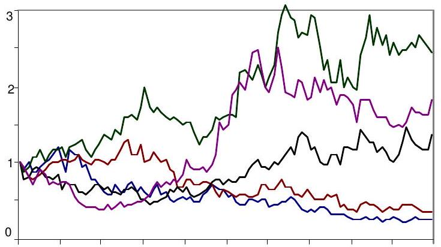
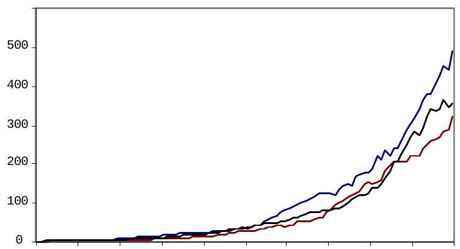

Эти два примера напоминают нам, что стохастические процессы могут быть как малыми поправками к детерминированной динамике (справа), так и основной сутью исследуемой системы (слева).

Введя винеровский процесс $W_{t}=W(t)=\varepsilon \sqrt{t}$, решение для логарифмического блуждания можно записать в следующем виде:

$$
x(t)=e^{\left(\mu-\sigma^{2} / 2\right) t+\sigma W_{t}} .
$$

Действительно, производные для $x(t)=F(t, W)$ равны:

$$
\frac{\partial x}{\partial t}=\left(\mu-\sigma^{2} / 2\right) x, \quad \frac{\partial x}{\partial W}=\sigma x, \quad \frac{\partial^{2} x}{\partial W^{2}}=\sigma^{2} x .
$$

Винеровское блуждание $W_{t}$ имеет нулевой снос $a=0$ и единичную волатильность $b=1$. Поэтому по лемме Ито (2.15) имеем:

$$
d x=\left(\frac{\partial x}{\partial t}+\frac{1}{2} \frac{\partial^{2} x}{\partial W^{2}}\right) d t+\frac{\partial x}{\partial W} \delta W=\mu x d t+\sigma x \delta W .
$$

Роль $x$ теперь играет процесс $W$, а функция $F$ - это $x$.
Задавая различные функции $x=F\left(t, W_{t}\right)$, удовлетворяющие начальному условию $x_{0}=F(0,0)$, можно найти целый класс точно решаемых стохастических уравнений. После подстановки $F\left(t, W_{t}\right)$ в лемму Ито необходимо исключить $W_{t}$, заменив её на $W_{t}=G(t, x)$, где $G$ - обратная к $F$ функция. Кроме этого константа $x_{0}$ должна сократиться, так как это "внешнее" к динамике условие и "порядочное уравнение" не должно зависеть от него. В качестве упражнения стоит проверить решения ( $\mathbf{R}_{38}$ ) $-\left(\mathbf{R}_{43}\right)$ из Справочника (стр. 276). K сожалению, чаще таким методом получаются уравнения, в которых снос зависит от волатильности шума, что не очень естественно для практических приложений.

- Процесс Орнитейна - Уленбека:

$$
\begin{equation*}
d x=-\beta \cdot(x-\alpha) d t+\sigma \delta W \tag{2.26}
\end{equation*}
$$

описывает блуждание, в котором $x$ притягивается к уровню, определяемому константой $\alpha$. При этом волатильность $\sigma$ считается постоянной. Если $x \gg \alpha$, то снос становится заметно отрицательным и тянет процесс вниз. При опускании $x$ ниже $\alpha$ снос оказывается положительным и в среднем поднимает $x(t)$ вверх. Параметр $\beta>0$ характеризует величину "силы притяжения" к равновесному значению $\alpha$.

Условие совместности (2.22) даёт уравнение $\dot{s}(t)=\beta s(t)$. Решая его и первое уравнение (2.21) для $F(x, t)$, мы каждый раз выбираем константы интегрирования наиболее "удобным способом", так как начальные условия уже учтены в (2.23), а нам необходимо найти простейшую замену, исключающую $x$ из сноса и волатильности:

$$
s(t)=\sigma e^{\beta t}, \quad F(x, t)=x e^{\beta t}, \quad f(t)=\alpha \beta e^{\beta t} .
$$

В результате решение записывается в следующем виде ( $t_{0}=0$ ):

$$
\begin{equation*}
x(t)=\alpha+\left(x_{0}-\alpha\right) e^{-\beta t}+\frac{\sigma}{\sqrt{2 \beta}} \sqrt{1-e^{-2 \beta t}} \varepsilon \tag{2.27}
\end{equation*}
$$

Несложно увидеть, что $x(t)$ оказывается гауссово распределённой величиной со средним и дисперсией, зависящими от времени.

Если $\beta>0$, то среднее при больших временах стремится к равновесному уровню $\alpha$. Волатильность становится равной $\sigma / \sqrt{2 \beta}$. При винеровском или логарифмическом блуждании $x(t)$ может уйти как угодно далеко от своего начального значения $x_{0}$. Для процесса (2.26) $x(t)$ "заперта" в статистическом коридоре с шириной, равной двойной волатильности $\sigma / \sqrt{2 \beta}$.

При малых $\beta$ процесс Орнштейна-Уленбека по своему поведению становится очень близким к обычному винеровскому блужданию. Траектория $x(t)$ достаточно долго блуждает выше или ниже $\alpha$, не уходя, тем не менее, на бесконечность. Волатильность стремится к $\sigma / \sqrt{2 \beta}$, и тем больше, чем меньше $\beta$. Следовательно, характерный коридор, в котором происходит блуждание, при малых $\beta$ расширяется. Если и $\sigma$, и $\beta$ достаточно большие, $x(t)$ часто пересекает равновесный уровень, начиная напоминать обычный белый шум.

Наличие равновесного уровня в модели Орнштейна-Уленбека полезно для различных финансовых приложений. Например, в случае курсов валют $\alpha$ может быть паритетом покупательной способности ( $\lessdot \mathrm{C}_{21}$ ), а для процентной ставки - её долгосрочным значением.

Примеры реализаций блуждания Орнштейна-Уленбека при различных параметрах приведены ниже. На левом рисунке $\beta=0.1, \sigma=0.1$. На правом $-\beta=1, \sigma=0.5$. Величина $\alpha$ в обоих случаях равна единице.
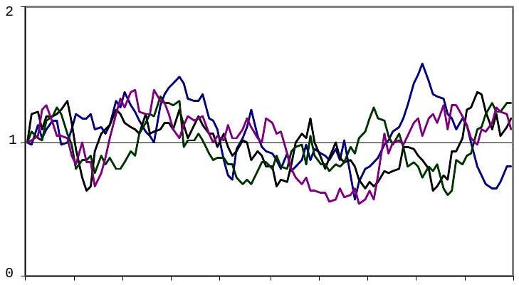
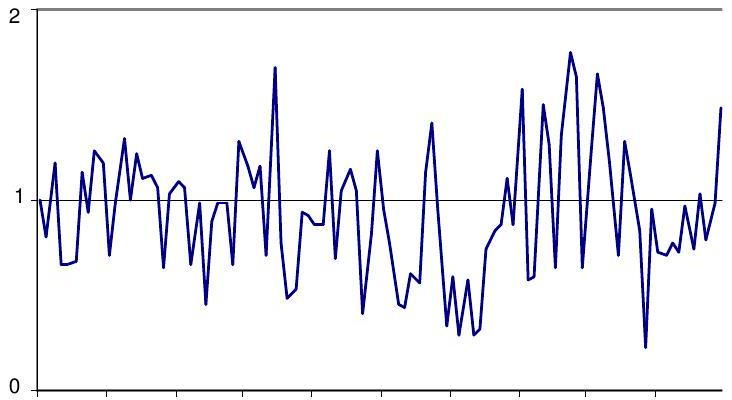

Необходимо помнить, что, если решение выражено через винеровскую переменную $W_{t}$, её всегда можно переписать через гауссову случайную величину, заменив $W_{t}=\varepsilon \sqrt{t}$. Обратное, вообще говоря, не верно. Если в решении есть $\varepsilon$, нельзя его выразить через $W_{t}$, подставив $\varepsilon \rightarrow W_{t} / \sqrt{t}$. В качестве упражнения имеет смысл проверить, что подобная замена в (2.27) приводит к случайной функции, не удовлетворяющей (2.26).

Можно объединить положительность $x$ и его притяжение к равновесному уровню в следующей логарифмической модели с притяжением:

$$
\begin{equation*}
d x=-\beta x \cdot\left(\ln \frac{x}{\alpha}-1\right) d t+\sigma x \delta W . \tag{2.28}
\end{equation*}
$$

Если $x>\alpha$, то снос отрицательный, а при $x<\alpha$ - положительный. Множитель $x$ "замораживает" динамику при приближении к $x=0$. Для этой модели несложно найти точное решение ( ⟵ $\mathrm{H}_{11}$ ).

На самом деле логарифмическая модель с притяжением является простой деформацией процесса Орнштейна-Уленбека. Действительно, если $x$ удовлетворяет уравнению (2.26), то несложно проверить, что $y=e^{x}$ будет удовлетворять (2.28). Уравнение (2.28) так же соотносится с (2.26), как логарифмическое блуждание с процессом Винера.

Ещё одну модель уместно назвать броуновской ловушкой:

$$
\begin{equation*}
d x=-\beta \cdot(x-\alpha) d t+\sigma \cdot(x-\alpha) \delta W . \tag{2.29}
\end{equation*}
$$

Член со сносом обеспечивает притяжение к уровню $x=\alpha$, в окрестности которого волатильность становится очень маленькой, а динамика - детерминированной. В результате процесс рано или поздно гарантированно притягивается к значению $x=\alpha\left(\lessdot \mathrm{H}_{12}\right)$.

- Можно рассмотреть общее стационарное уравнение, снос и волатильность которого не зависят от времени:

$$
d x=a(x) d t+b(x) \delta W
$$

Условие совместности записывается следующим образом:

$$
\begin{equation*}
\frac{\dot{s}(t)}{s(t)}=\frac{1}{2} b b^{\prime \prime}-b\left(\frac{a}{b}\right)^{\prime}=\gamma \tag{2.30}
\end{equation*}
$$

где штрих производная по $x$, точка - по времени, и опущены аргументы у функций. Левая часть зависит только от времени, правая - только от $x$, поэтому это выражение равно некоторой константе, которую мы обозначили через $\gamma$. Проинтегрировав это уравнение, найдём связь между сносом и волатильностью:

$$
a=\frac{\left(b^{2}\right)^{\prime}}{4}+\eta b-\gamma b \int \frac{d x}{b}
$$

где $\eta$ - ещё один параметр.
Если $b(x)=\sigma=$ const - мы приходим к уравнению ОрнштейнаУленбека (2.26), стр. 60. Для $b(x)=\sigma x$ точно решаемой задачей является логарифмическая модель с притяжением (2.28), частным случаем которой является логарифмическое блуждание. При $b(x)=\sigma \sqrt{x}$ снос должен явным образом зависеть от $\sigma$ :

$$
a(x)=\frac{\sigma^{2}}{4}+\alpha \sqrt{x}+2 \beta x
$$

Решение такого уравнения имеет вид ( $x_{0}=x(0), \beta>0$ ):

$$
x(t)=\left[\sqrt{x_{0}} e^{\beta t}+\frac{\alpha}{2 \beta}\left(e^{\beta t}-1\right)+\frac{\sigma}{\sqrt{8 \beta}} \sqrt{e^{2 \beta t}-1} \varepsilon\right]^{2}
$$

Если $a(x) / b(x)=$ const, или сноса при блуждании нет $a(x)=0$, то условие совместности (2.30) упрощается:

$$
\frac{b^{\prime \prime}}{2}=\frac{\gamma}{b}
$$

Умножая его на интегрирующий множитель $b^{\prime}$, получаем решение в неявной форме:

$$
x-\alpha=\int \frac{d b}{\sqrt{\beta+4 \gamma \ln b}}
$$

где $\alpha$ и $\beta$ - константы интегрирования.

- Броуновский мост. Рассмотрим теперь уравнение Ито со сносом, зависящим не только от $x$, но и от времени $t$ :

$$
\begin{equation*}
d x=-\frac{x-\alpha}{T-t} d t+\sigma \delta W \tag{2.31}
\end{equation*}
$$

Константа $T$ - это выделенное время в будущем ( $t<T$ ), когда снос становится бесконечным. Условие совместности даёт:

$$
\begin{equation*}
s(t)=\frac{\sigma}{T-t}, \quad F(x, t)=\frac{x}{T-t}, \quad f(t)=\frac{\alpha}{(T-t)^{2}} \tag{2.32}
\end{equation*}
$$

В результате получаем решение в следующем виде $\left(x_{0}=x\left(t_{0}\right)\right)$ :

$$
x(t)=\alpha+\left(x_{0}-\alpha\right) \frac{T-t}{T-t_{0}}+\sigma \sqrt{\frac{\left(t-t_{0}\right)(T-t)}{T-t_{0}}} \varepsilon .
$$

Среднее процесса при $t \rightarrow T$ стремится к $\alpha$. При этом волатильность оказывается равной нулю. Это означает, что $x(t)$ гарантированно в процессе блуждания достигает равновесного значения $x(T)=\alpha$ :
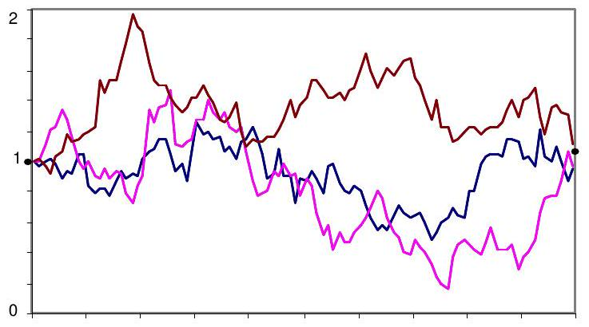
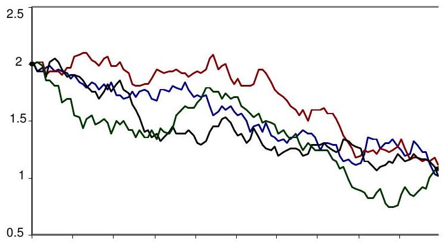

На рисунках в обоих случаях $\alpha=1$. Слева $\sigma=0.1$, справа $\sigma=0.05$. Соединение начального условия $x_{0}=x(0)$ и "конечного" $x(T)=\alpha$ стохастическими траекториями и дало живописное название процессу.

Можно рассмотреть броуновский мост в более общем случае, с произвольными коэффициентами, зависящими от времени:

$$
d x=-\beta(t) \cdot(x-\alpha(t)) d t+\sigma(t) \delta W
$$

Условия совместности дают:

$$
s(t)=\sigma(t) e^{\int_{t_{0}}^{t} \beta(t) d t}, \quad F(x, t)=x \frac{s(t)}{\sigma(t)}, \quad f(t)=\alpha(t) \beta(t) \frac{s(t)}{\sigma(t)}
$$

Для частного выбора $\beta(t)=\beta /(T-t), \alpha(t)=\alpha, \sigma(t)=\sigma$, где $\alpha, \beta, T$ и $\sigma$ - константы модели, получаем решение в следующем виде ( $t_{0}=0$ ):

$$
x(t)=\alpha+\frac{x_{0}-\alpha}{T^{\beta}}(T-t)^{\beta}+\sigma\left[\frac{(T-t)}{2 \beta-1}\left(1-\frac{(T-t)^{2 \beta-1}}{T^{2 \beta-1}}\right)\right]^{1 / 2} \varepsilon
$$

Заданием функции $\alpha(t)$ можно добиться произвольного выгиба "моста" вверх или вниз.

## 2.6 Представление решений

- Мы записываем решения стохастических уравнений с начальным условием $x_{0}=x\left(t_{0}\right)$ при помощи одной или нескольких случайных величин $\varepsilon$ и гладкой функции времени: $x(t)=f\left(x_{0}, t_{0}, t, \varepsilon\right)$. Так как свойства $\varepsilon$ обычно хорошо известны, такое представление позволяет легко находить разнообразные средние и марковскую плотность условной вероятности $P\left(x_{0}, t_{0} \Rightarrow x, t\right)$.

Сама по себе функция $f$ не позволяет нарисовать одиночную траекторию. Если мы сгенерим некоторое конкретное число $\tilde{\varepsilon}$, то $x(t)$ не будет графиком случайного процесса. Это обычная гладкая функция. Например, для винеровского процесса без сноса:

$$
\begin{equation*}
x(t)=x_{0}+\varepsilon \sqrt{t-t_{0}} . \tag{2.33}
\end{equation*}
$$

Никаких изломов, типичных для случайного процесса, тут, конечно, нет. Дело в том, что для получения свойств $x(t)$ в каждый момент времени необходимо генерить различные случайные числа $\varepsilon$.

Тем не менее, благодаря "марковости" процессов "начальные" условия $\left(x_{0}, t_{0}\right)$ могут быть значением случайной функции на любом этапе эволюции. В частности, мы можем записать следующую цепочку решений:

$$
\begin{aligned}
& x_{1}=f\left(x_{0}, t_{0}, t_{1}, \varepsilon_{1}\right) \\
& x_{2}=f\left(x_{1}, t_{1}, t_{2}, \varepsilon_{2}\right) \\
& x_{3}=f\left(x_{2}, t_{2}, t_{3}, \varepsilon_{3}\right), \ldots,
\end{aligned}
$$

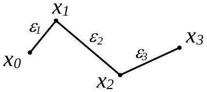

где интервалы времени $t_{i}-t_{i+1}-$ произвольны. Так как случайные переходы от одного момента времени ( $x_{i}, t_{i}$ ) к следующему ( $x_{i+1}, t_{i+1}$ ) не перекрываются, случайные числа $\varepsilon_{1}, \varepsilon_{2}, \varepsilon_{3} \ldots$ являются статистически независимыми. Это позволяет вычислять средние, относящиеся к различным моментам времени, и строить выборочные траектории. При этом возникают последовательности вложенных функций, например:

$$
x_{2}=f\left(f\left(x_{0}, t_{0}, t_{1}, \varepsilon_{1}\right), t_{1}, t_{2}, \varepsilon_{2}\right) .
$$

В случае винеровского блуждания, выбирая равный интервал $\tau$ между последовательными моментами времени, мы получим:

$$
x_{t}=x_{0}+\sum_{k=1}^{t} \varepsilon_{k} \sqrt{\tau} .
$$

Хотя выражение для $x_{t}$ похоже на итерационную схему, это, на самом деле, точное соотношение, и $\tau$ может быть сколь угодно большим.

- Существуют и другие способы представления траектории случайного процесса. Рассмотрим для примера разложение Палея-Винера винеровского блуждания на интервале времени $t=[0 . . T]$ :

$$
\begin{equation*}
x(t)=x_{0}+\varepsilon_{0} \frac{t}{\sqrt{T}}+\sqrt{2 T} \sum_{k=1}^{\infty} \varepsilon_{k} \frac{\sin (\pi k t / T)}{\pi k}, \tag{2.34}
\end{equation*}
$$

где $\varepsilon_{k} \sim N(0,1)$ - независимые нормально распределённые случайные величины. Это разложение имеет такие же статистические свойства, как и существенно более простая запись (2.33). Чтобы в этом убедиться, вычислим среднее квадрата $\left\langle x^{2}\right\rangle$ (простое среднее равно $\langle x\rangle=x_{0}$ ):

$$
\begin{equation*}
\left\langle x^{2}\right\rangle=x_{0}^{2}+\frac{t^{2}}{T}+2 T \sum_{k=1}^{\infty} \frac{\sin ^{2}(\pi k t / T)}{\pi^{2} k^{2}}=x_{0}^{2}+t, \tag{2.35}
\end{equation*}
$$

где мы воспользовались свойством независимости $\left\langle\varepsilon_{i} \varepsilon_{j}\right\rangle=0$, если $i \neq j$ и $\left\langle\varepsilon_{i}^{2}\right\rangle=1$. Равенство $\left\langle x^{2}\right\rangle=x_{0}^{2}+t$ проверяется при помощи фурье разложения функции $f(t)=t-t^{2} / T$ на интервале $t=[0 . . T]\left(\lessdot \mathrm{H}_{16}\right)$.

В результате получается такой же результат, как и для (2.33). Плотности вероятности величин (2.33) и (2.34) совпадают, так как сумма гауссовых чисел $\varepsilon_{0}, \varepsilon_{1}, \ldots$ - это опять гауссово число, дисперсия которого, как мы показали, равна $t$.

Достоинством представления Палея-Винера является то, что с его помощью можно записывать непрерывную функцию одиночной траектории, на конечном интервале времени $T$. Для этого, естественно, приходится обрезать суммирование на достаточно большом индексе $k=N$. Затем генерятся независимые случайные числа $\varepsilon_{0}, \ldots, \varepsilon_{N}$, и фурье - разложение даёт изломанную кривую. На рисунках ниже приведено последовательное увеличение числа слагаемых в сумме: $N=10,20,100$. При этом случайные числа $\varepsilon_{0}, \varepsilon_{1} .$. на каждом графике повторяются:
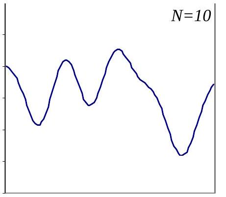
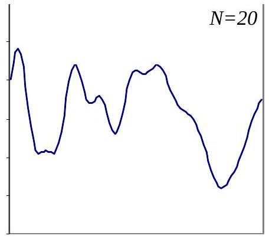
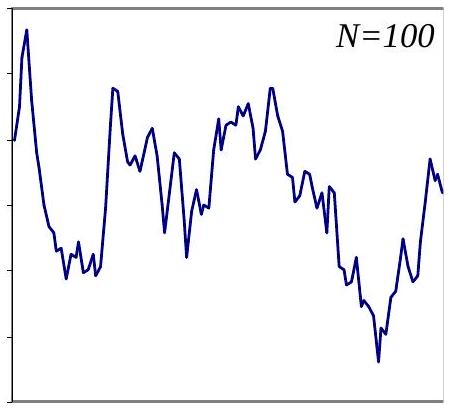

Видно, что степень изломанности траектории увеличивается, стремясь в пределе $N \rightarrow \infty$ к недифференцируемой стохастической кривой.

- Изучая стохастические дифференциальные уравнения, можно использовать различный "язык" и различные математические конструкции. Кратко перечислим основные подходы к представлению решений стохастических уравнений, их сильные и слабые стороны.
- Плотность вероятности является базовым и наиболее общим языком описания случайных функций. Так как мы ограничились классом марковских процессов, знание вероятности перехода $P\left(x_{0}, t_{0} \Rightarrow x, t\right)$ между двумя точками позволяет записать вероятность всей траектории. В результате можно вычислять разнообразные средние, и т.п. Чтобы найти $P\left(x_{0}, t_{0} \Rightarrow x, t\right)$, необходимо решить дифференциальное уравнение в частных производных, которое мы рассмотрим в четвёртой главе. Недостатком этого подхода является то, что получение конечного результата иногда требует более кропотливых вычислений, чем в рамках других методов. Примером тому служит описание процесса Орнштейна-Уленбека или процесса Феллера (стр. 82).
- Уравнения для средних мы рассмотрим в следующей главе. Если целью исследования является поиск различных средних значений стохастического процесса, то решение этих уравнений может оказаться самым прямым и простым способом. Дифференциальные уравнения для средних часто приводят к полезным соотношениям в асимптотическом пределе $t \rightarrow \infty$ и удобны при построении приближённых методов. Кроме ограниченности получаемых результатов, недостаток подхода в том, что эти уравнения оказываются замкнутыми лишь для относительно узкого класса задач.
- Сведение $\kappa$ известному процессу является очень распространённым подходом. Обычно при этом используется винеровский процесс $W(t)$ с хорошо изученными и простыми свойствами. Например, логарифмическое блуждание $x(t)=x_{0} \exp \left\{\left(\mu-\sigma^{2} / 2\right) t+\sigma W(t)\right\}$ явным образом демонстрирует деформацию винеровского процесса $W(t)$ в процесс $x(t)$. Подобные решения ищутся при помощи леммы Ито и подходящей замены. Достоинством подхода является быстрота получения конечного результата (когда это возможно). Кроме этого, мы имеем простую запись для выборочных траекторий. Например, можно сгенерить конкретную траекторию $W(t)$ и, подставив её в $x(t, W(t))$, получить выборочную траекторию процесса $x(t)$. Недостатком подхода является то, что для многих процессов найти простую функцию $x(t, W(t))$ не очень просто. Так, уже для процесса Орнштейна-Уленбека в аргументе функции $W(t)$ необходимо дополнительно деформировать время, а процесс Феллера вообще не имеет простого представления при помощи $W(t)$.
- Стохастические интеграль - это наиболее популярный способ как строгого обоснования стохастических уравнений, так и записи их решения при помощи специфических обозначений. Стохастические интегралы являются достаточно нетривиальной математической конструкцией. Несмотря на то, что это очень красивая и мощная техника, иногда получаемые с её помощью результаты оказываются формальными, и воспользоваться ими для вычисления, например, средних или плотности вероятности не представляется возможным. Мы будем обсуждать стохастическое интегрирование в пятой главе.
- Скалярные случайные величины широко используются в этой книге. Стохастичность функции $x(t)$ можно придать при помощи обычной случайной величины $\varepsilon$, не являющейся процессом, и гладкой функции времени. Величина $\varepsilon$ имеет определённое распределение. Чаще всего оно гауссово, однако в общем случае это не обязательно. Дальше мы увидим, что простую форму решению для некоторых процессов можно придать, только используя две или более случайные величины, имеющие совместную плотность вероятности. Запись решения в виде $x=f\left(x_{0}, t_{0}, t, \varepsilon\right)$ позволяет легко находить различные средние. Кроме этого, функция $f$ эквивалентна заданию в неявной форме марковской плотности вероятности $P\left(x_{0}, t_{0} \Rightarrow x, t\right)$. Действительно, при помощи среднего от произвольной функции $F(x)$ можно сделать преобразование, например, от гауссовой переменной $\varepsilon$ к $x$ (значения начальных условий $x_{0}, t_{0}$ опущены):

$$
\langle F(x)\rangle=\int_{-\infty}^{\infty} F(x) P(x, t) d x=\int_{-\infty}^{\infty} F(f(\varepsilon, t)) P(\varepsilon) d \varepsilon
$$

где $P(\varepsilon)$ - распределение Гаусса. Проводя во втором интеграле обратную замену $x=f(t, \varepsilon)$, мы переходим к первому интегралу, и, следовательно, плотность вероятности случайного процесса в момент времени $t$ равна:

$$
\begin{equation*}
P\left(x_{0}, t_{0} \Rightarrow x, t\right)=\frac{1}{\sqrt{2 \pi}} \frac{\partial g(x, t)}{\partial x} \exp \left\{-\frac{1}{2} g^{2}(x, t)\right\}, \tag{2.36}
\end{equation*}
$$

где $g(x, t)$ - обратная к $x=f(t, \varepsilon)$ функция, т.е. $\varepsilon=g(x, t)$.
В заключение выскажем очевидную истину. Использование того или иного языка должно диктоваться в первую очередь соображением простоты. В зависимости от того, какие задачи решаются, более адекватным может оказаться любой из перечисленных выше подходов.

## 2.7 Автокорреляция и спектр

- В первой главе (стр. 40) мы говорили о том, что важной характеристикой стохастического процесса является связь "прошлого" и "будущего". Она определяется автоковариацией между двумя моментами времени $t_{1}<t_{2}$ при условии, что при $t=t_{0}$ наблюдалось значение $x_{0}=x\left(t_{0}\right)$ :

$$
\begin{equation*}
\operatorname{cov}_{t_{0}}\left(t_{1}, t_{2}\right)=\left\langle\left(x_{t_{1}}-\bar{x}_{t_{1}}\right)\left(x_{t_{2}}-\bar{x}_{t_{2}}\right)\right\rangle \tag{2.37}
\end{equation*}
$$

где $\bar{x}_{t}=\langle x(t)\rangle$ - среднее значение в момент времени $t$, а $x_{t_{i}}=x\left(t_{i}\right)$.
Если решение стохастического дифференциального уравнения выражено через гауссову случайную переменную $\varepsilon$, то вычисление автоковариации становится несложной задачей. Рассмотрим, например, винеровское блуждание с начальным значением $x_{0}=x\left(t_{0}\right)$ :

$$
x(t)=x_{0}+\mu \cdot\left(t-t_{0}\right)+\sigma \sqrt{t-t_{0}} \varepsilon
$$

Удобно положить $t_{0}=0, t_{1}=t$ и $t_{2}=t+\tau$. При вычислении автоковариации предполагается, что $x$, прежде чем достигнуть $x_{t+\tau}=x(t+\tau)$, проходит через $x_{t}=x(t)$. Поэтому решение необходимо разбить на два интервала времени $[0 \ldots t]$ и $[t \ldots t+\tau]$. Считая $x_{t}$ начальным условием при $\tau=0$ для $x_{t+\tau}$ запишем:

$$
\begin{equation*}
x_{t+\tau}=x_{t}+\mu \tau+\sigma \sqrt{\tau} \varepsilon \tag{2.38}
\end{equation*}
$$

Если будущее блуждание $\varepsilon$ не зависит от случайной величины процесса $x_{t}$ в момент времени $t$, то $\left\langle x_{t} \varepsilon\right\rangle=\left\langle x_{t}\right\rangle\langle\varepsilon\rangle=0$, и:

$$
\left\langle x_{t+\tau} x_{t}\right\rangle=\left\langle x_{t}^{2}\right\rangle+\mu \tau\left\langle x_{t}\right\rangle
$$

Так как:

$$
\left\langle x_{t}\right\rangle=x_{0}+\mu t, \quad\left\langle x_{t}^{2}\right\rangle-\left\langle x_{t}\right\rangle^{2}=\sigma^{2} t
$$

легко найти автоковариационную функцию:

$$
\operatorname{cov}(t, t+\tau)=\left\langle x_{t+\tau} x_{t}\right\rangle-\left\langle x_{t+\tau}\right\rangle\left\langle x_{t}\right\rangle=\sigma^{2} t
$$

Она зависит только от ближайшего к $t_{0}=0$ времени $t$ и не зависит от $\tau$. Смысл этого факта мы обсуждали при описании дискретного винеровского процесса (стр. 36).

Аналогично вычисляются автоковариации для других стохастических процессов. В качестве упражнения имеет смысл найти автоковариацию для логарифмического блуждания ( $\lessdot \mathrm{H}_{13}$ ) и броуновского моста ( ⟵ $\mathrm{H}_{14}$ ).

- Для процесса Орнштейна-Уленбека решение:

$$
\begin{equation*}
x(t)=\alpha+\left(x_{0}-\alpha\right) e^{-\beta\left(t-t_{0}\right)}+\frac{\sigma}{\sqrt{2 \beta}} \sqrt{1-e^{-2 \beta\left(t-t_{0}\right)}} \varepsilon \tag{2.39}
\end{equation*}
$$

при вычислении автоковариации также необходимо разбить на два интервала ( $\lessdot \mathrm{H}_{15}$ ). В результате ( $t_{0}=0$ ):

$$
\begin{equation*}
\operatorname{cov}(t, t+\tau)=\sigma^{2}(t) e^{-\beta \tau}=\frac{\sigma^{2}}{2 \beta}\left[1-e^{-2 \beta t}\right] e^{-\beta \tau} \tag{2.40}
\end{equation*}
$$

Если мы рассмотрим большое $t$, но конечное $\tau$, то автоковариация (2.40) будет стремиться к выражению, зависящему только от разности времён $\tau=t_{2}-t_{1}$ :

$$
\begin{equation*}
\operatorname{cov}(t, t+\tau) \rightarrow \frac{\sigma^{2}}{2 \beta} e^{-\beta \tau} \tag{2.41}
\end{equation*}
$$

Стаицонарным случайным процессом называется процесс, свойства которого не зависят от выбора начала отсчёта времени. Стационарность в иироком смысле означает, что среднее значение и волатильность не зависят от времени $\bar{x}(t)=$ const,$\sigma(t)=$ const, а корреляционная функция является только функцией разности времён $\operatorname{cov}\left(t_{1}, t_{2}\right)=\operatorname{cov}\left(t_{2}-t_{1}\right)$. По этому определению винеровское и логарифмическое блуждания не являются стационарными в широком смысле. В частности, для винеровского процесса волатильность увеличивается со временем, а автокорреляционная функция зависит только от первого времени $t_{1}$. В то же время, эти процессы являются стационарными в узком смысле. Их среднее и волатильность зависят от $t-t_{0}$ и не изменяются при сдвиге времени. Процесс Орнштейна-Уленбека становится стационарным в широком смысле в асимптотическом пределе $t \rightarrow \infty$. При задании произвольного $x_{0}$, сильно отличающегося от $\alpha$, процесс будет стремиться к $\alpha$ (большой снос). При попадании в окрестности этого равновесного уровня начинается блуждание, статистические свойства которого не зависят от того, какое значение $x_{0}$ было в начальный момент времени. Происходит "забывание" начальных условий.

Если коэффициенты сноса и волатильности в стохастическом дифференциальном уравнении Ито не зависят от времени, то его решение не должно зависеть от выбора начала отсчёта $x=f\left(x_{0}, t-t_{0}, \varepsilon\right)$. Оно является стационарным в узком смысле. Но только в достаточно простых ситуациях среднее и волатильность постоянны и, следовательно, стационарны в широком смысле.

- Представим случайную функцию $x(t)$ в следующем виде:

$$
x(t)=\bar{x}(t)+\sum_{k} \xi_{k} \phi_{k}(t)
$$

где $\xi_{k}$ - случайные нескоррелированные величины с нулевым средним и единичной дисперсией. В общем случае они имеют не гауссово распределение. Функции $\phi_{k}(t)$ являются обычными неслучайными функциями времени, а $\bar{x}(t)$ - среднее значение стационарного процесса. Подобное представление называют каноническим разложением.

Автоковариационная функция и волатильность, в силу независимости $\left\langle\xi_{i} \xi_{j}\right\rangle=\delta_{i j}$ случайных величин $\xi_{i}$, выражаются через функции $\phi_{k}(t)$ :

$$
\operatorname{cov}\left(t_{1}, t_{2}\right)=\sum_{k} \phi_{k}\left(t_{1}\right) \phi_{k}\left(t_{2}\right), \quad \sigma^{2}(t)=\sum_{k} \phi_{k}^{2}(t)
$$

В случае стационарных в широком смысле случайных процессов в качестве базиса $\phi_{k}(t)$ удобно выбрать гармоники Фурье. Рассмотрим симметричный интервал времени $[-T / 2 . . T / 2]$ и введём частоты $\omega_{k}=2 \pi k / T$. Тогда стохастическим аналогом детерминированного фурье - разложения (стр. 314) будет следующее представление:

$$
x(t)=\bar{x}+\sum_{k=0}^{\infty}\left\{\xi_{k} a_{k} \cos \left(\omega_{k} t\right)+\eta_{k} b_{k} \sin \left(\omega_{k} t\right)\right\}
$$

где $\xi_{k}, \eta_{k}$ - независимые случайные числа с нулевым средним и единичной волатильностью. Найдём ковариацию:

$$
\operatorname{cov}\left(t_{1}, t_{2}\right)=\sum_{k=0}^{\infty}\left\{a_{k}^{2} \cos \left(\omega_{k} t_{1}\right) \cos \left(\omega_{k} t_{2}\right)+b_{k}^{2} \sin \left(\omega_{k} t_{1}\right) \sin \left(\omega_{k} t_{2}\right)\right\}
$$

Для стационарного процесса ковариация зависит только от разности времён $\tau=t_{2}-t_{1}$. Это произойдёт, если $a_{k}^{2}=b_{k}^{2}$ :

$$
\operatorname{cov}\left(t_{1}, t_{2}\right)=\operatorname{cov}(\tau)=\sum_{k=0}^{\infty} a_{k}^{2} \cos \left(\omega_{k} \tau\right)
$$

или в силу ортогональности косинусов:

$$
a_{k}^{2}=\frac{2}{T} \int_{-T / 2}^{T / 2} \operatorname{cov}(\tau) \cos \left(\omega_{k} \tau\right) d \tau
$$

Коэффициенты $a_{k}^{2}$ являются квадратами амплитуд и характеризуют вклад той или иной гармоники с частотой $\omega_{k}$ в случайный процесс. Чем они больше, тем типичнее случайные колебания с этой частотой.

Введём спектральную функицо $\mathcal{S}(\omega)=a_{k}^{2} / \Delta \omega=a_{k}^{2} T / 2 \pi$ и устремим $T$ к бесконечности. Так как ковариационная функция, в силу определения, симметрична: $\operatorname{cov}\left(t_{1}, t_{2}\right)=\operatorname{cov}\left(t_{2}, t_{1}\right)$, то стационарная ковариация будет чётной: $\operatorname{cov}(-\tau)=\operatorname{cov}(\tau)$. Поэтому:

$$
\mathcal{S}(\omega)=\frac{1}{\pi} \int_{-\infty}^{\infty} \operatorname{cov}(\tau) \cos (\omega \tau) d \tau=\frac{1}{\pi} \int_{-\infty}^{\infty} \operatorname{cov}(\tau) e^{i \omega \tau} d \tau
$$

В стационарном случае случайный процесс совершает некоторые нерегулярные колебания вокруг среднего значения. Иногда эти колебания обладают свойством квазипериодичности, когда наблюдается некоторая изменяющаяся, но всё же в среднем стабильная частота колебаний. Инструментом изучения подобных явлений служит спектральная функция, являющаяся фурье - образом стационарной ковариационной функции $\operatorname{cov}(\tau)=\operatorname{cov}\left(t_{2}-t_{1}\right)$.

Для процесса Орнштейна - Уленбека:

$$
\mathcal{S}(\omega)=\frac{\sigma^{2}}{2 \beta \pi} \int_{-\infty}^{\infty} e^{i \omega \tau-\beta|\tau|} d \tau=\frac{\sigma^{2} / \pi}{\omega^{2}+\beta^{2}}
$$

Это монотонно убывающая функция с максимумом при $\omega=0$. Чем параметр $\beta$ меньше, тем более типичными будут маленькие частоты колебания (большие периоды). В этом случае притяжение к равновесному уровню слабое, поэтому возможны блуждания, уходящие далеко и надолго вверх или вниз от положения равновесия.

- До сих пор мы предполагали, что начальное условие для случайного процесса зафиксировано абсолютно точно. Иногда удобно рассматривать некоторый набор начальных условий, задаваемый плотностью вероятности $P\left(x_{0}\right)$. В этом случае величина $x_{0}$ в наших решениях будет не константой, а случайной величиной. Обычно предполагается, что она не зависит от свойств блуждания в последующие моменты времени и $\left\langle x_{0} \varepsilon\right\rangle=\left\langle x_{0}\right\rangle\langle\varepsilon\rangle=0$. Следовательно, дисперсия винеровского блуждания:

$$
\left\langle(x(t)-\bar{x})^{2}\right\rangle=\left\langle\left(x_{0}-\bar{x}_{0}+\sigma \sqrt{t-t_{0}} \varepsilon\right)^{2}\right\rangle=\left\langle\left(x_{0}-\bar{x}_{0}\right)^{2}\right\rangle+\sigma^{2}\left(t-t_{0}\right)
$$

равна сумме неопределённости начальных условий и неопределённости процесса блуждания $\sigma_{x}^{2}=\sigma_{x_{0}}^{2}+\sigma^{2}\left(t-t_{0}\right)$. Аналогичным образом подправляются и выражения для автоковариации.

## 2.8 Порождающий процесс Винера

Стохастическое дифференциальное уравнение содержит в качестве шума $\delta W$ изменения винеровского процесса $W_{t}$. В результате:

каждая выборочная траектория винеровского блуждания $W_{t}$ полностью определяет выборочную траекторию произвольного стохастического уравнения с шумом $\delta W$.

Даже в тех случаях, когда мы не можем в явном виде записать решение уравнения в виде простой функции $x_{t}=f\left(t, W_{t}\right)$, предполагается её существование. Если у нас есть несколько случайных процессов, уравнения которых содержат один $u$ тот же стохастический шум $\delta W$, то они должны быть между собой скоррелированы. Рассмотрим пример:

$$
\left\{\begin{align*}
d x & =f(t) \delta W  \tag{2.42}\\
d y & =g(t) \delta W
\end{align*}\right.
$$

Решение каждого уравнения может быть записано при помощи гауссовой величины ( (2.18) стр. 56). Однако, несмотря на одинаковую винеровскую переменную $\delta W$, в решениях должны стоять различные случайные величины $\varepsilon$ и $\eta$ :

$$
\begin{aligned}
& x=x_{0}+\sum f_{i-1} \varepsilon_{i} \sqrt{\Delta t}=x_{0}+F(t) \varepsilon \\
& y=y_{0}+\sum g_{j-1} \varepsilon_{j} \sqrt{\Delta t}=y_{0}+G(t) \eta
\end{aligned}
$$

где дисперсии равны:

$$
F^{2}(t)=\int_{t_{0}}^{t} f^{2}(\tau) d \tau, \quad G^{2}(t)=\int_{t_{0}}^{t} g^{2}(\tau) d \tau
$$

На каждой итерации, в обоих суммах стоят одинаковые случайные числа $\varepsilon_{k}$. Однако так как они умножаются на различные коэффициенты $f_{i}$ и $g_{i}$, результирующие гауссовы числа будут скоррелированы:

$$
F(t) G(t)\langle\varepsilon \eta\rangle=\sum_{i, j=1} f_{i-1} g_{j-1}\left\langle\varepsilon_{i} \varepsilon_{j}\right\rangle \Delta t=\sum_{i=1} f_{i-1} g_{i-1} \Delta t=\int_{t_{0}}^{t} f(\tau) g(\tau) d \tau
$$

так как $\left\langle\varepsilon_{i} \varepsilon_{j}\right\rangle$ отлично от нуля только при $i=j$. Таким образом:

$$
\begin{equation*}
\langle\varepsilon \eta\rangle=\rho(t)=\frac{1}{F(t) G(t)} \int_{t_{0}}^{t} f(\tau) g(\tau) d \tau \neq 1 \tag{2.43}
\end{equation*}
$$

Заметим, что в общем случае 〈ɛη зависит от времени.

- Рассмотрим конкретное применение этих формул на примере процесса Орнштейна-Уленбека:

$$
d x=-\beta \cdot(x-\alpha) d t+\sigma \delta W
$$

Перейдём при помощи леммы Ито к процессу $y(t)=F(t, x)=e^{\beta t}(x-\alpha)$ :

$$
d y=\sigma e^{\beta t} \delta W \quad=>\quad y(t)=y_{0}+\frac{\sigma}{\sqrt{2 \beta}} \sqrt{e^{2 \beta t}-1} \eta
$$

где $\eta \sim N(0,1)$, а $y_{0}=x_{0}-\alpha$. Поэтому решение для $x$ имеет вид $(\beta>0)$ :

$$
x(t)=\alpha+\left(x_{0}-\alpha\right) e^{-\beta t}+\frac{\sigma}{\sqrt{2 \beta}} \sqrt{1-e^{-2 \beta t}} \eta
$$

Если мы интересуемся свойствами этого процесса как такового, данного решения вполне достаточно. Однако, если мы хотим прояснить его связь с порождающим винеровским процессом $W_{t}$, необходимо записать:

$$
W_{t}=\varepsilon \sqrt{t}, \quad\langle\varepsilon \eta\rangle=\rho=\sqrt{\frac{2}{\beta t} \frac{1-e^{-\beta t}}{1+e^{-\beta t}}}
$$

где мы воспользовались (2.43) с $f(t)=1$ и $g(t)=\sigma e^{\beta t}$. Так как $\varepsilon$ и $\eta-$ скоррелированные гауссовы числа, для вычисления моментов произвольных порядков удобно перейти к паре независимых гауссовых величин:

$$
\varepsilon=\varepsilon_{1}, \quad \eta=\rho \varepsilon_{1}+\sqrt{1-\rho^{2}} \varepsilon_{2}
$$

В результате:

$$
\left\langle\varepsilon^{2}\right\rangle=\left\langle\eta^{2}\right\rangle=1, \quad\langle\varepsilon \eta\rangle=\rho, \quad\left\langle\varepsilon^{2} \eta^{2}\right\rangle=1+2 \rho^{2}
$$

и т.д. Теперь мы можем вычислить любые статистики, в которых участвуют и процесс Орнштейна-Уленбека $x$, и порождающий его винеровский процесс $x$ :

$$
\left\langle W_{t} x_{t}\right\rangle=\frac{\sigma \sqrt{t}}{\sqrt{2 \beta}} \sqrt{1-e^{-2 \beta t}}\langle\varepsilon \eta\rangle=\frac{\sigma}{\beta}\left(1-e^{-\beta t}\right)
$$

Если нас интересуют предсказательные возможности порождающего процесса, необходимо записать решение со сдвигом:

$$
x_{t+\tau}=\alpha+\left(x_{t}-\alpha\right) e^{-\beta \tau}+\frac{\sigma}{\sqrt{2 \beta}} \sqrt{1-e^{-2 \beta \tau}} \eta^{\prime}
$$

и вычислить:

$$
\left\langle W_{t} x_{t+\tau}\right\rangle=\left\langle W_{t} x_{t}\right\rangle e^{-\beta \tau}=\frac{\sigma}{\beta}\left(1-e^{-\beta \tau}\right)
$$

так как $\eta^{\prime}$ на интервале $[t . . . t+\tau]$ не зависит от винеровского процесса в момент $t$.

- Рассмотрим ещё одну задачу для двух процессов с одинаковым шумом $\delta W$ :

$$
\left\{\begin{aligned}
d x & =\delta W \\
d y & =f(x, t) \delta W
\end{aligned}\right.
$$

Если $x_{0}=x(0)=0$, то $x(t)=W_{t}-$ это винеровский процесс, предоставляющий уравнению для $y$ не только изменения $\delta W$, но и накопленное значение $W_{t}$, от которого зависит амплитуда шума.

Будем, как обычно, использовать итерационный метод:

$$
\begin{aligned}
& x_{i}=x_{0}+\sum_{j=1}^{i} \varepsilon_{j} \sqrt{\Delta t} \\
& y_{n}=y_{0}+\sum_{i=0}^{n-1} f\left(x_{i}, t_{i}\right) \varepsilon_{i+1} \sqrt{\Delta t}
\end{aligned}
$$

В решении для $y_{n}$ величины $x_{i}$ содержат сумму гауссовых переменных по $\varepsilon_{i}$ включительно. Они не зависят от $\varepsilon_{i+1}$, поэтому $\left\langle y_{n}\right\rangle=y_{0}$. Аналогично вычисляется дисперсия второго процесса:

$$
\left\langle\left(y_{n}-y_{0}\right)^{2}\right\rangle=\sum_{i, j=0}^{n-1}\left\langle f\left(x_{i}, t_{i}\right) f\left(x_{j}, t_{j}\right) \varepsilon_{i+1} \varepsilon_{j+1}\right\rangle \Delta t .
$$

Эту сумму необходимо разбить на три части, когда индекс $i$ меньше $j$, больше, и равен:

$$
\sum_{i, j}=\sum_{i<j}+\sum_{i>j}+\sum_{i=j} .
$$

Первая и вторая суммы равны нулю, так как они содержат члены типа $\left\langle f\left(x_{1}, t_{1}\right) f\left(x_{2}, t_{2}\right) \varepsilon_{2} \varepsilon_{3}\right\rangle$. Величина $\varepsilon_{3}$ не зависит от всех остальных случайных чисел, среднее разбивается на произведение средних и оказывается равным нулю $\left\langle\varepsilon_{3}\right\rangle=0$. В результате ненулевое значение имеет последняя сумма со слагаемыми типа $\left\langle f^{2}\left(x_{1}, t_{1}\right) \varepsilon_{2}^{2}\right\rangle=\left\langle f^{2}\left(x_{1}, t_{1}\right)\right\rangle\left\langle\varepsilon_{2}^{2}\right\rangle$. Поэтому для дисперсии имеем следующее выражение:

$$
\begin{equation*}
\sigma^{2}(t)=\left\langle\left(y(t)-y_{0}\right)^{2}\right\rangle=\int_{t_{0}}^{t}\left\langle f^{2}\left(x_{0}+\varepsilon \sqrt{\tau}, \tau\right)\right\rangle d \tau \tag{2.44}
\end{equation*}
$$

где в явном виде подставлено решение для $x$. Таким образом, усредняя с гауссовой плотностью вероятности подынтегральную функцию и вычисляя интеграл от обычной функции времени, мы получаем значение дисперсии случайного процесса. Подчеркнём, что сначала происходит усреднение, и только после этого проводится интегрирование.

- Системы уравнений с одинаковым шумом позволят прояснить ещё одну важную особенность стохастической математики. Рассмотрим следующий пример с начальными условиями $x_{0}=x(0)$ и $y_{0}=y(0)$ :

$$
\left\{\begin{array}{l}
d x=\delta W  \tag{2.45}\\
d y=x \delta W
\end{array}\right.
$$

Может появиться искушение разделить одно уравнение на второе и проинтегрировать обыкновенное дифференциальное уравнение:

$$
\begin{equation*}
d y=x d x \quad \nRightarrow \quad y-y_{0}=\frac{x^{2}-x_{0}^{2}}{2} \tag{2.46}
\end{equation*}
$$

Если так можно, то решение должно оставаться на детерминированной кривой $y=y(x)$. Однако на самом деле это неверно! Дело в том, что, хотя стохастический член $\delta W$ сократился, дифференциалы $d x, d y$ по-прежнему являются изменением случайных функций, для которых неприменимы обычные правила интегрирования. В частности, $x d x \neq d\left(x^{2}\right) / 2\left(\lessdot \mathrm{C}_{22}\right)$. Для подобных операций служит лемма Ито.

Решение системы (2.45) на самом деле имеет вид:

$$
\left\{\begin{array}{l}
x=x_{0}+W \\
y=y_{0}+x_{0} W+\frac{1}{2}\left(W^{2}-t\right)
\end{array}\right.
$$

Действительно, рассматривая $y=F(t, W)$, как функцию времени и $W$, мы можем воспользоваться леммой Ито. При этом $d W=\delta W$, поэтому снос равен нулю $a=0$, а волатильность - единице $b=1$ :

$$
d y=\left(\frac{\partial y}{\partial t}+\frac{1}{2} \frac{\partial^{2} y}{\partial W^{2}}\right) d t+\frac{\partial y}{\partial W} \delta W=\left(x_{0}+W\right) \delta W=x \delta W
$$

что совпадает со вторым уравнением системы (2.45). В качестве упражнения ( $\lessdot \mathrm{H}_{17}$ ) предлагается решить (2.45) при помощи итераций и проверить $\left(\lessdot \mathrm{H}_{18}\right)$ выполнимость (2.44).

Таким образом, необходимо помнить, что дифференциалы типа $d x$ не являются обычными "малыми" приращения функции $x(t)$. Это слyчайные величины. Нельзя под дифференциал "как обычно" "затаскивать" функции: $2 x d x \neq d\left(x^{2}\right)$. Следует также помнить, что

дифференицальные стохастические уравнения - это лишь символическая запись непрерывного предела итерационной схемы.

Ни когда не будет лишним проверить полученный результат при помощи численного моделирования на компьютере. То, что при этом сложно сделать предельный переход $\Delta t \rightarrow 0$, не должно останавливать. В конечном счёте, большинство реальных случайных процессов в Природе на определённом временном масштабе являются дискретными!

## Глава 3

## Средние значения

Дифференциальное уравнение для случайной функции $x(t)$ - это лишь один из возможных языков описания стохастического процесса. В ситуации, когда система эволюционирует со временем, средние значения также изменяются и подчиняются определённым дифференциальным уравнениям. Фактически, их решение является наиболее прямым способом получения практически полезных результатов.

Мы начнём эту главу с вывода динамического уравнения для средних. С его помощью будет получено простое выражение для плотности вероятности в ситуации, когда система имеет стационарный режим. Затем мы подробно проанализируем две стохастические задачи: уравнение Феллера и логистическое уравнение. В заключение будут рассмотрены метод разложения средних величин в степенной ряд по времени и квазидетерминированное приближение.

## 3.1 Динамическое уравнение для средних

- Для получения информации о случайном процессе $x(t)$ можно сначала решить уравнение Ито, а затем вычислить наблюдаемые характеристики процесса, которые, в конечном счёте, являются средними между различными величинами. Было бы здорово сразу иметь уравнения для наблюдаемых, исключая первый этап.

Рассмотрим итерационную схему в моменты времени $t$ и $t+d t$ :

$$
\begin{equation*}
x(t+d t)=x+a(x, t) d t+b(x, t) \varepsilon \sqrt{d t} \tag{3.1}
\end{equation*}
$$

Значение процесса $x=x(t)$ и гауссова величина $\varepsilon$ являются двумя независимыми случайными величинами. В результате вычисления (3.1) возникает новое случайное число $x(t+d t)$. Чтобы найти его среднее значение необходимо проинтегрировать левую часть (3.1) с марковской плотностью $P\left(x_{0}, t_{0} \Rightarrow x+d t, t+d t\right)$. Эквивалентный результат получится при усреднении правой части с $P\left(x_{0}, t_{0} \Rightarrow x, t\right) P(\varepsilon)$, где $P(\varepsilon)$ - гауссова плотность вероятности. Так как $x$ и $\varepsilon$ независимы и $\langle\varepsilon\rangle=0$, то усреднение последнего слагаемого в (3.1) даёт ноль, поэтому:

$$
\langle x(t+d t)\rangle=\langle x(t)\rangle+\langle a(x(t), t)\rangle d t
$$

Перенося $\langle x(t)\rangle$ влево и разделив обе части на $d t$, мы приходим к динамическому уравнению для среднего:

$$
\begin{equation*}
\frac{d\langle x\rangle}{d t}=\langle\dot{x}\rangle=\langle a(x, t)\rangle \tag{3.2}
\end{equation*}
$$

Если $a(x, t)=\alpha(t)+\beta(t) x$, то (3.2) имеет ту же форму, что и детерминированное уравнение:

$$
\langle\dot{x}\rangle=\alpha(t)+\beta(t)\langle x\rangle
$$

Поэтому при любой волатильности $b(x, t)$ среднее значение процесса с линейным по $x$ сносом совпадает с детерминированным решением. Однако в нелинейном случае это не так!

Абсолютно аналогично, усредняя произвольную функцию $F=F(x, t)$, изменение которой подчиняется лемме Ито (2.15), стр. 55, получаем:

$$
\begin{equation*}
\frac{d\langle F(x, t)\rangle}{d t}=\left\langle\frac{\partial F}{\partial t}+a(x, t) \frac{\partial F}{\partial x}+\frac{b^{2}(x, t)}{2} \frac{\partial^{2} F}{\partial x^{2}}\right\rangle \tag{3.3}
\end{equation*}
$$

Выбирая те или иные функции $F(x, t)$, можно получить множество полезных соотношений для средних величин.

- В качестве примера рассмотрим процесс Орнштейна-Уленбека:

$$
d x=-\beta \cdot(x-\alpha) d t+\sigma \delta W
$$

решение которого в предыдущей главе мы выразили через гауссову переменную. В данном случае снос является линейным по $x$, и сразу получается зависимость среднего от времени:

$$
\langle\dot{x}\rangle=-\beta(\langle x\rangle-\alpha) \quad=>\quad\langle x\rangle=\alpha+\left(x_{0}-\alpha\right) e^{-\beta t}
$$

В качестве начального условия при $t_{0}=0$ выбрано значение среднего, равное $x_{0}$. Вообще, если в начальный момент времени $x=x_{0}$, то средние произвольной степени при $t_{0}=0$ равны $\left\langle x^{n}\right\rangle=x_{0}^{n}$. Действительно, средние детерминированных величин равны им самим, а начальная плотность вероятности равна дельта - функции: $P\left(x_{0}, t_{0} \Rightarrow x, t_{0}\right)=\delta\left(x-x_{0}\right)$. В более общем случае можно рассматривать произвольное начальное распределение вероятностей, задавая $\left\langle x^{n}\right\rangle$ в момент $t_{0}=0$.

Выбирая теперь $F=x^{2}$, получим уравнение для квадрата:

$$
\left\langle\dot{x^{2}}\right\rangle=-2 \beta\left\langle x^{2}\right\rangle+2 \alpha \beta\langle x\rangle+\sigma^{2} .
$$

Функция $\langle x\rangle$ нам известна, и уравнение несложно проинтегрировать:

$$
\left\langle x^{2}\right\rangle=\left[\alpha+\left(x_{0}-\alpha\right) e^{-\beta t}\right]^{2}+\gamma^{2}\left(1-e^{-2 \beta t}\right),
$$

где $\gamma=\sigma / \sqrt{2 \beta}$. Откуда волатильность процесса равна:

$$
\sigma_{x}(t)=\gamma \sqrt{1-e^{-2 \beta t}}
$$

Если в задаче возможен стационарный режим, то уравнения для средних часто позволяют получить асимптотические значения величин. Для этого достаточно положить производную по времени равной нулю. Так, для процесса Орнштейна - Уленбека, выбирая $F=x^{n}$, имеем:

$$
\left\langle\dot{x^{n}}\right\rangle=0 \quad=>\quad\left\langle x^{n}\right\rangle=\alpha\left\langle x^{n-1}\right\rangle+(n-1) \gamma^{2}\left\langle x^{n-2}\right\rangle .
$$

Так как среднее единицы равно единице: $\left\langle x^{0}\right\rangle=\langle 1\rangle=1$, из этого уравнения последовательно находим:
$\langle x\rangle=\alpha, \quad\left\langle x^{2}\right\rangle=\alpha^{2}+\gamma^{2}, \quad\left\langle x^{3}\right\rangle=\alpha^{3}+3 \alpha \gamma^{2}, \quad\left\langle x^{4}\right\rangle=\alpha^{4}+6 \alpha^{2} \gamma^{2}+3 \gamma^{4}$.
Естественно, этот же результат можно получить и из асимптотического решения, выраженного через гауссову переменную (стр. 60):

$$
x=\alpha+\gamma \varepsilon .
$$

Для этого необходимо возвести $x$ в соответствующую степень и усреднить, с учётом $\left\langle\varepsilon^{2 n+1}\right\rangle=0,\left\langle\varepsilon^{2 n}\right\rangle=1 \cdot 3 \cdot 5 \cdot . . \cdot(2 n-1)$.

В качестве упражнения предлагается найти среднее для уравнения: $d x=(\alpha+\beta x) d t+(\sigma+\gamma x) \delta W\left(\lessdot \mathrm{H}_{19}\right)$.

- Из соотношения (3.3) несложно получить уравнение, которому удовлетворяет плотность вероятности $P(x)$ в стационарном режиме. Выберем функцию $F(x)$, не зависящую от времени, и положим производную $\langle F(x)\rangle$ равной нулю. Запишем усреднение в явном виде:

$$
\int_{-\infty}^{\infty} P(x)\left[a(x) \frac{\partial F}{\partial x}+\frac{b^{2}(x)}{2} \frac{\partial^{2} F}{\partial x^{2}}\right] d x=0
$$

Интегрируя по частям первое слагаемое один раз, а второе - два, и считая, что $P(x)$ достаточно быстро убывает на бесконечности, получаем:

$$
\int_{-\infty}^{\infty}\left[-\frac{\partial(a P)}{\partial x}+\frac{1}{2} \frac{\partial^{2}\left(b^{2} P\right)}{\partial x^{2}}\right] F(x) d x=0
$$

Так как функция $F(x)$ произвольна, то интеграл будет равен нулю, только если равно нулю выражение в квадратных скобках. В результате получается стационарное уравнение Фоккера - Планка:

$$
\frac{\partial}{\partial x}[a(x) P]=\frac{1}{2} \frac{\partial^{2}}{\partial x^{2}}\left[b^{2}(x) P\right]
$$

которое легко интегрируется:

$$
a(x) P=\frac{1}{2} \frac{\partial}{\partial x}\left[b^{2}(x) P\right]
$$

Для диффузных процессов плотность вероятности быстро убывает на бесконечности, так что существуют средние произвольной степени $\left\langle x^{m}\right\rangle$. Поэтому, устремив $x \rightarrow \infty$, мы получим слева и справа ноль, что подтверждает правильность выбора нулевой константы интегрирования. Таким образом, стационарное уравнение Фоккера - Планка оказывается уравнением первого порядка с разделяющимися переменными:

$$
\begin{equation*}
\frac{1}{2} \frac{P^{\prime}(x)}{P(x)}=\frac{a(x)}{b^{2}(x)}-\frac{b^{\prime}(x)}{b(x)}, \tag{3.4}
\end{equation*}
$$

где штрих у функций - это производная по $x$. Его решение имеет вид:

$$
\begin{equation*}
P(x)=\frac{C}{b^{2}(x)} \exp \left\{2 \int \frac{a(x)}{b^{2}(x)} d x\right\} \tag{3.5}
\end{equation*}
$$

Константа интегрирования $C$ находится из условия нормировки. Выполнимость этого условия является критерием возможности стационарного решения. Так, для логарифмического блуждания (стр. 58) со сносом $a(x)=\mu x$ и волатильностью $b(x)=\sigma x$ имеем $P(x) \sim x^{-2+2 \mu / \sigma^{2}}$. Ни при каком значении параметров эта функция не может быть отнормирована.

- В качестве простого примера стационарного решения уравнения Фоккера - Планка рассмотрим процесс Орнштейна-Уленбека:

$$
d x=-\beta \cdot(x-\alpha) d t+\sigma \delta W
$$

Интегрирование в (3.5) приводит к следующей плотности вероятности:

$$
P(x)=\frac{1}{\sigma} \sqrt{\frac{\beta}{\pi}} \exp \left\{-\frac{(x-\alpha)^{2}}{\sigma^{2} / \beta}\right\},
$$

которая является распределением Гаусса. В терминах случайных величин $P(x)$ можно записать в виде:

$$
x=\alpha+\frac{\sigma}{\sqrt{2 \beta}} \varepsilon
$$

где $\varepsilon \sim N(0,1)$ - гауссова переменная с нулевым средним и единичной дисперсией. Аналогично, предлагается найти ( $\lessdot \mathrm{H}_{20}$ ) асимптотическую плотность вероятности для процесса $d x=-\beta \cdot(x-\alpha) d t+\sigma x^{\nu} \delta W$.

- Рассмотрим ещё одну задачу:

$$
d x=\sigma \sqrt{\alpha^{2}+x^{2}} \delta W
$$

Так как снос равен нулю $a=0$, то среднее значение не изменяется со временем $\langle x\rangle=x_{0}$. Для среднего квадрата имеем:

$$
\left\langle\dot{x^{2}}\right\rangle=\sigma^{2}\left(\alpha^{2}+\left\langle x^{2}\right\rangle\right) \quad=>\quad\left\langle x^{2}\right\rangle=\left(\alpha^{2}+x_{0}^{2}\right) e^{\sigma^{2} t}-\alpha^{2}
$$

Поэтому дисперсия процесса

$$
\sigma_{x}^{2}(t)=\left(\alpha^{2}+x_{0}^{2}\right)\left(e^{\sigma^{2} t}-1\right)
$$

в пределе $t \rightarrow \infty$ стремится к бесконечности. Тем не менее, в этом случае стационарное уравнение Фоккера-Планка приводит к распределению Коши:

$$
P(x)=\frac{\alpha / \pi}{x^{2}+\alpha^{2}}
$$

к которому действительно приближается плотность вероятности процесса. В этом случае стационарность несколько патологична. В частности, не существуют $\left\langle x^{n}\right\rangle$ при $n>1$.

## 3.2 Процесс Феллера

- Рассмотрим стохастическое уравнение следующего вида:

$$
\begin{equation*}
d x=-\beta \cdot(x-\alpha) d t+\sigma \sqrt{x} \delta W \tag{3.6}
\end{equation*}
$$

При $\alpha>0, \beta>0$ снос совпадает с уравнением Орнштейна-Уленбека [(2.27), стр. 60], но волатильность шума не является постоянной. Благодаря зависимости от $x$ в стохастическом члене при приближении $x(t)$ к нулю величина шума падает, и детерминированный снос возвращает процесс к равновесному уровню. Таким образом, блуждание (при небольших $\sigma)$ всегда остаётся в положительной области $x>0$. Модель (3.6) активно используется в различных финансовых и экономических приложениях. Например, $x$ может быть процентной ставкой или курсом валют.

Плотность вероятности $P\left(x_{0}, t_{0} \Rightarrow x, t\right)$ имеет достаточно громоздкий вид (стр. 270). Однако выражения для средних значений $x$ несложно получить при помощи динамического уравнения (3.2):

$$
\langle\dot{x}\rangle=-\beta\langle x\rangle+\alpha \beta \quad=>\quad\langle x\rangle=\alpha+\left(x_{0}-\alpha\right) e^{-\beta t}
$$

В качестве начального условия при $t_{0}=0$ выбрано значение $x_{0}=x(0)$. Благодаря линейности сноса выражение для среднего совпадает с процессом Орнштейна - Уленбека.

Аналогично для среднего квадрата при $F=x^{2}$ в (3.3) имеем:

$$
\left\langle\dot{x^{2}}\right\rangle=-2 \beta\left\langle x^{2}\right\rangle+\left(2 \alpha \beta+\sigma^{2}\right)\langle x\rangle .
$$

Так как функция времени $\langle x\rangle$ нам известна, это уравнение легко интегрируется ( $\lessdot \mathrm{H}_{21}$ ) и приводит к следующей дисперсии $\sigma_{x}^{2}(t)=\left\langle x^{2}\right\rangle-\langle x\rangle^{2}$ :

$$
\sigma_{x}^{2}(t)=\alpha \gamma\left[1-e^{-\beta t}\right]^{2}+2 x_{0} \gamma\left[1-e^{-\beta t}\right] e^{-\beta t}
$$

где $\gamma=\sigma^{2} / 2 \beta$. Обратим внимание, что, если $x$ - размерная величина (цена или координата), то ту же размерность имеют параметры $\alpha$ и $\gamma$. Параметр $\beta$ имеет размерность обратного времени ( $\beta t$ - безразмерно).

В отличие от процесса Орнштейна - Уленбека, величина дисперсии зависит от начального значения $x_{0}$, однако она также стремится к константе $\alpha \gamma=\alpha \sigma^{2} / 2 \beta$ при $t \rightarrow \infty$. Обратим внимание, что эта константа имеет дополнительный множитель $\alpha$.

- При $t \rightarrow \infty$ процесс имеет стационарный режим, плотность вероятности которого находится из уравнения Фоккера-Планка (стр. 80):

$$
P(x)=\frac{C}{b^{2}(x)} \exp \left\{2 \int \frac{a(x)}{b^{2}(x)} d x\right\}=\frac{C}{\sigma^{2} x} \exp \left\{\int\left(\frac{\alpha}{x}-1\right) \frac{d x}{\gamma}\right\} .
$$

Проведя интегрирование, получаем гамма-распределение:

$$
\begin{equation*}
P(x)=\frac{1}{\gamma \Gamma(\mu)}\left(\frac{x}{\gamma}\right)^{\mu-1} e^{-x / \gamma}, \tag{3.7}
\end{equation*}
$$

где $\mu=\alpha / \gamma$ и всегда $x>0$. В знаменателе нормировочного множителя стоит гамма-функция $\Gamma(\mu)$ (см. стр. 313). Распределение имеет следующий график и статистики:
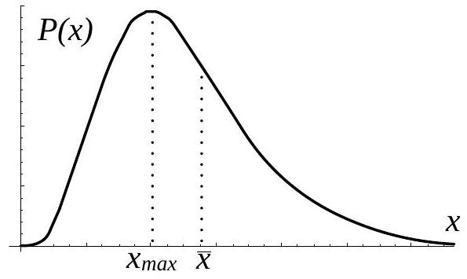

$$
\begin{gathered}
\langle x\rangle=\mu \gamma, \quad x_{\max }=(\mu-1) \gamma \\
\left\langle x^{n}\right\rangle=\mu \cdot(\mu+1) \cdot \ldots \cdot(\mu+n-1) \gamma^{n} .
\end{gathered}
$$

Заметим, что $P(0)=0$ только при $\mu>1$ или $\sigma^{2}<2 \alpha \beta$. В качестве упражнения ( $\lessdot \mathrm{H}_{22}$ ) предлагается вывести стационарное распределение при помощи уравнения для средних, выбирая $F(x)=x^{n}$.

- Найдём производящую функцию в произвольный момент времени:

$$
\phi(t, p)=\left\langle e^{p x}\right\rangle, \quad\left\langle x^{n}\right\rangle=\left.\frac{d^{n} \phi(t, p)}{d p^{n}}\right|_{p=0} .
$$

Для этого воспользуемся уравнением для средних с $F=e^{p x}$ :

$$
\frac{1}{\beta} \frac{d}{d t}\left\langle e^{p x}\right\rangle=\alpha p\left\langle e^{p x}\right\rangle+\left(\gamma p^{2}-p\right)\left\langle x e^{p x}\right\rangle,
$$

которое несложно преобразовать в дифференциальное уравнение для функции $\phi=\phi(t, p)$ :

$$
\frac{1}{\beta} \frac{\partial \phi}{\partial t}=\alpha p \phi+\left(\gamma p^{2}-p\right) \frac{\partial \phi}{\partial p} .
$$

Оно решается ( $\lessdot \mathrm{H}_{23}$ ) при помощи метода характеристик (стр. 316):

$$
\begin{equation*}
\phi(t, p)=\left[1-\gamma p\left(1-e^{-\beta t}\right)\right]^{-\alpha / \gamma} \exp \left\{\frac{x_{0} p e^{-\beta t}}{1-\gamma p\left(1-e^{-\beta t}\right)}\right\} \tag{3.8}
\end{equation*}
$$

с начальным условием $\phi(0, p)=e^{p x_{0}}$. Если сделать аналитическое продолжение в комплексную область $p \rightarrow \imath p$, то получится характеристическая функция, фурье-интеграл от которой даст $P\left(x_{0}, 0 \Rightarrow x, t\right)$.

- В предыдущей главе мы видели, что точные решения некоторых стохастических уравнений можно выразить через скалярную гауссову случайную величину $\varepsilon$. Подобного простого представления для процесса Феллера не существует. Однако его можно записать при помощи двyx скалярных случайных величин $\varepsilon$ и $u$ :

$$
x(t)=x_{0} e^{-\beta t}+\sqrt{2 x_{0} \gamma e^{-\beta t}\left(1-e^{-\beta t}\right)} \varepsilon+\gamma\left(1-e^{-\beta t}\right) u
$$

где $\gamma=\sigma^{2} / 2 \beta$, а $\varepsilon$ и $u$ имеют следующую совместную производящую функцию для средних:

$$
\begin{equation*}
\left\langle e^{k \varepsilon+p u}\right\rangle=\frac{1}{(1-p)^{\alpha / \gamma}} \exp \left\{\frac{k^{2} / 2}{1-p}\right\} \tag{3.9}
\end{equation*}
$$

Действительно, несложно проверить, что:

$$
\left\langle e^{p x}\right\rangle=\left\langle e^{p\left(f_{1}+f_{2} \varepsilon+f_{3} u\right)}\right\rangle=\frac{1}{\left(1-p f_{3}\right)^{\alpha / \gamma}} \exp \left\{\frac{p^{2} f_{2}^{2} / 2}{1-p f_{3}}+p f_{1}\right\}
$$

совпадает с производящей функцией (3.8), если $f_{2}^{2}=2 f_{1} f_{3}$, а функции $f_{1}(t), f_{3}(t)$ имеют вид:

$$
f_{1}(t)=x_{0} e^{-\beta t}, \quad \quad f_{3}(t)=\gamma\left(1-e^{-\beta t}\right)
$$

По отдельности случайная величина $\varepsilon$ имеет распределение Гаусса, а $u-$ гамма-распределение. В асимптотическом режиме $t \rightarrow \infty, x(t) \rightarrow \gamma u$ на случайные свойства процесса оказывает влияние только величина $u$.

- Взятие производных от производящей функции $\left\langle e^{k \varepsilon+p u}\right\rangle$ по $k$ и $p$ даёт различные средние для случайных величин $\varepsilon$ и $u$ :

$$
\left\langle\varepsilon^{2}\right\rangle=1, \quad\left\langle\varepsilon^{4}\right\rangle=3, \quad\langle u\rangle=\mu, \quad\left\langle u^{2}\right\rangle=\mu(1+\mu), \quad\left\langle u^{3}\right\rangle=\mu(1+\mu)(2+\mu),
$$

и их смешанных произведений:

$$
\langle\varepsilon u\rangle=0, \quad\left\langle\varepsilon^{2} u\right\rangle=1+\mu, \quad\left\langle\varepsilon u^{2}\right\rangle=0, \quad\left\langle\varepsilon^{2} u^{2}\right\rangle=2+3 \mu+\mu^{2}
$$

где $\mu=\alpha / \gamma$.
Представление решения через скалярные величины легко позволяет находить различные средние. Так как $x=f_{1}+f_{2} \varepsilon+f_{3} u$, то, например: $\left\langle x^{2}\right\rangle=f_{1}^{2}+f_{2}^{2}\left\langle\varepsilon^{2}\right\rangle+f_{3}^{2}\left\langle u^{2}\right\rangle+2 f_{1} f_{3}\langle u\rangle=f_{1}^{2}+f_{2}^{2}+\mu(1+\mu) f_{3}^{2}+2 \mu f_{1} f_{3}$, что приводит к известному уже нам выражению для $\sigma_{x}^{2}(t)$.

- Найдём совместную плотность вероятности случайных величин $\varepsilon$ и $u$. Для этого при помощи замен $p \rightarrow \imath p, k \rightarrow \imath k$ перейдём от производящей функции к характеристической и выполним фурье-интегрирование:

$$
P(\varepsilon, u)=\int_{-\infty}^{\infty} \frac{e^{-\imath k \varepsilon-\imath p u-k^{2} / 2(1-\imath p)}}{(1-\imath p)^{\mu}} \frac{d p d k}{(2 \pi)^{2}}
$$

Интеграл по $k$ вычисляется при помощи формулы (14), стр. 312:

$$
P(\varepsilon, u)=\frac{e^{-\varepsilon^{2} / 2}}{\sqrt{2 \pi}} \int_{-\infty}^{\infty} \frac{e^{-\imath p\left(u-\varepsilon^{2} / 2\right)}}{(1-\imath p)^{\mu}} \frac{d p}{2 \pi}
$$

Интеграл по $p$ соответствует характеристической функции гамма - распределения (стр. 27) с $x=u-\varepsilon^{2} / 2 \geqslant 0$. Поэтому совместная плотность вероятности имеет вид:

$$
\begin{equation*}
P(\varepsilon, u)=\left(u-\frac{\varepsilon^{2}}{2}\right)^{\mu-3 / 2} \frac{e^{-u}}{\Gamma(\mu-1 / 2) \sqrt{2 \pi}}, \quad u \geqslant \frac{\varepsilon^{2}}{2} . \tag{3.10}
\end{equation*}
$$

Если $u<\varepsilon^{2} / 2$, то $P(\varepsilon, u)=0$. Этот факт важен, так как ограничивает отрицательные значения $\varepsilon$, не позволяя случайному процессу $x(t)$ стать отрицательным (по крайней мере, при небольших $\sigma$ ).

Ниже представлена область ненулевого значения плотности вероятности на плоскости $(\varepsilon, u)$ (слева), и её трёхмерная форма (справа):
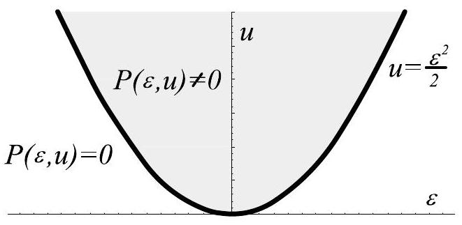
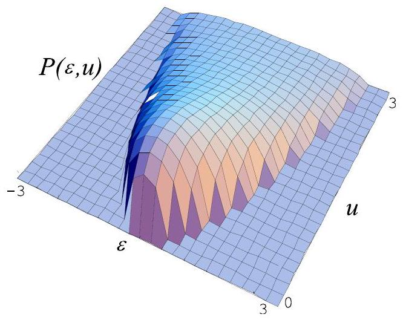

Если распределение $P(\varepsilon, u)$ проинтегрировать по $\varepsilon$ или по $u$, получаются распределения для каждой случайной величины:

$$
P(\varepsilon)=\frac{e^{-\varepsilon^{2} / 2}}{\sqrt{2 \pi}}, \quad P(u)=\frac{u^{\mu-1} e^{-u}}{\Gamma(\mu)}
$$

т.е. нормальное и гамма-распределения. Впрочем, этот факт следует из вида производящей функции (3.9).

- Чтобы найти автоковариационную функцию, необходимо воспользоваться свойством марковости рассматриваемого процесса. Решение выражается через две случайные величины $x(t)=f\left(x_{0}, t-t_{0}, \varepsilon, u\right)$, поэтому:

$$
x_{t}=f\left(x_{0}, t, \varepsilon_{1}, u_{1}\right), \quad x_{t+\tau}=f\left(x_{t}, \tau, \varepsilon, u\right),
$$

где $\varepsilon, u$ статистически не зависят от $\varepsilon_{1}, u_{1}$, и, следовательно, от $x_{t}$. Поэтому, умножая $x_{t+\tau}$ на $x_{t}$ и усредняя, получаем:

$$
\left\langle x_{t+\tau} x_{t}\right\rangle=\left\langle x_{t}^{2}\right\rangle e^{-\beta \tau}+\alpha\left(1-e^{-\beta \tau}\right)\left\langle x_{t}\right\rangle
$$

где учтено, что $\left\langle x_{t}^{3 / 2} \varepsilon\right\rangle=\left\langle x_{t}^{3 / 2}\right\rangle\langle\varepsilon\rangle=0$, так как $\langle\varepsilon\rangle=0$, и $\langle u\rangle=\mu=\alpha / \gamma$. Таким образом, автоковариационная функция равна:

$$
\operatorname{cov}(t, t+\tau)=\left\langle x_{t+\tau} x_{t}\right\rangle-\left\langle x_{t+\tau}\right\rangle\left\langle x_{t}\right\rangle=\sigma_{x}^{2}(t) e^{-\beta \tau}
$$

В асимптотическом пределе больших времён $t \rightarrow \infty$ процесс Феллера, как и процесс Орнштейна-Уленбека, является стационарным в широком смысле. Автоковариационная функция зависит только от разницы времён $\tau$ и имеет следующее спектральное представление (стр. 71)

$$
\operatorname{cov}(\tau)=\frac{\alpha \sigma^{2}}{2 \beta} e^{-\beta|\tau|}, \quad \mathcal{S}(\omega)=\frac{\alpha \sigma^{2} / \pi}{\omega^{2}+\beta^{2}}
$$

От процесса Орнштейна-Уленбека эти величины отличает множитель $\alpha$.

- Если нам известно решение одного стохастического уравнения, то фактически мы знаем решение целого класса уравнений, которые получаются из исходного при помощи замены переменной по лемме Ито.

Например, всегда можно подходящей заменой выбрать произвольную функциональную форму у волатильности. При этом, естественно, изменится и снос. В уравнении Феллера волатильность пропорциональна $\sqrt{x}$. Если сделать замену $x \rightarrow 2 \sqrt{x}$, мы придём к уравнению релеевского типа:

$$
d x=\left(\frac{\nu}{x}-\frac{\beta}{2} x\right) d t+\sigma \delta W
$$

где $\nu=2 \alpha \beta-\sigma^{2} / 2$. Аналогично получаются другие уравнения, решение которых сводится к процессу Феллера.

- Рассмотрим подробнее блуждание с постоянным сносом и волатильностью, имеющей зависимость в виде корня от $x$ :

$$
\begin{equation*}
d x=a d t+\sigma \sqrt{x} \delta W \tag{3.11}
\end{equation*}
$$

Совершив в уравнении Феллера предельный переход $\beta \rightarrow 0$, так, что $\alpha \beta \rightarrow a=$ const , получаем решение (3.11) в следующем виде:

$$
\begin{equation*}
x(t)=x_{0}+\sigma \sqrt{x_{0} t} \varepsilon+\frac{\sigma^{2} t}{2} u \tag{3.12}
\end{equation*}
$$

где от сноса $a$ зависит производящая функция для $\varepsilon$ и $u$, а не само решение:

$$
\left\langle e^{k \varepsilon+p u}\right\rangle=\frac{1}{(1-p)^{2 a / \sigma^{2}}} \exp \left\{\frac{k^{2} / 2}{1-p}\right\}
$$

Параметр $\mu$ в производящей функции и совместной плотности вероятности равен $2 a / \sigma^{2}$.

Среднее значение и дисперсия процесса эволюционируют следующим образом:

$$
\bar{x}(t)=x_{0}+a t, \quad \sigma_{x}^{2}(t)=\sigma^{2}\left(x_{0} t+\frac{a t^{2}}{2}\right) .
$$

Как и в случае с процессом Феллера, не при любых параметрах возможно решение уравнения. Мы считаем процесс действительным, и наличие в волатильности корня делает невозможным уход в отрицательную область. Однако понятно, что при $a<0$ подобная ситуация возможна, если только в точке $x=0$ не задать граничных условий, останавливающих или отражающих блуждание. Этими вопросами мы займёмся в следующей главе. Сейчас же мы изучаем стохастический процесс без граничных условий, и его собственная динамика должна удерживать $x(t)$ в положительной области значений.

Из вида совместной плотности вероятности (3.10) следует, что $\mu>1 / 2$, и, следовательно, $a>\sigma^{2} / 4$. Таким образом, снос должен быть не только положительным, но и большим четверти квадрата волатильности. В противном случае стохастический шум может "выбить" решение в отрицательные значения.

Естественно, аналогичные ограничения существуют и для процесса Феллера. Если $\alpha, \beta$ и $x_{0}$ являются положительными величинами, снос уравнения притягивает решение к равновесному уровню $x=\alpha$. При малых $x$ волатильность шума уменьшается и динамика сноса поднимает его вверх. Однако так происходит только, если $\alpha \beta>\sigma^{2} / 4$.

## 3.3 Логистическое уравнение

- Динамика роста в условиях ограниченности ресурсов описывается при помощи логистического уравнения (стр. 10). Рассмотрим его стохастический аналог с начальным условием $x_{0}=x(0)$ :

$$
d x=\left(\alpha x-\beta x^{2}\right) d t+\sigma x \delta W .
$$

Прежде чем приступить к анализу задачи, стоит уменьшить число параметров, проведя скейлинговые замены: $t \rightarrow t / \alpha, x \rightarrow x \alpha / \beta$. В этих переменных уравнение принимает вид:

$$
d x=x \cdot(1-x) d t+\sqrt{2 \gamma} x \delta W,
$$

где $\gamma=\sigma^{2} / 2 \alpha$. При масштабировании времени мы воспользовались тем, что $\delta W=\varepsilon \sqrt{d t}$. Таким образом, с точностью до размерных преобразований свойства решения определяются единственным параметром $\gamma$. Найдя решение уравнения, мы всегда можем сделать обратное преобразование:

$$
t \rightarrow \alpha t, \quad x \rightarrow \frac{\beta}{\alpha} x, \quad x_{0} \rightarrow \frac{\beta}{\alpha} x_{0} .
$$

В детерминированном случае ( $\gamma=0$ ) задача имеет простое решение:

$$
\frac{d x}{d t}=a(x)=x \cdot(1-x) \quad \Rightarrow \quad x(t)=\frac{1}{1-\left(1-1 / x_{0}\right) e^{-t}},
$$

В пределе $t \rightarrow \infty$, при любом начальном условии $x_{0}$, решение стремится к равновесному значению $x=1$. Если в этой точке оно находится с самого начала $x_{0}=1$, то решение там и остаётся и не зависит от времени.

Качественно это поведение легко понять. Уравнение $a\left(x_{\infty}\right)=0$ имеет две особые точки $x_{\infty}=0$ и $x_{\infty}=1$. Если разложить $a(x)$ в окрестности особой точки в ряд по отклонениям от неё, то уравнение примет вид:

$$
\frac{d x}{d t}=a(x) \approx a^{\prime}\left(x_{\infty}\right)\left(x-x_{\infty}\right)+. .
$$

Если $a^{\prime}\left(x_{\infty}\right)>0$, то это точка неустойчивого равновесия. Действительно, при $x>x_{\infty}$ производная $d x / d t$ будет положительна, и $x$ начнёт увеличиваться, удаляясь от $x_{\infty}$. Устойчивое равновесие возможно только, если $a^{\prime}\left(x_{\infty}\right)<0$. Поэтому для логистического уравнения единственной устойчивой точкой является $x_{\infty}=1$. Именно к ней, в пределе больших времён, и стремится решение.

- В стохастическом случае решение найти не так просто. Для анализа асимптотических свойств при $t \rightarrow \infty$ воспользуемся динамическим уравнением для средних (3.3), стр. 78, с $F=\ln x$ и $F=x$ :

$$
\begin{aligned}
& \langle\ln x\rangle=1-\langle x\rangle-\gamma \\
& \langle\dot{x}\rangle=\langle x\rangle-\left\langle x^{2}\right\rangle
\end{aligned}
$$

Положив производные по времени равными нулю, получаем:

$$
\begin{equation*}
\langle x\rangle=1-\gamma, \quad\left\langle x^{2}\right\rangle=\langle x\rangle, \quad \sigma_{x}^{2}=\gamma(1-\gamma) . \tag{3.13}
\end{equation*}
$$

Как мы видим, стохастичный шум уменьшает численность популяции, которая в детерминированном случае стремится к 1. Обратим внимание на то, что положительная дисперсия возможна только при $\gamma<1$. Стационарное уравнение Фоккера-Планка приводит к гамма-распределению:

$$
P(x)=\frac{1}{\gamma \Gamma(\mu)}\left(\frac{x}{\gamma}\right)^{\mu-1} e^{-x / \gamma},
$$

где $\mu=(1-\gamma) / \gamma$. В окрестности максимума $x_{\max }=(\mu-1) / \gamma$ гамма - распределение можно приближённо описать гауссианой. Если $\mu$ велико, то максимум сдвигается вправо, и его относительная ширина уменьшается. Асимметрия asym $=2 / \sqrt{\mu}$ и эксцесс excess $=6 / \mu$ распределения стремятся к нулю при $\mu \rightarrow \infty$. Плотность $P(x)$ несимметрична (см. стр. 83), поэтому характеристикой значений случайной величины может служить как $\langle x\rangle$, так и $x_{\max }$.

- Выберем теперь в динамическом уравнении $F=1 / x$ :

$$
\begin{equation*}
\left\langle\dot{x^{-1}}\right\rangle=(2 \gamma-1)\left\langle x^{-1}\right\rangle+1, \tag{3.14}
\end{equation*}
$$

откуда:

$$
\begin{equation*}
\left\langle x^{-1}\right\rangle=\left[\frac{1}{x_{0}}+\frac{1}{2 \gamma-1}\right] e^{(2 \gamma-1) t}-\frac{1}{2 \gamma-1} \tag{3.15}
\end{equation*}
$$

Обратная функция нелинейна ( $\overline{1 / x} \neq 1 / \bar{x}$ ), и это решение не даёт нам возможности найти $\bar{x}(t)$. Заметим, что $y(t)=1 / x(t)$, в силу леммы Ито, удовлетворяет линейному уравнению:

$$
d y=[1+(2 \gamma-1) y] d t-\sqrt{2 \gamma} y \delta W .
$$

Несмотря на особенность в знаменателе (3.15), при $\gamma=1 / 2$ решение не обращается в бесконечность. В этом легко убедиться, разложив экспоненту в ряд при малых $2 \gamma-1$. В результате предел решения при $\gamma \rightarrow 1 / 2$ имеет вид: $\left\langle x^{-1}\right\rangle=x_{0}^{-1}+t$. Этот результат можно получить сразу из исходного уравнения (3.14), положив $\gamma=1 / 2$.

- Поведение решения можно исследовать численными методами. Для этого, при помощи итерационной процедуры (стр. 49), генерится большое количество выборочных траекторий. По ним находят среднее $\langle x\rangle$, волатильности $\sigma_{x}(t)$ или плотность вероятности $P\left(x_{0}, t_{0} \Rightarrow x, t\right)$. Детали реализации подобных вычислений на языке $C++$ мы рассмотрим в девятой главе, а сейчас приведём графики поведения среднего и волатильности процесса.

В качестве начального условия выберем $x_{0}=1$. Слева на рисунках представлены средние значения при различных параметрах $\gamma$ (числа возле линий), а справа - волатильности:
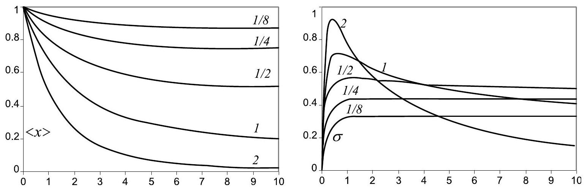

Если $\gamma<1$, то среднее значение стремится к не нулевому уровню $\langle x\rangle= 1-\gamma$. При $\gamma \geqslant 1$ и среднее, и волатильность стремятся к нулю. Это означает, что при большом стохастическом шуме решение вырождается в константу $x=0$. Этот результат качественно отличается от детерминированной задачи, где решение всегда стремилось к $x=1$. Причина подобного поведения состоит в следующем. Снос уравнения имеет точку устойчивого равновесия $x=1$. Она не даёт процессу при блуждании уходить далеко вверх. В результате происходят колебания вокруг равновесного уровня, в процессе которых, рано или поздно, процесс оказывается в значении $x=0$. В этот момент снос и волатильность в уравнении обращаются в ноль, и, несмотря на наличие стохастического члена, дальнейшее изменение $x$ прекращается, так как $d x=0$.

Значение $x=0$ является точкой неустойчивого равновесия, и малейшее внешнее возмущение может решение с неё столкнуть, в том числе и в область $x<0$. Поэтому, вообще говоря, логистическое уравнение необходимо дополнить граничным условием в $x=0$.

Если в качестве начального условия выбрать асимптотическое значение $x_{0}=1-\gamma$, то при небольших $\gamma$ среднее сначала несколько увеличится, а затем начинает асимптотически приближаться к $\langle x\rangle=1-\gamma$.

- Логистическое уравнение имеет устойчивую точку $x_{\infty}=1$, при которой решение детерминированного уравнения $d x=x(1-x) d t$ перестаёт изменяться. Для любого стохастического уравнения с небольшой волатильностью также можно изучить поведение решения в окрестности подобной особой точки. Так, в уравнении

$$
d x=a(x) d t+b(x) \delta W
$$

разложим $a(x)$ в ряд в окрестности $x_{\infty}$, где $a\left(x_{\infty}\right)=0$, а для $b(x)$ возьмём "нулевое" приближение:

$$
d x=a^{\prime}\left(x_{\infty}\right)\left(x-x_{\infty}\right) d t+b\left(x_{\infty}\right) \delta W,
$$

где штрих - производная по $x$.
Если $a^{\prime}\left(x_{\infty}\right)<0$, то это ни что иное, как уравнение Орнштейна-Уленбека, имеющее при больших $t$ следующее решение:

$$
\begin{equation*}
x(t) \rightarrow x_{\infty}+\frac{b\left(x_{\infty}\right)}{\sqrt{-2 a^{\prime}\left(x_{\infty}\right)}} \varepsilon \tag{3.16}
\end{equation*}
$$

являющееся стационарным гауссовым процессом с средним $x_{\infty}$ и волатильностью $b_{\infty} / \sqrt{-2 a_{\infty}^{\prime}}$.

Для логистического уравнения

$$
x_{\infty}=1, \quad a^{\prime}\left(x_{\infty}\right)=-1, \quad b\left(x_{\infty}\right)=\sqrt{2 \gamma},
$$

поэтому приближённое решение в пределе больших времён $t \rightarrow \infty$ в соответствии с формулой (3.16) можно записать в следующем виде:

$$
\begin{equation*}
x(t) \rightarrow 1+\sqrt{\gamma} \varepsilon \tag{3.17}
\end{equation*}
$$

где $\varepsilon$ - гауссово случайное число. Асимптотическое значение среднего равно 1 , а дисперсия - $\gamma$. Сравнивая эти значения с точными (3.13), мы видим, что (3.17) - лишь первое приближение по $\gamma$.

K тому же, на самом деле, стационарная плотность вероятности для логистического блуждания - это гамма-распределение. Оно стремится к гауссовому только, когда параметр стохастического шума $\gamma$ мал.

Таким образом, использовать решение Орнштейна - Уленбека для нелинейных уравнений, имеющих детерминированное стационарное решение, можно только в предположении малости стохастического воздействия. Тем не менее, подобный способ изучения поведения решения очень полезен, особенно в многомерном случае.

## 3.4 Ряды для средних по степеням $t$ *

Решение обыкновенного дифференциального уравнения можно представлять в виде ряда по степеням $t$. Аналогично будем поступать и в стохастическом случае, однако в ряд разложим непосредственно средние величины.

- Для уравнения Ито:

$$
d x=a(x, t) d t+b(x, t) \delta W
$$

возьмём первую итерацию от начального условия $x_{0}=x\left(t_{0}\right)$ :

$$
x=x_{0}+a\left(x_{0}, t_{0}\right)\left(t-t_{0}\right)+b\left(x_{0}, t_{0}\right) \varepsilon \sqrt{t-t_{0}}
$$

Учитывая $\langle\varepsilon\rangle=0$ и $\left\langle\varepsilon^{2}\right\rangle=1$, вычислим, с точностью до линейного приближения по $t-t_{0}$, среднее значение и среднее квадрата:

$$
\begin{aligned}
\langle x\rangle & =x_{0}+a\left(x_{0}, t_{0}\right)\left(t-t_{0}\right)+\ldots \\
\left\langle x^{2}\right\rangle & =x_{0}^{2}+\left[2 x_{0} a\left(x_{0}, t_{0}\right)+b^{2}\left(x_{0}, t_{0}\right)\right]\left(t-t_{0}\right)+\ldots
\end{aligned}
$$

Соответственно, дисперсия процесса в этом приближении будет равна $\sigma_{x}^{2}(t)=b^{2}\left(x_{0}, t_{0}\right)\left(t-t_{0}\right)+\ldots$ Чтобы получить дальнейшие члены разложения, воспользуемся динамическим уравнением для средних.

- Для определённости рассмотрим логистическое уравнение:

$$
d x=x \cdot(1-x) d t+\sqrt{2 \gamma} x \delta W
$$

В этом случае:

$$
\begin{aligned}
\langle x\rangle & =x_{0}+x_{0}\left(1-x_{0}\right) t+f t^{2}+\ldots \\
\left\langle x^{2}\right\rangle & =x_{0}^{2}+2\left[x_{0}^{2}\left(1-x_{0}\right)+\gamma x_{0}^{2}\right] t+\ldots
\end{aligned}
$$

Найдём коэффициент $f$. Для этого подставим разложения в уравнение для среднего:

$$
\langle\dot{x}\rangle=\langle x\rangle-\left\langle x^{2}\right\rangle
$$

ограничившись первым порядком по $t$ :

$$
x_{0} \cdot\left(1-x_{0}\right)+2 f t+\ldots=x_{0} \cdot\left(1-x_{0}\right)+x_{0}\left[1-(3+2 \gamma) x_{0}+2 x_{0}^{2}\right] t+\ldots
$$

откуда:

$$
\frac{2}{x_{0}} f=1-(3+2 \gamma) x_{0}+2 x_{0}^{2}
$$

Аналогично находятся следующие коэффициенты разложения.

- Найдём рекуррентные соотношения для произвольного члена разложения. Выбирая в (3.3), стр. 78, функцию $F(x)=x^{n}$, запишем систему связанных дифференциальных уравнений:

$$
\left\langle\dot{x^{n}}\right\rangle=(n+n(n-1) \gamma)\left\langle x^{n}\right\rangle-n\left\langle x^{n+1}\right\rangle,
$$

Разложим средние в степенной ряд:

$$
\left\langle x^{n}\right\rangle=x_{0}^{n}\left[1+f_{n, 1} t+f_{n, 2} t^{2}+\ldots\right]=x_{0}^{n}\left[1+\sum_{k=1}^{\infty} f_{n, k} t^{k}\right] .
$$

Подставляя его в уравнение для средних и приравнивая коэффициенты при одинаковых степенях $t$, получаем при $k=1,2, \ldots$ систему рекуррентных уравнений ( $f_{n, 0}=1$ ):

$$
k f_{n, k}=n(1+(n-1) \gamma) f_{n, k-1}-n x_{0} f_{n+1, k-1} .
$$

На системе аналитических расчётов Matematica фирмы Wolfram Research, Inc. вычисления среднего с точностью до $t^{5}$ можно записать так:

```
f [n_, 0] := 1;
f[n_, k_] := (n/k)*((1+(n-1)*g)*f[n,k-1] - x0*f[n+1,k-1]);
av = x0; Do[ av += x0*f[1, k]*t^k, {k, 1, 5}];
Collect[av, t, Simplify]
```

Первые две строки представляют собой рекурсивное определение функции $f$. Затем в цикле Do происходит суммирование разложения по $t$. Последняя строка осуществляет вывод результата, сгруппированного в виде множителей при $t^{n}$, к каждому из которых применяется операция упрощения.

Заметим, что для большого числа членов разложения более быстрой будет нерекурсивная реализация программы:

```
f[n_, 0] := 1;
num = 5;
Do[
    Do[
        f[n,k] = (n/k)*((1+(n-1)*g)*f[n,k-1]-x0*f[n+1,k-1]),
    {n, 1, num-k+1}],
{k, 1, num}]
av = x0; Do[ av += x0*f[1, k]*t^k, {k, 1, num}];
Collect[av, t, Simplify]
```

где в двойном цикле по $k$ и $n$ происходит явное вычисление коэффициентов $f_{n, k}$. Хотя и рекурсивную реализацию можно ускорить, написав: $\mathrm{f}\left[\mathrm{n} \_, \mathrm{k} \_\mathrm{l}:=\mathrm{f}[\mathrm{n}, \mathrm{k}]=(\mathrm{n} / \mathrm{k}) * \ldots\right.$

Приведём первые три члена разложения:

$$
\begin{aligned}
\left\langle\frac{x}{x_{0}}\right\rangle & =1+\left[1-x_{0}\right] t+\left[1-(3+2 \gamma) x_{0}+2 x_{0}^{2}\right] \frac{t^{2}}{2!} \\
& +\left[1-\left(7+10 \gamma+4 \gamma^{2}\right) x_{0}+(12+16 \gamma) x_{0}^{2}-6 x_{0}^{3}\right] \frac{t^{3}}{3!}+\ldots
\end{aligned}
$$

Аналогично для дисперсии процесса $\sigma_{x}^{2}(t)=\left\langle x^{2}\right\rangle-\langle x\rangle^{2}$ : $\frac{\sigma_{x}^{2}(t)}{2 \gamma x_{0}^{2}}=t+\left[4+2 \gamma-6 x_{0}\right] \frac{t^{2}}{2!}+\left[12+12 \gamma+4 \gamma^{2}-(48 \gamma+46) x_{0}+38 x_{0}^{2}\right] \frac{t^{3}}{3!}+\ldots$

Подобным образом получаются разложения для моментов произвольного порядка. Выражения несколько упрощаются, если в качестве начального условия выбирается точка детерминированного асимптотического равновесия $x_{0}=1$. При $\gamma=0$ в этом случае решение не зависит от времени. В стохастической системе оно должно проэволюционировать к значению: $x_{0} \rightarrow\langle x\rangle_{\infty}=1-\gamma$. Поэтому зависимость от времени существует:

$$
\begin{aligned}
\frac{\langle x\rangle-1}{2 \gamma}= & -\frac{t^{2}}{2!}+(3-2 \gamma) \frac{t^{3}}{3!}-\left(7-38 \gamma+4 \gamma^{2}\right) \frac{t^{4}}{4!} \\
& +\left(15-334 \gamma+284 \gamma^{2}-8 \gamma^{3}\right) \frac{t^{5}}{5!} \\
& -\left(31-2146 \gamma+7012 \gamma^{2}-1848 \gamma^{3}+16 \gamma^{4}\right) \frac{t^{6}}{6!}+\ldots
\end{aligned}
$$

Графики разложений ( $\gamma=1 / 2$ ) различного порядка (от $k=1$ до $k=10)$ для среднего (слева) и волатильности (справа) имеют вид:
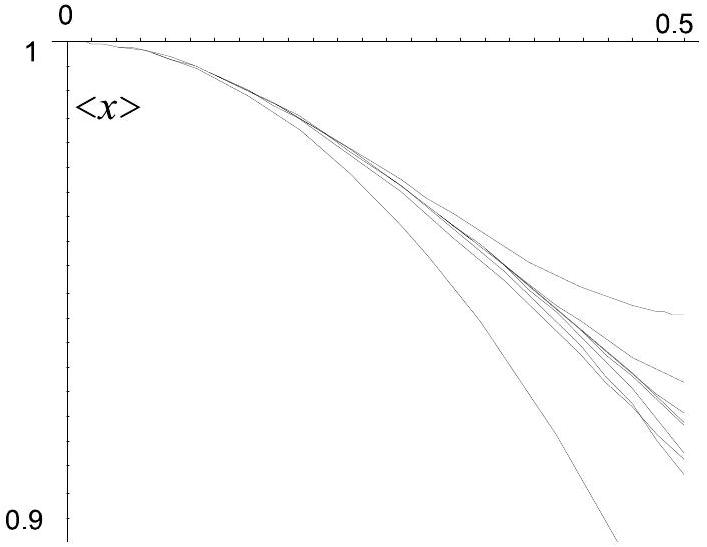
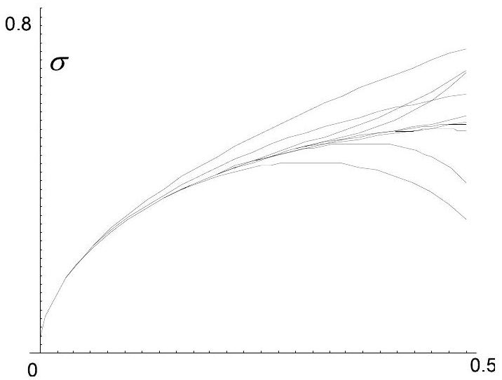

Подобные степенные разложения часто являются асимптотическими рядами и хорошо работают только при малых временах. Однако их сходимость можно улучшать при помощи различных методов, например, аппроксимацией Падэ.

- Естественно, можно строить разложения не только в виде ряда по $t$. Достаточно универсальным является метод последовательных приближений. Его идея в следующем. Выберем некоторые функции $\phi_{n, 0}(t)$, являющиеся нулевым приближением для $\left\langle x^{n}\right\rangle$, так, что $\phi_{n, 0}(0)=x_{0}^{n}$. Подставляя их в правые части уравнений для средних, получаем дифференциальные уравнения. Решая их, мы найдём более точное приближение для функции $\left\langle x^{n}\right\rangle=\phi_{n, 1}(t)$. При повторении этой процедуры будет получаться всё более точное выражение для средних. При этом на каждой итерации необходимо использовать начальное условие $\phi_{n, k}(0)=x_{0}^{n}$. Чем удачнее выбор $\phi_{n, 0}(t)$, тем быстрее будут сходиться к точному значению последовательные приближения, и тем шире диапазон $t$ для их применимости.

Рассмотрим логистическое уравнение:

$$
\left\langle\dot{x^{n}}\right\rangle=n(1+(n-1) \gamma)\left\langle x^{n}\right\rangle-n\left\langle x^{n+1}\right\rangle .
$$

В простейшем случае можно выбрать $\phi_{n, 0}(t)=x_{0}^{n}$. Тогда в первом приближении:

$$
\dot{\phi}_{n, 1}=n(1+(n-1) \gamma) x_{0}^{n}-n x_{0}^{n+1},
$$

откуда:

$$
\phi_{n, 1}=x_{0}^{n}+x_{0}^{n}\left[1+n\left(1-x_{0}\right)+n(n-1) \gamma\right] t,
$$

и т.д. В результате снова получаются степенные ряды по $t$, в которых коэффициенты разложения единым образом выражаются через $n$ для любого $\left\langle x^{n}\right\rangle$.

Другой вариант выбора нулевого приближения $\phi_{n, 0}=x_{0}^{n} e^{-n t}$. В этом случае:

$$
\phi_{n, 1}=x_{0}^{n}+x_{0}^{n}[1+(n-1) \gamma]\left(1-e^{-n t}\right)-\frac{n}{n+1} x_{0}^{n+1}\left(1-e^{-2 n t}\right) .
$$

В качестве нулевого приближения можно выбрать решение детерминированного уравнения. Тогда последовательно получаемые приближения окажутся рядами по величине волатильности стохастического шума $\gamma$.

## 3.5 Квазидетерминированное приближение *

- Рассмотрим одномерное уравнение Ито:

$$
d x=a(x, t) d t+\sigma b(x, t) \delta W
$$

в котором из функции $b(x, t)$ явным образом выделен параметр волатильности процесса $\sigma$. Его мы будем считать малым. Пусть функция $c(t)$ является решением детерминированного уравнения:

$$
\begin{equation*}
\dot{c}=a(c, t) \tag{3.18}
\end{equation*}
$$

Введём новый процесс "отклонения" от детерминированного решения:

$$
z=\frac{x-c(t)}{\sigma} .
$$

В силу Леммы Ито он удовлетворяет уравнению:

$$
d z=\frac{1}{\sigma}[a(c+\sigma z, t)-a(c, t)] d t+b(c+\sigma z, t) \delta W
$$

где вместо $\dot{c}$ мы подставили правую часть уравнения (3.18).
Запишем уравнение для средних (3.3), стр. 78, выбрав $F=z^{n}$ :

$$
\left\langle\dot{z^{n}}\right\rangle=n\left\langle z^{n-1}[a(c+\sigma z, t)-a(c, t)]\right\rangle+\frac{n(n-1)}{2}\left\langle z^{n-2} b^{2}(c+\sigma z, t)\right\rangle .
$$

Разложим в ряд Тейлора по параметру $\sigma$ функции $a$ и $b^{2}$ :

$$
a(c+\sigma z, t)=\sum_{k=0}^{\infty} A_{k}(t)(\sigma z)^{k}, \quad b^{2}(c+\sigma z, t)=\sum_{k=0}^{\infty} D_{k}(t)(\sigma z)^{k} .
$$

Детерминированное решение $c(t)$ нам известно и определяет функции времени $A_{k}=A_{k}(t), D_{k}=D_{k}(t)$. Так как $A_{0}=a(c(t), t)$, то в квадратных скобках уравнения для средних коэффициент $A_{0}$ сокращается, и мы имеем:

$$
\begin{equation*}
\left\langle\dot{z^{n}}\right\rangle=\sum_{k=0}^{\infty}\left[n A_{k+1}\left\langle z^{n+k}\right\rangle+\frac{n(n-1)}{2} D_{k}\left\langle z^{k+n-2}\right\rangle\right] \sigma^{k} . \tag{3.19}
\end{equation*}
$$

Разложим в ряд по степеням $\sigma$ средние значения:

$$
\begin{equation*}
\left\langle z^{n}\right\rangle=\sum_{i=0}^{\infty} z_{i}^{n}(t) \sigma^{i} \tag{3.20}
\end{equation*}
$$

В коэффициентах $z_{i}^{n}, n-$ это верхний индекс, а не степень! Заметим, что $\langle 1\rangle=1$, откуда $z_{i}^{0}=0$ при $i>0$ и $z_{0}^{0}=1$.

Подставим разложение (3.20) в уравнение (3.19). В результате:

$$
\sum_{i=0}^{\infty} \dot{z}_{i}^{n}(t) \sigma^{i}=\sum_{k, i=0}^{\infty}\left[n A_{k+1} z_{i}^{n+k}+\frac{n(n-1)}{2} D_{k} z_{i}^{k+n-2}\right] \sigma^{k+i} .
$$

В двойной сумме в правой части сделаем замену индексов $i=i^{\prime}-k^{\prime}$, $k=k^{\prime}$. Так как $i>0$, то $k^{\prime}<i^{\prime}$. Приравнивая члены при одинаковых степенях $\sigma$ и опуская штрихи у индексов, получаем систему уравнений:

$$
\begin{equation*}
\dot{z}_{i}^{n}(t)=\sum_{k=0}^{i}\left\{n A_{k+1} z_{i-k}^{n+k}+\frac{n(n-1)}{2} D_{k} z_{i-k}^{k+n-2}\right\} . \tag{3.21}
\end{equation*}
$$

Выпишем несколько её первых уравнений:

$$
\begin{aligned}
& \dot{z}_{0}^{1}(t)=A_{1} z_{0}^{1} \\
& \dot{z}_{0}^{2}(t)=2 A_{1} z_{0}^{2}+D_{0} \\
& \dot{z}_{0}^{3}(t)=3 A_{1} z_{0}^{3}+3 D_{0} z_{0}^{1} \\
& \dot{z}_{0}^{4}(t)=4 A_{1} z_{0}^{4}+6 D_{0} z_{0}^{2} \\
& \ldots \\
& \dot{z}_{1}^{1}(t)=A_{1} z_{1}^{1}+A_{2} z_{0}^{2} \\
& \dot{z}_{1}^{2}(t)=2 A_{1} z_{1}^{2}+2 A_{2} z_{0}^{3}+D_{1} z_{0}^{1} \\
& \dot{z}_{1}^{3}(t)=3 A_{1} z_{1}^{3}+3 A_{2} z_{0}^{4}+3 D_{0} z_{1}^{1}+3 D_{1} z_{0}^{2} \\
& \ldots \\
& \dot{z}_{2}^{1}(t)=A_{1} z_{2}^{1}+A_{2} z_{1}^{2}+A_{3} z_{0}^{3} \\
& \dot{z}_{2}^{2}(t)=2 A_{1} z_{2}^{2}+2 A_{2} z_{1}^{3}+2 A_{3} z_{0}^{4}+D_{1} z_{1}^{1}+D_{2} z_{0}^{2} \\
& \ldots \\
& \dot{z}_{3}^{1}(t)=A_{1} z_{3}^{1}+A_{2} z_{2}^{2}+A_{3} z_{1}^{3}+A_{4} z_{0}^{4}, \ldots
\end{aligned}
$$

Так как начальные условия учтены в детерминированном решении $x_{0}= c\left(t_{0}\right)$, то для процесса $z(t)$ они имеют вид $z\left(t_{0}\right)=0$. Соответственно равны нулю и все средние $\left\langle z^{n}\right\rangle$ при $t=t_{0}$. Систему уравнений (3.21) можно решать как аналитически, так и численно, используя конечные приращения для производных по времени.

Если в задаче при $t \rightarrow \infty$ возможен стационарный режим, в котором $\dot{z}_{i}^{n}=0$, то, приравняв левые части уравнений к нулю, получим систему с постоянными коэффициентами $A_{k}=A_{k}(\infty), D_{k}=D_{k}(\infty)$, которая легко решается. В частности:

$$
\begin{aligned}
\langle z\rangle & =\frac{A_{2} D_{0}}{2 A_{1}^{2}} \sigma-\ldots \\
\left\langle z^{2}\right\rangle & =-\frac{D_{0}}{2 A_{1}}+\frac{D_{0}}{4 A_{1}^{4}}\left(D_{0}\left(5 A_{2}^{2}-3 A_{1} A_{3}\right)-3 D_{1} A_{1} A_{2}+D_{2} A_{1}^{2}\right) \sigma^{2}+\ldots
\end{aligned}
$$

Особенно удобен этот способ вычисления средних в многомерном случае, когда стационарное уравнение Фоккера-Планка решить сложно.

- В качестве примера рассмотрим сначала точно решаемую задачу логарифмического блуждания:

$$
d x=\mu x d t+\sigma x \delta W
$$

Как известно (стр. 58), средние значения имеют вид:

$$
\langle x\rangle=x_{0} e^{\mu t}, \quad\left\langle x^{2}\right\rangle=x_{0}^{2} e^{2 \mu t+\sigma^{2} t}=x_{0}^{2} e^{2 \mu t}\left[1+\sigma^{2} t+\frac{\sigma^{4} t^{2}}{2}+\ldots\right] .
$$

Так как уравнение линейно по $x$, детерминированное решение $c(t)$ совпадает с выражением для среднего. Ненулевые значения коэффициентов разложения сноса и дисперсии имеют вид:

$$
A_{1}=\mu, \quad D_{0}=x_{0}^{2} e^{2 \mu t}, \quad D_{1}=2 x_{0} e^{\mu t}, \quad D_{2}=1 .
$$

В результате ряды обрываются, и уравнения принимают вид:

$$
\dot{z}_{i}^{n}=n \mu z_{i}^{n}+\frac{n(n-1)}{2}\left[x_{0}^{2} e^{2 \mu t} z_{i}^{n-2}+2 x_{0} e^{\mu t} z_{i-1}^{n-1}+z_{i-2}^{n}\right] .
$$

Среднее значение ( $n=1$ ) для любой $i$-й поправки удовлетворяет уравнениям $\dot{z}_{i}^{1}=\mu z_{i}^{1}$. Так как $z(0)=0$, то все $z_{i}^{1}=0$, и, следовательно, $\langle x\rangle=c(t)=x_{0} e^{\mu t}$. Для среднего квадрата:

$$
\begin{array}{cll}
\dot{z}_{0}^{2}=2 \mu z_{0}^{2}+x_{0}^{2} e^{2 \mu t} & => & z_{0}^{2}=x_{0}^{2} e^{2 \mu t} t \\
\dot{z}_{1}^{2}=2 \mu z_{1}^{2} & => & z_{1}^{2}=0 \\
\dot{z}_{2}^{2}=2 \mu z_{2}^{2}+z_{0}^{2} & => & z_{0}^{2}=x_{0}^{2} e^{2 \mu t} t^{2} / 2, \ldots
\end{array}
$$

В итоге получаем разложение в ряд по $\sigma$ точного решения.

- Найдём теперь стохастические поправки к детерминированному решению для более сложного логистического уравнения:

$$
d x=x \cdot(1-x) d t+\sigma x \delta W
$$

Его детерминированное решение имеет вид (см. стр. 10):

$$
c(t)=\left[1-\lambda e^{-t}\right]^{-1}
$$

где $\lambda=1-x_{0}^{-1}$. Ненулевые коэффициенты разложения сноса и дисперсии равны:

$$
A_{1}=1-2 c(t), \quad A_{2}=-1, \quad D_{0}=c^{2}(t), \quad D_{1}=2 c(t), \quad D_{2}=1 .
$$

В асимптотическом пределе $t \rightarrow \infty$ детерминированное решение $c(t)$ стремится к единице, и полученные выше выражения для $\langle z\rangle,\left\langle z^{2}\right\rangle$ воспроизводят точные значения для среднего и волатильности (3.13), стр.89.

В произвольный момент времени первое уравнение системы для средних (3.21) имеет вид:

$$
\dot{z}_{0}^{1}(t)=[1-2 c(t)] z_{0}^{1}(t) \quad=>\quad z_{0}^{1}(t)=\frac{z_{0} e^{-t}}{\left(1-\lambda e^{-t}\right)^{2}}
$$

Так как $z(0)=0$, то, следовательно, константа интегрирования $z_{0}$ равна нулю, и, соответственно, поправка к $z$, пропорциональная $\sigma$, также равна нулю $z_{0}^{1}(t)=0$. Аналогично равны нулю $z_{1}^{3}(t)=z_{1}^{2}(t)=z_{2}^{1}(t)=0$. Ведущий член для $\left\langle z^{2}\right\rangle$ подчиняется уравнению

$$
\dot{z}_{0}^{2}(t)=2[1-2 c(t)] z_{0}^{2}(t)+c^{2}(t)
$$

решение которого с начальным условием $z_{0}^{2}(0)=0$ имеет вид:

$$
z_{0}^{2}(t)=\frac{1-4 \lambda e^{-t}+\left(2 \lambda^{2} t+4 \lambda-1\right) e^{-2 t}}{2\left(1-\lambda e^{-t}\right)^{4}}
$$

Четвёртая степень $\left\langle z^{4}\right\rangle$ в нулевом приближении выражается через $z_{0}^{2}$ :

$$
z_{0}^{4}(t)=3\left(z_{0}^{2}(t)\right)^{2}
$$

Наконец, первая поправка к среднему значению равняется:

$$
z_{1}^{1}(t)=-\frac{1-2(1+\lambda(t-1)) e^{-t}+(1-2 \lambda) e^{-2 t}}{2\left(1-\lambda e^{-t}\right)^{3}}
$$

Дальше члены разложения становятся достаточно громоздкими. Приведём их вид, когда $\lambda=0$, т.е. начальное значение стохастического процесса стартует с асимптотически равновесного уровня $x=1$. В этом случае среднее значение для $x$ с точностью до $\sigma^{4}$ равно:

$$
\langle x\rangle=1-\left(1-e^{-t}\right)^{2} \frac{\sigma^{2}}{2}+e^{-t}\left(2-3 e^{-t}\right)\left(2 t-3+4 e^{-t}-e^{-2 t}\right) \frac{\sigma^{4}}{4}
$$

Аналогично для среднего квадрата:

$$
\left\langle x^{2}\right\rangle=1-\left(1-4 e^{-t}+3 e^{-2 t}\right) \frac{\sigma^{2}}{2}+\ldots
$$

Мы видим, что сложность аналитических выражений достаточно быстро увеличивается. Для практических целей иногда имеет смысл использовать численное решение системы дифференциальных уравнений. В этом случае при небольших $\sigma$ мы будем получать средние значения быстрее, чем при использовании Монте-Карло - моделирования.

## Глава 4

## Вероятности

Ещё одним способом получения информации о поведении стохастического процесса является решение уравнений для условной плотности вероятности $P\left(x_{0}, t_{0} \Rightarrow x, t\right)$, которым посвящена эта глава.

На простых примерах будут продемонстрированы методы решения подобных уравнений. Затем мы рассмотрим вопрос о граничных условиях, которые наиболее естественным образом учитываются при помощи уравнения Фоккера-Планка. Будет вычислено среднее время достижения границы и построен простой метод решения уравнения Фоккера-Планка при наличии граничных условий. Решения уравнений $x(t)=f(t, \varepsilon)$ мы часто записываем при помощи гауссовой случайной переменной $\varepsilon$. Для функции двух аргументов $f(t, \varepsilon)$ будет получено нелинейное дифференциальное уравнение в частных производных.

## 4.1 Марковские плотности вероятности

- Вернёмся к винеровскому процессу с нулевым сносом $\mu=0$ и единичной волатильностью. Так как случайная функция $x(t)$ зависит от гауссовой переменной $\varepsilon$ :

$$
x=x_{0}+\varepsilon \sqrt{t-t_{0}} \quad=>\quad \varepsilon=\left(x-x_{0}\right) / \sqrt{t-t_{0}}
$$

то, воспользовавшись распределением Гаусса (см. стр. 67), можно записать условную плотность вероятности в виде:

$$
\begin{equation*}
P\left(x_{0}, t_{0} \Rightarrow x, t\right)=\frac{1}{\sqrt{2 \pi\left(t-t_{0}\right)}} \exp \left\{-\frac{1}{2} \frac{\left(x-x_{0}\right)^{2}}{t-t_{0}}\right\} . \tag{4.1}
\end{equation*}
$$

Чем меньше разница $t-t_{0}$, тем более высоким и узким будет колокол гауссианы, стремясь в пределе $t \rightarrow t_{0}$ к дельта-функции Дирака:

$$
\begin{equation*}
P\left(x_{0}, t_{0} \Rightarrow x, t\right)=\delta\left(x-x_{0}\right) \quad t \rightarrow t_{0} . \tag{4.2}
\end{equation*}
$$

Она равна бесконечности при $x=x_{0}$ и нулю в других точках, так, что интеграл по $x$ в окрестности $x_{0}$ равен единице (см. Приложение М, стр. 315). Функции Дирака равна любая условная плотность вероятности при $t=t_{0}$. Действительно, в бесконечно близкий к $t_{0}$ момент времени отлична от нуля только вероятность в окрестности начального значения $x \approx x_{0}$.

K дельта-функции Дирака при $t \rightarrow t_{0}$ стремится также условная плотность вероятности Коши:

$$
\begin{equation*}
P\left(x_{0}, t_{0} \Rightarrow x, t\right)=\frac{\left(t-t_{0}\right) / \pi}{\left(x-x_{0}\right)^{2}+\left(t-t_{0}\right)^{2}} \tag{4.3}
\end{equation*}
$$

Интеграл от этой функции по $x$ равен единице, среднее значение $-x_{0}$. Однако моменты второго и более высоких порядков равны бесконечности. Соответственно равна бесконечности волатильность. В результате становятся вероятными очень большие выбросы случайных чисел. Подобные процессы называются процессами со скачками. У колокола распределения существует типичная ширина, пропорциональная $t-t_{0}$. По мере удаления от начального момента времени происходит "расплывание" распределения вероятностей и очень быстрый уход процесса от начального значения $x_{0}$. Поэтому в теории диффузных процессов мы не рассматриваем распределение Коши, хотя, как мы увидим чуть ниже, оно является марковским.

- Плотность вероятности марковских процессов должна удовлетворять определённым уравнениям. Рассмотрим три последовательных момента времени $t_{1}<t_{2}<t_{3}$, в которых $x(t)$ принимает значения $x_{1}, x_{2}$ и $x_{3}$. Совместная плотность вероятности для $x_{1}$ и $x_{3}$ равна:

$$
\begin{equation*}
P\left(x_{1}, x_{3}\right)=\int P\left(x_{1}, x_{2}, x_{3}\right) d x_{2} \tag{4.4}
\end{equation*}
$$

где для краткости опущены времена $t_{i}$. В (4.4) мы суммируем все возможные реализации "промежуточного" значения $x_{2}$. В результате из трехточечной совместной плотности вероятности получается двуточечная. Подставим в левую часть $P\left(x_{1}, x_{3}\right)=P\left(x_{1}\right) P\left(x_{1} \Rightarrow x_{3}\right)$ определение условной вероятности, а в правую, с учётом марковости процесса, трёхточечную плотность вероятности (см. (1.42), на стр. 37):

$$
P\left(x_{1}, x_{2}, x_{3}\right)=P\left(x_{1}\right) P\left(x_{1} \Rightarrow x_{2}\right) P\left(x_{2} \Rightarrow x_{3}\right) .
$$

Восстанавливая времена, получаем:

$$
\begin{equation*}
P\left(x_{1}, t_{1} \Rightarrow x_{3}, t_{3}\right)=\int P\left(x_{1}, t_{1} \Rightarrow x_{2}, t_{2}\right) P\left(x_{2}, t_{2} \Rightarrow x_{3}, t_{3}\right) d x_{2} \tag{4.5}
\end{equation*}
$$

Это интегральное уравнение Чепмена-Колмогорова. В качестве упражнения ( $\lessdot \mathrm{H}_{24}$ ) имеет смысл проверить, что этому уравнению удовлетворяет гауссова плотность вероятности (4.1). Второе упражнение ( ⟵ $\mathrm{H}_{25}$ ) состоит в записи уравнения Чепмена-Колмогорова для характеристических функций, если $P\left(x_{0}, t_{0} \Rightarrow x, t\right)=P\left(x-x_{0}, t-t_{0}\right)$, и проверке марковости распределения Коши (4.3).

Уравнению Чепмена-Колмогорова должны удовлетворять любые вероятности марковских процессов. Правда в таком виде оно слишком общее, и нам нужны его более конкретные представления. В уравнении $(4.5)$ времена $t_{1}, t_{2}$ и $t_{3}$ могут быть удалены друг от друга как угодно далеко. Однако особый интерес представляет ситуация бесконечно близких времён. В результате глобальные свойства $P\left(x_{0}, t_{0} \Rightarrow x, t\right)$ определяются из решений локальных дифференциальных уравнений. Так как условная плотность вероятности имеет две пары аргументов, то возможны, по крайней мере, два уравнения относительно $\left\{x_{0}, t_{0}\right\}$ и $\{x, t\}$. Из (4.5) в следующем разделе мы получим уравнение относительно $\left\{x_{0}, t_{0}\right\}$, которое называется первым уравнением Колмогорова. Аналогично выводится уравнение Фоккера-Планка, или второе уравнение Колмогорова относительно $\{x, t\}$. Мы найдём его при помощи стохастического дифференциального уравнения. Этот вывод покажет непосредственную связь двух математических аппаратов.

## 4.2 Уравнения для $P\left(x_{0}, t_{0} \Rightarrow x, t\right)$

- Найдём уравнение относительно переменных начального значения $x_{0}, t_{0}$. Для этого воспользуемся уравнением Чепмена-Колмогорова. Чтобы возникла производная по времени $t_{0}$, необходимо рассмотреть $t_{0}$ и бесконечно близкое к нему время $t_{0}+\Delta t$. Поэтому для трёх последовательных моментов времени в интегральном уравнении возьмём два соседних $t_{1}=t_{0}, t_{2}=t_{0}+\Delta t$ и одно "будущее" $t_{3}=t$ :

$$
P\left(x_{0}, t_{0} \Rightarrow x, t\right)=\int_{-\infty}^{\infty} P\left(x_{0}, t_{0} \Rightarrow y, t_{0}+\Delta t\right) \underbrace{P\left(y, t_{0}+\Delta t \Rightarrow x, t\right)}_{\left(y-x_{0}\right)} d y
$$

Интервал $\Delta t$ мал и, следовательно, величина $y$, соответствующая моменту времени $t_{0}+\Delta t$, должна быть близка к $x_{0}$ в момент времени $t_{0}$. Поэтому разложим в ряд Тейлора по $y-x_{0}$, в окрестности точки $y=x_{0}$, второй множитель под интегралом:

$$
P\left(y, t_{0}+\Delta t \Rightarrow x, t\right)=P+\frac{\partial P}{\partial x_{0}}\left(y-x_{0}\right)+\frac{1}{2} \frac{\partial^{2} P}{\partial x_{0}^{2}}\left(y-x_{0}\right)^{2}+\ldots,
$$

где $P=P\left(x_{0}, t_{0}+\Delta t \Rightarrow x, t\right)$. Вынесем множители, не зависящие от $y$, за знак интеграла. Опуская пределы интегрирования, запишем:

$$
\begin{aligned}
P\left(x_{0}, t_{0} \Rightarrow x, t\right) & =P\left(x_{0}, t_{0}+\Delta t \Rightarrow x, t\right) \int P\left(x_{0}, t_{0} \Rightarrow y, t_{0}+\Delta t\right) d y \\
& +\frac{\partial P}{\partial x_{0}} \int\left(y-x_{0}\right) P\left(x_{0}, t_{0} \Rightarrow y, t_{0}+\Delta t\right) d y \\
& +\frac{1}{2} \frac{\partial^{2} P}{\partial x_{0}^{2}} \int\left(y-x_{0}\right)^{2} P\left(x_{0}, t_{0} \Rightarrow y, t_{0}+\Delta t\right) d y \\
& +\ldots
\end{aligned}
$$

Первое слагаемое соответствует условию нормировки (переход "хоть куданибудь"), и интеграл равен единице. В результате получается просто $P$.

Перенесём направо $P\left(x_{0}, t_{0} \Rightarrow x, t\right)$ и разделим обе части на $\Delta t$. По определению, при $\Delta t \rightarrow 0$ мы можем записать:

$$
\frac{P\left(x_{0}, t_{0}+\Delta t \Rightarrow x, t\right)-P\left(x_{0}, t_{0} \Rightarrow x, t\right)}{\Delta t} \rightarrow \frac{\partial P\left(x_{0}, t_{0} \Rightarrow x, t\right)}{\partial t_{0}}
$$

что приводит к производной по начальному моменту времени $t_{0}$.

Интегрирование по $y$ во втором и третьем слагаемых даёт условные средние моментов первого и второго порядков:

$$
\frac{\partial P\left(x_{0}, t_{0} \Rightarrow x, t\right)}{\partial t_{0}}+\frac{\partial P}{\partial x_{0}} \frac{\left\langle\left(x-x_{0}\right)\right\rangle}{\Delta t}+\frac{1}{2} \frac{\partial^{2} P}{\partial x_{0}^{2}} \frac{\left\langle\left(x-x_{0}\right)^{2}\right\rangle}{\Delta t}=0 .
$$

Если бы мы продолжили разложение в ряд Тейлора, то в этом уравнении стояли бы также моменты более высоких порядков $\left\langle\left(x-x_{0}\right)^{3}\right\rangle$, и т.д. Однако для диффузных процессов они по определению в пределе $\Delta t \rightarrow 0$ равны нулю (см. стр. 50).

Средние значения, как обычно, вычисляются при помощи условной плотности вероятности $(\Delta t \rightarrow 0)$ :

$$
\left\langle\left(x-x_{0}\right)^{m}\right\rangle=\int_{-\infty}^{\infty}\left(x-x_{0}\right)^{m} P\left(x_{0}, t_{0} \Rightarrow x, t_{0}+\Delta t\right) d x
$$

При вычислении предела $\Delta t \rightarrow 0$ сначала необходимо проинтегрировать, вычислив среднее, затем полученную функцию от $\Delta t$ разделить на $\Delta t$, и только после этого устремить к нулю $\Delta t \rightarrow 0$.

Мы видим, что снос и диффузия естественным образом появляются как в уравнениях для плотности вероятности случайного процесса, так и в стохастических дифференциальных уравнениях при записи их через разности.

В результате, вводя коэффициенты сноса и диффузии, получаем "nepвое уравнение Колмогорова":

$$
\begin{equation*}
\frac{\partial P}{\partial t_{0}}+a\left(x_{0}, t_{0}\right) \frac{\partial P}{\partial x_{0}}+\frac{1}{2} b^{2}\left(x_{0}, t_{0}\right) \frac{\partial^{2} P}{\partial x_{0}^{2}}=0 \tag{4.6}
\end{equation*}
$$

где $P=P\left(x_{0}, t_{0} \Rightarrow x, t\right)$. Заметим, что производные в этом уравнении берутся не по будущим аргументам $x$ и $t$, а по начальным $x_{0}$ и $t_{0}$.

Если значение $x_{0}=x\left(t_{0}\right)$ задано точно, то первое уравнение Колмогорова необходимо решать с "начальными" условиями в виде дельтафункции Дирака:

$$
\begin{equation*}
P\left(x_{0}, t_{0} \Rightarrow x, t\right)=\delta\left(x-x_{0}\right) \quad t \rightarrow t_{0} . \tag{4.7}
\end{equation*}
$$

Естественно, кроме этого предполагается наличие тех или иных граничных условий. В простейшем случае требуют достаточно быстрого убывания плотности вероятности при увеличении разности $x-x_{0}$ в любой момент времени $t>t_{0}$.

- Выведем теперь второе дифференциальное уравнение для функции $P\left(x_{0}, t_{0} \Rightarrow x, t\right)$ по "будущим" аргументам $x, t$. Пусть процесс Ито в момент времени $t-\Delta t$ имеет значение $x$. Спустя малый интервал времени $\Delta t$ он будет иметь значение $y$ :

$$
\begin{equation*}
y=x+a \Delta t+b \varepsilon \sqrt{\Delta t}, \tag{4.8}
\end{equation*}
$$

где $a=a(x, t-\Delta t), b=b(x, t-\Delta t)$. Величина $x$ является случайной с плотностью распределения $P(x, t-\Delta t)=P\left(x_{0}, t_{0} \Rightarrow x, t-\Delta t\right)$. Случайной и независимой от неё будет и $\varepsilon$ с гауссовой плотностью $P(\varepsilon)$. В результате $y$ в момент $t$ также будет случайной величиной.

Чтобы найти распределение $P(y, t)=P\left(x_{0}, t_{0} \Rightarrow y, t\right)$, необходимо вычислить среднее от произвольной функции (см. стр. 22):

$$
\begin{equation*}
\langle F(y)\rangle=\int_{-\infty}^{\infty} \overbrace{F(x+a \Delta t+b \varepsilon \sqrt{\Delta t})}^{F(y)} \overbrace{P(x, t-\Delta t) P(\varepsilon)}^{P(x, \varepsilon)} d x d \varepsilon \tag{4.9}
\end{equation*}
$$

и преобразовать его таким образом, чтобы получился однократный интеграл с $F(y)$ в момент времени $t$. Обратим внимание, что, если в (4.8) $x, y$ и $\varepsilon$ - это случайные величины, потенциально принимающие любые значения, то в (4.9) они же выступают в виде обычных вещественных переменных интегрирования.

Так как $\Delta t$ мало, разложим $F(.$.$) в ряд, оставляя члены порядка не$ более $\Delta t$ :
$F(x+a \Delta t+b \varepsilon \sqrt{\Delta t})=F(x)+\frac{\partial F}{\partial x}(a \Delta t+b \varepsilon \sqrt{\Delta t})+\frac{1}{2} \frac{\partial^{2} F}{\partial x^{2}} b^{2} \varepsilon^{2} \Delta t+\ldots$
Все функции справа вычислены в точке $x$ и в момент времени $t$. Заметим, что в (4.8) функции вычислялись в момент времени $t-\Delta t$. На самом деле их тоже необходимо разложить по $\Delta t$. Однако эти ряды будут умножаться на $\Delta t, \sqrt{\Delta t}$ и окажутся малыми более высокого порядка. Поэтому можно взять ведущее приближение разложения и считать в дальнейшем, что $a=a(x, t), b=b(x, t)$.

Аналогично раскладывается плотность вероятности по $\Delta t$ :

$$
P(x, t-\Delta t)=P(x, t)-\frac{\partial P(x, t)}{\partial t} \Delta t+\ldots
$$

Этим соотношением мы связываем плотности вероятности в два бесконечно близких момента времени, в результате чего в конечном уравнении появится частная производная по времени.

Подставим последние два разложения в (4.9), выдерживая порядок малости по $\Delta t$. Интегрирование по $\varepsilon$ сводится к $\langle\varepsilon\rangle=0,\left\langle\varepsilon^{2}\right\rangle=1$, и в результате:

$$
\langle F(y)\rangle=\int_{-\infty}^{\infty} F(x) P(x, t) d x-\Delta t \int_{-\infty}^{\infty}\left[F \frac{\partial P}{\partial t}-\frac{\partial F}{\partial x} a P-\frac{1}{2} \frac{\partial^{2} F}{\partial x^{2}} b^{2} P\right] d x
$$

Во втором интеграле $F=F(x), P=P(x, t)$. Первый интеграл представляет определение искомого среднего в момент времени $t$ (переменная интегрирования $x$ может быть переобозначена в $y$ ). Поэтому второй интеграл должен быть равен нулю. Интегрируя по частям один раз второе слагаемое в квадратных скобках и два раза третье ( ⟵ $\mathrm{C}_{23}$ ), получим $F(x)$, умноженную на выражение:

$$
\begin{equation*}
\frac{\partial P}{\partial t}+\frac{\partial}{\partial x}[a(x, t) P]-\frac{1}{2} \frac{\partial^{2}}{\partial x^{2}}\left[b^{2}(x, t) P\right]=0 \tag{4.10}
\end{equation*}
$$

которое должно быть равно нулю (в силу произвольности $F(x)$ ). Это уравнение Фоккера - Планка, или второе уравнение Колмогорова для плотности условной вероятности $P=P\left(x_{0}, t_{0} \Rightarrow x, t\right)$.

Решение уравнения Фоккера-Планка позволяет найти плотность вероятности условного перехода. Имея её, мы фактически знаем о марковском случайном процессе всё. Можем вычислять его среднее, волатильность, автокорреляционную функцию и отвечать на другие вопросы.

Естественно, кроме начального условия (4.7), предполагается наличие граничных условий для плотности вероятности. Так как мы знаем, что в момент времени $t_{0}$ значение $x$ было равно $x_{0}$, то спустя конечный интервал времени цена или броуновская частица не могут "заблуждать" бесконечно далеко. Поэтому мы считаем, что плотность вероятности на бесконечности равна нулю. Это же требование возникает в силу условия нормировки:

$$
\begin{equation*}
\int_{-\infty}^{\infty} P\left(x_{0}, t_{0} \Rightarrow x, t\right) d x=1 \tag{4.11}
\end{equation*}
$$

имеющего смысл вероятности перехода "куда угодно".
Так как дифференциальное уравнение (4.10) линейно относительно функции $P$, то решение не изменяется при умножении $P$ на произвольную константу. Её значение должно фиксироваться при помощи условия нормировки (4.11).

## 4.3 Решение уравнения Фоккера-Планка

- В качестве примера решения уравнения Фоккера-Планка рассмотрим случай винеровского блуждания с $a(x, t)=0$ и $b(x, t)=\sigma$ :

$$
\begin{equation*}
\frac{\partial P}{\partial t}=\frac{\sigma^{2}}{2} \frac{\partial^{2} P}{\partial x^{2}} \tag{4.12}
\end{equation*}
$$

Это уравнение теплопроводности с коэффициентом диффузии $\sigma^{2}$. Именно оно дало название диффузным процессам. Представим $P(x, t)$ (аргументы начальных условий опускаем) в виде фурье-интеграла (см. Приложение М, стр. 314):

$$
\begin{equation*}
P(x, t)=\int_{-\infty}^{\infty} \phi(k, t) e^{-i k x} \frac{d k}{2 \pi} \tag{4.13}
\end{equation*}
$$

Подставляя его в (4.12), получаем для $\phi(s, t)$ следующее уравнение:

$$
\begin{equation*}
\frac{\partial \phi}{\partial t}=-\frac{\sigma^{2} k^{2}}{2} \phi \tag{4.14}
\end{equation*}
$$

При его решении возникает произвольная константа, для определения которой необходимо воспользоваться начальным условием:

$$
P\left(x, t_{0}\right)=P\left(x_{0}, t_{0} \Rightarrow x, t_{0}\right)=\delta\left(x-x_{0}\right)=\int_{-\infty}^{\infty} e^{-i\left(x-x_{0}\right) k} \frac{d k}{2 \pi}
$$

Поэтому фурье-образ плотности вероятности при $t=t_{0}$ должен быть равен $\phi\left(k, t_{0}\right)=e^{i x_{0} k}$. В результате решение (4.14) имеет вид:

$$
\phi(k, t)=e^{-\sigma^{2} k^{2}\left(t-t_{0}\right) / 2+i x_{0} k}
$$

Выполняя интегрирование (4.13) при помощи интеграла (14), стр. 312, приходим к гауссовой плотности условной вероятности:

$$
P=\int_{-\infty}^{\infty} e^{-\sigma^{2} k^{2}\left(t-t_{0}\right) / 2-i k\left(x-x_{0}\right)} \frac{d k}{2 \pi}=\frac{1}{\sigma \sqrt{2 \pi\left(t-t_{0}\right)}} \exp \left\{-\frac{1}{2 \sigma^{2}} \frac{\left(x-x_{0}\right)^{2}}{\left(t-t_{0}\right)}\right\}
$$

Видно, что волатильность в гауссиане увеличивается с течением времени, как $\sigma \sqrt{t-t_{0}}$. Среднее значение равно начальному $x_{0}$. Плотность вероятности вокруг $x_{0}$ симметрична и постепенно "расплывается", увеличивая свою ширину. Таким образом, лучшим прогнозом будущего $x$ будет его начальное значение $x_{0}$.

Аналогично можно решить уравнение Фоккера-Планка, соответствующее процессу: $d x=f(t) d t+s(t) \delta W\left(\lessdot \mathrm{H}_{26}\right)$, и несколько длиннее, при помощи метода характеристик (стр. 316), - для процесса ОрнштейнаУленбека: $d x=-\beta \cdot(x-\alpha) d t+\sigma \delta W\left(\lessdot \mathrm{H}_{28}\right)$.

- Мы уже обсуждали в конце раздела §2.7, стр. 71, что начальные условия могут быть заданы с некоторой вероятностью. Например, это происходит, когда учитывают неизбежные измерительные ошибки при определении $x_{0}=x\left(t_{0}\right)$. Возможны и более экзотические ситуации начальной неопределённости.

С точки зрения решения уравнения Фоккера-Планка это означает, что начальное условие для плотности вероятности равно не дельта - функции Дирака, а некоторой задаваемой функции $P_{0}\left(x_{0}\right)$. Для неё тоже можно записать фурье - преобразование:

$$
P_{0}\left(x_{0}\right)=\int_{-\infty}^{\infty} \phi_{0}(k) e^{-i k x_{0}} \frac{d k}{2 \pi}
$$

При решении уравнения для винеровского блуждания с учётом этого начального условия мы имеем:

$$
\phi(k, t)=\phi_{0}(k) e^{-\sigma^{2} k^{2}\left(t-t_{0}\right) / 2} .
$$

Чтобы получить вероятность будущих значений $x$, необходимо вычислить интеграл (4.13). Рассмотрим случай, когда начальные условия имеют гауссову форму:

$$
P_{0}\left(x_{0}\right)=\frac{1}{b \sqrt{2 \pi}} e^{-\left(x_{0}-a\right)^{2} / 2 b^{2}} \quad=>\quad \phi_{0}(k)=e^{i a k-b^{2} k^{2} / 2}
$$

где $a$ - среднее значение, а $b$ - волатильность (ошибка измерения $x_{0}$ ). В этом случае снова получится гауссова плотность $P(x, t)$, зависящая от времени, но волатильность в ней будет заменена следующим образом:

$$
\sigma^{2}\left(t-t_{0}\right) \rightarrow b^{2}+\sigma^{2}\left(t-t_{0}\right) .
$$

Другими словами, неопределённость в будущем значении $x$ определяется начальной неопределённостью $b$ и "привнесённой" случайным блужданием $\sigma^{2}\left(t-t_{0}\right)$. Этот результат для волатильностей справедлив и в случае произвольного распределения $P_{0}\left(x_{0}\right)$. Действительно, полагая $t_{0}=0$, при помощи гауссовой случайной величины $\varepsilon \sim N(0,1)$ запишем решение винеровского процесса:

$$
x=x_{0}+\sigma \sqrt{t} \varepsilon .
$$

Считая $x_{0}$ случайной величиной, получаем:

$$
\sigma_{x}^{2}=\left\langle(x-\bar{x})^{2}\right\rangle=\left\langle\left(x_{0}-\bar{x}_{0}-\sigma \sqrt{t} \varepsilon\right)^{2}\right\rangle=\left\langle\left(x_{0}-\bar{x}_{0}\right)^{2}\right\rangle+\sigma^{2} t,
$$

где мы воспользовались независимостью будущего блуждания и начальных условий $\left\langle x_{0} \varepsilon\right\rangle=\left\langle x_{0}\right\rangle\langle\varepsilon\rangle=0$.

## 4.4 Граничные условия

- При логарифмическом блуждании (2.24), стр. 58, линейная зависимость сноса и волатильности от $x$ приводит к тому, что решение положительно $x>0$. Однако не всегда возможно ограничить диапазон значений решения в рамках только уравнений. Чаще задаются внешние к уравнению граничные условия. Они могут быть различных типов.

△ Отражающие граничные условия изменяют знак приращения $d x$ при достижении границы. Например, броуновская частица, на которую действует сила тяжести, будет постепенно опускаться вниз. Однако сосуд, в котором она находится, ограничен снизу дном. При его достижении частица отразится и продолжит блуждание в соответствии с уравнением. Так как сила тяжести (снос) продолжает действовать, частица будет постоянно возвращаться и отражаться от граничной поверхности. В результате со временем установится некоторое стационарное распределение вероятностей координат и скорости броуновской частицы.

- Поглощающие граничные условия предполагают прекращение процесса при достижении границы. Если $x$ - координата частицы, то на поглощающей границе она удаляется из пространства. Поэтому полная вероятность нахождения в пространстве должна со временем уменьшаться. Наиболее естественная интерпретация подобной ситуации состоит в блуждании в области $[\alpha . . \beta]$ большого числа частиц, концентрация которых пропорциональна плотности вероятности. По мере достижения частицами границ они удаляются, и общая концентрация падает.
- Периодические граничные условия накладывают, когда при достижении некоторой границы $x=\alpha$ происходит перемещение $x$ на другую границу $x=\beta$, откуда процесс продолжает развиваться в соответствии со стохастическим уравнением. Примером периодических граничных условий будет блуждание броуновской частицы внутри кольца, заполненного водой. В этом случае угловая координата $\phi$, задающая её положение, обладает свойством периодичности, так как значения $\phi=0$ и $\phi=2 \pi$ эквивалентны.

Решение стохастических дифференциальных уравнений при наличии граничных условий обычно удаётся получить только численным образом. Для этого моделируется процесс блуждания, в котором при достижении границы проводится локальное изменение $x$ в соответствии с граничными условиями. По большому числу реализаций подобных выборочных процессов можно вычислить средние значения интересующих нас величин или плотность условной вероятности.

- Более удобным инструментом изучения поведения системы в таких ситуациях является уравнение Фоккера - Планка (4.10), стр. 107, для плотности вероятности $P=P\left(x_{0}, t_{0} \Rightarrow x, t\right)$ :

$$
\frac{\partial P}{\partial t}+\frac{\partial}{\partial x}[a(x, t) P]-\frac{1}{2} \frac{\partial^{2}}{\partial x^{2}}\left[b^{2}(x, t) P\right]=0
$$

Перепишем его в следующем виде:

$$
\begin{equation*}
\frac{\partial P}{\partial t}+\frac{\partial J}{\partial x}=0, \quad J(x, t)=a(x, t) P-\frac{1}{2} \frac{\partial\left[b^{2}(x, t) P\right]}{\partial x} . \tag{4.15}
\end{equation*}
$$

Функция $J(x, t)$ называется потоком вероятности. Пусть эволюция $x$ происходит в границах $[\alpha . . \beta]$. При этом одна или обе границы могут находиться на бесконечности. Проинтегрируем (4.15) по $x$ :

$$
\begin{equation*}
\frac{d p(t)}{d t}=J(\alpha, t)-J(\beta, t), \quad p(t)=\int_{\alpha}^{\beta} P\left(x_{0}, t_{0} \Rightarrow x, t\right) d x \tag{4.16}
\end{equation*}
$$

Изменение вероятности нахождения $x$ в области $\alpha<x<\beta$ определяется значениями $J$ на границах области. Уравнение (4.15) является законом сохранения в дифференциальной форме, а (4.16) - в интегральной. Ситуация эквивалентна любому закону сохранения. Так, сохранение заряда в "объёме" $[\alpha . . \beta]$ происходит, если суммарный ток на границе отсутствует (сколько вошло зарядов за единицу времени, столько же и вышло).

Для плотности вероятности более естественна аналогия с концентрацией частиц в единичном объёме $n(x, t)$. Если общее число частиц равно $N$, и вероятность нахождения в той или иной точке пространства равна $P(x, t)$, то концентрация частиц равна $n(x, t)=N P(x, t)$. В этом случае ток вероятности представляет собой физический перенос частиц и определяется их скоростью в данной точке и концентрацией $J=v n(x, t)$.

В трёхмерном пространстве дифференциальный и интегральный законы сохранения числа частиц имеют вид:

$$
\frac{\partial n}{\partial t}+\nabla \mathbf{J}=0, \quad<=>\quad \frac{d}{d t} \int_{V} n(x, t) d V=-\int_{S} \mathbf{J} d \mathbf{S}
$$

где $\mathbf{J}=\mathbf{v} n, \mathbf{v}$ - скорость частиц, а $\nabla \mathbf{J}=\partial J_{x} / \partial x+\partial J_{y} / \partial y+\partial J_{z} / \partial z$ - дивергенция. Вектор элементарной поверхности $d \mathbf{S}$ направлен перпендикулярно $S$ из объёма $V$, который окружает поверхность $S$, наружу. Поэтому ток, направленный из объёма, приводит к уменьшению числа частиц, а вовнутрь - к увеличению.

- Для отражающих или периодических границ полная вероятность $p$ нахождения $x$ в интервале $[\alpha . . \beta]$ не изменяется:

$$
\frac{d p(t)}{d t}=0 \quad=>\quad J(\alpha, t)=J(\beta, t)
$$

При достижении периодической границы $x=\alpha$ объект переносится в $x=\beta$, так что токи на границах одинаковые и не равны нулю. При этом плотность вероятности на границах должна совпадать, так как фактически это одна точка пространства (для блуждания внутри кольца это очевидно). В случае отражающих границ токи в точности нулевые. Символически это представлено на рисунках ниже:
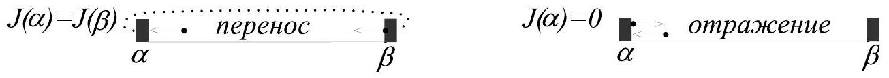

При отражающих граничных условиях ток, отражаясь, образует прямое и встречное направления, поэтому суммарный поток на границе равен нулю. Поглощающая граница характеризуется нулевым значением вероятности $P(x, t)$, так как частица в этой точке "исчезает" из пространства.

Таким образом, для трёх типов границ используются следующие граничные условия $\left(P(x, t)=P\left(x_{0}, t_{0} \Rightarrow x, t\right)\right)$ :

$$
\begin{array}{ll}
\text { reflecting : } & J(\alpha, t)=0 \\
\text { absorbing : } & P(\alpha, t)=0 \\
\text { periodic : } & J(\alpha, t)=J(\beta, t), \quad P(\alpha, t)=P(\beta, t)
\end{array}
$$

Отражающая или поглощающая границы могут быть в единственном виде или сосуществовать одновременно (например, слева - отражающая граница, а справа - поглощающая). Если граница одна, то обычно предполагается выполнение поглощающего граничного условия на бесконечности $P(\infty, t)=0$. Периодические границы по своему смыслу должны присутствовать одновременно.

Естественно, можно использовать и более затейливые границы. Например, полупрозрачная граница, на которой с некоторой вероятностью происходит отражение частицы или прохождение её через границу. Понятно, что подобных полупрозрачных границ в пространстве может быть несколько. Однако в большинстве задач достаточно перечисленных выше границ трёх типов.

Уравнение Фоккера-Планка для одной и той же системы с различными граничными условиями приводит к качественно отличающимся решениям. Рассмотрим два простых примера.

- Для наглядности будем считать, что $x$ - координата частицы, которая испытывает постоянный снос, смещаясь в среднем влево (ось $x$ направлена слева направо):

$$
d x=-\mu d t+\sigma \delta W
$$

Пусть в $x=0$ существует отражающая граница. В этом случае возможно стационарное решение уравнения Фоккера - Планка. Каким бы ни было начальное значение координаты $x_{0}>0$, частица рано или поздно достигнет границы и отразится от неё. Однако снос будет всё время возвращать её обратно. В результате установится стационарное состояние. При этом вероятность нахождения частицы в пространстве должна уменьшаться по мере удаления от границы. Найдём её явный вид, решив стационарное уравнение Фоккера - Планка с $\partial P / \partial t=0$ :

$$
-\mu P(x)-\frac{\sigma^{2}}{2} P^{\prime}(x)=0 \quad=>\quad P(x)=\frac{2 \mu}{\sigma^{2}} e^{-2 \mu x / \sigma^{2}}
$$

Нормировочный множитель находим, интегрируя от нуля до бесконечности. В данном случае ток равен нулю не только на отражающей границе, но и во всём пространстве. В противном случае не получилось бы стационарного решения.

- Рассмотрим ту же систему, но с двумя периодическими границами $[\alpha . . \beta]$. В этом случае (4.15) имеем:

$$
-\mu P(x)-\frac{\sigma^{2}}{2} P^{\prime}(x)=J_{0} \quad \Rightarrow \quad P(x)=\frac{J_{0}}{\mu}+P_{0} e^{-2 \mu x / \sigma^{2}} .
$$

Мы снова интересуемся стационарным решением, поэтому $J_{0}$ - это константа интегрирования по $x$ уравнения Фоккера-Планка с $\partial P / \partial t=0$. Граничные условия для потока вероятности $J(\alpha)=J(\beta)$ выполняются автоматически, так как $J(x)=J_{0}=$ const. Периодические граничные условия для плотности вероятности $P(\alpha)=P(\beta)$ выполняются только при $P_{0}=0$. В результате $P(x)$ равна константе $J_{0} / \mu$, значение которой находится из условия нормировки. Поэтому, $P(x)=1 /(\beta-\alpha)$.

Смысл этого решения легко понять. При отрицательном сносе частица постепенно дрейфует к левой границе $x=\alpha$. При её достижении она переносится на правую границу $x=\beta$, и процесс повторяется. Понятно, что со временем установится однородное распределение вероятностей. Аналогично, при блуждании броуновской частицы внутри кольца вероятность её нахождения в той или иной точке пространства постепенно станет постоянной. Напомню, что в открытом пространстве вероятность расплывается и стационарного режима у системы быть не может.

## 4.5 Вероятность достижения границы *

- Найдём теперь вероятность достижения при блуждании границ интервала $[\alpha . . \beta]$. Пусть это будут поглощающие границы, и в начальный момент времени $t_{0}=0$ частица находится в некоторой точке $\alpha<x_{0}<\beta$. Вероятность $p\left(x_{0}, t\right)$ того, что в момент времени $t$ она ещё ни разу не коснулась границ и находится внутри интервала $[\alpha . . \beta]$, равна:

$$
\begin{equation*}
p\left(x_{0}, t\right)=\int_{\alpha}^{\beta} P\left(x_{0}, 0 \Rightarrow x, t\right) d x=\int_{\alpha}^{\beta} P\left(x_{0},-t \Rightarrow x, 0\right) d x \tag{4.17}
\end{equation*}
$$

Второе равенство записано для однородных систем, у которых снос и волатильность не зависят от времени. Именно их мы сейчас и рассмотрим. Для таких систем можно сдвинуть начало отсчёта времени, считая начальным $t_{0}=-t$, а "конечным" $-t=0$. Возьмём производную по $t$ выражения (4.17) и воспользуемся первым уравнением Колмогорова (4.6), стр. 105. В результате уравнение для $p=p\left(x_{0}, t\right)$ имеет вид:

$$
\begin{equation*}
a\left(x_{0}\right) \frac{\partial p}{\partial x_{0}}+\frac{b^{2}\left(x_{0}\right)}{2} \frac{\partial^{2} p}{\partial x_{0}^{2}}=\frac{\partial p}{\partial t} \tag{4.18}
\end{equation*}
$$

Для плотности вероятности справедливо начальное условие в виде функции Дирака $P\left(x_{0}, 0 \Rightarrow x, 0\right)=\delta\left(x-x_{0}\right)$. Поэтому из (4.17) следует начальное условие: $p\left(x_{0}, 0\right)=1$ (частица гарантированно находится в $\alpha<x_{0}<\beta$ ). Кроме этого, если $x_{0}$ оказывается на границе, вероятность дальнейшего пребывания в интервале $[\alpha . . \beta]$ будет равной нулю, поэтому:

$$
p(\alpha, t)=p(\beta, t)=0
$$

Обозначим через $T$ время достижения одной из границ. Понятно, что $T$ случайная величина и $p\left(x_{0}, t\right)$ - это интегральная вероятность того, что $T \geqslant t$ ("всё ещё находится"). Вероятность, что $T<t$, равна $1-p\left(x_{0}, t\right)$. Её производная по $t$ даст плотность вероятности того или иного времени пребывания в интервале $[\alpha . . \beta]$. Поэтому, например, среднее время пребывания равно:

$$
\langle T\rangle=\int_{0}^{\infty} t \frac{\partial}{\partial t}\left(1-p\left(x_{0}, t\right)\right) d t=\int_{0}^{\infty} p\left(x_{0}, t\right) d t
$$

Мы считаем, что $p\left(x_{0}, \infty\right)=0$, т.к. частица в ограниченном пространстве $[\alpha . . \beta]$ рано или поздно достигает одной из границ. Для среднего $n$-той степени от $T$ введём следующее обозначение $T_{n}\left(x_{0}\right)=\left\langle T^{n}\right\rangle$ и найдём уравнение, которому удовлетворяет функция $T_{n}\left(x_{0}\right)$.

- Проведя интегрирование по частям в определении $\left\langle T^{n}\right\rangle$, получаем:

$$
\begin{equation*}
T_{n}\left(x_{0}\right)=\left\langle T^{n}\right\rangle=-\int_{0}^{\infty} t^{n} \frac{\partial p\left(x_{0}, t\right)}{\partial t} d t=n \int_{0}^{\infty} t^{n-1} p\left(x_{0}, t\right) d t \tag{4.19}
\end{equation*}
$$

Умножим уравнение (4.18) на $n t^{n-1}$ и проинтегрируем по $d t$ :

$$
a\left(x_{0}\right) T_{n}^{\prime}\left(x_{0}\right)+\frac{b^{2}\left(x_{0}\right)}{2} T_{n}^{\prime \prime}\left(x_{0}\right)=-n T_{n-1}\left(x_{0}\right) .
$$

Благодаря нормировочному условию $\langle 1\rangle=1$ имеем $T_{0}\left(x_{0}\right)=1$. Поэтому мы получили последовательность уравнений с правой частью, определяемой на предыдущей итерации. В частности, для среднего времени $T\left(x_{0}\right)=T_{1}\left(x_{0}\right)$ :

$$
a\left(x_{0}\right) T^{\prime}\left(x_{0}\right)+\frac{b^{2}\left(x_{0}\right)}{2} T^{\prime \prime}\left(x_{0}\right)=-1
$$

с граничными условиями $T(\alpha)=T(\beta)=0$ (если частица в начальном положении $x_{0}$ была на границе, то она сразу покинет пространство).

Например, при винеровском блуждании с нулевым сносом $\mu=0$ и волатильностью $\sigma$ имеем:

$$
\frac{\sigma^{2}}{2} T^{\prime \prime}=-1 \quad \Rightarrow \quad \frac{\sigma^{2}}{2} T=-\frac{x_{0}^{2}}{2}+A x_{0}+B
$$

где $A$ и $B$ - константы интегрирования. Пусть поглощающие границы находятся в точках $x=0, L$. Тогда граничные условия $T(0)=T(L)=0$ приводят к:

$$
\langle T\rangle=T\left(x_{0}\right)=\frac{x_{0}\left(L-x_{0}\right)}{\sigma^{2}}
$$

Максимальное среднее время $\langle T\rangle=L^{2} / 4 \sigma^{2}$ достижения границ получается тогда, когда в начальный момент частица находится в центральной части интервала $x_{0}=L / 2$. В силу симметрии задачи (сноса нет) этот результат вполне ожидаем. Даже если $x_{0}$ находится недалеко от $x=0$, то при $L \rightarrow \infty$ среднее время также стремится к бесконечности.

В качестве упражнения ( $\lessdot \mathrm{H}_{27}$ ) стоит решить эту же задачу при ненулевом сносе и рассмотреть предел "широкого" пространства $L \rightarrow \infty$.

## 4.6 Разложение вероятности по базису *

Рассмотрим уравнение Фоккера-Планка с не зависящими от времени сносом $a(x)$ и диффузией $D(x)=b^{2}(x)$ :

$$
\frac{\partial P}{\partial t}+\frac{\partial}{\partial x}[a(x) P]-\frac{1}{2} \frac{\partial^{2}}{\partial x^{2}}[D(x) P]=0
$$

Будем искать его решение в виде $P=u_{\lambda}(x) e^{-\lambda t}$. Функция $u(x)$ удовлетворяет уравнению (штрих - производная по $x$ ):

$$
\begin{equation*}
\left[a(x) u_{\lambda}(x)\right]^{\prime}-\frac{1}{2}\left[D(x) u_{\lambda}(x)\right]^{\prime \prime}=\lambda u_{\lambda}(x) \tag{4.20}
\end{equation*}
$$

При наличии граничных условий (стр. 111) в интервале $[\alpha . . . \beta]$ это уравнение может приводить к дискретному набору разрешённых значений: $\lambda_{1}, \lambda_{2}, \ldots($ собственные значения) и соответствующим им собственным функициям $u_{\lambda}(x)$. Используя их, можно записать общее решение уравнение Фоккера-Планка.

- Для примера рассмотрим винеровское блуждание с нулевым сносом $a(x)=0$ и диффузией $D=\sigma^{2}$. Уравнение (4.20) имеет вид:

$$
u_{\lambda}^{\prime \prime}(x)+\omega^{2} u_{\lambda}(x)=0
$$

где $w=\sqrt{2 \lambda} / \sigma$. Его общее решение хорошо известно:

$$
u_{\lambda}(x)=A \sin (\omega x)+B \cos (\omega x)
$$

Пусть граничные условия $[0 . . L]$ являются поглощающими. В точках $x=$ 0 и $x=L$ плотность вероятности должна обращаться в нуль: $u_{\lambda}(0)= u_{\lambda}(L)=0$. Подстановка решения в эти граничные условия приводит к следующим собственным функциям:

$$
u_{n}(x)=\sqrt{\frac{2}{L}} \sin \left(\omega_{n} x\right), \quad \omega_{n}=\frac{n \pi}{L}
$$

и $n=1,2, \ldots$ - целые числа, нумерующие собственные значения $\lambda_{n}= \sigma^{2} \omega_{n}^{2} / 2$. Множитель $\sqrt{2 / L}$ при собственной функции выбран таким образом, чтобы выполнялось условие ортогональности:

$$
\begin{equation*}
\int_{0}^{L} u_{n}(x) u_{m}(x) d x=\frac{2}{L} \int_{0}^{L} \sin \left(\omega_{n} x\right) \sin \left(\omega_{m} x\right) d x=\delta_{n m} \tag{4.21}
\end{equation*}
$$

где $\delta_{n m}$ - символ Кронекера, равный единице при $n=m$ и нулю, если $m \neq n$. Теперь можно разложить общее решение уравнения в бесконечный ряд по собственным функциям.

Действительно, представим плотность вероятности в виде следующей суммы:

$$
P\left(x_{0}, 0 \Rightarrow x, t\right)=\sum_{n=0}^{\infty} A_{n} u_{n}(x) e^{-\lambda_{n} t}
$$

Благодаря ортогональности собственных функций $u_{n}(x)$ мы всегда можем восстановить коэффициенты этого разложения. Используя начальное условие $P\left(x_{0}, 0 \Rightarrow x, 0\right)=\delta\left(x-x_{0}\right)$ и (4.21), имеем:

$$
A_{n}=\int_{0}^{L} P\left(x_{0}, 0 \Rightarrow x, 0\right) u_{n}(x) d x=\int_{0}^{L} \delta\left(x-x_{0}\right) u_{n}(x) d x=u_{n}\left(x_{0}\right)
$$

Поэтому окончательно:

$$
P\left(x_{0}, 0 \Rightarrow x, t\right)=\frac{2}{L} \sum_{n=0}^{\infty} \sin \left(\omega_{n} x_{0}\right) \sin \left(\omega_{n} x\right) e^{-\lambda_{n} t}
$$

С течением времени общая вероятность нахождения частицы в диапазоне $[0 . . L]$ уменьшается, так как частица рано или поздно будет захвачена одной из границ.

- Так же находится решение для отражающих границ. В этом случае на границах $x=0$ и $x=L$ ток (4.15), стр. 111:

$$
J(x, t)=-\frac{\sigma^{2}}{2} \frac{\partial P(x, t)}{\partial x}=-\frac{\sigma^{2} e^{-\lambda t}}{2} u_{\lambda}^{\prime}(x)
$$

должен быть нулевым, а, следовательно, равна нулю производная собственной функции: $u_{\lambda}^{\prime}(0)=u_{\lambda}^{\prime}(L)=0$. В результате:

$$
u_{0}(x)=\frac{1}{\sqrt{L}}, \quad u_{n}=\sqrt{\frac{2}{L}} \cos \left(\omega_{n} x\right), \quad \omega_{n}=\frac{n \pi}{L}
$$

и $n=1,2, \ldots$ Несложно проверить, что эти функции также ортогональны. Поэтому окончательно:

$$
P\left(x_{0}, 0 \Rightarrow x, t\right)=\frac{1}{L}+\frac{2}{L} \sum_{n=0}^{\infty} \cos \left(\omega_{n} x_{0}\right) \cos \left(\omega_{n} x\right) e^{-\lambda_{n} t}
$$

При $t \rightarrow \infty$ решение стремится к $P\left(x_{0}, 0 \Rightarrow x, t\right) \rightarrow 1 / L$, и частицу можно равновероятно встретить в любой точке интервала шириной $L$.

Рассмотрим теперь общую теорию для задачи на собственные функции и значения для уравнения Фоккера-Планка.

- Предположим, что $\hat{A}$ - линейный дифференциальный оператор (например, $\hat{A}=d^{2} / d x^{2}$ ), и справедливо уравнение следующего вида:

$$
\begin{equation*}
\hat{A} u(x)=\lambda \rho(x) u(x), \tag{4.22}
\end{equation*}
$$

где $\rho(x)$ - действительная положительная функция. Если для произвольных функций $\psi(x)$ и $\phi(x)$ выполняется соотношение:

$$
\begin{equation*}
\int_{\alpha}^{\beta} \psi(x) \hat{A} \phi(x) d x=\int_{\alpha}^{\beta} \phi(x) \hat{A}^{*} \psi(x) d x \tag{4.23}
\end{equation*}
$$

то оператор $\hat{A}$ называется самосопряжённым. Звёздочка (комплексное сопряжение) может быть опущена для действительных операторов.

Рассмотрим решения $u_{n}(x), u_{m}(x)$ уравнения (4.22), соответствующие различным собственным значениям $\lambda_{n}$ и $\lambda_{m}$. Используя (4.22), запишем:

$$
\begin{aligned}
& \int_{\alpha}^{\beta} u_{m}^{*}(x) \hat{A} u_{n}(x) d x=\lambda_{n} \int_{\alpha}^{\beta} u_{m}^{*}(x) u_{n}(x) \rho(x) d x \\
& \int_{\alpha}^{\beta} u_{n}(x) \hat{A}^{*} u_{m}^{*}(x) d x=\lambda_{m}^{*} \int_{\alpha}^{\beta} u_{m}^{*}(x) u_{n}(x) \rho(x) d x
\end{aligned}
$$

где во втором соотношении взято комплексное сопряжение (4.22) и учтена действительность функции $\rho(x)$.
$E c$ ли оператор $\hat{A}$ самосопряжённый, то левые части этих равенств должны быть одинаковыми $\left(\psi=u_{m}^{*}, \phi=u_{n}\right)$. Приравняем их:

$$
\left(\lambda_{n}-\lambda_{m}^{*}\right) \int_{\alpha}^{\beta} u_{m}^{*}(x) u_{n}(x) \rho(x) d x=0
$$

Если $n=m$, то подынтегральная функция положительна, и, следовательно, собственные значения - действительны ( $\lambda_{n}^{*}=\lambda_{n}$ ). При $n \neq m$ нулю равен интеграл, поэтому собственные функции ортогональны $c$ ве$\operatorname{com} \rho(x)$. Оператор $\hat{A}$ - линейный, следовательно, собственная функция определена с точностью до постоянного множителя. Его удобно выбрать таким образом, чтобы выполнялось условие ортогональности

$$
\int_{\alpha}^{\beta} u_{m}^{*}(x) u_{n}(x) \rho(x) d x=\delta_{n m}
$$

с весовой функцией $\rho(x)$.

Теперь можно записать разложение общего решения по базису:

$$
F(x)=\sum f_{n} u_{n}(x), \quad=>\quad f_{n}=\int_{\alpha}^{\beta} F(x) u_{n}^{*}(x) \rho(x) d x
$$

где для коэффициентов $f_{n}$ использовано условие ортогональности.
Оператор $\hat{A}$ уравнения (4.20) не является самосопряжённым. Умножим обе части (4.20) на функцию $\rho=\rho(x)$ и подберём её таким образом, чтобы выполнялось условие (4.23). Проведём интегрирование по частям:

$$
\int_{\alpha}^{\beta}\left\{\psi \rho(a \phi)^{\prime}-\frac{1}{2} \psi \rho(D \phi)^{\prime \prime}\right\} d x=\int_{\alpha}^{\beta}\left\{-(\psi \rho)^{\prime} a \phi-\frac{1}{2}(\psi \rho)^{\prime \prime} D \phi\right\} d x+I
$$

где $I$ - значения подынтегральной функции на границах $\alpha$ и $\beta$ :

$$
\begin{equation*}
I=\left.\psi \rho a \phi\right|_{\alpha} ^{\beta}-\left.\frac{1}{2} \psi \rho(D \phi)^{\prime}\right|_{\alpha} ^{\beta}+\left.\frac{1}{2}(\psi \rho)^{\prime} D \phi\right|_{\alpha} ^{\beta} . \tag{4.24}
\end{equation*}
$$

Раскроем производные в обоих интегралах. Оператор будет самосопряжённым, если при перестановке $\psi$ и $\phi$ местами вокруг него получается тот же результат (действительный случай). Это происходит, если:

$$
\begin{equation*}
2 \rho a=\rho D^{\prime}-D \rho^{\prime} \quad=>\quad \rho(x)=\exp \int \frac{D^{\prime}(x)-2 a(x)}{D(x)} d x \tag{4.25}
\end{equation*}
$$

Кроме этого, естественно, должны исчезать граничные члены ( $I=0$ ). Введём в соответствии с (4.15) плотности тока вероятности:

$$
J_{\phi}=a \phi-\frac{1}{2}(D \phi)^{\prime}, \quad \quad J_{\psi}=a \psi-\frac{1}{2}(D \psi)^{\prime}
$$

При помощи этих определений и уравнения (4.25) для функции $\rho(x)$, граничный член (4.24) можно переписать в следующем виде:

$$
I=\left.\rho(x)\left(\psi(x) J_{\phi}(x)-\phi(x) J_{\psi}(x)\right)\right|_{\alpha} ^{\beta}=0 .
$$

Несложно проверить, что все три типа граничных условий, рассмотренных в разделе §4.4, стр. 110 приводят к нулевому значению $I$. Таким образом, мы показали, что оператор уравнения (4.20), умноженный на функцию $\rho(x)$ (4.25), оказывается самосопряженным. Поэтому общее решение уравнения Фоккера-Планка можно записать в следующем виде:

$$
P(x, t)=\sum_{n} a_{n} u_{n}(x) e^{-\lambda_{n} t}, \quad a_{n}=\int_{\alpha}^{\beta} P(x, 0) u_{n}^{*}(x) \rho(x) d x
$$

где для определения $a_{n}$ используются начальные условия $P(x, 0)$.

## 4.7 Уравнение для $x(t, \varepsilon)$ *

Пусть случайный процесс $x=f(t, \varepsilon)$ в момент времени $t$ выражен через гауссову переменную $\varepsilon$. Несмотря на случайность величин, $f(t, \varepsilon)$ представляет собой обычную функцию двух аргументов. Найдём уравнение, которому она удовлетворяет. При этом будем предполагать, что существует обратная к $f$ функция $\varepsilon=g(x, t)$. Нам потребуются переходы от частных производных $f$ к $g$. Для этого запишем дифференциалы:

$$
d \varepsilon=\partial_{x} g d x+\partial_{t} g d t, \quad d x=\partial_{\varepsilon} f d \varepsilon+\partial_{t} f d t
$$

где $\partial_{x} g=\partial g / \partial x$, и т.д. Подставляя $d x$ в первое уравнение, получаем:

$$
\begin{equation*}
\partial_{\varepsilon} f \partial_{x} g=1, \quad \partial_{t} g=-\partial_{x} g \partial_{t} f, \quad \partial_{x}^{2} g=\partial_{x}\left(\frac{1}{\partial_{\varepsilon} f}\right)=-\frac{\partial_{\varepsilon}^{2} f \partial_{x} g}{\left(\partial_{\varepsilon} f\right)^{2}} \tag{4.26}
\end{equation*}
$$

Выведем сначала уравнение для обратной функции $g(x, t)$. Пусть в момент времени $t$ случайная величина, от которой зависит $x$, равна $\varepsilon_{1}$. Через бесконечно малый интервал времени в $t+d t$ это уже другая гауссова переменная $\varepsilon_{2}$ :

$$
\varepsilon_{2}=g(x+d x, t+d t), \quad \varepsilon_{1}=g(x, t)
$$

Возведём $\varepsilon_{2}$ в $k$-тую степень $\varepsilon_{2}^{k}=g^{k}(x+d x, t+d t)$ и разложим в ряд до первого порядка малости по $d t$, и до второго по $d x$ :

$$
\varepsilon_{2}^{k}=\varepsilon_{1}^{k}+k g^{k-1}\left(g^{\prime} d x+\dot{g} d t\right)+\left[k(k-1) g^{k-2} g^{\prime 2}+k g^{k-1} g^{\prime \prime}\right] \frac{(d x)^{2}}{2}+\ldots,
$$

где штрих обозначает частную производную по $x$, а точка - по времени. В качестве $d x$ подставим стохастическое уравнение $d x=a d t+b \varepsilon \sqrt{d t}$, где случайное число $\varepsilon$ не зависит от $\varepsilon_{1}$. Усредняя левую и правую части $\left\langle\varepsilon_{2}^{k}\right\rangle=\left\langle\varepsilon_{1}^{k}\right\rangle,\langle\varepsilon\rangle=0,\left\langle\varepsilon^{2}\right\rangle=1$ и сдвигая $k \rightarrow k+1$, получаем:

$$
\left\langle g^{k}\left(g^{\prime} a+\dot{g}+\frac{D}{2} g^{\prime \prime}\right)+k g^{k-1} \frac{D}{2} g^{\prime 2}\right\rangle=0
$$

где $D=b^{2}$ - диффузия процесса. Умножим это соотношение на произвольные коэффициенты $F_{k}$ и просуммируем по $k=0,1, \ldots$ :

$$
\left\langle F(g)\left(g^{\prime} a+\dot{g}+\frac{D}{2} g^{\prime \prime}\right)+F^{\prime}(g) g^{2} \frac{D}{2}\right\rangle=0
$$

где $F(g)=F_{0}+F_{1} g+F_{2} g^{2}+.$. При усреднении производится интегрирование по $\varepsilon_{1}=g$ с плотностью вероятности $P\left(\varepsilon_{1}\right)$. Для функций типа $g^{\prime}(x, t)$ предполагается, что после взятия производной необходимо выразить $x=f\left(\varepsilon_{1}, t\right)$ и подставить в $g^{\prime}(x, t)$.

Проинтегрируем по частям второе слагаемое в среднем:

$$
\int_{-\infty}^{\infty} F^{\prime}\left(\varepsilon_{1}\right) g^{\prime 2} \frac{D}{2} P\left(\varepsilon_{1}\right) d \varepsilon_{1}=-\int_{-\infty}^{\infty} F\left(\varepsilon_{1}\right) \frac{\partial}{\partial \varepsilon_{1}}\left[g^{\prime 2} \frac{D}{2} P\left(\varepsilon_{1}\right)\right] d \varepsilon_{1}
$$

При вычислении производной можно воспользоваться неявным дифференцированием:

$$
\frac{\partial}{\partial \varepsilon_{1}}\left[g^{\prime 2} \frac{D}{2}\right]=\frac{\partial}{\partial x}\left[g^{\prime 2} \frac{D}{2}\right] \frac{\partial x}{\partial \varepsilon_{1}}=\frac{\partial}{\partial x}\left[g^{\prime 2} \frac{D}{2}\right] \frac{1}{g^{\prime}},
$$

где учтено, что $\partial x / \partial \varepsilon_{1}=f^{\prime}=1 / g^{\prime}$ (см. (4.26)).
Вводя функцию $\psi\left(\varepsilon_{1}\right)=-P^{\prime}\left(\varepsilon_{1}\right) / P\left(\varepsilon_{1}\right)$, получаем:

$$
\left\langle F(g)\left(g^{\prime} a+\dot{g}+\frac{D}{2} g^{\prime \prime}+g^{\prime 2} \frac{D}{2} \psi\left(\varepsilon_{1}\right)-\frac{\partial}{\partial x}\left[g^{\prime 2} \frac{D}{2}\right] \frac{1}{g^{\prime}}\right)\right\rangle=0 .
$$

В силу произвольности функции $F$ множитель в круглых скобках должен быть равен нулю, поэтому для $\varepsilon_{1}=g(x, t)$ имеем:

$$
\begin{equation*}
\dot{g}=\frac{1}{2} \frac{\partial D(x, t)}{\partial x} g^{\prime}-a(x, t) g^{\prime}-\frac{D(x, t)}{2}\left[\psi(g) g^{\prime 2}-g^{\prime \prime}\right] . \tag{4.27}
\end{equation*}
$$

Воспользовавшись (4.26), после несложных вычислений получаем уравнение относительно $f(t, \varepsilon)$ :

$$
\begin{equation*}
\dot{f}=a(f, t)-\frac{D^{\prime}(f, t)}{2}+\frac{D(f, t)}{2}\left[\frac{\psi(\varepsilon)}{f^{\prime}}+\frac{f^{\prime \prime}}{f^{\prime 2}}\right] \tag{4.28}
\end{equation*}
$$

где $D^{\prime}=\partial D / \partial f$ и опущен индекс у $\varepsilon_{1}$.
В детерминированном случае ( $D=0$ ) получается, как и следовало ожидать, обыкновенное дифференциальное уравнение $\dot{f}=a(f, t)$. Начальное условие для (4.28) имеет вид $x\left(t_{0}, \varepsilon\right)=x_{0}$.

Для гауссового распределения $\psi(\varepsilon)=\varepsilon$. Однако в качестве случайного числа $\varepsilon$ можно использовать величину с произвольным распределением. Так, для $P(\varepsilon) \sim \varepsilon^{\gamma-1} e^{-\lambda \varepsilon}$ функция $\psi(\varepsilon)=\lambda-(\gamma-1) / \varepsilon$.

В качестве упражнения ( $\lessdot \mathrm{H}_{42}$ ) предлагается проверить, что уравнения (4.27) и (4.28) согласуются с уравнением Фоккера-Планка.

## Глава 5

## Стохастические интегралы

Как и в обычном анализе, если определено стохастическое дифференцирование, то естественно ввести и стохастическое интегрирование. Соответствующая техника даст нам ещё один инструмент получения соотношений для иногда достаточно общих случайных процессов. Это очень красивый раздел стохастической математики, который к тому же активно используется в учебной и научной литературе.

В дифференциальных уравнениях присутствуют два бесконечно малых изменения - снос, пропорциональный $d t$, и волатильность шума $\delta W$. Соответственно, возможно два вида интегралов. В первом разделе мы рассмотрим стохастические интегралы по $d t$, изучим их основные свойства и найдём представление некоторых интегралов через обычные случайные величины. Во втором разделе рассматривается интеграл Ито по $\delta W$. Далее будут получены условия, при которых решение стохастического дифференциального уравнения единственно, и рассмотрен итерационный метод построения этого решения.

## 5.1 Площадь под траекторией Винера

- Для данной реализации $n$ независимых случайных величин $\varepsilon_{1}, \ldots, \varepsilon_{n}$, имеющих нормальное распределение с нулевым средним и единичной дисперсией: $\varepsilon_{i} \sim N(0,1)$, мы получаем конкретную выборочную траекторию винеровского процесса со значениями, заданными по оси времени с шагом $\Delta t=t / n$ :

$$
\begin{equation*}
W_{n}=W\left(t_{n}\right)=\left(\varepsilon_{1}+\ldots+\varepsilon_{n}\right) \sqrt{\Delta t}=\varepsilon \sqrt{n \Delta t}=\varepsilon \sqrt{t} . \tag{5.1}
\end{equation*}
$$

Предел $n \rightarrow \infty$ соответствует непрерывному стохастическому процессу.
Если использовать такие же $\varepsilon_{1}, \ldots, \varepsilon_{n}$ при итерационном решении некоторого стохастического уравнения:

$$
x_{k+1}=a\left(x_{k}, t_{k}\right) \Delta t+b\left(x_{k}, t_{k}\right) \varepsilon_{k} \sqrt{\Delta t},
$$

получится выборочный процесс, однозначно связанный с $W_{t}$. В этом смысле выборочные решения всех уравнений с общим шумом $\delta W=\varepsilon \sqrt{d t}$ являются деформацией одной и той же выборочной траектории $W_{t}$.

- Несмотря на изломанный вид функции $W_{t}=W(t)$, можно вычислить площадь под ней, проинтегрировав от нуля до $t$ :

$$
\begin{equation*}
S_{t}=\int_{0}^{t} W_{\tau} d \tau \tag{5.2}
\end{equation*}
$$

0
Интеграл, как и в обычном анализе, определим при помощи интегральной суммы:

$$
\begin{equation*}
S_{t}=\sum_{k=1}^{n} W_{k-1} \Delta t=\left[\varepsilon_{1}+\left(\varepsilon_{1}+\varepsilon_{2}\right)+\ldots+\left(\varepsilon_{1}+\ldots+\varepsilon_{n-1}\right)\right](%5Cvarepsilon_{1}+%5Cvarepsilon_{2}%5Cright)+%5Cldots+%5Cleft(%5Cvarepsilon_{1}+%5Cldots+%5Cvarepsilon_{n-1}%5Cright)%5Cright)^{3 / 2}, \tag{5.3}
\end{equation*}
$$

где интервал $[0 . . t]$ разбит на $n$ отрезков длительностью $\Delta t$. Значение процесса Винера в конце $k$ - того отрезка равно накопленной сумме $k$ случайных независимых гауссовых изменений на каждом отрезке.

Для других реализаций $\varepsilon_{1}, \ldots, \varepsilon_{n}$ мы получим другое значение, поэтому $S_{t}$ и аналогичные интегралы являются случайными процессами.

Процесс $S_{t}$ в момент времени $t$ не может быть выражен через $W_{t}$, так как зависит не только от значения $W_{t}=W(t)$, но и от формы траектории во все моменты времени. Тем не менее, для $S_{t}$ можно получить простое представление через скалярные случайные величины.

- Перегруппируем интегральную сумму (5.3) следующим образом:

$$
\left[(n-1) \cdot \varepsilon_{1}+\ldots+1 \cdot \varepsilon_{n-1}\right](n-1)%20%5Ccdot%20%5Cvarepsilon_{1}+%5Cldots+1%20%5Ccdot%20%5Cvarepsilon_{n-1}%5Cright)^{3 / 2}=\eta_{1} \sqrt{1^{2}+2^{2}+\ldots+(n-1)^{2}}(\Delta t)^{3 / 2} .
$$

Сумма гауссовых чисел статистически эквивалентна одному, которое мы обозначили через $\eta_{1} \sim N(0,1)$. В результате появляется соответствующий множитель. Сумма ряда $1^{2}+\ldots+(n-1)^{2}$ равна $(n-1) n(2 n-1) / 6$. Устремляя $n \rightarrow \infty, \Delta t \rightarrow 0$, так что $n \Delta t=t$, получаем:

$$
S_{t}=\int_{0}^{t} W_{\tau} d \tau=\eta_{1} \frac{t^{3 / 2}}{\sqrt{3}}
$$

Таким образом, $S_{t}-$ это гауссовый случайный процесс с волатильностью, увеличивающейся со временем как $t^{3 / 2}$, т.е. $S_{t} \sim N\left(0, t^{3} / 3\right)$. Однако это ещё не всё. Величина $\eta_{1}$ не является независимой от винеровского блуждания $W_{t}$. Действительно, $W_{t}$ равен сумме гауссовых чисел $\varepsilon_{k}$, которые мы использовали для вычисления интеграла $S_{t}$ :

$$
\begin{aligned}
W_{t}=\left[\varepsilon_{1}+\varepsilon_{2}+\ldots+\varepsilon_{n-1}+\varepsilon_{n}\right](%5CDelta%20t)^{1 / 2} & =\eta_{2} \sqrt{t} \\
S_{t}=\left[(n-1) \varepsilon_{1}+(n-2) \varepsilon_{2}+\ldots+1 \varepsilon_{n-1}\right](n-1)%20%5Cvarepsilon_{1}+(n-2)%20%5Cvarepsilon_{2}+%5Cldots+1%20%5Cvarepsilon_{n-1}%5Cright)^{3 / 2} & =\eta_{1} \frac{t^{3 / 2}}{\sqrt{3}}
\end{aligned}
$$

Первая строка - это запись винеровского процесса в момент времени $t$ через накопленную сумму изменений $\eta_{2}$ на каждом интервале. Вторая - это интегральная сумма, полученная выше. В обоих случаях $\eta_{1}$ и $\eta_{2}$ это гауссовы числа $N(0,1)$. Однако, они скоррелированы друг с другом:

$$
\left\langle W_{t} S_{t}\right\rangle=\left\langle\eta_{1} \eta_{2}\right\rangle \frac{t^{2}}{\sqrt{3}}=(1+2+\ldots+n-1)(\Delta t)^{2}=\frac{(n-1) n}{2}(\Delta t)^{2} \rightarrow \frac{t^{2}}{2} .
$$

Две скоррелированные гауссовы переменные $\left\langle\eta_{1} \eta_{2}\right\rangle=\sqrt{3} / 2$ можно представить в виде линейной комбинации (см. стр. 33) независимых гауссовых чисел $\varepsilon, \eta$ :

$$
\eta_{1}=\frac{\sqrt{3}}{2} \varepsilon+\frac{1}{2} \eta, \quad \eta_{2}=\varepsilon
$$

Поэтому окончательно получаем:

$$
\begin{equation*}
W_{t}=\varepsilon \sqrt{t}, \quad S_{t}=(\sqrt{3} \varepsilon+\eta) \frac{t^{3 / 2}}{2 \sqrt{3}}=\frac{W_{t}}{2} t+\eta \frac{t^{3 / 2}}{2 \sqrt{3}} . \tag{5.4}
\end{equation*}
$$

Подобное представление позволяет легко вычислять различные средние, относящиеся к одному моменту времени, например $\left\langle W_{t}^{2} S_{t}^{2}\right\rangle=5 t^{4} / 6$.

- Полученное соотношение для $S_{t}$ имеет простую геометрическую интерпретацию. Пусть площадь вычисляется от $t_{0}$ до $t$, и в этих точках $W_{0}=W\left(t_{0}\right)$ и $W_{t}=W(t)$. Тогда в формуле (5.4) необходимо заменить $W_{t}$ на $W_{t}-W_{0}$ и добавить нижний прямоугольник площадью $W_{0}\left(t-t_{0}\right)$ :

$$
S_{t}=\frac{W_{0}+W_{t}}{2}\left(t-t_{0}\right)+\eta \frac{\left(t-t_{0}\right)^{3 / 2}}{2 \sqrt{3}} .
$$

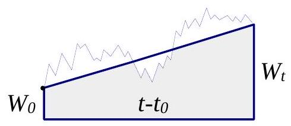

Площадь трапеции между $W_{0}$ и $W_{t}$ равна $\left(W_{0}+W_{t}\right)\left(t-t_{0}\right) / 2$. Второе слагаемое, пропорциональное гауссовой величине $\eta$, представляет собой площадь отклонения истинной траектории от прямой, проходящей через $W_{0}$ и $W_{t}$.

Эту же формулу можно интерпретировать, как линейную модель предсказания площади по значению начальной и конечной точки траектории $S=f\left(W_{0}, W_{t}\right)$. Ошибка подобной модели пропорциональна $\eta$, и её дисперсия увеличивается со временем как $\left(t-t_{0}\right)^{3}$.

- Если известно $n+1$ значений процесса $W_{0}, W_{1}, \ldots, W_{n}$, идущих с шагом $\Delta t$ на интервале $t-t_{0}=n \Delta t$, то сумма площадей $n$ трапеций и отклонений от них даст суммарную площадь:

$$
S_{n}=\left(\frac{W_{0}}{2}+W_{1}+\ldots+W_{n-1}+\frac{W_{n}}{2}\right) \Delta t+\eta \sqrt{t-t_{0}} \frac{\Delta t}{2 \sqrt{3}},
$$

где учтено, что $\left(\eta_{1}+\ldots+\eta_{n}\right) \sqrt{\Delta t}=\eta \sqrt{n \Delta t}=\eta \sqrt{t-t_{0}}$. При $\Delta t \rightarrow 0$ дисперсия поправки стремится к нулю.

- Рассмотрим теперь два отрезка времени $[0 \ldots t]$ и $[t \ldots t+\tau]$. Площадь в момент времени $t+\tau$ равна площади в момент $t$ плюс площадь на участке длительностью $\tau$ :

$$
S_{t+\tau}=S_{t}+\frac{W_{t}+W_{t+\tau}}{2} \tau+\eta \frac{\tau^{3 / 2}}{2 \sqrt{3}}
$$

Винеровский процесс в момент времени $t+\tau$ можно разбить на сумму двух независимых процессов $W_{t+\tau}=W_{t}+\tilde{W}_{\tau}=\varepsilon \sqrt{t}+\tilde{\varepsilon} \sqrt{\tau}$, где $\varepsilon$ и $\tilde{\varepsilon}$ пропорциональны независимым накопленным изменениям на каждом отрезке времени (см. стр. 68). Поэтому:

$$
\begin{equation*}
S_{t+\tau}=S_{t}+W_{t} \tau+\tilde{S}_{\tau}, \tag{5.5}
\end{equation*}
$$

где площадь $\tilde{S}_{\tau}$ вычисляется под независимым от $W_{t}$ процессом $\tilde{W}_{\tau}$ от нуля до $\tau$ и имеет нулевую корреляцию с $S_{t}$. В качестве упражнения (厄 $\mathrm{H}_{40}$ ) стоит вывести это же соотношение непосредственно из (5.3).

- Площадь под винеровской траекторией является интегральной величиной, поэтому можно ожидать, что $S_{t}$ - более гладкий процесс, чем $W_{t}$. Проверим это, вычислив автокорреляцию. Процессы $W_{t}$ и $S_{t}$ имеют нулевое среднее, поэтому их дисперсии равны средним квадратов:

$$
\left\langle W_{t}^{2}\right\rangle=\left\langle\varepsilon^{2}\right\rangle t=t, \quad\left\langle S_{t}^{2}\right\rangle=\left\langle\eta^{2}\right\rangle \frac{t^{3}}{3}=\frac{t^{3}}{3}
$$

Воспользуемся записью (5.5) площади $S_{t}$ в два различных момента времени $t$ и $t+\tau$. Так как $\tilde{S}_{\tau}$ независима от $S_{t}$ и $W_{t}$, автоковариация легко вычисляется:

$$
\left\langle S_{t} S_{t+\tau}\right\rangle=\left\langle S_{t}^{2}\right\rangle+\left\langle S_{t} W_{t}\right\rangle \tau=\frac{t^{3}}{3}+\frac{t^{2}}{2} \tau,
$$

где учтено, что $\left\langle W_{t} S_{t}\right\rangle=t^{2} / 2$. Разделив ковариацию на волатильности $S_{t}$ и $S_{t+\tau}$, получим автокорреляционный коэффициент для $S$ :

$$
\rho\left(S_{t}, S_{t+\tau}\right)=\frac{\left\langle S_{t} S_{t+\tau}\right\rangle}{\sqrt{\left\langle S_{t}^{2}\right\rangle\left\langle S_{t+\tau}^{2}\right\rangle}}=\frac{1+3 T / 2}{(1+T)^{3 / 2}} \approx 1-\frac{3}{8} T^{2}+\ldots,
$$

где $T=\tau / t$. Аналогично проводятся вычисления для $W$ :

$$
\rho\left(W_{t}, W_{t+\tau}\right)=\frac{\left\langle W_{t} W_{t+\tau}\right\rangle}{\sqrt{\left\langle W_{t}^{2}\right\rangle\left\langle W_{t+\tau}^{2}\right\rangle}}=\frac{1}{\sqrt{1+T}} \approx 1-T+\ldots
$$

Корреляция для $W_{t}$ быстрее уменьшается с ростом $T$ по сравнению с корреляцией для $S_{t}$. Графически это представлено ниже на левом графике:
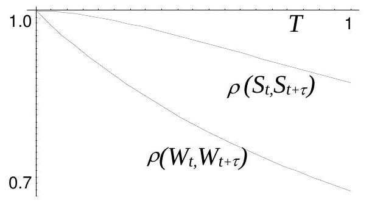
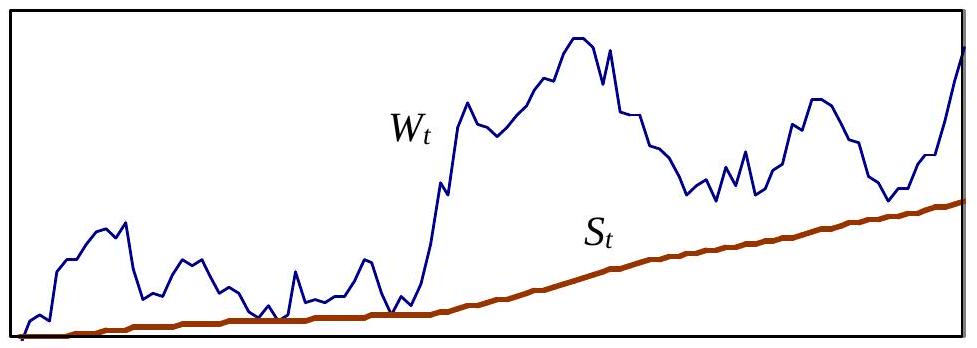

Справа приведены выборочные траектории для $W_{t}$ и $S_{t}$. Видно, что $S_{t}-$ существенно более гладкий процесс.

В первой главе мы уже обсуждали, что свойства процесса в данный момент времени характеризуют его не полностью. В частности, степень изломанности или гладкости определяется автокорреляционной функцией. Чем быстрее процесс забывает свою историю, тем сильнее он изломан и тем быстрее убывает автокорреляция.

- В качестве упражнения предлагается проверить справедливость для произвольной детерминированной функции $f(t)$ и гауссового числа $\eta \sim N(0,1)$ следующих соотношений:

$$
\begin{equation*}
\int_{0}^{t} f(s) W_{s} d s=\sigma(t) \eta, \quad \sigma^{2}(t)=\int_{0}^{t}\left[\int_{s}^{t} f(\tau) d \tau\right]^{2} d s \tag{5.6}
\end{equation*}
$$

Если процесс Винера $W_{t}=\varepsilon \sqrt{t}$, то коэффициент корреляции равен:

$$
\rho=\langle\varepsilon \eta\rangle=\frac{1}{\sigma(t) \sqrt{t}} \int_{0}^{t}\left[\int_{s}^{t} f(\tau) d \tau\right] d s
$$

Например, для степенной функции $f(t)=t^{n}$ :

$$
\int_{0}^{t} s^{n} W_{s} d s=\frac{\sqrt{2} t^{n+3 / 2}}{\sqrt{6+7 n+2 n^{2}}} \eta, \quad \rho=\frac{\sqrt{6+7 n+2 n^{2}}}{\sqrt{2}(2+n)}
$$

В общем случае корреляционные коэффициенты зависят от времени $t$. При вычислении средних от произведения произвольных моментов удобнее выразить $\eta$ через $\varepsilon$ и независимую от неё случайную величину $\varepsilon_{1}$ :

$$
\eta=\rho \varepsilon+\sqrt{1-\rho^{2}} \varepsilon_{1} .
$$

Теперь вычисление средних типа $\left\langle\varepsilon^{2} \eta^{2}\right\rangle$ не составит труда.

- Естественно, интеграл по времени можно вычислять не только от винеровского процесса, но и от любой случайной функции:

$$
I_{t}=\int_{t_{0}}^{t} f_{\tau}\left(W_{\tau}\right) d \tau
$$

Индекс у функции означает, что возможна не только зависимость от винеровского процесса $W$, но и явная зависимость от времени: $f_{t}\left(W_{t}\right)= f\left(t, W_{t}\right)$, как, например, в (5.6). Функция $f$ в общем случае может быть произвольным случайным процессом.

Подобные интегралы являются случайными процессами, так как подынтегральная функция случайна, а верхний предел интеграла переменный. Обычно такие интегралы не выражаются явным образом через процесс Винера. Более того, только в линейном по $W_{t}$ случае интеграл оказывается нормально распределённым. В более общем случае это не так.

- Использование скалярных случайных чисел позволяет записывать достаточно общие формулы для средних значений стохастических интегралов. Рассмотрим, например, усреднение произведения функции $g_{t}\left(W_{t}\right)$ и интеграла по времени от $f_{t}\left(W_{t}\right)$. Запишем в символическом виде интегральную сумму:

$$
\left\langle g_{t}\left(W_{t}\right) \int_{0}^{t} f_{\tau}\left(W_{\tau}\right) d \tau\right\rangle=\left\langle g_{t}\left(\varepsilon_{1}+\ldots+\varepsilon_{n}\right)\left[f_{1}\left(\varepsilon_{1}\right)+f_{2}\left(\varepsilon_{1}+\varepsilon_{2}\right)+\ldots\right] \Delta t\right\rangle
$$

где мы для краткости опустили $\sqrt{\Delta t}$ внутри функций. Возьмём $k$-тое слагаемое в квадратных скобках. Чтобы усреднить его с функцией $g$, необходимо сгруппировать в ней $k$ первых гауссовых чисел в одно, а оставшиеся $n-k-$ во второе:
$g_{t}\left(\varepsilon_{1}+\ldots+\varepsilon_{k}+\varepsilon_{k+1}+\ldots+\varepsilon_{n}\right) f_{k}\left(\varepsilon_{1}+\ldots+\varepsilon_{k}\right)=g_{t}\left(\varepsilon_{a} \sqrt{k}+\varepsilon_{a} \sqrt{n-k}\right) f_{k}\left(\varepsilon_{a} \sqrt{k}\right)$.
Так так $\varepsilon_{a}$ и $\varepsilon_{b}$ - два независимых гауссовых числа, то среднее вычислить не представляет труда. Переходя к непрерывному пределу, получаем:

$$
\begin{equation*}
\left\langle g_{t}\left(W_{t}\right) \int_{0}^{t} f_{\tau}\left(W_{\tau}\right) d \tau\right\rangle=\int_{0}^{t}\left\langle g_{t}\left(\varepsilon_{a} \sqrt{\tau}+\varepsilon_{b} \sqrt{t-\tau}\right) f_{\tau}\left(\varepsilon_{a} \sqrt{\tau}\right)\right\rangle d \tau \tag{5.7}
\end{equation*}
$$

Например:

$$
\left\langle W_{t}^{2} \int_{0}^{t} W_{\tau}^{2} d \tau\right\rangle=\int_{0}^{t}\left(3 \tau^{2}+\tau(t-\tau)\right) d \tau=\frac{7}{6} t^{3}
$$

Аналогично выводится среднее для квадрата интеграла:

$$
\left\langle\left(\int_{0}^{t} f_{\tau}\left(W_{\tau}\right) d \tau\right)^{2}\right\rangle=2 \int_{0}^{t} d t_{2} \int_{0}^{t_{2}} d t_{1}\left\langle f_{t_{1}}\left(\varepsilon_{1} \sqrt{t_{1}}\right) f_{t_{2}}\left(\varepsilon_{1} \sqrt{t_{1}}+\varepsilon_{2} \sqrt{t_{2}-t_{1}}\right)\right\rangle
$$

и его обобщение для момента $k$-того порядка ( $t_{k+1}=t$ ):

$$
\left\langle\left(\int_{t_{0}}^{t} f_{\tau}\left(W_{\tau}\right) d \tau\right)^{k}\right\rangle=k!\prod_{j=1}^{k} \int_{t_{0}}^{t_{j+1}} d t_{j}\left\langle f_{t_{j}}\left(\sum_{i=1}^{j} \varepsilon_{i} \sqrt{t_{i}-t_{i-1}}\right)\right\rangle
$$

Другие полезные соотношения можно найти в приложении "Стохастический справочник". Их имеет смысл доказать в качестве упражнения.

## 5.2 Интегралы Ито

- Рассмотрим теперь ещё одну возможность введения случайных интегральных величин. В обычном анализе мы говорим об интеграле РиманаСтилтьеса, когда "под дифференциалом" стоит функция, а не обычная переменная интегрирования:

$$
\int_{t_{0}}^{t} f(t) d g(t)=\sum_{k=1}^{n} f_{k-1}\left(g_{k}-g_{k-1}\right) .
$$

Подобным образом можно определить и стохастический интеграл по изменению функции винеровского процесса $\delta W$. Для этого рассмотрим $n$ бесконечно малых отрезков $\Delta t$ (для простоты одинаковой длительности $\Delta t=t_{k}-t_{k-1}$ ), содержащихся в конечном интервале $t$. Предполагается, что $n \Delta t=t$ при $n \rightarrow \infty$ и $\Delta t \rightarrow 0$ :
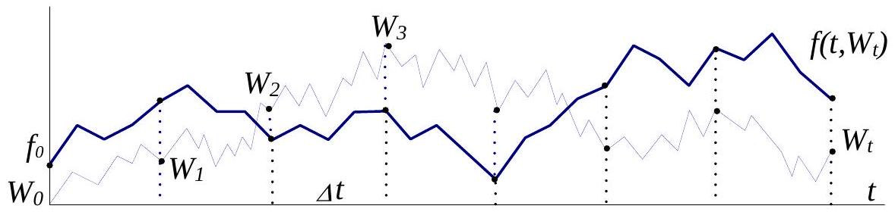

Значения винеровского процесса $W_{k}=W\left(t_{k}\right)$ на границах отрезков заданы суммой (5.1), стр. 124. Интеграл по изменению случайного винеровского процесса определим следующим образом:

$$
\begin{equation*}
\int_{0}^{t} f(\tau, W(\tau)) \delta W_{\tau}=\sum_{k=1}^{n} f\left(t_{k-1}, W_{k-1}\right)\left[W_{k}-W_{k-1}\right] . \tag{5.8}
\end{equation*}
$$

В подынтегральной функции может находиться любой стохастический процесс, эволюция которого определяется винеровской траекторией $W_{t}$. Например, процессы Орнштейна-Уленбека или Феллера не выражаются в явной функциональной форме через $W_{t}$, но полностью ею определяются.

Стоит обратить внимание на тот факт, что значения функции "под дифференциалом" вычисляются на краях отрезков: $t_{k}=k \Delta t$, а подынтегральная функция - в его первой точке $t_{k-1}$. Другими словами, в духе итерационного решения стохастического уравнения мы считаем, что сначала реализуется случайное число $W_{k-1}$, а затем оно изменяется на величину $\delta W_{k}=W_{k}-W_{k-1}=\varepsilon_{k} \sqrt{\Delta t}$. Вообще говоря, возможны и другие определения стохастического интеграла.

- Винеровский процесс имеет нулевой снос $a=0$ и единичную волатильность $b=1$. Поэтому в силу леммы Ито (2.15), стр. 55, для его квадрата имеем следующее уравнение:

$$
\begin{equation*}
d\left(W_{t}^{2}\right)=d t+2 W_{t} \delta W_{t} \tag{5.9}
\end{equation*}
$$

Чтобы его формально проинтегрировать, мы должны определить:

$$
\begin{equation*}
2 \int_{0}^{t} W_{\tau} \delta W_{\tau}=W_{t}^{2}-t \tag{5.10}
\end{equation*}
$$

Первое слагаемое в правой части выглядит естественным для обычных правил интегрирования, чего нельзя сказать о втором. Попробуем с ним разобраться. Для этого запишем представление интеграла в виде суммы:

$$
2 \sum_{k=1}^{n} W_{k-1}\left[W_{k}-W_{k-1}\right]=\sum_{k=1}^{n}\left[W_{k}^{2}-W_{k-1}^{2}-\left(W_{k}-W_{k-1}\right)^{2}\right]
$$

где выполнено элементарное алгебраическое преобразование, которое проще проверить в обратном направлении. При суммировании $W_{k}^{2}-W_{k-1}^{2}$ взаимно сокращаются, за исключением границ интегрирования. Так как на нижней границе $W_{0}=0$, мы получаем $W_{t}^{2}$. Для третьего члена:

$$
\int_{0}^{t}\left(\delta W_{\tau}\right)^{2}=\sum_{k=1}^{n}\left(W_{k}-W_{k-1}\right)^{2}=\sum_{k=1}^{n} \varepsilon_{k}^{2} \Delta t=u(n \Delta t)=u t
$$

Вообще говоря, этот интеграл отличается от формулы (5.8), так как "бесконечно малое изменение" $\delta W=\varepsilon \sqrt{d t}$ стоит в квадрате. Для обычных детерминированных функций подобная сумма оказалась бы равной нулю. Однако благодаря фактору $\sqrt{d t}$ этот стохастический интеграл имеет конечное значение. В разделе §2.2, стр. 52, мы видели, что величина $u=\left(\varepsilon_{1}^{2}+\ldots+\varepsilon_{n}^{2}\right) / n$ при $n \rightarrow \infty$ имеет нулевую волатильность $\sigma_{u} \rightarrow 0$ и, следовательно, является детерминированным числом со значением, равным $\bar{u}=1$. Фактически плотность вероятности $P(u)$ при больших $n$ - это $\chi^{2}$ - распределение ( ← $\mathrm{C}_{26}$ ) с очень узким и высоким максимумом в окрестности единицы. Таким образом, стохастический интеграл:

$$
\begin{equation*}
\int_{0}^{t}\left(\delta W_{\tau}\right)^{2}=t \tag{5.11}
\end{equation*}
$$

равен детерминированной величине $t$, и мы приходим к (5.10). Часто (5.11) записывают в символическом виде $\left(\delta W_{t}\right)^{2} \sim d t$, что, вообще говоря, неверно. Например, интеграл от $W_{\tau}\left(\delta W_{\tau}\right)^{2}$ не равен интегралу $W_{\tau} d \tau$.

- Представим при помощи стохастического интеграла решение нестационарного уравнения Ито с нулевым сносом:

$$
d x=f(t) \delta W \quad=>\quad x(t)=x(0)+\int_{0}^{t} f(\tau) \delta W_{\tau}
$$

Мы видели ( (2.18) стр. 56), что оно выражается через гауссову переменную $ε \sim N(0,1)$, поэтому:

$$
\begin{equation*}
\int_{0}^{t} f(\tau) \delta W_{\tau}=\left[\int_{0}^{t} f^{2}(\tau) d \tau\right]^{1 / 2} \varepsilon \tag{5.12}
\end{equation*}
$$

Если подынтегральная функция зависит не только от времени, но и от винеровской переменной $W_{\tau}$, интеграл уже не будет иметь нормальное распределение. Однако, используя рассуждения на стр. 74, несложно убедиться, что для стохастического интеграла

$$
I_{t}=\int_{0}^{t} f\left(\tau, W_{\tau}\right) \delta W_{\tau}
$$

среднее равно нулю $\left\langle I_{t}\right\rangle=0$, а для среднего квадрата справедливо следующее простое соотношение:

$$
\begin{equation*}
\left\langle I_{t}^{2}\right\rangle=\int_{0}^{t}\left\langle f^{2}(\tau, \varepsilon \sqrt{\tau})\right\rangle d \tau \tag{5.13}
\end{equation*}
$$

То есть, чтобы вычислить $\left\langle I_{t}^{2}\right\rangle$, необходимо возвести подынтегральную функцию в квадрат, усреднить, а затем проинтегрировать по $\tau$. При усреднении мы используем обычную случайную гауссову величину $\varepsilon$, представляя $W_{\tau}=\varepsilon \sqrt{\tau}$.

Повторив рассуждения на стр. 74 , несложно записать среднее для произведения двух процессов $I_{1}\left(t_{1}\right)$ и $I_{2}\left(t_{2}\right)$ с различными подынтегральными функциями $f_{1}$ и $f_{2}$ в различные моменты времени:

$$
\begin{equation*}
\left\langle I_{1}\left(t_{1}\right) I_{2}\left(t_{2}\right)\right\rangle=\int_{0}^{\min \left(t_{1}, t_{2}\right)}\left\langle f_{1}(\tau, \varepsilon \sqrt{\tau}) f_{2}(\tau, \varepsilon \sqrt{\tau})\right\rangle d \tau \tag{5.14}
\end{equation*}
$$

Соотношения (5.12)-(5.14) позволяют вычислять среднее и волатильность случайного процесса, если его решение выражено через стохастический интеграл. Ряд других полезных формул можно найти в приложении "Справочник", стр. 282.

- Используя определение стохастического интеграла в виде суммы (5.8), аналогично обычному анализу можно доказать свойство линейности:

$$
\int_{0}^{t}\left[\alpha f\left(\tau, W_{\tau}\right)+\beta g\left(\tau, W_{\tau}\right)\right] \delta W_{\tau}=\alpha \int_{0}^{t} f\left(\tau, W_{\tau}\right) \delta W_{\tau}+\beta \int_{0}^{t} g\left(\tau, W_{\tau}\right) \delta W_{\tau},
$$

где $\alpha$ и $\beta$ - некоторые константы. Кроме этого, пределы интегрирования можно разбивать на несколько частей:

$$
\int_{t_{1}}^{t_{3}} f\left(\tau, W_{\tau}\right) \delta W_{\tau}=\int_{t_{1}}^{t_{2}} f\left(\tau, W_{\tau}\right) \delta W_{\tau}+\int_{t_{2}}^{t_{3}} f\left(\tau, W_{\tau}\right) \delta W_{\tau}
$$

Естественно, предполагается, что времена упорядочены $t_{1}<t_{2}<t_{3}$.

- Воспользуемся теперь леммой Ито для $F\left(t, W_{t}\right)$, считая, что $x(t)= W_{t}$ - винеровский процесс с нулевым сносом и единичной дисперсией.

$$
d F=\left(\frac{\partial F}{\partial t}+\frac{1}{2} \frac{\partial^{2} F}{\partial W^{2}}\right) d t+\frac{\partial F}{\partial W} \delta W
$$

Интегрируя левую и правую часть, можно записать интегральную версию леммы Ито $\left(F_{0}=F(0, W(0))\right)$ :

$$
F\left(t, W_{t}\right)-F_{0}=\int_{0}^{t}\left[\frac{\partial F\left(\tau, W_{\tau}\right)}{\partial \tau}+\frac{1}{2} \frac{\partial^{2} F\left(\tau, W_{\tau}\right)}{\partial W_{\tau}^{2}}\right] d \tau+\int_{0}^{t} \frac{\partial F\left(\tau, W_{\tau}\right)}{\partial W_{\tau}} \delta W_{\tau}
$$

Понятно, что в этом соотношении, как и во всех выше, нижний предел в интеграле может быть произвольным моментом времени $t_{0}$. Если функция $F$ не зависит от времени:

$$
\begin{equation*}
F\left(W_{t}\right)-F(0)=\frac{1}{2} \int_{0}^{t} F^{\prime \prime}\left(W_{\tau}\right) d \tau+\int_{0}^{t} F^{\prime}\left(W_{\tau}\right) \delta W_{\tau} \tag{5.15}
\end{equation*}
$$

где штрихи - это производные по $W$. Это соотношение можно использовать для интегрирования "по частям". Например, если $F=W^{2}$, имеем:

$$
2 \int_{0}^{t} W_{\tau} \delta W_{\tau}=W_{t}^{2}-\int_{0}^{t} d \tau=W_{t}^{2}-t
$$

Подобное сведение интеграла по $\delta W$ к интегралу по времени $d \tau$ в ряде случаев бывает удобным. Однако, если подынтегральная функция при этом зависит от $W$, взять такой интеграл не проще, чем по $\delta W_{\tau}$.

## 5.3 Квадратичный функционал *

- Рассмотрим процесс, равный интегралу по времени от квадрата винеровской траектории:

$$
U_{t}=\int_{0}^{t} W_{\tau}^{2} d \tau=\left[\varepsilon_{1}^{2}+\left(\varepsilon_{1}+\varepsilon_{2}\right)^{2}+\ldots+\left(\varepsilon_{1}+\ldots+\varepsilon_{n}\right)^{2}\right] \frac{t^{2}}{n^{2}}
$$

где мы сразу положили $n \Delta t=t$. Введём гауссовы случайные величины:

$$
\eta_{k}=\varepsilon_{1}+\ldots+\varepsilon_{k}, \quad\left\langle\eta_{i} \eta_{j}\right\rangle=D_{i j}=\min (i, j) .
$$

Их матрица дисперсий $\mathbf{D}$ имеет единичный определитель $\operatorname{det} \mathbf{D}=1$. Действительно, вычитая из всех строк первую строку, затем из всех лежащих ниже второй - вторую строку, и т.д., мы приходим к треугольной матрице с единичными элементами. Например, для $n=4$ имеем:

$$
\operatorname{det} \mathbf{D}=\operatorname{det}\left(\begin{array}{llll}
1 & 1 & 1 & 1 \\
1 & 2 & 2 & 2 \\
1 & 2 & 3 & 3 \\
1 & 2 & 3 & 4
\end{array}\right)=\operatorname{det}\left(\begin{array}{llll}
1 & 1 & 1 & 1 \\
0 & 1 & 1 & 1 \\
0 & 1 & 2 & 2 \\
0 & 1 & 2 & 3
\end{array}\right)=\ldots=\operatorname{det}\left(\begin{array}{llll}
1 & 1 & 1 & 1 \\
0 & 1 & 1 & 1 \\
0 & 0 & 1 & 1 \\
0 & 0 & 0 & 1
\end{array}\right) .
$$

Матрица $\mathbf{D}$ определяет плотность вероятности величин $\eta_{k}(\S 1.6$, стр. 30):

$$
P\left(\eta_{1}, \ldots, \eta_{n}\right)=(2 \pi)^{-n / 2} e^{-\frac{1}{2} \eta \mathbf{D}^{-1} \eta} .
$$

Для скалярной случайной величины $\xi$ :

$$
\xi=\frac{U_{t}}{t^{2}}=\frac{\eta_{1}^{2}+\ldots+\eta_{n}^{2}}{n^{2}}
$$

найдём производящую функцию:

$$
\left\langle e^{p \xi}\right\rangle=\int_{-\infty}^{\infty} e^{\frac{p}{n^{2}}\left(\eta_{1}^{2}+\ldots+\eta_{n}^{2}\right)} P\left(\eta_{1}, \ldots, \eta_{n}\right) d^{n} \eta=\int_{-\infty}^{\infty} \frac{e^{-\frac{1}{2} \eta \mathbf{A} \eta}}{(2 \pi)^{n / 2}} d^{n} \eta=\frac{1}{\sqrt{\operatorname{det} \mathbf{A}}}
$$

где матрица $\mathbf{A}$ размерности $n \mathrm{x} n$ равна:

$$
\begin{equation*}
\mathbf{A}=-\frac{2 p}{n^{2}} \mathbf{1}+\mathbf{D}^{-1} \tag{5.16}
\end{equation*}
$$

Умножая обе части (5.16) на $\mathbf{D}$ и учитывая, что определитель произведения равен произведению определителей, a $\operatorname{det} \mathbf{D}=1$, получаем:

$$
\left\langle e^{p \xi}\right\rangle=\left[\operatorname{det}\left(\mathbf{1}-\frac{2 p}{n^{2}} \mathbf{D}\right)\right]^{-1 / 2}
$$

Нам необходимо найти предел этого выражения при $n \rightarrow \infty$.

- Для матрицы $\mathbf{D}$ размерности $n \times n$ с элементами $D_{i j}=\min (i, j)$ докажем следующее соотношение:

$$
\lim _{n \rightarrow \infty} \operatorname{det}\left(\mathbf{1}-\frac{x^{2}}{n^{2}} \mathbf{D}\right)=\cos (x)
$$

Несложно проверить, что обратная к $\mathbf{D}$ матрица является ленточной:

$$
\mathbf{D}^{-1}=\left(\begin{array}{ccccc}
2 & -1 & 0 & 0 & 0 \\
-1 & 2 & -1 & 0 & 0 \\
0 & -1 & 2 & -1 & 0 \\
0 & 0 & -1 & 2 & -1 \\
0 & 0 & 0 & -1 & 1
\end{array}\right) .
$$

Поэтому $A_{n}=\operatorname{det}(\mathbf{1}-\lambda \mathbf{D})=\operatorname{det}\left(\mathbf{D}^{-1}-\lambda\right)$, где $\lambda=x^{2} / n^{2}$, или

$$
A_{n}=\operatorname{det}\left(\begin{array}{ccccc}
2-\lambda & -1 & 0 & 0 & 0 \\
-1 & 2-\lambda & -1 & 0 & 0 \\
0 & -1 & 2-\lambda & -1 & 0 \\
0 & 0 & -1 & 2-\lambda & -1 \\
0 & 0 & 0 & -1 & 1-\lambda
\end{array}\right) .
$$

Вычисление определителя по первой колонке даёт следующее рекуррентное уравнение:

$$
A_{n}=(2-\lambda) A_{n-1}-A_{n-2} .
$$

Решим его сначала в более общем случае: $A_{n}=(\alpha+\beta) A_{n-1}-\alpha \beta A_{n-2}$. Перенося влево $\alpha A_{n-1}$ и $\beta A_{n-1}$, получим две геометрические прогрессии:

$$
\left\{\begin{array}{l}
A_{n}-\alpha A_{n-1}=\beta\left(A_{n-1}-\alpha A_{n-2}\right)=\beta^{n-2}\left(A_{2}-\alpha A_{1}\right) \\
A_{n}-\beta A_{n-1}=\alpha\left(A_{n-1}-\beta A_{n-2}\right)=\alpha^{n-2}\left(A_{2}-\beta A_{1}\right) .
\end{array}\right.
$$

Если $\alpha \neq \beta$, то можно исключить $A_{n-1}$ и найти $A_{n}$ :

$$
A_{n}=\frac{A_{2}-\beta A_{1}}{\alpha(\alpha-\beta)} \alpha^{n}-\frac{A_{2}-\alpha A_{1}}{\beta(\alpha-\beta)} \beta^{n} .
$$

В нашем случае $\alpha$ и $\beta$ являются корнями уравнения $x^{2}-(2-\lambda) x+1=0$, для которых можно сразу взять ведущий порядок малости по $1 / n$ :

$$
\alpha \approx 1+\imath \frac{x}{n}, \quad \beta \approx 1-\imath \frac{x}{n}, \quad A_{1} \approx A_{2} \approx 1 .
$$

Воспользовавшись предельным определением экспоненты, получаем:

$$
A_{n} \rightarrow \frac{1}{2}\left(1+\frac{\imath x}{n}\right)^{n}+\frac{1}{2}\left(1-\frac{\imath x}{n}\right)^{n} \rightarrow \frac{e^{\imath x}+e^{-\imath x}}{2}=\cos (x)
$$

что и требовалось доказать.

- Таким образом, интегралу от квадрата винеровской траектории

$$
U_{t}=\int_{0}^{t} W_{\tau}^{2} d \tau
$$

соответствует производящая функиия Камерона-Мартина:

$$
\left\langle e^{p U_{t}}\right\rangle=\frac{1}{\sqrt{\cos (t \sqrt{2 p})}}=1+p \frac{1}{2} t^{2}+\frac{p^{2}}{2!} \frac{7}{12} t^{4}+\frac{p^{3}}{3!} \frac{139}{120} t^{6}+\frac{p^{4}}{4!} \frac{5473}{1680} t^{8}+\ldots,
$$

и, следовательно, следующие средние значения:

$$
\left\langle U_{t}\right\rangle=\frac{t^{2}}{2}, \quad\left\langle U_{t}^{2}\right\rangle=\frac{7}{12} t^{4}, \quad\left\langle U_{t}^{3}\right\rangle=\frac{139}{120} t^{6}, \quad\left\langle U_{t}^{4}\right\rangle=\frac{5473}{1680} t^{8}, \quad \ldots
$$

Процесс $U_{t}$, как и $S_{t}$ (стр. 124), в момент времени $t$ выражается через скалярную случайную величину $\xi$, однако, она имеет не гауссово распределение:

$$
U_{t}=\xi t^{2}, \quad\left\langle e^{p \xi}\right\rangle=\frac{1}{\sqrt{\cos (\sqrt{2 p})}},
$$

тогда как $S_{t}=\varepsilon t^{3 / 2} / \sqrt{3}$, где $\varepsilon \sim N(0,1)$.
Зная производящие функции для $S_{t}$ и $U_{t}$, можно вычислить некоторые стохастические интегралы по $\delta W$. При помощи интегральной версии леммы Ито (5.15), стр. 133, в качестве упражнения стоит проверить, что:

$$
\int_{0}^{t} W_{\tau}^{2} \delta W_{\tau}=\frac{W_{t}^{3}}{3}-S_{t}, \quad \int_{0}^{t} W_{\tau}^{3} \delta W_{\tau}=\frac{W_{t}^{4}}{4}-\frac{3}{2} U_{t} .
$$

Аналогично, при помощи общей интегральной леммы Ито с функцией, зависящей от времени, имеем:

$$
\int_{0}^{t} \tau \delta W_{\tau}=t W_{t}-S_{t}, \quad \int_{0}^{t} \tau W_{\tau} \delta W_{\tau}=\frac{t}{2} W_{t}^{2}-\frac{t^{2}}{4}-\frac{1}{2} U_{t} .
$$

Таким образом, изучив статистические свойства трех базовых процессов $W_{t}, S_{t}$ и $U_{t}$, мы можем вычислять различные средние для достаточно широкого класса случайных процессов, выражаемых через стохастические интегралы.

Процесс $U_{t}$ имеет негауссово распределение, однако производящая функция для него была вычислена при помощи $n$-мерного интеграла Гаусса. Для интегралов по времени от $W_{t}^{3}, W_{t}^{4}, \ldots$ получить подобные простые выражения уже не просто.

- Найдём совместную производящую функцию для винеровского процесса и двух интегралов от него по времени:

$$
W_{t}, \quad S_{t}=\int_{0}^{t} W_{\tau} d \tau, \quad U_{t}=\int_{0}^{t} W_{\tau}^{2} d \tau
$$

Переходя к $n$ скоррелированным гауссовым величинам $\eta_{k}=\varepsilon_{1}+\ldots+\varepsilon_{k}$, имеем:

$$
\left\langle e^{q W_{t}+k S_{t}+p U_{t}}\right\rangle=(2 \pi)^{-n / 2} \int_{-\infty}^{\infty} e^{\mathbf{b} \eta-\frac{1}{2} \eta \mathbf{A} \eta} d \eta_{1} \ldots d \eta_{n}
$$

Матрица $\mathbf{A}$ и вектор $\mathbf{b}$ равны:

$$
\mathbf{A}=-\frac{2 p t^{2}}{n^{2}} \mathbf{1}+\mathbf{D}^{-1}, \quad \mathbf{b}=k \frac{t^{3 / 2}}{n^{3 / 2}} \mathbf{u}+q \frac{t^{1 / 2}}{n^{1 / 2}} \mathbf{z}
$$

где $\mathbf{u}=(1, \ldots, 1)$ - единичный вектор, а $\mathbf{z}=(0,0, \ldots, 0,1)$ - вектор, у которого отлична от нуля только последняя компонента. Проведя интегрирование, получаем:

$$
\left\langle e^{q W_{t}+k S_{t}+p U_{t}}\right\rangle=\frac{e^{\frac{1}{2} \mathbf{b} \mathbf{F} \mathbf{b}}}{\sqrt{\operatorname{det} \mathbf{A}}},
$$

где $\mathbf{F}=\mathbf{A}^{-1}$ - обратная к $\mathbf{A}$ матрица. Значение детерминанта нам известно, осталось вычислить показатель экспоненты. Запишем его при помощи векторов $\mathbf{u}$ и $\mathbf{z}$

$$
\begin{equation*}
\mathbf{b} \mathbf{F} \mathbf{b}=k^{2} t^{3} \frac{(\mathbf{u F u})}{n^{3}}+2 k q t^{2} \frac{(\mathbf{u F z})}{n^{2}}+q^{2} t \frac{(\mathbf{z F} \mathbf{z})}{n}, \tag{5.17}
\end{equation*}
$$

где мы воспользовались тем, что матрица $\mathbf{F}$, как и $\mathbf{A}$, симметрична. Первое выражение в круглых скобках равно сумме всех элементов $\mathbf{F}$, второе - сумме элементов последней колонки, а третье - элементу в нижнем правом углу матрицы.

Так как матрица $\mathbf{F}$ является обратной к $\mathbf{A}$, справедливы следующие соотношения:

$$
\left(\mathbf{D}^{-1}-\left(\lambda / n^{2}\right) \mathbf{1}\right) \mathbf{F}=\mathbf{F} \cdot\left(\mathbf{D}^{-1}-\left(\lambda / n^{2}\right) \mathbf{1}\right) \cdot \mathbf{F}=\mathbf{1}
$$

где $\lambda=2 p t^{2}$. Умножая их на $\mathbf{D}$, мы приходим к двум матричным уравнениям размерности $n \times n$ :

$$
\begin{equation*}
\mathbf{F}-\frac{\lambda}{n^{2}} \mathbf{D} \cdot \mathbf{F}=\mathbf{D}, \quad \mathbf{F}-\frac{\lambda}{n^{2}} \mathbf{F} \cdot \mathbf{D}=\mathbf{D} \tag{5.18}
\end{equation*}
$$

Нас интересует их решение $\mathbf{F}$ при больших $n$.

Удобно сразу перейти к пределу $n \rightarrow \infty$, заменив дискретные индексы на вещественные переменные $x=i / n, y=j / n$, изменяющиеся от нуля до единицы. В этом случае матрицы становятся функциями двух переменных, а суммы превращаются в интегралы:

$$
\frac{1}{n} \min (i, j) \rightarrow D(x, y)=D_{x y}=\min (x, y), \quad \frac{1}{n} \sum_{k=1}^{n} \rightarrow \int_{0}^{1} d x
$$

Например, вычисление следа матрицы $D_{i j}$ в дискретном и непрерывном вариантах выглядит следующим образом:

$$
\operatorname{Tr} \mathbf{D}=\frac{1}{n} \sum_{i=1}^{n} \frac{i}{n}=\frac{n(n+1)}{2 n^{2}} \rightarrow \frac{1}{2}, \quad \operatorname{Tr} \mathbf{D}=\int_{0}^{1} x d x=\frac{1}{2}
$$

Аналогично определяем $F(x, y)=F_{x y}=F_{i j} / n$. В результате матричные уравнения (5.18) превращаются в интегральные:

$$
\begin{equation*}
F_{x y}-\lambda \int_{0}^{1} D_{x z} F_{z y} d z=D_{x y}, \quad F_{x y}-\lambda \int_{0}^{1} F_{x z} D_{z y} d z=D_{x y} \tag{5.19}
\end{equation*}
$$

Пусть для $x<y$ элемент $F_{x y}$ равен функции $F(x, y)$. В силу симметрии, если $x>y$, то $F_{x y}=F(y, x)$. Разбивая пределы интегрирования на три отрезка из (5.19), при $x<y$ получаем следующие уравнения:

$$
\begin{align*}
& F_{x y}-\lambda \int_{0}^{x} z F_{z y} d z-\lambda x \int_{x}^{y} F_{z y} d z-\lambda x \int_{y}^{1} F_{y z} d z=x  \tag{5.20}\\
& F_{x y}-\lambda \int_{0}^{x} z F_{z x} d z-\lambda \int_{x}^{y} z F_{x z} d z-\lambda y \int_{y}^{1} F_{x z} d z=x \tag{5.21}
\end{align*}
$$

Если взять вторую производную по $x$ от первого уравнения и по $y$ от второго, получатся два осцилляторных уравнения:

$$
\frac{\partial^{2} F_{x y}}{\partial x^{2}}+\lambda F_{x y}=0, \quad \frac{\partial^{2} F_{x y}}{\partial y^{2}}+\lambda F_{x y}=0
$$

решение которых можно записать в виде:

$$
\begin{aligned}
F(x, y) & =\left[f_{1} \cos (y \sqrt{\lambda})+f_{2} \sin (y \sqrt{\lambda})\right] \cos (x \sqrt{\lambda}) \\
& +\left[f_{3} \cos (y \sqrt{\lambda})+f_{4} \sin (y \sqrt{\lambda})\right] \sin (x \sqrt{\lambda})
\end{aligned}
$$

где $f_{i}$ - некоторые константы, зависящие от $\lambda$.

Для того, чтобы их найти, необходимо подставить решение, например, в первое интегральное уравнение (5.20). Оно обратится в тождество при любых $x<y$, если $f_{1}=f_{2}=0, f_{3}=1 / \sqrt{\lambda}, f_{4}=\operatorname{tg}(\sqrt{\lambda}) f_{3}$. Следовательно, выражение для матрицы $F_{x y}$ при $x \leqslant y$ имеет вид:

$$
F_{x y}=\frac{\sin (x \sqrt{\lambda})}{\sqrt{\lambda}}[\cos (y \sqrt{\lambda})+\operatorname{tg}(\sqrt{\lambda}) \sin (y \sqrt{\lambda})]
$$

Теперь несложно найти множители в показателе экспоненты (5.17):

$$
\begin{aligned}
\frac{\mathbf{z} \mathbf{F} \mathbf{z}}{n} & =F_{11}=\frac{\operatorname{tg}(\sqrt{\lambda})}{\sqrt{\lambda}} \\
\frac{\mathbf{u} \mathbf{F} \mathbf{z}}{n^{2}} & =\int_{0}^{1} F_{x 1} d x=\frac{1}{\lambda}\left[\frac{1}{\cos (\sqrt{\lambda})-1}\right] \\
\frac{\mathbf{u} \mathbf{F} \mathbf{u}}{n^{3}} & =2 \int_{0}^{1} \int_{0}^{y} F_{x y} d x d y=\frac{1}{\lambda}\left[\frac{\operatorname{tg}(\sqrt{\lambda})}{\sqrt{\lambda}}-1\right]
\end{aligned}
$$

Поэтому окончательно производящая функция равна:

$$
\left\langle e^{q W_{t}+k S_{t}+p U_{t}}\right\rangle=\frac{e^{M / 2}}{\sqrt{\cos (\sqrt{\lambda})}}
$$

где $\lambda=2 p t^{2}$, и

$$
M=q^{2} t \frac{\operatorname{tg}(\sqrt{\lambda})}{\sqrt{\lambda}}+\frac{k^{2} t^{3}}{3} \frac{3}{\lambda}\left[\frac{\operatorname{tg}(\sqrt{\lambda})}{\sqrt{\lambda}}-1\right]+k q t^{2} \frac{2}{\lambda}\left[\frac{1}{\cos (\sqrt{\lambda})}-1\right] .
$$

Заметим, что, если $\lambda=0$, то

$$
\left\langle e^{q W_{t}+k S_{t}}\right\rangle=e^{\frac{1}{2}\left(q^{2} t+\frac{1}{3} k^{2} t^{3}+k q t^{2}\right)}
$$

соответствует двум скоррелированным гауссовым случайным величинам.
Приведём значение некоторых средних:

$$
\begin{gathered}
\left\langle W_{t} S_{t}\right\rangle=\frac{t^{2}}{2}, \quad\left\langle W_{t} U_{t}\right\rangle=\left\langle S_{t} U_{t}\right\rangle=0 \\
\left\langle W_{t}^{2} S_{t}\right\rangle=\left\langle W_{t} S_{t}^{2}\right\rangle=\left\langle W_{t} U_{t}^{2}\right\rangle=\left\langle S_{t} U_{t}^{2}\right\rangle=0 \\
\left\langle W_{t}^{2} U_{t}\right\rangle=\frac{7}{6} t^{3}, \quad\left\langle S_{t}^{2} U_{t}\right\rangle=\frac{13}{30} t^{5}
\end{gathered}
$$

Другие соотношения можно найти в разделах $\mathbf{R}_{57}, \mathbf{R}_{61}, \mathbf{R}_{62}$ "Стохастического справочника" (стр. 284).

## 5.4 Интегрирование стохастических уравнений

- Стохастические интегралы являются традиционным способом записи решения стохастических дифференциальных уравнений. "Проинтегрировав" уравнение

$$
d x=a(x, t) d t+b(x, t) \delta W
$$

можно записать:

$$
\begin{equation*}
x(t)=x\left(t_{0}\right)+\int_{t_{0}}^{t} a(x(\tau), \tau) d \tau+\int_{t_{0}}^{t} b(x(\tau), \tau) \delta W_{\tau} \tag{5.22}
\end{equation*}
$$

Пределы интегрирования выбраны таким образом, чтобы автоматически выполнялось начальное условие $x_{0}=x\left(t_{0}\right)$. На самом деле (5.22), конечно, не решение, а интегральное уравнение, которое обычно решить сложнее, чем исходное дифференциальное.

При формальном обосновании стохастических уравнений сначала определяется стохастическое интегрирование, затем записывается интегральное уравнение, и только после этого рассматриваются дифференциальные уравнения. Мы в этой книге приняли обратную форму изложения.

- Если снос и волатильность не зависят от $x$, то интегральное уравнение оказывается решением нестационарного винеровского блуждания:

$$
x(t)=x\left(t_{0}\right)+\int_{t_{0}}^{t} a(\tau) d \tau+\int_{t_{0}}^{t} b(\tau) \delta W_{\tau}
$$

Как мы знаем из (5.12), этот интеграл выражается через скалярную гауссову величину $\varepsilon \sim N(0,1)$ :

$$
x(t)=x\left(t_{0}\right)+\int_{t_{0}}^{t} a(\tau) d \tau+\left[\int_{t_{0}}^{t} b^{2}(\tau)\right]^{1 / 2} \varepsilon
$$

и, следовательно, сводится к обычным детерминированным интегралам. Естественно, чтобы вычислить, например, корреляцию с порождающим винеровским блужданием, необходимо учесть, что в данном случае:

$$
\left\langle x(t) W_{t}\right\rangle=\int_{t_{0}}^{t} b(\tau) d \tau
$$

Поэтому $\varepsilon$ в решении и в записи винеровского процесса $W_{t}=\varepsilon \sqrt{t}$ являются различными скоррелированными случайными числами.

- Иногда простыми заменами можно устранить зависимость в уравнении от $x$, тем самым превратив интегральное уравнение в решение задачи. Рассмотрим в качестве примера уравнение Орнштейна-Уленбека:

$$
d x=-\beta \cdot(x-\alpha) d t+\sigma \delta W
$$

Сделаем в нём замену переменных $y=e^{\beta t}(x-\alpha)$. В силу леммы Ито новый процесс $y$ удовлетворяет следующему уравнению:

$$
d y=\sigma e^{\beta t} \delta W \quad=>\quad y(t)=y(0)+\sigma \int_{0}^{t} e^{\beta \tau} \delta W_{\tau}
$$

Отсюда решение исходного уравнения имеет вид:

$$
x(t)=\alpha+\left(x_{0}-\alpha\right) e^{-\beta t}+\sigma \int_{0}^{t} e^{-\beta(t-\tau)} \delta W_{\tau}
$$

Обычно это решение в таком виде и остаётся, а вычисление средних проводится по формулам, подобным (5.13). Так как среднее стохастического интеграла по $\delta W$ равно нулю, то для среднего значения процесса Орнштейна - Уленбека имеем:

$$
\langle x(t)\rangle=\alpha+\left(x_{0}-\alpha\right) e^{-\beta t}
$$

Дисперсия процесса $\sigma_{x}^{2}(t)=\left\langle(x-\bar{x})^{2}\right\rangle$ равняется:

$$
\sigma_{x}^{2}(t)=\left\langle\left(\int_{0}^{t} \sigma e^{-\beta(t-\tau)} \delta W_{\tau}\right)^{2}\right\rangle
$$

Для вычисления среднего необходимо воспользоваться (5.13), стр. 132:

$$
\sigma_{x}^{2}(t)=\sigma^{2} \int_{0}^{t} e^{-2 \beta(t-s)} d s=\frac{\sigma^{2}}{2 \beta}\left[1-e^{-2 \beta t}\right]
$$

Удобнее, конечно, при помощи (5.12) сразу записать решение через гауссову переменную $\varepsilon$, а затем вычислять средние.

В следующей главе (стр. 168) при помощи многомерной версии леммы Ито мы получим интегральное представление решения логистического уравнения и уравнения с линейным по $x$ сносом и волатильностью.

Стохастические интегралы - это очень изящная математическая конструкция. Однако до сих пор в этих лекциях мы их не использовали, получая решения уравнений другими методами. ( $\lessdot \mathrm{C}_{24}$ ).

## 5.5 Единственность решений

Стохастические уравнения записывают, чтобы описать динамику некоторой реальной системы. Если соответствующие уравнения адекватны, то вопрос о единственности их решений обычно отходит на второй план. Тем не менее, он рано или поздно встаёт перед исследователем и является достаточно важным. Мы рассмотрим обыкновенные дифференциальные уравнения, а затем перейдём к их стохастическому аналогу. Однако сначала вспомним некоторые утверждения из анализа.

- Мы называем функцию $f(x)$ непрерывной в точке $x=c$, если пределы при стремлении к ней слева $x \rightarrow c-0$ и справа $x \rightarrow c+0$ существуют и равны друг другу. Так, $f(x)=1 / x$ непрерывна во всех точках, кроме $x=0$. Разность $f(x+0)-f(x-0)$ называется разрывом функици. Для $f(x)=1 / x$ в $x=0$ он равен бесконечности.

Непрерывная на интервале функция непрерывна в каждой его точке. В этом случае она имеет ограниченные значения и всегда существует такое конечное $M$, что

$$
\begin{equation*}
|f(x)| \leqslant M, \quad \alpha \leqslant x \leqslant \beta . \tag{5.23}
\end{equation*}
$$

Это неравенство, например, не выполняется для функций $f(x)=1 / x$, $f(x)=\operatorname{tg}(x)$ на интервале $-2 \leqslant x \leqslant 2$.

Разрывная функция может как удовлетворять этому неравенству (если имеет конечный разрыв), так и не удовлетворять (для бесконечного разрыва). Непрерывная функция, не обращаясь в бесконечность на конечном интервале, всегда ему удовлетворяет. Другое эквивалентное свойство - непрерывная функция на интервале всегда имеет конечное минимальное и максимальное значения.

- Теорема Ролля утверждает, что, если $f(\alpha)=f(\beta)$ и в интервале $[\alpha \ldots \beta]$ производная $f^{\prime}(x)$ непрерывна, то всегда существует такая точка $\gamma: \alpha \leqslant \gamma \leqslant \beta$, в которой $f^{\prime}(\gamma)=0$. Интуитивно это понятно. Если функция не постоянная и $f(\alpha)=f(\beta)$, то внутри $[\alpha \ldots \beta]$ она всегда достигнет минимума или максимума, в которых производная обратится в ноль (левый рисунок):
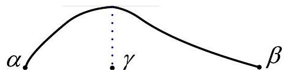
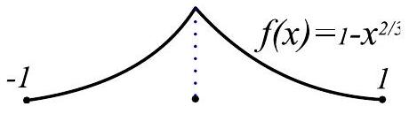

Важно существование на $\alpha \leqslant x \leqslant \beta$ конечной производной. Например, для $f(x)=1-x^{2 / 3}$ (рисунок справа) выполняется $f(-1)=f(1)$. Однако $f^{\prime}(x)=-(2 / 3) / x^{1 / 3}$ нигде в интервале $[-1 \ldots 1]$ в ноль не обращается.

- Формула конечных приращений Лагранжа непосредственно следует из теоремы Ролля. Если $f(\alpha) \neq f(\beta)$, то для $F(x)=f(x)+\lambda x$ всегда можно подобрать такое $\lambda$, что:

$$
F(\alpha)=F(\beta) \quad=>\quad \lambda=-\frac{f(\beta)-f(\alpha)}{\beta-\alpha} .
$$

Поэтому по теореме Ролля существует такое $\gamma$, что $F^{\prime}(\gamma)=f^{\prime}(\gamma)+\lambda=0$, и, следовательно:

$$
\begin{equation*}
f(\beta)-f(\alpha)=(\beta-\alpha) f^{\prime}(\gamma), \quad \alpha \leqslant \gamma \leqslant \beta . \tag{5.24}
\end{equation*}
$$

Естественно, такая точка $\gamma$ может быть и не одна, и мы знаем о ней только то, что она находится где-то внутри отрезка $[\alpha \ldots \beta]$.

- Лемма Гронуолла - Беллмана: если для констант $A, B>0$ на $[\alpha \ldots \beta]$ справедливо первое неравенство (5.25), то тогда выполняется и второе:

$$
\begin{equation*}
f(x) \leqslant A+B \int_{\alpha}^{x} f(s) d s \quad=>\quad f(x) \leqslant A e^{B(x-\alpha)} \tag{5.25}
\end{equation*}
$$

Для доказательства введём функцию:

$$
g(x)=\int_{\alpha}^{x} f(s) d s \quad=>\quad g^{\prime}(x) \leqslant A+B g(x)
$$

где мы взяли производную от $g(x)$ и воспользовались первым неравенством (5.25). Неравенство, которому удовлетворяет $g(x)$, похоже на неоднородное линейное дифференциальное уравнение. Поступая аналогично этому случаю и вводя функцию $C(x)$, имеем:

$$
g(x)=C(x) e^{B x} \quad=>\quad C^{\prime}(x) \leqslant A e^{-B x}
$$

Интегрируя его от $\alpha$ до $x$ и учитывая, что $g(\alpha)=0$ и $C(\alpha)=0$, получаем:

$$
C(x) \leqslant \frac{A}{B}\left(e^{-B \alpha}-e^{-B x}\right) \quad=>\quad g(x) \leqslant \frac{A}{B}\left(e^{B(x-\alpha)}-1\right) .
$$

Дифференцируя последнее неравенство $g^{\prime}(x)=f(x)$, мы приходим к (5.25). В частном случае $A=0$ имеем такую форму леммы:

$$
\begin{equation*}
f(x) \leqslant B \int_{\alpha}^{x} f(s) d s \quad=>\quad f(x) \leqslant 0 \tag{5.26}
\end{equation*}
$$

Поэтому, если $f(x) \geqslant 0$ и она удовлетворяет первому неравенству (5.26), то это означает, что функция равна нулю: $f(x)=0$.

- Рассмотрим теперь обыкновенное дифференциальное уравнение:

$$
\begin{equation*}
\frac{d x}{d t}=a(x, t) \tag{5.27}
\end{equation*}
$$

Для него справедлива теорема о существовании и единственности:
Если в открытой области $G$ на плоскости $(x, t)$ функция $a(x, t)$ непрерывна и имеет непрерывную производную по $x$, то через любую точку $G$ проходит одно и только одно решение (5.27).

Если производная непрерывна, то в соответствии с (5.23) она ограничена: $|\partial a / \partial x| \leqslant M$, и по формуле конечных приращений (5.24) мы имеем неравенство Липшица:

$$
\begin{equation*}
|a(y, t)-a(x, t)| \leqslant M|y-x|, \tag{5.28}
\end{equation*}
$$

Оно является непосредственным следствием непрерывности $\partial a(x, t) / \partial x$.
Докажем единственность решения (5.27), представив его в форме интегрального уравнения:

$$
x(t)=x_{0}+\int_{t_{0}}^{t} a(x(\tau), \tau) d t
$$

Пусть на интервале $\left[t_{0} \ldots t\right]$ существуют два решения $x(t)$ и $y(t)$ с одинаковым начальным условием $x\left(t_{0}\right)=y\left(t_{0}\right)=x_{0}$. Запишем их в интегральной форме и вычтем:

$$
y(t)-x(t)=\int_{t_{0}}^{t}\{a(y(\tau), \tau)-a(x(\tau), \tau)\} d t
$$

Так как сумма модулей всегда больше модуля суммы, имеем:

$$
|y(t)-x(t)| \leqslant \int_{t_{0}}^{t}|a(y(\tau), \tau)-a(x(\tau), \tau)| d t \leqslant M \int_{t_{0}}^{t}|y(\tau)-x(\tau)| d t
$$

где во втором неравенстве мы воспользовались условием Липшица (5.28). В соответствии с леммой Гронуолла - Беллмана (5.26), из этого неравенства следует, что $|y(t)-x(t)|=0$, и, следовательно, решения совпадают.

Подобное доказательство "от противного" типично для многих "неконструктивных" рассуждений в математике. Заметим, что мы доказали, что, если производная $a(x, t)$ по $x$ непрерывна, то решение единственно. Для разрывной производной может появиться более одного решения.

- Большинство уравнений имеют единственное решение. Однако бывают и исключения. Рассмотрим пример:

$$
\begin{equation*}
\frac{d x}{d t}=3 x^{2 / 3} \quad \quad=>\quad x^{1 / 3}=x_{0}^{1 / 3}+t-t_{0} \tag{5.29}
\end{equation*}
$$

Если начальное условие $x_{0}=x(0)=0$, то формально решение имеет вид $x=t^{3}$. Однако несложно проверить, что следующая функция также является решением (5.29) и удовлетворяет начальным условиям $x(0)=0$ :

$$
x(t)= \begin{cases}0, & t<T \\ (t-T)^{3}, & t \geqslant T\end{cases}
$$

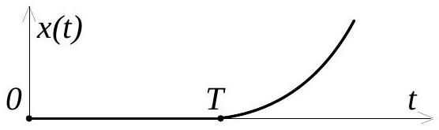

где $T$ - произвольное число. Причина неоднозначности - в нарушении условия Липшица (бесконечность производной $a^{\prime}(x)=2 / x^{1 / 3}$ в $x=0$ ). В реальном Мире, если некоторая система описывается (5.29), то она не сдвинется из начального состояния $x(0)=0$, если "решает" уравнение итерациями. Спустя произвольный момент времени $T$ может произойти внешнее воздействие (флуктуация), которое "столкнёт" итерационный процесс с нулевой отметки. Это и приведёт к неоднозначному решению ( $\lessdot \mathrm{C}_{25}$ ).

- Кроме неоднозначности, с решениями уравнений может произойти ещё одна неприятность. Рассмотрим следующую задачу:

$$
\frac{d x}{d t}=x^{2} \quad=>\quad x(t)=\frac{x_{0}}{1-\left(t-t_{0}\right) x_{0}} .
$$

Через конечное время $t-t_{0}=1 / x_{0}$ от начального момента решение обращается в бесконечность. Подобная ситуация называется "взрывом решения". За редкими исключениями подобные модели не соответствуют реальным системам или являются лишь их грубым приближением.

- С начальным условием дифференциального уравнения связана одна тонкость. Не любая функция $x=f\left(x_{0}, t_{0}, t\right)$ со значением $x_{0}=f\left(x_{0}, t_{0}, t_{0}\right)$ удовлетворяет хоть какому-то дифференциальному уравнению первого порядка. Так, в производной по времени функции $x=x_{0}+\sin \left(t-t_{0}\right)$ никакими заменами и выбором $a(x, t)$ не удастся одновременно избавиться и от $x_{0}$, и от $t_{0}$. Подставляя в уравнение решение $x=f\left(x_{0}, t_{0}, t\right)$, мы должны так его преобразовать, чтобы константы $x_{0}, t_{0}$, являющиеся "внешними" к уравнению начальными условиями, сократились.
- Перейдём теперь к стохастическим дифференциальным уравнениям. Так как мы работаем со случайными процессами, различные реализации траектории $x(t)$ могут отличаться сколь угодно сильно. Говоря о единственности решения, мы подразумеваем единственность плотности вероятности $P\left(x_{0}, t_{0} \Rightarrow x, t\right)$, которая влечёт за собой единственность среднего значения, волатильности, автоковариационной функции и т.д.

Докажем, что для уравнения

$$
d x=a(x, t) d t+b(x, t) \delta W
$$

решение будет единственным, если производные по $x$ сноса $a(x, t)$ и волатильности $b(x, t)$ непрерывны. Непрерывность означает, что производные ограничены (нигде не обращаются в бесконечность):

$$
\left|\frac{\partial a(x, t)}{\partial x}\right| \leqslant M_{a}, \quad\left|\frac{\partial b(x, t)}{\partial x}\right| \leqslant M_{b}
$$

Поэтому в силу формулы Лагранжа каждая из них удовлетворяет неравенству Липшица:

$$
\begin{align*}
|a(y, t)-a(x, t)| & \leqslant M_{a}|y-x|,  \tag{5.30}\\
|b(y, t)-b(x, t)| & \leqslant M_{b}|y-x| .
\end{align*}
$$

Будем действовать так же, как и в детерминированном случае. Перейдём к интегральному уравнению:

$$
x(t)=x_{0}+\int_{t_{0}}^{t} a(x(s), s) d s+\int_{t_{0}}^{t} b(x(s), s) \delta W_{s}
$$

Пусть существуют две разные случайные функции $x_{t}=x(t)$ и $y_{t}=y(t)$ с одинаковым начальным условием $x\left(t_{0}\right)=y\left(t_{0}\right)=x_{0}$, которые удовлетворяют этому уравнению. Найдём дисперсию их разности:

$$
\left\langle\left(y_{t}-x_{t}\right)^{2}\right\rangle=\left\langle\left[\int_{t_{0}}^{t} a_{y x}(s) d s+\int_{t_{0}}^{t} b_{y x}(s) \delta W_{s}\right]^{2}\right\rangle
$$

где $a_{y x}(s)=a(y(s), s)-a(x(s), s), b_{y x}(s)=b(y(s), s)-b(x(s), s)$ - разности сноса или волатильности, вычисленные для каждого решения.

Для двух $n$ - мерных векторов $\left\{\alpha_{1}, \ldots, \alpha_{n}\right\}$ и $\left\{\beta_{1}, \ldots, \beta_{n}\right\}$ скалярное произведение всегда меньше, чем произведение их длин (косинус угла между ними меньше единицы). Поэтому справедливо неравенство Коши - Буняковского:

$$
\left(\alpha_{1} \beta_{1}+\ldots+\alpha_{n} \beta_{n}\right)^{2} \leqslant\left(\alpha_{1}^{2}+\ldots+\alpha_{n}^{2}\right)\left(\beta_{1}^{2}+\ldots+\beta_{n}^{2}\right) .
$$

Если все $\beta_{i}=1$, имеем такой вариант этого неравенства:

$$
\left(\alpha_{1}+\ldots+\alpha_{n}\right)^{2} \leqslant n\left(\alpha_{1}^{2}+\ldots+\alpha_{n}^{2}\right) .
$$

В нашем случае $n=2$, поэтому:

$$
\left\langle\left(y_{t}-x_{t}\right)^{2}\right\rangle \leqslant 2\left\langle\left[\int_{t_{0}}^{t} a_{y x}(s) d s\right]^{2}\right\rangle+2\left\langle\left[\int_{t_{0}}^{t} b_{y x}(s) \delta W_{s}\right]^{2}\right\rangle .
$$

Для первого интеграла (точнее, его интегральной суммы) снова применим неравенство Коши-Буняковского с $n=\left(t-t_{0}\right) / \Delta s$. Среднее значение квадрата стохастического интеграла по $\delta W$ можно записать через среднее от обычного интеграла по времени (5.13), стр. 132, поэтому:

$$
\left\langle\left(y_{t}-x_{t}\right)^{2}\right\rangle \leqslant 2\left(t-t_{0}\right) \int_{t_{0}}^{t}\left\langle a_{y x}^{2}(s)\right\rangle d s+2 \int_{t_{0}}^{t}\left\langle b_{y x}^{2}(s)\right\rangle d s
$$

Воспользуемся теперь неравенствами Липшица (5.30), возведя их в квадрат. В результате:

$$
\left\langle\left(y_{t}-x_{t}\right)^{2}\right\rangle \leqslant M \int_{t_{0}}^{t}\left\langle\left(y_{t}-x_{t}\right)^{2}\right\rangle d s
$$

где $M=2\left(t-t_{0}\right) M_{a}^{2}+2 M_{b}^{2}$. Среднее разности решений $\left\langle\left(y_{t}-x_{t}\right)^{2}\right\rangle-$ это обычная функция времени, поэтому, применяя лемму Гронуолла Беллмана (5.26), приходим к выводу, что $\left\langle\left(y_{t}-x_{t}\right)^{2}\right\rangle=0$.

Среднее является интегралом с положительной плотностью вероятности. Величина $\left(y_{t}-x_{t}\right)^{2}$ также положительна. Интеграл от положительной функции может быть равен нулю, только когда она равна нулю. В результате мы приходим к выводу, что $x(t)=y(t)$, и решение единственно.

## 5.6 Метод последовательных приближений

При разложении средних величин в ряд по $t^{n}($ стр. 95) мы упоминали метод последовательных приближений как один из итерационных способов построения решения. Рассмотрим его теперь подробнее, используя стохастическое интегральное уравнение со сносом и волатильностью, не зависящими от времени:

$$
x(t)=x_{0}+\int_{0}^{t} a(x(\tau)) d \tau+\int_{0}^{t} b(x(\tau)) \delta W_{\tau}
$$

Идея метода состоит в выборе некоторого нулевого приближения случайной функции $x_{0}(t)$, удовлетворяющего начальному условию $x_{0}(0)=x_{0}$, и получении поправок к нему по следующей схеме:

$$
x_{k+1}(t)=x_{0}+\int_{0}^{t} a\left(x_{k}(\tau)\right) d \tau+\int_{0}^{t} b\left(x_{k}(\tau)\right) \delta W_{\tau}
$$

В правой части стоит известная случайная функция $x_{k}(t)$, найденная на предыдущей итерации. В результате интегрирований получается следующее приближение к решению. Заметим, что на каждой итерации текущее приближение удовлетворяет начальному условию $x_{k}(0)=x_{0}$. Вообще говоря, требуется доказать, что подобная процедура при бесконечном её применении сходится к точному решению уравнения. Мы не будем этого делать, а рассмотрим пример её использования.

В качестве нулевого приближения выберем начальное условие $x_{0}$. Тогда постоянные величины $a_{0}=a\left(x_{0}\right)$ и $b_{0}=b\left(x_{0}\right)$ выносятся за интеграл, и первая итерация имеет вид:

$$
\begin{equation*}
x_{1}(t)=x_{0}+a_{0} t+b_{0} W_{t} \tag{5.31}
\end{equation*}
$$

Так как $W_{t}=\varepsilon \sqrt{t}$, при $t \rightarrow 0$ мы фактически получили итерационную схему для стохастического дифференциального уравнения:

$$
\begin{equation*}
x_{1}(t)=x_{0}+a_{0} t+b_{0} \varepsilon \sqrt{t} \tag{5.32}
\end{equation*}
$$

которая активно использовалась в предыдущих главах. Понятно, что она работает тем лучше, чем меньше прошло времени $t$ от начального момента $t_{0}=0$. При численном решении стохастических дифференциальных уравнений выражение (5.32) часто называется схемой Эйлера.

Разложим снос и волатильность в ряд Тейлора в окрестности $x_{0}$ :

$$
a(x)=a_{0}+a_{0}^{\prime}\left(x-x_{0}\right)+\ldots, \quad b(x)=b_{0}+b_{0}^{\prime}\left(x-x_{0}\right)+\ldots,
$$

где $a_{0}^{\prime}=a^{\prime}\left(x_{0}\right)$ и $b_{0}^{\prime}=b^{\prime}\left(x_{0}\right)$. Подставляя их и (5.31) в интегральное уравнение, для второй итерации имеем:

$$
x_{2}(t)=x_{1}(t)+a_{0}^{\prime} a_{0} \frac{t^{2}}{2}+a_{0}^{\prime} b_{0} \int_{0}^{t} W_{\tau} d \tau+b_{0}^{\prime} a_{0} \int_{0}^{t} \tau \delta W_{\tau}+b_{0}^{\prime} b_{0} \int_{0}^{t} W_{\tau} \delta W_{\tau}
$$

Воспользуемся формулой интегрирования по частям (см. Справочник $\mathbf{R}_{54}$, стр. 282) и известным интегралом по $\delta W$ от $W(5.10)$, стр. 131 :

$$
\int_{0}^{t} \tau \delta W_{\tau}=t W_{t}-S_{t}, \quad \int_{0}^{t} W_{\tau} \delta W_{\tau}=\frac{1}{2}\left(W_{t}^{2}-t\right) .
$$

С их помощью перепишем второе приближение к решению:

$$
x_{2}(t)=x_{1}(t)+\frac{1}{2} b_{0}^{\prime} b_{0}\left(W_{t}^{2}-t\right)+b_{0}^{\prime} a_{0} t W_{t}+a_{0}^{\prime} a_{0} \frac{t^{2}}{2}+\left(a_{0}^{\prime} b_{0}-a_{0} b_{0}^{\prime}\right) S_{t} .
$$

Интеграл по времени $S_{t}$ от винеровской переменной через $W_{t}$ не выражается. Однако, если винеровский процесс выражен через гауссову переменную $W_{t}=\varepsilon \sqrt{t}$, то такой интеграл выражается через две независимые гауссовы переменные $\varepsilon, \eta \sim N(0,1)$, см. (5.4), стр. 125:

$$
S_{t}=\int_{0}^{t} W_{s} d s=(\sqrt{3} \varepsilon+\eta) \frac{t^{3 / 2}}{2 \sqrt{3}}
$$

Поэтому для второго приближения к решению можно записать:

$$
\begin{align*}
x_{2}(t) & =x_{0}+b_{0} \varepsilon \sqrt{t}+a_{0} t+\frac{1}{2} b_{0}^{\prime} b_{0}\left(\varepsilon^{2}-1\right) t \\
& +b_{0}^{\prime} a_{0} \varepsilon t^{3 / 2}+\left(a_{0}^{\prime} b_{0}-a_{0} b_{0}^{\prime}\right)(\sqrt{3} \varepsilon+\eta) \frac{t^{3 / 2}}{2 \sqrt{3}}+a_{0}^{\prime} a_{0} \frac{t^{2}}{2} \tag{5.33}
\end{align*}
$$

Так же, как и схема Эйлера, это соотношение работает тем лучше, чем меньше $t$. Однако этот ряд имеет второй порядок малости по $t$ и является более точным. Первую строку в этом решении (точность порядка $t$ ) называют схемой Милстейна. Мы воспользуемся ею и более точным выражением (5.33) в девятой главе для ускорения сходимости численного решения стохастических дифференциальных уравнений.

## Глава 6

## Системы уравнений

Одномерные стохастические уравнения позволяют описывать только сравнительно простые системы. Даже для обычного физического осциллятора необходимо решать систему из двух уравнений первого порядка. Реальность в общем случае - многомерна. Она даёт нам множество примеров достаточно сложных, но исключительно интересных случайных процессов.

Как и в одномерном случае, мы начнём с дискретных процессов, обобщение которых на непрерывный случай приведёт нас к системе стохастических дифференциальных уравнений. Фактически, эта глава повторяет большинство результатов предыдущих глав. Для тех, кто уверенно владеет тензорной и матричной алгеброй, соответствующие обобщения служат лишь способом повторения уже известного материала. После вывода основных многомерных уравнений будут рассмотрены решения некоторых задач.

## 6.1 Скоррелированные блуждания

- Прекрасным примером скоррелированных блужданий является финансовый рынок. На нём одновременно изменяются во времени цены тысяч финансовых активов. Их динамика образует $n$-мерный случайный процесс $\mathbf{x}(t)=\left\{x_{1}(t), \ldots, x_{n}(t)\right\}$. Иногда эти активы можно рассматривать независимым образом, однако в большинстве своём они тесно связаны. Подобная связь обычно возникает за счёт внешних синхронизирующих факторов новостийного или макроэкономического характера. Например, цены акций компаний из одного сектора экономики ежедневно изменяются достаточно синхронно. Ещё более жесткая связь возникает на рынке деривативов. В этом случае, хотя цена фьючерса или опциона испытывает случайные колебания, она, тем не менее, тесно связана с другой стохастической величиной - финансовым активом, лежащим в основе дериватива. В конечном счёте, финансовый рынок должен описываться единой, и достаточно большой системой стохастических дифференциальных уравнений.
- Рассмотрим сначала два случайных дискретных процесса, накопленные изменения которых равны:

$$
\begin{align*}
& x_{t}=\eta(1)+\eta(2)+\ldots+\eta(t)=\eta \sqrt{t}  \tag{6.1}\\
& y_{t}=\zeta(1)+\zeta(2)+\ldots+\zeta(t)=\zeta \sqrt{t}
\end{align*}
$$

Несколько тяжеловесная функциональная запись номера изменения позволит нам не путаться при описании множества процессов. Мы по-прежнему считаем, что каждое изменение $\eta(i)$ не зависит от предыдущего и является гауссовым. Аналогично для $\zeta(i)$. Поэтому суммы равны $\sqrt{t}$, умноженному на гауссову случайную величину, которую для первого процесса мы обозначили через $\eta$, а для второго - через $\zeta$. Однако теперь дополнительно предположим, что на каждом этапе изменения процессы скоррелированы друг с другом:

$$
\begin{equation*}
\langle\eta(i) \zeta(j)\rangle=\rho \delta_{i j}, \quad\langle\eta(i) \eta(j)\rangle=\langle\zeta(i) \zeta(j)\rangle=\delta_{i j}, \tag{6.2}
\end{equation*}
$$

где $\delta_{i j}$ - символ Кронекера, равный единице при $i=j$ и нулю в противном случае. Это очень похоже на фондовый рынок, на котором ежедневные изменения цен двух акций скоррелированы $\langle\eta(1) \zeta(1)\rangle=\rho$, но изменения последовательных дней, как для одной бумаги $\langle\eta(1) \eta(2)\rangle$, так и попарно $\langle\eta(1) \zeta(2)\rangle$, практически равны нулю.

Процессы (6.1) со свойствами изменений (6.2) будем называть скоррелированными дискретными винеровскими блужданиями.

- Аналогично одномерному процессу можно вычислить различные соотношения между средними. Так, пусть в момент времени $s$ мы знаем значение $x_{s}$. Даёт ли эта информация возможность предсказать $y_{t}$ в некоторый последующий момент $t>s$ ? Найдём корреляционный коэффициент между $x_{s}$ и $y_{t}$. Для этого разобьём "время" на два интервала $[1, \ldots, s]$ и $[s+1, \ldots, t]$ :

$$
\begin{aligned}
& x_{s}=\eta \sqrt{s} \\
& y_{t}=\zeta \sqrt{s}+\zeta^{\prime} \sqrt{t-s}
\end{aligned}
$$

Величины $\eta$ и $\zeta$ пропорциональны накопленным первым $s$ изменениям каждого из процессов. Среднее их произведения тоже равно $\rho$ :

$$
\langle\eta \zeta\rangle \sqrt{s} \sqrt{s}=\langle[\eta(1)+\ldots+\eta(s)][\zeta(1)+\ldots+\zeta(s)]\rangle=s \rho
$$

так как при перемножении скобок после усреднения выживут только $s$ пар с одинаковыми индексами. Накопленные изменения $\zeta^{\prime}$ второго процесса не зависят от предыстории и не скоррелированы ни с $\zeta$, ни с $\eta$. Поэтому ковариация равна:

$$
\operatorname{cov}\left(y_{t}, x_{s}\right)=\left\langle y_{t} x_{s}\right\rangle=\left\langle\left(\zeta \sqrt{s}+\zeta^{\prime} \sqrt{t-s}\right) \eta \sqrt{s}\right\rangle=s \rho
$$

Это означает, что в линейной регрессионной модели возникает следующая связь между случайными величинами:

$$
\frac{y_{t}}{\sqrt{t}}=\frac{s \rho}{\sqrt{s} \sqrt{t}} \frac{x_{s}}{\sqrt{s}}+\frac{\xi}{\sqrt{t}} \quad=>\quad y_{t}=\rho x_{s}+\xi
$$

где, как и раньше, $\xi$ - ошибка предсказания модели (случайный шум нашего "незнания" развития процесса после момента времени $s$ ).

По отдельности каждый из процессов - это обычное винеровское дискретное блуждание с начальным значением, равным нулю. Если мы знаем $y_{s}$ в момент времени $s$, то прогноз его в момент $t$ равен $y_{t}=y_{s}+\xi$ (см. стр. 36). Если нам известно только начальное значение $y_{0}=0$, то лучшим прогнозом $y_{t}$ будет ноль. В случае, когда процесс $x_{t}$ не зависим от $y_{t}$, знание $x_{s}$ нам не поможет для прогноза $y_{t}$. Однако для скоррелированных процессов это не так. Если $\rho>0$ и $x_{s}$ находится в положительной области, то и $y_{t}$ вероятнее будет находиться там же. Хотя этот прогноз не зависит от того, совпадают ли моменты времени $t=s$ или $t \gg s$, и величина его ошибки $\xi$ увеличивается со временем $t-s$.

- Чтобы при помощи компьютера смоделировать скоррелированные блуждания, нам необходимо уметь генерить случайные гауссовы числа с корреляционным коэффициентом $\rho$ между ними. Для этого проще всего взять две нескоррелированные величины $\varepsilon_{1}$ и $\varepsilon_{2}$ и вычислить следующую их линейную комбинацию (см. стр. 33):

$$
\left\{\begin{array}{l}
\eta=\varepsilon_{1} \\
\zeta=\rho \varepsilon_{1}+\sqrt{1-\rho^{2}} \varepsilon_{2} \quad=>\quad\langle\eta \zeta\rangle=\rho, \quad\left\langle\eta^{2}\right\rangle=\left\langle\zeta^{2}\right\rangle=1 .
\end{array}\right.
$$

Свойства случайных величин $\eta$ и $\zeta$ легко проверить прямым вычислением, используя соотношения $\left\langle\varepsilon_{i}\right\rangle=0,\left\langle\varepsilon_{i}^{2}\right\rangle=1$ и $\left\langle\varepsilon_{1} \varepsilon_{2}\right\rangle=0$.

Ниже на каждом из рисунков приведены реализации блуждания двух скоррелированных случайных процессов:
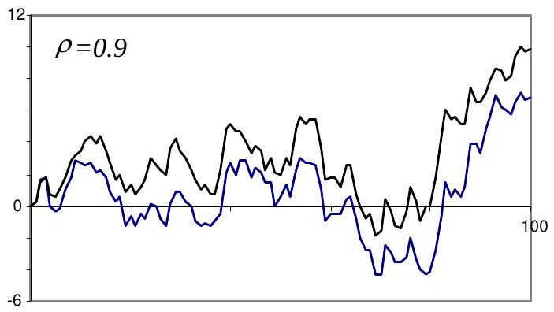
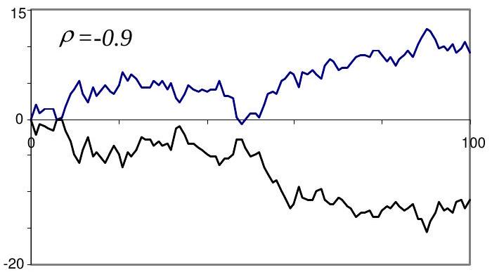

В первом случае коэффициент корреляции достаточно высок $\rho=0.9$. Во втором он такой же по модулю, но отрицательный $\rho=-0.9$.

- Запишем $i$-тый стохастический процесс в функциональном виде для индекса времени $t$ :

$$
\begin{equation*}
x_{i}(t)=\eta_{i}(1)+\ldots+\eta_{i}(t)=\eta_{i} \sqrt{t} . \tag{6.3}
\end{equation*}
$$

Фактически $\eta_{i}(k)$ можно считать не функцией, а просто способом различения гауссовых чисел. Величины $\eta_{\alpha}(k), \eta_{\beta}(k)$ относятся к одному моменту времени и равны изменению $\alpha$-го и $\beta$-го процесса.

От скоррелированных величин $\eta_{i}$ при помощи матрицы $\mathbf{S}$ можно перейти к нескоррелированным $\varepsilon_{i}$ : $\eta_{i}=S_{i j} \varepsilon_{j}$ (см. §1.6 стр. 30). В этом случае:

$$
x_{i}(t)=\sum_{k=1}^{t} \eta_{i}(k)=\sum_{k=1}^{t} S_{i j} \varepsilon_{j}(k)=S_{i j} \varepsilon_{j} \sqrt{t}=\mathbf{S} \epsilon \sqrt{t},
$$

где использованы смешанные обозначения для суммы по $k$ в явном виде и суммы по $j$ в результате его повторения.

Случайные величины $\varepsilon_{j}(k) j$-того процесса в момент времени $k$ не зависят друг от друга. Поэтому мы, как обычно, заменяем их на итоговое суммарное случайное изменение $\varepsilon_{j}$, умноженное на фактор $\sqrt{t}$.

- В непрерывном пределе мы будем рассматривать $m$ независимых винеровских блужданий $\mathbf{W}(t)=\left(W_{1}(t), \ldots, W_{m}(t)\right)$, каждое из которых определяется суммой бесконечно большого числа $N \rightarrow \infty$ гауссовых изменений, каждое из которых происходит за бесконечно малое время $\Delta t \rightarrow 0$ :

$$
W_{\alpha}(t)=\left(\varepsilon_{\alpha}(1)+\ldots+\varepsilon_{\alpha}(N)\right) \sqrt{\Delta t}=\varepsilon_{\alpha} \sqrt{N \Delta t} \rightarrow \varepsilon_{\alpha} \sqrt{t} .
$$

Изменения этих процессов $\delta \mathbf{W}$ являются шумом для динамических переменных $\mathbf{x}=\left(x_{1}, \ldots, x_{n}\right)$ той или иной системы. Например, вектор $\mathbf{x}$ может представлять собой цены различных инструментов на финансовом рынке или координаты, задающие положение броуновской частицы в трёхмерном пространстве.

Обратим внимание на то, что в общем случае количество $m$ порождающих (см. §2.8, стр. 72) процессов Винера может быть отлично от числа $n$ интересующих нас случайных функций $\mathbf{x}$. Обычно предполагается, что $m \leqslant n$. Например, возможна ситуация, когда один и тот же одномерный шум $m=1$ оказывает воздействие на $n$ переменных состояния системы. Однако чаще у каждой переменной состояния свой шум, и, следовательно, $m=n$.

Многомерное винеровское блуждание с произвольными сносами и волатильностями можно записать в следующем виде:

$$
x_{i}(t)=\mu_{i} t+\sigma_{i \alpha} W_{\alpha}(t)
$$

По повторяющемуся индексу $\alpha$ происходит суммирование, которое перемешивает при помощи матрицы $\sigma_{i \alpha}$ независимые винеровские процессы $W_{\alpha}(t)$. В общем случае $i=1, \ldots, n$, а $\alpha=1, \ldots, m$. Если $n=m$ и матрица $\sigma_{i \alpha}$ является диагональной, то $x_{i}(t)$ являются нескоррелированными. Иначе $\sigma_{i \alpha}$ задают не только волатильности процессов, но и коэффициенты их корреляции.

Аналогично одномерному случаю стохастическое уравнение, которому удовлетворяет этот процесс, имеет вид:

$$
d x_{i}=\mu_{i} d t+\sigma_{i \alpha} \delta W_{\alpha}
$$

или в матричных обозначениях:

$$
d \mathbf{x}=\mu d t+\sigma \delta \mathbf{W}
$$

где $\mu=\left(\mu_{1}, \ldots ., \mu_{n}\right)$ - вектор сноса, определяющий детерминированную составляющую изменения случайных функций $\mathbf{x}(t)$.

## 6.2 Системы стохастических уравнений

- В общем случае система стохастических уравнений записывается в виде:

$$
\begin{equation*}
d x_{i}=a_{i}(\mathbf{x}, t) d t+b_{i \alpha}(\mathbf{x}, t) \delta W_{\alpha}, \tag{6.4}
\end{equation*}
$$

где $i=1, \ldots, n$, по повторяющемуся индексу $\alpha=1, \ldots, m$ предполагается суммирование, и в общем случае $n \neq m$. Можно опустить не только знак суммы, но и индексы, записав стохастическое уравнение в матричном виде:

$$
\begin{equation*}
d \mathbf{x}=\mathbf{a}(\mathbf{x}, t) d t+\mathbf{b} \cdot \delta \mathbf{W} \tag{6.5}
\end{equation*}
$$

где $\mathbf{a}$ - векторная функция, $\mathbf{a} \mathbf{b}$ - матричная, размерности $n \times m$. Вектор винеровских переменных, как и в одномерном случае, записывается через гауссовы случайные числа:

$
\begin{equation*}
\delta \mathbf{W}=\left\{\delta W_{1}, \ldots, \delta W_{m}\right\}=\left\{\varepsilon_{1}, \ldots, \varepsilon_{m}\right\} \sqrt{t}=\epsilon \cdot \sqrt{t} . \tag{6.6}
\end{equation*}
$$

Мы будем считать, что $\left\langle\varepsilon_{\alpha} \varepsilon_{\beta}\right\rangle=\delta_{\alpha \beta}$, а эффекты корреляции переносить на матрицу $b_{i \alpha}$. Скоррелированные величины $\varepsilon_{\alpha}^{\prime}$ можно выразить через нескоррелированные при помощи линейного преобразования $\epsilon^{\prime}=\mathbf{S} \cdot \epsilon$, поэтому стохастический член в уравнении Ито со скоррелированными винеровскими переменными $\mathbf{b}^{\prime} \cdot \epsilon^{\prime} \sqrt{d t}$ эквивалентен $\left(\mathbf{b}^{\prime} \cdot \mathbf{S}\right) \cdot \epsilon \sqrt{d t}$.

- Численное моделирование выполняется при помощи выбора малого интервала времени $\Delta t$. После этого генерится вектор $m$ нормально распределённых чисел $\epsilon=\left\{\varepsilon_{1}, \ldots, \varepsilon_{m}\right\}$ и вычисляется набор значений процессов в следующий момент времени. Для первой итерации:

$$
\begin{equation*}
x_{i}=x_{0 i}+a_{i}\left(\mathbf{x}_{0}, t_{0}\right) \Delta t+b_{i \alpha}\left(\mathbf{x}_{0}, t_{0}\right) \varepsilon_{\alpha} \sqrt{\Delta t} . \tag{6.7}
\end{equation*}
$$

Процессы $\mathbf{x}(t)=\left\{x_{1}(t), \ldots, x_{n}(t)\right\}$ мы всегда нумеруем, начиная с индекса 1 , а нулевой индекс $x_{0 i}$ - это значение $i$-того процесса в момент времени $t_{0}$, т.е. $x_{0 i}=x_{i}\left(t_{0}\right)$.

Несложно проверить, что смысл коэффициентов сноса определяется средним $\left\langle x_{i}-x_{0 i}\right\rangle / \Delta t=a_{i}\left(\mathbf{x}_{0}, t_{0}\right)$, а диффузия:

$$
\begin{equation*}
\frac{\left\langle\left(x_{i}-x_{0 i}\right)\left(x_{j}-x_{0 j}\right)\right\rangle}{\Delta t}=b_{i \alpha}\left(\mathbf{x}_{0}, t_{0}\right) b_{j \alpha}\left(\mathbf{x}_{0}, t_{0}\right)=\left(\mathbf{b} \cdot \mathbf{b}^{T}\right)_{i j} \tag{6.8}
\end{equation*}
$$

при $\Delta t \rightarrow 0$ стремится к произведению матриц волатильности, где $b_{i j}^{T}= b_{j i}$ - операция транспонирования (перестановки) индексов.

- Обобщим лемму Ито на $n$-мерный случай. Пусть $F(\mathbf{x}, t)$ - дифференцируемая функция. Разложим её в ряд Тейлора в окрестности точки $\mathbf{x}_{0}, t_{0}$ :

$$
\begin{equation*}
F(\mathbf{x}, t)=F\left(\mathbf{x}_{0}, t_{0}\right)+\frac{\partial F}{\partial t} \Delta t+\frac{\partial F}{\partial x_{i}} \Delta x_{i}+\frac{1}{2} \frac{\partial^{2} F}{\partial x_{i} \partial x_{j}} \Delta x_{i} \Delta x_{j}+\ldots \tag{6.9}
\end{equation*}
$$

По повторяющимся индексам проводится суммирование, и все функции в правой части вычисляются в точке $\mathbf{x}_{0}, t_{0}$. В соответствии с (6.7):

$$
\begin{equation*}
\Delta x_{i}=a_{i}\left(\mathbf{x}_{0}, t_{0}\right) \Delta t+b_{i \alpha}\left(\mathbf{x}_{0}, t_{0}\right) \varepsilon_{\alpha} \sqrt{\Delta t} \tag{6.10}
\end{equation*}
$$

Изменение функции $d F=F(\mathbf{x}, t)-F\left(\mathbf{x}_{0}, t_{0}\right)$ подчиняется стохастическому уравнению Ито:

$$
\begin{equation*}
d F=A\left(\mathbf{x}_{0}, t_{0}\right) d t+B_{\alpha}\left(\mathbf{x}_{0}, t_{0}\right) \delta W_{\alpha} \tag{6.11}
\end{equation*}
$$

Подставляя (6.10) в (6.9) и сохраняя члены порядка $\sqrt{\Delta t}, \Delta t$, получаем:

$$
F-F_{0} \approx\left(\frac{\partial F}{\partial t}+\frac{\partial F}{\partial x_{i}} a_{i}+\frac{1}{2} \frac{\partial^{2} F}{\partial x_{i} \partial x_{j}} b_{i \alpha} b_{j \beta} \varepsilon_{\alpha} \varepsilon_{\beta}\right) \Delta t+\frac{\partial F}{\partial x_{i}} b_{i \alpha} \varepsilon_{\alpha} \sqrt{\Delta t}
$$

Снос $A\left(\mathbf{x}_{0}, t_{0}\right)$ по определению равен пределу $\left\langle F-F_{0}\right\rangle / \Delta t$ при $\Delta t \rightarrow$ 0 и находится с учётом соотношений $\left\langle\varepsilon_{\alpha} \varepsilon_{\beta}\right\rangle=\delta_{\alpha \beta}$. Для диффузии, в соответствии с (6.8), имеем:

$$
\frac{\left\langle\left(F-F_{0}\right)^{2}\right\rangle}{\Delta t}=\frac{\partial F}{\partial x_{i}} \frac{\partial F}{\partial x_{j}} b_{i \alpha} b_{j \alpha}=B_{\alpha} B_{\alpha}
$$

Поэтому стохастическое уравнение для скалярной функции $n+1$ переменных $F(\mathbf{x}, t)$, в которую вместо аргументов $\mathbf{x}$ подставлены случайные процессы $\mathbf{x}(t)$, записывается следующим образом:

$$
\begin{equation*}
d F=\left(\frac{\partial F}{\partial t}+\frac{\partial F}{\partial x_{i}} a_{i}+\frac{1}{2} \frac{\partial^{2} F}{\partial x_{i} \partial x_{j}} b_{i \alpha} b_{j \alpha}\right) d t+\frac{\partial F}{\partial x_{i}} b_{i \alpha} \delta W_{\alpha} \tag{6.12}
\end{equation*}
$$

Если функция $F$ - не скалярная, а векторная, то это соотношение справедливо для каждой из её компонент.

Введя символ следа матрицы, равного сумме диагональных элементов $\operatorname{Tr} \mathbf{A}=A_{\alpha \alpha}=A_{11}+\ldots+A_{n n}$, можно записать лемму Ито в матричном виде:

$$
\begin{equation*}
d F=\left(\frac{\partial F}{\partial t}+\frac{\partial F}{\partial \mathbf{x}} \cdot \mathbf{a}+\frac{1}{2} \operatorname{Tr}\left[\mathbf{b}^{T} \cdot \frac{\partial^{2} F}{\partial \mathbf{x}^{2}} \cdot \mathbf{b}\right]\right) d t+\frac{\partial F}{\partial \mathbf{x}} \cdot \mathbf{b} \cdot \delta \mathbf{W} \tag{6.13}
\end{equation*}
$$

где $\partial^{2} F / \partial \mathbf{x}^{2}$ - матрица вторых производных.

- Получим многомерное уравнение Фоккера-Планка. Для этого необходимо повторить рассуждения из одномерной задачи. Рассмотрим случайный вектор $\mathbf{y}=\mathbf{x}(t)$ в момент времени $t$ и предшествующий ему $\mathbf{x}=\mathbf{x}(t-\Delta t)$ в момент времени $t-\Delta t$. Они связаны диффузным стохастическим процессом:

$$
\mathbf{y}=\mathbf{x}+\mathbf{a} \Delta t+\mathbf{b} \cdot \epsilon \sqrt{\Delta t},
$$

где векторная $\mathbf{a}=a_{i}(\mathbf{x}, t-\Delta t)$ и матричная $\mathbf{b}=b_{i \alpha}(\mathbf{x}, t-\Delta t)$ функции вычислены в момент времени $t-\Delta t$. Предположим, что плотность вероятности случайной величины $\mathbf{x}$ равна $P(\mathbf{x}, t-\Delta t)$. Распределение для гауссовой переменной нам известно. Чтобы найти распределение для величины $\mathbf{y}$, необходимо вычислить среднее от произвольной функции $F(\mathbf{y})$ с известными плотностями $P(\mathbf{x}, t-\Delta t)$ и $P(\epsilon)$ :

$$
\langle F(\mathbf{y})\rangle=\int_{-\infty}^{\infty} \overbrace{F(\mathbf{x}+\mathbf{a} \Delta t+\mathbf{b} \cdot \epsilon \sqrt{\Delta t})}^{F(\mathbf{y})} \cdot \overbrace{P(\mathbf{x}, t-\Delta t) P\left(\varepsilon_{1}, \ldots, \varepsilon_{m}\right)}^{P(\mathbf{x}, \varepsilon)} d^{n} x d^{m} \varepsilon
$$

Разложим первый множитель в ряд по малой величине $\mathbf{a} \Delta t+\mathbf{b} \varepsilon \sqrt{\Delta t}$ :

$$
\begin{aligned}
F(\mathbf{y}) & =F(\mathbf{x})+\frac{\partial F}{\partial x_{i}}\left(a_{i} \Delta t+b_{i \alpha} \varepsilon_{\alpha} \sqrt{\Delta t}\right) \\
& +\frac{1}{2} \frac{\partial^{2} F}{\partial x_{i} \partial x_{j}}\left(a_{i} \Delta t+b_{i \alpha} \varepsilon_{\alpha} \sqrt{\Delta t}\right)\left(a_{j} \Delta t+b_{j \beta} \varepsilon_{\beta} \sqrt{\Delta t}\right)
\end{aligned}
$$

где по повторяющимся индексам, как и раньше, подразумевается суммирование. По $\Delta t$ раскладываем также $P(\mathbf{x}, t-\Delta t)$.

При интегрировании по всем $\varepsilon_{i}$ происходит усреднение, которое даёт $\left\langle\varepsilon_{\alpha}\right\rangle=0$ и $\left\langle\varepsilon_{\alpha} \varepsilon_{\beta}\right\rangle=\delta_{\alpha \beta}$. В результате, повторяя рассуждения на стр. 107, получаем:

$$
\begin{equation*}
\frac{\partial P}{\partial t}+\frac{\partial\left(a_{i} P\right)}{\partial x_{i}}-\frac{1}{2} \frac{\partial^{2}}{\partial x_{i} \partial x_{j}}\left[b_{i \alpha} b_{j \alpha} P\right]=0 \tag{6.14}
\end{equation*}
$$

где $a_{i}=a_{i}(\mathbf{x}, t), b_{i \alpha}=b_{i \alpha}(\mathbf{x}, t)$, а $P=P\left(\mathbf{x}_{0}, t_{0} \Rightarrow \mathbf{x}, t\right)$ - условная плотность вероятности. Если в момент времени $t_{0}$ значение $\mathbf{x}_{0}$ известно точно, то для решения этого уравнения используется начальное условие в виде $n$ - мерной дельта - функции Дирака, равной произведению одномерных функций по каждой координате: $P\left(\mathbf{x}_{0}, t_{0} \Rightarrow \mathbf{x}, t_{0}\right)=\delta\left(\mathbf{x}-\mathbf{x}_{0}\right)$.

- Аналогично выводится уравнение для производной от среднего:

$$
\frac{d\langle F(\mathbf{x}(t), t)\rangle}{d t}=\int_{-\infty}^{\infty} \frac{\partial}{\partial t}\left[F(\mathbf{x}, t) P\left(\mathbf{x}_{0}, t_{0} \Rightarrow \mathbf{x}, t\right)\right] d^{n} x
$$

Раскрывая производную произведения и подставляя $\partial P / \partial t$ из уравнения Фоккера - Планка, получаем динамические уравнения для средних:

$$
\begin{equation*}
\frac{d\langle F(\mathbf{x}(t), t)\rangle}{d t}=\left\langle\frac{\partial F}{\partial t}+a_{i} \frac{\partial F}{\partial x_{i}}+\frac{1}{2} b_{i \alpha} b_{j \alpha} \frac{\partial^{2} F}{\partial x_{i} \partial x_{j}}\right\rangle \tag{6.15}
\end{equation*}
$$

Как и лемму Ито, это соотношение можно записать в матричной форме при помощи символа следа Tr. Усреднение производится при условии, что в момент времени $t$ вектор случайного процесса был равен $\mathbf{x}_{0}=\mathbf{x}\left(t_{0}\right)$.

Уравнение для среднего справедливо и для векторных или тензорных функций, так как выводится независимо для каждой из компонент. Выбирая $F=x_{\nu}$ и учитывая, что $\partial x_{\nu} / \partial x_{i}=\delta_{\nu i}$, получаем временную динамику среднего в компонентной и матричной форме:

$$
\begin{equation*}
\left\langle\dot{x_{\nu}}\right\rangle=\left\langle a_{\nu}(\mathbf{x}, t)\right\rangle, \quad\langle\dot{\mathbf{x}}\rangle=\langle\mathbf{a}(\mathbf{x}, t)\rangle \tag{6.16}
\end{equation*}
$$

Только для линейных по $\mathbf{x}$ сносов динамика среднего значения будет совпадать с решением детерминированного уравнения. Функциональная зависимость волатильности $\mathbf{b}(\mathbf{x}, t)$ при этом роли не играет. Если снос нелинеен по $\mathbf{x}$, то функция $\langle\mathbf{x}\rangle=\overline{\mathbf{x}}(t)$ будет отличаться от детерминированного решения $\mathbf{c} \mathbf{b}=0$.

Производные от произведения $x_{\mu} x_{\nu}$ выражаются через символ Кронекера следующим образом:

$$
\frac{\partial\left(x_{\mu} x_{\nu}\right)}{\partial x_{i}}=x_{\mu} \delta_{\nu i}+x_{\nu} \delta_{\mu i}, \quad \frac{\partial^{2}\left(x_{\mu} x_{\nu}\right)}{\partial x_{i} \partial x_{j}}=\delta_{\mu j} \delta_{\nu i}+\delta_{\nu j} \delta_{\mu i}
$$

Поэтому, выбирая $F$ в тензорном виде $F=x_{\mu} x_{\nu}$, можно записать уравнение для среднего от произведения случайных процессов:

$$
\begin{equation*}
\left\langle x_{\mu} x_{\nu}\right\rangle=\left\langle x_{\mu} a_{\nu}+x_{\nu} a_{\mu}+b_{\nu \alpha} b_{\mu \alpha}\right\rangle \tag{6.17}
\end{equation*}
$$

В частности, для свёртки (суммирования) по индексам $\mu$ и $\nu$ имеем матричное выражение для изменения квадрата $\left\langle\mathbf{x}^{2}\right\rangle=2\langle\mathbf{x} \cdot \mathbf{a}\rangle+\operatorname{Tr}\left\langle\mathbf{b} \cdot \mathbf{b}^{T}\right\rangle$.

## 6.3 Стохастический осциллятор

- В качестве примера решения стохастической задачи в двух измерениях $n=m=2$ рассмотрим движение по окружности с частотой $\omega$ и постепенным уменьшением радиуса. Детерминированная версия подобной спирали может иметь следующую зависимость координат от времени:
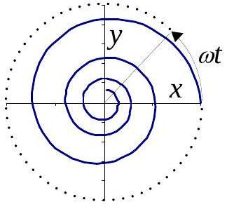

$$
\left\{\begin{array}{l}
x(t)=e^{-\lambda t}\left(x_{0} \cos \omega t-y_{0} \sin \omega t\right) \\
y(t)=e^{-\lambda t}\left(x_{0} \sin \omega t+y_{0} \cos \omega t\right)
\end{array}\right.
$$

$$
\begin{aligned}
& \text { Начальные условия: } x_{0}=x(0), y_{0}=y(0) \text {. } \\
& \text { Радиус: } r(t)=\sqrt{x^{2}+y^{2}}=r_{0} e^{-\lambda t} \text {. }
\end{aligned}
$$

Примеры систем с таким поведением мы рассмотрим в следующей главе. Сейчас наша цель - математическое описание стохастической динамики. Для этого найдём решение системы уравнений следующего вида:

$$
\left\{\begin{array}{l}
d x=(-\lambda x-\omega y) d t+\sigma \delta W_{x} \\
d y=(+\omega x-\lambda y) d t+\sigma \delta W_{y} .
\end{array}\right.
$$

Предполагается, что шум $\delta W_{x}=\varepsilon_{x} \sqrt{t}, \delta W_{y}=\varepsilon_{y} \sqrt{t}$ по каждой координате нескоррелирован. В качестве упражнения ( $\lessdot \mathrm{H}_{29}$ ) стоит записать эту же систему для скоррелированного шума.

- Зависимость среднего значения от времени находим из (6.16):

$$
\left\{\begin{array}{l}
\dot{\bar{x}}=-\lambda \bar{x}-\omega \bar{y} \\
\dot{\bar{y}}=+\omega \bar{x}-\lambda \bar{y} .
\end{array}\right.
$$

Умножим второе из уравнений на мнимую единицу $\imath\left(\imath^{2}=-1\right)$ и сложим их. В результате для комплексной величины $z=x+\imath y$ и параметра $\Lambda=\lambda-\imath \omega$ получим "одномерное" уравнение $\dot{\bar{z}}=-\Lambda \bar{z}$. Оно легко интегрируется:

$$
\bar{z}(t)=e^{-\Lambda t} z_{0}=e^{-\lambda t+\imath \omega t} z_{0}=e^{-\lambda t}(\cos \omega t+\imath \sin \omega t) z_{0},
$$

где $z_{0}=z(0)=x_{0}+\imath y_{0}-$ начальное условие. Приравняв действительную и мнимую части:

$$
\left\{\begin{array}{l}
\bar{x}(t)=e^{-\lambda t}\left(x_{0} \cos \omega t-y_{0} \sin \omega t\right)  \tag{6.18}\\
\bar{y}(t)=e^{-\lambda t}\left(x_{0} \sin \omega t+y_{0} \cos \omega t\right),
\end{array}\right.
$$

получаем решение для эволюции средних значений координат в виде спирали. По каждой координате происходят затухающие периодические колебания. Параметр $\omega$ является их частотой, $\lambda$ - скоростью затухания.

- Найдём теперь, как ведёт себя среднее значение квадрата расстояния от начала координат. Воспользуемся матричной записью уравнения (6.17) для среднего $\left\langle\mathbf{x}^{2}\right\rangle=2\langle\mathbf{x} \cdot \mathbf{a}\rangle+\operatorname{Tr}\left\langle\mathbf{b} \cdot \mathbf{b}^{T}\right\rangle$. В нашем случае:

$$
\mathbf{x}=\binom{x}{y}, \quad \mathbf{a}=\binom{-\lambda x-\omega y}{+\omega x-\lambda y}, \quad \mathbf{b}=\sigma\left(\begin{array}{ll}
1 & 0 \\
0 & 1
\end{array}\right) .
$$

Поэтому получаем:

$$
\overline{\dot{\mathbf{x}^{2}}}=-2 \lambda \overline{\mathbf{x}^{2}}+2 \sigma^{2} \quad=>\quad \overline{\mathbf{x}^{2}}(t)=\frac{\sigma^{2}}{\lambda}+\left(x_{0}^{2}+y_{0}^{2}-\frac{\sigma^{2}}{\lambda}\right) e^{-2 \lambda t}
$$

Таким образом, когда колебания "затухнут" ( $t \rightarrow \infty$ ), останется ненулевая дисперсия квадрата, тем большая, чем медленнее происходило затухание! Этот результат свидетельствует о стабилизирующей роли сильного трения (большие $\lambda$ ) при внешних стохастических толчках. Несмотря на то, что $\lambda$ находится в знаменателе, особенности при $\lambda=0$ нет. Раскладывая экспоненту, несложно убедиться, что при $\lambda=0$ среднее равно $\overline{\mathbf{x}^{2}}=x_{0}^{2}+y_{0}^{2}+2 \sigma^{2} t$. Это означает, что, как и в винеровском блуждании, внешние толчки со временем размывают круговую траекторию. Найти асимптотическое решение $\overline{x^{2}}(t), \overline{y^{2}}(t), \overline{x y}(t)$ в ситуации скоррелированного шума предлагается в качестве упражнения ( $\lessdot \mathrm{H}_{30}$ ).

- Выразим решение задачи через гауссовы переменные. В комплексных обозначениях стохастическое уравнение имеет компактный вид:

$$
d z=-\Lambda z d t+\sigma \delta W
$$

где $\delta W=\varepsilon \sqrt{d t}, \varepsilon=\varepsilon_{x}+\imath \varepsilon_{y}-$ комплексное гауссово число, а $z$ и $\Lambda$ определены выше. Перейдём, при помощи формулы Ито, к переменной $F=z e^{\Lambda t}$. Её динамическое уравнение не будет содержать сноса:

$$
d F=\sigma e^{\Lambda t} \delta W=S(t) \delta W
$$

где $S(t)=\sigma e^{\Lambda t}$. Решим уравнение $d F=S(t) \delta W$ итерациями ( $k=1 \ldots n$ ):

$$
F=F_{0}+\sum S\left(t_{k-1}\right) \varepsilon\left(t_{k}\right) \sqrt{\Delta t} .
$$

Как функция $S(t)$, так и $\varepsilon_{k}$ являются комплексными величинами, поэтому необходима определённая осторожность по сворачиванию этой суммы в одно гауссово число. Распишем действительные и мнимые части:

$$
\sum\left[S_{x}+\imath S_{y}\right]\left[\varepsilon_{x}+\imath \varepsilon_{y}\right] \sqrt{\Delta t}=\sum[(\underbrace{S_{x} \varepsilon_{x}-S_{y} \varepsilon_{y}}_{|S| \varepsilon_{x}^{\prime}})+\imath(\underbrace{S_{x} \varepsilon_{y}+S_{y} \varepsilon_{x}}_{|S| \varepsilon_{y}^{\prime}})] \sqrt{\Delta t}
$$

где $|S|=\sqrt{S_{x}^{2}+S_{y}^{2}}$ - модуль комплексного числа, а $\varepsilon_{x}^{\prime}, \varepsilon_{x}^{\prime}$ - новые нескоррелированные $\left\langle\varepsilon_{x}^{\prime} \varepsilon_{y}^{\prime}\right\rangle=0$ гауссовы числа.

Опуская штрихи и повторяя рассуждения одномерного случая (стр. 56), мы можем окончательно записать:

$$
F(t)=F\left(t_{0}\right)+\left[\int_{t_{0}}^{t}|S(\tau)|^{2} d \tau\right]^{1 / 2} \varepsilon
$$

где $\varepsilon=\varepsilon_{x}+\imath \varepsilon_{y}-$ по-прежнему комплексная гауссова случайная величина.
Заметим, что действительная и мнимая части выражения $\varepsilon^{\prime}=e^{\imath \alpha} \varepsilon$ являются независимыми гауссовыми числами. Действительно, распишем их в явном виде:

$$
\begin{aligned}
& \varepsilon_{x}^{\prime}=\varepsilon_{x} \cos \alpha-\varepsilon_{y} \sin \alpha \\
& \varepsilon_{y}^{\prime}=\varepsilon_{x} \sin \alpha+\varepsilon_{y} \cos \alpha
\end{aligned}
$$

Прямым вычислением проверяем $\left\langle\varepsilon_{x}^{\prime 2}\right\rangle=\left\langle\varepsilon_{y}^{\prime 2}\right\rangle=1$ и $\left\langle\varepsilon_{x}^{\prime} \varepsilon_{y}^{\prime}\right\rangle=0$. Поэтому множители типа $e^{\imath \omega t}$ перед комплексным гауссовым числом можно опускать, так как $e^{\imath \alpha} \varepsilon$ статистически эквивалентно просто $\varepsilon$

Проводя интегрирование для $|S(\tau)|^{2}=\sigma^{2} e^{2 \lambda \tau}$ и учитывая, что $z= F e^{-\Lambda t}, z_{0}=F_{0}$, для $t_{0}=0$ получаем:

$$
\begin{equation*}
z=z_{0} e^{-\lambda t+\imath \omega t}+\frac{\sigma}{\sqrt{2 \lambda}} \sqrt{1-e^{-2 \lambda t}} \varepsilon \tag{6.19}
\end{equation*}
$$

или в явном виде для действительной и мнимой частей:

$$
\begin{aligned}
x(t) & =\bar{x}(t)+\frac{\sigma}{\sqrt{2 \lambda}} \sqrt{1-e^{-2 \lambda t}} \varepsilon_{x} \\
y(t) & =\bar{y}(t)+\frac{\sigma}{\sqrt{2 \lambda}} \sqrt{1-e^{-2 \lambda t}} \varepsilon_{y}
\end{aligned}
$$

где $\bar{x}(t)$ и $\bar{y}(t)$ - средние, определяемые выражениями (6.18). В качестве упражнения стоит найти $\overline{x^{2}}(t), \overline{y^{2}}(t), \overline{x y}(t)$ и проверить справедливость уравнений для средних ( $\lessdot \mathrm{H}_{31}$ ).

Квадрат величины $|z|^{2}=x^{2}+y^{2}$ является квадратом радиус-вектора, для которого уже известно среднее значение. Сделаем это ещё раз при помощи (6.19):

$$
\left.\left.\langle | z_{t}\right|^{2}\right\rangle=\left|z_{0}\right|^{2} e^{-2 \lambda t}+\frac{\sigma^{2}}{\lambda}\left(1-e^{-2 \lambda t}\right)
$$

Обращаем внимание на то, что $\left.\left.\langle | \varepsilon\right|^{2}\right\rangle=\left\langle\varepsilon \varepsilon^{*}\right\rangle=\left\langle\varepsilon_{x}^{2}+\varepsilon_{y}^{2}\right\rangle=2$, где звёздочка обозначает комплексное сопряжение.

В решении, аналогично одномерному случаю, можно выразить $z$ в момент времени $t+\tau$ через $z$ в момент $t$ :

$$
z_{t+\tau}=z_{t} e^{-\lambda \tau+\imath \omega \tau}+\frac{\sigma}{\sqrt{2 \lambda}} \sqrt{1-e^{-2 \lambda \tau}} \varepsilon
$$

что легко позволяет вычислить, например, среднее $\left\langle z_{t} z_{t+\tau}^{*}\right\rangle\left(\lessdot \mathrm{H}_{32}\right)$.

- При больших временах $t \rightarrow \infty$ решение забывает начальные условия, и средние стремятся к нулю. Распределение становится стационарным по каждой из координат. Однако это не означает, что периодические свойства системы исчезают. Чтобы в этом убедиться, найдём ковариационную функцию, например, по координате $x$. Выражая решение относительно начального момента времени $t$, имеем:

$$
x_{t+\tau}=e^{-\lambda \tau}\left(x_{t} \cos \omega \tau-y_{t} \sin \omega \tau\right)+\frac{\sigma}{\sqrt{2 \lambda}} \varepsilon_{x} \sqrt{1-e^{-2 \lambda \tau}}
$$

Найдем $\operatorname{cov}_{x x}(t, t+\tau)=\left\langle x_{t} x_{t+\tau}\right\rangle-\left\langle x_{t}\right\rangle\left\langle x_{t+\tau}\right\rangle$ в пределе $t \rightarrow \infty$. Так как в этом случае $\left\langle x_{t}\right\rangle=\left\langle y_{t}\right\rangle=\left\langle x_{t} y_{t}\right\rangle=0$, а $\left\langle x_{t}^{2}\right\rangle=\sigma^{2} / 2 \lambda$, получаем, как и следовало ожидать, стационарную ковариационную функцию, зависящую только от $\tau>0$ :

$$
\operatorname{cov}_{x x}(t, t+\tau) \rightarrow \operatorname{cov}(\tau)=\frac{\sigma^{2}}{2 \lambda} e^{-\lambda \tau} \cos \omega \tau
$$

Она оказывается периодической функцией сдвига $\tau$. Фурье-образ ковариационной функции характеризует спектральные свойства процесса (стр. 68):

$$
\mathcal{S}(\Omega)=\frac{2}{\pi} \int_{0}^{\infty} \operatorname{cov}(\tau) \cos (\Omega \tau) d \tau=\frac{\sigma^{2}}{2 \pi}\left[\frac{1}{\lambda^{2}+(\Omega+\omega)^{2}}+\frac{1}{\lambda^{2}+(\Omega-\omega)^{2}}\right]
$$

Таким образом, спектр имеет максимум в окрестности $\Omega=\omega$. Он тем уже, чем меньше параметр затухания $\lambda$. Тем не менее, это не строго периодическое движение, так как "типичная" частота "размазана" и сдвинута первым слагаемым в квадратных скобках.

На левом рисунке ниже представлена траектория стохастического осциллятора при достаточно больших временах, когда начальные условия уже "забыты". Справа - колебания по каждой координате:
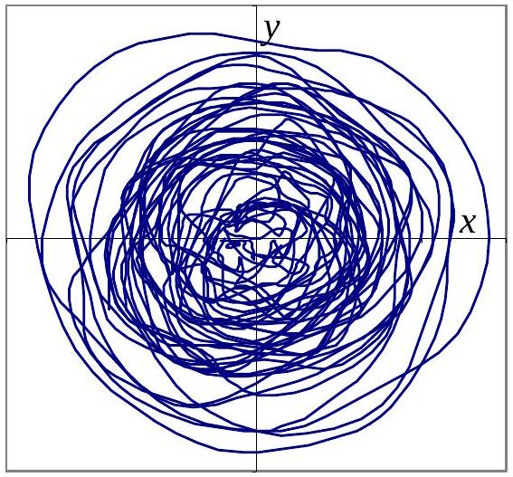
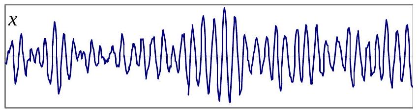
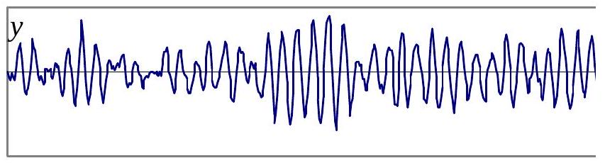

Системы, обладающие подобным поведением, мы рассмотрим в следующей главе, а сейчас решим многомерное линейное уравнение.

## 6.4 Линейные многомерные модели

- Найдём решение линейных стохастических уравнений (по $j$ - сумма):

$$
d x_{i}=A_{i j}\left(x_{j}-c_{j}\right) d t+B_{i j} \delta W_{j} .
$$

Постоянный вектор $c_{j}$ можно убрать сдвигом $x_{j} \rightarrow x_{j}+c_{j}$. В решении делается обратный сдвиг. Поэтому будем изучать однородное уравнение, которое запишем в матричной форме:

$$
d \mathbf{x}=\mathbf{A} \cdot \mathbf{x} d t+\mathbf{B} \cdot \delta \mathbf{W}
$$

где $\mathbf{A}$ и $\mathbf{B}$ - не зависящие от $\mathbf{x}$ и времени матрицы.
Для определения среднего проще всего сразу воспользоваться соотношением (6.16):

$$
\begin{equation*}
\dot{\overline{\mathbf{x}}}=\mathbf{A} \cdot \overline{\mathbf{x}} \quad=>\quad \overline{\mathbf{x}}=e^{\mathbf{A} t} \cdot \mathbf{x}_{0} \tag{6.20}
\end{equation*}
$$

где $\mathbf{x}_{0}$ - вектор начального значения. Если мы хотим "вернуть" с, то потребуются две замены: $\overline{\mathbf{x}} \rightarrow \overline{\mathbf{x}}-\mathbf{c}$ и $\mathbf{x}_{0} \rightarrow \mathbf{x}_{0}-\mathbf{c}$.

- Монотонная зависимость от $t$ в матричной записи решения (6.20) обманчива. Рассмотрим стохастический осциллятор из предыдущего раздела:

$$
\binom{d x}{d y}=\left(\begin{array}{cc}
-\lambda & -\omega  \tag{6.21}\\
\omega & -\lambda
\end{array}\right) \cdot\binom{x}{y}+\sigma\binom{\delta W_{x}}{\delta W_{y}} .
$$

В этом случае матрицу $\mathbf{A}$ можно разбить на сумму двух матриц:

$$
\mathbf{A}=\left(\begin{array}{cc}
-\lambda & -\omega \\
\omega & -\lambda
\end{array}\right)=\omega \mathbf{q}-\lambda \mathbf{1}, \quad \mathbf{1}=\left(\begin{array}{ll}
1 & 0 \\
0 & 1
\end{array}\right), \quad \mathbf{q}=\left(\begin{array}{cc}
0 & -1 \\
1 & 0
\end{array}\right)
$$

Несложно проверить, что:

$$
\mathbf{q}^{2}=-\mathbf{1}, \quad \mathbf{q}^{3}=-\mathbf{q}, \quad \mathbf{q}^{4}=\mathbf{1}, \quad \mathbf{q}^{5}=\mathbf{q}, \ldots
$$

Так как матрицы $\mathbf{1}$ и $\mathbf{q}$ коммутируют друг с другом $(\mathbf{q} \cdot \mathbf{1}=\mathbf{1} \cdot \mathbf{q})$, экспонента суммы разбивается на произведение $e^{\mathbf{A} t}=e^{-\mathbf{1} \lambda t} e^{\mathbf{q} \omega t}$. Раскладывая второй множитель по степеням $t$ и учитывая аналогичное разложение для синуса и косинуса, решение можно представить в следующем виде:

$$
\binom{\bar{x}}{\bar{y}}=e^{-\lambda t}\left(\begin{array}{cc}
\cos \omega t & -\sin \omega t  \tag{6.22}\\
\sin \omega t & \cos \omega t
\end{array}\right)\binom{x_{0}}{y_{0}} .
$$

Оно же выше было получено другим методом. Таким образом, "монотонная" зависимость от времени в матричных соотношениях вполне может превратиться в периодическую функцию.

- Найдём более практичное, чем (6.20), представление для решения линейного уравнения. Будем его искать в виде:

$$
\begin{equation*}
\overline{\mathbf{x}}(t)=\mathbf{u} e^{a t} \quad=>\quad \mathbf{A} \cdot \mathbf{u}=a \mathbf{u} \tag{6.23}
\end{equation*}
$$

Постоянный вектор $\mathbf{u}$ является собственным вектором матрицы $\mathbf{A}$, а параметр " $a$ "- её собственным значением. Перенося ( $a \mathbf{u}$ ) в левую часть, получаем систему однородных уравнений относительно $\mathbf{u}$, которая имеет ненулевое решение, только если её детерминант равен нулю:

$$
\operatorname{det}(\mathbf{A}-a \mathbf{1})=0 .
$$

Это уравнение называется характеристическим и является полиномом $n$-той степени по $a$. Обычно оно имеет $n$ различных решений $a_{1}, \ldots, a_{n}$. Часть из них может оказаться комплексными. Для каждого из них мы решаем уравнение (6.23) и находим собственные вектора $\mathbf{u}^{(k)}$. Внимание! Верхний индекс - это номер собственного вектора, а не его компонента.

Теперь общее решение для среднего значения вектора переменных состояния можно записать в следующем виде:

$$
\begin{equation*}
\overline{\mathbf{x}}(t)=\sum_{k} \mu_{k} \mathbf{u}^{(k)} e^{a_{k} t}, \quad \mathbf{x}_{0}=\sum_{k} \mu_{k} \mathbf{u}^{(k)}, \tag{6.24}
\end{equation*}
$$

где $\mu_{k}$ - произвольные константы, выражающиеся через начальные условия $\mathbf{x}_{0}=\mathbf{x}(0)$. Прямой подстановкой в исходное уравнение можно проверить справедливость этого решения. Действительная часть собственных значений $a_{k}$ будет приводить к экспоненциально уменьшающимся $\left(\boldsymbol{\operatorname { R e }} a_{k}<0\right)$ или увеличивающимся ( $\boldsymbol{\operatorname { R e }} a_{k}>0$ ) решениям. Мнимая часть соответствует колебательным режимам.
$Е с л и$ матрица А симметрична, то собственные вектора можно выбрать ортогональными: $\mathbf{u}^{(\alpha)} \cdot \mathbf{u}^{*(\beta)}=\delta_{\alpha \beta}$ (звёздочка - комплексное сопряжение). В этом случае $\mu_{k}=\mathbf{x}_{0} \cdot \mathbf{u}^{*(k)}$.

Когда $\mu_{k}$ выражены через $\mathbf{x}_{0}$, можно найти явное представление экспоненты от матрицы. Действительно, из (6.20), взяв производную по компонентам начального условия, имеем $\left[e^{\mathbf{A} t}\right]_{\alpha \beta}=\partial \bar{x}_{\alpha} / x_{0 \beta}$. В частности, если собственные вектора ортогональны ( $\mu_{k}=\mathbf{x}_{0} \cdot \mathbf{u}^{*(k)}$ ), то:

$$
\begin{equation*}
\left[e^{\mathbf{A} t}\right]_{\alpha \beta}=\sum_{k} u_{\alpha}^{(k)} u_{\beta}^{*(k)} e^{a_{k} t} \tag{6.25}
\end{equation*}
$$

В качестве упражнения ( $\lessdot \mathrm{H}_{33}$ ) предлагается найти $e^{\mathbf{A} t}$ для матрицы 2 x 2 , у которой $A_{12}=A_{22}=0$. Необходимо это сделать прямым разложением экспоненты при помощи собственных значений.

- Выразим теперь решение стохастической линейной системы через гауссовы переменные. Введём новый вектор $\mathbf{y}$, удовлетворяющий, по лемме Ито (6.13), стр. 157, следующему уравнению:

$$
\mathbf{y}=e^{-\mathbf{A} t} \cdot \mathbf{x} \quad=>\quad d \mathbf{y}=e^{-\mathbf{A} t} \mathbf{B} \delta \mathbf{W}=\mathbf{G}(t) \delta \mathbf{W} .
$$

Матрица $\mathbf{G}(t)=e^{-\mathbf{A} t} \mathbf{B}$ зависит только от времени, поэтому решение этого уравнения легко найти при помощи итерационного метода:

$$
y_{\mu}(t)=y_{\mu}\left(t_{0}\right)+\sum_{k} G_{\mu \alpha}\left(t_{k}\right) \varepsilon_{\alpha}\left(t_{k}\right) \sqrt{\Delta t}=y_{\mu}\left(t_{0}\right)+g_{\mu \alpha} \varepsilon_{\alpha} .
$$

Сумма независимых гауссовых чисел $\varepsilon_{\alpha}\left(t_{k}\right)$ снова пропорциональна гауссовому числу, которое удобно представить в виде суммы независимых величин $\varepsilon_{\alpha}$ (второе равенство). Найдём значения $g_{\mu \alpha}$. Для этого вычислим среднее от $\left\langle\left(y(t)-y\left(t_{0}\right)\right)_{\mu}\left(y(t)-y\left(t_{0}\right)\right)_{\nu}\right\rangle$ :

$$
g_{\mu \alpha} g_{\nu \beta}\left\langle\varepsilon_{\alpha} \varepsilon_{\beta}\right\rangle=\sum_{k, l} G_{\mu \alpha}\left(t_{k}\right) G_{\nu \beta}\left(t_{l}\right)\left\langle\varepsilon_{\alpha}\left(t_{k}\right) \varepsilon_{\beta}\left(t_{l}\right)\right\rangle \Delta t .
$$

Учитывая независимость случайных величин $\left\langle\varepsilon_{\alpha}\left(t_{k}\right) \varepsilon_{\beta}\left(t_{l}\right)\right\rangle=\delta_{\alpha, \beta} \delta_{k, l}$ и $\left\langle\varepsilon_{\alpha} \varepsilon_{\beta}\right\rangle=\delta_{\alpha, \beta}$, а также переходя к непрерывному пределу $\Delta t \rightarrow 0$, получаем ( $t_{0}=0$ ):

$$
g_{\mu \alpha} g_{\nu \alpha}=\sum_{i} G_{\mu \alpha}\left(t_{i}\right) G_{\nu \alpha}\left(t_{i}\right) \Delta t=\int_{0}^{t} G_{\mu \alpha}(\tau) G_{\nu \alpha}(\tau) d \tau
$$

или:

$$
\begin{equation*}
\mathbf{g}(t) \cdot \mathbf{g}^{T}(t)=\int_{0}^{t} e^{-\mathbf{A} \tau} \mathbf{B} \mathbf{B}^{T} e^{-\mathbf{A}^{T} \tau} d \tau \tag{6.26}
\end{equation*}
$$

Напомню, что $(\mathbf{A} \cdot \mathbf{B})^{T}=\mathbf{B}^{T} \cdot \mathbf{A}^{T}$ (см. стр. 304). Решение для у запишем в матричном виде, учитывая, что $\mathbf{y}_{0}=\mathbf{x}_{0}$ при $t=0$ :

$$
\mathbf{y}=\mathbf{x}_{0}+\mathbf{g}(t) \cdot \epsilon
$$

Поэтому, так как $\mathbf{x}=e^{\mathbf{A} t} \mathbf{y}$, окончательное решение системы линейных стохастических уравнений имеет вид:

$$
\begin{equation*}
\mathbf{x}(t)=\overline{\mathbf{x}}(t)+\mathbf{S}(t) \cdot \epsilon, \tag{6.27}
\end{equation*}
$$

где $\mathbf{S}=e^{\mathbf{A} t} \mathbf{g}$. Вектор $\epsilon=\left\{\varepsilon_{1}, \ldots, \varepsilon_{n}\right\}$ представляет собой набор независимых случайных чисел с гауссовым распределением, имеющим нулевое среднее и единичную дисперсию, а $\overline{\mathbf{x}}(t)$ - среднее значение (6.20), (6.24). В качестве упражнения ( $\lessdot \mathrm{H}_{34}$ ) предлагается найти матрицу $e^{\mathbf{A} t}$ для двухмерного осциллятора и проверить решение (6.27).

- Вычислим матрицу дисперсий:
$D_{\alpha \beta}=\left\langle(x-\bar{x})_{\alpha}(x-\bar{x})_{\beta}\right\rangle=S_{\alpha i} S_{\beta j}\left\langle\varepsilon_{i} \varepsilon_{j}\right\rangle=\left[\mathbf{S S}^{T}\right]_{\alpha \beta}=\left[e^{\mathbf{A} t} \mathbf{g} \mathbf{g}^{T} e^{\mathbf{A}^{T} t}\right]_{\alpha \beta}$.
Учитывая (6.26), имеем:

$$
\begin{equation*}
\mathbf{D}(t)=\mathbf{S} \mathbf{S}^{T}=\int_{0}^{t} e^{\mathbf{A}(t-\tau)} \mathbf{B} \mathbf{B}^{T} e^{\mathbf{A}^{T}(t-\tau)} d \tau \tag{6.28}
\end{equation*}
$$

Это соотношение можно ( $\lessdot \mathrm{H}_{38}$ ) сразу получить из уравнения для средних (6.17), стр. 159, из которых следует матричное уравнение:

$$
\begin{equation*}
\dot{\mathbf{D}}=\mathbf{A} \cdot \mathbf{D}+\mathbf{D} \cdot \mathbf{A}^{T}+\mathbf{B} \cdot \mathbf{B}^{T} . \tag{6.29}
\end{equation*}
$$

Если существует стационарный режим, то $\dot{\mathbf{D}}=0$ и уравнение (6.29) позволяет легко найти $\mathbf{D}$.

- Распределение для $x$ имеет гауссовый вид, поэтому, зная матрицу дисперсий, можно записать марковскую плотность вероятности:

$$
P\left(\mathbf{x}_{0}, 0 \Rightarrow \mathbf{x}, t\right)=\frac{1}{(2 \pi)^{n / 2} \sqrt{\operatorname{det} \mathbf{D}(t)}} \exp \left[-\frac{1}{2}(x-\bar{x})_{\alpha} D_{\alpha \beta}^{-1}(t)(x-\bar{x})_{\beta}\right]
$$

где $\mathbf{D}^{-1}$ - обратная матрица дисперсий и $\overline{\mathbf{x}}=\overline{\mathbf{x}}(t)-$ средние значения динамических переменных. Они полностью определяют свойства процесса. В частности, характеристическая функция ( $\lessdot \mathrm{H}_{35}$ ):

$$
\left\langle e^{\imath \mathbf{p} \cdot \mathbf{x}}\right\rangle=e^{\imath \mathbf{p} \cdot \overline{\mathbf{x}}-\frac{1}{2} \mathbf{p} \cdot \mathbf{D} \cdot \mathbf{p}}
$$

позволяет легко находить моменты произвольных порядков.

- При помощи (6.27), (6.28) несложно ( ⟵ $\mathrm{H}_{39}$ ) найти ковариационную матрицу:

$$
\begin{equation*}
\operatorname{cov}_{\alpha \beta}(t, t+\tau)=\left\langle x_{\alpha}(t) x_{\beta}(t+\tau)\right\rangle-\left\langle x_{\alpha}(t)\right\rangle\left\langle x_{\beta}(t+\tau)\right\rangle=\mathbf{D}(t) e^{\mathbf{A}^{T} \tau} \tag{6.30}
\end{equation*}
$$

Если в пределе $t \rightarrow \infty$ у системы существует стационарный режим, то в этом случае матрица дисперсий $\mathbf{D}$ становится постоянной, а ковариация зависит только от разности времён $\tau$.

- Таким образом, алгоритм решения линейной задачи следующий:

□ Находим собственные значения и вектора матрицы А.
□ Записываем решение для средних (6.24) и выражаем $\mu_{k}$ через $\mathbf{x}_{0}$.
△ При помощи соотношения $\left[e^{\mathbf{A} t}\right]_{\alpha \beta}=\partial \bar{x}_{\alpha} / x_{0 \beta}$ находим $e^{\mathbf{A} t}$.

- Вычисляем матрицу дисперсий $D_{\alpha \beta}$.


## 6.5 Многомерие помогает одномерию

- Рассмотрим построение решения одномерного уравнения при помощи стохастического интеграла. Пусть у нас есть система уравнений $n \times 1$ с одинаковым шумом $d x_{\alpha}=a_{\alpha} d t+b_{\alpha} \delta W$. Для произвольной функции $F=F(t, \mathbf{x})$ в этом случае справедлива следующая версия леммы Ито (6.12), стр. 157 (суммирование по повторяющимся индексам):

$$
d F=\left[\frac{\partial F}{\partial t}+a_{\alpha} \frac{\partial F}{\partial x_{\alpha}}+\frac{b_{\alpha} b_{\beta}}{2} \frac{\partial^{2} F}{\partial x_{\alpha} \partial x_{\beta}}\right] d t+b_{\alpha} \frac{\partial F}{\partial x_{\alpha}} \delta W
$$

Пусть $\mathbf{x}=\{x, W\}$, где $x=x(t)$ - решение некоторого одномерного стохастического уравнения $d x=a(x) d t+b(x) \delta W$, а $W$ - порождающий винеровский процесс с нулевым сносом и единичной волатильностью. В этом случае лемма Ито для функции $F=F(t, x, W)$ имеет вид:
$d F=\left[\frac{\partial F}{\partial t}+a \frac{\partial F}{\partial x}+\frac{b^{2}}{2} \frac{\partial^{2} F}{\partial x^{2}}+b \frac{\partial^{2} F}{\partial x \partial W}+\frac{1}{2} \frac{\partial^{2} F}{\partial W^{2}}\right] d t+\left[b \frac{\partial F}{\partial x}+\frac{\partial F}{\partial W}\right] \delta W$. Всегда подходящим выбором $F$ :

$$
F(t, x, W)=f(t, z)=f\left(t, \int \frac{d x}{b(x)}-W\right)
$$

можно ( $\lessdot \mathrm{H}_{41}$ ) волатильность (множителя при $\delta W$ ) сделать равной нулю. Подставляя $F=f(t, z)$ в лемму Ито, получаем:

$$
d f=\left(\frac{\partial f}{\partial t}+\left[\frac{a(x)}{b(x)}-\frac{b^{\prime}(x)}{2}\right] \frac{\partial f}{\partial z}\right) d t
$$

Если выбором функции $f$ удаётся добиться, чтобы множитель при $d t$ зависел только от $t$ и $W$, то это уравнение можно проинтегрировать, выразив решение в явном виде через порождающий винеровский процесс $W_{t}$. Так как множитель при $d t$ не должен зависеть от $x$, то частная производная по $x$ равна нулю, и мы получаем следующее уравнение:

$$
\frac{\partial^{2} f}{\partial t \partial z}+\left[\frac{a(x)}{b(x)}-\frac{b^{\prime}(x)}{2}\right] \frac{\partial^{2} f}{\partial z^{2}}+b(x)\left[\frac{a(x)}{b(x)}-\frac{b^{\prime}(x)}{2}\right]^{\prime} \frac{\partial f}{\partial z}=0
$$

Это уравнение допускает разделение переменных $f(t, z)=e^{\lambda t} f(z)$ :

$$
\lambda+\left[\frac{a(x)}{b(x)}-\frac{b^{\prime}(x)}{2}\right] \mu+b(x)\left[\frac{a(x)}{b(x)}-\frac{b^{\prime}(x)}{2}\right]^{\prime}=0
$$

где $\lambda, \mu$ - некоторые константы, которые необходимо подобрать так, чтобы это соотношение обращалось в тождество. Тогда $f(t, z)=e^{\lambda t+\mu z}$.

- Рассмотрим в качестве примера логистическое уравнение (стр. 88):

$$
\begin{equation*}
d x=x \cdot(1-x) d t+\sqrt{2 \gamma} x \delta W \tag{6.31}
\end{equation*}
$$

Несложно проверить, что $\mu=-\sqrt{2 \gamma}, \lambda=1-\gamma, F=e^{(1-\gamma) t+\sqrt{2 \gamma} W_{t}} / x$,

$$
d F=e^{(1-\gamma) t+\sqrt{2 \gamma} W_{t}} d t \quad=>\quad F=\frac{1}{x_{0}}+\int_{0}^{t} e^{(1-\gamma) \tau+\sqrt{2 \gamma} W_{\tau}} d \tau
$$

где при интегрировании учтено начальное условие $F_{0}=F(0)=1 / x_{0}$, и $x_{0}=x(0)$. Поэтому решение (6.31) можно записать в следующем виде:

$$
\begin{equation*}
x(t)=x_{0} e^{(1-\gamma) t+\sqrt{2 \gamma} W_{t}}\left[1+x_{0} \int_{0}^{t} e^{(1-\gamma) \tau+\sqrt{2 \gamma} W_{\tau}} d \tau\right]^{-1} \tag{6.32}
\end{equation*}
$$

Замкнутая форма (6.32) может быть полезна при построении приближённых методов, однако, к сожалению, получить с её помощью конкретные результаты (например, среднее $\bar{x}(t)$ ), вообще говоря, не просто.

- Простое интегральное представление для решения имеет также линейное по $x$ стохастическое уравнение:

$$
d x=(\alpha+\beta x) d t+\sigma x \delta W
$$

В этом случае $\mu=\sigma, \lambda=\left(\sigma^{2} / 2\right)-\beta$, и для процесса $y=x e^{-\left(\beta-\sigma^{2} / 2\right) t-\sigma W_{t}}$ получаем уравнение:

$$
d y=\alpha e^{-\left(\beta-\sigma^{2} / 2\right) t-\sigma W_{t}} d t
$$

Поэтому решение выражается через стохастический интеграл:

$$
x(t)=e^{\left(\beta-\sigma^{2} / 2\right) t+\sigma W_{t}}\left[x_{0}+\alpha \int_{0}^{t} e^{-\left(\beta-\sigma^{2} / 2\right) s-\sigma W_{s}} d s\right]
$$

который позволяет вычислять средние:

$$
\langle x(t)\rangle=x_{0}\left\langle e^{\left(\beta-\sigma^{2} / 2\right) t+\sigma \varepsilon \sqrt{t}}\right\rangle+\alpha\left\langle e^{\left(\beta-\sigma^{2} / 2\right) t+\sigma W_{t}} \int_{0}^{t} e^{-\left(\beta-\sigma^{2} / 2\right) s-\sigma W_{s}} d s\right\rangle
$$

Первое среднее вычисляется обычным образом, а для второго необходимо использовать формулу (5.7), стр. 129:

$$
\langle x(t)\rangle=x_{0} e^{\beta t}+\alpha \int_{0}^{t}\left\langle e^{\left(\beta-\sigma^{2} / 2\right) t+\sigma\left(\varepsilon_{1} \sqrt{s}+\varepsilon_{2} \sqrt{t-s}\right)} e^{-\left(\beta-\sigma^{2} / 2\right) s-\sigma \varepsilon_{1} \sqrt{s}}\right\rangle d s
$$

или $\langle x(t)\rangle=x_{0} e^{\beta t}+\frac{\alpha}{\beta}\left(e^{\beta t}-1\right)$. Заметим, что $\langle x(t)\rangle$ в данном случае проще найти при помощи динамических уравнений для средних.

- Иногда многомерные системы позволяют находить точные решения одномерных стохастических уравнений. Рассмотрим блуждание в $n$-мерном пространстве, считая, что по каждой координате реализуется процесс Орнштейна-Уленбека с нулевым равновесным уровнем и одинаковым притяжением к нему:

$$
d x_{i}=-\frac{\beta}{2} x_{i} d t+\frac{\sigma}{2} \delta W_{i} .
$$

Блуждания предполагаются нескоррелированными, с одной волатильностью шума. Рассмотрим случайный процесс, равный квадрату радиусвектора $y(t)=x_{1}^{2}+\ldots+x_{n}^{2}$. Найдём стохастическое уравнение, которому он подчиняется. В данном случае $a_{i}=-\beta x_{i} / 2, b_{i j}=\sigma \delta_{i j} / 2$. Производные от $y$ равны $\partial y / \partial x_{i}=2 x_{i}, \partial^{2} y / \partial x_{i} \partial x_{j}=2 \delta_{i j}$, и по лемме Ито (6.12), стр. 157 имеем следующее уравнение:

$$
d y=-\beta \cdot\left(y-\frac{n \sigma^{2}}{4 \beta}\right) d t+\sigma x_{i} \delta W_{i}
$$

Сумму стохастических членов в этом уравнении можно выразить через единственную винеровскую переменную:

$$
\omega_{i} \delta W_{i}=\omega_{i} \varepsilon_{i} \sqrt{d t}=\varepsilon \sqrt{d t}=\delta W,
$$

где $\omega_{i}=x_{i} / \sqrt{y}$. Действительно, сумма гауссовых чисел снова даёт гауссово число, и, так как $\omega_{1}^{2}+\ldots+\omega_{n}^{2}=1$, оно имеет единичную дисперсию. Вообще говоря, величины $\omega_{i}(t)$ являются случайными функциями. Однако на каждом шаге итерационного решения они принимают определённое значение, но так, что сумма их квадратов всегда равна единице. Поэтому мы и переходим в уравнении к скалярной винеровской переменной $\delta W$.

В результате получается одномерное уравнение Феллера:

$$
d y=-\beta \cdot(y-\alpha) d t+\sigma \sqrt{y} \delta W,
$$

с равновесным уровнем, равным $\alpha=n \sigma^{2} / 4 \beta$. Его решение выражается через известные нам случайные процессы Орнштейна-Уленбека (стр. 60):

$$
x_{i}(t)=x_{0 i} e^{-\beta t / 2}+\frac{\sigma}{2 \sqrt{\beta}} \sqrt{1-e^{-\beta t}} \varepsilon_{i}
$$

и $n$ независимых гауссовых величин $\left\{\varepsilon_{1}, \ldots, \varepsilon_{n}\right\}$.

- Решение одномерного уравнения должно зависеть от одной константы начального условия $y_{0}=y(0)$. В полученное решение входит $n$ независимых констант $x_{0 i}$, соответствующих начальным условиям по каждой координате. Покажем, что они, тем не менее, "сворачиваются" в единственную константу $y_{0}=x_{01}^{2}+\ldots+x_{0 n}^{2}$. Для этого запишем решение в следующем виде:

$$
y(t)=\sum_{i=1}^{n}\left(x_{0 i} \mu(t)+\frac{1}{\sqrt{2}} s(t) \varepsilon_{i}\right)^{2}=y_{0} \mu^{2}(t)+\sqrt{2 y_{0}} s(t) \mu(t) \varepsilon+s^{2}(t) u
$$

где $\mu(t)=e^{-\beta t / 2}, s(t)=\sqrt{\gamma\left(1-e^{-\beta t}\right)}, \gamma=\sigma^{2} / 2 \beta$ и введены две новые случайные величины $\varepsilon$ и $u$ :

$$
\varepsilon=\sum_{i=1}^{n} \omega_{i} \varepsilon_{i}, \quad u=\frac{1}{2} \sum_{i=1}^{n} \varepsilon_{i}^{2}, \quad \sum_{i=1}^{n} \omega_{i}^{2}=1 .
$$

Сумма квадратов "весов" $\omega_{i}=x_{0 i} / \sqrt{y_{0}}$ равна единице. Поэтому величина $\varepsilon$ имеет гауссово распределение с нулевым средним и единичной дисперсией, а $u$ подчиняется $\chi^{2}$-распределению с $n$ степенями свободы ( ← $\mathrm{C}_{26}$ ). Так как обе эти величины зависят от одних и тех же гауссовых чисел $\varepsilon_{1}, \ldots, \varepsilon_{n}$, они не являются независимыми. Однако их совместная плотность вероятностей не зависит от весов $\omega_{i}$, и, следовательно, от констант начального условия $x_{0 i}$. Действительно, найдём производящую функцию:

$$
\begin{equation*}
\phi(k, p)=\left\langle e^{k \varepsilon+p u}\right\rangle=\prod_{i=1}^{n} \int_{\infty}^{\infty} e^{k \omega_{i} \varepsilon_{i}+p \frac{\varepsilon_{i}^{2}}{2}-\frac{\varepsilon_{i}^{2}}{2}} \frac{d \varepsilon_{i}}{\sqrt{2 \pi}}=\frac{e^{\frac{k^{2} / 2}{1-p}}}{(1-p)^{n / 2}} \tag{6.33}
\end{equation*}
$$

Введение мнимой единицы $k \rightarrow \imath k, p \rightarrow \imath p$ превращает производящую функцию в характеристическую, фурье-интеграл от которой равен плотности вероятности $P(\varepsilon, u)$. Разложение в ряд по $k$ и $p$ производящей функции позволяет легко найти различные средние для случайных величин $\varepsilon$ и $u$.

Подобное представление было получено в третьей главе при изучении процесса Феллера (стр. 82). Несмотря на то, что мы начали с $n$ процессов Орнштейна-Уленбека, целочисленный параметр $n$ в решении можно аналитически продолжить в область непрерывных значений $n=2 \alpha / \gamma$.

Таким образом, процесс $y(t)$ зависит от единственной константы начального условия $y_{0}=y(0)$ и двух случайных величин $\varepsilon$ и $u$, имеющих совместное распределение (6.33).

## 6.6 Некоторые точные решения *

- Рассмотрим нестационарное многомерное стохастическое уравнение:

$$
\begin{equation*}
d x_{i}=f_{i}(t) d t+s_{i \alpha}(t) \delta W_{\alpha} \tag{6.34}
\end{equation*}
$$

При его решении итерациями получатся ряды следующего вида:
$x_{i}(t)=x_{i}\left(t_{0}\right)+\left[f_{i}\left(t_{0}\right)+f_{i}\left(t_{1}\right)+\ldots\right] \Delta t+\left[s_{i \alpha}\left(t_{0}\right) \varepsilon_{\alpha}\left(t_{0}\right)+s_{i \alpha}\left(t_{1}\right) \varepsilon_{\alpha}\left(t_{1}\right)+\ldots\right] \sqrt{\Delta t}$.
Последний член является суммой независимых гауссовых случайных чисел. Поэтому решение (6.34) можно записать следующим образом:

$$
\begin{equation*}
x_{i}(t)=\bar{x}_{i}(t)+S_{i \alpha}(t) \varepsilon_{\alpha}, \tag{6.35}
\end{equation*}
$$

где по $\alpha$ по-прежнему производится суммирование, и

$$
\bar{x}_{i}(t)=x_{i}\left(t_{0}\right)+\int_{t_{0}}^{t} f_{i}(\tau) d \tau, \quad D_{i j}=S_{i \alpha} S_{j \alpha}=\int_{t_{0}}^{t} s_{i \alpha}(\tau) s_{j \alpha}(\tau) d \tau
$$

Явный вид матричной функции $S_{i \alpha}(t)$ обычно не требуется. Нестационарное гауссово блуждание полностью определяется вектором средних значений $\bar{x}_{i}(t)$ и симметричной матрицей дисперсий:

$$
\mathbf{D}=D_{i j}=\left\langle\left(x_{i}-\bar{x}_{i}\right)\left(x_{j}-\bar{x}_{j}\right)\right\rangle=\int_{t_{0}}^{t} s_{i \alpha}(\tau) s_{j \alpha}(\tau) d \tau=\int_{t_{0}}^{t} \mathbf{s}(\tau) \cdot \mathbf{s}^{T}(\tau) d \tau
$$

Через них выражается производящая функция для средних (действительный аналог характеристической функции):

$$
\phi(\mathbf{p})=\left\langle e^{\mathbf{p} \cdot \mathbf{x}}\right\rangle=e^{\mathbf{p} \cdot \overline{\mathbf{x}}}\left\langle e^{\mathbf{p} \cdot \mathbf{S} \cdot \epsilon}\right\rangle=e^{\mathbf{p} \cdot \overline{\mathbf{x}}+\frac{1}{2} \mathbf{p} \cdot \mathbf{D} \cdot \mathbf{p}}
$$

Усреднение проводится покомпонентно для каждого гауссового числа $\epsilon= \left\{\varepsilon_{1}, \ldots, \varepsilon_{n}\right\}$ при помощи формулы (1.11), стр. 16.

Моменты произвольного порядка находятся взятием частных производных от $\phi(\mathbf{p})$. Например, для:

$$
e_{i j k l}=\left\langle\left(x_{i}-\bar{x}_{i}\right)\left(x_{j}-\bar{x}_{j}\right)\left(x_{k}-\bar{x}_{k}\right)\left(x_{l}-\bar{x}_{l}\right)\right\rangle=\left.\frac{\partial \phi(\mathbf{p})}{\partial p_{i} \partial p_{j} \partial p_{k} \partial p_{l}}\right|_{\mathbf{p}=0}
$$

получаем:

$$
e_{i j k l}=D_{i j} D_{k l}+D_{i k} D_{j l}+D_{i l} D_{j k} .
$$

Заметим, что это выражение автоматически симметрично по всем четырем индексам.

- Изменения цен различных финансовых инструментов (например, акций) обычно скоррелированы друг с другом. Простейшей моделью является многомерное логарифмическое блуждание. В этом случае относителъное изменение цены - это $n$-мерный винеровский процесс:

$$
\frac{d x_{i}}{x_{i}}=\mu_{i} d t+\sum_{j=1}^{n} \sigma_{i j} \delta W_{j}
$$

(!) Сейчас мы используем явное обозначение для суммы, а не соглашение о суммировании по повторяющимся индексам.

Дисперсия относительных изменений двух акций выражается через матрицу $\sigma_{i j}$. Действительно, для небольшого интервала времени $\Delta t$, представив $\delta W_{j}=\varepsilon_{j} \sqrt{\Delta t}$, имеем:

$$
\left\langle\left(\frac{\Delta x_{i}}{x_{i}}-\mu_{i} \Delta t\right)\left(\frac{\Delta x_{j}}{x_{j}}-\mu_{j} \Delta t\right)\right\rangle=\sum_{k, l=1}^{n} \sigma_{i k} \sigma_{j l}\left\langle\varepsilon_{k} \varepsilon_{l}\right\rangle \Delta t=\sum_{k=1}^{n} \sigma_{i k} \sigma_{j k} \Delta t .
$$

Для получения решения перейдём, как и в одномерном случае, к натуральному логарифму от $x_{i}$. Тогда по лемме Ито имеем:

$$
d \ln x_{i}=\left(\mu_{i}-\frac{1}{2} \sum_{j=1}^{n} \sigma_{i j}^{2}\right) d t+\sum_{j=1}^{n} \sigma_{i j} \delta W_{j}
$$

Решение этого уравнения с начальным условием $x_{0 i}=x_{i}(0)$, выраженное через гауссовы переменные, имеет вид:

$$
x_{i}(t)=x_{0 i} \exp \left\{\left(\mu_{i}-\frac{1}{2} \sum_{j=1}^{n} \sigma_{i j}^{2}\right) t+\sum_{j=1}^{n} \sigma_{i j} \varepsilon_{j} \sqrt{t}\right\} .
$$

Среднее значение экспоненциально изменяется со скоростью, определяемой параметром $\mu_{i}$ :

$$
\left\langle x_{i}(t)\right\rangle=x_{0 i} e^{\mu_{i} t}
$$

Аналогично, среднее значение квадрата имеет вид:

$$
\left\langle x_{i}^{2}(t)\right\rangle=x_{0 i}^{2} \exp \left\{2 \mu_{i} t+\sum_{j=1}^{n} \sigma_{i j}^{2} t\right\}
$$

Более подробно к вопросу стохастического описания финансовых рынков мы вернёмся в восьмой главе.

- Как и в одномерном случае, некоторую систему стохастических уравнений можно попытаться свести к простому нестационарному случаю. Для этого подберём такую векторную функцию $\mathbf{F}=F_{k}(\mathbf{x}, t)$, которая "убирает" х из уравнения (по повторяющимся индексам снова предполагается суммирование):

$$
d F_{k}=\underbrace{\left(\frac{\partial F_{k}}{\partial t}+\frac{\partial F_{k}}{\partial x_{\gamma}} a_{\gamma}+\frac{1}{2} \frac{\partial^{2} F_{k}}{\partial x_{i} \partial x_{j}} b_{i \alpha} b_{j \alpha}\right)}_{f_{k}(t)} d t+\underbrace{\frac{\partial F_{k}}{\partial x_{i}} b_{i \alpha}}_{s_{k \alpha}(t)} \delta W_{\alpha}
$$

Пусть $b_{i \alpha}^{-1}$ - обратная к $b_{i \alpha}$ матрица. Тогда для функций волатильности $s_{k \alpha}(t)$ можно записать:

$$
\begin{equation*}
\frac{\partial F_{k}}{\partial x_{i}} b_{i \alpha}=s_{k \alpha}(t) \quad=>\quad \frac{\partial F_{k}}{\partial x_{i}}=s_{k \alpha}(t) b_{\alpha i}^{-1} \tag{6.36}
\end{equation*}
$$

Для нестационарного сноса $f_{k}(t)$ :

$$
\begin{equation*}
f_{k}(t)=\frac{\partial F_{k}}{\partial t}+s_{k \alpha} b_{\alpha \gamma}^{-1} a_{\gamma}-\frac{1}{2} s_{k \alpha} b_{\alpha \gamma}^{-1} \frac{\partial b_{\gamma \beta}}{\partial x_{j}} b_{j \beta} \tag{6.37}
\end{equation*}
$$

где мы подставили (6.36) и воспользовались соотношением:

$$
\frac{\partial \mathbf{b}^{-1}}{\partial x_{j}}=-\mathbf{b}^{-1} \cdot \frac{\partial \mathbf{b}}{\partial x_{j}} \cdot \mathbf{b}^{-1}
$$

которое получается дифференцированием $\mathbf{b}^{-1} \cdot \mathbf{b}=\mathbf{1}$ по $x_{j}$.
Возьмём производную выражения (6.36) по $t$ и производную по $x_{i}$ от (6.37). Вычитая их, получаем условие совместности в следующем виде:

$$
\begin{equation*}
\frac{\partial}{\partial t}\left[s_{k \alpha}(t) b_{\alpha i}^{-1}\right]+s_{k \alpha}(t) \frac{\partial}{\partial x_{i}}\left[b_{\alpha \gamma}^{-1}\left(a_{\gamma}-\frac{1}{2} \frac{\partial b_{\gamma \beta}}{\partial x_{j}} b_{j \beta}\right)\right]=0 . \tag{6.38}
\end{equation*}
$$

Как и в одномерном случае, если при данных $a_{i}(\mathbf{x}, t)$ и $b_{i j}(\mathbf{x}, t)$ удаётся подобрать такие функции времени $s_{k \alpha}(t)$, что (6.38) обращается в тождество, то решение стохастического уравнения записывается в неявном виде:

$$
\begin{equation*}
F_{k}(\mathbf{x}(t), t)=F_{k}\left(\mathbf{x}_{0}, t_{0}\right)+\int_{t_{0}}^{t} f_{k}(\tau) d \tau+S_{i \alpha}(t) \varepsilon_{\alpha} \tag{6.39}
\end{equation*}
$$

где $\varepsilon_{\alpha}$ - нормированные независимые гауссовы случайные числа, а

$$
S_{i \alpha}(t) S_{j \alpha}(t)=\int_{t_{0}}^{t} s_{i \alpha}(\tau) s_{j \alpha}(\tau) d \tau
$$

Приведём пример использования этого алгоритма.

- Для системы линейных уравнений с постоянной матрицей $\mathbf{A}$ и зависящими от времени вектором $\mathbf{c}(t)$ и матрицей $\mathbf{B}(t)$ :

$$
d x_{i}=\left[A_{i j} x_{j}+c_{j}(t)\right] d t+B_{i j}(t) \delta W_{j}
$$

условие совместности (6.38) и его решение имеют вид:

$$
\frac{d}{d t}\left(\mathbf{s} \cdot \mathbf{B}^{-1}\right)=-\left(\mathbf{s} \cdot \mathbf{B}^{-1}\right) \cdot \mathbf{A} \quad=>\quad \mathbf{s}(t)=\mathbf{s}\left(t_{0}\right) \cdot \mathbf{B}^{-1}\left(t_{0}\right) \cdot e^{-\mathbf{A} t} \cdot \mathbf{B}(t)
$$

При использовании алгоритма поиска точного решения нам достаточно найти частное решение условия совместности, так как фактически мы ищем наиболее простую замену $\mathbf{F}(\mathbf{x}, t)$, приводящую исходное уравнение к нестационарному винеровскому процессу (6.34). Поэтому выберем начальное условие для матрицы $\mathbf{s}$ в следующем виде $\mathbf{s}\left(t_{0}\right)=\mathbf{B}\left(t_{0}\right)$ и, следовательно:

$$
\mathbf{s}(t)=e^{-\mathbf{A} t} \cdot \mathbf{B}(t)
$$

В результате функции замены $\mathbf{F}(\mathbf{x}, t)$ (6.36) и сноса $\mathbf{f}(t)$ (6.37) равны:

$$
\mathbf{F}(\mathbf{x}, t)=e^{-\mathbf{A} t} \cdot \mathbf{x}, \quad \mathbf{f}(t)=e^{-\mathbf{A} t} \cdot \mathbf{c}(t)
$$

Окончательное решение является нестационарным гауссовым процессом:

$$
\mathbf{x}(t)=e^{\mathbf{A}\left(t-t_{0}\right)} \mathbf{x}_{0}+\int_{t_{0}}^{t} e^{\mathbf{A} \cdot(t-\tau)} \cdot \mathbf{c}(\tau) d \tau+\mathbf{G} \cdot \epsilon
$$

где $\mathbf{x}_{0}=\mathbf{x}\left(t_{0}\right)$ - начальное условие. Матрица $\mathbf{G}=e^{\mathbf{A} t} \cdot \mathbf{S}(t)$ удовлетворяет соотношению, определяющему матрицу дисперсии процесса:

$$
\mathbf{D}=\mathbf{G} \cdot \mathbf{G}^{T}=e^{\mathbf{A} t} \cdot \int_{t_{0}}^{t} \mathbf{s s}^{T} d \tau \cdot e^{\mathbf{A}^{T} t}=\int_{t_{0}}^{t} e^{\mathbf{A}(t-\tau)} \cdot \mathbf{B}(\tau) \mathbf{B}^{T}(\tau) \cdot e^{\mathbf{A}^{T}(t-\tau)} d \tau
$$

Если $\mathbf{c}=0$, а $\mathbf{B}$ является постоянной матрицей, то эти формулы совпадают с результатами, полученными в предыдущем разделе.

В случае, когда матрица $\mathbf{A}$ зависит от времени, вместо $e^{-\mathbf{A} t}$ необходимо использовать матрицу $\boldsymbol{\Phi}(t)$, удовлетворяющую уравнению $\dot{\boldsymbol{\Phi}}(t)= -\boldsymbol{\Phi}(t) \cdot \mathbf{A}(t)$. Явный вид $\boldsymbol{\Phi}(t)$ можно выразить через $\mathbf{A}(t)$, однако для этого необходимы специальные обозначения, упорядочивающие матрицы, так как интеграл от матрицы $\mathbf{A}(\tau)$ по интервалу $\left[t_{0}, \ldots, t\right]$ в общем случая не коммутирует с матрицей $\mathbf{A}(t)$ в момент времени $t$.

## 6.7 Как решать стохастические задачи?

Подведём итоги рассмотренных выше методов анализа стохастических задач. Основными математическими инструментами описания эволюции системы, при воздействии на неё случайных факторов, являются стохастическое дифференциальное уравнение и уравнение Фоккера-Планка. Обычно именно стохастическое уравнение будет исходным, так как оно оперирует терминами изменения наблюдаемых переменных состояния системы (координата, импульс, количество особей, цена и т.п.). Часто стохастическое дифференциальное уравнение является естественным обобщением уже известного детерминированного уравнения эволюции системы, к которому добавляется член шумового воздействия, пропорциональный $\delta \mathbf{W}$.

Функции сноса и волатильности стохастического уравнения вместе с начальными и граничными условиями полностью задают изучаемую систему. В качестве начальных условий может быть выбрано конкретное значение переменных состояния $\mathbf{x}_{0}$ в момент времени $t_{0}$, или некоторая их плотность вероятности $P\left(\mathbf{x}_{0}\right)$. Знание сноса и волатильности позволяет легко записать уравнение Фоккера-Планка, которое обычно оказывается более удобным при наличии граничных условий.

Когда стохастическое описание применяется к реальной (естественной или искусственной) системе, важно понимать порядок значений параметров, входящих в функции сноса и волатильности. Возможно, некоторыми членами в уравнении можно пренебречь или рассматривать их как поправки к более простому уравнению. Аналогичным образом, необходимо понимать, является ли стохастика ведущим приближением в уравнении или небольшим возмущением детерминированного случая.

Часто при помощи скейлинговых замен $x \rightarrow \alpha x$ и $t \rightarrow \beta t$ и соответствующего выбора констант $\alpha$ и $\beta$ можно уменьшить число значимых параметров системы, сведя их к размерным величинам, характеризующим типичные масштабы времени и переменные состояния.

Полным решением стохастической задачи является марковская плотность вероятности $P\left(\mathbf{x}_{0}, t_{0} \Rightarrow \mathbf{x}, t\right)$. Она может быть задана в виде решения стохастического уравнения $x=f(t, \varepsilon)$, выраженного через скалярную случайную переменную $\varepsilon$, или в явном виде, как функция, удовлетворяющая уравнению Фоккера - Планка. Знание плотности вероятности позволяет находить различные интегральные величины - среднее значение, волатильность, автоковариацию и т.п. Иногда именно они интересуют исследователя, а не полная плотность вероятности.

Перечислим некоторые приёмы, позволяющие получить информацию об изучаемой стохастической системе

△ Если задача допускает точное решение, то иногда его можно найти непосредственно из стохастического уравнения. Для этого служит алгоритм на стр. 57 .

△ При помощи формулы Ито и подходящей замены функций можно попытаться свести исходное уравнение к другому, точное или приближённое решение которого получить проще. В частности, всегда возможно изменить функциональную зависимость волатильности шума, изменяя при этом, естественно, и снос уравнения

- Если система при длительной эволюции выходит на стационарное решение, то его удобно получать при помощи стационарного уравнения Фоккера - Планка. Для одномерных задач при этом достаточно решить обыкновенное дифференциальное уравнение, которое обычно легко интегрируется. Стационарная плотность вероятности позволяет вычислить асимптотические средние значения наблюдаемых величин.
- При помощи динамических уравнений для средних можно получать важные соотношения между наблюдаемыми величинами. Иногда удаётся найти явное изменение во времени или стационарное решение, когда все или часть средних величин перестала изменяться. В последнем случае можно получить промежуточное между стационарным и динамическим решением. При этом одни переменные состояния являются константами, а эволюция других в этом пределе упрощается.

△ Выявление особых точек, в которых снос обращается в ноль, и линеаризация уравнений в их окрестности даёт важную качественную информацию о характере решений (см. ниже). При этом необходимо провести анализ возможных бифуркаций системы при изменении значений её параметров. Вообще, решение детерминированного уравнения обычно должно предшествовать анализу более сложной стохастической задачи.

- Если в задаче есть граничные условия, то плотность вероятности можно представить в виде ряда по ортогональному базису собственных функций (стр. 116).
- Естественно, многие практически интересные задачи не позволяют получить точного решения. В этом случае на помощь приходят приближенные или численные методы, которые мы рассмотрим в девятой главе.
- Как и в детерминированном, случае важно уметь понимать характер поведения решения системы стохастических уравнений, не решая их непосредственно. Рассмотрим в качестве примера двумерную задачу с уравнениями:

$$
\begin{aligned}
& d x=f(x, y) d t+\sigma_{1 \alpha}(x, y) \delta W_{\alpha} \\
& d y=g(x, y) d t+\sigma_{2 \alpha}(x, y) \delta W_{\alpha} .
\end{aligned}
$$

По индексу $\alpha$ предполагается суммирование от единицы до двух, а компоненты вектора $\delta W_{\alpha}=\left\{\delta W_{x}, \delta W_{y}\right\}$ являются независимыми бесконечно малыми изменениями винеровского процесса.

Предположим, что в некоторой точке $x_{0}, y_{0}$ сносы обоих уравнений обращаются в ноль:

$$
f\left(x_{0}, y_{0}\right)=g\left(x_{0}, y_{0}\right)=0
$$

Такая точка называется особой. Имеет смысл выяснить поведение решения в её окрестности. Для этого функции $f(x, y), g(x, y)$ разложим в ряд Тейлора до слагаемых первого порядка малости по отклонениям от особой точки $X(t)=x(t)-x_{0}, Y(t)=y(t)-y_{0}$. Для матрицы волатильности $\sigma_{i \alpha}=\sigma_{i \alpha}\left(x_{0}, y_{0}\right)$ возьмём нулевое приближение, вычислив её значение в особой точке:

$$
\begin{aligned}
& d X=\left(f_{x} X+f_{y} Y\right) d t+\sigma_{1 \alpha} \delta W_{\alpha} \\
& d Y=\left(g_{x} X+g_{y} Y\right) d t+\sigma_{2 \alpha} \delta W_{\alpha},
\end{aligned}
$$

где константа $f_{x}$ - это частная производная $\partial f\left(x_{0}, y_{0}\right) / \partial x_{0}$, вычисленная в особой точке $\left(x_{0}, y_{0}\right)$, и аналогично $f_{y}, g_{x}, g_{y}$. Если изучить поведение решений этих уравнений, мы поймём, как ведут себя в окрестности особой точки (при малых отклонениях от неё $X, Y$ ) и решения общего уравнения. Подобное линейное уравнение мы рассматривали в разделе §6.4, стр. 164.

Уравнения для среднего совпадают с детерминированными уравнениями. Их решение можно искать в виде $\bar{X}(t)=A e^{\lambda t}, \bar{Y}(t)=B e^{\lambda t}$, где параметр $\lambda$ удовлетворяет характеристическому уравнению:

$$
\operatorname{det}\left(\begin{array}{cc}
f_{x}-\lambda & f_{y} \\
g_{x} & g_{y}-\lambda
\end{array}\right)=\left(f_{x}-\lambda\right)\left(g_{y}-\lambda\right)-f_{y} g_{x}=0 .
$$

Это квадратное относительно $\lambda$ уравнение имеет два решения $\lambda_{1}, \lambda_{2}$.
Пример подобного качественного анализа системы уравнений мы рассмотрим в седьмой главе в рамках модели "Охотник - Жертва" (стр. 198), а пока приведём классификацию особых точек в двумерном случае.

Возможны следующие случаи:

- $\lambda_{1}<0, \lambda_{2}<0$ - устойчивый узел, к которому решение стремится и в котором может находиться сколь угодно долго. При небольших отклонениях от особой точки отрицательный снос будет возвращать $x, y$ обратно. Естественно, как положение равновесия, так и возврат к нему имеют нерегулярный, стохастический характер. В частности, стохастика может вытолкнуть решение из окрестности особой точки, уведя его в другую часть пространства переменных состояния.
- $\lambda_{1}>0, \lambda_{2}>0$ - неустойчивый узел, который решение покидает при любом малом возмущении, которых в стохастическом мире достаточно. Если предыдущий случай можно представлять как движение в потенциале в виде двухмерного параболоида, то в этом случае параболоид перевёрнут, и решение охотно с него соскальзывает, удаляясь от особой точки.

▷ $\lambda_{1} \lambda_{2}<0$ - комбинация двух предыдущих случаев, называемая седлом. В зависимости от значений параметров $f_{x}, f_{y}, g_{x}, g_{y}$, это седло определённым образом повёрнуто в пространстве $x, y$. Вдоль одного направления ("оси лошади") небольшие отклонения будут возвращать решение обратно к особой точке. "Перпендикулярно лошади" находится направление наибольшей неустойчивости.

▷ $\lambda_{1,2}=a \pm i \omega$. Если $a<0$, то это затухающий колебательный режим, называющийся фокусом. При $a>0$ колебания самовозбуждаются. Если $a=0$, то в системе возникают незатухающие колебания с частотой $\omega$ (чентр). Как мы видели выше, в стохастическом случае даже при $a<0$ движение полностью не останавливается и происходит квазипериодическое колебание вокруг особой точки.

Необходимо помнить, что анализ решения в окрестности особой в линейном приближении будет корректен только в случае небольшой волатильности. При анализе и стационарного уравнения Фоккера-Планка мы видели, что асимптотически точное решение (3.13), стр. 89, для средних совпадает с линейным приближением только в пределе малых волатильностей $\sigma$. Это же справедливо и для многомерного случая.

Различные типы особых точек обладают качественно различным поведением решения в их окрестности. Если мы начнём медленно изменять параметры системы, то в какой-то момент она скачком может перейти из одного типа решения в другой. Говорят, что при этом произошла бифуркация, перестройка решения. Анализ подобных возможностей в изучаемых системах исключительно важен.

## Глава 7

## Стохастическая природа

В этой главе приведены примеры природных систем, которые естественным образом описываются при помощи стохастических дифференциальных уравнений. Эти системы охватывают широкий спектр приложений от физики до биологии, однако не требуют глубоких познаний в соответствующих областях. Большинство разделов не связаны друг с другом и могут быть прочитаны в любом порядке, независимо друг от друга. Первое стохастическое дифференциальное уравнение в 1908 году записал Поль Ланжевен (Paul Langevin). Именно с него начинается эта глава.

## 7.1 Теория броуновского движения

Рассмотрим сферическую частицу радиуса $a$. При движении со скоростью $\mathbf{v}$ в жидкости с вязкостью $\eta$ на неё действуют сила трения, пропорциональная скорости $\mathbf{F}_{f}=-6 \pi \eta a \mathbf{v}$, сила тяжести $\mathbf{F}_{g}=m \mathbf{g}$ и сила Архимеда $\mathbf{F}_{a}=-\rho_{0} \mathbf{g} V=-\mathbf{F}_{g} \cdot\left(\rho_{0} / \rho\right)$, где $\rho_{0}$ - плотность воды, а $\rho$ - броуновской частицы. Если, кроме этих сил, частица подвержена хаотическим толчкам со стороны молекул воды, то систему уравнений движения можно записать в следующем виде (уравнения Ланжевена):

$$
\begin{aligned}
& d \mathbf{x}=\mathbf{v} d t \\
& d \mathbf{v}=(\gamma \mathbf{g}-\mathbf{v} / \tau) d t+\sigma \delta \mathbf{W}
\end{aligned}
$$

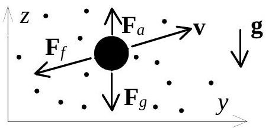

где $\tau=m / 6 \pi η а$ и $\gamma=1-\rho_{0} / \rho$. Первое уравнение - это определение скорости, второе - закон Ньютона $m d \mathbf{v} / d t=\mathbf{F}$, а $\sigma$ характеризует интенсивность воздействия со стороны молекул. Ускорение свободного падения $g=9.8 \mathrm{~m} / \mathrm{c}^{2}$ направлено вниз: $\mathbf{x}=(x, y, z), \mathbf{g}=(0,0,-g)$.

Сделаем оценки величин, входящих в уравнения. Вязкость воды $\eta \sim 10^{-3} \mathrm{Kr} /(\mathrm{m} \mathrm{c})$, типичный размер броуновской частицы $a \sim 10^{-6}$ м, масса $m \sim 4 \cdot 10^{-15}$ кг (плотность $\rho \sim 10^{3}$ кг $/ \mathrm{M}^{3}$ ). Поэтому $\tau \sim 2 \cdot 10^{-7}$ с.

Пренебрежём сначала силой тяжести ( $\gamma \approx 0$ если $\rho_{0} \approx \rho$ ). Так как система линейна, уравнения для средних совпадают с классическими:

$$
\langle\dot{\mathbf{x}}\rangle=\langle\mathbf{v}\rangle, \quad\langle\dot{\mathbf{v}}\rangle=-\langle\mathbf{v}\rangle / \tau,
$$

и легко интегрируются:

$$
\langle\mathbf{v}\rangle=\mathbf{v}_{0} e^{-t / \tau}, \quad\langle\mathbf{x}\rangle=\mathbf{x}_{0}+\mathbf{v}_{0} \tau-\mathbf{v}_{0} \tau e^{-t / \tau} .
$$

Если $t \gg \tau \sim 2 \cdot 10^{-7}$ с, то среднее значение скорости становится равным нулю при любом начальном значении $\mathbf{v}_{0}$. Найдём средние квадратов динамических переменных (6.17), стр. 159:

$$
\begin{equation*}
\left\langle x_{\mu} x_{\nu}\right\rangle=\left\langle x_{\mu} a_{\nu}+x_{\nu} a_{\mu}+b_{\nu \alpha} b_{\mu \alpha}\right\rangle \tag{7.1}
\end{equation*}
$$

В данном случае $x_{\nu}=(\mathbf{x}, \mathbf{v})$, и

$$
a_{\nu}=(\mathbf{v}, \quad-\mathbf{v} / \tau), \quad b_{\nu \alpha}=\sigma\left(\begin{array}{ll}
\mathbf{0} & \mathbf{0} \\
\mathbf{0} & \mathbf{1}
\end{array}\right), \quad b_{\nu \alpha} b_{\mu \alpha}=\mathbf{b} \cdot \mathbf{b}^{T}=\sigma^{2}\left(\begin{array}{ll}
\mathbf{0} & \mathbf{0} \\
\mathbf{0} & \mathbf{1}
\end{array}\right),
$$

где элементы в $b_{\nu \alpha}$ представляют собой матрицы $3 \times 3$ для каждой степени свободы координаты и импульса.

Просуммируем (7.1) по $\mu=\nu=4,5,6$, т.е. по координатам скорости (вторая динамическая переменная):

$$
\left\langle\dot{\mathbf{v}^{2}}\right\rangle=-\frac{2}{\tau}\left\langle\mathbf{v}^{2}\right\rangle+3 \sigma^{2} \Rightarrow \quad\left\langle\mathbf{v}^{2}\right\rangle=\frac{3}{2} \tau \sigma^{2}+\left(\mathbf{v}_{0}^{2}-\frac{3}{2} \tau \sigma^{2}\right) e^{-2 t / \tau} .
$$

При $t \gg \tau$ броуновская частица забывает начальное значение скорости $\mathbf{v}_{0}$, и среднее её квадрата стремится к величине $3 \tau \sigma^{2} / 2$. Этот результат можно сразу получить из уравнения, положив $\left\langle\mathbf{v}^{2}\right\rangle=0$.

Температура пропорциональна средней кинетической энергии молекул воды. В процессе постоянного столкновения с броуновской частицей их кинетические энергии выравниваются, поэтому:

$$
\frac{3}{2} k T=\frac{m\left\langle\mathbf{v}^{2}\right\rangle}{2}=\frac{3}{4} \tau \sigma^{2} m \quad=>\quad \tau \sigma^{2}=\frac{2 k T}{m}, \quad\left\langle\mathbf{v}^{2}\right\rangle=\frac{3 k T}{m},
$$

где $k=1.410^{-23}$ Дж/ K - постоянная Больцмана, связывающая температуру и энергию. В результате мы нашли зависимость волатильности внешних воздействий со стороны молекул $\sigma$ от макроскопически измеримых величин - температуры $T$ и вязкости жидкости $\eta$. При комнатной температуре $T \sim 300 \mathrm{~K}$ типичная среднеквадратичная скорость равна $\left\langle\mathbf{v}^{2}\right\rangle^{1 / 2}=\sqrt{3 k T / m} \sim 2 \cdot 10^{-3}$ м/с. Заметим, что молекулы воды, имея массу $m_{0} \sim 3 \cdot 10^{-26}$ кг, обладают существенно более высокой скоростью $\sim 600 \mathrm{~m} / \mathrm{c}$. Кроме этого, при плотности воды $\rho_{0}=10^{3} \mathrm{Kr} / \mathrm{M}^{3}$ расстояние между молекулами $d \approx\left(m_{0} / \rho_{0}\right)^{1 / 3} \sim 3 \cdot 10^{-10}$ м, что сравнимо с их размером. Это означает плотную упаковку молекул и очень частые толчки молекул по броуновской частице. Поэтому непрерывное стохастическое дифференциальное уравнение в данном случае более чем уместно.

Свернём уравнения (7.1) по $\mu=\nu=1,2,3$ и $\mu=1,2,3, \nu=4,5,6$ (можно решить сначала уравнения для каждой компоненты отдельно, а затем сложить эти решения):

$$
\left\langle\dot{\mathbf{x}^{2}}\right\rangle=2\langle\mathbf{x v}\rangle, \quad\langle\dot{\mathbf{x v}}\rangle=-\frac{1}{\tau}\langle\mathbf{x v}\rangle+\left\langle\mathbf{v}^{2}\right\rangle .
$$

Найдём асимптотическое поведение. Если $\langle\dot{\mathbf{x v}}\rangle=0$, то скалярное произведение координаты на скорость равно константе $\langle\mathbf{x v}\rangle=\tau\left\langle\mathbf{v}^{2}\right\rangle$. Поэтому среднее значение квадрата координаты при больших временах равно:

$$
\left\langle\mathbf{x}^{2}\right\rangle-\mathbf{x}_{0}^{2}=2 \tau\left\langle\mathbf{v}^{2}\right\rangle t=\frac{k T}{\pi \eta a} t=a^{2} \frac{t}{\tau_{\sigma}}
$$

Таким образом, дисперсия квадрата радиус-вектора со временем увеличивается линейно. Этот эффект наблюдается в эксперименте. При комнатной температуре параметр $\tau_{\sigma}=\pi \eta a^{3} / k T \sim 1$ с определяет темпы типичного дрожания броуновской частицы ( $\lessdot \mathrm{C}_{27}$ ).

- Если плотность частицы $\rho$ выше, чем у воды $\rho_{0}$, то $\gamma>0$ и уравнение для средней скорости

$$
\langle\dot{\mathbf{v}}\rangle=\gamma \mathbf{g}-\frac{1}{\tau}\langle\mathbf{v}\rangle
$$

приводит к тому, что в асимптотическом пределе частица опускается вниз в среднем с постоянной скоростью:

$$
\langle\mathbf{v}\rangle=\tau \gamma \mathbf{g}+\left(\mathbf{v}_{0}-\tau \gamma \mathbf{g}\right) e^{-t / \tau} \rightarrow \tau \gamma \mathbf{g} \sim \frac{\gamma a}{1} .
$$

Естественно, рано или поздно на её пути окажется дно сосуда. Произойдёт отражение от него и снова блуждание со сносом вниз. В результате возникнет стационарное распределение по координатам и скоростям. Чтобы найти его, рассмотрим уравнение Фоккера-Планка:

$$
\frac{\partial P}{\partial t}+\frac{\partial\left(a_{i} P\right)}{\partial x_{i}}-\frac{1}{2} \frac{\partial^{2}}{\partial x_{i} \partial x_{j}}\left[b_{i \alpha} b_{j \alpha} P\right]=0,
$$

имеющее в стационарном случае $\partial P / \partial t=0$ следующий вид:

$$
\mathbf{v} \frac{\partial P}{\partial \mathbf{x}}+\frac{\partial[(\gamma \mathbf{g}-\mathbf{v} / \tau) P]}{\partial \mathbf{v}}-\frac{\sigma^{2}}{2} \frac{\partial^{2} P}{\partial \mathbf{v}^{2}}=0
$$

Несложно проверить, что этому уравнению удовлетворяет функция:

$$
P(\mathbf{x}, \mathbf{v})=P_{0} e^{-\beta E(\mathbf{x}, \mathbf{v})}, \quad E(\mathbf{x}, \mathbf{v})=\frac{m \mathbf{v}^{2}}{2}-\gamma m \mathbf{g} \mathbf{x},
$$

где $\beta=1 / k T$. Величина $E(\mathbf{x}, \mathbf{v})$ является энергией частицы (кинетическая плюс потенциальная). Полученный результат $P(\mathbf{x}, \mathbf{v}) \sim e^{-\beta E}$ имеет достаточно общий характер и называется распределением Гиббса. Чем меньше энергия системы, тем более вероятно такое состояние.

Если ось $z$ направлена вверх, то $\mathbf{g x}=-g z$. При нормировке плотности вероятности предполагается, что отражающая поверхность дна сосуда расположена в точке $z=0$. По мере подъёма по $z$ вероятность встретить броуновскую частицу экспоненциально падает:

$$
P(z)=\frac{\lambda}{a} e^{-\lambda z / a}, \quad \lambda=\gamma \frac{m g a}{k T}=\frac{4 \pi g}{3 k T}\left(\rho-\rho_{0}\right) a^{4},
$$

где безразмерный параметр $\lambda$ характеризует темпы спада вероятности, если расстояние выражено в радиусах частицы. При фиксированной плотности броуновской частицы распределение вероятностей оказывается очень чувствительным к её размеру.

- Работа Ланжевена была инспирирована теорией броуновского движения Альберта Эйнштейна (Albert Einstein), опубликованной в 1905 г. Его рассуждения выглядели следующим образом.

Пусть координата броуновской частицы $x$ претерпевает случайные изменения $\varepsilon$ по одной оси и функция $P(x, t)$ является плотностью вероятности найти её в точке $x$. Если в момент времени $t-\tau$ координата была $x-\varepsilon$, то, изменившись на $\varepsilon$ в течение малого времени $\tau$, в момент времени $t$ она станет равной $x$. Произведение вероятности начального состояния $P(x-\varepsilon, t-\tau)$ и вероятности независимого от него изменения $\phi(\varepsilon)$ даст вероятность конечного состояния $P(x, t)$, которую нужно просуммировать по всем возможным значениям $\varepsilon$ :

$$
P(x, t)=\int_{-\infty}^{\infty} P(x-\varepsilon, t-\tau) \phi(\varepsilon) d \varepsilon
$$

Разложим уравнение в ряд до первого порядка по $\tau$ и второго по $\varepsilon$ :

$$
P(x, t)=\int_{-\infty}^{\infty}\left[P(x, t)-\frac{\partial P(x, t)}{\partial t} \tau-\frac{\partial P}{\partial x} \varepsilon+\frac{\partial^{2} P}{\partial x^{2}} \frac{\varepsilon^{2}}{2}+\ldots\right] \phi(\varepsilon) d \varepsilon
$$

Если направления равновероятны, то $\langle\varepsilon\rangle=0$. Вводя конечное отношение $\sigma_{x}^{2}=\left\langle\varepsilon^{2}\right\rangle / \tau$, для $P(x, t)$ в пределе $\tau \rightarrow 0$ получаем:

$$
\begin{equation*}
\frac{\partial P}{\partial t}=\frac{\sigma_{x}^{2}}{2} \frac{\partial^{2} P}{\partial x^{2}} . \tag{7.2}
\end{equation*}
$$

Это уравнение теплопроводности соответствует винеровскому блужданию $d x=\sigma_{x} \delta W$ с дисперсией $x$, линейно увеличивающейся со временем.

- Записывая систему уравнений Ланжевена, мы исходили из двух динамических переменных $\mathbf{x}$ и $\mathbf{v}$. При этом среднее значение $\mathbf{v}$ быстро (при $t \gg \tau)$ стремилось к постоянному значению, тогда как "динамикой обладала" переменная $\mathbf{x}$. Возьмём второе уравнение системы Ланжевена и в нулевом приближении положим $d \mathbf{v}=0$. Выразив из него $\mathbf{v} d t$ и подставив его в первое уравнение, получим:

$$
d \mathbf{x}=\gamma \mathbf{g} \tau d t+\sigma \tau \delta \mathbf{W}=-\frac{\tau}{m} \nabla V(\mathbf{x}) d t+\left(2 k T \frac{\tau}{m}\right)^{1 / 2} \delta \mathbf{W}
$$

где $V(\mathbf{x})$ - в общем случае произвольная потенциальная энергия частицы, а $\nabla$ - её градиент. Соответствующее этому стохастическому уравнению уравнение Фоккера - Планка было получено Смолуховским в 1906 г.

Подобный способ устранения быстро изменяющихся переменных является достаточно общим и мощным приближенным методом решения различных стохастических задач.

## 7.2 Стохастический осциллятор

- Множество механических, электромагнитных, биологических и социальных систем описываются осцилляторными уравнениями. Для определённости мы рассмотрим одномерный механический осциллятор массой $m$, подверженный трению и внешним стохастическим воздействиям. Определение импульса и закон Ньютона в этом случае имеют вид:
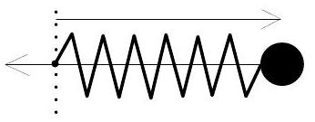

$$
m \frac{d x}{d t}=p, \quad \frac{d p}{d t}=F,
$$

где сила состоит из трёх компонент:

$$
F=-\underbrace{\left(k+\text { Noise }_{1}\right) x}_{\text {elastic force }}-\underbrace{\left(2 \lambda+\text { Noise }_{2}\right) p}_{\text {friction force }}+\underbrace{\text { Noise }_{3} .}_{\text {external force }}
$$

Сила упругости пропорциональна величине отклонения от положения равновесия $x$. Мы будем считать, что коэффициент упругости $k$ испытывает стохастические изменения, которые символически обозначены членом Noise $\mathrm{e}_{1}$. Знак минус перед упругой силой означает, что она стремится вернуть частицу назад, к положению равновесия. Сила сопротивления тем больше, чем больше скорость (импульс) частицы. Так происходит при движении в среде (воздух, вода). Сопротивление стремится остановить движение. Будем также предполагать, что коэффициент сопротивления подвержен стохастическим воздействиям Noise ${ }_{2}$. Наконец, третья составляющая силы - это ицм $\mathrm{Noise}_{3}$, который может быть, например, внешними случайными толчками.

Все три стохастические компоненты, в зависимости от ситуации, можно рассматривать как в качестве независимых, так и в качестве зависимых случайных процессов. В общем случае между ними существуют некоторые корреляционные коэффициенты. Мы рассмотрим случай независимых стохастических воздействий, считая, что они имеют различную причину, и поэтому нескоррелированы.

Будем работать в системе единиц, для которой $m=1, k=1$ ( ⟵ $\mathrm{C}_{28}$ ). Стохастические уравнения движения в этом случае имеют вид:

$$
\left\{\begin{array}{l}
d x=p d t \\
d p=-x d t-2 \lambda p d t+\sigma_{1} x \delta W_{1}+\sigma_{2} p \delta W_{2}+\sigma_{3} \delta W_{3}
\end{array}\right.
$$

где $\sigma_{1}$ - волатильность коэффициента упругости, $\sigma_{2}$ - силы трения, а $\sigma_{3}$ внешнего шума. Винеровские переменные $\delta W_{1}, \delta W_{2}$ и $\delta W_{3}$ представляют собой изменения трёх независимых процессов.

- Рассмотрим сначала общий случай, записав систему:

$$
d \mathbf{x}=\mathbf{a} d t+\mathbf{b} \cdot \delta \mathbf{W}
$$

со следующими векторами и матрицами:
$\mathbf{x}=\binom{x}{p}, \quad \mathbf{a}=\binom{p}{-x-2 \lambda p}, \quad \mathbf{b}=\left(\begin{array}{ccc}0 & 0 & 0 \\ \sigma_{1} x & \sigma_{2} p & \sigma_{3}\end{array}\right), \quad \delta \mathbf{W}=\left(\begin{array}{l}\delta W_{1} \\ \delta W_{2} \\ \delta W_{3}\end{array}\right)$.
Для функции $F(\mathbf{x})=F(x, p)$ координат и импульсов воспользуемся динамическим уравнением для средних (стр. 159):

$$
\frac{d}{d t}\langle F(\mathbf{x})\rangle=\left\langle\frac{\partial F}{\partial \mathbf{x}} \cdot \mathbf{a}+\frac{1}{2} \operatorname{Tr}\left[\mathbf{b}^{T} \cdot \frac{\partial^{2} F}{\partial \mathbf{x}^{2}} \cdot \mathbf{b}\right]\right\rangle, \quad \frac{\partial^{2} F}{\partial \mathbf{x}^{2}}=\left(\begin{array}{cc}
F_{x x} & F_{x p} \\
F_{p x} & F_{p p}
\end{array}\right),
$$

где $F_{x x}$ - вторая производная по $x, F_{x p}$ - производная по $x$ и $p$, и т.д. Подставляя матрицы и перемножая их, получаем ( $\lessdot \mathrm{H}_{43}$ ):

$$
\frac{d}{d t}\langle F(x, p)\rangle=\left\langle p F_{x}-(x+2 \lambda p) F_{p}\right\rangle+\frac{1}{2}\left\langle\left(\sigma_{1}^{2} x^{2}+\sigma_{2}^{2} p^{2}+\sigma_{3}^{2}\right) F_{p p}\right\rangle .
$$

Выбор $F=x$ и $F=p$ приводит к системе уравнений, совпадающих с детерминированными (снос линеен!):

$$
\left\{\begin{array}{l}
\langle\dot{x}\rangle=\langle p\rangle \\
\langle\dot{p}\rangle=-\langle x\rangle-2 \lambda\langle p\rangle .
\end{array}\right.
$$

Её решение с начальными условиями $x_{0}=x(0), p_{0}=p(0)$ имеет вид:

$$
\left\{\begin{array}{l}
\langle x\rangle=\left(x_{0} \cos \omega t+\frac{p_{0}+\lambda x_{0}}{\omega} \sin \omega t\right) e^{-\lambda t}  \tag{7.3}\\
\langle p\rangle=\left(p_{0} \cos \omega t-\frac{x_{0}+\lambda p_{0}}{\omega} \sin \omega t\right) e^{-\lambda t}
\end{array}\right.
$$

где $\omega=\sqrt{1-\lambda^{2}}$ (мы считаем, что трение мало и $\lambda<1$ ). При выводе (7.3) можно воспользоваться алгоритмом на стр. 164 или привести систему к одному дифференциальному уравнению второго порядка ( $\lessdot \mathrm{H}_{44}$ ).

Выбор $F=x^{2}, p^{2}, x p$ приводит к системе уравнений для моментов:

$$
\left\{\begin{array}{l}
\left\langle\dot{x^{2}}\right\rangle=2\langle x p\rangle  \tag{7.4}\\
\langle x p\rangle=\left\langle p^{2}\right\rangle-\left\langle x^{2}\right\rangle-2 \lambda\langle x p\rangle \\
\left\langle p^{2}\right\rangle=-2\langle x p\rangle+\sigma_{1}^{2}\left\langle x^{2}\right\rangle+\left(\sigma_{2}^{2}-4 \lambda\right)\left\langle p^{2}\right\rangle+\sigma_{3}^{2}
\end{array}\right.
$$

Эта неоднородная линейная система обыкновенных дифференциальных уравнений легко решается. Однако, так как уравнение для собственных значений оказывается кубическим, выражения получаются достаточно громоздкими. Ниже мы рассмотрим частные случаи этой системы.

- Если $4 \lambda>\sigma_{1}^{2}+\sigma_{2}^{2}$, система имеет стационарный режим при $t \rightarrow \infty$, в котором:

$$
\begin{equation*}
\left\langle x^{2}\right\rangle=\left\langle p^{2}\right\rangle=\frac{\sigma_{3}^{2}}{4 \lambda-\sigma_{1}^{2}-\sigma_{2}^{2}}, \quad\langle x p\rangle=0 \tag{7.5}
\end{equation*}
$$

При $\lambda>0$ средние стремятся к нулю, и матрица дисперсии оказывается диагональной:

$$
\mathbf{D}=\frac{\sigma_{3}^{2}}{4 \lambda-\sigma_{1}^{2}-\sigma_{2}^{2}}\left(\begin{array}{ll}
1 & 0 \\
0 & 1
\end{array}\right)
$$

Каждая разновидность шума увеличивает дисперсии, но по-разному. Трение $\lambda$ играет стабилизирующую роль, уменьшая $\mathbf{D}$.

Заметим, что динамика при $t \rightarrow \infty$ продолжается только, если существует внешний шум ( $\sigma_{3} \neq 0$ ). Если $\sigma_{3}=0$, стационарный режим также существует, но он вырождается в полное затухание колебаний, и $\left\langle x^{2}\right\rangle=\left\langle p^{2}\right\rangle=0$. Причина подобного поведения та же, что и у логистического уравнения (стр. 90).

- Пусть детерминированной составляющей трения нет $\lambda=0$, а флуктуации упругости и трения имеют одинаковые амплитуды $\sigma_{1}=\sigma_{2}=\sigma$. Введём энергию гармонического осциллятора:

$$
E=\frac{x^{2}+p^{2}}{2}
$$

Из (7.4) следует, что её среднее значение удовлетворяет уравнению:

$$
\frac{d}{d t}\langle E\rangle=\sigma^{2}\langle E\rangle+\frac{\sigma_{3}^{2}}{2}
$$

а, следовательно, возрастает со временем:

$$
\langle E\rangle=\left(E_{0}+\frac{\sigma_{3}^{2}}{2 \sigma^{2}}\right) e^{\sigma^{2} t}-\frac{\sigma_{3}^{2}}{2 \sigma^{2}}, \quad \quad E_{0}=\frac{x_{0}^{2}+p_{2}^{2}}{2}
$$

Если стохастическое воздействие обусловлено только внешними толчками ( $\sigma_{1}=\sigma_{2}=0$ ), то рост не такой быстрый и аналогичен винеровскому увеличению неопределённости $\langle E\rangle=E_{0}+\sigma_{3}^{2} t / 2$. Так же, как и броуновская частица под внешним воздействием в среднем удаляется от начального положения, так и квадрат амплитуды осциллятора при $\lambda=0$ в среднем увеличивается.

- Если существуют только внешние толчки ( $\sigma_{1}=\sigma_{2}=0$ ), то стохастика имеет постоянную волатильность $\sigma_{3}=\sigma$ :

$$
\left\{\begin{aligned}
d x & =p d t \\
d p & =-x d t-2 \lambda p d t+\sigma \delta W
\end{aligned}\right.
$$

Подобную систему мы рассматривали в шестой главе (стр. 160). Она обладает точным решением, которое выражается через две независимые гауссовы переменные. Воспользуемся общим алгоритмом решения системы линейных уравнений (см. стр. 164) с матрицами:

$$
\mathbf{A}=\left(\begin{array}{cc}
0 & 1 \\
-1 & -2 \lambda
\end{array}\right), \quad \mathbf{B}=\left(\begin{array}{cc}
0 & 0 \\
0 & \sigma
\end{array}\right)
$$

Чтобы найти $e^{\mathbf{A} t}$, продифференцируем (7.3) по $x_{0}$ и $p_{0}$ :

$$
e^{\mathbf{A} t}=\left(\begin{array}{cc}
\omega \cos \omega t+\lambda \sin \omega t & \sin \omega t \\
-\sin \omega t & \omega \cos \omega t-\lambda \sin \omega t
\end{array}\right) \frac{e^{-\lambda t}}{\omega} .
$$

При помощи этой матрицы, интегрируя (6.28), стр. 167, можно найти дисперсию координаты и импульса:

$$
\left\{\begin{array}{l}
D_{x x}(t) \\
D_{p p}(t)
\end{array}\right\}=\frac{\sigma^{2}}{4 \lambda}-\frac{\sigma^{2}}{4 \lambda \omega^{2}}\left[1-\lambda^{2} \cos (2 \omega t) \pm \lambda \omega \sin (2 \omega t)\right] e^{-2 \lambda t}
$$

Верхний знак соответствует дисперсии для $x: D_{x x}=\left\langle x^{2}\right\rangle-\langle x\rangle^{2}$, а нижний - для $p: D_{p p}=\left\langle p^{2}\right\rangle-\langle p\rangle^{2}$. Дисперсия произведения динамических переменных $D_{x p}(t)=\langle x p\rangle-\langle x\rangle\langle p\rangle$ имеет вид:

$$
D_{x p}(t)=\frac{\sigma^{2}}{2 \omega^{2}} \sin ^{2}(\omega t) e^{-2 \lambda t}
$$

и стремится к нулю при $t \rightarrow \infty$ и $\lambda>0$. В результате, в стационарном режиме ( $t \rightarrow \infty$ ) матрица дисперсий диагональна (7.5), поэтому автоковариационная матрица $\operatorname{cov}(\tau)$ равна $e^{\mathbf{A}^{T}|\tau|}$ с множителем $\sigma^{2} / 4 \lambda$.

При отсутствии трения $\lambda=0, \omega=1$ :

$$
\mathbf{D}(t)=\frac{\sigma^{2}}{2}\left(\begin{array}{cc}
t-\sin t \cos t & \sin ^{2} t \\
\sin ^{2} t & t+\sin t \cos t
\end{array}\right), \quad e^{\mathbf{A} t}=\left(\begin{array}{cc}
\cos t & \sin t \\
-\sin t & \cos t
\end{array}\right)
$$

и, как мы видели выше, стационарного режима нет. Дисперсии по $x$ и $p$ растут во времени, совершая периодические колебания. Автоковариационная матрица $\operatorname{cov}(t, t+\tau)$ получается перемножением $\mathbf{D}(t)$ и $e^{\mathbf{A}^{T}|\tau|}$.

## 7.3 Дрожание земной оси

Наша Земля, несмотря ни на что, вращается вокруг своей оси с периодом, равным примерно 24 часа. Если ночью в хорошую погоду длительное время смотреть на звёздную "сферу" у нас над головой, видно, что она "поворачивается" вокруг некоторой точки в окрестности Полярной звезды (в северном полушарии). Именно туда направлена мгновенная ось вращения Земли.

Если бы наша планета была абсолютно твёрдым телом, то её динамика подчинялась бы уравнениям Эйлера. Выберем систему отсчёта, жестко связанную с Землей, направив ось $z$ к северному полюсу, а $x$ и $y$ расположив в плоскости экватора. В первом приближении Земля представляет собой симметричный эллипсоид (шар, несколько сплюснутый вдоль оси $z$ ). Поэтому её моменты инерции, вычисленные в этой системе, равны $J_{z}=J_{1}=2 M r_{2}^{2} / 5$ и $J_{x}=J_{y}=J_{2}=M\left(r_{1}^{2}+r_{2}^{2}\right) / 5$, где $M$ - масса Земли, а $r_{i}$ - радиусы эллипсоида в направлении к полюсу $r_{1}$ и в экваториальной плоскости $r_{2}$. Уравнения Эйлера для свободного вращения имеют вид:

$$
\left\{\begin{array}{l}
J_{1} \dot{\Omega}_{z}=0 \\
J_{2} \dot{\Omega}_{x}+\left(J_{1}-J_{2}\right) \Omega_{z} \Omega_{y}=0 \\
J_{2} \dot{\Omega}_{y}+\left(J_{2}-J_{1}\right) \Omega_{z} \Omega_{x}=0
\end{array}\right.
$$

Вектор $\boldsymbol{\Omega}=\left\{\Omega_{x}, \Omega_{y}, \Omega_{z}\right\}$ - это угловая скорость вращения. Она направлена вдоль мгновенной оси вращения и по модулю равна $\Omega=d \phi / d t$ повороту на малый угол $d \phi$ за время $d t$. Проекции $\boldsymbol{\Omega}$ вычислены в системе отсчёта, связанной с Землёй. Поэтому, когда мы находимся на её поверхности, положение наблюдаемого центра "звёздной сферы" задаётся $\boldsymbol{\Omega}$.

Первое уравнение системы приводит к постоянству проекции угловой скорости $\Omega_{z}=$ const. Два вторых являются осцилляторными и имеют периодические решения:

$$
\left.\frac{\left\{\begin{array}{l}
\Omega_{x}=A \cos (\omega t) \\
\Omega_{y}=A \sin (\omega t) \\
\Omega_{z}=\text { const }
\end{array}\right.}{\omega=\Omega_{z}\left(J_{1}-J_{2}\right) / J_{2}} \quad \omega \quad\right|^{\Omega}
$$

Таким образом, вектор $\boldsymbol{\Omega}$ вращается по поверхности конуса с угловой частотой $\omega$. Подобное вращение мы наблюдаем, запуская детский волчок, который, быстро вращаясь вокруг своей оси, одновременно медленно поворачивает ось вращения по поверхности конуса.

Обычно различают два типа вращения мгновенной оси. Медленное с большой амплитудой - это прецессия. Дополнительные небольшие периодические возмущения этого движения - это нутация.

Для Земли $M=5.97610^{24}$ кг, $r_{1}=6356.8$ км, $r_{2}=6378.2$ км. Период вращения вдоль главной оси соответствует 24 часам, поэтому $\Omega_{z}= 2 \pi / 24=7.2710^{-5} c^{-1}$. Так как $\left(J_{1}-J_{2}\right) / J_{2}=\left(r_{2}^{2}-r_{1}^{2}\right) /\left(r_{2}^{2}+r_{1}^{2}\right)=1 / 298$, то прецессионный период составляет примерно 300 дней и был предсказан ещё Эйлером. Земной наблюдатель должен наблюдать прецессию (нутацию), как медленное перемещение центра вращения "небесной сферы" по окружности относительно "неподвижных" звёзд. Такое изменение положения земной оси впервые обнаружил астроном Чандлер в 1891 г.

Однако наблюдаемое движение вращения земной оси оказывается существенно сложнее и носит стохастический характер. Координаты $x= \Omega_{x}$ и $y=\Omega_{y}$ являются угловыми (направление!), однако, так как их колебания очень невелики, можно считать, что ось вращения на поверхности Земли "рисует" вокруг северного полюса соответствующую кривую. Для перехода к метрам углы в радианах необходимо умножить на радиус Земли. Если устранить очень медленную трендовую составляющую (вековое движение), колебания по $x$ и $y$ выглядят следующим образом:
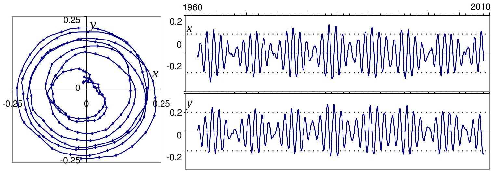

Слева представлено движение проекции Земной оси (arcsec) 2000-2008 (точки - ежедневные наблюдения), а справа - отдельно по каждой оси за период 1960-2008. Максимальное отдаление от оси составляет около $0.3 \operatorname{arcsec}\left(1 \operatorname{arcsec}=4.848 \cdot 10^{-6} \mathrm{rad}\right)$. Поэтому на поверхности Земли это приводит к максимальному радиусу 9 m . В среднем он раза в два меньше.

Спектральный анализ показывает, что эти колебания являются суммой двух гармоник с периодом 365 дней и 433 дня. Первая периодичность совпадает с длительностью года. Вторая оказывается квазипериодической. Амплитуда первой гармоники около 0.09 , а второй - 0.15 .

Наблюдаемые периодические колебания амплитуды (биения) связаны со сложением этих двух гармоник. Так, например, если колебания имеют различную частоту $\omega_{1}$ и $\omega_{2}$ и одинаковые амплитуды, их сумма равна:

$$
A \cos \left(\omega_{1} t\right)+A \cos \left(\omega_{2} t\right)=2 A \cos \left(\frac{\omega_{1}-\omega_{2}}{2} t\right) \cos \left(\frac{\omega_{1}+\omega_{2}}{2} t\right) .
$$

Если $\omega_{1} \approx \omega_{2}$, то первый множитель имеет большой период изменения "амплитуды" колебаний со средней частотой $\left(\omega_{1}+\omega_{2}\right) / 2$ (второй множитель). Результирующая периодичность биений составляет 6.35 лет $\left((1 / 365-1 / 433)^{-1}\right)$.

Приведём динамику расстояния от центра $r=\sqrt{x^{2}+y^{2}}$ :
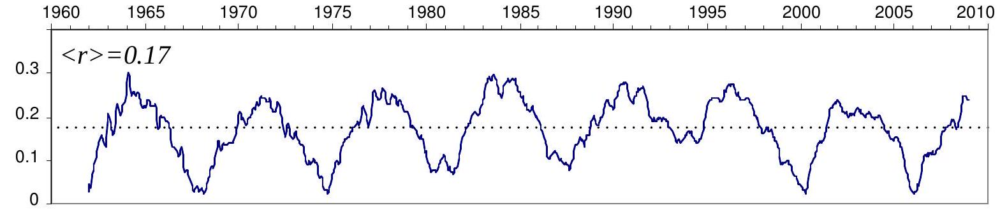

Среднее значение $\langle r\rangle=0.17$. Хорошо видно, что биение не является строго периодическим, а носит стохастический характер.

Одна из наиболее простых моделей чандлеровских колебаний была предложена Колмогоровым. Уравнения Эйлера можно переписать в следующем виде:

$$
\begin{aligned}
d \Omega_{x} & =\omega \Omega_{y} d t \\
d \Omega_{y} & =-\omega \Omega_{x} d t
\end{aligned}
$$

где $\omega=\Omega_{z}\left(J_{1}-J_{2}\right) / J_{2}$. Земля не является абсолютно твёрдым телом. Климатические движения масс воды, землетрясения и другая внутренняя активность приводят к постоянному изменению тензоров инерции.

В результате потери энергии на преодоление вязкости (пластичности Земли) ось вращения рано или поздно оказалась бы совмещённой с осью симметрии и никакой нутации не было бы. Введём затухание нутации с параметром $\lambda$ и стохастические изменения оси вращения в результате активности Земли. Обозначим $x=-\Omega_{x}, y=\Omega_{y}$ и запишем уравнения стохастического осциллятора:

$$
\begin{aligned}
& d x=(-\lambda x-\omega y) d t+\sigma \delta W_{x} \\
& d y=(+\omega x-\lambda y) d t+\sigma \delta W_{y} .
\end{aligned}
$$

Их математические свойства мы подробно изучали в разделе §6.3, стр. 160. В частности, после затухания возникает квазипериодическое движение с типичным радиусом $\sigma / \sqrt{\lambda}$ и частотой $\omega$.

- Найдём, как ведёт себя расстояние от начала координат $r=\sqrt{x^{2}+y^{2}}$ :

$$
\frac{\partial r}{\partial \mathbf{x}}=\frac{1}{r}\binom{x}{y}, \quad \frac{\partial^{2} r}{\partial \mathbf{x}^{2}}=\frac{1}{r^{3}}\left(\begin{array}{cc}
y^{2} & -x y \\
-x y & x^{2}
\end{array}\right) .
$$

При помощи формулы Ито получаем следующее уравнение:

$$
d r=\left[\frac{\sigma^{2}}{2 r}-\lambda r\right] d t+\frac{\sigma}{r}\left(x \delta W_{x}+y \delta W_{y}\right)
$$

Стохастический член можно выразить через одномерную винеровскую переменную:

$$
\frac{x \delta W_{x}+y \delta W_{y}}{r}=\frac{x \varepsilon_{x}+y \varepsilon_{y}}{r} \sqrt{d t}=\varepsilon \sqrt{d t}=\delta W .
$$

Действительно, если мы решаем уравнение итерациями, какие бы ни были значения $x, y$ к некоторому моменту времени, сумма независимых от них гауссовых чисел $\varepsilon_{x}, \varepsilon_{y}$ снова даёт гауссово число. Так как $x^{2}+y^{2}=r^{2}$, то оно имеет единичную дисперсию. В результате, для радиуса можно записать одномерное уравнение рэлеевского типа:

$$
d r=\left[\frac{\sigma^{2}}{2 r}-\lambda r\right] d t+\sigma \delta W
$$

Снос уравнения имеет равновесную точку $r_{\infty}=\sigma / \sqrt{2 \lambda}$, в которой обращается в ноль. Если расстояние от начала координат существенно больше $r_{\infty}$, то детерминированная часть динамики начинает уменьшать радиус, и наоборот. Поэтому $r$ совершает характерные стохастические колебания вокруг этого равновесного положения.

Так как решения для $x(t)$ и $y(t)$ известны, мы автоматически имеем точное решение рэлеевского уравнения, выраженное через две случайные гауссовы величины. В асимптотическом пределе, который мы наблюдаем при изучении вращения Земли, радиус колебаний оси равен:

$$
r=\frac{\sigma^{2}}{\sqrt{2 \beta}} \sqrt{\varepsilon_{x}^{2}+\varepsilon_{y}^{2}} .
$$

В частности, среднее значение радиуса составляет $\bar{r}=\sqrt{\pi} \sigma / 2 \sqrt{\lambda}$.
На самом деле, модель Колмогорова является очень упрощённой имитацией стохастических колебаний. В частности, в ней присутствует только одна периодическая компонента, и, как следствие, нет наблюдаемых биений с периодом в 6.35 лет.

## 7.4 Электронный шум

В электротехнических приборах всегда присутствует шум. Если в отсутствие музыки увеличить громкость усилителя, то будет слышно характерное шипение. Величина шума связана с температурой, в которой находится система, и была экспериментально исследована в 1928 г. Джонсоном и теоретически объяснена в этом же году Найквистом.

Основными характеристиками процессов, происходящих в электрической цепи, являются напряжение (разница потенциалов) $U$ между двумя точками и проходящий по ней ток $I$. Ток равен величине заряда частиц, пересекающих сечение провода за единицу времени: $I=d Q / d t$.

Большинство электротехнических устройств состоят из трёх элементарных деталей - резистора, конденсатора и индуктивности:
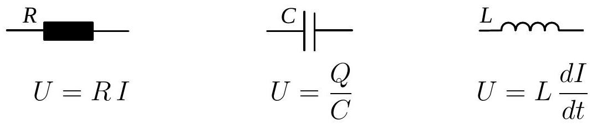

Резистором является любой проводник, "затрудняющий" прохождение по нему зарядов так, что справедлив закон Ома: $U=R I$, где $R$ константа, называемая сопротивлением.

Конденсатором может выступать тело, способное накапливать заряд. Например, две параллельные металлические пластины, содержащие заряды противоположного знака. Конденсатор характеризуется ёмкостью $C$, зависящей от его материала и формы. Чем больше накоплено заряда, тем выше разница потенциалов пластин конденсатора: $U=Q / C$. При зарядке конденсатор внутри себя увеличивает энергию $E=Q^{2} / 2 C$ электрического поля.

Индуктивность - это активный элемент, реагирующий на изменение тока. Для неё справедлив закон Ома в виде: $U=L d I / d t$. Индуктивность накапливает энергию магнитного поля, равную $E=L I^{2} / 2$.

Рассмотрим последовательное соединение этих трех элементов.
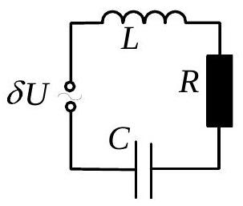

$$
R I+\frac{Q}{C}+L \frac{d I}{d t}=\delta U .
$$

В отсутствие внешнего источника суммарное падение напряжения на всех элементах $U_{R}+U_{C}+U_{L}$ должно быть равно нулю (замкнутая цепь). Однако в силу тепловых флуктуаций это не так. Обозначим колебания напряжения через $\delta U$.

Считая их винеровскими с постоянной волатильностью и учитывая определение тока, можно записать систему стохастических уравнений в следующем виде:

$$
\left\{\begin{array}{l}
d Q=I d t \\
d I=-(\alpha Q+2 \beta I) d t+\sigma \delta W
\end{array}\right.
$$

где $\alpha=1 / L C, \beta=R / 2 L$ и $\delta U=L \sigma \delta W$. Наша задача состоит в нахождении величины амплитуды шума $\sigma$. В его отсутствие ( $\sigma=0$ ) систему можно привести к единственному уравнению второго порядка:

$$
\frac{d^{2} Q}{d t^{2}}+2 \beta \frac{d Q}{d t}+\alpha Q=0
$$

Это уравнение гармонического осциллятора, испытывающего трение. Вообще аналогия с механикой достаточно тесная. Заряд $Q$ и ток $I$ являются динамическими переменными системы. Заряд аналогичен координате осциллятора, а ток - импульсу. От них также зависит энергия, накапливаемая конденсатором и индуктивностью. Из уравнений движения следует:

$$
\begin{equation*}
E(Q, I)=\frac{L I^{2}}{2}+\frac{Q^{2}}{2 C} \quad=>\quad \frac{d E}{d t}=-R I^{2} \tag{7.6}
\end{equation*}
$$

Уменьшение энергии происходит из-за тепловых потерь на резисторе, равных $R I^{2}$. Если сопротивления нет, то энергия сохраняется и происходят незатухающие колебания. При этом энергия периодически переходит из электрической в конденсаторе ("потенциальная") в магнитную ("кинетическая") на индуктивности, и обратно.

Стохастические уравнения линейны, поэтому решения для средних значений тока и заряда совпадают с детерминированными. В нашем случае матрица системы $\mathbf{A}$ и её собственные значения имеют вид:

$$
\mathbf{A}=\left(\begin{array}{cc}
0 & 1 \\
-\alpha & -2 \beta
\end{array}\right) \quad a_{1,2}=-\beta \pm i \omega
$$

где $\omega=\sqrt{\alpha-\beta^{2}}$. Мы предполагаем, что сопротивление невелико и $4 L / C>R^{2}$. По стандартному алгоритму (стр. 165) несложно найти:

$$
\begin{align*}
& \left.\bar{Q}(t)=\left[Q_{0} \cos \omega t+\left(I_{0}+\beta Q_{0}\right) / \omega\right) \sin \omega t\right] e^{-\beta t} \\
& \left.\bar{I}(t)=\left[I_{0} \cos \omega t-\left(\beta I_{0}+\alpha Q_{0}\right) / \omega\right) \sin \omega t\right] e^{-\beta t} \tag{7.7}
\end{align*}
$$

Возможно, более быстрый путь - это решение уравнения второго порядка в виде $Q(t)=(A \cos \omega t+B \sin \omega t) e^{-\beta t}$ и определение констант при помощи начальных условий $Q_{0}=Q(0), I_{0}=\dot{Q}(0)$.

- Если некоторая система имеет температуру $T$, можно воспользоваться распределением Гиббса (стр. 184) и записать плотность вероятности для динамических переменных в следующем виде:

$$
\begin{equation*}
P(I, Q)=P_{0} e^{-E(I, Q) / k T} \tag{7.8}
\end{equation*}
$$

Она удовлетворяет стационарному уравнению Фоккера-Планка:

$$
\frac{\partial\left(a_{i} P\right)}{\partial x_{i}}-\frac{1}{2} \frac{\partial^{2}}{\partial x_{i} \partial x_{j}}\left[B_{i k} B_{j k} P\right]=0
$$

В данном случае $x_{\alpha}=\{Q, I\}$ и

$$
a_{\alpha}=\{I, \quad-\alpha Q-2 \beta I\}, \quad B_{i j}=\sigma\left(\begin{array}{ll}
0 & 0 \\
0 & 1
\end{array}\right), \quad \mathbf{B} \cdot \mathbf{B}^{T}=\sigma^{2}\left(\begin{array}{ll}
0 & 0 \\
0 & 1
\end{array}\right) .
$$

Поэтому:

$$
I \frac{\partial P}{\partial Q}-\alpha Q \frac{\partial P}{\partial I}-2 \beta \frac{\partial(I P)}{\partial I}-\frac{\sigma^{2}}{2} \frac{\partial^{2} P}{\partial I^{2}}=0 .
$$

Подставляя (7.8) и учитывая (7.6), после простых вычислений находим связь между волатильностью и температурой:

$$
(L \sigma)^{2}=2 k T R
$$

Таким образом, флуктуации напряжения являются винеровским шумом с дисперсией, пропорциональной температуре и сопротивлению:

$$
\begin{equation*}
\delta U=\sqrt{2 k T R} \delta W \quad=>\quad\left\langle\delta U^{2}\right\rangle=2 k T R d t \tag{7.9}
\end{equation*}
$$

Дисперсию заряда и тока в устоявшемся режиме ( $t \rightarrow \infty$ ) можно найти из уравнения для дисперсии (6.29), стр. 167. Положив $\dot{\mathbf{D}}=0$, имеем:

$$
\mathbf{A} \cdot \mathbf{D}+\mathbf{D} \cdot \mathbf{A}^{T}+\mathbf{B} \cdot \mathbf{B}^{T}=0
$$

откуда:

$$
\mathbf{D}=\frac{\sigma^{2}}{4 \alpha \beta}\left(\begin{array}{cc}
1 & 0  \tag{7.10}\\
0 & \alpha
\end{array}\right)=k T\left(\begin{array}{cc}
C & 0 \\
0 & 1 / L
\end{array}\right)
$$

что согласуется с вероятностью (7.8) и $n$-мерным гауссовым распределением на стр. 342. Заметим, что $\left\langle Q^{2}\right\rangle=k T C,\left\langle I^{2}\right\rangle=k T / L$, поэтому в среднем энергия между конденсатором и индуктивностью распределена поровну. В качестве упражнений предлагается найти матрицу дисперсий при произвольном $t\left(\lessdot \mathrm{H}_{45}\right)$, а также ковариацию и спектральную функцию в стационарном режиме ( $\lessdot \mathrm{H}_{46}$ ).

- Тепловые флуктуации тока возникают на резисторе и в отсутствие колебательного контура. Для отдельного электрона с зарядом $q$ справедливо уравнение движения:

$$
m \frac{d v}{d t}=-\gamma v-q \mathcal{E}
$$

На электрон действуют две силы - сопротивление со стороны кристаллической решётки (трение) и электрическая сила в поле $\mathcal{E}$. Если в проводнике длиной $l$ поле однородно $U=l \mathcal{E}$, то в устоявшемся режиме ( $\dot{v}=0$ ) из уравнения движения следует $v=-q \mathcal{E} / \gamma=-q U / l \gamma$. Пусть $n-$ концентрация электронов. За время $\Delta t$ сечение сопротивления площадью $S$ пересекает ( $q n$ ) $S \Delta x$ зарядов. Для электрона $q<0$, поэтому ток равен:

$$
I=\frac{d Q}{d t}=-\frac{q n S \Delta x}{\Delta t}=-n q v S=\frac{q^{2} n S}{\gamma l} U
$$

Следовательно, по закону Ома $R=U / I$ сопротивление равно:

$$
R=\frac{\gamma l}{q^{2} n S} .
$$

Когда внешних полей нет, но есть электрическое стохастическое воздействие со стороны тепловых колебаний других зарядов, имеем следующее стохастическое уравнение движения:

$$
d v=-\frac{\gamma}{m} v d t-\sigma \delta W
$$

где $\delta \mathcal{E}=(\sigma m / q) \delta W$ - флуктуации электрического поля. Аналогично броуновскому движению находим стационарное значение квадрата скорости: $\left\langle v^{2}\right\rangle=m \sigma^{2} / 2 \gamma$. Кинетическая энергия $m\left\langle v^{2}\right\rangle / 2$ равна $k T / 2$ (одна степень свободы), поэтому $\sigma^{2}=2 k T \gamma / m^{2}$.

Если в проводнике $N=n S l$ электронов, то среднее расстояние между ними $l / N$ и флуктуации разности потенциалов $\delta U_{i}=(l / N) \delta \mathcal{E}$. Их сумма равна разности потенциалов на резисторе. Так как $\delta W=\varepsilon \sqrt{d t}, N=n S l$, получаем:

$$
\delta U=\frac{l}{N} \sum_{i=1}^{N} \delta \mathcal{E}_{i}=\frac{l}{N} \frac{\sigma m}{q} \sum_{i=1}^{N} \varepsilon_{i} \sqrt{d t}=\frac{l}{N} \frac{\sigma m}{q}(\sqrt{N} \varepsilon) \sqrt{d t}=\sqrt{2 k T R} \delta W,
$$

и, следовательно, снова приходим к соотношению Найквиста (7.9).

## 7.5 Хищники и их жертвы

Рассмотрим пример очень простой модели, описывающей динамику популяции двух видов живых существ. Одни из них будут безобидными кроликами ("жертвы"), а вторые - коварными лисами ("хищники"). Детерминированная система уравнений имеет вид:

$$
\left\{\begin{array}{l}
\dot{x}=\alpha x-\mu x y-\beta x^{2} \\
\dot{y}=-\gamma y+\nu x y .
\end{array}\right.
$$

Количество кроликов обозначено через $x$, а лис - через $y$. Точка над переменной, как обычно, - производная по времени. Кролики размножаются в соответствии с логистическим уравнением, однако их смертность зависит также от встречи с хищником, которая тем вероятнее, чем больше жертв и хищников. Поэтому в уравнение добавлен член $-\mu x y$. Популяция лис при отсутствии питания вымирает ( $-\gamma y$ ). Положительный прирост возможен только при активной и недружественной встрече с кроликами $(+\nu x y)$. Если ресурсы питания для кроликов не ограничены ( $\beta=0$ ), то эту систему называют уравнениями Лотка-Вольтерра (LotkaVolterra equation, predator-prey equations).

Модель содержит большое число параметров. Не все из них имеют существенное значение при анализе качественных свойств поведения решения. Поэтому целесообразно уменьшить их количество. Для этого сделаем преобразования масштаба: $x \Rightarrow a x, y \Rightarrow b y$ и $t \Rightarrow \tau t$, где константы $a, b$ и $\tau$ являются "единицами измерения" численности особей и времени. Подставим эти преобразования в уравнения (при этом $\dot{x} \Rightarrow(a / \tau) \dot{x}$ ) и выберем $a=1 / \nu \tau, b=1 / \mu \tau$ и $\tau=1 / \gamma$.

Тогда, с точностью до масштабирования, система уравнений становится двухпараметрической и записывается в следующем виде:

$$
\left\{\begin{array}{l}
\dot{x}=-x y+\omega^{2} x-2 \lambda x^{2} \\
\dot{y}=x y-y
\end{array}\right.
$$

где $\omega^{2}=\alpha / \gamma, 2 \lambda=\beta / \nu$. Её качественный анализ начинается с определения особых точек, в которых $\dot{x}=\dot{y}=0$ :

$$
\left\{\begin{array}{l}
x_{\infty} \cdot\left(-y_{\infty}+\omega^{2}-2 \lambda x_{\infty}\right)=0 \\
y_{\infty} \cdot\left(x_{\infty}-1\right)=0
\end{array}\right.
$$

Несложно видеть, что существует три решения этих уравнений:
$\left\{x_{\infty}=1, \quad y_{\infty}=\omega^{2}-2 \lambda\right\} ; \quad\left\{x_{\infty}^{\prime}=y_{\infty}^{\prime}=0\right\} ; \quad\left\{x_{\infty}^{\prime \prime}=\omega^{2} / 2 \lambda, \quad y_{\infty}^{\prime \prime}=0\right\}$.
Последние два достаточно тривиальны и сводятся в первом случае к полному вымиранию всех особей, а во втором - к вымиранию хищников.

Рассмотрим решения системы в окрестности первой особой точки. Введём отклонения численности популяций $X=x-x_{\infty}, Y=y-y_{\infty}$ и разложим правую часть уравнений в ряд по $\mathbf{X}=\{X, Y\}$ :

$$
\left\{\begin{array}{l}
\dot{X}=-2 \lambda X-Y \\
\dot{Y}=\left(\omega^{2}-2 \lambda\right) X
\end{array} \quad \dot{\mathbf{X}}=\mathbf{A} \cdot \mathbf{X}, \quad \mathbf{A}=\left(\begin{array}{cc}
-2 \lambda & -1 \\
\omega^{2}-2 \lambda & 0
\end{array}\right)\right.
$$

Это линеаризованное уравнение будем решать стандартными методами, рассмотренными в разделе §6.4, стр. 164. Характеристическое уравнение $a^{2}+2 \lambda a+\omega^{2}-2 \lambda=0$ для собственных значений матрицы $\mathbf{A}$ имеет два решения:

$$
a_{1,2}=-\lambda \pm i \sqrt{\omega^{2}-2 \lambda-\lambda^{2}} .
$$

Если пищевые ресурсы жертв не ограничены $\lambda=0$, то в системе устанавливаются незатухающие периодические колебания с частотой $\omega$. При $\lambda \neq 0$ эти колебания будут затухающими. Колебательного режима не будет, если $\lambda$ очень велико. В этом случае оба решения отрицательны и действительны.

Бифуркация в системе возникает, когда подкоренное выражение становится равным нулю, что соответствует значению $\lambda_{0}=\sqrt{1+\omega^{2}}-1$. При $\lambda>\lambda_{0}$ решение уравнений монотонно затухает, а при $\lambda<\lambda_{0}$ происходит качественная перестройка и возникают колебания, сначала сильно затухающие, а по мере уменьшения $\lambda$ постепенно переходящие в периодические.
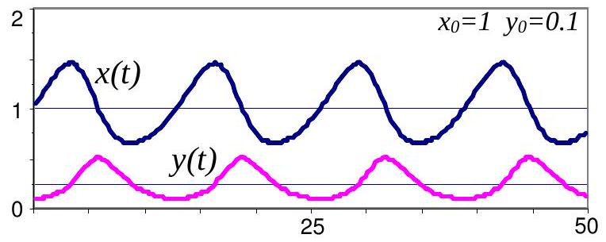
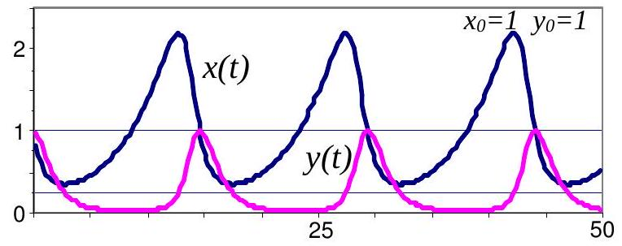

Выше представлена динамика численности особей при $\lambda=0$, и $\omega=0.5$. На левом рисунке начальные значения $x_{0}=1$ и $y_{0}=0.1$, а на правом: $x_{0}=1$ и $y_{0}=1$. Если начальное отклонение от точки равновесия $x_{\infty}=1, y_{\infty}=0.25$ невелико, колебания будут практически гармоническими. Однако при существенных отклонениях начинают сказываться нелинейности, и "синусоида" становится сильно искажённой.

Стоит обратить внимание на сдвиг кривых относительно друг друга. Когда лис мало - кролики быстро размножаются. Это приводит к росту численности лис, что тормозит рост популяции кроликов. Как и любая колебательная система, модель "хищник-жертва" обладает инертностью. Поэтому популяция лис продолжает увеличиваться, тогда как ряды кроликов стремительно редеют.

При описании реальных популяций эта модель обладает одним неприятным свойством. Если начальное значение хищников заметно отличается от равновесия, то их численность испытывает очень большие колебания, прижимаясь в минимуме к нулевому значению. Так, выше, на правом графике ( $x_{0}=1, y_{0}=1$ ), численность лис падает до 0.02 (в 50 раз), тогда как популяция кроликов изменяется только в 4 раза. Этот эффект называют aтто-лисьей проблемой (atto-fox problem), так как иногда при моделировании численность хищников падает практически до нуля ("атто" - это $10^{-18}$ часть чего либо).

Рассмотрим ситуацию ограниченных ресурсов. Если $\omega=0.5$, то критическое значение $\lambda_{0}=0.12$. Выберем $\lambda=0.01$ (слева) и $\lambda=0.05$ (справа):
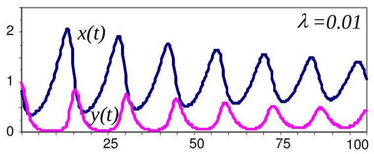
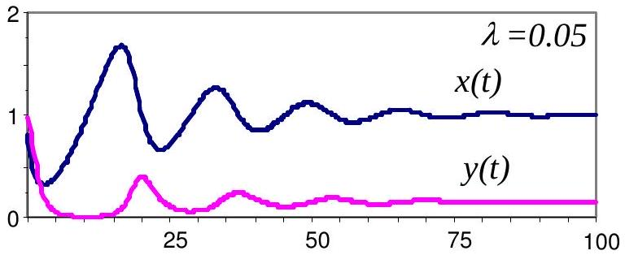

Затухание наглядно видно также на фазовой диаграмме в плоскости $(x, y)$. Ниже на первом рисунке представлены фазовые кривые при различных начальных условиях и неограниченных ресурсах ( $\lambda=0$ ). При этом всегда $x_{0}=1$, а $y_{0}$ меняется от 0.2 до 0.8 с шагом 0.1. На втором и третьем рисунках приведена единичная траектория, соответствующая затухающим колебаниям с $\lambda=0.01$ и $\lambda=0.05$ от точки $x_{0}=1, y_{0}=0.8$ :
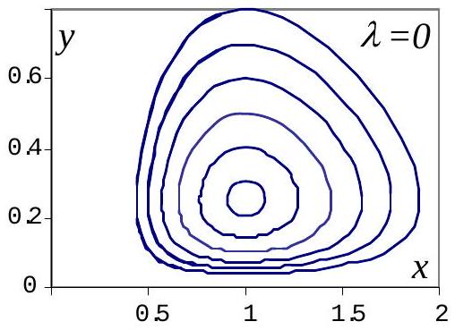
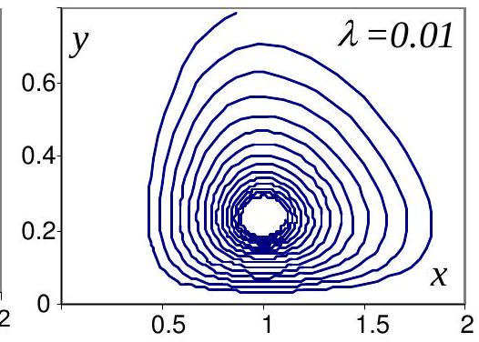
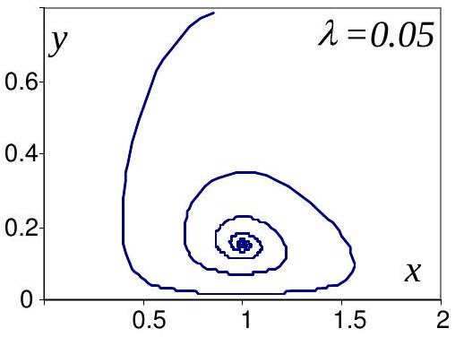

- Перейдём теперь к стохастической задаче. Будем считать, что рождаемость подвержена случайным факторам, так что относительный прирост $d x / x$ является винеровским шумом с амплитудой $s_{x}$ для кроликов и $s_{y}$ для лис:

$$
\left\{\begin{aligned}
d x & =\left(-x y+\omega^{2} x-2 \lambda x^{2}\right) d t+x s_{x} \delta W_{x} \\
d y & =(x y-y) d t+y s_{y} \delta W_{y}
\end{aligned}\right.
$$

Линеаризованные в окрестности особой точки уравнения имеют решение для средних, аналогичное детерминированному случаю.

Для колебательного режима средняя численность популяции кроликов стремится к единице, а лис $-\mathrm{k} \omega^{2}-2 \lambda$. Так как снос уравнений не линеен, это, на самом деле, лишь первое приближение к точному асимптотическому пределу. Найдём его при помощи уравнения для средних (6.15), стр. 159 . Выбирая $F=\ln x$ и $F=\ln y$ и положив производные по времени равными нулю, получаем:

$$
\bar{x}=1+\frac{s_{y}^{2}}{2}, \quad \bar{y}=\omega^{2}-2 \lambda-\lambda s_{y}^{2}-\frac{s_{x}^{2}}{2} .
$$

Равновесное значение средней численности кроликов увеличивается за счёт флуктуации рождаемости лис, а численность лис уменьшается (по сравнению с детерминированным случаем) от шумов обоих популяций.

Аналогично, выбор $F=x$ и $F=y$ позволяет найти $\sigma_{x}^{2}=\left\langle(x-\bar{x})^{2}\right\rangle-$ дисперсию колебания численности популяции кроликов вокруг средних:

$$
\sigma_{x}^{2}=\frac{1}{4 \lambda}\left[s_{x}^{2}+\left(\omega^{2}-2 \lambda\right) s_{y}^{2}-\lambda s_{y}^{4}\right] .
$$

и коэффициент ковариации:

$$
\operatorname{cov}(x, y)=-\frac{s_{x}^{2}}{2} \bar{y} .
$$

Он имеет отрицательное значение, что свидетельствует о "противофазности" динамики лис и кроликов.

Рассмотрим численности популяций $x(t), y(t)$ со следующими параметрами: $\omega=0.5, \lambda=0.01, s_{x}=0.05, s_{y}=0$ :
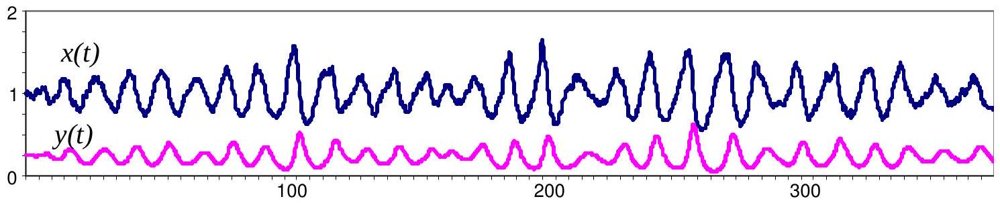

Как и в случае линейного стохастического осциллятора, колебательный режим продолжается и при наличии затухания (параметр $\lambda$ ). Однако это колебание оказывается квазипериодическим с плавающим периодом и амплитудой.

В природе не происходит гладких колебаний численности популяций. Их динамика существенно стохастична. При этом стохастичность не является "досадным" шумом, который искажает теоретически гладкую динамику, а приводит к эффекту появления колебаний, когда в детерминированной системе они исчезают. Ограниченность пищевых ресурсов кроликов играет стабилизирующую роль в системе, ослабляя атто-лисий эффект.

## Глава 8

## Стохастическое общество

В этой главе собраны некоторые примеры применения стохастических методов к финансовым рынкам и экономике. Волатильный характер цен и экономических индикаторов приводит к тому, что динамика соответствующих систем является существенно стохастической, и член $\delta W$ в уравнениях Ито играет ведущую роль.

Сначала мы сделаем небольшой экскурс в финансовые рынки и эмпирические свойства цен финансовых инструментов. Затем рассмотрим теорию диверсификации и бета - коэффициенты. Стохастические методы оказываются очень полезными при изучении сложных финансовых инструментов. Примером такого инструмента является опцион. Мы рассмотрим основные его свойства и двумя различными способами выведем формулу Блэка-Шоулза. После этого будет рассмотрена простая однофакторная модель кривой доходности.

## 8.1 Финансовые рынки

Достаточно условно финансовые рынки можно разделить на четыре основные группы:

- Рынок акций (stock market), или фондовый рынок, представляет собой биржевую и внебиржевую торговлю корпоративными правами. Акционерные общества при помощи проведения дополнительных эмиссий акций могут привлекать средства для развития своего бизнеса. Молодые компании получают стартовый капитал, продав часть уставного фонда (IPO). Акционеры компании рассчитывают на то, что стоимость их акций со временем повысится, а часть прибыли будет выплачиваться в качестве дивидендов.
- Рынок облигаций (bond market) позволяет компаниям и государству получать денежные средства у инвесторов под фиксированный процент. Процентная ставка, возникающая на рынке облигаций, определяет стоимость денег, которые направляются на расширение бизнеса компании. Выпуск облигаций - это более дорогой способ привлечения средств, чем эмиссия акций, однако при этом не происходит размывания капитала уже существующих инвесторов. Покупатель облигации получает фиксированный доход, за исключением случаев банкротства компании или объявления дефолта государством.
- Валютный рынок (foreign exchange market) представляет собой сообщество банков и других финансовых организаций, осуществляющих операции по конвертации одной валюты в другую. Валютный рынок работает круглосуточно. Три основные группы участников рынка - это импортёры, которые покупают иностранную валюту, и экспортёры, которые её продают. Кроме них, в современном мире весомую роль играют финансовые компании, изменяющие состав своих портфелей, переходя из рынка одной страны на рынок другой. Их влияние на курсы валют очень велико.
- Товарные рынки (commodity market) - это организованные площадки по торговле стандартизированными видами товаров. К таковым относятся нефть, золото, серебро, зерно, кофе и т.п. Каждый вид товара имеет чёткий стандарт качества, за которым следит биржа. Именно стандартизация превращает товарный контракт в финансовый инструмент со свойствами, которые присущи всем остальным финансовым активам.

На финансовых рынках торгуются как "cпотовые" финансовые инструменты $=$ активы (акции, валюта и т.д.), так и производные от них деривативы (фьючерсы и опционы).

$\Phi_{b \imath \text { черс }}$ (futures) - это контракт (обязательство) на покупку или продажу актива в определённый момент в будущем. Если акция сегодня стоит $100 \$$ ( цена на споте), то два контрагента могут договориться о том, что один купит, а другой, соответственно, продаст эту акцию по цене, например, $110 \$$ ( фъючерсная иена) с поставкой через один год. Иногда реальная передача акции может не происходить. Тогда фьючерсный контракт становится разновидностью пари, при котором одна сторона выплачивает другой сумму, равную разности между фьючерсной и фактической ценой акции на момент исполнения контракта. Например, через год цена акции оказывается равной $90 \$$. В этом случае покупатель должен будет выплатить продавцу чистую разницу в $20 \$=110-90$.

Гарантом подобных сделок выступает клиринговая палата биржи. Для заключения фьючерсного контракта и продавец, и покупатель должны перечислить на свой биржевой счёт определённую сумму (начальную маржу). Именно она используется клиринговой палатой для выплаты дохода стороне, которая "выиграла пари". В зависимости от волатильности цены актива, лежащего в основе фьючерса, начальная маржа может составлять порядка $5-10 \%$ от его текущей стоимости. Если покупатель купил фьючерсный контракт (занял длинную позицию), а продавец, соответственно, продал фьючерс (занял короткую позицию), то в дальнейшем они не взаимодействуют друг с другом. Порядок всех расчётов на себя принимает биржа. Фьючерсная цена в результате торгов ежедневно изменяется. Если, при неблагоприятном её движении, позиция начинает приносить убыток, необходимо довносить средства на биржевой счёт. В любой момент до даты поставки открытая позиция может быть "закрыта" путём покупки или продажи встречного контракта.

Onu,uou - это контракт, который дает его обладателю право купить (опционы call $=$ колл) или продать (опционы put $=$ пут) некоторый актив по оговоренной цене исполнения $x_{s}$ (strike price) в определенное время в будущем (дата истечения). В отличие от фьючерса, опцион - это право, а не обязательство, поэтому покупатель от него может отказаться. Тот же, кто продал (выписал) опцион, берёт на себя обязательство исполнить его по требованию владельца опциона. В случае европейского опицона дата реализации права фиксирована. Для американского, владелец может воспользоваться своим правом в любой момент до даты истечения. Оба вида опционов могут торговаться в любой стране.

- Ключевым параметром финансового инструмента является его цена $x_{t}$. Именно её колебания служат отличной областью приложения стохастических процессов и источником прибыли или убытка для участников рынка. Изменение цены или доходность финансового актива можно измерять при помощи логарифмического отношения ( $\lessdot \mathrm{C}_{6}$ ) цен в начале $x_{t-1}$ и конце $x_{t}$ временного периода:

$$
r_{t}=\ln \frac{x_{t}}{x_{t-1}}=\ln x_{t}-\ln x_{t-1}
$$

В качестве периода может выступать день, час, минута и т.д.
Простейшей моделью динамики цены является логарифмическое блуждание. Предположим, что за день относительное изменение цены составляет $r_{n}=\ln \left(x_{n} / x_{n-1}\right)$. Тогда через $n$ дней, начиная с цены $x_{0}$, мы придём к значению:

$$
x_{n}=x_{n-1} \exp r_{n}=x_{0} \exp \left(r_{1}+\ldots+r_{n}\right)=x_{0} \exp (r) .
$$

Цена при подобном блуждании всегда остаётся положительной. Если случайные числа $r=\mu+\sigma ε$ являются независимыми гауссовыми величинами со средним $\mu$ и волатильностью $\sigma$, то среднее значение будущей цены равно:

$$
\left\langle x_{n}\right\rangle=x_{0} e^{\mu+\sigma^{2} / 2}
$$

Цена в среднем не будет изменяться (мартингал), если доходность отрицательна: $\mu=-\sigma^{2} / 2$.

Непрерывным аналогом логарифмического блуждания будет процесс следующего вида (стр. 58):

$$
d x=\mu x d t+\sigma x \delta W
$$

В этом случае $\bar{x}(t)=x_{0} e^{\mu t}$, и если $\mu=0$, то $\bar{x}(t)=x_{0}$.
Волатильность $\sigma$ и среднюю доходность $\mu$ обычно измеряют в годовых величинах (т.е. усредняя годовые изменения цен). Поэтому, если время $t$ задано в долях года, то доходность за период $t$ будет равна $\mu_{t}=\mu t$, а волатильность $\sigma_{t}=\sigma \sqrt{t}$.

При рассмотрении, например, эволюции численности популяции стохастическое воздействие было важной, но всё же поправкой к детерминированной динамике. На финансовых рынках стохастика является главной особенностью системы, и волатильность изменения цены обычно существенно выше, чем долгосрочный её снос. Так, типичный рост фондового рынка составляет около $\mu=7 \%$ в год, тогда как годовая волатильность $\sigma=16 \%$ (в спокойные периоды).

- Почему рынки волатильны? Это фундаментальный вопрос всей финансовой теории. Простейшее объяснение, связанное с непрогнозируемым воздействием на рынки со стороны внешних факторов (экономические, политические новости, отчеты компаний и т.п.), - лишь часть правды.

Во-первых, рынки очень часто неадекватно реагируют на новости. Если они внутренне готовы к движению в соответствующем направлении, то любые, самые незначительные события это движение вызовут. И наоборот, иногда достаточно серьезные новости никак не сказываются на ценах. При этом аналитики, журналисты, а вслед за ними участники рынка умудряются повторять абсолютно фантастические объяснения того, почему чёрное на самом деле является белым, и наоборот.

Во-вторых, новости бывают разными. В течение недели или даже дня могут приходить сообщения с диаметрально противоположным позитивом. И только Рынок знает, на что он действительно отреагирует.

Волатильность может возникать из-за случайных внутренних факторов. Иногда крупные игроки пересматривают состав своих инвестиционных портфелей, уходят с рынка или возвращаются на него. Однако эти события являются относительно незначительными и служат, скорее, небольшим толчком для Рынка. Откликнется ли он на него, заранее предсказать очень сложно. Наконец, волатильность может быть присуща динамике самого Рынка, особенно если уравнения, описывающие эту динамику, являются нелинейными и обладают хаотическим режимом поведения (т.н. детерминированный хаос).

Волатильность рынков - явление неизбежное. Понятно, что, если цена всё время достаточно быстро растёт, любой купивший этот инструмент получит гарантированную прибыль. Однако вечных финансовых двигателей не бывает. Финансовые рынки, в конечном итоге, являются сообществом разумных существ, объединение которых посредством синхронизирующего влияния цен и другой информации приводит к образованию очень сложной системы. Она отражает психологию отдельного человека и в то же время обладает собственным уникальным поведением, часто неблагозвучно называемым "психологией толпы".

Рынки очень субъективны, суеверны, подвержены массовым фобиям и заблуждениям. Очень часто ложные экономические и финансовые теории, принятые всеми, становятся вполне объективными, воздействуя на рынок. При этом не важно, верны ли теории - важно, верят ли в них на данном этапе. Эта субъективность и составляет природу рынков.

## 8.2 Эмпирические закономерности

- Фрактальность. Если построить графики динамики цен на различных временных интервалах и закрыть ось времени, то даже самый опытный трейдер, скорее всего, не отличит месячный график от минутного. Ниже приведен курс EUR к USD. На первом рисунке каждая точка является ежедневным курсом, на втором - часовым, и на третьем - ежеминутным:
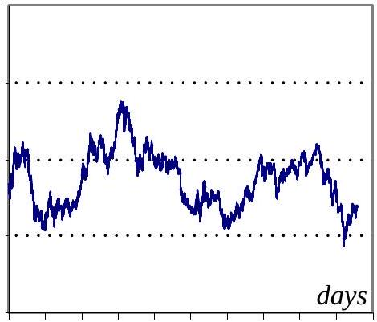
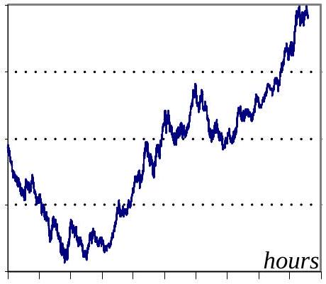
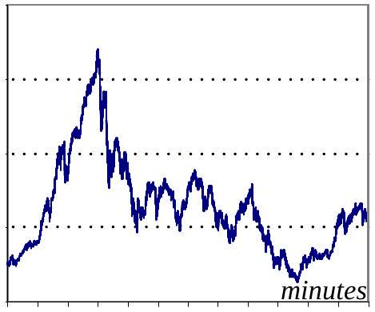

Фрактальность - это самоподобность объекта или процесса на различных масштабах. Такие непрерывные стохастические процессы, как броуновское блуждание, автоматически обладают свойством фрактальности.

- Отсутствие памяти. Если вычислить корреляционные коэффициенты между изменением цены вчера и сегодня, мы получим (в рамках статистической погрешности) нулевое значение. Ниже в таблице приведены автокорреляции ежедневных доходностей индекса S\&P500 со сдвигом от одного до восьми дней $c_{k}=\operatorname{cor}\left(r_{t}, r_{t-k}\right)$ :

|  | $n$ | $c_{1}$ | $c_{2}$ | $c_{3}$ | $c_{4}$ | $c_{5}$ | $c_{6}$ | $c_{7}$ | $c_{8}$ |
| :--- | ---: | ---: | ---: | ---: | ---: | ---: | ---: | ---: | ---: |
| $1950-2006$ | 14338 | $\mathbf{0 . 0 9}$ | -0.02 | -0.01 | 0.01 | -0.02 | -0.02 | -0.03 | 0.01 |
| $1950-1959$ | 2510 | $\mathbf{0 . 0 9}$ | $\mathbf{- 0 . 1 0}$ | -0.01 | 0.05 | 0.01 | -0.02 | -0.03 | 0.05 |
| $1960-1969$ | 2489 | $\mathbf{0 . 1 5}$ | -0.03 | 0.04 | 0.07 | 0.01 | -0.01 | 0.03 | 0.04 |
| $1970-1979$ | 2526 | $\mathbf{0 . 2 5}$ | -0.01 | 0.02 | 0.00 | -0.03 | -0.06 | -0.01 | -0.01 |
| $1980-1994$ | 3791 | $\mathbf{0 . 0 8}$ | 0.03 | -0.01 | -0.02 | -0.01 | -0.02 | -0.04 | -0.01 |
| $1995-2003$ | 2267 | -0.01 | -0.03 | -0.03 | 0.01 | -0.05 | -0.01 | -0.04 | 0.01 |
| $2004-2006$ | 775 | -0.03 | -0.08 | 0.02 | -0.03 | 0.01 | -0.01 | -0.02 | -0.04 |

Видно, что значения автокорреляций очень малы. Стандартная ошибка их вычисления по $n$ наблюдениям равна $1 / \sqrt{n}$. С вероятностью 0.68 отклонение выборочной автокорреляции от истинной составляет одну стандартную ошибку, а с вероятностью 0.96 - две. Жирным шрифтом отмечены значения, которые можно статистически значимо считать отличными от нуля. Так, за весь период корреляция вчерашнего и сегодняшнего изменения цены $c_{1}$, с точки зрения формального статистического подхода, имеет отличное от нуля значение $0.09 \pm 0.01$. Однако этот результат связан с действительно высокой автокорреляцией в прошлом (1960-1980). В настоящее время значимой короткой памяти у рынка нет.

- Память волатильности. В отличие от доходностей, между их квадратами $r_{t}^{2}$ или модулями $\left|r_{t}\right|$ существуют заметные автокорреляции. Можно рассматривать автокоррелограммы между самыми различными мерами, характеризующими абсолютную величину изменения цены, а не её знак. Это могут быть волатильности, вычисленные за небольшие неперекрывающиеся интервалы времени $\sigma_{t}$, амплитуда размаха цены $a= \ln H / L$, где $H$ - максимальное, а $L$ - минимальное значение за период, или комбинированные меры, например, $v=a-|r| / 2$.
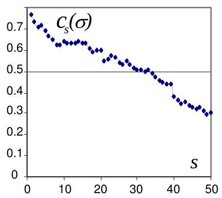
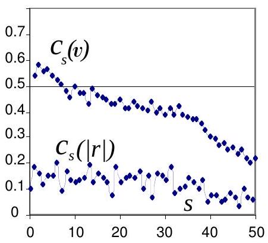
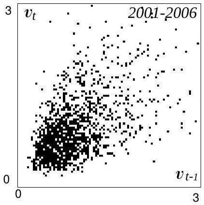

Выше приведены коррелограммы $c_{s}(v)=\operatorname{cor}\left(v_{t}, v_{t-s}\right)$ для различных мер ежедневной волатильности и точечная диаграмма для двух последовательных дней, которая имеет характерную форму кометы. В качестве данных использовался курс EUR против USD за период 2004-2008 годов.

- Не совсем гауссовость. Если изучить свойства эмпирического распределения для доходностей некоторого финансового инструмента, то оно, скорее всего, окажется не гауссовым. Типичное распределение выглядит следующим образом:
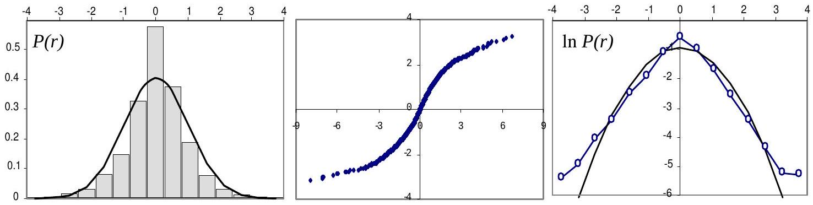

На первом рисунке приведена стандартная гистограмма, а тонкая линия соответствует распределению Гаусса. На третьем графике то же в логарифмическом масштабе. Второй график является графом нормальной вероятности ( $\lessdot \mathrm{C}_{29}$ ). Эмпирическое распределение обычно имеет заметный эксцесс и асимметрию. Его хвосты (асимптотическое поведение плотности вероятности) являются "толстыми", т.е. лежат выше графика нормального распределения. В результате существенные отклонения доходности от среднего значения происходят чаще, чем в "нормальном случае".

- Крахи и миникрахи. Одна из причин (или следствий $\underset{-}{\text { ) негаус- }}$ совости распределения вероятностей доходностей - это возникновение на рынке так называемых крахов, проявляющихся чаще всего в обвальном падении цен на один или множество схожих финансовых активов.

Самыми запоминающимися являются однодневные обваль. С начала 1987 г. фондовый рынок Америки рос ускоренными темпами (около $40 \%$ годовых). В результате пузырь сокрушительно лопнул. За один день, в понедельник 19-го октября 1987 года, индекс S\&P500 обрушился более чем на $20 \%$ (левый рисунок):
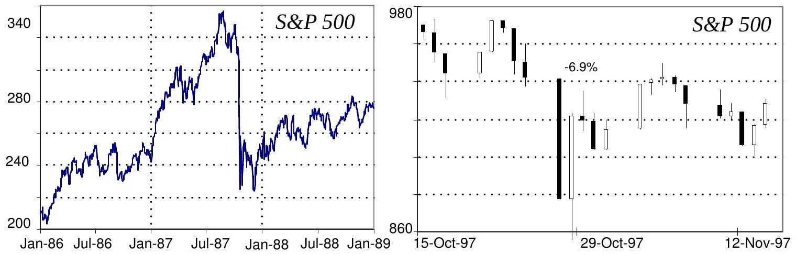

События меньшего масштаба, но всё же очень неприятные, происходят на рынке достаточно часто. На правом рисунке приведен пример "празднования" десятилетия октябрьского краха 1987-го ( ⟵ $\mathrm{C}_{30}$ ).

- Скоррелированность рынков. Цены финансовых инструментов имеют сильно скоррелированную динамику. Если предсказать изменения цены за два последовательных периода очень сложно, то изменение цен различных активов за один интервал времени связаны очень тесно. Положительные "настроения" в течение дня, скорее всего, приведут к росту акций большинства компаний, и наоборот.

Ниже на рисунке представлена динамика фондовых индексов S\&P500 (США) и FTSE (Великобритания) за период 1991-2007:
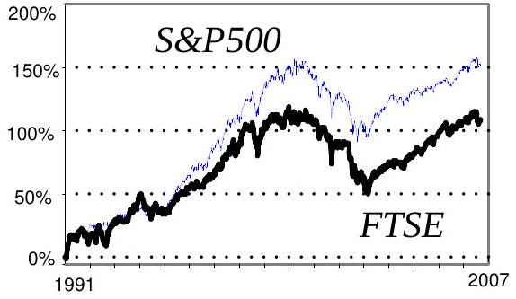

|  | $\bar{r}_{i}$ | $\sigma_{i}$ | SP500 | XOM | GE | C | MSFT |
| :--- | ---: | ---: | ---: | ---: | ---: | ---: | ---: |
| SP500 | 10 | 13 |  | 0.63 | 0.74 | 0.75 | 0.63 |
| XOM | 22 | 20 | 0.63 |  | 0.41 | 0.40 | 0.31 |
| GE | 11 | 17 | 0.74 | 0.41 |  | 0.59 | 0.50 |
| C | 0 | 20 | 0.75 | 0.40 | 0.59 |  | 0.42 |
| MSFT | 10 | 21 | 0.63 | 0.31 | 0.50 | 0.42 |  |

Хорошо видна синхронность их поведения. Справа от рисунка приведены корреляционные коэффициенты ежедневных изменений цен акций нескольких крупнейших американских компаний (период 2003-2007, $n=$ 1258) и их годовая доходность и волатильность.

- Нестационарность рынков. Наверное, наиболее характерным свойством рынков является их нестационарность. Статистические парамеры случайного блуждания цены изменяются со временем. Например, при обсуждении "отсутствия памяти" мы видели, что первый автокорреляционный коэффициент $c_{1}=\operatorname{cor}\left(r_{t}, r_{t-1}\right)$ с 1950 года претерпел заметную эволюцию.

Ещё более заметно нестационарность проявляется для волатильности рынка, которая характеризует степень его "нервозности". Рассмотрим типичные значения ежедневных доходностей для цены финансового инструмента. Ниже слева они представлены в виде столбиков (вверх $r>0$, вниз $-r<0$ ). Для сравнения справа приведены стационарные случайные числа с гауссовым распределением:
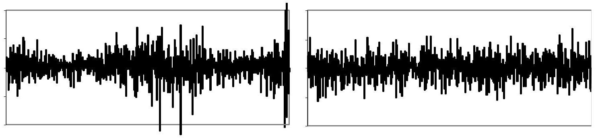

Видно, что "ёжик" доходности реальных цен значительно менее однородный. Периоды низкой волатильности (маленькие столбики) чередуются со значениями высокой волатильности. Зависимость волатильности от времени можно восстанавливать при помощи различных методик. Ниже приведен пример такого вычисления $\sigma(t)$ для индекса $\mathrm{S} \& \mathrm{P} 500$ :
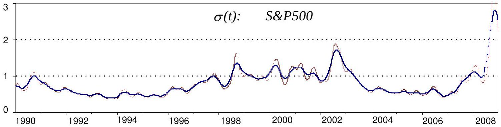

Видно, что $\sigma(t)$ изменяется в несколько раз.
Учёт нестационарности волатильности позволяет дать простое оббяснение описанному выше эффекту памяти волатильности и негауссовости распределения. Аккуратное выделение долгосрочной динамики $\sigma(t)$ полностью устраняет память волатильности и существенно снижает не гауссовость распределения доходностей. Более подробное обсуждение этих вопросов выходит за рамки книги. Детали можно найти в статье автора "Пластичность волатильности", доступной через Интернет.

## 8.3 Диверсификация

Участники рынка редко покупают только один финансовый инструмент. Чаще они формируют инвестиционный портфель, содержащий в своём составе много различных активов, например, акций. Поэтому перед инвестором стоит задача выбора оптимального состава портфеля.

Изменения цены любой акции в два последовательных момента времени практически независимы. Однако между собой изменения цен различных акций за один и тот же период времени часто оказываются существенно скоррелированными. Этот факт необходимо учитывать при формировании портфеля.

Рассмотрим $n$ компаний, акции которых можно купить на рынке. Пусть изменение цены акции $i$-й компании характеризуется логарифмической доходностью $r_{i}(t)=\ln \left(x_{i}(t) / x_{i}(t-1)\right) \approx d x_{i} / x_{i}$. Доходность $r_{i}(t)$ может включать также дивидендный доход. Везде в этом разделе нижний индекс обозначает номер компании, а не момент времени.

При формировании портфеля необходимо принять решение, какую долю $w_{i}$ имеющихся денег П потратить на покупку акций $i$-той компании. Если её цена равна $x_{i}$ и их куплено $N_{i}$ штук, то $w_{i}=N_{i} x_{i} / \Pi$. Сумма всех долей в портфеле должна равняться единице:

$$
\Pi=\sum_{i=1}^{n} N_{i} x_{i} \quad=>\quad \sum_{i=1}^{n} w_{i}=w_{1}+w_{2}+\ldots+w_{n}=1
$$

Примем модель, в которой последовательные доходности данной акции являются независимыми стационарными случайными числами, имеющими среднее $\bar{r}_{i}$ и волатильность $\sigma_{i}$. Тогда и суммарная доходность портфеля из $n$ акций за фиксированный период времени также будет случайной величиной:

$$
r=\sum_{i=1}^{n} w_{i} r_{i}=w_{1} r_{1}+w_{2} r_{2}+\ldots+w_{n} r_{n}
$$

имеющей своё среднее значение:

$$
\begin{equation*}
\bar{r}=\sum_{i=1}^{n} w_{i} \bar{r}_{i} \tag{8.1}
\end{equation*}
$$

и волатильность:

$$
\begin{equation*}
\sigma^{2}=\left\langle(r-\bar{r})^{2}\right\rangle=\sum_{i, j=1}^{n} w_{i} w_{j}\left\langle\left(r_{i}-\bar{r}_{i}\right)\left(r_{j}-\bar{r}_{j}\right)\right\rangle=\sum_{i, j=1}^{n} w_{i} D_{i j} w_{j} \tag{8.2}
\end{equation*}
$$

где $D_{i j}$ - ковариационные коэффициенты доходностей между акциями $i$-й и $j$-й компаний.

Выбрав в портфеле тот или иной набор весов $w_{1}, \ldots, w_{n}$, мы для него получим некоторую среднюю доходность $\bar{r}$ и волатильность $\sigma$. Если перебрать все возможные портфели, то на плоскости ( $\sigma, \bar{r}$ ) получится похожая на зонтик область, называемая достижимым множеством:
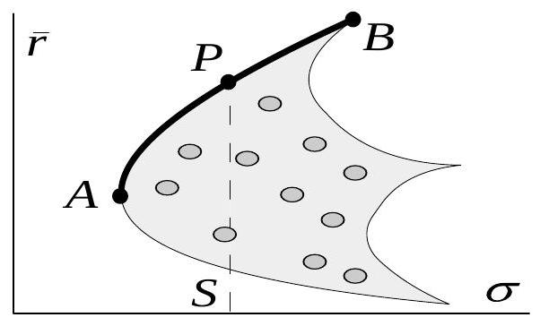

Из достижимого множества выбирается такой портфель, который при фиксированной волатильности имеет максимальный доход, или при фиксированной доходности - минимальную волатильность. Таким портфелям на рисунке соответствует кривая $A B$, так называемое эффективное множество. Действительно, зафиксировав $\sigma$ (точка $S$ ) и поднимаясь вдоль прямой $S P$ для получения наибольшего дохода, мы попадём в точку $P$ на кривой $A B$. Аналогичное рассуждение справедливо и при движении в горизонтальном направлении.

Кривая $A B$ явным образом отражает расхожее эмпирическое утверждение о том, что чем больше доход, тем выше риск, и наоборот. При этом: мерой измерения риска служит волатильность портфеля. Интуитивно это понятно. Чем больше волатильность, тем более вероятны существенные отклонения доходности портфеля от среднего, в том числе и в отрицательную область убытков.

- Инвестор имеет определенную свободу в выборе точки на кривой эффективного множества. Однако эта свобода исчезает, если помимо покупки акций планируется разместить часть средств в некоторый актив с гарантированной доходностью $r_{f}$ (risk-free). В качестве такого актива может выступать, например, банковский депозит или надежная облигация.

Предположим, что инвестор выбрал портфель акций с доходностью $r_{M}$ и волатильностью $\sigma_{M}$. Тогда комбинацию из этого портфеля и безрискового депозита можно рассматривать, как новый портфель из двух активов. Один - с параметрами $\left(\sigma_{M}, \bar{r}_{M}\right)$, другой - с ( $0, r_{f}$ ). Депозит имеет нулевую волатильность и нулевую корреляцию с портфелем, так как независимо от ситуации на рынке он всегда приносит один и тот же доход $r_{f}$.

Пусть в акции вложена часть денег $w_{1}=w$, а остальные $w_{2}=1-w$ размещены в безрисковом активе. Тогда уравнения (8.1), (8.2) для двух активов имеют вид:

$$
\begin{aligned}
\bar{r} & =w r_{M}+(1-w) r_{f} \\
\sigma & =w \sigma_{M}
\end{aligned}
$$

Исключая $w=\sigma / \sigma_{M}$, получаем уравнение прямой:

$$
\begin{equation*}
\bar{r}(\sigma)=r_{f}+\frac{r_{M}-r_{f}}{\sigma_{M}} \sigma . \tag{8.3}
\end{equation*}
$$

Эта прямая должна проходить как можно выше, т.е. при фиксированной волатильности давать максимальный доход. Одна её точка $\left(0, r_{f}\right)$ закреплена, а другая находится внутри множества портфелей. Поэтому выше всех (самая доходная) будет прямая, касающаяся сверху эффективной границы:
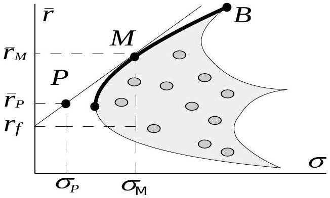

Точка касания $M$ - "касательный портфель" - однозначно определяется безрисковой ставкой $r_{f}$ и статистическими параметрами акций. Эффективным множеством теперь становится отрезок $r_{f} M$ и его "продолжение" $M B$ по граничной кривой эффективного множества.

Таким образом, в случае размещения в безрисковом активе даже небольшой части средств инвестора наиболее оптимальным портфелем акций оказывается касательный портфель. Рациональный инвестор может управлять своими рисками только путём выбора доли $w$ средств, которые он вкладывает в акции, но не структурой этого портфеля. Достаточно неожиданный для интуиции результат!

Касательный портфель $M$ представляет собой выделенную точку эффективного множества. Он соответствует максимально возможному наклону прямой:

$$
k=\frac{\bar{r}-r_{f}}{\sigma}=\max .
$$

Это отношение называется коэффициентом Шарпа.

- Доходности акций сильно скоррелированы. Поэтому иногда используют модель линейной зависимости доходности акции и рынка в целом:

$$
\begin{equation*}
r_{i}=\alpha_{i}+\beta_{i} r_{M}+\xi_{i} \tag{8.4}
\end{equation*}
$$

где $r_{i}-$ ежедневное или еженедельное изменение цены (доходность) $i$-той акции, а $r_{M}$ - изменение фондового индекса, такого, как S\&P500 или Dow. Величины $\xi_{i}$ считаются случайными воздействиями на конкретную бумагу, не зависящими от рыночных колебаний $r_{M}$, т.е. $\left\langle r_{M} \xi_{i}\right\rangle=\left\langle r_{M}\right\rangle\left\langle\xi_{i}\right\rangle$. Это линейная модель (стр. 24), поэтому наклон прямой, характеризующий чувствительность изменения цены $i$-й бумаги к изменению цены рынка в целом (бета - коэффициент), равен:

$$
\beta_{i}=\frac{\left\langle\left(r_{i}-\bar{r}_{i}\right)\left(r_{M}-\bar{r}_{M}\right)\right\rangle}{\sigma_{M}^{2}}
$$

Значения коэффициента $\beta_{i}$ не ограничены пределами $[-1 . .1]$. Если бета больше единицы ( $\sigma_{i}>\sigma_{M}$ ), это означает, что бумага в момент падения рынка, скорее всего, также упадет, причем сильнее, чем рынок, а при росте, наоборот, - обгонит его. Отрицательные беты (крайне редкое явление) и положительные средние доходности $\bar{r}_{i}$ дают возможность инвестировать в бумаги, судьба которых развивается в противофазе с рынком. Бумаги с $\beta_{i}<1$ называют оборонительными.

Переход к линейной модели (8.4) позволяет существенно упростить вычисление ковариационных коэффициентов в портфельной теории:

$$
\left\langle\left(r_{i}-\bar{r}_{i}\right)\left(r_{j}-\bar{r}_{j}\right)\right\rangle=\beta_{i} \beta_{j} \sigma_{M}^{2}+\xi_{i j}, \quad \xi_{i j}=\left\langle\left(\xi_{i}-\bar{\xi}_{i}\right)\left(\xi_{j}-\bar{\xi}_{j}\right)\right\rangle .
$$

В частности:

$$
\sigma_{i}^{2}=\beta_{i}^{2} \sigma_{M}^{2}+\sigma_{\xi_{i}}^{2}
$$

Говорят, что волатильность акции состоит из двух составляющих - общерыночного риска $\beta_{i}^{2} \sigma_{M}^{2}$ и собственного риска бумаги $\sigma_{\xi_{i}}^{2}=\xi_{i i}$.

Если пренебречь величинами $\xi_{i j}$, то волатильность портфеля (8.2), составленного из $n$ акций с весовыми коэффициентами $w_{i}$, будет равна:

$$
\sigma^{2}=\sum_{i, j=1}^{n} w_{i} w_{j}\left\langle\left(r_{i}-\bar{r}_{i}\right)\left(r_{j}-\bar{r}_{j}\right)\right\rangle=\sigma_{M}^{2} \sum_{i, j=1}^{n} w_{i} w_{j} \beta_{i} \beta_{j}=\left[\sigma_{M} \sum_{i=1}^{n} w_{i} \beta_{i}\right]^{2} .
$$

Вместо квадратичной проблемы оптимизации получается задача линейного программирования, т.е. поиск максимума выражения $\bar{r}=\sum w_{i} \bar{r}_{i}$ при ограничениях $\sum w_{i}=1, \sum w_{i} \beta_{i}=\sigma / \sigma_{M}$ и $0 \leqslant w_{i} \leqslant 1$. Решая задачу для различных $\sigma$, мы получим эффективное множество $\bar{r}(\sigma)$. Естественно оно будет несколько отличаться от точного, найденного из соотношений (8.1), (8.2).

## 8.4 Портфель на всю жизнь

- Пусть инвестор начинает свою карьеру с капитала 0 . Он формирует портфель из $n$ акций, цены $x_{i}(t)$ которых стохастическим образом изменяются со временем. Поэтому его капитал также изменяется, как $П(t)$. Естественно, обогащение не является самоцелью, и за каждую единицу времени $d t$ он потребляет часть капитала, максимизируя своё удовольствие $\ddot{\cdot}$. Какова в этом случае оптимальная стратегия инвестирования? Эту задачу изучали в 1969 г. Роберт Мертон и Пол Самуэльсон.

Если количество акций каждого вида в портфеле равно $N_{i}(t)$, то изменение его стоимости за малый интервал времени после изъятия равно:

$$
d \Pi=\sum_{i=1}^{n} N_{i}(t) d x_{i}-c(t) \Pi(t) d t
$$

Мы для простоты считаем, что потребление $c(t) П(t)$ пропорционально капиталу. Мертон на самом деле доказал это утверждение.

Пусть цены на акции испытывают стационарное логарифмическое блуждание:

$$
\frac{d x_{i}}{x_{i}}=\mu_{i} d t+\sum_{j=1}^{n} \sigma_{i j} \delta W_{j}
$$

где $\mu_{i}$ - доходности акций, а матрица $\sigma_{i j}$ определяет их ковариации. В этом разделе по повторяющимся индексам суммирование не подразумевается, если это явно не указано знаком суммы. Подставляя $d x_{i}$ в уравнение портфеля и вводя веса $w_{i}=N_{i} x_{i} / \Pi$ каждой акции, получаем нестационарное логарифмическое блуждание:

$$
\begin{equation*}
\frac{d \Pi}{\Pi}=f(t) d t+s(t) \delta W \tag{8.5}
\end{equation*}
$$

Снос и волатильность портфеля определяются соотношениями:

$$
f(t)=\sum_{i=1}^{n} \mu_{i} w_{i}(t)-c(t), \quad s^{2}(t)=\sum_{i, j=1}^{n} w_{i}(t) D_{i j} w_{j}(t)
$$

где $\mathbf{D}=\sigma \cdot \sigma^{T}$ - ковариационная матрица. Переход от нескольких стохастических переменных $\delta W_{i}=\varepsilon_{i} \sqrt{d t}$ к одной $\delta W=\varepsilon \sqrt{d t}$ мы сделали стандартным образом:

$$
\sum_{i, j=1}^{n} w_{i}(t) \sigma_{i j} \varepsilon_{j} \sqrt{d t}=s(t) \varepsilon \sqrt{d t}
$$

Сумма $n$ гауссовых чисел - снова гауссово число, множитель перед которым находится после возведения в квадрат и усреднения.

- Вес $w_{i}(t)$ каждой акции в портфеле и удельное потребление $c(t)$ задаются инвестором. В результате функции $f(t)$ и $s(t)$ в уравнении (8.5) являются фиксированными. Переходя к $\ln П$ при помощи леммы Ито, имеем:

$$
d \ln \Pi=\left[f(t)-\frac{1}{2} s^{2}(t)\right] d t+s(t) \delta W
$$

Откуда, воспользовавшись (2.18), стр. 56, получаем точное решение:

$$
\ln \frac{\Pi(t)}{\Pi_{0}}=\int_{0}^{t}\left[f(\tau)-\frac{1}{2} s^{2}(\tau)\right] d \tau+\left[\int_{0}^{t} s^{2}(\tau) d \tau\right]^{1 / 2} \varepsilon
$$

где, как обычно, $\varepsilon$ - гауссова случайная величина с $\langle\varepsilon\rangle=0$ и $\left\langle\varepsilon^{2}\right\rangle=0$.

- Постоянное изъятие сумм $v=c(t) \Pi(t)$ обладает для инвестора определённой полезностью (utility) $U=U(v)$. Это понятие достаточно умозрительно, но очень популярно в экономической литературе. Основные гипотезы теории полезности состоят в том, что 1) функция $U(v)$ является выпуклой, и 2) она растёт медленнее линейной функции. Каждая дополнительная единица благ (выраженная в деньгах $v$ ), в любом случае, приносит удовольствие. Однако больше двух котлет не съешь и пяти бутылок вина не выпьешь. Поэтому постепенно, с увеличением $v$, дополнительной полезности получается всё меньше, и рост функции $U(v)$ замедляется. Часто функцию полезности выбирают в степенном виде $U(v)=v^{\gamma}$, с параметром $0<\gamma<1$ или в логарифмическом $U(v)=\ln v$. Рассмотрим вариант степенной зависимости.

Вычислим среднее значение полезности $U_{t}=\langle U(v)\rangle=c^{\gamma}(t)\left\langle\Pi^{\gamma}(t)\right\rangle$ в момент времени $t$. Усреднение проводится при помощи (1.11) на стр. 16:

$$
U_{t}=\Pi_{0}^{\gamma} c^{\gamma}(t) e^{\gamma \int_{0}^{t} f(\tau) d \tau+\frac{\gamma^{2}-\gamma}{2} \int_{0}^{t} s^{2}(\tau) d \tau}
$$

Подставляя явный вид функций $f(t)$ и $s(t)$, имеем:

$$
U_{t}=\Pi_{0}^{\gamma} c^{\gamma}(t) \exp \int_{0}^{t} \gamma\left[\sum_{i=1}^{n} \mu_{i} \omega_{i}(\tau)-c(\tau)-\frac{1-\gamma}{2} \sum_{i, j=1}^{n} w_{i}(\tau) D_{i j} w_{j}(\tau)\right] d \tau
$$

Выбор определённых стратегий инвестирования $\omega_{i}(\tau)$ и изъятия (потребления) $c(\tau)$ на протяжении времени $\tau=[0 \ldots t]$ приводит к некоторому среднему значению полезности в момент времени $t$. Однако получение максимальной сиюминутной полезности также не является главной целью инвестора. Так в чём же смысл его жизни?

- По Мертону и Самуэльсону, инвестор должен максимизировать суммарную дисконтированную полезность, получаемую на протяжении всей своей жизни. И если он не законченный эгоист, дополнительную полезность он получает от остаточного капитала, передаваемого по наследству. Математически это может быть выражено в следующем виде:

$$
\begin{equation*}
\int_{0}^{T} e^{-\rho \tau} U_{\tau} d \tau+\theta e^{-\rho T} U_{T}+\int_{0}^{T} \lambda(\tau)\left[1-\sum_{i=1}^{n} w_{i}(\tau)\right] d \tau=\max \tag{8.6}
\end{equation*}
$$

Первый интеграл суммирует все получаемые от изъятий средние полезности $U_{t}$. При этом параметр $\rho$ аналогичен ставке дисконтирования денежных потоков ( $\lessdot \mathrm{C}_{31}$ ). Чем позже получено удовольствие, тем меньше его вклад в смысл жизни. Второе слагаемое является полезностью завещаемого инвестором капитала (bequest valuation function) в финальный момент его жизни $T$. Параметр $\theta$ характеризует степень его не эгоистичности, и обычно предполагается небольшим $0<\theta \ll 1 \quad \ddot{-}$. Полезность от завещания имеет такую же функциональную форму, как и от потребления. В принципе, можно рассмотреть и другие зависимости. Последнее слагаемое появляется в соответствии с методом множителей Лагранжа $\lambda(t)$ (стр. 318). Мы ищем экстремум при дополнительном требовании равенства суммы весов единице в каждый момент времени.

- Найдём экстремум (стр. 320) функционала (8.6) по функциям $\lambda(t)$ и $\omega_{k}(t)\left(\lessdot \mathrm{H}_{47}\right)$ :

$$
\left\{\begin{array}{l}
1=\sum_{i=1}^{n} w_{i}  \tag{8.7}\\
\alpha=\mu_{k}-(1-\gamma) \sum_{i=1}^{n} D_{k i} \omega_{i}
\end{array}\right.
$$

где $\alpha$ пропорциональна множителю Лагранжа $\lambda$ и должна рассматриваться как $n+1$-я неизвестная переменная. Зависимость от времени отсутствует, и $w_{i}$ определяются из решения системы линейных уравнений. Теперь можно упростить выражение для средней полезности:

$$
U_{t}=\Pi_{0}^{\gamma} e^{z t} c^{\gamma}(t) G(t), \quad G(t)=e^{-\gamma \int_{0}^{t} c(\tau) \tau}
$$

где величина $z$ :

$$
z=\gamma \sum_{i=1}^{n} \mu_{i} \omega_{i}-\frac{\gamma-\gamma^{2}}{2} \sum_{i, j=1}^{n} w_{i} D_{i j} w_{j}
$$

зависит от статистических параметров акций, функции полезности и найденных из (8.7) постоянных весовых коэффициентов $\omega_{i}$.

- После подстановки оптимальных значений весов $\omega_{i}$ функционал для оптимизации принимает вид:

$$
\begin{equation*}
\int_{0}^{T} e^{(z-\rho) \tau} c^{\gamma}(\tau) G(\tau) d \tau+\theta e^{(z-\rho) T} c^{\gamma}(T) G(T)=\max \tag{8.8}
\end{equation*}
$$

Проварьируем его ( $\lessdot \mathrm{H}_{48}$ ) по функции удельного потребления $c(t)$ :

$$
c^{\gamma-1}(t) e^{(z-\rho) t} G(t)-\int_{t}^{T} e^{(z-\rho) \tau} c^{\gamma}(\tau) G(\tau) d \tau-\theta e^{(z-\rho) T} c^{\gamma}(T) G(T)=0
$$

Это интегральное уравнение относительно $c(t)$. Положив $t=T$, получаем граничное условие $c(T)=1 / \theta$. Если взять производную по времени, интегральное уравнение перейдёт в обычное уравнение логистического типа (1.2), стр. 10, с решением (при $\alpha \neq 0$ и $c(T)=1 / \theta$ ):

$$
\begin{equation*}
\dot{c}=-\nu c+c^{2} \quad=>\quad c(t)=\frac{\nu}{1+(\theta \nu-1) e^{\nu(t-T)}} \tag{8.9}
\end{equation*}
$$

где $\nu=(\rho-z) /(1-\gamma)$. Важным следствием (8.7) и (8.9) является то, что выбор портфеля не зависит от решения по стратегии изъятий.

- Рассмотрим частный случай, когда инвестору доступны только два актива - депозит с фиксированной доходностью $r_{f}$ и акция с волатильностью $\sigma$ и доходностью $r$. Доля средств размещаемых в депозите, равна $\omega_{1}=1-\omega$, а в акциях $\omega_{2}=\omega$. Матрицы дисперсий $D_{i j}$, доходности $\mu_{i}$ и весов $\omega_{i}$ имеют вид:

$$
\mathbf{D}=\left(\begin{array}{cc}
0 & 0 \\
0 & \sigma^{2}
\end{array}\right), \quad \mu=\binom{r_{f}}{r}, \quad \omega=\binom{1-\omega}{\omega}
$$

Решая систему (8.7), получаем:

$$
\omega=\frac{r-r_{f}}{(1-\gamma) \sigma^{2}}, \quad z=\gamma r_{f}+\frac{\gamma}{2} \frac{\left(r-r_{f}\right)^{2}}{(1-\gamma) \sigma^{2}}
$$

Мы видели (8.3), что в данном случае эффективное множество является прямой, соединяющей точки ( $0, r_{f}$ ) и ( $\sigma, r$ ). Выбор распределения средств между этими двумя активами выглядел абсолютно произвольным. Теория Мертона связывает значение веса $\omega$ и выпуклости полезности $\gamma$. Более подробный анализ теории пожизненного инвестирования целесообразно проследить по классической работе Мертона.

## 8.5 Опционы

Опционный контракт характеризуется ценой исполнения (strike price) $x_{s}$, датой истечения $T$ (expiry date) и текущей стоимостью (премией) $C$ (call) или $P$ (put). Предположим, что сегодня акция стоит $x_{0}=100 \$$. Её цена достаточно волатильна, и через год она может стоить как дороже $100 \$$, так и дешевле. Пусть на рынке можно купить опционный контракт call по цене $C=10 \$$ на право приобрести акцию за $x_{s}=90 \$$ через год. Тот, кто покупает контракт, платит продавцу $10 \$$. Это его максимальные расходы. Если через год акция на рынке будет стоить $x=115 \$$, то, купив её у выписавшего опционный контракт по $90 \$$ и тут же продав на рынке, владелец контракта заработает $115-90=25 \$$. За вычетом уплаченной премии его доход будет равен $15 \$$. Если же цена на рынке через год будет меньше, чем $90 \$$, от своего права покупать по $90 \$$ владелец откажется, зафиксировав убыток $10 \$$. Таким образом, величина дохода владельца call-контракта при существенном росте цены акции не ограничена, тогда как возможные убытки не превышают первоначально уплаченной премии. Для того, кто выписывает (продаёт) контракт, ситуация обратная. Он рискует получить неограниченные убытки, и, естественно, закладывает это в величину премии.

Премия опциона является его ценой и, как любая финансовая цена, оказывается очень волатильной. Однако, по мере приближения к дате истечения она стремится к определённому значению, которое называют внутренней стоимостью опциона. Рассмотрим её значение в момент истечения опциона в зависимости от текущей цены актива $x$ :
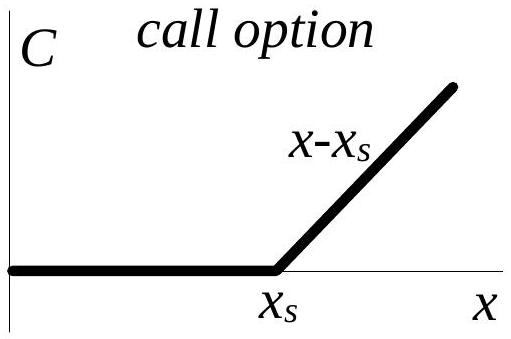
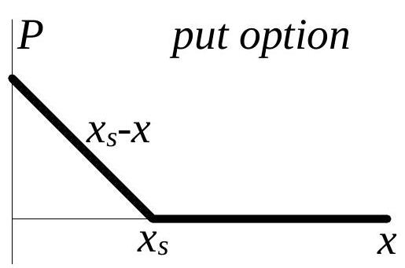

Если при истечении call-контракта цена актива $x$, лежащего в основе опциона, меньше цены исполнения $x_{s}$, то его владельцу нет смысла покупать актив, и такое право ничего не стоит. Если же цена актива $x$ на рынке выше, чем $x_{s}$, владелец call-опциона получает доход, равный разности рыночной цены актива и цены исполнения $x-x_{s}$. Это и есть стоимость опциона. Диаграммы стоимости опционов одновременно являются диаграммами дохода владельца опциона в момент его исполнения.

- Найдём общую формулу для справедливой цены европейского опциона в произвольный момент времени. Обычно для этого используют следующую идею. Предположим, никому достоверно не известно, вырастет актив или нет. Это означает, что его цена $x$ в момент исполнения, в среднем, должна быть такой же, как и сегодня $x=x_{0}$. Однако, в силу волатильности рынка существует распределение вероятностей $W(x)$ того, что $x$ будет иметь большее или меньшее значение, чем $x_{0}$. Будущая стоимость call-опциона равна усреднению всех возможных реализаций цены $x$ в момент истечения контракта:

$$
\begin{equation*}
\langle C\rangle=\int_{0}^{\infty} C(x) W(x) d x=\int_{0}^{x_{s}} 0 W(x) d x+\int_{x_{s}}^{\infty}\left(x-x_{s}\right) W(x) d x . \tag{8.10}
\end{equation*}
$$

Так как диаграмма стоимости опциона при его истечении представляет собой ломаную $\max \left(x-x_{s}, 0\right)$, то интеграл разбивается на два, первый из которых равен нулю. Таким образом, для call- и, аналогично, для putопционов среднее значение премий в момент истечения равно:

$$
\begin{equation*}
\langle C\rangle=\int_{x_{s}}^{\infty}\left(x-x_{s}\right) W(x) d x, \quad\langle P\rangle=\int_{0}^{x_{s}}\left(x_{s}-x\right) W(x) d x \tag{8.11}
\end{equation*}
$$

Подстановка в (8.11) той или иной плотности распределения вероятностей будущей цены $x$ будет давать различные формулы величины премии. Таким образом, премия опциона должна равняться величине, которая не позволяет ни покупателю, ни продавиу в среднем получить доход.
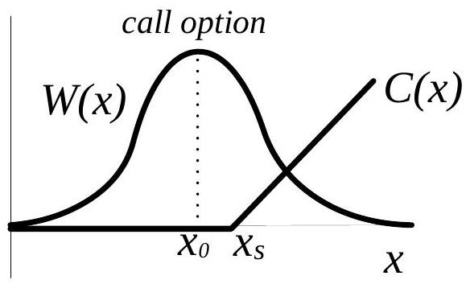
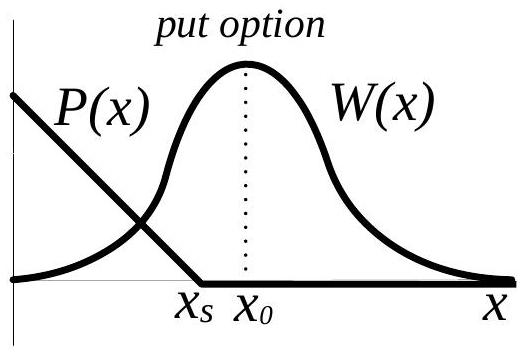

При увеличении страйковой цены $x_{s}$ ломаная линия внутренней стоимости call-опциона $C(x)=\boldsymbol{\operatorname { m a x }}\left(x-x_{s}, 0\right)$ сдвигается вправо. Поэтому значение интеграла и, следовательно, премия падает. При уменьшении $x_{s}$, наоборот, в зону "действия" колокола плотности распределения $W(x)$ попадает прямая $x-x_{s}$, и премия возрастает. Для put всё наоборот.

Аналогично, по мере приближения к дате истечения неопределённость будущей цены актива $x$ (ширина "колокола") уменьшается. Следовательно, премия call- и put- опционов уменьшается (при неизменном $x$ ).

- Понятно, что, если до истечения контракта еще есть время, стоимость опциона будет отличаться от его внутренней стоимости ( $I_{V}=$ intrinsic value). Надбавка к ней за счёт неопределенности значения цены актива в будущем называется временной стоимостью опциона: ( $T_{V}=$ time value).

$$
\text { Премия }=\text { Внутренняя стоимость }+ \text { Временная стоимость. }
$$

Графически это соотношение представлено двумя отрезками $T_{V}$ и $I_{V}$ на кривой цены опциона в некоторый момент до даты окончания контракта:
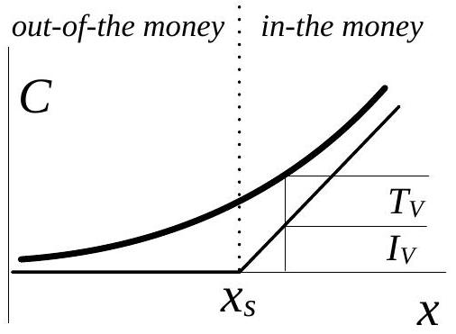
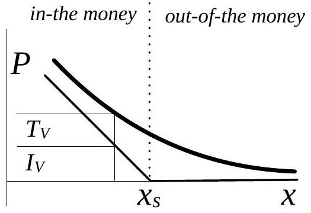

Говорят, что call-опцион находится "в денъгах" (in-the money), если текущая цена актива выше, чем страйковая $x_{0}>x_{s}$, иначе опцион "вне денег" (out-of-the money). Put-опцион имеет перевернутую относительно $x_{s}$ диаграмму стоимости, и его владелец зарабатывает при падении цены актива, поэтому для него терминология обратная.

- Вычтем уравнения (8.11) одно из другого и введём среднюю цену актива в будущем $\langle x\rangle$, которую на "эффективном рынке" обычно предполагают равной текущему значению $\langle x\rangle=x_{0}$. Тогда $\langle x\rangle+P-C=x_{s}$. Учёт стоимости денег вносит в это соотношение некоторые изменения.

Сформируем портфель, купив акцию за $x_{0}$, put-опцион на неё $+P$, и заняв короткую позицию по call-опциону " $-C$ ". Стоимость такого портфеля $x+P(x)-C(x)$ изменяется с изменением цены $x$, однако, независимо от её значения, в момент истечения контракта стоимость портфеля будет в точности равна страйковой котировке $x_{s}$. Действительно:

$$
x+P-C=\left\{\begin{array}{lll}
x+0 & -\left(x-x_{s}\right) & =x_{s} \\
x+\left(x_{s}-x\right)-0 & =x_{s} & x>x_{s} \\
x<x_{s}
\end{array} .\right.
$$

Таким образом, при формировании $x+P-C$ портфеля мы в будущем, через время $\tau$, гарантированно получим $x_{s}$. С учётом стоимости денег $r(\lessdot \mathrm{C}_{31}$ ) такой актив должен сегодня стоить $x_{s} e^{-r \tau}$. В результате получается простое равновесное соотношение:

$$
\begin{equation*}
x_{0}+P-C=x_{s} e^{-r \tau}, \tag{8.12}
\end{equation*}
$$

которое называют call-put napuтетом (call-put parity):

- Чувствительность премии (цены) опциона к изменению текущей котировки актива $x_{0}$ и уменьшению времени до его истечения характеризуют следующие коэффициенты:

$$
\Delta=\frac{\partial C}{\partial x_{0}}, \quad \Gamma=\frac{\partial^{2} C}{\partial x_{0}^{2}}, \quad \Theta=\frac{\partial C}{\partial t}
$$

Зная значения $\Delta$ и $\Gamma$, можно оценить, насколько изменится цена опциона при небольшом изменении котировки актива: $x-x_{0}$. Для этого необходимо разложить премию в ряд Тейлора:

$$
\begin{equation*}
C(x)=C_{0}+\Delta \cdot\left(x-x_{0}\right)+\frac{1}{2} \Gamma \cdot\left(x-x_{0}\right)^{2} . \tag{8.13}
\end{equation*}
$$

Подобная нелинейная зависимость $C(x)$ позволяет сформировать из опциона $C$ и актива $x$ портфель с определёнными свойствам. Купим callопцион (дающий право на одну акцию) и, взяв в долг $\Delta=\partial C / \partial x_{0}$ штук акций, продадим их на рынке (займём короткую позицию). Стоимость такого портфеля составит $\Pi(x)=C(x)-\Delta \cdot x$. Если цена акций увеличивается, то короткая позиция приносит убыток, однако стоимость опциона растёт, компенсируя его.

При малых отклонениях цены акции $x$ от начального значения $x_{0}$ премия будет меняться линейно: $C(x) \approx C_{0}+\Delta \cdot\left(x-x_{0}\right)$, а стоимость портфеля $C-\Delta \cdot x$ будет постоянной, так как изменение стоимости опциона полностью компенсируется изменением короткой позиции. Дельта единиц проданного актива на каждый опцион называется правилом дельта-хеджирования.

Рассмотрим, как изменится стоимость такого портфеля при учёте коэффициента $\Gamma$. Если спустя время $\tau$ после формирования портфеля цена акции изменилась с $x_{0}$ до $x$, то доход $R(x, \tau)=\Pi(x)-\Pi\left(x_{0}\right)$ дельтанейтрального портфеля можно разложить в ряд Тейлора по изменению цены и времени:

$$
R(x, \tau)=\frac{\Gamma}{2} \cdot\left(x-x_{0}\right)^{2}-\Theta \cdot \tau .
$$

Чем более сильные колебания происходят на рынке (в любую сторону!), тем больший доход мы получаем. Однако, если цена актива не изменяется ( $x \approx x_{0}$ ), то цена опциона уменьшается, и со временем этот портфель будет приносить убыток (последнее слагаемое).

Пусть на рынке ожидаются важные новости, но, приведут ли они к росту или падению, заранее не известно. Однако, если есть уверенность в неизбежности $\underset{-}{\sim}$ существенного движения цены, можно построить $\Delta$ нейтральный портфель и получить прибыль. Подобная стратегия называется вероятностным арбитражом.

## 8.6 Формула Блэка-Шоулза

- Найдём значение премии европейского опциона в рамках модели логарифмического блуждания:

$$
\begin{equation*}
x_{n}=x_{n-1} \exp \left(r_{n}\right)=x_{0} \exp \left(r_{1}+r_{2}+\ldots+r_{n}\right)=x_{0} \exp (r) . \tag{8.14}
\end{equation*}
$$

Если итоговая доходность через $n$ торговых дней является случайным числом с гауссовым распределением $r=\mu+\sigma \varepsilon$, то распределение для цены будет логнормальным (стр. 17):

$$
W_{L}(x)=\frac{1}{x \sigma \sqrt{2 \pi}} \exp \left[-\frac{\left(\ln \left(x / x_{0}\right)-\mu\right)^{2}}{2 \sigma^{2}}\right] .
$$

Волатильность со временем увеличивается $\sigma=\sigma_{0} \sqrt{\tau}$, где $\sigma_{0}$ - волатильность единицы времени. Если $\tau$ измеряется в долях года, то $\sigma_{0}$ будет годовой волатильностью доходности.

Подставляя $W_{L}(x)$ в (8.11) и проводя интегрирование ( $\lessdot \mathrm{H}_{49}$ ) для средней цены call опциона в момент его истечения, получаем:

$$
\begin{equation*}
\langle C\rangle=\bar{x} F\left[\frac{1}{\sigma} \ln \left(\frac{\bar{x}}{x_{s}}\right)+\frac{\sigma}{2}\right]-x_{s} F\left[\frac{1}{\sigma} \ln \left(\frac{\bar{x}}{x_{s}}\right)-\frac{\sigma}{2}\right], \tag{8.15}
\end{equation*}
$$

где $\bar{x}=\langle x\rangle=x_{0} e^{\mu+\sigma^{2} / 2}$ - среднее значение цены, а $F(z)$ - интегральное нормальное распределение (1.12), стр. 16. Аналогично находится цена премии put-опциона. В этом случае необходимо просто переставить местами $x_{s}$ и $\bar{x}$.

Для динамики актива, лежащего в основе опциона, можно закладывать различные параметры сноса $\mu$ (доходности) и волатильности $\sigma$. Однако обычно считают, что на эффективном рынке среднее будущей цены равняется текущему значению $\bar{x}=x_{0}$.

Если учитывается стоимость заимствования (временная стоимость денег) ( $\lessdot \mathrm{C}_{31}$ ), то необходимы некоторые изменения. Пусть актив гарантированно или в среднем через время $\tau$ будет стоить $\langle x\rangle$. Тогда сегодня с учётом процентной ставки $r$ он должен стоить $x_{0}=\langle x\rangle e^{-r \tau}$. Аналогично для цены опциона: $C=\langle C\rangle e^{-r \tau}$. В результате получаем известную формулу Фишера Блэка и Майрона Шоулза:

$$
C=x_{0} F\left[\frac{1}{\sigma} \ln \left(\frac{x_{0} e^{r \tau}}{x_{s}}\right)+\frac{\sigma}{2}\right]-x_{s} e^{-r \tau} F\left[\frac{1}{\sigma} \ln \left(\frac{x_{0} e^{r \tau}}{x_{s}}\right)-\frac{\sigma}{2}\right]
$$

Она была выведена в 1973 г., в год открытия централизованной площадки по торговле опционами в Чикаго (CBOE). Рассмотрим ещё один подход к её выводу, который, к тому же, будет применим и к американским опционам.

- Если цена $x$ актива, лежащего в основе опционного контракта, испытывает логарифмическое блуждание (стр. 58):

$$
d x=\mu x d t+\sigma x \delta W,
$$

то премия опциона $C=C(x, t)$ также оказывается стохастической величиной. Её изменение, в силу леммы Ито (2.15, стр. 55), равно:

$$
d C=\left[\frac{\partial C}{\partial t}+\mu x \frac{\partial C}{\partial x}+\frac{\sigma^{2} x^{2}}{2} \frac{\partial^{2} C}{\partial x^{2}}\right] d t+\sigma x \frac{\partial C}{\partial x} \delta W
$$

Пусть сформирован дельта-хеджированный портфель, состоящий из выписанного (проданного) call-опциона с премией $C$ и купленных $\Delta$ единиц базового актива (например, акции), где $\Delta=\partial C / \partial x$. Результирующий портфель:

$$
\begin{equation*}
\Pi(x, t)=\Delta \cdot x-C(x, t) \tag{8.16}
\end{equation*}
$$

является функцией цены актива $x$ и текущего времени $t$.
Будем считать, что при малых изменениях цен коэффициент $\Delta$ является постоянным. Тогда изменение стоимости портфеля равно:

$$
d \Pi=\Delta \cdot d x-d C
$$

Фактически, мы каждый момент времени переформировываем портфель, купив $\Delta$ акций. После изменения цен $d x, d C$ выбирается новая $\Delta$, и т.д.

Подставляя выражения для $d x$ и $d C$, мы получим изменение стоимости портфеля, которое не зависит от стохастической переменной $\delta W$ и сноса $\mu$. Если некоторый портфель гарантированно увеличивает свою стоимость, то на эффективном рынке этот рост должен быть эквивалентен изменению банковского депозита $\Pi r d t$ с начальной суммой $\Pi$ :

$$
d \Pi=-\left[\frac{\partial C}{\partial t}+\frac{\sigma^{2} x^{2}}{2} \frac{\partial^{2} C}{\partial x^{2}}\right] d t=\Pi r d t
$$

Если в правую часть подставить $П$ из (8.16) и перейти ко времени, оставшемуся до истечения опциона $\tau=T-t$, то получится уравнение БлэкаШоулза:

$$
\begin{equation*}
\frac{\partial C}{\partial \tau}+r C=\frac{\sigma^{2}}{2} x^{2} \frac{\partial^{2} C}{\partial x^{2}}+r x \frac{\partial C}{\partial x} \tag{8.17}
\end{equation*}
$$

Для его решения необходимо задать начальные и граничные условия. Именно различный их выбор приводит к отличающимся результатам для опционов европейского и американского типа.

- Решим (8.17) для опционов европейского типа. "Начальные условия" при $\tau=0$ (точнее, "конечные" в момент истечения) имеют вид:

$$
\begin{equation*}
C(x, 0)=\max \left(x-x_{s}, 0\right) \tag{8.18}
\end{equation*}
$$

В уравнении (8.17) стоит избавиться от множителей $x$ при производных. Для этого необходимо перейти к переменой $y=\ln x$. Следующая замена $C=e^{\alpha y+\beta \tau} U(y, \tau)$, при подходящем выборе констант $\alpha$ и $\beta$, позволяет избавиться от члена с первой производной по $y$, пропорционального $U$. В результате получается уравнение теплопроводности ( $\lessdot \mathrm{H}_{50}$ ):

$$
\frac{\partial U}{\partial \tau}=\frac{\sigma^{2}}{2} \frac{\partial^{2} U}{\partial y^{2}}
$$

Мы видели (стр. 108), что его частным решением является гауссиана:

$$
P\left(y, \tau ; y_{0}\right)=\frac{1}{\sigma \sqrt{2 \pi \tau}} \exp \left(-\frac{\left(y-y_{0}\right)^{2}}{2 \sigma^{2} \tau}\right)
$$

Общее решение линейного уравнения получается в виде суммы частных решений, соответствующих различным значениям $y_{0}$ :

$$
\begin{equation*}
U(y, \tau)=\int_{-\infty}^{\infty} u\left(y_{0}\right) P\left(y, \tau ; y_{0}\right) d y_{0} \tag{8.19}
\end{equation*}
$$

Функция $P\left(y, \tau ; y_{0}\right)$ имеет единственный максимум в точке $y=y_{0}$. Его значение $P\left(y_{0}, \tau ; y_{0}\right)=1 / \sigma \sqrt{2 \pi \tau}$ стремится к бесконечности при $\tau \rightarrow 0$. Ширина "колокола" $P\left(y, \tau ; y_{0}\right)$ при этом стремится к нулю $(\delta$ - функция Дирака, стр. 315). Следовательно, общее решение в начальный момент времени (при $\tau=0$ ) совпадает с функцией $u(x)$ :

$$
U(y, 0)=\int_{-\infty}^{\infty} u\left(y_{0}\right) \delta\left(y-y_{0}\right) d y_{0}=u(y)
$$

Поэтому $u(y)$ имеет смысл начального значения функции $U(y, \tau=0)$.
С учётом проделанных замен: $U(y, \tau)=e^{-\alpha y-\beta \tau} C\left(e^{y}, \tau\right)$ начальные условия (8.18) выглядят следующим образом:

$$
u(y)=U(y, 0)=e^{-\alpha y} \max \left(e^{y}-x_{s}, 0\right)
$$

Подставляя $u(y)$ и гауссову плотность $P\left(y, \tau ; y_{0}\right)$ в общее решение (8.19), мы получим формулу Блэка-Шоулза ( ⟵ $\mathrm{H}_{50}$ )

- Для опционов американского типа ситуация сложнее. Кроме начальных условий (8.18), необходимо также учитывать граничные условия. Американский call-опцион, в отличие от европейского, не может стоить меньше своей внутренней стоимости. В противном случае его можно купить за $C$ и, сразу исполнив по страйковой цене $x_{s}$, получить гарантированный доход $\left(x-x_{s}\right)-C$. Премия европейского put-опциона при больших процентных ставках и $x_{0}<x_{s}$, наоборот, может опускаться ниже внутренней стоимости ( $\lessdot \mathrm{C}_{32}$ ).

Поэтому в случае американского опциона при решении уравнения (8.17) необходимо всё время следить за тем, чтобы премия была выше внутренней стоимости. Эта процедура называется задачей со свободными ограничениями (free boundary problem). Обычно она решается численно на дискретной решётке $(x, \tau)$. Другой подход - использование биномиальной модели эволюции цены, в которой из данного состояния возможны только два перехода - вверх и вниз.

- Волатильность доходности цены актива, лежащего в основе опциона, является ключевым параметром, который определяет его стоимость. Различают историческую и подразумеваемую (implied) волатильность. Первая вычисляется на основании исторических данных, а вторую рынок закладывает в опционные формулы, стараясь сделать некоторый прогноз будущей волатильности. Подразумеваемая волатильность может быть восстановлена из цен различных опционов. На бирже CBOE вычисляется даже индекс подразумеваемой волатильности VIX.

Обычно подразумеваемая волатильность несколько возрастает при отклонениях цены исполнения $x_{s}$ от текущей цены актива $x_{0}$, образуя параболоподобную зависимость $\sigma\left(x_{s}\right)$, на профессиональном жаргоне именуемую кривой улыбки.

- В заключение заметим, что дифференциальное уравнение БлэкаШоулза и одноимённая формула для цены опциона представляет собой модель, базирующуюся на ряде допущений. Прежде всего, предполагается, что распределение изменений цены является логнормальным и стационарным. Если статистические параметры динамики цен (в первую очередь, волатильность) не изменяются, то доходности действительно имеют близкое к нормальному распределение. Однако реальные финансовые рынки нестационарны, волатильность изменяется со временем, и простое логарифмическое блуждание оказывается очень грубым приближением к реальности. Во-вторых, непрерывное перестраивание портфеля для выполнения $\Delta$-хеджирования на самом деле затруднено заметной разницей между котировками bid и ask у маркет-мейкеров.


## 8.7 Кривая доходности

- Пусть $B(\tau, t)$ - это стоимость бескупонной облигации (векселя) в момент времени $t$ с датой погашения $t_{e}$, т.е. через интервал $\tau=t_{e}-t$. Будем считать, что её номинальная стоимость равна единице, и, следовательно, $B\left(0, t_{e}\right)=1$. Бескупонная облигация эквивалентна депозиту с единичной стоимостью в конце. Функция $B(\tau, t)$ при этом обозначает сумму $B(\tau, t)<1$, которую необходимо разместить на депозите под ставку $r(\tau, t)$, чтобы через время $\tau$ его величина равнялась единице.

Процентный доход облигации в момент времени $t$ равен:

$$
B(\tau, t)=e^{-r(\tau, t) \tau} \quad=>\quad r(\tau, t)=-\frac{1}{\tau} \ln B(\tau, t) .
$$

Функция двух аргументов $r(\tau, t)$ является ставкой заимствования на срок $\tau=t_{e}-t$ в момент времени $t$. По мере приближения $t$ к дате погашения $t_{e}$ стоимость облигации возрастает, стремясь к своему номинальному значению, но делает это неравномерно, так как может изменяться и ставка.

- В фиксированный момент времени $t$ функция $r_{\tau}=r(\tau, t)$, зависящая от времени до истечения $\tau$, называется кривой доходности (yield curve). Она определяет временную структуру процентных ставок (term structure of interest rates). Если на рынке присутствуют облигации (депозиты) с различными длительностями обращения $\tau_{1}, \tau_{2}, . .$, то, вычисляя их эффективные доходности, мы получим, вообще говоря, различные значения процентных ставок $r_{1}, r_{2}, \ldots$ Их совокупность и формирует кривую доходности $r_{\tau}$.

Кривая доходности постоянно изменяется $r_{\tau}=r_{\tau}(t)$. Она может сдвигаться вверх или вниз, когда все ставки изменяются на одну величину, или определённым образом изгибаться. Прогнозирование формы кривой доходности является исключительно важной задачей для всех участников финансовых рынков.

- Краткосрочной процентной ставкой (short term rate) $r_{0}(t)$ называют значение процентной ставки в момент времени $t$ с истечением депозита "тут же": $r_{0}(t)=r(0, t)$. Естественно, мгновенных депозитов не бывает, однако, если аппроксимировать реальные данные для значений $r_{\tau}$ некоторой гладкой функцией, то обычно она имеет ненулевое значение в точке $\tau=0$. Хорошим аналогом краткосрочных ставок является рынок банковских ночных заимствований для поддержания резервных требований Национального банка.
- Рассмотрим пример простой однофакторной модели описания кривой доходности. В ней предполагается, что динамика цен $B\left(t, t_{e}\right)$ векселя с датой истечения $t_{e}$ полностью определяется динамикой краткосрочной ставки $r_{0}(t)=r(0, t)$. Она является единственным фактором, задающим кривую доходности. Напомню, что, если нам известна функция двух аргументов $B\left(t, t_{e}\right)$, то фактически известны и форма кривой доходности $r_{\tau}(t)=r(\tau, t)$, где $\tau=t_{e}-t$, и её эволюция $t$.

Рассмотрим портфель, состоящий из двух бескупонных облигаций с датами погашения $t_{1}$ и $t_{2}$. Пусть отношение суммы, на которую куплен первый вексель $B_{1}=B\left(t, t_{1}\right)$, ко второму $B_{2}=B\left(t, t_{2}\right)$ равно коэффициенту $\nu$. При этом второй вексель продан (куплен в короткую). В случае банка можно рассматривать выданный кредит со сроком $\tau_{1}=t_{1}-t$ и полученный депозит на $\tau_{2}=t_{2}-t$. Суммарный портфель равен:

$$
\Pi=B_{1}-\nu B_{2} .
$$

В рамках однофакторной модели предполагается, что стоимость облигаций зависит от краткосрочной процентной ставки $B=B\left(r_{0}, t-t_{e}\right)$, которая, в свою очередь, подчиняется стохастическому процессу:

$$
d r_{0}=\mu\left(r_{0}, t\right) d t+\sigma\left(r_{0}, t\right) \delta W
$$

В этом случае стоимость портфеля также будет случайной величиной, и в силу леммы Ито его изменение равно:

$$
\begin{aligned}
d \Pi & =\left[\frac{\partial B_{1}}{\partial t}+\mu\left(r_{0}, t\right) \frac{\partial B_{1}}{\partial r_{0}}+\frac{\sigma^{2}\left(r_{0}, t\right)}{2} \frac{\partial^{2} B_{1}}{\partial r_{0}^{2}}\right] d t+\sigma\left(r_{0}, t\right) \frac{\partial B_{1}}{\partial r_{0}} \delta W \\
& -\nu\left[\frac{\partial B_{2}}{\partial t}+\mu\left(r_{0}, t\right) \frac{\partial B_{2}}{\partial r_{0}}+\frac{\sigma^{2}\left(r_{0}, t\right)}{2} \frac{\partial^{2} B_{2}}{\partial r_{0}^{2}}\right] d t-\nu \sigma\left(r_{0}, t\right) \frac{\partial B_{2}}{\partial r_{0}} \delta W
\end{aligned}
$$

Выберем долю $\nu$ таким образом, чтобы изменение портфеля не зависело от стохастической компоненты $\delta W$ :

$$
\begin{equation*}
\frac{\partial B_{1}}{\partial r_{0}}=\nu \frac{\partial B_{2}}{\partial r_{0}} . \tag{8.20}
\end{equation*}
$$

Тогда члены, пропорциональные $\delta W$, сократятся, и динамика портфеля окажется полностью детерминированной. Если цена некоторого безрискового актива (в нашем случае портфеля из двух облигаций) гарантированно изменяется на $d \Pi$ :

$$
d \Pi=r_{0}(t) \Pi d t
$$

то это изменение пропорционально краткосрочной процентной ставке.

Приравняем левые части этого соотношения и уравнения, полученного по лемме Ито, подставив значение для $\nu(8.20)$ :

$$
\frac{\frac{\partial B_{1}}{\partial t}+\mu \frac{\partial B_{1}}{\partial r_{0}}+\frac{\sigma^{2}}{2} \frac{\partial^{2} B_{1}}{\partial r_{0}^{2}}-r_{0} B_{1}}{\frac{\partial B_{1}}{\partial r_{0}}}=\frac{\frac{\partial B_{2}}{\partial t}+\mu \frac{\partial B_{2}}{\partial r_{0}}+\frac{\sigma^{2}}{2} \frac{\partial^{2} B_{2}}{\partial r_{0}^{2}}-r_{0} B_{2}}{\frac{\partial B_{2}}{\partial r_{0}}} .
$$

Левая часть выражения зависит от $t_{1}$, а правая - от $t_{2}$. Обе эти даты независимы, поэтому уравнение будет выполняться, если его части равны некоторой функции, которая не зависит от времени истечения облигации. Её принято выбирать пропорциональной функции $\sigma$, в следующем виде $\lambda\left(r_{0}, t\right) \sigma\left(r_{0}, t\right)$. Поэтому окончательно имеем:

$$
\begin{equation*}
\frac{\partial B}{\partial t}+(\mu-\lambda \sigma) \frac{\partial B}{\partial r_{0}}+\frac{\sigma^{2}}{2} \frac{\partial^{2} B}{\partial r_{0}^{2}}-r_{0} B=0 \tag{8.21}
\end{equation*}
$$

где $B=B\left(r_{0}, t, t_{e}\right), \mu=\nu\left(r_{0}, t\right), \sigma=\sigma\left(r_{0}, t\right)$ и $\lambda=\lambda\left(r_{0}, t\right)$. Это уравнение определяется двумя функциями - волатильностью процентной ставки $\sigma\left(r_{0}, t\right)$ и сносом с устранённым риском (risk adjusted drift): $\mu\left(r_{0}, t\right)$ $\lambda\left(r_{0}, t\right) \sigma\left(r_{0}, t\right)$. После их задания можно определить зависимость от времени облигации с произвольной датой истечения $t_{e}$, а, следовательно, и кривую доходности. Её форма будет полностью определяться одной точкой - текущим значением краткосрочной процентной ставки $r_{0}$.

Для решения дифференциального уравнения требуется задание начального условия. В случае с облигацией оно выбирается в следующем виде: $B\left(r_{0}, t_{e}, t_{e}\right)=1$, так как в момент истечения стоимость облигации равняется единице.

Заметим, что в приведенных выше рассуждениях функция $B$, вообще говоря, могла быть ценой самых разнообразных финансовых инструментов, поведение которых тесно связано с поведением процентной ставки. Например, это может быть колл-опцион на краткосрочную процентную ставку с датой истечения $t_{e}$ и страйковой ценой $K$. Для него начальные условия будут иметь следующий вид: $B\left(r_{0}, t_{e}, t_{e}\right)=\max \left(r_{0}\left(t_{e}\right)-K, 0\right)$. В случае с опционами американского типа, кроме этого, необходимо накладывать граничные условия.

Несмотря на "теоретический" характер рассмотрения динамики кривой доходности, мы имеем существенно феноменологическую составляющую в лице неизвестных функций, являющихся коэффициентами в уравнении (8.21). Рассмотрим один из примеров их выбора.

- Известная модель Васичка (Vasicek, 1977) получается, если задать стохастическую динамику для блуждания краткосрочной процентной ставки в виде процесса Орнштейна-Уленбека (стр. 60):

$$
d r_{0}=-\beta \cdot\left(r_{0}-\alpha\right) d t+\sigma \delta W,
$$

где $\alpha, \beta, \sigma$ - константы модели. В рамках модели предполагается, что функция $\lambda\left(r_{0}, t\right)=\lambda$ также является некоторой константой. В результате уравнение для цены облигации:

$$
\begin{equation*}
\frac{\partial B}{\partial t}+\left(\gamma-\beta r_{0}\right) \frac{\partial B}{\partial r_{0}}+\frac{\sigma^{2}}{2} \frac{\partial^{2} B}{\partial r_{0}^{2}}-r_{0} B=0 \tag{8.22}
\end{equation*}
$$

зависит от трёх параметров модели $\beta, \sigma, \gamma=\beta \alpha-\lambda \sigma$ и "начального" условия $B\left(t_{e}, t_{e}\right)=1$ ( ← $\mathrm{C}_{33}$ ).

Перейдём к времени $\tau=t_{e}-t$, оставшемуся до истечения облигации, и введём процентную ставку $B\left(r_{0}, \tau\right)=e^{-r\left(r_{0}, \tau\right) \tau}$, которая ассоциируется с данной облигацией (кривую доходности). Эта кривая определяется единственным фактором $r\left(r_{0}, \tau\right)$ - краткосрочной процентной ставкой. В результате:

$$
\begin{equation*}
\frac{\partial r}{\partial \tau}-\left(\gamma-\beta r_{0}\right) \frac{\partial r}{\partial r_{0}}+\frac{\sigma^{2} \tau}{2}\left(\frac{\partial r}{\partial r_{0}}\right)^{2}-\frac{\sigma^{2}}{2} \frac{\partial^{2} r}{\partial r_{0}^{2}}+\frac{r-r_{0}}{\tau}=0 . \tag{8.23}
\end{equation*}
$$

При решении этого уравнения необходимо учитывать "начальное" условие $r\left(r_{0}, 0\right)=r_{0}$, имеющее смысл равенства процентной ставки её краткосрочному значению, когда до истечения облигации времени уже не осталось. Прямой подстановкой можно проверить, что решением уравнения (8.23) является следующее выражение:

$$
\begin{equation*}
r\left(r_{0}, \tau\right)=\frac{1}{\tau}\left[r_{0} b(\tau)+(\tau-b(\tau)) r_{\infty}+\frac{\sigma^{2}}{4 \beta} b^{2}(\tau)\right], \tag{8.24}
\end{equation*}
$$

где введены обозначения $r_{\infty}=\gamma / \beta-\sigma^{2} / 2 \beta^{2}$ и:

$$
\begin{equation*}
b(\tau)=\frac{1}{\beta}\left(1-e^{-\beta \tau}\right) \tag{8.25}
\end{equation*}
$$

При малых $\tau$ справедливо приближённое соотношение $b(\tau) \approx \tau$.
Несложно видеть, что решение (8.24) удовлетворяет начальному условию $r\left(r_{0}, 0\right)=r_{0}$, а при $\tau \rightarrow \infty$ равняется $r\left(r_{0}, \infty\right)=r_{\infty}$. В данной модели ультрадолгосрочная процентная ставка $r_{\infty}$ не зависит от текущего значения краткосрочной ставки $r_{0}$ и определяется только её стохастическими параметрами $\sigma, \beta, \alpha$ и константой $\lambda$.

## Глава 9

## Компьютерное моделирование

Иногда моделирование на компьютере поведения сложных стохастических систем - единственный способ их исследовать. Эта глава рассчитана на Читателя, который любит не только формулы, но и алгоритмы. Программирование - лишь запись на очень ограниченном и формализованном английском языке чётко фиксированной последовательности действий. Эта последовательность может быть выполнена человеком, компьютером или инопланетянином. Любая из программ легко переводится на человеческий язык, однако результат будет занимать больше места и, в силу неоднозначности естественного языка, может иметь множественное толкование. Глава не предназначена для обучения программированию на языке $C++$. Для этого лучше обратиться к любому из многочисленных пособий. В то же время мы по ходу дела будем приводить некоторые особенности $C++$, которые помогут чтению текста программ.

## 9.1 Основы языка $C++$

Компьютер оперирует с целыми (int) и вещественными (float) числами. Каждое число хранится в переменной с определённым названием. Чтобы опечатка в её имени не привела к недоразумению, все переменные перечисляются до их использования:

```
int i, j; // оббявлены две целые переменные i,j
float x, y, z; // три вещественные переменные x,y,z
```

Язык различает имена, написанные прописными или строчными буквами. Каждая законченная мысль завершается точкой с запятой, а после двух слешей "//" идёт произвольный текст, являющийся комментарием программиста к листингу алгоритма. С числами можно производить всевозможные арифметические операции:

```
x = 3.5; y = 2; // задаём начальные значения x и y
z = x*y; // вычисляем z, как их произведение
x = -(z+y)/3; // x теперь принимает новое значение
```

Все действия алгоритма осуществляются сверху вниз и слева направо, поэтому переменная $x$ сначала равна 3.5 , затем, после вычисления $z= 7=3.5 * 2$, в третьей строке изменяет своё значение на -3. Кроме арифметических операций, существует большое число математических функций, например, $\sin (x)$, натуральный логарифм $\log (x)$, и т.д. В качестве разделителя десятичных разрядов используется точка.

При работе с целыми числами необходимо помнить о некоторых особенностях. Если в арифметическом выражении присутствуют только целье числа, то и результат получится цельм. Иногда это может привести к неожиданным эффектам. Так, $7 / 2$ равно 3 (целая часть), а не 3.5, как было бы в случае вещественных чисел.

Необходимо также помнить, что компьютер не способен проводить вычисления с бесконечной точностью. Для целых чисел это означает, что существует максимальное значение, выше которого будет происходить переполнение. Для 32-х разрядных компьютеров целые числа по модулю меньше, чем $2^{\prime} 147^{\prime} 483^{\prime} 648$.

Аналогичная проблема существует и для вещественных чисел. Они ограничены как по размеру, так и по точности (количеству сохраняемых разрядов числа). Для вычислений, требующих высокой точности, лучше работать не с float, a с double вещественными переменными, дающими "двойную" точность по сравнению с float. Мы будем для обозначения вещественных чисел использовать тип Float, который может быть или обычным вещественным, или вещественным с удвоенной точностью.

Для этого в самом начале программы необходимо вставить строку:
typedef double Float; // вещественный тип, которая во всём коде заменит Float на double. При желании всегда можно вернуться к более быстрому типу float, изменив только одну эту строку.

C-подобные языки обладают рядом сокращённых обозначений, которые делают их очень лаконичными. Так, очень часто при вычислении суммы необходимо прибавлять к переменной число, а результат сложения снова помещать в эту же переменную. Для сокращения этой операции используется следующая запись:

| $\mathrm{x}+=2 ;$ | $/ /$ эквивалентно $x=x+2$ |
| :--- | ---: |
| $\mathrm{x}++;$ | $/ /$ эквивалентно $x=x+1$ |

Знак ++ в названии языка обозначает переход на один уровень выше по сравнению с его прародителем, языком С. Аналогично, существуют операторы $-=, *=, /=$ и -- .

Операторы увеличения ++ и уменьшения -- числа на единицу можно ставить как после переменной, так и перед ней. Если оператор стоит перед переменной, то она сначала изменяется, а только затем участвует в вычислениях. Если же оператор стоит после переменной, то её изменение производится в последнюю очередь. Так, если $\mathrm{x}=1$, то выражение у $=(\mathrm{x}++)$; приведёт $\mathrm{K}=1$, а выражение $\mathrm{y}=(++\mathrm{x}) ;-$ к значению $\mathrm{y}=2$. Аналогично и для оператора -- .

- Настоящий алгоритм начинается при появлении операции ветвления:

```
if(x<2) // если х меньше 2,
    y=5; // то y присвоить значение 5
```

Сразу после if точка с запятой не ставится, так как мысль ещё не закончена. Двигаясь сверху вниз по алгоритму и дойдя до такой команды, компьютер проверяет текущее значение переменной $x$, и только в том случае, если она меньше двух, присваивает $y$ значение 5. Иначе переменная $y$ не изменяется и программа выполняется дальше. Условный оператор может иметь и блок "иначе":

```
if(x<2) // если х меньше 2,
    y=5; // то у присвоить 5
else{ // иначе:
    y=7; z=8; // y присвоить 7, а z 8.
}
```

Если в блоках if или else выполняется не одно, а несколько действий, то они заключаются в фигурные скобки $\{.$.$\} . В качестве условий можно$ использовать символ равенства переменных $\mathrm{x}==\mathrm{y}$ и неравенства $\mathrm{x}!=\mathrm{y}$.

- Некоторые действия приходится делать повторно. Для этого служат операторы цикла while и for. Оператор while выполняет набор команд, заключённых в фигурные скобки, до тех пор, пока истинно выражение, стоящее в круглых скобках (подобно оператору if). Так, если необходимо просуммировать целые числа от 1 до 9 , мы должны написать:

```
int sum = 0; // начальное значение суммы
int i = 1; // первое число
while(i<10){ // пока i<10, выполняем всё в {..}
    sum += i; // суммируем целье числа от 1 до 9
    i++; // увеличиваем i на единицу: i=i+1
}
```

Первоначально целая переменная і имеет значение 1. Внутри фигурных скобок она всё время увеличивается на единицу и добавляется в переменную sum. Все это происходит до тех пор, пока і меньше 10. Таким образом получается результат sum $=1+2+\ldots+9=45$.

Оператор for имеет три секции: инициализация, условие, при котором цикл продолжается, и операция, производящаяся в конце каждой итерации. Код для суммирования целых чисел, эквивалентный приведенному выше, имеет вид:

```
int sum = 0; // начальное значение суммы
for(int i=1; i<10; i++) // c i=1, пока i<10, увеличивать i
    sum += i; // суммируем целье числа от 1 до 9
```

Если в списке операторов, которые необходимо выполнять, несколько раз используется только один оператор, фигурные скобки можно не ставить. Отступы перед операторами, попадающими под действие команд if, while или for, делаются для повышения читаемости кода.

Внутри циклов можно использовать команды break; или continue;. Первая прекращает выполнение цикла и выходит из блока операторов. Вторая, наоборот, продолжает выполнение цикла, но приводит к проверке, не выполняя в данном такте цикла операторы, идущие ниже continue;.

Так, уже дважды реализованное выше суммирование чисел может быть выполнено также следующим образом:

```
int sum = 0, i=1; // началъное значение суммыч числа
while(1){ // бесконечный цикл
    if(i>=10) break; // прекращение цикла, если i>=10
    sum += i; // суммируем целье числа от 1 до 9
    i++; // увеличиваем счётчик на 1
}
```

В С++ любое целое число, отличное от нуля, считается "истиной", поэтому цикл while(1) никогда не останавливается. Однако, если $i$ больше или равно 10 , оператор break его прерывает.
－При работе с данными их необходимо где то хранить．Для этого слу－ жат массивы．Они представляют собой обычные переменные，которые в математике мы обозначаем величиной с индексом $a_{i}, b_{i}$ ．При объявлении массива в квадратных скобках задаётся количество его элементов．В мас－ сив можно сразу поместить набор чисел，перечислив их через запятую в фигурных скобках：

```
float a[10]; // массив из 10 чисел
float b[3] = {1, 3, 0}; // массив из 3-х чисел: 1, 3, 0
a[0] = 5*b[2]; // операции с элементами массива
```

Массивы в языке $C++$ имеют нумерацию с нуля．Поэтому первый эле－ мент массива－это $\mathrm{a}[0]$ ，а последний－ $\mathrm{a}[9]$（ $\mathrm{b}[0]$ и $\mathrm{b}[2]$ соответственно）．
－Результаты работы программы обычно выводятся на экран или в файл．Для этого служит функция printf．Первым её аргументом явля－ ется строка，заключённая в двойные кавычки，в которой могут распола－ гаться произвольный текст и команды，определяющие，как необходимо форматировать выводимые числа．Собственно числа，которые выводят－ ся，перечисляются через запятую после строки форматирования．Коман－ ды форматирования всегда начинаются со знака процента $\%$. Их количе－ ство и последовательность должны совпадать с переменными，идущими после строки форматирования：

```
printf("Ku-ku\n"); // вывод строки и переход ниже
printf("i=%d,j=%d", i,j);// вывод двух целых (%d) переменных
printf("x=%g\n", x); // вывод вещественного (%g) числа
printf("x=%4.2f\n", x); // то же, с 2-мя десятичными знаками
```

－Минимальная программа，которую поймёт компилятор и которая выведет на экран（в консоль）надпись＂Hi Stochastic World！＂，имеет сле－ дующий вид：

```
#include <stdio.h> // подключение библиотеки вывода
void main() // главная процедура программы
{
    printf("Hi\sqcupStochastic ⿱⺌冖人orld!\n");
}
```

Основной кусок кода void main ()$\{\ldots\}$ является главной процедурой，те－ ло которой，находящееся в фигурных скобках，начинает выполняться при запуске программы．Воспользовавшись бесплатными компилятора－ ми bcc32．exe или gcc．exe，можно откомпилировать этот текст，помещён－ ный в файл＂hi．cpp＂，в выполняемый файл＂hi．exe＂при помощи команды ＂bcc32．exe hi．cpp＂．

## 9.2 Статистики

- Если некоторые куски кода используются несколько раз, то их стоит оформить, как процедуру или функцию. Отличие между ними состоит в том, что функция возвращает значение определённого типа, тогда как процедура - нет. Перед именем функции указывается её тип (int, float и т.д.), а перед именем процедуры пишется слово void, что означает "пустота", т.е. отсутствие возвращаемого значения. Процедура или функция могут иметь список аргументов, необходимых им для проведения вычислений. Для каждой переменной из списка аргументов указывается её тип и могут быть заданы значения по умолчанию. В этом случае функция может быть вызвана без этих аргументов.

Запишем программу, вычисляющую среднее значение ряда данных:

```
\#include <stdio.h> // подключение библиотеки вывода
typedef double Float; // вещественный тип
Float Aver(Float *x, int n) // среднее массива х длиной $n$
\{
    if(n<1) return 0; // нет данных - выходим
    Float av = 0; // началъное значение суммъ
    for (int i=0; i<n; i++)
        av += x[i]; // суммируем данные
    return av/n; // среднее значение $<x>$
\}
void main() // главная процедура программъь
\{
    const int $\mathrm{n}=5$; // количество данных в массиве
    Float $\mathrm{x}[\mathrm{n}]=\{-2.7,-0.2,-1.4,-1.0,-0.5\}$;
    Float av = Aver(x, n) ;
    printf("average=\%g\n", av);
\}
```

Количество данных в массиве помечено словом const. Это означает, что $n$ - не переменная, а константа, и она не может изменяться по ходу алгоритма. Для объявления статического массива необходимо указывать его размер только при помощи константы. В цикле мы складываем все элементы массива. После оператора return в функции идёт то значение, которое мы хотим вернуть. В нашем случае это сумма значений массива, делённая на их количество.

Обратим внимание, что перед именем массива $x$ в аргументах функции Aver стоит звёздочка. Это указатель на имя массива, позволяющий отличить его от обычной скалярной переменной.

- Далее мы будем вычислять средние значения стохастических процессов по конечному числу $n$ выборочных траекторий. Выясним, какой типичной ошибки при этом можно ожидать.

По $n$ измерениям величины $x$ найдём арифметическое среднее:

$$
\begin{equation*}
\tilde{x}=\frac{x_{1}+\ldots+x_{n}}{n}=\frac{1}{n} \sum_{i=1}^{n} x_{i} \tag{9.1}
\end{equation*}
$$

которое помечено тильдой, чтобы не смешивать его с "истинным" средним по бесконечному числу наблюдений $\bar{x}$. Будем называть $\tilde{x}$ выборочным средним. Если повторить эксперимент, то получится другой набор измерений $x_{i}$ и, следовательно, другое выборочное среднее $\tilde{x}$. На самом деле, результат каждого измерения $x_{i}$ можно рассматривать как случайную переменную. Выборочное среднее, являющееся суммой таких случайных величин, естественно, также оказывается случайным. Таким образом,

выборочное среднее - это случайная величина, характеризующаяся, в свою очередь, средним, волатильностью и плотностью распределения вероятностей.

Усреднение всех возможных выборочных средних даст нам "истинное" среднее:

$$
\begin{equation*}
\langle\tilde{x}\rangle=\frac{1}{n} \sum_{i=1}^{n}\left\langle x_{i}\right\rangle=\frac{n}{n}\langle x\rangle=\bar{x} \tag{9.2}
\end{equation*}
$$

Интуитивно понятно, что, чем больше мы возьмём чисел, тем ближе выборочное среднее окажется к "истинному". Другими словами, волатильность выборочного среднего должна уменьшаться с ростом $n$. Действительно, вычислим его дисперсию:

$$
\sigma_{\tilde{x}}^{2}=\left\langle\tilde{x}^{2}\right\rangle-\langle\tilde{x}\rangle^{2}=\frac{1}{n^{2}} \sum_{i, j=1}^{n}\left\langle x_{i} x_{j}\right\rangle-\bar{x}^{2}
$$

Все $x_{i}$ являются равноправными случайными величинами. Двойная сумма по $i, j$ содержит $n^{2}$ слагаемых. Из них $n$ с одинаковыми индексами $i=j$, а остальные $n^{2}-n-\mathrm{c}$ не совпадающими равноправными индексами $i \neq j$. Поэтому в сумме будет $n$ слагаемых вида $\left\langle x_{1}^{2}\right\rangle$ и $n^{2}-n$ вида $\left\langle x_{1} x_{2}\right\rangle$ (см. также ⟵ $\mathrm{C}_{15}$ ):

$$
\sigma_{\tilde{x}}^{2}=\frac{1}{n^{2}}\left[n\left\langle x_{1}^{2}\right\rangle+\left(n^{2}-n\right)\left\langle x_{1} x_{2}\right\rangle\right]-\langle x\rangle^{2} .
$$

$Е с л и$ различные измерения $x_{i}$ и $x_{j}$ являются независимыми случайными величинами, то $\left\langle x_{1} x_{2}\right\rangle=\left\langle x_{1}\right\rangle\left\langle x_{2}\right\rangle=\langle x\rangle^{2}$. Соответственно, $\left\langle x_{1}^{2}\right\rangle=\left\langle x^{2}\right\rangle$.

В итоге получаем формулу, связывающую волатильность выборочного среднего $n$ чисел и дисперсию $\sigma^{2}=\left\langle x^{2}\right\rangle-\langle x\rangle^{2}$ по всей генеральной совокупности (бесконечной выборке):

$$
\sigma_{\tilde{x}}=\frac{\sigma}{\sqrt{n}}
$$

Таким образом, волатильность выборочного среднего убывает, как корень квадратный из $n$. На самом деле она уменьшается достаточно медленно. Если мы хотим снизить ошибку измерения выборочного среднего в 10 раз, то необходимо увеличить число измерений в 100 раз!

Типичный диапазон, в который может попасть выборочное среднее как случайная величина, имеет вид:

$$
\tilde{x}=\bar{x} \pm \frac{\sigma}{\sqrt{n}}
$$

В случае нормального распределения такая запись означает, что выборочное среднее, полученное по $n$ измерениям, отклоняется от истинного среднего не более, чем на $\sigma / \sqrt{n}$ с вероятностью порядка 0.68.

Естественно, что реальная $\sigma$ распределения обычно неизвестна. Однако её тоже можно оценить по конечной выборке $\tilde{\sigma}$. В этом случае среднее генеральной совокупности $\bar{x}$ можно представить в виде диапазона с $t$ стандартными ошибками:

$$
\begin{equation*}
\bar{x}=\tilde{x} \pm t \frac{\tilde{\sigma}}{\sqrt{n}} \tag{9.3}
\end{equation*}
$$

При больших $n$, в силу предельной теоремы, отклонение от среднего обычно является нормальной случайной величиной с волатильностью $\sigma / \sqrt{n}$. Поэтому вероятность того, что в данной серии измерений $\tilde{x}$ отклонится от $\bar{x}$ на величину, не превышающую $a=t \sigma_{n}, \sigma_{n}=\sigma / \sqrt{n}$, равна:
$p(\bar{x}-a \leqslant \tilde{x} \leqslant \bar{x}+a)=\int_{\bar{x}-a}^{\bar{x}+a} e^{-\frac{(x-\bar{x})^{2}}{2 \sigma_{n}^{2}}} \frac{d x}{\sigma_{n} \sqrt{2 \pi}}=\int_{-a / \sigma_{n}}^{a / \sigma_{n}} \frac{e^{-z^{2} / 2}}{\sqrt{2 \pi}} d z=\Phi\left(a / \sigma_{n}\right)$.
Задавая те или иные значения $t=1,2,3$ (расширяя интервал), мы можем повышать вероятность попадания истинного среднего в диапазон (9.3). Часто используемые значения вероятностей $\Phi(1)=0.683, \Phi(2)=0.955$ и $\Phi(3)=0.997$.

Если $\sigma / \bar{x} \sim 1$, то относительная ошибка измерения среднего будет равна $1 / \sqrt{n}$. Чтобы достичь точности $10^{-3}(2-3$ значащих цифр) необходимо поставить миллион экспериментов ( $n=1000000$ ).

- Для оценки дисперсии по небольшой выборке из $n$ чисел $x_{i}$ необходимы определенные ухищрения. Простое арифметическое усреднение при вычислении моментов соответствующих степеней приводит к неверным результатам.

Если мы возьмём выборку из $n$ чисел $x_{1}, \ldots, x_{n}$ и по ним вычислим выборочную дисперсию, усредняя квадраты отклонений $\left(x_{i}-\tilde{x}\right)^{2}$ от выборочного среднего $\tilde{x}$, то получится некоторое значение не совпадающее с истинной дисперсией распределения $D=\left\langle(x-\bar{x})^{2}\right\rangle$. Этот эксперимент можно повторить большое число раз. Случайные числа будут разными, и, аналогично выборочному среднему, разными будут выборочные дисперсии. Желательно, чтобы после усреднения по всем экспериментальным выборочным дисперсиям получился результат, совпадающий с дисперсией реального распределения. Это произойдёт, только если мы будем вычислять выборочную дисперсию при помощи следующей формулы:

$$
\begin{equation*}
\tilde{D}=\frac{1}{n-1} \sum_{i=1}^{n}\left(x_{i}-\tilde{x}\right)^{2}, \quad \tilde{x}=\frac{1}{n} \sum_{i=1}^{n} x_{i} \tag{9.4}
\end{equation*}
$$

Заметим, что в определении выборочной дисперсии в знаменателе стоит $n-1$ а не $n$, как было бы при простом арифметическом усреднении. Такая оценка называется несмещенной, так как именно она в среднем будет приводить к истинной дисперсии $D$. Действительно, возведя в квадрат, перепишем выборочную дисперсию в следующем виде:

$$
\tilde{D}=\frac{1}{n-1} \sum_{i=1}^{n}\left(x_{i}-\tilde{x}\right)^{2}=\frac{1}{n-1} \sum_{i=1}^{n} x_{i}^{2}-\frac{n}{n-1} \tilde{x}^{2}
$$

Усредним это выражение по большому числу реализаций возможных выборок (по всей генеральной совокупности):

$$
\langle\tilde{D}\rangle=\frac{1}{n-1} \sum_{i=1}^{n}\left\langle x_{i}^{2}\right\rangle-\frac{1}{n(n-1)} \sum_{i, j=1}^{n}\left\langle x_{i} x_{j}\right\rangle=\frac{n-1}{n-1}\left(\left\langle x^{2}\right\rangle-\langle x\rangle^{2}\right)=D
$$

Вычисление двойной суммы проводится также, как и при выводе $\sigma_{\tilde{x}}$. Поэтому, если результаты наблюдений $x_{i}$ можно рассматривать как независимые случайные числа, то усреднение выборочной дисперсии с фактором $1 /(n-1)$ будет приводить к "истинной" для всей генеральной совокупности.

Естественно, подобная поправка существенна только для малых $n$, когда статистическая значимость результатов и так мала. Заметим также, что несмещённость дисперсии $\tilde{D}$, вообще говоря, не означает несмещённости волатильности $\tilde{\sigma}=\sqrt{\tilde{D}}$.

- Соберём часто использующиеся статистические функции в файле "stat.cpp":

```
#include <stdio.h> // printf
#include <stdlib.h> // srand
#include <math.h> // sqrt, log
typedef double Float; // вещественный mun
inline Float Sqr(Float v){ return v*v; } // квадрат числа
Float Aver(Float *x, int n) // среднее массива х длиной n
    if(n<1) return 0; // нет данных - выходим
    Float av = 0; // начальное значение суммью
    for(int i=0; i<n; i++)
        av += x[i]; // суммируем данные
    return av/n; // среднее значение <x>
}
Float Sigma(Float *x, int n)// волатильность массива x
{
    if(n<2) return 0; // нет данных - выходим
    Float av = 0, di=0; // начальное значение суммьь
    for(int i=0; i<n; i++){
        av += x[i]; // суммируем данные
        di += x[i]*x[i];
    }
    av/=n; di/=n; di-=av*av; // дисперсия
    di*=Float(n)/(n-1); // поправка на несмещённость
    return di>0? sqrt(di):0;// волатильность
}
Float Max(Float *x, int n) // максимум массива x длиной n
{
    if(n<1) return 0; // нет данных - выходим
    Float max = x[0]; // начальное значение
    for(int i=1; i<n; i++)
        if(max<x[i]) max=x[i];
    return max;
}
Float Min(Float *x, int n) // минимум массива x длиной n
{
    if(n<1) return 0; // нет данных - выходим
    Float min = x[0]; // начальное значение
    for(int i=1; i<n; i++)
        if(min>x[i]) min=x[i];
    return min;
}
```

```
// Гистограмма вероятностей $p$ для массива $x$ длиной $n$
// Интервал [min .. max] разбит на т отрезков
// Если $x[i]<$ min или $x[i]>$ max он не попадает в $p$,
// поэтому сумма вероятностей может быть меньше единицы
//
void Histo(Float * x, int n, Float *p, int m, Float min, Float max)
\{
    for (int k=0; k<m; k++) p[k]=0;
    if $(\mathrm{n}<1)$ return; // нет данных - выходим
    if (max<min) \{Float tmp=max; max=min; min=tmp; \}
    Float w=max-min;
    if ( $\mathrm{w}<=0$ ) return;
    for (int i=0; i<n; i++)\{
        int k=int(m*(x[i]-min)/w);
        if ( $\mathrm{k}>=0$ \&\& $\mathrm{k}<\mathrm{m}$ ) $\mathrm{p}[\mathrm{k}]++$;
    \}
    for (int k=0; k<m; k++) // нормируем вероятности
        p[k]/=n;
\}
```

При объявлении функции возведения в квадрат Sqr перед типом Float стоит директива компилятору inline. Это означает, что код функции будет вставляться каждый раз в том месте где она вызывается. Размер программы окажется больше, но она будет быстрее, так как исключаются переходы в памяти к блоку тела функции (код обычных функций находится в одном месте, и при их вызове происходит перемещение по памяти к ним и обратно).

При вычислении волатильности в функции Sigma учитывается поправка, делающая дисперсию (квадрат волатильности) несмещённой величиной. Кроме этого, используется вариант условного оператора if:

## $\mathrm{x}=($ условие_выполняется)? значение_если_да: значение_если_нет;

Остальные функции особых комментариев не требуют. Отметим только, что процедура Histo вычисляет вероятности попадания случайных чисел в один из $m$ одинаковых интервалов между min и max. Если мы хотим оценить плотность вероятности, элементы массива p[i] необходимо разделить на $\Delta x=(\max -\min ) / m$.

Файл "stat.cpp" в дальнейшем будет подключаться к программам при помощи команды \#include, и должен располагаться в той же директории, где находится основная программа. В следующем разделе мы пополним эту библиотеку функциями для генерации случайных чисел.

## 9.3 Случайные числа

- При проведении численных моделирований нам необходимо уметь генерить случайные числа. Современные компьютеры в большинстве своём являются цифровыми, а не аналоговыми устройствами. Поэтому возможна только генерация псевдослучайных чисел, являющихся результатом работы некоторого детерминированного алгоритма. В основе получения случайных чисел с различными распределениями лежит генератор равномерно распределённых, обычно целых чисел из диапазона [0...max]. Понятно, что, если необходимо вещественное равномерно распределённое число в диапазоне [0...1], то целое случайное число делится на максимальное значение max.

В $\mathrm{C}++$ есть встроенная функция rand (), возвращающая целое, равномерно распределённое случайное число в диапазоне от нуля до константы RAND_MAX, которая в большинстве компиляторов равна 32767.

Если в программе при помощи rand() генерить случайные числа, то при её повторном запуске получится в точности такая же последовательность чисел. Чтобы её изменить, можно в начале вызвать функцию srand(seed), где целое число seed задаёт "номер последовательности" случайных чисел. Если передать в эту функцию количество секунд, прошедших с 1970 г., возвращаемое функцией time(0), то последовательности будут получаться каждый раз разные.

Ниже в примере происходит генерация десяти случайных вещественных чисел из диапазона $0 \leqslant x \leqslant 1$ :

```
#include <time.h> // для функиии time
#include <stdlib.h> // для функиий rand, srand
#include <stdio.h> // для функиии printf
typedef double Float; // вещественный mun
void main(void)
{
    srand(time(0) % RAND_MAX); // "встряхиваем" генератор
    for(int i=0; i<10; i++)
        printf("%12.8f\n", Float(rand()) / RAND_MAX);
}
```

Если закомментировать srand, то при последовательных вызовах программы ряд случайных чисел будет получаться один и тот же. Операция \% обозначает остаток от деления. Например, $47 \% 10$ равно 7. С её помощью мы обрезаем значение seed величиной RAND_MAX-1. Для преобразования целых чисел в вещественные используется операция Float(rand()). Напомню, что $1 / 2$ равно 0 , тогда как $\boldsymbol{F}$ loat $(1) / 2$ равно 0.5.

- В основе алгоритма $\operatorname{rand}()$ лежит формула, подобная следующей:

$$
\begin{equation*}
x_{t+1}=\left(16807 \cdot x_{t}\right) \quad \bmod \left(2^{31}-1\right) . \tag{9.5}
\end{equation*}
$$

Начиная с некоторого целого числа $x_{0} \neq 0$, задаваемого при помощи функции srand () , при каждом вызове $\operatorname{rand}()$ происходит вычисление нового псевдослучайного числа на основе предыдущего. Магические константы, использующиеся в этом алгоритме, являются простыми числами, и качество генератора существенно от них зависит. Реализация этого алгоритма имеет вид:

```
unsigned int gRndSeed = 1; // последнее случайное число
inline void SRnd(unsigned int seed) // задание gRndSeed
{
    gRndSeed = (seed==0)? 1: seed;
}
```

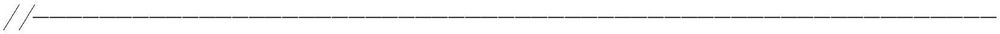

```
inline unsigned int RndI() // равномерное сл.число
{
    return gRndSeed = (16807L*gRndSeed) % 2147483647L;
}
```

От хорошего генератора мы ожидаем выполнения четырех требований:

1) случайные числа равномерно распределены;
2) они независимы;
3) их последовательность имеет большой период повторения;
4) они различны.

Последние два требования не являются эквивалентными. Например плохой генератор может, имея формально большое RAND_MAX, выдавать только, скажем 1000 различных чисел, переставляя их самым разнообразным образом. При этом период повторения будет велик, но при построении вещественного генератора из всего континуума мы будем получать только 1000 случайных значений. Как мы увидим ниже, эта проблема присуща как библиотечной функции rand(), так и алгоритму (9.5).

Поэтому мы будем использовать генератор случайных чисел, основанный на эффекте переполнения 32 -разрядных целых чисел. Соответствующая функция имеет вид:

```
inline unsigned int RndU() // равномерное сл.число
{
    return gRndSeed = gRndSeed*1664525L + 1013904223L;
}
```

Именно она будет в дальнейшем использоваться для генерации равномерно распределённых случайных чисел.

- Проведём сравнение статистических свойств трёх генераторов rand(), $\operatorname{RndI}()$ и $\operatorname{RndU}()$. Будем сразу работать с вещественными случайными числами в диапазоне $[0 \ldots 1]$. Так, алгоритм переполнения $\operatorname{RndU}()$ имеет следующую вещественную реализацию:

```
inline Float Rnd() // равномерное сл.число [0..1]
{
    return Float(RndU()) / Float(Oxffffffff);
}
```

Константа 0xffffffff является записью максимального беззнакового целого $2^{32}-1$ в шестнадцатеричной системе исчисления. Если целые числа генерятся при помощи rand () , делить необходимо на RAND_MAX, а для $\operatorname{RndI}()$ - на $2147483647=2^{31}-1$.

В качестве статистик, характеризующих равномерность случайных чисел, мы будем использовать среднее, точное значение которого равно $\langle x\rangle=1 / 2$, квадрат среднего $\left\langle x^{2}\right\rangle=1 / 3$, минимальное $x_{\min }=0$ и максимальное значение $x_{\text {min }}=1$. Кроме этого, будем вычислять среднеквадратичное отклонение вероятности попадания в один из $m$ одинаковых интервалов, на которые разобьём диапазон $[0 . .1]$ :

$$
z_{m}=\frac{n}{m} \sum_{k=1}^{m}\left(p_{k}-\frac{1}{m}\right)^{2},
$$

где $n$ - число сгенерённых случайных чисел, $p_{k}=n_{k} / n$, а $n_{k}$-количество чисел, попавших в $k$-й интервал. Мы умножили эту статистику на $n$, так как подобное отклонение убывает, как $1 / n$, поэтому при любых $n$ она будет примерно постоянной. Зная $z_{m}$, можно по $\chi^{2}$-критерию оценить достоверность гипотезы о равномерном распределении, однако мы будем использовать $z_{m}$ только для сравнения различных генераторов.

Характеристиками независимости будут служить ковариационные коэффициенты для моментов случайных чисел, умноженные на $\sqrt{n}$ :

$$
c_{j k}=\sqrt{n}\left[\left\langle x_{t}^{j} x_{t-1}^{k}\right\rangle-\left\langle x_{t}^{j}\right\rangle\left\langle x_{t-1}^{k}\right\rangle\right]
$$

В случае независимых величин чисел они должны быть равны нулю.
Для вычисления количества различных случайных чисел, выдаваемых генератором, воспользуемся библиотечным классом тар который хранит пары "ключ-значение". В нашем случае ключом будет служить случайное число, а значением - количество его появлений. Класс тар сравнительно быстро ищет и вставляет новые числа, и его размер size сообщает о количестве различных ключей (случайных чисел).

```
\#include "stat.cpp" // статистическая библиотека
\#include <map.h> // map[]
map<Float, unsigned int> lst;
const int n = 1000000; // величина выборки
const int nex = 1000; // число экспериментов
const int $\mathrm{m}=100$; // число интервалов
void main(void)
\{
    Float a[nex], s[nex], z[nex];
    Float c11[nex], c22[nex], c12[nex], c21[nex];
    Float min[nex], max[nex], size[nex];
    Float p[m];
    for (int ex=0; ex<nex; ex++)\{// проводим 1000 экспериментов
        $\operatorname{srand}(\mathrm{ex}+1)$; // "встряхиваем" генераторы
        SRnd(ex+1) ;
        $\mathrm{a}[\mathrm{ex}]=\mathrm{s}[\mathrm{ex}]=0$; // среднее и квадарат среднего
        $\mathrm{c} 11[\mathrm{ex}]=0$; // ковариации
        $\mathrm{c} 12[\mathrm{ex}]=\mathrm{c} 21[\mathrm{ex}]=\mathrm{c} 22[\mathrm{ex}]=0$;
        $\max [\mathrm{ex}]=0 ; \min [\mathrm{ex}]=1 ; \quad / /$ максимальное и минимальное
        Float rnd, rnd1=Rnd(); // текущее и предыдущее число
        lst.clear(); // очищаем хэи-таблицу
        for (int k=0; k<m; k++) p[k]=0;
        for(int i=0; i<n; i++,rnd1=rnd)\{
            rnd = Rnd();
            a[ex]+=rnd;
            s[ex]+=rnd*rnd;
            c11[ex]+=rnd*rnd1; c12[ex]+=rnd*Sqr(rnd1);
            c21[ex]+=Sqr(rnd)*rnd1; c22[ex]+=Sqr(rnd*rnd1);
            lst[rnd]++;
            int k=int(rnd*m); if(k>=m)k=m-1; if(k<0)k=0;
            p[k]++;
            if (max[ex]<rnd) max[ex]=rnd;
            if (min[ex]>rnd) min[ex]=rnd;
        \}
        $\mathrm{a}[\mathrm{ex}] /=\mathrm{n} ; \mathrm{s}[\mathrm{ex}] /=\mathrm{n} ;$
        $\mathrm{c} 11[\mathrm{ex}] /=\mathrm{n} ; \mathrm{c} 11[\mathrm{ex}]=(\mathrm{c} 11[\mathrm{ex}]-\mathrm{a}[\mathrm{ex}] * \mathrm{a}[\mathrm{ex}]) * \operatorname{sqrt}(F l o a t(\mathrm{n}))$;
        c12[ex]/=n; c12[ex]=(c12[ex]-a[ex]*s[ex])*sqrt(Float(n));
        c21[ex]/=n; c21[ex]=(c21[ex]-a[ex]*s[ex])*sqrt(Float(n));
        c22[ex]/=n; c22[ex]=(c22[ex]-s[ex]*s[ex])*sqrt(Float(n));
        $z[\mathrm{ex}]=0$;
        for(int k=0; k<m; k++) \{ z[ex]+=Sqr ((p[k]/n)-1.0/m) ; \}
        $\mathrm{z}[\mathrm{ex}] *=\mathrm{F}$ loat $(\mathrm{n}) / \mathrm{m}$;
        size[ex] = Float(lst.size())/n;
        printf ("\%d n", ex) ;
    \}
    printf("\%g\t\%g\n",Aver(a,nex),Sigma(a,nex)/sqrt(nex));//...
\}
```

- После получения на основании пех экспериментов массивов со статистиками при помощи функций Aver(), $\operatorname{Sigma}()$, находящихся в файле stat.cpp, вычисляются среднее значение статистики и одна стандартная ошибка: $\operatorname{Sigma}(\mathrm{a}, \mathrm{nex}) / \operatorname{sqrt}(\mathrm{nex})$. Ниже в таблицах стандартная ошибка используется для вывода только значащих цифр в статистике и указывается в виде индекса. Так, например, $0.025_{3}$ означает, что в последнем знаке может быть ошибка, т.е. $0.025 \pm 0.003$. Приведём результаты работы программы:

|  | 11 | 12 | 21 | 22 | size $/ n$ |
| :--- | :--- | :--- | :--- | :--- | :--- |
| RndU | $0.003_{3}$ | $0.004_{3}$ | $0.003_{3}$ | $0.003_{3}$ | 1.000000 |
| rand | $0.001_{3}$ | $0.001_{3}$ | $0.002_{3}$ | $0.001_{3}$ | 0.032767 |
| RndI | $0.25_{2}$ | $0.27_{3}$ | $0.27_{3}$ | $0.28_{3}$ | 0.049 |

Корреляционные свойства RndU и rand примерно одинаковы, а для RndI - заметно хуже. Генератор RndU существенно лучше по количеству различных чисел, которые он генерит. Так, на выборке из $n=1000000$ он выдаёт все числа различными, тогда как для rand различных чисел только RAND_MAX=32767. Аналогичная проблема и у RndI, к тому же их количество существенно зависит от начального значения gRndSeed.

Если нам необходимо равномерно заполнить некоторый отрезок точками (например, при Монте-Карло вычислении интеграла), то, используя rand или RndI, мы получим около $10^{5}$ точек, и проведение большего числа экспериментов становится бессмысленным.

Статистики равномерности имеют следующие значения:

|  | $\langle x\rangle$ | $\left\langle x^{2}\right\rangle$ | $z_{100}$ | $\min$ | $\max$ |
| :--- | :--- | :--- | :--- | :--- | :--- |
| RndU | $0.49999_{1}$ | $0.33332_{1}$ | $0.00989_{5}$ | 0.000000 | 0.9999999 |
| rand | $0.49999_{1}$ | $0.33332_{1}$ | $0.01009_{5}$ | 0.000000 | 1.0000000 |
| RndI | $0.5004_{1}$ | $0.3337_{1}$ | $0.73_{1}$ | $0.000019_{1}$ | $0.9999859_{2}$ |

Средние значения у первых двух генераторов в пределах стандартной ошибки совпадают с точными значениями. Генератор RndI хуже как по этим показателям, так и по степени равномерности для $m=100$ интервалов $z_{100}$.

В дальнейшем для равномерно распределённых чисел мы будем использовать $\operatorname{RndU}()$. С помощью $\operatorname{RndU}()$, а точнее, её вещественного аналога $\operatorname{Rnd}()$, можно получать и нормально распределённые числа, которые, собственно, нам и необходимы для стохастических дифференциальных уравнений. Рассмотрим соответствующий алгоритм.

- Для генерации нормально распределённого случайного числа с нулевым средним и единичной волатильностью служит метод Бокса-Миллера. Перейдём от равномерно распределённых на интервале $[0 . .1]$ чисел $x_{1}$ и $x_{2}$ к переменным: $y_{1}=\sqrt{-2 \ln x_{1}} \cos \left(2 \pi x_{2}\right), y_{2}=\sqrt{-2 \ln x_{1}} \sin \left(2 \pi x_{2}\right)$. Количество чисел, попавших в некоторую область двухмерного пространства $\Omega$, определяется двойным интегралом. При замене переменных в интеграле объём умножается на якобиан:

$$
\int_{\Omega} d x_{1} d x_{2}=\int_{\Omega}\left|\begin{array}{ll}
\frac{\partial x_{1}}{\partial y_{1}} & \frac{\partial x_{1}}{\partial y_{2}} \\
\frac{\partial x_{2}}{\partial y_{1}} & \frac{\partial x_{2}}{\partial y_{2}}
\end{array}\right| d y_{1} d y_{2}=\int_{\Omega} \frac{1}{\sqrt{2 \pi}} e^{-\frac{y_{1}^{2}}{2}} \frac{1}{\sqrt{2 \pi}} e^{-\frac{y_{2}^{2}}{2}} d y_{1} d y_{2}
$$

Таким образом, переменные $y_{1}$ и $y_{2}$ являются независимыми (интегралы расщепляются) и имеют нормальные распределения.

Функции cos и $\sin$ вычисляются достаточно долго. Чтобы избежать работы с ними, воспользуемся следующим приёмом. Выберем область интегрирования в виде круга с единичным радиусом и центром в начале координат. Будем случайным образом равномерно заполнять его точками. Пусть $v_{1}$ и $v_{2}-$ координаты точки внутри круга $v_{1}^{2}+v_{2}^{2}=r^{2}<1$.

В полярных координатах $v_{1}=r \cos \alpha, v_{2}=r \sin \alpha$. Так как $v_{1}$ и $v_{2}$ распределены равномерно, то и полярный угол $\alpha$ будет равномерно распределён в интервале $[0 . .2 \pi]$. Поэтому для вычисления значения $\cos$ и $\sin$ можно воспользоваться отношениями $v_{1} / r$ и $v_{2} / r$ :

```
Float RndG() // гауссово сл.число
{
    static int was = 0; // была ли вычислена пара чисел
    static Float r = 0; // предьдущее случ.число из пары
    if(was){was =0; return r;}// r из предьдущих вычислений
    Float s, v1,v2;
    do{ // ждём попадания в круг
        v1 = 2*Rnd()-1; // точка в квадрате [-1..1]
        v2 = 2*Rnd()-1;
        s=v1*v1 + v2*v2; // квадрат расстояния от центра
    }while(s>=1.0 || s==0);
    was = 1;
    r = v1*sqrt(-2* log(s)/s); // первое число (запомнили)
    return v2*sqrt(-2* log(s)/s); // второе число (вернули)
}
```

Переменные was и r объявлены в функции RndG, как статические (static). По завершении работы функции их значения будут сохранены, и при следующем вызове мы будем иметь значение одного из случайных гауссовых чисел, вычисленных на предыдущей итерации.

## 9.4 Моделирование стохастических процессов

Рассмотрим алгоритм моделирования одномерного стохастического процесса:

$$
d x=a(x, t) d t+b(x, t) \delta W .
$$

Если задано начальное условие $x_{0}=x(0)$, то последующие значения процесса $x_{k}=x\left(t_{k}\right)$ получаются при помощи итерационной схемы (стр. 49):

$$
x_{k+1}=x_{k}+a\left(x_{k}, t_{k}\right) \Delta t+b\left(x_{k}, t_{k}\right) \sqrt{\Delta t} \varepsilon_{k} .
$$

Чем меньше временной шаг $\Delta t$, тем ближе будут свойства получаемого выборочного процесса к точному результату:

```
#include "stat.cpp" // файл c RndG()
inline Float a(Float x, Float t){ return 0; } // снос
inline Float b(Float x, Float t){ return x; } // волат.
void main()
{
    FILE *out = fopen("ito.out", "w");
    SRnd(time(0)); // "встряхиваем" генератор
    Float step = 0.1; // шаг по времени для табуляции x
    const int num = 100;// число точек табуляции
    int lag = 1000; // количество дроблений шага step
    Float dt=step/lag, sqrt_dt=sqrt(dt);
    Float x=1; // начальное значение x
    Float t=0; // в момент времени }
    fprintf(out, "%g\t%g\n", t, x);
    for(int k=1; k<=num; k++){
        for(int j=0; j<lag; j++, t+=dt)
            x += a(x,t)*dt + b(x,t)*RndG()*sqrt_dt;
        fprintf(out, "%g\t%g\n", t, x);
        fflush(out);
    }
    fclose(out); // закрываем файл
}
```

Разберём этот код. Директивой include мы вставляем код из файла "stat.cpp", в котором содержится функция RndG, описанная в предыдущем разделе. Так как это наш файл и он находится в той же директории, где происходит компиляция основной программы, мы заключаем его имя в двойные кавычки.

Далее идут описания функций сноса и волатильности. В примере выше выбран процесс логарифмического блуждания с нулевым сносом и единичной волатильностью (стр. 58).

В главной функции main открывается файл с именем "ito.out". В него будут помещаться результаты работы программы. Для этого объявляется переменная (указатель) out типа FILE, значение которой задаётся функцией fopen. Последний её аргумент "w" определяет способ открытия файла. В данном случае это будет вновь создаваемый файл, открывающийся для записи.

Функция SRnd "встряхивает" генератор случайных чисел. В результате при каждом запуске программы будет получаться новая реализация случайного процесса.

В программе вычисляется num $=100$ значений случайного процесса $x(t)$, с равным шагом по времени: $t=0$, step, $2 \cdot$ step, … num ⋅ step. Каждый интервал между вычисляемыми значениями $x$ разбивается на большое число lag точек, время между которыми равно $d t=s t e p / l a g$.
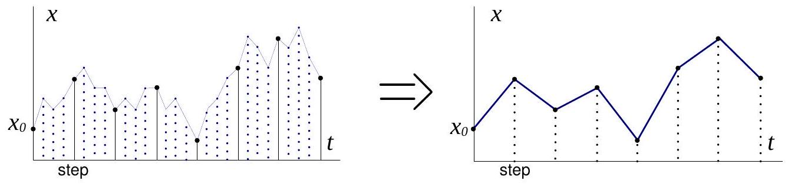

Для вычислений используется два вложенных цикла. Внешний по $k$ приводит к выводу $x(\operatorname{step}), x(2 \operatorname{step}), \ldots$ тогда как внутренний по $j$, при помощи итерационной формулы, вычисляет промежуточные значения случайного процесса. Для ускорения вычислений мы используем переменную sqrt_dt, в которой хранится $\sqrt{d t}$. Начальное значение процесса $x_{0}=1$ в момент времени $t_{0}=0$ задаётся перед выполнением циклов.

Вывод в файл осуществляется функцией fprintf, которая аналогична printf, но первым аргументом указывается файловая переменная, в которую направляется вывод. Функция fflush(out) приводит к немедленному помещению данных в файл, поэтому, если прервать выполнение программы, часть посчитанных к этому моменту результатов будет находиться в файле. Последняя строка закрывает файл. Этот текстовый файл можно открыть, например, в Excel и построить график соответствущего случайного процесса.

Символ "\t" в функции fprintf обозначает табулирование и понимается Excel в качестве разделителя колонок. Можно его заменить на запятую ",", и, придав файлу расширение ".csv", получить формат, воспринимаемый большинством программ обработки данных.

- Аналогичным образом моделируется система стохастических уравнений. Рассмотрим в качестве примера двухмерный осциллятор с затуханием (стр. 160), имеющий скоррелированный шум $\left\langle\delta W_{x} \delta W_{y}\right\rangle=\rho d t$ :

$$
\left\{\begin{array}{l}
d x=(-\lambda x-\omega y) d t+\sigma \delta W_{x} \\
d y=(+\omega x-\lambda y) d t+\sigma \delta W_{y} .
\end{array}\right.
$$

Программа на $\mathrm{C}++$, выдающая реализацию траектории соответствущего случайного процесса $x(t), y(t)$, имеет вид:

```
#include "stat.cpp" // файл c RndG()
void main()
{
    FILE *out = fopen("ito.out", "w");
    SRnd(time(0)); // "встряхиваем" генератор
    Float step = 0.1; // шаг по времени для табуляции x,y
    const int num = 1000;// число точек табуляцмм
    int lag= 1000; // количество дробленич̆ шага step
    Float w=0.5, lm=0.01, si=1, rho=0.1;
    Float x=1, y=0, t=0, x1, y1, r1, r2;
    Float dt=step/lag,sqrt_dt=sqrt(dt), rho1=sqrt(1-rho*rho);
    fprintf(out, "%g\t%g\t%g\n", t, x, y);
    for(int k=1; k<=num; k++){
        for(int j=0; j<lag; j++, t+=dt){
            r1=RndG(); r2=rho*r1+rho1*RndG();
            x1 = x + (-lm*x-w*y)*dt + si*r1*sqrt_dt;
            y1 = y + (-lm*y+w*x)*dt + si*r2*sqrt_dt;
            x=x1; y=y1;
        }
        fprintf(out, "%g\t%g\t%g\n", t, x, y);
    }
    fclose(out); // закрываем файл
}
```

Принципиальное отличие от одномерного случая состоит в использовании промежуточных переменных x1 и y1. Мы должны сначала вычислить приращение каждой из переменных, и лишь затем их увеличить. Если бы это не было проделано, то во втором уравнении для $y$ стояло бы $x$ не из предыдущей итерации, а уже изменённое. В качестве упражнения стоит сравнить работу этого алгоритма и алгоритма, в котором стояло бы просто $x+=\ldots$ и $y+=\ldots$. Обратим также внимание на генерацию скоррелированных случайных чисел r1 и r2 с коэффициентом корреляции $\rho=$ rho.

- Пока системы уравнений имеют небольшую размерность, для каждой степени свободы вводится отдельная переменная. Однако, рано или поздно необходимо переходить к массивам, особенно, если уравнение имеет компактную векторную форму.

Рассмотрим, например, систему следующего вида:

$$
d x_{i}=-x_{i} r d t+\delta W_{i},
$$

где $r=\sqrt{x_{1}^{2}+\ldots+x_{n}^{2}}$ - расстояние до начала координат в $n$-мерном декартовом пространстве. Так как снос вектора $\mathbf{x}=\left\{x_{1}, \ldots, x_{n}\right\}$ всегда направлен к началу координат, блуждание будет всё время оставаться в его окрестности. Со временем установится стационарное распределение вероятностей.

Для моделирования подобных уравнений необходимо определить массивы значений на предыдущей и текущей итерациях, а также задать начальные значения:

```
const int n = 10;
Float x[n], x1[n];
for(int i=0; i<n; i++) x[i]=0;
```

Для объявления размера статических массивов необходимо использовать константы (const). В качестве начального значения выбрано начало координат.

Основной цикл итерационных расчётов имеет следующий вид:

```
for(int k=1; k<=num; k++){
    for(int j=0; j<lag; j++){
        Float r=0;
        for(int i=0; i<n; i++) r+=x[i]*x[i];
        r=sqrt(r);
        for(int i=0; i<n; i++)
            x1[i] = x[i] - x[i]*r*dt + RndG()*sqrt_dt;
        for(int i=0; i<n; i++)
            x[i] = x1[i];
    }
}
```

При помощи значений x[i], полученных на предыдущей итерации, вычисляется радиус-вектор r. Затем в цикле происходит определение новых значений координат, которые присваиваются в массив x 1 . Только после того, как все новые значения вычислены, они снова помещаются в массив решений $x$.

## 9.5 Ошибки вычислений и ускорение сходимости

Если мы хотим найти изменение во времени среднего значения или волатильности случайного процесса, необходимо создать большое количество выборочных траекторий, на основании которых провести соответствующее усреднение. На конечные результаты могут оказывать влияние ошибки трёх видов:

1) Конечность выборки
2) Конечность временного шага
3) Ошибки округлений

Статистические ошибки конечности выборки достаточно хорошо контролируемы при помощи соотношений, приведенных в разделе §9.2. При расчёте любой интегральной величины $v$ (среднее, квадрат среднего, и т.д.) необходимо вычислять также выборочную волатильность $\tilde{\sigma}_{v}$ этой величины. Стандартная ошибка, которую мы будем получать для выборочного среднего $\tilde{v}$ по $n$ экспериментам, равна $\tilde{\sigma}_{v} / \sqrt{n}$. При необходимости можно определить доверительные интервалы, в которые с заданной достоверностью попадает истинное среднее значение.

Простым рецептом проверки наличия ошибок округления может быть переход от двойной точности double к одинарной float для типа Float. Если результаты при этом изменяются несущественно (на той же последовательности случайных чисел), то всё нормально. Так как мы определили тип Float в начале файла stat. cpp, для подобной проверки достаточно изменить только одну строку.

Рассмотрим теперь величину ошибок, связанных с конечностью временного шага в итерационной схеме. Чтобы статистические ошибки не мешали, воспользуемся следующим приёмом. Как известно, конкретная траектория винеровского процесса полностью определяет любую траекторию диффузного процесса, если её изменения стоят в стохастическом члене дифференциального уравнения (порождающий процесс: стр. 72).

Для процессов, точные решения которых выражаются явным видом через винеровскую переменную $x=f\left(t, W_{t}\right)$, можно вычислить среднюю абсолютную ошибку расхождения точного решения и численного:

$$
E=\langle | x\left(t_{k}\right)-x_{\text {exact }}\left(t_{k}\right)| \rangle
$$

Для этого необходимо получить дискретную траекторию Винера при помощи последовательности случайных гауссовых величин $\varepsilon_{1}, \ldots, \varepsilon_{n}$ и, используя их же, построить итерационную схему.

- Для уравнения $d x=a(x) d t+b(x) \delta W$ базовая итерационная схема, которой мы пользовались на протяжении книги, называется " схемой Эйлера":

$$
x_{k+1}=x_{k}+a_{k} \Delta t+b_{k} \varepsilon_{k} \sqrt{\Delta t},
$$

где $\varepsilon_{k} \sim N(0,1)$, а $a_{k}=a\left(x_{k}\right), b_{k}=b\left(x_{k}\right)$. Естественно, сам Эйлер о стохастических уравнениях не слышал, а использовал подобное приближение для решения обыкновенных дифференциальных уравнений.

Чем меньше интервал времени $\Delta t$, тем ближе последовательность значений случайного процесса $x_{k}=x\left(t_{k}\right)$ находится к непрерывной траектории $x_{\text {exact }}(t)$ в моменты времени $t_{k}$. Если для обыкновенных дифференциальных уравнений уменьшение шага итерационной схемы для повышения точности решения обычно не вызывает особых сложностей, то в стохастическом случае ситуация значительно сложнее. Чтобы получить среднее значение случайного процесса с относительной точностью $10^{-3}$, необходимо проделать около миллиона экспериментов. В результате временные затраты становятся в миллион раз больше, чем в детерминированном случае. Понятно, что, если при каждом из таких экспериментов, уменьшая $\Delta t$, мы должны выполнять большое число итераций, то ситуация становится критической. Поэтому важную роль играют различные методы ускорения сходимости итерационной процедуры.

В §5.6, стр. 148, при рассмотрении метода последовательных приближений мы получили следующую итерационную схему:

$$
\begin{aligned}
& x_{k+1}=x_{k}+a_{k} \Delta t+b_{k} \varepsilon_{k} \sqrt{\Delta t} \\
& +b_{k}^{\prime} b_{k}\left(\varepsilon_{k}^{2}-1\right) \frac{\Delta t}{2} \\
& +b_{k}^{\prime} a_{k} \varepsilon_{k}(\Delta t)^{3 / 2}+\left(a_{k}^{\prime} b_{k}-a_{k} b_{k}^{\prime}\right)\left[\frac{\sqrt{3}}{2} \varepsilon_{k}+\frac{1}{2} \eta_{k}\right] \frac{(\Delta t)^{3 / 2}}{\sqrt{3}}+a_{k}^{\prime} a_{k} \frac{(\Delta t)^{2}}{2},
\end{aligned}
$$

где $a_{k}^{\prime}=a^{\prime}\left(x_{k}\right), b_{k}^{\prime}=b^{\prime}\left(x_{k}\right)$, а $\eta \sim N(0,1)$ - случайная величина, статистически не зависящая от $\varepsilon$. Добавление к схеме Эйлера второй строки называется схемой Милстейна. Третья строка является следующим приближением по времени, и добавление её мы будем называть модифицированной схемой Милстейна. Новое случайное число $\eta_{k}$ возникает благодаря интегралу от винеровской траектории $S_{t}$, который, являясь случайным процессом, зависит от формы $W_{t}$, поэтому не определяется только значением $W_{t}=\varepsilon \sqrt{t}$ в момент времени $t$. Случайная величина $\eta$ пропорциональна площади отклонения от трапеции, соединяющей начальное и конечное значения винеровского процесса на интервале $[t, t+\Delta t]$ (см. §5.1, стр. 124).

Рассмотрим программу, вычисляющую средние ошибки при использовании модифицированной схемы Милстейна

```
#include "stat.cpp" // файл c RndG()
const int nex = 10000; // количество экспериментов
void main()
{
    SRnd(time(0)); // "встряхиваем" генератор
    Float x0=1; // начальное значение x
    Float t0=0, t1=1; // начальное и конечное время
    Float err[nex]; // квадратью ошибок
    for(Float dt=0.01; dt>=0.0001; dt*=0.1){
        Float sqrt_dt=sqrt(dt);
        for(int ex=0; ex<nex; ex++){ // эксперименты
            Float x=x0, t=t0, w=0;
            while(t<t1){
                Float r = RndG();
                x += x*dt + x*r*sqrt_dt + 0.5*x*(r*r-1)*dt
                    + x*r*dt*sqrt_dt + 0.5*x*dt*dt;
                w += r;
                t += dt;
            }
            w*=sqrt_dt;
            err[ex] = fabs(x-x0*exp(w+0.5*t));
        }
        Float av = Aver (err,nex);
        Float si = Sigma(err,nex)/sqrt(nex);
        printf("%12.8f\t%12.8f\t%12.8f\n",dt,av,si);
    }
}
```

В данном случае использовано логарифмическое блуждание

$$
d x=x d t+x \delta W .
$$

Во внешнем цикле происходит табулирование временного шага $\Delta t$. Далее проводится nex экспериментов, для каждого из которых по итерационной схеме вычисляется значение случайного процесса в момент времени $t 1$, которое сравнивается с точным

$$
x(t)=x_{0} e^{W_{t}+t / 2},
$$

которое зависит от значения винеровской переменной w в тот же момент времени.

Приведём результаты для логарифмического блуждания на интервале времени $t=[0 \ldots 1]$. Ниже в таблице приведены абсолютные отклонения траектории процесса от точного решения для различных временных шагов $\Delta t$ и итерационных схем. Усреднение ошибок проводилось по 10000 экспериментам:

| Схема | $\Delta t=10^{-2}$ | $\Delta t=10^{-3}$ | $\Delta t=10^{-4}$ |
| :--- | :--- | :--- | :--- |
| Эйлера $E_{E}$ | $1.6 \cdot 10^{-1}$ | $4.9 \cdot 10^{-2}$ | $1.5 \cdot 10^{-2}$ |
| Милстейна $E_{M}$ | $2.7 \cdot 10^{-2}$ | $2.6 \cdot 10^{-3}$ | $2.5 \cdot 10^{-4}$ |
| Модифицированная $E_{2}$ | $8.7 \cdot 10^{-3}$ | $9.0 \cdot 10^{-4}$ | $9.0 \cdot 10^{-5}$ |

При постоянном применении итерационной схемы ошибка со временем накапливается, и с ростом $t$ достаточно быстро увеличивается. Этот рост является экспоненциальным, и на интервале $t=[0.5, \ldots, 3]$ для схем Эйлера, Милстейна и модифицированной Милстейна может быть аппроксимирован функциями:

$$
E_{E}=0.39 e^{1.33 t}(\Delta t)^{1 / 2}, \quad E_{M}=0.61 e^{1.42 t} \Delta t, \quad E_{2}=0.23 e^{1.34 t} \Delta t .
$$

Естественно, константы в этих функциях зависят от вида уравнения, однако экспоненциальная зависимость от времени и степенная от шага итерационной схемы являются достаточно универсальными. Таким образом: 1) с увеличением диапазона времени $t$ ошибки накапливаются очень быстро; 2) схемы Милстейна существенно лучше схемы Эйлера, их ошибка быстрее убывает с уменьшением интервала $\Delta t$.

Ниже приведен пример динамики ошибок в виде их натурального логарифма, как функции времени $t$ для $\Delta t=10^{-2}$ и $10^{-3}$. Прямые линии в этом масштабе означают экспоненциальную зависимость от $t$.
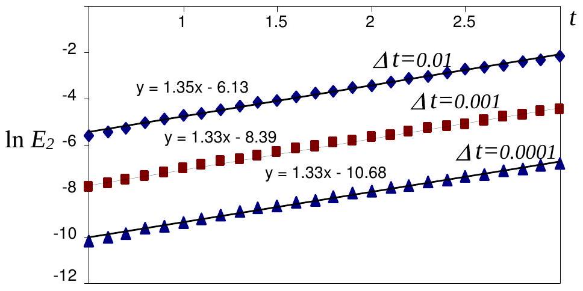

На самом деле, логарифмическое блуждание, являясь линейной задачей, достаточно комфортно для любого численного моделирования, по крайней мере, пока значения процесса в силу экспоненциального роста среднего значения не сильно выросли. В частности, в модифицированной схеме Милстейна не задействован член со случайным числом $\eta$.

## 9.6 Вычисление средних

Приведём простой алгоритм вычисления средних характеристик процесса по совокупности выборочных траекторий. Для этого введём массивы среднего значения и волатильности, табулированные в num точках. Для определения распределения вероятностей будем подсчитывать частоту попадания в данный момент времени траектории в один из m подынтервалов в интервале между min и max. Для этого введём двухмерный массив р. Первый его индекс будет соответствовать табулированному с шагом step времени, а второй - номеру интервала.

Все эти объявления имеют вид:

```
\#include "stat.cpp" // файл $c$ RndG()
inline Float a(Float x, Float t)\{ return 0; \} // снос
inline Float b(Float x, Float t)\{ return sqrt( $1+\mathrm{x} * \mathrm{x}$ ); \} // волат.
void main()
\{
    SRnd(time(0)); // "встряхиваем" генератор
    Float $\mathrm{x} 0=0$; // начальное значение $x$
    Float $\mathrm{t} 0=0$; $\quad / /$ в момент времени $t$
    Float step = 0.1; // шаг по времени для табуляции $x$
    const int num = 100;// число точек табуляц,мм
    int lag = 1000; // дроблений шага
    Float dt=step/lag, sqrt_dt=sqrt(dt);
    const int $\mathrm{m}=100$; // число точек гистограммъ
    Float $\min =-1$, $\max =1 ; / /$ диапазон для гистограммы
    Float w=max-min;
    Float av[num+1], di[num+1];
    Float p[num+1][m]; // гистрограмма
    for (int k=0; k<=num; k++)\{
        av $[\mathrm{k}]=\mathrm{di}[\mathrm{k}]=0$;
        for (int i=0; i<m; i++) p[k][i]=0;
    \}
    av $[0]=x 0 ; ~ d i[0]=0 ;$
```

Дальше мы в цикле по ex проводим nex численных экспериментов, в каждом из которых создаём выборочную траекторию, и накапливаем среднее значение в массиве аv и среднее квадрата в массиве di. Kроме этого, увеличиваем счётчик попаданий в подынтервалы для вычисления гистограммы.

Продолжение программы выглядит следующим образом:

```
    int nex = 1000000; // количество выборочных траекторий
    for (int ex=1; ex<=nex; ex++)\{ // эксперименты
        Float $\mathrm{x}=\mathrm{x} 0, \mathrm{t}=\mathrm{t} 0$;
        for (int k=1; k<=num; k++)\{
            for (int j=0; j<lag; j++, t+=dt)
                $\mathrm{x} \quad+=\mathrm{a}(\mathrm{x}, \mathrm{t}) * \mathrm{dt}+\mathrm{b}(\mathrm{x}, \mathrm{t}) * \operatorname{RndG}() * \mathrm{sqrt} \_\mathrm{dt} ;$
            $\operatorname{av}[\mathrm{k}]+=\mathrm{x}$; // среднее значение
            di[k] += x*x; // среднее квадрата
            int i=m*(x-min)/w;
            if(i>=0 \&\& i<m) p[k][i]++;
        \}
        if (ex\%100==0 \&\& ex!=1)\{
            printf ("ex=\%8d \n", ex) ;
            FILE *out = fopen("ito.out", "w");
            for (int k=0; k<=num; k++)\{
                Float ak = av[k]/ex;
                Float dk = di[k]/ex-ak*ak;
                $\mathrm{dk}=\mathrm{dk}>0$ ? sqrt(dk): 0;
                fprintf (out,"\%g\t\%12.5f\t\%12.5f",k*step,ak,dk);
                for (int i=0; i<m; i++)
                    fprintf(out," \t\%12.5f", (p[k][i]/ex)*m/w) ;
                fprintf(out, "\n");
            \}
            fclose(out);
        \}
    \}
\}
```

Один раз в сто экспериментов (последний if) происходит вывод промежуточных результатов в файл "ito.out". Для этого вычисляется остаток от деления номера эксперимента на 100 и вывод происходит, если он равен нулю и это не первый эксперимент. В результате вычисления можно прервать в любой момент, получив некоторые промежуточные результаты. Если редактор просмотра файлов в операционной системе автоматически перегружает изменившийся файл, то в нём можно просматривать динамику текущих вычислений.

В файл выводятся: время, волатильность и распределение вероятностей. Каждая строка соответствует одному моменту времени. Заметим, что при выводе частот мы нормируем их таким образом, чтобы они равнялись плотности распределения вероятностей. При вычислении волатильности, на всякий случай, при взятии корня проверяется знак дисперсии. Вообще говоря, дисперсия всегда положительна, однако из-за ошибок округления, при нулевой $\sigma$, возможны очень маленькие отрицательные значения, которые могут вызвать сбой программы.

## R : Стохастический справочник

В приложении собраны основные формулы, связанные с одномерными и многомерными стохастическими дифференциальными уравнениями. Приведены точные или асимптотически точные решения. В тех случаях, когда уравнение обсуждалось в книге, делается сноска на соответствующий номер страницы.

## I Основные соотношения теории

$\mathbf{R}_{1}$ : Стохастическое дифференциальное уравнение определяется функциями сноса $a(x, t)$ и волатильности $b(x, t)$ :

$$
d x=a(x, t) d t+b(x, t) \delta W
$$

где $\delta W=\varepsilon \sqrt{t}$ - винеровский шум, а $\varepsilon \sim N(0,1)$ - гауссово случайное число с нулевым средним и единичной дисперсией. Итерационная схема:

$$
x_{k+1}=x_{k}+a\left(x_{k}, t_{k}\right) \Delta t+b\left(x_{k}, t_{k}\right) \sqrt{\Delta t} \varepsilon_{k}
$$

Стартуем с $x_{0}=x\left(t_{0}\right)$, и далее каждый раз генерим новое, независимое гауссово случайное число $\varepsilon_{k}$.
$\mathbf{R}_{2}$ : Дифференциал функции $F=F(x, t)$, если $x=x(t)$ - случайный процесс, определяется леммой Ито (стр. 55):

$$
d F=\left(\frac{\partial F}{\partial t}+a(x, t) \frac{\partial F}{\partial x}+\frac{b^{2}(x, t)}{2} \frac{\partial^{2} F}{\partial x^{2}}\right) d t+b(x, t) \frac{\partial F}{\partial x} \delta W
$$

Стохастическое уравнение для $F$ получаем после замены $x=G(F, t)$, где $G$ - обратная к $F$ функция.
$\mathbf{R}_{3}$ : Плотность условной вероятности $P=P\left(x_{0}, t_{0} \Rightarrow x, t\right)$ удовлетворяет уравнению Фоккера-Планка (стр. 107):

$$
\frac{\partial P}{\partial t}+\frac{\partial}{\partial x}[a(x, t) P]-\frac{1}{2} \frac{\partial^{2}}{\partial x^{2}}\left[b^{2}(x, t) P\right]=0
$$

и первому уравнению Колмогорова (стр. 105):

$$
\frac{\partial P}{\partial t_{0}}+a\left(x_{0}, t_{0}\right) \frac{\partial P}{\partial x_{0}}+\frac{1}{2} b^{2}\left(x_{0}, t_{0}\right) \frac{\partial^{2} P}{\partial x_{0}^{2}}=0
$$

Уравнению Фоккера-Планка можно придать форму закона сохранения:

$$
\frac{\partial P}{\partial t}+\frac{\partial J}{\partial x}=0, \quad J(x, t)=a P-\frac{1}{2} \frac{\partial\left[b^{2} P\right]}{\partial x} .
$$

Возможны следующие граничные условия (стр. 110):

$$
\begin{array}{ll}
\text { reflecting : } & J(a, t)=0 \\
\text { absorbing : } & P(a, t)=0 \\
\text { periodic : } & J(a, t)=J(b, t), \quad P(a, t)=P(b, t)
\end{array}
$$

Если начальное условие $x_{0}$ задано точно, то $P\left(x_{0}, t_{0} \Rightarrow x, t_{0}\right)=\delta\left(x-x_{0}\right)$.
$\mathbf{R}_{4}$ : Среднее от функции $F=F(x, t)$ удовлетворяет уравнению (стр. 78):

$$
\frac{d\langle F\rangle}{d t}=\left\langle\frac{\partial F}{\partial t}+a(x, t) \frac{\partial F}{\partial x}+\frac{b^{2}(x, t)}{2} \frac{\partial^{2} F}{\partial x^{2}}\right\rangle .
$$

В случае $F=x$ и $F=x^{2}$ :

$$
\langle\dot{x}\rangle=\langle a(x, t)\rangle, \quad\left\langle\dot{x^{2}}\right\rangle=\left\langle 2 x a(x, t)+b^{2}(x, t)\right\rangle,
$$

где точка - производная среднего по времени. Для линейного по $x$ сноса уравнение для среднего $\langle x\rangle$ совпадает с детерминированным.
$\mathbf{R}_{5}$ : Важный класс точных решений можно найти (стр. 57), если удаётся подобрать функцию $s(t)$, удовлетворяющую тождеству:

$$
\frac{1}{s(t)} \frac{\partial}{\partial t}\left\{\frac{s(t)}{b(x, t)}\right\}=\frac{1}{2} \frac{\partial^{2} b(x, t)}{\partial x^{2}}-\frac{\partial}{\partial x}\left\{\frac{a(x, t)}{b(x, t)}\right\} .
$$

Тогда, решая уравнения:

$$
\frac{\partial F}{\partial x}=\frac{s(t)}{b(x, t)}, \quad \frac{\partial F}{\partial t}+s(t)\left[\frac{a(x, t)}{b(x, t)}-\frac{1}{2} \frac{\partial b(x, t)}{\partial x}\right]=f(t)
$$

находим $F(x, t)$ и $f(t)$, при помощи которых записываем решение:

$$
F(x(t), t)=F\left(x\left(t_{0}\right), t_{0}\right)+\int_{t_{0}}^{t} f(\tau) d \tau+\left[\int_{t_{0}}^{t} s^{2}(\tau) d \tau\right]^{1 / 2} \varepsilon
$$

$\mathbf{R}_{6}$ : Решение $x=f(t, \varepsilon)$, выраженное через случайную переменную $\varepsilon$, удовлетворяет уравнению (стр. 120):

$$
\dot{f}=a(f, t)-\frac{D^{\prime}(f, t)}{2}+\frac{D(f, t)}{2}\left[\frac{\psi(\varepsilon)}{f^{\prime}}+\frac{f^{\prime \prime}}{f^{\prime 2}}\right],
$$

где $\psi(\varepsilon)=-P^{\prime}(\varepsilon) / P(\varepsilon)$, и $P(\varepsilon)$ - плотность вероятности для $\varepsilon$, точка производная по времени, штрих - по $\varepsilon$, а $D=b^{2}$, $D^{\prime}=\partial D / \partial x$. В случае гауссового распределения $\psi(\varepsilon)=\varepsilon$. Начальные условия $x_{0}=f\left(t_{0}, \varepsilon\right)$.

Уравнение для обратной функции $\varepsilon=g(x, t)$ :

$$
\dot{g}=\frac{1}{2} \frac{\partial D(x, t)}{\partial x} g^{\prime}-a(x, t) g^{\prime}-\frac{D(x, t)}{2}\left[\psi(g) g^{\prime 2}-g^{\prime \prime}\right] .
$$

Штрих теперь - производная по $x$.
$\mathbf{R}_{7}$ : Система стохастических уравнений $n$ х $m$ относительно переменных состояния $\mathbf{x}=\left\{x_{1}, \ldots, x_{n}\right\}$ имеет вид:

$$
d x_{\alpha}=a_{\alpha}(\mathbf{x}, t) d t+b(\mathbf{x}, t)_{\alpha \beta} \delta W_{\beta} .
$$

По повторяющемуся индексу, если иное не оговорено, предполагается суммирование. Стохастический шум $\delta W_{\alpha}=\varepsilon_{\alpha} \sqrt{d t}$ выражается через $m$ нескоррелированных гауссовых чисел: $\varepsilon_{\alpha}=\left\{\varepsilon_{1}, \ldots, \varepsilon_{m}\right\}$.
$\mathbf{R}_{8}:$ Лемма Ито (стр. 157) для функции $n+1$ переменных $F=F(\mathbf{x}, t)$ :

$$
d F=\left(\frac{\partial F}{\partial t}+\frac{\partial F}{\partial x_{i}} a_{i}+\frac{1}{2} \frac{\partial^{2} F}{\partial x_{i} \partial x_{j}} b_{i \alpha} b_{j \alpha}\right) d t+\frac{\partial F}{\partial x_{i}} b_{i \alpha} \delta W_{\alpha}
$$

Матричная форма ( $\mathbf{b}^{T}$ - транспонирование, $\operatorname{Tr}$ - след матрицы):

$$
d F=\left(\frac{\partial F}{\partial t}+\frac{\partial F}{\partial \mathbf{x}} \cdot \mathbf{a}+\frac{1}{2} \operatorname{Tr}\left[\mathbf{b}^{T} \cdot \frac{\partial^{2} F}{\partial \mathbf{x}^{2}} \cdot \mathbf{b}\right]\right) d t+\frac{\partial F}{\partial \mathbf{x}} \cdot \mathbf{b} \cdot \delta \mathbf{W}
$$

$\mathbf{R}_{9}:$ Уравнение Фоккера - Планка (стр. 158) для $P=P\left(\mathbf{x}_{0}, t_{0} \Rightarrow \mathbf{x}, t\right)$ :

$$
\frac{\partial P}{\partial t}+\frac{\partial\left(a_{i} P\right)}{\partial x_{i}}-\frac{1}{2} \frac{\partial^{2}}{\partial x_{i} \partial x_{j}}\left[b_{i \alpha} b_{j \alpha} P\right]=0 .
$$

Функции сноса и волатильности зависят от текущего значения $x$ и времен: $a_{i}=a_{i}(\mathbf{x}, t), b_{i \alpha}=b_{i \alpha}(\mathbf{x}, t)$.

Первое уравнение Колмогорова для $P=P\left(\mathbf{x}_{0}, t_{0} \Rightarrow \mathbf{x}, t\right)$ :

$$
\frac{\partial P}{\partial t}+a_{i} \frac{\partial P}{\partial x_{0 i}}+\frac{b_{i \alpha} b_{j \alpha}}{2} \frac{\partial^{2} P}{\partial x_{0 i} \partial x_{0 j}}=0 .
$$

где $\mathbf{x}_{0}=\left\{x_{01}, \ldots, x_{0 n}\right\}$ - переменные начального условия, в которых вычислены снос и волатильность $a_{i}=a_{i}\left(\mathbf{x}_{0}, t_{0}\right), b_{i \alpha}=b_{i \alpha}\left(\mathbf{x}_{0}, t_{0}\right)$
$\mathbf{R}_{10}$ : Уравнение Фоккера-Планка имеет вид закона сохранения:

$$
\frac{\partial P}{\partial t}+\frac{\partial J_{i}}{\partial x_{i}}=0, \quad J_{i}=a_{i} P-\frac{1}{2} \frac{\partial}{\partial x_{j}}\left[b_{i \alpha} b_{j \alpha} P\right] .
$$

Вероятность $p(t)$ нахождения в объёме $V$, окруженном поверхностью $S$ :

$$
p(t)=\int_{V} P(x, t) d V, \quad \frac{d p}{d t}=-\int_{S} \mathbf{J} d \mathbf{S}
$$

Элемент площади $d \mathbf{S}$ перпендикулярен поверхности и направлен наружу. Вероятность $p(t)$ уменьшается, если положителен поток из объёма.
$\mathbf{R}_{11}$ : Динамические уравнения для средних (стр. 159):

$$
\frac{d\langle F(\mathbf{x}(t), t)\rangle}{d t}=\left\langle\frac{\partial F}{\partial t}+a_{i} \frac{\partial F}{\partial x_{i}}+\frac{1}{2} b_{i \alpha} b_{j \alpha} \frac{\partial^{2} F}{\partial x_{i} \partial x_{j}}\right\rangle .
$$

В частности, для среднего значения:

$$
\langle\dot{\mathbf{x}}\rangle=\langle\mathbf{a}(\mathbf{x}, t)\rangle
$$

и среднего квадрата:

$$
\left\langle x_{\mu} x_{\nu}\right\rangle=\left\langle x_{\mu} a_{\nu}+x_{\nu} a_{\mu}+b_{\nu \alpha} b_{\mu \alpha}\right\rangle
$$

Свёртка по индексам:

$$
\left\langle\dot{\mathbf{x}^{2}}\right\rangle=2\langle\mathbf{x} \cdot \mathbf{a}\rangle+\operatorname{Tr}\left\langle\mathbf{b} \cdot \mathbf{b}^{T}\right\rangle .
$$

$\mathbf{R}_{12}$ : Как и в одномерном случае, некоторую систему стохастических уравнений можно попытаться свести к простому нестационарному случаю (стр. 174), найдя матрицу $s_{k \alpha}(t)$, удовлетворяющую уравнению:

$$
\frac{\partial}{\partial t}\left[s_{k \alpha}(t) b_{\alpha i}^{-1}\right]+s_{k \alpha}(t) \frac{\partial}{\partial x_{i}}\left[b_{\alpha \gamma}^{-1}\left(a_{\gamma}-\frac{1}{2} \frac{\partial b_{\gamma \beta}}{\partial x_{j}} b_{j \beta}\right)\right]=0 .
$$

Тогда, найдя $F(\mathbf{x}, t)$ из уравнения:

$$
\frac{\partial F_{k}}{\partial x_{i}}=s_{k \alpha}(t) b_{\alpha i}^{-1}
$$

и нестационарный снос:

$$
f_{k}(t)=\frac{\partial F_{k}}{\partial t}+s_{k \alpha} b_{\alpha \gamma}^{-1} a_{\gamma}-\frac{1}{2} s_{k \alpha} b_{\alpha \gamma}^{-1} \frac{\partial b_{\gamma \beta}}{\partial x_{j}} b_{j \beta}
$$

решение запишем в следующем виде:

$$
F_{k}(\mathbf{x}(t), t)=F_{k}\left(\mathbf{x}_{0}, t_{0}\right)+\int_{t_{0}}^{t} f_{k}(\tau) d \tau+S_{i \alpha}(t) \varepsilon_{\alpha}
$$

где $\varepsilon_{\alpha}$ - нормированные независимые гауссовы случайные числа, а

$$
S_{i \alpha}(t) S_{j \alpha}(t)=\int_{t_{0}}^{t} s_{i \alpha}(\tau) s_{j \alpha}(\tau) d \tau
$$

## II Процесс Винера

$\mathbf{R}_{13}$ : Винеровское блуждание является непрерывным пределом дискретной модели суммы $n$ независимых нормально распределённых случайных величин. Если, начиная со значения $W(0)=0$, в течение времени $t$ произошло $n$ гауссовых изменений и $\Delta t=t / n$, то при $n \rightarrow \infty$ :

$$
W_{t}=\left(\varepsilon_{1}+\varepsilon_{2}+\ldots+\varepsilon_{n}\right) \sqrt{\Delta t}=\varepsilon \sqrt{n \Delta t}=\varepsilon \sqrt{t} .
$$

Таким образом, в момент времени $t$ процесс имеет гауссово распределение с нулевым средним и дисперсией, равной $t: W_{t} \sim N(0, t)$
$\mathbf{R}_{14}$ : Средние винеровского процесса.

$$
\begin{aligned}
\left\langle f\left(W_{t}\right)\right\rangle & =\langle f(\varepsilon \sqrt{t})\rangle \\
\left\langle f\left(W_{t_{1}}, W_{t_{2}}\right)\right\rangle & =\left\langle f\left(\varepsilon_{1} \sqrt{t_{1}}, \varepsilon_{1} \sqrt{t_{1}}+\varepsilon_{2} \sqrt{t_{2}-t_{1}}\right)\right\rangle,
\end{aligned}
$$

где $\varepsilon_{1}, \varepsilon_{2}, \ldots$ - независимые гауссовы числа, а $t_{1}<t_{2}<t_{3}<\ldots$
В общем случае ( $t_{0}=0, W(0)=0$ ):
$\left\langle f\left(W_{t_{1}}, . ., W_{t_{n}}\right)\right\rangle=\left\langle f\left(\varepsilon_{1} \sqrt{t_{1}}, \varepsilon_{1} \sqrt{t_{1}}+\varepsilon_{2} \sqrt{t_{2}-t_{1}}, \ldots, \sum_{k=1}^{n} \varepsilon_{k} \sqrt{t_{k}-t_{k-1}}\right)\right\rangle$.
$\mathbf{R}_{15}$ : Производящие функиии для средних ( $t_{1}<t_{2}<t_{3}<.$. ).

$$
\begin{aligned}
\left\langle e^{p W_{t}}\right\rangle & =e^{\frac{1}{2} p^{2} t} \\
\left\langle e^{\left.p_{1} W_{t_{1}}+p_{2} W_{t_{2}}\right\rangle}\right. & =e^{\frac{1}{2}\left(p_{1}^{2} t_{1}+p_{2}^{2} t_{2}+2 p_{1} p_{2} t_{1}\right)} \\
\left\langle e^{\left.p_{1} W_{t_{1}}+p_{2} W_{t_{2}}+p_{3} W_{t_{3}}\right\rangle}\right. & =e^{\frac{1}{2}\left(p_{1}^{2} t_{1}+p_{2}^{2} t_{2}+p_{3}^{2} t_{3}+2 p_{1}\left(p_{2}+p_{3}\right) t_{1}+2 p_{2} p_{3} t_{2}\right)} \\
\left\langle e^{\left.p_{1} W_{t_{1}}+p_{2} W_{t_{2}}+p_{3} W_{t_{3}}+p_{4} W_{t_{4}}\right\rangle}\right. & =e^{\frac{1}{2}\left(p_{1}^{2} t_{1}+p_{2}^{2} t_{2}+p_{3}^{2} t_{3}+p_{4}^{2} t_{4}\right)} \\
& \cdot e^{\frac{1}{2}\left(2 p_{1}\left(p_{2}+p_{3}+p_{4}\right) t_{1}+2 p_{2}\left(p_{3}+p_{4}\right) t_{2}+2 p_{3} p_{4} t_{3}\right)}
\end{aligned}
$$

$\mathbf{R}_{16}$ : Некоторые средние значения ( $t_{1}<t_{2}<t_{3}<.$. ).

$$
\left\langle W_{t}^{2 n}\right\rangle=1 \cdot 3 \cdot 5 \cdot \ldots \cdot(2 n-1) \cdot t^{n}, \quad\left\langle W_{t}^{2 n+1}\right\rangle=0
$$

двуточечные:

$$
\left\langle W_{t_{1}} W_{t_{2}}\right\rangle=t_{1}, \quad\left\langle W_{t_{1}}^{2} W_{t_{2}}^{2}\right\rangle=2 t_{1}^{2}+t_{1} t_{2}, \quad\left\langle W_{t_{1}}^{3} W_{t_{2}}^{3}\right\rangle=6 t_{1}^{3}+9 t_{1}^{2} t_{2}
$$

Если сумма степеней нечётна, то:

$$
\left\langle W_{t_{1}}^{n} W_{t_{2}}^{m}\right\rangle=0, \quad n+m=1,3,5,7, \ldots
$$

$\mathbf{R}_{17}$ : Разложение Палея-Винера (на интервале $t=[0 . . T]$ ):

$$
W(t)=\varepsilon_{0} \frac{t}{\sqrt{T}}+\sqrt{2 T} \sum_{k=1}^{\infty} \varepsilon_{k} \frac{\sin (\pi k t / T)}{\pi k} .
$$

$\mathbf{R}_{18}:$ Разложение Кархунена-Лоэва (на интервале $t=[0 . . T]$ ):

$$
W(t)=\sqrt{2 T} \sum_{k=0}^{\infty} \varepsilon_{k} \frac{\sin (\pi(k+1 / 2) t / T)}{\pi(k+1 / 2)} .
$$

$\mathbf{R}_{19}$ : Винеровское блуждание со сносом (стр. 48):

$$
d x=\mu d t+\sigma \delta W
$$

является базовым процессом, имеющим постоянные снос $\mu$ и волатильность $\sigma$. Его решение с начальными условиями $x_{0}=x\left(t_{0}\right)$ имеет вид:

$$
x(t)=x_{0}+\mu \cdot\left(t-t_{0}\right)+\sigma \varepsilon \sqrt{t-t_{0}} .
$$

Среднее значение и волатильность $\sigma_{x}^{2}=\left\langle(x-\bar{x})^{2}\right\rangle$ :

$$
\bar{x}(t)=x_{0}+\mu \cdot\left(t-t_{0}\right), \quad \sigma_{x}(t)=\sigma \sqrt{t-t_{0}} .
$$

Автоковариация:

$$
\operatorname{cov}(t, t+\tau)=\left\langle\left(x_{t}-\bar{x}_{t}\right)\left(x_{t+\tau}-\bar{x}_{t+\tau}\right)\right\rangle=\sigma^{2}\left(t-t_{0}\right) .
$$

Условная плотность вероятности:

$$
P\left(x_{0}, t_{0} \Rightarrow x, t\right)=\frac{1}{\sigma \sqrt{2 \pi\left(t-t_{0}\right)}} \exp \left\{-\frac{\left(x-x_{0}-\mu \cdot\left(t-t_{0}\right)\right)^{2}}{2 \sigma^{2}\left(t-t_{0}\right)}\right\} .
$$

Эволюция плотности вероятности при $\mu=1, \sigma=1$ в различные моменты времени:
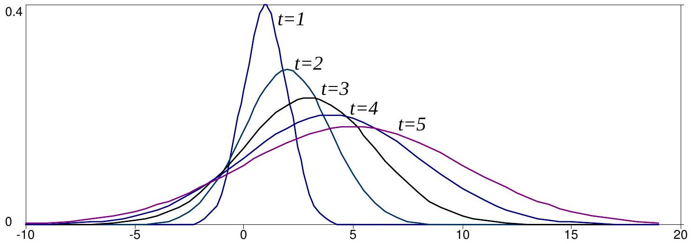

## III Уравнения с линейным по $x$ сносом, $n=1$

Если снос и волатильность не зависят от времени, то решение не изменится при сдвиге начального момента. Поэтому ниже $t_{0}=0$, и для его восстановления необходимо $t \rightarrow t-t_{0}$. Везде $\varepsilon-$ гауссова случайная величина $\mathrm{c}\langle\varepsilon\rangle=0,\left\langle\varepsilon^{2}\right\rangle=1$. Начальное условие $x_{0}=x\left(t_{0}\right)$. Если решение выражается через процесс Винера $W_{t}$, это указывается явным образом.
$\mathbf{R}_{20}$ : Логарифмическое блуждание (стр. 58):

$$
d x=\mu x d t+\sigma x \delta W .
$$

Решение:

$$
x(t)=x_{0} e^{\left(\mu-\sigma^{2} / 2\right) t+\sigma W_{t}} .
$$

Среднее значение и волатильность:

$$
\bar{x}(t)=x_{0} e^{\mu t}, \quad \sigma_{x}(t)=\bar{x}(t) \sqrt{e^{\sigma^{2} t}-1}
$$

Автоковариация:

$$
\operatorname{cov}(t, t+\tau)=x_{0}^{2} e^{\mu \cdot(2 t+\tau)}\left[e^{\sigma^{2} t}-1\right]
$$

$\mathbf{R}_{21}$ : Процесс Орнитейна - Уленбека (стр. 60):

$$
d x=-\beta \cdot(x-\alpha) d t+\sigma \delta W
$$

при $\beta>0$ описывает блуждание с притяжением к уровню $\alpha$.
Решение уравнения:

$$
x(t)=\alpha+\left(x_{0}-\alpha\right) e^{-\beta t}+\frac{\sigma}{\sqrt{2 \beta}} \sqrt{1-e^{-2 \beta t}} \varepsilon
$$

Среднее значение и волатильность:

$$
\bar{x}(t)=\alpha+\left(x_{0}-\alpha\right) e^{-\beta t}, \quad \sigma_{x}(t)=\frac{\sigma}{\sqrt{2 \beta}} \sqrt{1-e^{-2 \beta t}}
$$

Автоковариация:

$$
\operatorname{cov}(t, t+\tau)=\sigma_{x}^{2}(t) e^{-\beta \tau}
$$

При $\beta>0$ в стационарном пределе $t \rightarrow \infty$ спектральная функция:

$$
\mathcal{S}(\omega)=\frac{\sigma^{2} / \pi}{\omega^{2}+\beta^{2}}
$$

Стационарное распределение для $x$ имеет гауссову форму со средним значением $\bar{x}=\alpha$ и волатильностью $\sigma / \sqrt{2 \beta}$.
$\mathbf{R}_{22}$ : Проияесс Винера с линейной волатильностью:

$$
d x=\mu d t+\sigma x \delta W .
$$

Среднее значение:

$$
\bar{x}(t)=x_{0}+\mu t
$$

Дисперсия $\left(\lambda=\mu / \sigma^{2}\right)$ :

$$
\sigma_{x}^{2}(t)=\left[\left(x_{0}+\lambda\right)^{2}+\lambda^{2}\right]\left(e^{\sigma^{2} t}-1\right)-2 \mu\left(x_{0}+\lambda\right) t-\mu^{2} t^{2} .
$$

Процесс $y=F(t, x, W)=x e^{\frac{\sigma^{2}}{2} t-\sigma W_{t}}$ удовлетворяет стохастическому уравнению $d y=\mu e^{\frac{\sigma^{2}}{2} t-\sigma W_{t}} d t$, потому интегральное представление решения $x(t)$ имеет вид:

$$
x(t)=e^{-\frac{\sigma^{2}}{2} t+\sigma W_{t}}\left[x_{0}+\mu \int_{0}^{t} e^{\frac{\sigma^{2}}{2} s-\sigma W_{s}} d s\right]
$$

Если $W_{t}=\varepsilon_{1} \sqrt{t}$, то при малых $\sigma$ для $y$ справедливо разложение:

$$
x(t)=\left[x_{0}+\mu t-\left(\sqrt{3} \varepsilon_{1}+\varepsilon_{2}\right) \frac{\mu \sigma t^{3 / 2}}{2 \sqrt{3}}+\ldots\right] e^{-\frac{\sigma^{2}}{2} t+\sigma \varepsilon_{1} \sqrt{t}}
$$

где $\varepsilon_{1}, \varepsilon_{2}$ - независимые гауссовы числа.
$\mathbf{R}_{23}$ : Феллеровское блуждание с постоянным сносом (стр. 87):

$$
d x=\mu d t+\sigma \sqrt{x} \delta W
$$

Решение:

$$
x(t)=x_{0}+\sigma \sqrt{x_{0} t} \varepsilon+\frac{\sigma^{2} t}{2} u
$$

где производящая функция для $\varepsilon, u$ равна (см. $\mathbf{R}_{69}$ ):

$$
\left\langle e^{k \varepsilon+p u}\right\rangle=\frac{1}{(1-p)^{2 \mu / \sigma^{2}}} \exp \left\{\frac{k^{2} / 2}{1-p}\right\}
$$

Среднее значение и дисперсия процесса:

$$
\bar{x}(t)=x_{0}+a t, \quad \sigma_{x}^{2}(t)=\sigma^{2}\left(x_{0} t+\frac{a t^{2}}{2}\right) .
$$

$\mathbf{R}_{24}$ : Процесс Феллера (стр. 82, 168):

$$
d x=-\beta \cdot(x-\alpha) d t+\sigma \sqrt{x} \delta W
$$

с начальным условием $x_{0}=x(0)$ и $\gamma=\sigma^{2} / 2 \beta$ имеет решение:

$$
x(t)=x_{0} e^{-\beta t}+\sqrt{2 x_{0} \gamma e^{-\beta t}\left(1-e^{-\beta t}\right)} \varepsilon+\gamma\left(1-e^{-\beta t}\right) u,
$$

где производящая функция для $\varepsilon$ и $u$ имеет вид $\left(\right.$ см. $\left.\mathbf{R}_{69}\right)$ :

$$
\left\langle e^{k \varepsilon+p u}\right\rangle=\frac{1}{(1-p)^{\alpha / \gamma}} \exp \left\{\frac{k^{2} / 2}{1-p}\right\} .
$$

Среднее значение и дисперсия процесса:
$\bar{x}(t)=\alpha+\left(x_{0}-\alpha\right) e^{-\beta t}, \quad \sigma_{x}^{2}(t)=\alpha \gamma\left[1-e^{-\beta t}\right]^{2}+2 x_{0} \gamma\left[1-e^{-\beta t}\right] e^{-\beta t}$.
Автоковариационная и спектральная (при $t \rightarrow \infty$ ) функции:

$$
\operatorname{cov}(t, t+\tau)=\sigma_{x}^{2}(t) e^{-\beta \tau}, \quad \mathcal{S}(\omega)=\frac{\alpha \sigma^{2} / \pi}{\omega^{2}+\beta^{2}}
$$

Производящая функция для $x$ :

$$
\left\langle e^{p x}\right\rangle=\frac{1}{\left(1-p f_{3}\right)^{\mu}} \exp \left\{\frac{p f_{1}}{1-p f_{3}}\right\},
$$

где $f_{1}=x_{0} e^{-\beta t}, f_{3}=\gamma\left(1-e^{-\beta t}\right)$, а $\mu=\alpha / \gamma=2 \alpha \beta / \sigma^{2}$
При $\beta>0$ существует стационарная плотность вероятности:

$$
P(x)=\frac{1}{\gamma \Gamma(\mu)}\left(\frac{x}{\gamma}\right)^{\mu-1} e^{-x / \gamma} .
$$

Плотность вероятности при произвольном $t$ :

$$
P\left(x_{0}, 0 \Rightarrow x, t\right)=\frac{e^{-f_{1} / f_{3}}}{f_{3}} I_{\mu-1}\left(\frac{2 \sqrt{x f_{1}}}{f_{3}}\right)\left(\frac{x}{f_{1}}\right)^{\frac{\mu-1}{2}} e^{-x / f_{3}}
$$

где $I_{q}(z)$ - модифицированная функция Бесселя:

$$
I_{q}(z)=\sum_{k=0}^{\infty} \frac{(z / 2)^{2 k+q}}{k!\Gamma(k+1+q)},
$$

удовлетворяющая уравнению: $z^{2} I_{q}^{\prime \prime}(z)+z I_{q}^{\prime}(z)-\left(z^{2}+q^{2}\right) I_{q}(z)=0$.
$\mathbf{R}_{25}$ : Процесс Орнитейна-Уленбека с линейной волатильностью:

$$
d x=-\beta \cdot(x-\alpha) d t+\sigma x \delta W
$$

Среднее значение:

$$
\bar{x}(t)=\alpha+\left(x_{0}-\alpha\right) e^{-\beta t}
$$

Дисперсия:

$$
\begin{aligned}
\sigma_{x}^{2}(t) & =\frac{\alpha^{2} \sigma^{2}}{2 \beta-\sigma^{2}}+\frac{2 \alpha \sigma^{2}\left(x_{0}-\alpha\right)}{\beta-\sigma^{2}} e^{-\beta t}-\left(x_{0}-\alpha\right)^{2} e^{-2 \beta t} \\
& +\left[x_{0}^{2}-\frac{2 \alpha^{2} \beta}{2 \beta-\sigma^{2}}+\frac{2\left(x_{0}-\alpha\right) \alpha \beta}{\beta-\sigma^{2}}\right] e^{\left(-2 \beta+\sigma^{2}\right) t}
\end{aligned}
$$

При $\beta>0$ стремится к стационарному распределению с плотностью:

$$
P(x) \sim x^{-2-\lambda} \exp [-\alpha \lambda / x], \quad \lambda=\frac{2 \beta}{\sigma^{2}}
$$

Интегральное представление решения:

$$
x(t)=e^{-\left(\beta+\sigma^{2} / 2\right) t+\sigma W_{t}}\left[x_{0}+\alpha \beta \int_{0}^{t} e^{\left(\beta+\sigma^{2} / 2\right) s-\sigma W_{s}} d s\right]
$$

$\mathbf{R}_{26}$ : Линейный снос и волатильность (стр. 331):

$$
d x=(\alpha+\beta x) d t+(\sigma+\gamma x) \delta W
$$

Среднее значение:

$$
\bar{x}(t)=-\frac{\alpha}{\beta}+\left(x_{0}+\frac{\alpha}{\beta}\right) e^{\beta t}
$$

Среднее квадрата $\left(\tilde{\alpha}=\alpha+\sigma \gamma, \beta_{n}=n \beta+\gamma^{2}\right)$ :

$$
\overline{x^{2}}(t)=\frac{2 \tilde{\alpha} \alpha-\beta \sigma^{2}}{\beta \beta_{2}}-\frac{2 \tilde{\alpha}\left(\alpha+\beta x_{0}\right)}{\beta \beta_{1}} e^{\beta t}+\left[x_{0}^{2}+\frac{2 \tilde{\alpha} x_{0}}{\beta_{1}}+\frac{2 \tilde{\alpha} \alpha+\beta_{1} \sigma^{2}}{\beta_{1} \beta_{2}}\right] e^{\beta_{2} t},
$$

$\mathbf{R}_{27}$ : Броуновская ловушка (стр. 327):

$$
d x=-\beta \cdot(x-\alpha) d t+\sigma \cdot(x-\alpha) \delta W
$$

Решение:

$$
x=\alpha+\left(x_{0}-\alpha\right) e^{-\left(\beta+\sigma^{2} / 2\right) t+\sigma \sqrt{t} \varepsilon}
$$

Среднее значение и волатильность:

$$
\bar{x}(t)=\alpha+\left(x_{0}-\alpha\right) e^{-\beta t}, \quad \sigma_{x}(t)=\left|x_{0}-\alpha\right| e^{-\beta t} \sqrt{e^{\sigma^{2} t}-1}
$$

$\mathbf{R}_{28}$ : Отсутствие зависимости от $x$ (стр. 56):

$$
d x=f(t) d t+s(t) \delta W
$$

Решение:

$$
x(t)=x\left(t_{0}\right)+\int_{t_{0}}^{t} f(\tau) d \tau+\left[\int_{t_{0}}^{t} s^{2}(\tau) d \tau\right]^{1 / 2} \varepsilon
$$

Среднее значение и дисперсия:

$$
\bar{x}(t)=x\left(t_{0}\right)+\int_{t_{0}}^{t} f(\tau) d \tau, \quad \sigma_{x}^{2}(t)=\int_{t_{0}}^{t} s^{2}(\tau) d \tau
$$

$\mathbf{R}_{29}$ : Броуновский мост (стр. 63):

$$
d x=-\frac{x-\alpha}{T-t} d t+\sigma \delta W
$$

Решение с $x_{0}=x\left(t_{0}\right)$ :

$$
x(t)=\alpha+\left(x_{0}-\alpha\right) \frac{T-t}{T-t_{0}}+\sigma \sqrt{\frac{\left(t-t_{0}\right)(T-t)}{T-t_{0}}} \varepsilon
$$

Среднее значение и дисперсия:

$$
\bar{x}(t)=\alpha+\left(x_{0}-\alpha\right) \frac{T-t}{T-t_{0}}, \quad \sigma_{x}^{2}(t)=\sigma^{2} \frac{\left(t-t_{0}\right)(T-t)}{T-t_{0}} .
$$

$\mathbf{R}_{30}$ : Степенной броуновский мост (стр. 63):

$$
d x=-\beta \cdot \frac{x-\alpha}{T-t} d t+\sigma \delta W
$$

Решение с $x_{0}=x\left(t_{0}\right)$ :

$$
x(t)=\alpha+\frac{x_{0}-\alpha}{T^{\beta}}(T-t)^{\beta}+\sigma \cdot\left[\frac{(T-t)}{2 \beta-1}\left(1-\frac{(T-t)^{2 \beta-1}}{T^{2 \beta-1}}\right)\right]^{1 / 2} \varepsilon .
$$

$\mathbf{R}_{31}$ : Нестационарное логарифмическое блуждание

$$
d x=a(t) x d t+b(t) x \delta W
$$

Решение:

$$
x(t)=x_{0} \exp \left\{\int_{0}^{t}\left(a(\tau)-\frac{1}{2} b^{2}(\tau)\right) d \tau+\left[\int_{0}^{t} b^{2}(\tau) d \tau\right]^{1 / 2} \varepsilon\right\}
$$

Среднее значение:

$$
\bar{x}(t)=x_{0} \exp \int_{0}^{t} a(\tau) d \tau
$$

IV Уравнения с нелинейным по $x$ сносом, $n=1$
$\mathbf{R}_{32}$ : Логарифмический процесс Орнитейна-Уленбека (стр. 327):

$$
d x=-\beta x \cdot\left(\ln \frac{x}{\alpha}-1\right) d t+\sigma x \delta W
$$

Решение:

$$
\ln \frac{x(t)}{\alpha}=1-\frac{\sigma^{2}}{2 \beta}+\left[\ln \frac{x_{0}}{\alpha}-1+\frac{\sigma^{2}}{2 \beta}\right] e^{-\beta t}+\frac{\sigma}{\sqrt{2 \beta}} \sqrt{1-e^{-2 \beta t}} \varepsilon
$$

Среднее значение:

$$
\bar{x}(t)=\alpha \exp \left\{1-\frac{\sigma^{2}}{2 \beta}+\left(\ln \frac{x_{0}}{\alpha}-1+\frac{\sigma^{2}}{2 \beta}\right) e^{-\beta t}+\frac{\sigma^{2}}{4 \beta}\left(1-e^{-2 \beta t}\right)\right\} .
$$

$\mathbf{R}_{33}$ : Логистическое уравнение $x$ (стр. 89):

$$
d x=\left(\alpha x-\beta x^{2}\right) d t+\sigma x \delta W
$$

удобно рассматривать в безразмерном виде:

$$
d x=x(1-x) d t+\sqrt{2 \gamma} x \delta W
$$

где $\gamma=\sigma^{2} / 2 \alpha$. Переход к исходному уравнению осуществляется заменами $t \rightarrow \alpha t, x \rightarrow(\beta / \alpha) x, x_{0} \rightarrow(\beta / \alpha) x_{0}$. Разложение в ряд по $t$ среднего:

$$
\begin{aligned}
\left\langle\frac{x}{x_{0}}\right\rangle & =1+\left[1-x_{0}\right] t+\left[1-(3+2 \gamma) x_{0}+2 x_{0}^{2}\right] \frac{t^{2}}{2!} \\
& +\left[1-\left(7+10 \gamma+4 \gamma^{2}\right) x_{0}+(12+16 \gamma) x_{0}^{2}-6 x_{0}^{3}\right] \frac{t^{3}}{3!}+. .
\end{aligned}
$$

При $\alpha, \beta>0$ существует стационарное распределение $(t \rightarrow \infty)$ с плотностью вероятности:

$$
P(x)=\frac{1}{\gamma \Gamma(\mu)}\left(\frac{x}{\gamma}\right)^{\mu-1} e^{-x / \gamma}
$$

где $\mu=(1-\gamma) / \gamma$. Средние значения и волатильность в асимптотическом пределе $t \rightarrow \infty$ :

$$
\langle x\rangle=1-\gamma, \quad\left\langle x^{2}\right\rangle=\langle x\rangle, \quad \sigma_{x}^{2}=\gamma(1-\gamma)
$$

Решение можно выразить через стохастический интеграл:

$$
x(t)=x_{0} e^{(1-\gamma) t+\sqrt{2 \gamma} W_{t}}\left[1+x_{0} \int_{0}^{t} e^{(1-\gamma) \tau+\sqrt{2 \gamma} W_{\tau}} d \tau\right]^{-1}
$$

$\mathbf{R}_{34}$ : Рэлеевский процесс

$$
d x=\left(\frac{\alpha}{x}-\beta x\right) d t+\sigma \delta W
$$

Среднее квадрата:

$$
\overline{x^{2}}(t)=x_{0}^{2} e^{-2 \beta t}+\frac{2 \alpha+\sigma^{2}}{2 \beta}\left(1-e^{-2 \beta t}\right)
$$

Стационарная плотность вероятности $\left(\gamma=\left(\alpha / \sigma^{2}\right)+1 / 2\right)$ :

$$
P(x)=\frac{2\left(\beta / \sigma^{2}\right)^{\gamma}}{\Gamma(\gamma)} x^{2 \alpha / \sigma^{2}} e^{-\beta x^{2} / \sigma^{2}}
$$

Асимптотически стационарные средние:

$$
\bar{x}=\frac{\sigma}{\sqrt{\beta}} \frac{\Gamma(\gamma+1 / 2)}{\Gamma(\gamma)}, \quad \overline{x^{2}}=\frac{2 \alpha+\sigma^{2}}{2 \beta}
$$

$\mathbf{R}_{35}$ : Нелинейный снос с волатильностью $\sqrt{x}$

$$
d x=\left(\frac{\sigma^{2}}{4}+\alpha \sqrt{x}+2 \beta x\right) d t+\sigma \sqrt{x} \delta W
$$

Решение с $x_{0}=x(0), \beta>0$ :

$$
x(t)=\left[\sqrt{x_{0}} e^{\beta t}+\frac{\alpha}{2 \beta}\left(e^{\beta t}-1\right)+\frac{\sigma}{\sqrt{8 \beta}} \sqrt{e^{2 \beta t}-1} \varepsilon\right]^{2} .
$$

$\mathbf{R}_{36}$ : Степенное уравнение

$$
d x=-\frac{m}{2} \sigma^{2} x^{2 k-1} d t+\sigma x^{k} \delta W
$$

Если $m$ и $k$ - целые числа, то уравнение для средних:

$$
\left\langle\dot{x^{n}}\right\rangle=\frac{n(n-m-1)}{2} \sigma^{2}\left\langle x^{n+2 k-2}\right\rangle
$$

при $n=m+1:\left\langle x^{m+1}\right\rangle=x_{0}^{m+1}$. Например, $\left(\lambda=\sigma x_{0}\right)$ :

$$
\begin{aligned}
d x=-\sigma^{2} x^{3} d t+\sigma x^{2} \delta W & => & \langle x\rangle=x_{0}\left[1-\lambda^{2} t\right] \\
d x=-2 \sigma^{2} x^{3} d t+\sigma x^{2} \delta W & => & \langle x\rangle=x_{0}\left[1-2 \lambda^{2} t+3 \lambda^{4} t^{2}\right] \\
d x=-3 \sigma^{2} x^{3} d t+\sigma x^{2} \delta W & => & \langle x\rangle=x_{0}\left[1-3 \lambda^{2} t+9 \lambda^{4} t^{2}-15 \lambda^{6} t^{3}\right]
\end{aligned}
$$

Квадратичная волатильность $\sigma x^{2}$ слишком сильная, и решение не удерживается у равновесного в "детерминированном" случае уровня $x=0$.
$\mathbf{R}_{37}$ : Деформация винеровского процесса
Для дифференцируемой функции $G(x)$ (штрих - производная по $x$ ):

$$
d x=\frac{1}{G^{\prime}(x)}\left[\mu+\frac{\sigma^{2}}{2}\left(\frac{1}{G^{\prime}(x)}\right)^{\prime}\right] d t+\frac{\sigma}{G^{\prime}(x)} \delta W .
$$

Решение с $x_{0}=x(0), W_{t}=\varepsilon \sqrt{t}$ :

$$
G(x)=G\left(x_{0}\right)+\mu t+\sigma W_{t} .
$$

Решения в $\mathbf{R}_{38}-\mathbf{R}_{43}$ получаются или при помощи алгоритма со стр. 57 , или при соответствующем выборе функции $G(x)$.
$\mathbf{R}_{38}$ : Степенные снос и волатильность с $\nu \neq 1$

$$
d x=\left[\mu x^{\nu}+\frac{\nu}{2} \sigma^{2} x^{2 \nu-1}\right] d t+\sigma x^{\nu} \delta W .
$$

Решение с $x_{0}=x(0), W_{t}=\varepsilon \sqrt{t}$ :

$$
x(t)=\left[x_{0}^{1-\nu}+(1-\nu)\left(\mu t+\sigma W_{t}\right)\right]^{1 /(1-\nu)} .
$$

В частности:

$$
d x=3 x^{1 / 3} d t+3 x^{2 / 3} \delta W .
$$

имеет решение:

$$
x(t)=\left[x_{0}^{1 / 3}+W_{t}\right]^{3} .
$$

и средние $\left(\lambda=t / x_{0}^{2 / 3}\right)$ :

$$
\begin{aligned}
& \langle x\rangle=x_{0}[1+3 \lambda] \\
& \left\langle x^{2}\right\rangle=x_{0}^{2}\left[1+15 \lambda+45 \lambda^{2}+15 \lambda^{3}\right] \\
& \left\langle x^{3}\right\rangle=x_{0}^{3}\left[1+36 \lambda+378 \lambda^{2}+1260 \lambda^{3}+945 \lambda^{4}\right] \\
& \left\langle x^{4}\right\rangle=x_{0}^{4}\left[1+66 \lambda+1485 \lambda^{2}+13860 \lambda^{3}+51975 \lambda^{4}+62370 \lambda^{5}+10395 \lambda^{6}\right] .
\end{aligned}
$$

При $x_{0}=1$ и $t=1: \quad\langle x\rangle=4, \quad\left\langle x^{2}\right\rangle=76, \quad\left\langle x^{3}\right\rangle=2620, \quad\left\langle x^{4}\right\rangle=140152$.
$\mathbf{R}_{39}$ : Квадрат винеровского блуждания

$$
d x=\left(2 \mu \sqrt{x}+\sigma^{2}\right) d t+2 \sigma \sqrt{x} \delta W .
$$

Решение

$$
x=\left(x_{0}^{1 / 2}+\mu t+\sigma W_{t}\right)^{2} .
$$

$\mathbf{R}_{40}$ : Снос, пропорциональный волатильности

$$
d x=\left(\mu-\sigma^{2} x\right)\left(\alpha^{2}-x^{2}\right) d t+\sigma \cdot\left(\alpha^{2}-x^{2}\right) \delta W .
$$

Решение с $x_{0}=x(0), W_{t}=\varepsilon \sqrt{t}$ :

$$
x=\alpha \operatorname{th}\left(\operatorname{ath}\left(\frac{x_{0}}{\alpha}\right)+\alpha \cdot\left(\mu t+\sigma W_{t}\right)\right),
$$

где ath - гиперболический арктангенс.
$\mathbf{R}_{41}$ : Снос, пропорциональный волатильности-2

$$
d x=\left(\mu+\sigma^{2} x\right)\left(\alpha^{2}+x^{2}\right) d t+\sigma \cdot\left(\alpha^{2}+x^{2}\right) \delta W
$$

Решение с $x_{0}=x(0), W_{t}=\varepsilon \sqrt{t}$ :

$$
x=\alpha \operatorname{tg}\left(\operatorname{arctg}\left(\frac{x_{0}}{\alpha}\right)+\alpha \cdot\left(\mu t+\sigma W_{t}\right)\right),
$$

$\mathbf{R}_{42}$ : Синус

$$
d x=\left(\mu \sqrt{\alpha^{2}-x^{2}}-\frac{\sigma^{2}}{2} x\right) d t+\sigma \sqrt{\alpha^{2}-x^{2}} \delta W
$$

Решение с $x_{0}=x(0), W_{t}=\varepsilon \sqrt{t}$ :

$$
x=\alpha \sin \left(\arcsin \left(\frac{x_{0}}{\alpha}\right)+\alpha \cdot\left(\mu t+\sigma W_{t}\right)\right),
$$

$\mathbf{R}_{43}$ : Гиперболический синус

$$
d x=\left(\mu \sqrt{\alpha^{2}+x^{2}}+\frac{\sigma^{2}}{2} x\right) d t+\sigma \sqrt{\alpha^{2}+x^{2}} \delta W
$$

Решение с $x_{0}=x(0), W_{t}=\varepsilon \sqrt{t}$ :

$$
x=\alpha \operatorname{sh}\left(\operatorname{ash}\left(\frac{x_{0}}{\alpha}\right)+\alpha \cdot\left(\mu t+\sigma W_{t}\right)\right),
$$

где $\operatorname{ash}(x)$-гиперболический арксинус.
$\mathbf{R}_{44}$ : Асимптотический Коши

$$
d x=\sigma \sqrt{\alpha^{2}+x^{2}} \delta W
$$

Среднее значение и дисперсия:

$$
\langle x\rangle=x_{0}, \quad \sigma_{x}^{2}(t)=\left(\alpha^{2}+x_{0}^{2}\right)\left(e^{\sigma^{2} t}-1\right)
$$

При $t \rightarrow \infty$ плотность вероятности стремится к распределению Коши:

$$
P(x)=\frac{\alpha / \pi}{\alpha^{2}+x^{2}}
$$

## V Системы уравнений с одинаковым шумом

$\mathbf{R}_{45}$ : Линейное уравнение:

$$
\left\{\begin{aligned}
d x & =\delta W \\
d y & =x \delta W
\end{aligned}\right.
$$

Решение получается по формуле Ито заменой $F=y-x^{2} / 2$ :

$$
\left\{\begin{array}{l}
x=x_{0}+\varepsilon \sqrt{t} \\
y=y_{0}+x_{0} \varepsilon \sqrt{t}+\frac{1}{2}\left(\varepsilon^{2}-1\right) t
\end{array}\right.
$$

Волатильности:

$$
\sigma_{x}^{2}=y_{0}^{2} t+\frac{t^{2}}{2}, \quad \sigma_{y}^{2}=t
$$

$\mathbf{R}_{46}$ : Броуновское движение на спирали:

$$
\left\{\begin{array}{l}
d x=\mu x d t-\sigma y \delta W \\
d y=\mu y d t+\sigma x \delta W
\end{array}\right.
$$

Решение получается переходом к комплексному $z=x+i y$ :

$$
\left\{\begin{array}{l}
x=\left[x_{0} \cos \left(\sigma W_{t}\right)+y_{0} \sin \left(\sigma W_{t}\right)\right] e^{\left(\mu+\sigma^{2} / 2\right) t} \\
y=\left[y_{0} \cos \left(\sigma W_{t}\right)-x_{0} \sin \left(\sigma W_{t}\right)\right] e^{\left(\mu+\sigma^{2} / 2\right) t}
\end{array}\right.
$$

$\mathbf{R}_{47}$ : Линейный снос с одинаковым шумом:

$$
\left\{\begin{array}{l}
d x=\left(\alpha_{1}+\beta_{1} x+\gamma_{1} y\right) d t+\sigma_{1} \delta W \\
d y=\left(\alpha_{2}+\beta_{2} x+\gamma_{2} y\right) d t+\sigma_{2} \delta W
\end{array}\right.
$$

## VI Системы дифференциальных уравнений

Если явным образом не указан знак суммирования и не оговорено противное, по повторяющимся индексам предполагается суммирование.
$\mathbf{R}_{48}$ : Нестационарное блуждание (стр. 172):

$$
d x_{i}=f_{i}(t) d t+s_{i \alpha}(t) \delta W_{\alpha} .
$$

Решение:

$$
x_{i}(t)=\bar{x}_{i}(t)+S_{i \alpha}(t) \varepsilon_{\alpha},
$$

где среднее значение и матрица дисперсии:

$$
\bar{x}_{i}(t)=x_{i}\left(t_{0}\right)+\int_{t_{0}}^{t} f_{i}(\tau) d \tau, \quad D_{i j}=S_{i \alpha} S_{j \alpha}=\int_{t_{0}}^{t} s_{i \alpha}(\tau) s_{j \alpha}(\tau) d \tau
$$

полностью определяют производящую функцию:

$$
\left\langle e^{\mathbf{p} \cdot \mathbf{x}}\right\rangle=e^{\mathbf{p} \cdot \overline{\mathbf{x}}+\frac{1}{2} \mathbf{p} \cdot \mathbf{D} \cdot \mathbf{p}} .
$$

$\mathbf{R}_{49}$ : Линейное уравнение в $n$ измерениях $\mathbf{x}=\left\{x_{1}, \ldots, x_{n}\right\}$ (стр. 164):

$$
d \mathbf{x}=\mathbf{A} \cdot \mathbf{x} d t+\mathbf{B} \cdot \delta \mathbf{W},
$$

где $\mathbf{A}$ и $\mathbf{B}$ - постоянные матрицы, начальное условие: $\mathbf{x}_{0}=\mathbf{x}(0)$.

$$
\overline{\mathbf{x}}(t)=e^{\mathbf{A} t} \cdot \mathbf{x}_{0}=\sum_{k} \mu_{k} \mathbf{u}^{(k)} e^{a_{k} t}, \quad \mathbf{x}_{0}=\sum_{k} \mu_{k} \mathbf{u}^{(k)},
$$

где $\mathbf{A} \cdot \mathbf{u}^{(k)}=a_{\hat{k}} \mathbf{u}^{(k)}$. Дисперсия $D_{\alpha \beta}=\left\langle\left(x_{\alpha}-\bar{x}_{\alpha}\right)\left(x_{\alpha}-\bar{x}_{\alpha}\right)\right\rangle$ :

$$
\dot{\mathbf{D}}=\mathbf{A} \cdot \mathbf{D}+\mathbf{D} \cdot \mathbf{A}^{T}+\mathbf{B} \cdot \mathbf{B}^{T} .
$$

В стационарном режиме при $\dot{\mathbf{D}}=0$. В общем случае $\mathbf{D}(t)$ :

$$
\mathbf{D}(t)=\int_{0}^{t} e^{\mathbf{A}(t-\tau)} \mathbf{B} \mathbf{B}^{T} e^{\mathbf{A}^{T}(t-\tau)} d \tau
$$

Матрица $e^{\mathbf{A} t}$ находится из выражения для средних $\left[e^{\mathbf{A} t}\right]_{\alpha \beta}=\partial \bar{x}_{\alpha} / \partial x_{0 \beta}$. Решение через $n$ независимых гауссовых чисел $\epsilon=\left\{\varepsilon_{1}, \ldots, \varepsilon_{n}\right\}$ :

$$
\mathbf{x}(t)=\overline{\mathbf{x}}(t)+\mathbf{S} \cdot \epsilon, \quad \mathbf{D}=\mathbf{S} \cdot \mathbf{S}^{T}, \quad\left\langle e^{\mathbf{p} \cdot \mathbf{x}}\right\rangle=e^{\mathbf{p} \cdot \overline{\mathbf{x}}+\frac{1}{2} \mathbf{p} \cdot \mathbf{D} \cdot \mathbf{p}} .
$$

Автоковариация:

$$
\operatorname{cov}_{\alpha \beta}(t, t+\tau)=\left\langle x_{\alpha}(t) x_{\beta}(t+\tau)\right\rangle-\left\langle x_{\alpha}(t)\right\rangle\left\langle x_{\beta}(t+\tau)\right\rangle=\mathbf{D}(t) e^{\mathbf{A}^{T} \tau} .
$$

$\mathbf{R}_{50}$ : Затухающий осицлляятор $n=2$ (стр. 160):

$$
\left\{\begin{aligned}
d x & =(-\lambda x-\omega y) d t+\sigma \delta W_{x} \\
d y & =(+\omega x-\lambda y) d t+\sigma \delta W_{y}
\end{aligned}\right.
$$

Средние значения:

$$
\begin{aligned}
& \bar{x}(t)=e^{-\lambda t}\left(x_{0} \cos \omega t-y_{0} \sin \omega t\right) \\
& \bar{y}(t)=e^{-\lambda t}\left(x_{0} \sin \omega t+y_{0} \cos \omega t\right) .
\end{aligned}
$$

Полное решение $x_{\alpha}=\{x, y\}$, выраженное через две независимые гауссовы переменные $\varepsilon=\left\{\varepsilon_{x}, \varepsilon_{y}\right\}$ :

$$
\begin{aligned}
x(t) & =\bar{x}(t)+\frac{\sigma}{\sqrt{2 \lambda}} \varepsilon_{x} \sqrt{1-e^{-2 \lambda t}} \\
y(t) & =\bar{y}(t)+\frac{\sigma}{\sqrt{2 \lambda}} \varepsilon_{y} \sqrt{1-e^{-2 \lambda t}}
\end{aligned}
$$

Матрица дисперсий $D_{\alpha \beta}=\left\langle(x-\bar{x})_{\alpha}(x-\bar{x})_{\beta}\right\rangle$ диагональна:

$$
D_{11}(t)=D_{22}(t)=\frac{\sigma^{2}}{2 \lambda}\left[1-e^{-2 \lambda t}\right], \quad D_{12}(t)=D_{21}(t)=0
$$

Автоковариационная матрица:

$$
\operatorname{cov}(t, t+\tau)=\frac{\sigma^{2}}{2 \lambda}\left[1-e^{-2 \lambda t}\right] e^{-\lambda \tau}\left(\begin{array}{cc}
\cos \omega \tau & \sin \omega \tau \\
-\sin \omega \tau & \cos \omega \tau
\end{array}\right)
$$

$\mathbf{R}_{51}$ : Логарифмическое блуждание (стр. 173), суммы по $i$ - нет:

$$
\frac{d x_{i}}{x_{i}}=\mu_{i} d t+\sum_{j=1}^{n} \sigma_{i j} \delta W_{j}
$$

Решение с начальным условием $x_{0 i}=x_{i}(0)$ :

$$
x_{i}(t)=x_{0 i} \exp \left\{\left(\mu_{i}-\frac{1}{2} \sum_{j=1}^{n} \sigma_{i j}^{2}\right) t+\sum_{j=1}^{n} \sigma_{i j} \varepsilon_{j} \sqrt{t} .\right\}
$$

Среднее значение:

$$
\left\langle x_{i}(t)\right\rangle=x_{0 i} e^{\mu_{i} t}
$$

Среднее значение квадрата:

$$
\left\langle x_{i}^{2}(t)\right\rangle=x_{0 i}^{2} \exp \left\{2 \mu_{i} t+\sum_{j=1}^{n} \sigma_{i j}^{2} t\right\}
$$

## VII Стохастические интегралы Ито

$\mathbf{R}_{52}$ : Определение. Интервал $[0 . . t]$ разбит на $n$ отрезков одинаковой длительности $\Delta t=t_{k}-t_{k-1}$, где $t_{k}=k \Delta t$. При $n \rightarrow \infty$ и $\Delta t \rightarrow 0$ имеем конечный предел: $n \Delta t=t$. Значения подынтегральной функции вычисляются в начале отрезков. Сокращение $f_{s}\left(W_{s}\right)$ обозначает возможную зависимость функции от времени $f\left(s, W_{s}\right)$.

$$
\int_{0}^{t} f_{s}\left(W_{s}\right) \delta W_{s}=\sum_{k=1}^{n} f\left(t_{k-1}, W_{k-1}\right)\left[W_{k}-W_{k-1}\right] .
$$

Можно считать, что $W_{k}-W_{k-1}=\varepsilon_{k} \sqrt{\Delta t}$ - независимые случайные величины, а $W_{k}=\left(\varepsilon_{1}+\ldots+\varepsilon_{k}\right) \sqrt{\Delta t}$.
$\mathbf{R}_{53}$ : Свойства линейности и разделимости

$$
\int_{0}^{t}\left[\alpha f_{s}\left(W_{s}\right)+\beta g_{s}\left(W_{s}\right)\right] \delta W_{s}=\alpha \int_{0}^{t} f_{s}\left(W_{s}\right) \delta W_{s}+\beta \int_{0}^{t} g_{s}\left(W_{s}\right) \delta W_{s},
$$

где $\alpha$ и $\beta$ - некоторые константы.

$$
\int_{t_{1}}^{t_{3}} f_{s}\left(W_{s}\right) \delta W_{s}=\int_{t_{1}}^{t_{2}} f_{s}\left(W_{s}\right) \delta W_{s}+\int_{t_{2}}^{t_{3}} f_{s}\left(W_{s}\right) \delta W_{s}
$$

Предполагается, что времена упорядочены $t_{1}<t_{2}<t_{3}$.
$\mathbf{R}_{54}$ : Лемма Ито

$$
F_{t}\left(W_{t}\right)-F_{0}\left(W_{0}\right)=\int_{0}^{t}\left[\frac{\partial F_{s}\left(W_{s}\right)}{\partial s}+\frac{1}{2} \frac{\partial^{2} F_{s}\left(W_{s}\right)}{\partial W_{s}^{2}}\right] d s+\int_{0}^{t} \frac{\partial F_{s}\left(W_{s}\right)}{\partial W_{s}} \delta W_{s}
$$

Если функция не зависит от времени $(F=F(W))$ :

$$
F\left(W_{t}\right)-F\left(W_{0}\right)=\frac{1}{2} \int_{0}^{t} F^{\prime \prime}\left(W_{s}\right) d s+\int_{0}^{t} F^{\prime}\left(W_{s}\right) \delta W_{s}
$$

Интегрирование по частям ( $F=f(t) W$ )

$$
\int_{0}^{t} f(s) \delta W_{s}=f(t) W_{t}-\int_{0}^{t} W_{s} f^{\prime}(s) d s
$$

$\mathbf{R}_{55}$ : Средние значения для интегралов по $W$. При усреднении используются независимые гауссовы числа $\varepsilon_{1}, \varepsilon_{2} \ldots \sim N(0,1)$.

$$
\left\langle\int_{0}^{t} f_{s}\left(W_{s}\right) \delta W_{s}\right\rangle=0
$$

Среднее квадрата интеграла:

$$
\left\langle\left(\int_{0}^{t} f_{s}\left(W_{s}\right) \delta W_{s}\right)^{2}\right\rangle=\int_{0}^{t}\left\langle f_{s}^{2}(\varepsilon \sqrt{s})\right\rangle d s
$$

Для двух интегралов с различными подынтегральными функциями:

$$
\left\langle\int_{0}^{t_{1}} f_{s}\left(W_{s}\right) \delta W_{s} \int_{0}^{t_{2}} g_{\tau}\left(W_{\tau}\right) \delta W_{\tau}\right\rangle=\int_{0}^{\min \left(t_{1}, t_{2}\right)}\left\langle f_{s}(\varepsilon \sqrt{s}) g_{s}(\varepsilon \sqrt{s})\right\rangle d s
$$

$\mathbf{R}_{56}$ : Средние значения для интегралов по времени. При усреднении используются независимые гауссовы числа $\varepsilon_{1}, \varepsilon_{2}, \ldots \sim N(0,1)$.

$$
\left\langle\int_{0}^{t} f_{s}\left(W_{s}\right) d s\right\rangle=\int_{0}^{t}\left\langle f_{s}(\varepsilon \sqrt{s})\right\rangle d s
$$

Среднее значение от квадрата интеграла:

$$
\left\langle\left(\int_{0}^{t} f_{s}\left(W_{s}\right) d s\right)^{2}\right\rangle=2 \int_{0}^{t} d s \int_{0}^{s} d \tau\left\langle f_{\tau}\left(\varepsilon_{1} \sqrt{\tau}\right) f_{s}\left(\varepsilon_{1} \sqrt{\tau}+\varepsilon_{2} \sqrt{s-\tau}\right)\right\rangle
$$

Момент $k$-того порядка:

$$
\left\langle\left(\int_{t_{0}}^{t} f_{s}\left(W_{s}\right) d s\right)^{k}\right\rangle=k!\int_{t_{0}}^{t} d t_{k} \int_{t_{0}}^{t_{k}} d t_{k-1} \ldots \int_{t_{0}}^{t_{2}} d t_{1}\left\langle\prod_{j=1}^{k} f_{t_{j}}\left(\sum_{i=1}^{j} \varepsilon_{i} \sqrt{t_{i}-t_{i-1}}\right)\right\rangle
$$

Произведение с функцией от процесса Винера:

$$
\left\langle g_{t}\left(W_{t}\right) \int_{0}^{t} f_{s}\left(W_{s}\right) d s\right\rangle=\int_{0}^{t}\left\langle g_{t}\left(\varepsilon_{1} \sqrt{s}+\varepsilon_{2} \sqrt{t-s}\right) f_{s}\left(\varepsilon_{1} \sqrt{s}\right)\right\rangle d s
$$

$\mathbf{R}_{57}$ : Базовые интегральные процессы.
Далее, помимо винеровского $W_{t}=\varepsilon \sqrt{t}$, рассматриваются процессы:

$$
S_{t}=\int_{0}^{t} W_{\tau} d \tau=\eta \frac{t^{3 / 2}}{\sqrt{3}}, \quad U_{t}=\int_{0}^{t} W_{\tau}^{2} d \tau=\xi t^{2}
$$

Случайные величины $\varepsilon, \eta \sim N(0,1)$ и $\xi$ имеют производящие функции:

$$
\left\langle e^{q \varepsilon+k \eta}\right\rangle=e^{\left(q^{2}+\sqrt{3} q k+k^{2}\right) / 2}, \quad\left\langle e^{p \xi}\right\rangle=\frac{1}{\sqrt{\cos (\sqrt{2 p})}}
$$

В общем случае для совместной функции $\left\langle e^{q \varepsilon+k \eta+p \xi}\right\rangle$ справедливо выражение:

$$
\frac{\exp \left\{\frac{q^{2}}{2} \frac{\operatorname{tg}(\sqrt{2 p})}{\sqrt{2 p}}+\frac{k^{2}}{2} \frac{3}{2 p}\left[\frac{\operatorname{tg}(\sqrt{2 p})}{\sqrt{2 p}}-1\right]+\frac{\sqrt{3}}{2} k q \frac{2}{2 p}\left[\frac{1}{\cos (\sqrt{2 p})}-1\right]\right\}}{\sqrt{\cos (\sqrt{2 p})}}
$$

Средние значения:

$$
\langle\xi\rangle=\frac{1}{2}, \quad\left\langle\xi^{2}\right\rangle=\frac{7}{12}, \quad\left\langle\xi^{3}\right\rangle=\frac{139}{120}, \quad\left\langle\xi^{4}\right\rangle=\frac{5473}{1680}, \quad\left\langle\xi^{5}\right\rangle=\frac{51103}{4320}
$$

Смешанные средние:

$$
\begin{array}{rlr}
\langle\varepsilon \eta\rangle=\frac{\sqrt{3}}{2}, & \left\langle\varepsilon^{2} \eta\right\rangle=\left\langle\varepsilon \eta^{2}\right\rangle=0, & \left\langle\varepsilon^{3} \eta\right\rangle=\left\langle\varepsilon \eta^{3}\right\rangle=\frac{3 \sqrt{3}}{2} \\
\left\langle\varepsilon^{2 n+1} \xi\right\rangle=0, & \left\langle\varepsilon^{2} \xi\right\rangle=\frac{7}{6}, & \left\langle\varepsilon^{4} \xi\right\rangle=\frac{11}{2} \\
\left\langle\eta^{2 n+1} \xi\right\rangle=0, & \left\langle\eta^{2} \xi\right\rangle=\frac{13}{10}, & \left\langle\eta^{4} \xi\right\rangle=\frac{63}{10}
\end{array}
$$

Если $\eta_{1} \sim N(0,1)$, независимая от $\varepsilon$, то:

$$
S_{t}=\frac{W_{t}}{2} t+\eta_{1} \frac{t^{3 / 2}}{2 \sqrt{3}}
$$

Автоковариационные средние:

$$
\left\langle W_{t} W_{t+\tau}\right\rangle=t, \quad\left\langle S_{t} S_{t+\tau}\right\rangle=\frac{t^{3}}{3}+\frac{t^{2}}{2} \tau
$$

$\mathbf{R}_{58}$ : Элементарные интеграль по $d t$.

$$
\begin{aligned}
& \int_{0}^{t} W_{\tau} d \tau=S_{t} \\
& \int_{0}^{t} W_{\tau}^{2} d \tau=U_{t} \\
& \int_{0}^{t} S_{\tau} d \tau=(t+1) S_{t}-t W_{t}
\end{aligned}
$$

$\mathbf{R}_{59}$ : Элементарные интеграль по $\delta W$.

$$
\begin{aligned}
& \int_{0}^{t} \delta W_{\tau}=W_{t} \\
& \int_{0}^{t} W_{\tau} \delta W_{\tau}=\frac{1}{2}\left(W_{t}^{2}-t\right) \\
& \int_{0}^{t} W_{\tau}^{2} \delta W_{\tau}=\frac{1}{3} W_{t}^{3}-S_{t} \\
& \int_{0}^{t} W_{\tau}^{3} \delta W_{\tau}=\frac{1}{4} W_{t}^{4}-\frac{3}{2} U_{t} \\
& \int_{0}^{t} \tau \delta W_{\tau}=t W_{t}-S_{t} \\
& \int_{0}^{t} \tau W_{\tau} \delta W_{\tau}=\frac{t}{2} W_{t}^{2}-\frac{t^{2}}{4}-\frac{1}{2} U_{t}
\end{aligned}
$$

$\mathbf{R}_{60}$ : Интегрируемая функиия $f(t)$ зависит от времени.

$$
\int_{0}^{t} f(s) \delta W_{s}=\sigma_{1} \eta_{1}, \quad \int_{0}^{t} f(s) W_{s} d s=\sigma_{2} \eta_{2}
$$

где дисперсии процессов равны:

$$
\sigma_{1}^{2}=\int_{0}^{t} f^{2}(s) d s, \quad \sigma_{2}^{2}=\int_{0}^{t}\left[\int_{s}^{t} f(\tau) d \tau\right]^{2} d s
$$

а $\eta_{1}$ и $\eta_{2}$ - нормированные скоррелированные гауссовы величины. Если процесс Винера $W_{t}=\varepsilon \sqrt{t}$, то коэффициенты корреляции равны:

$$
\begin{aligned}
& \left\langle\varepsilon \eta_{1}\right\rangle=\rho_{1}=\frac{1}{\sigma_{1} \sqrt{t}} \int_{0}^{t} f(s) d s \\
& \left\langle\varepsilon \eta_{2}\right\rangle=\rho_{2}=\frac{1}{\sigma_{2} \sqrt{t}} \int_{0}^{t}\left[\int_{s}^{t} f(\tau) d \tau\right] d s \\
& \left\langle\eta_{1} \eta_{2}\right\rangle=\rho=\frac{1}{\sigma_{1} \sigma_{2}} \int_{0}^{t} f(s)\left[\int_{s}^{t} f(\tau) d \tau\right] d s
\end{aligned}
$$

Для степенной функции $f(t)=t^{n}$ :

$$
\int_{0}^{t} s^{n} \delta W_{s}=\frac{t^{n+1 / 2}}{\sqrt{1+2 n}} \eta_{1}, \quad \int_{0}^{t} s^{n} W_{s} d s=\frac{\sqrt{2} t^{n+3 / 2}}{\sqrt{6+7 n+2 n^{2}}} \eta_{2}
$$

с корреляционными коэффициентами:

$$
\rho_{1}=\frac{\sqrt{1+2 n}}{1+n}, \quad \rho_{2}=\frac{\sqrt{6+7 n+2 n^{2}}}{\sqrt{2}(2+n)}, \quad 2 \rho=\frac{2+n}{1+n} \rho_{1} \rho_{2} .
$$

Представление зависимых случайных величин $\eta_{1}, \eta_{2}$ через $\varepsilon$ и пару независимых от неё и друг друга гауссовых чисел $\varepsilon_{1}, \varepsilon_{2}$ :

$$
\eta_{1}=\rho_{1} \varepsilon+\sqrt{1-\rho_{1}^{2}} \varepsilon_{1}, \quad \eta_{2}=\rho_{2} \varepsilon+\frac{\rho-\rho_{1} \rho_{2}}{\sqrt{1-\rho_{1}^{2}}} \varepsilon_{1}+\sqrt{1-\rho_{2}^{2}-\frac{\left(\rho-\rho_{1} \rho_{2}\right)^{2}}{1-\rho_{1}^{2}}} \varepsilon_{2} .
$$

$\mathbf{R}_{61}$ : Некоторые средние для интеграла:

$$
\int_{0}^{t} W^{n}(\tau) d \tau=\xi_{n} t^{1+n / 2}
$$

Простые средние:

$$
\left\langle\xi_{2 n}\right\rangle=\frac{1 \cdot 3 \cdot 5 \cdot \ldots \cdot(2 n-1)}{n+1}, \quad\left\langle\xi_{2 n+1}\right\rangle=0
$$

Моменты для $\xi_{1}$ :

$$
\left\langle\xi_{1}\right\rangle=0, \quad\left\langle\xi_{1}^{2}\right\rangle=\frac{1}{3}, \quad\left\langle\xi_{1}^{3}\right\rangle=0, \quad\left\langle\xi_{1}^{4}\right\rangle=\frac{1}{3}, \quad\left\langle\xi_{1}^{5}\right\rangle=0, \quad\left\langle\xi_{1}^{6}\right\rangle=\frac{5}{9}
$$

Моменты для $\xi_{2}$ :

$$
\left\langle\xi_{2}\right\rangle=\frac{1}{2}, \quad\left\langle\xi_{2}^{2}\right\rangle=\frac{7}{12}, \quad\left\langle\xi_{2}^{3}\right\rangle=\frac{139}{120}, \quad\left\langle\xi_{2}^{4}\right\rangle=\frac{5473}{1680}, \quad\left\langle\xi_{2}^{5}\right\rangle=\frac{51103}{4320} .
$$

Моменты для $\xi_{3}$ :

$$
\left\langle\xi_{3}\right\rangle=0, \quad\left\langle\xi_{3}^{2}\right\rangle=\frac{9}{5} \quad\left\langle\xi_{3}^{3}\right\rangle=0, \quad\left\langle\xi_{3}^{4}\right\rangle=\frac{41877}{350} .
$$

$\mathbf{R}_{62}$ : Некоторые средние для интеграла:

$$
W^{m}(t) \int_{0}^{t} W^{n}(\tau) d \tau=\xi_{m, n} t^{\frac{m+n}{2}+1}
$$

Средние значения случайной величины $\xi_{m, n}$ :

$$
\left\langle\xi_{n, m}\right\rangle=0, \quad n+m=2 k+1=1,3,5, \ldots
$$

Не нулевые средние:

$$
\begin{gathered}
\left\langle\xi_{1,1}\right\rangle=\frac{1}{2}, \quad\left\langle\xi_{2,2}\right\rangle=\frac{7}{6}, \quad\left\langle\xi_{1,3}\right\rangle=1 \quad\left\langle\xi_{3,1}\right\rangle=\frac{3}{2} . \\
\left\langle\xi_{1,5}\right\rangle=\frac{15}{4}, \quad\left\langle\xi_{2,4}\right\rangle=4, \quad\left\langle\xi_{3,3}\right\rangle=\frac{9}{2}, \quad\left\langle\xi_{4,2}\right\rangle=\frac{11}{2}, \quad\left\langle\xi_{5,1}\right\rangle=\frac{15}{2} .
\end{gathered}
$$

$\mathbf{R}_{63}$ : Формула Ито для п-кратного интеграла

$$
\int_{0}^{t}\left(. . \int_{0}^{t_{4}}\left(\int_{0}^{t_{3}}\left(\int_{0}^{t_{2}} \delta W_{t_{1}}\right) \delta W_{t_{2}}\right) \delta W_{t_{3} \ldots}\right) \delta W_{t_{n}}=\frac{t^{n / 2}}{n!} h_{n}\left(\frac{W_{t}}{\sqrt{t}}\right)
$$

где $h_{n}(z)$ - полиномы Эрмита:

$$
h_{n}(z)=(-1)^{n} e^{z^{2} / 2} \frac{d^{n} e^{-z^{2} / 2}}{d z^{n}}
$$

В частном случае $n=2$

$$
\int_{0}^{t}\left(\int_{0}^{s} \delta W_{\tau}\right) \delta W_{s}=\int_{0}^{t} W_{s} \delta W_{s}=\frac{t^{2 / 2}}{2!} h_{2}\left(\frac{W_{t}}{\sqrt{t}}\right)=\frac{1}{2}\left(W_{t}^{2}-t\right) .
$$

$\mathbf{R}_{64}$ : Дифференичал произведения двух произвольных процессов $x(t), y(t)$ :

$$
d(x y)=x d y+y d x+d x d y,
$$

или в интегральной форме:

$$
\int_{0}^{t} x_{s} d y_{s}=x_{t} y_{t}-x_{0} y_{0}-\int_{0}^{t} y_{s} d x_{s}-\int_{0}^{t} d x_{s} d y_{s}
$$

$\mathbf{R}_{65}$ : Неравенства:

$$
\begin{aligned}
& \left\langle\left[\int_{t_{1}}^{t_{2}} f_{s}\left(W_{s}\right) \delta W\right]^{4}\right\rangle \leqslant 36\left(t_{2}-t_{1}\right) \int_{t_{1}}^{t_{2}}\left\langle f_{s}^{4}\left(W_{s}\right)\right\rangle d t \\
& \left\langle\left[\int_{0}^{\infty} f_{s}\left(W_{s}\right) \delta W\right]^{4}\right\rangle \leqslant 36\left\langle\left[\int_{0}^{\infty} f_{s}^{2}\left(W_{s}\right) d t\right]^{2}\right\rangle
\end{aligned}
$$

$R$ : Стохастический справочник ..... 289

## VIII Скалярные случайные величины

$\mathbf{R}_{66}$ : Нормальное распределение:
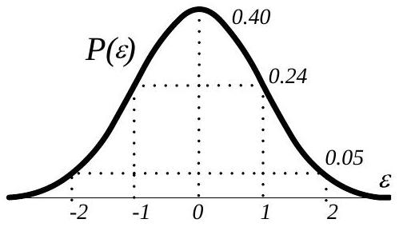

$$
P(\varepsilon)=\frac{1}{\sqrt{2 \pi}} e^{-\frac{1}{2} \varepsilon^{2}} .
$$

Производящая функция:

$$
\left\langle e^{p \varepsilon}\right\rangle=e^{p^{2} / 2}
$$

Средние значения:

$$
\left\langle\varepsilon^{2 n}\right\rangle=\frac{(2 n)!}{2^{n} n!}=1 \cdot 3 \cdot 5 \cdot \ldots \cdot(2 n-1), \quad\left\langle\varepsilon^{2 n+1}\right\rangle=0
$$

В частных случаях:

$$
\left\langle\varepsilon^{2}\right\rangle=1, \quad\left\langle\varepsilon^{4}\right\rangle=3, \quad\left\langle\varepsilon^{6}\right\rangle=15, \quad\left\langle\varepsilon^{8}\right\rangle=105, \quad\left\langle\varepsilon^{10}\right\rangle=945 .
$$

Вероятность отклонения от среднего:

$$
\Phi_{n}=\int_{-n}^{n} P(\varepsilon) d \varepsilon, \quad \Phi_{1}=0.6827, \quad \Phi_{2}=0.9545, \quad \Phi_{3}=0.9973
$$

## $\mathbf{R}_{67}$ : Гамма-распределение:

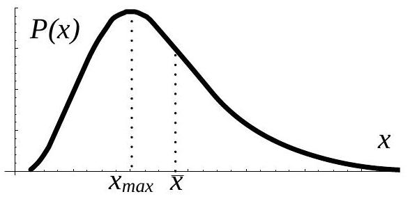

$$
P(x)=\frac{1}{\gamma \Gamma(\mu)}\left(\frac{x}{\gamma}\right)^{\mu-1} e^{-x / \gamma}
$$

Производящая функция:

$$
\left\langle e^{p x}\right\rangle=\frac{1}{(1-\gamma p)^{\mu}}
$$

Средние значения:

$$
\langle x\rangle=\mu \gamma, \quad\left\langle x^{2}\right\rangle=\mu(\mu+1) \gamma^{2}, \quad\left\langle x^{n}\right\rangle=\mu \cdot(\mu+1) \cdot \ldots \cdot(\mu+n-1) \gamma^{n} .
$$

Положение максимума: $x_{\max }=(\mu-1) \gamma$, асимметрия $2 / \sqrt{\mu}$, эксцесс $6 / \mu$.
$\mathbf{R}_{68}: \chi^{2}$ - распределение с п степенями свободы.
Сумма квадратов независимых гауссовых случайных чисел:

$$
u=\varepsilon_{1}^{2}+\ldots+\varepsilon_{n}^{2} .
$$

подчиняется гамма-распределению с $\mu=n / 2, \gamma=2$ :

$$
P_{n}(u)=\frac{1}{2^{n / 2} \Gamma(n / 2)} u^{n / 2-1} e^{-u / 2}
$$

Производящая функция:

$$
\left\langle e^{p x}\right\rangle=\frac{1}{(1-2 p)^{n / 2}}
$$

Средние значения: $\langle u\rangle=n, \quad\left\langle u^{2}\right\rangle=2 n+n^{2}$.
$\mathbf{R}_{69}$ : Смесь $\chi^{2}$ и нормального распределений.
Для $n$ независимых гауссовых чисел определим:

$$
\eta=\frac{\varepsilon_{1}+\ldots+\varepsilon_{N}}{\sqrt{N}}, \quad u=\frac{\varepsilon_{1}^{2}+\ldots+\varepsilon_{N}^{2}}{\sqrt{2}} .
$$

Обозначая $\mu=N / 2$, запишем производящую функцию и плотность вероятности при $u \geqslant \varepsilon^{2} / 2$ (при $u<\varepsilon^{2} / 2, P(\varepsilon, u)=0$ ):

$$
\left\langle e^{k \eta+p u}\right\rangle=\frac{1}{(1-p)^{\mu}} \exp \left\{\frac{k^{2} / 2}{1-p}\right\} . \quad P(\varepsilon, u)=\frac{e^{-u}\left(u-\varepsilon^{2} / 2\right)^{\mu-3 / 2}}{\Gamma(\mu-1 / 2) \sqrt{2 \pi}}
$$

Средние по $\eta$ - это Гаусс, по $u$ - гамма с $\gamma=1$ :

$$
\begin{aligned}
& \left\langle\eta^{2 n}\right\rangle=1 \cdot 3 \cdot 5 \cdot \ldots \cdot(2 n-1), \quad\left\langle\eta^{2 n+1}\right\rangle=0 \\
& \left\langle u^{n}\right\rangle=\mu(\mu+1) \cdot \ldots \cdot(\mu+n-1)
\end{aligned}
$$

Средние смешанных произведений:

$$
\begin{array}{ll}
\langle\eta u\rangle=0 & \left\langle\eta^{2 n+1} u^{m}\right\rangle=0 \\
\left\langle\eta^{2} u\right\rangle=1+\mu, & \left\langle\eta^{4} u\right\rangle=3(2+\mu), \\
\left\langle\eta^{2} u^{2}\right\rangle=2+3 \mu+\mu^{2}, & \left\langle\eta^{4} u^{2}\right\rangle=3\left(6+5 \mu+\mu^{2}\right), \\
\left\langle\eta^{2} u^{3}\right\rangle=6+11 \mu+6 \mu^{2}+\mu^{3}, & \left\langle\eta^{4} u^{3}\right\rangle=3\left(24+26 \mu+9 \mu^{2}+\mu^{3}\right), \\
& \quad\left\langle\eta^{4} u^{4}\right\rangle=3\left(120+154 \mu+71 \mu^{2}+14 \mu^{3}+\mu^{4}\right),
\end{array}
$$

## IX Некоторые полезные соотношения

$\mathbf{R}_{70}$ : Гауссовы интеграль

$$
\begin{aligned}
& \int_{-\infty}^{\infty} e^{-\alpha x^{2}+\beta x} d x=\sqrt{\frac{\pi}{\alpha}} e^{\beta^{2} / 4 \alpha} \\
& \int_{-\infty}^{\infty} e^{-\alpha x^{2}-\beta / x^{2}} d x=\sqrt{\frac{\pi}{\alpha}} e^{-2 \sqrt{\alpha \beta}} \\
& \int_{-\infty}^{\infty} e^{-\alpha\left(x-x_{1}\right)^{2}-\beta\left(x-x_{2}\right)^{2}} d x=\sqrt{\frac{\pi}{\alpha+\beta}} e^{-\alpha \beta\left(x_{2}-x_{1}\right)^{2} /(\alpha+\beta)}
\end{aligned}
$$

$\mathbf{R}_{71}$ : Интеграл вероятностей

$$
\operatorname{erf}(z)=\frac{2}{\sqrt{\pi}} \int_{0}^{z} e^{-x^{2}} d x
$$

Свойства:

$$
\operatorname{erf}(-z)=-\operatorname{erf}(z), \quad \operatorname{erf}(\infty)=1, \quad \operatorname{erf}(0)=0
$$

Представление в виде рядов:

$$
\operatorname{erf}(z)=\frac{2}{\sqrt{\pi}} \sum_{n=0}^{\infty} \frac{(-1)^{n}}{n!} \frac{z^{2 n+1}}{2 n+1}=\frac{2}{\sqrt{\pi}} e^{-z^{2}} \sum_{n=0}^{\infty} \frac{2^{n}}{1 \cdot 3 \cdot \ldots \cdot(2 n+1)} \cdot z^{2 n+1} .
$$

Общий гауссовый интеграл:

$$
\int_{0}^{\infty} e^{-\alpha x^{2}+\beta x} d x=\frac{1}{2} \sqrt{\frac{\pi}{\alpha}} e^{\beta^{2} / 4 \alpha}\left[1+\operatorname{erf}\left(\frac{\beta}{2 \sqrt{\alpha}}\right)\right]
$$

$\mathbf{R}_{72}$ : Гамма-функиия, $\operatorname{Re} z>0$

$$
\int_{0}^{\infty} x^{z-1} e^{-x} d x=\Gamma(z)
$$

Свойства гамма-функции:

$$
\begin{aligned}
& \Gamma(n+1)=n!, \quad \Gamma(1 / 2)=\sqrt{\pi}, \quad \Gamma(z+1)=z \Gamma(z) \\
& \Gamma(z) \Gamma(1-z)=\frac{\pi}{\sin (\pi z)}, \quad \Gamma(2 z)=\frac{2^{2 z-1}}{\sqrt{\pi}} \Gamma(z) \Gamma\left(z+\frac{1}{2}\right)
\end{aligned}
$$

Формула Стирлинга:

$$
n!\approx \sqrt{2 \pi n}\left(\frac{n}{e}\right)^{n}
$$

## $\mathbf{R}_{73}$ : Интеграль, сводящиеся $\kappa$ гамма-функиии.

Ниже $B(p, q)=\Gamma(p) \Gamma(q) / \Gamma(p+q)$ - бета-функция, и $p>0, q>0$ :

$$
\begin{aligned}
& \int_{0}^{\infty} x^{p-1} e^{-a x^{q}} d x=\frac{\Gamma(p / q)}{q a^{p / q}} \\
& \int_{0}^{\pi / 2}(\cos \phi)^{2 p-1}(\sin \phi)^{2 q-1} d \phi=\frac{1}{2} B(p, q) \\
& \int_{0}^{1}(1-t)^{p-1} t^{q-1} d t=B(p, q) \\
& \int_{0}^{\infty} \frac{z^{q-1}}{(1+z)^{p+q}} d z=B(p, q)
\end{aligned}
$$

$\mathbf{R}_{74}$ : Гиперболические функици.

$$
\operatorname{sh} x=\frac{e^{x}-e^{-x}}{2}, \quad \operatorname{ch} x=\frac{e^{x}+e^{-x}}{2}, \quad \text { th }=\frac{e^{x}-e^{-x}}{e^{x}+e^{-x}}
$$

## М: Математические приложения

В достаточно обширных приложениях содержатся важные факты из теории вероятностей, математического анализа и матричной алгебры.

## I Теория вероятностей

Вероятность характеризует частоту, с которой происходит событие. Если мы произвели некоторый опыт (испытание) $n$ раз, и при этом событие " $A$ " произошло $n_{A}$ раз, то при больших $n$ отношение $p(A)=n_{A} / n$ будет стремиться к определённому значению. Понятно, что оно всегда положительно и меньше единицы: $0 \leqslant p(A) \leqslant 1$.

Не стоит путать незнание и вероятность. Вероятности легко определяются, если в задаче есть определённая симметрия. Например, вероятность выпадания "решки" при подбрасывании монеты равна $1 / 2$. Аналогично для кости (кубика с шестью гранями) выпадение любой грани равновероятно и равно $1 / 6$. Для европейской рулетки с 18 -ю красными ячейками, 18-ю чёрными и одним зеро вероятность попадания шарика на любую из 37 ячеек, включая зеро, равна $1 / 37$.

Знание вероятностей позволяет легко подсчитывать, например, средний доход в азартных играх или финансовых операциях. Если мы получаем доходы $R_{i}>0$ или убытки $R_{i}<0$ с вероятностями $p_{i}$, то наш доход в среднем будет составлять величину:

$$
\bar{R}=R_{1} p_{1}+R_{2} p_{2}+\ldots+R_{q} p_{q}=\sum_{i=1}^{q} R_{i} p_{i} .
$$

Смысл этой формулы очень прост. Если мы сделаем большое число попыток $n$, то среди них $n_{1}$ раз получим доход $R_{1}, n_{2}$ - доход $R_{2}$, и т.д. Суммарный доход $R_{t o t}=R_{1} n_{1}+\ldots+R_{q} n_{q}$. Средний доход за одну игру $\bar{R}$ равен $R_{t o t} / n$, а вероятности получить доход $R_{i}$ обозначаются через $p_{i}=n_{i} / n$.

Пример: Сравним доход, получаемый при использовании двух стратегий игры на рулетке: (1) ставим 1 \$ на ячейку; (2) ставим 1 \$ на цвет. При угадывании конкретной ячейки казино выплачивает 35 \$ на поставленный $1 \$$ (вероятность этого $1 / 37$ ), иначе (с вероятностью $36 / 37$ ) ставка теряется. При угадывании цвета (18 ячеек) казино выплачивает $1 \$$, иначе (остальные 19 -ть ячеек) ставка теряется.

Средний "доход" обе стратегии будут давать одинаковый:

$$
\begin{aligned}
& \bar{R}=(35 \$) \cdot \frac{1}{37}-(1 \$) \cdot \frac{36}{37}=-\frac{1}{37} \$ \\
& \bar{R}=(1 \$) \cdot \frac{18}{37}-(1 \$) \cdot \frac{19}{37}=-\frac{1}{37} \$,
\end{aligned}
$$

- Различают элементарные и составные события. Например, при броске кости элементарным событием будет выпадение одной из граней: $\{1\},\{2\},\{3\},\{4\},\{5\},\{6\}$. Составное событие $A=$ "выпавшие очки делятся на три": $\{3,6\}$, или $B=$ "выпало больше 4 -х": $\{5,6\}$. Таким образом, составные события состоят из элементарных.

Два события называют несовместными или непересекающимися, если они не имеют ни одного общего элемента. При броске одной кости не может выпасть сразу и 1 , и 5 . Не может одновременно произойти $A=\{2,4,6\}=$ "чётные очки" и $B=\{1,3,5\}=$ "нечётные очки". Для несовместных событий $A$ и $B$ вероятность того, что произойдёт или одно, или другое, равна:

$$
p(A+B)=p(A)+p(B)
$$

Действительно, если мы проводим опыт $n$ раз, то событие $A$ произойдёт $n_{A}$ раз, а событие $B-n_{B}$ раз. Понятно, что составное событие "или $A$, или $B$ " происходит $n_{A+B}=n_{A}+n_{B}$ раз (если они не могут произойти одновременно!).

Все элементарные события $A_{i}$ составляют полную группу, т.е. все они попарно несовместны, а сумма их вероятностей равна единице.

- Наглядно полную группу элементарных событий можно представить, как некоторое множество не пересекающихся друг с другом областей. При этом площадь каждой области пропорциональна вероятности данного события:
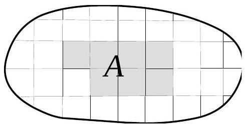

Правило сложения вероятностей представляет собой суммирование площадей таких областей. Составное событие $A$ включает в себя несколько элементарных событий-областей, и $p(A)$ равна сумме их вероятностей.

Суммарная площадь всех элементарных событий равна единице. Если некоторое составное событие $A$ имеет вероятность $p(A)$, то вероятность того, что оно не произойдёт $(\bar{A})$, равна $p(\bar{A})=1-p(A)$.

- Два сложных (составных) события $A, B$ могут иметь общие элементарные события. В этом случае мы говорим, что они пересекаются. Чтобы они совместно реализовались, необходимо наступление хотя бы одного элементарного события из их пересечения.

Тот факт, что свершились и $A$, и $B$, обозначают как $A \cdot B$. Совместное наступление этих двух событий называют также их пересечением.

Аналогично, если произошло или $A$, или $B$, или оба, это означает, что случилось одно из элементарных событий из $A$ или из $B$. Такое объединяющее логическое 'или' обозначают $A+B$, и говорят об объединении событий.

Например, при броске кости события $A=$ "выпавшие очки делятся на три": $\{3,6\}$, и $B=$ "выпало больше 4 -х": $\{5,6\}$, имеют пересечение $A \cdot B$ : $\{6\}$ и объединение $A+B:\{3,5,6\}$.

На рисунках ниже символически представлены операции пересечения $A \cdot B$, объединения $A+B$ и отрицания $\bar{A}$. Результат соответствующей операции обозначен тёмным цветом.
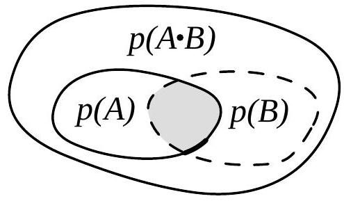
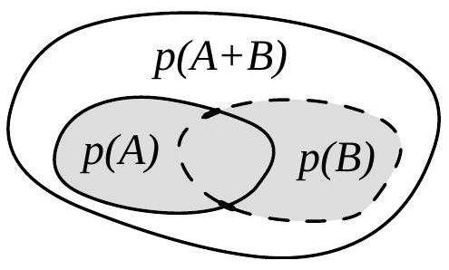
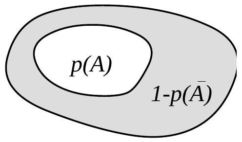

Сравнивая заштрихованные площади несложно выразить вероятность события $A+B$ (или $A$, или $B$, или оба) через вероятность одновременного наступления $A \cdot B$ (и $A$, и $B$ ):

$$
p(A+B)=p(A)+p(B)-p(A \cdot B)=1-p(\bar{A} \cdot \bar{B}) .
$$

Действительно, вероятность события $A+B$ равна суммарной площади $p(A)$ и $p(B)$ минус площадь их пересечения $p(A \cdot B)$, которую мы учитываем дважды, один раз в $p(A)$, другой раз в $p(B)$ (см. первый рисунок выше). Аналогично доказывается более общее соотношение:

$$
p(A+B+C+\ldots)=1-p(\bar{A} \cdot \bar{B} \cdot \bar{C} \cdot \ldots) .
$$

Другими словами, вероятность того, что произойдёт хотя бы одно событие, меньше единицы на вероятность того, что не произойдёт ни одно из событий.

- Условная вероятность характеризует частоту наступления события $A$ при условии, что произошло событие $B$ :

$$
p(B \Rightarrow A)=\frac{p(A \cdot B)}{p(B)}
$$

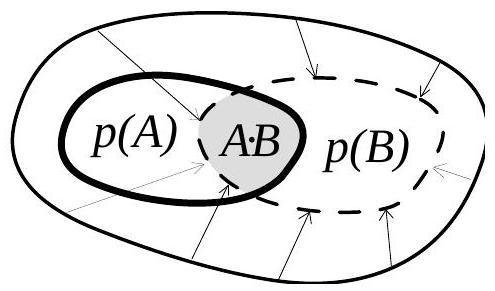

Чтобы произошло $A$ при наступлении события $B$, необходимо свершение совместного события ( $A$ и $B$ ). Именно ему пропорциональна условная вероятность. Так как нам известно, что $B$ произошло, то всё пространство элементарных вероятностей сжимается до размеров $B$. Но, поскольку его площадь не равна единице, мы для нормировки делим на $p(B)$.

Это можно представить себе и по-другому. Пусть мы провели $n$ испытаний, и из них событие $B$ произошло $n_{B}$ раз, событие $A-n_{A}$, а одновременно они случились $n_{A B}$ раз. При вычислении условной вероятности нас интересует вероятность события $A$ во всех ситуациях, когда происходило $B$. Отношение числа таких событий $n_{A B}$ к общему числу событий $n_{B}$ и даёт нам условную вероятность $p(B \Rightarrow A)=n_{A B} / n_{B}=\left(n_{A B} / n\right) /\left(n_{B} / n\right)$.

Условная вероятность чрезвычайно важна, так как позволяет связать друг с другом разнообразные события, характеризуя причинно-следственную связь. Мы говорим, что, если Центральный Банк поднимет учётную ставку, то, скорее всего, фондовый рынок отреагирует падением. Оба события являются вероятностными, но они связаны друг с другом, и вероятность падения рынка повышается, если происходит подъём процентных ставок.

Два события $A$ и $B$ называют независимыми, если вероятность события $A$ не зависит от наступления события $B$ и равна $p(A)$ в любом случае. Для независимых событий $p(B \Rightarrow A)=p(A)=p(A \cdot B) / P(B)$, и, следовательно,

$$
\begin{equation*}
p(A \cdot B)=p(A) p(B) \tag{6}
\end{equation*}
$$

Таким образом, независимость - это, с одной стороны, достаточно специфическое соотношение между значениями вероятностей (площадей областей), которые соответствуют событиям $A, B, A \cdot B$. С другой стороны, это важнейшее свойство отсутствия между ними связи. Так, при бросании $2-\mathrm{x}$ костей выпадение определённой грани на каждой из них не зависит от другой. Поэтому вероятность получить, например, две единицы равна $(1 / 6)(1 / 6)=1 / 36$.

## II Векторный анализ

Вектор - это набор из $n$ чисел $\mathbf{a}=\left(a_{1}, \ldots, a_{n}\right)$, которые называют компонентами вектора. Векторами являются: положение тела в пространстве, его скорость, набор весовых коэффициентов, определяющих долю $i$-той акции в инвестиционном портфеле, значение ВВП, произведенное $i$-той страной, и т.д.

Вектора можно складывать (покомпонентно), получая новый вектор:

$$
\mathbf{a}+\mathbf{b}=\left(a_{1}+b_{1}, \ldots, a_{n}+b_{n}\right),
$$

и умножать на число $\mu \mathbf{a}=\left(\mu a_{1}, \ldots, \mu a_{n}\right)$. Для двух векторов вводится операция скалярного произведения, равная числу (скаляру):

$$
\mathbf{a} \cdot \mathbf{b}=a_{1} b_{1}+a_{2} b_{2}+\ldots+a_{n} b_{n}=\sum_{i=1}^{n} a_{i} b_{i} .
$$

Соответственно, длина вектора:

$$
|\mathbf{a}|=\sqrt{\mathbf{a} \cdot \mathbf{a}}=\sqrt{a_{1}^{2}+a_{2}^{2}+\ldots+a_{n}^{2}}
$$

является $n$-мерным обобщением теоремы Пифагора. Косинус угла между двумя векторами определяется следующим образом:

$$
\cos \alpha=\frac{\mathbf{a} \cdot \mathbf{b}}{|\mathbf{a}||\mathbf{b}|}
$$

Если он равен нулю, то говорят, что векторы нормальны (перпендикулярны) друг другу.

Для нескольких скалярных произведений важна последовательность умножений, и в общем случае

$$
(\mathbf{a} \cdot \mathbf{b}) \cdot \mathbf{c} \neq \mathbf{a} \cdot(\mathbf{b} \cdot \mathbf{c}) .
$$

Дело в том, что в первом случае мы умножаем вектор с на число $(\mathbf{a} \cdot \mathbf{b})$, а во втором - другой вектор $\mathbf{a}$ на число ( $\mathbf{b \cdot c}$ ). Если $\mathbf{c}$ и $\mathbf{a}$ имеют различное направление, то умножением на число нельзя сделать их одинаковыми.

К векторам, в общем случае, необходимо относиться, как к абстрактному набору из $n$ чисел, для которых введены операции сложения и умножения на число, а также операция скалярного произведения. Например, вероятности всех элементарных событий можно рассматривать, как вектор $\mathbf{p}=\left(p_{1}, \ldots, p_{n}\right)$, а условие нормировки записывать в виде $\mathbf{p} \cdot \mathbf{u}=1$, где $\mathbf{u}=(1, \ldots, 1)$.

- В двухмерном случае $n=2$ в декартовых прямоугольных координатах ( $x, y$ ) вектор $\mathbf{a}=\left(a_{x}, a_{y}\right)$ имеет простой геометрический смысл направленного отрезка с проекциями на оси $x$ и $y$, равными $a_{x}$ и $a_{y}$ :
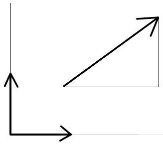
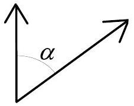

С осями координат удобно связать два единичных ( $\mathbf{i}^{2}=\mathbf{j}^{2}=1$ ), нормальных ( $\mathbf{i} \cdot \mathbf{j}=0$ ) вектора. Любой вектор тогда может быть разложен по этому базису $(\mathbf{i}, \mathbf{j})$ :

$$
\mathbf{a}=a_{x} \mathbf{i}+a_{y} \mathbf{j},
$$

где $a_{x}=a_{1}=\mathbf{a} \cdot \mathbf{i}, \quad a_{y}=a_{2}=\mathbf{a} \cdot \mathbf{j}$ - проекции вектора на оси $x$ и $y$. Представив $\mathbf{a}$ и $\mathbf{b}$ в таком виде, несложно убедиться, что $\mathbf{a} \cdot \mathbf{b}= a_{x} b_{x}+a_{y} b_{y}$.

Аналогично, в трёхмерном случае $n=3$ вводят три единичных взаимно перпендикулярных вектора $\mathbf{i}, \mathbf{j}$ и $\mathbf{k}$. Любой вектор в трёхмерном пространстве может быть по ним разложен: $\mathbf{a}=a_{x} \mathbf{i}+a_{y} \mathbf{j}+a_{z} \mathbf{k}$.

Геометрически сложение векторов описывается правилом параллелограмма, а умножение на число $\mu$ во столько же раз удлиняет вектор:
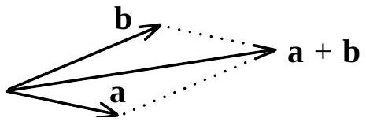
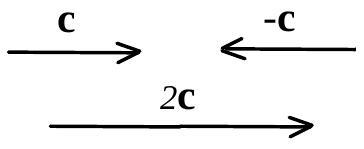

Правило параллелограмма имеет простую физическую интерпретацию. Если два мышонка тащат кусок сыра в разные стороны и с различными силами $\mathbf{a}$ и $\mathbf{b}$, то их общее усилие будет направлено по диагонали $\mathbf{a}+\mathbf{b}$.

- В общем случае набор из $n$ векторов $\mathbf{e}_{1}, \ldots, \mathbf{e}_{n}$ называют базисом, если они являются полной системой линейно независимых векторов. Линейная независимость означает, что ни один из векторов базиса не может быть представлен в виде линейной комбинации остальных векторов, а полнота гарантирует, что произвольный вектор $\mathbf{a}=\left(a_{1}, \ldots, a_{n}\right)$ может быть разложен по этому базису:

$$
\mathbf{a}=a_{1} \mathbf{e}_{1}+\ldots+a_{n} \mathbf{e}_{n}=\sum_{i=1}^{n} a_{i} \mathbf{e}_{i} .
$$

Размерность пространства равна числу базисных векторов. Векторы базиса, вообще говоря, не обязательно должны быть перпендикулярны друг другу и иметь единичную длину.

- Для трёхмерного пространства (в котором мы живём) можно ввести ещё одну операцию между векторами, называемую векторным произведением. В отличие от скалярного произведения, которое представляет собой число, векторное произведение - это вектор:

$$
\mathbf{a} \times \mathbf{b}=\left(a_{2} b_{3}-a_{3} b_{2}, a_{3} b_{1}-a_{1} b_{3}, a_{1} b_{2}-a_{2} b_{1}\right)=\operatorname{det}\left(\begin{array}{ccc}
\mathbf{i} & \mathbf{j} & \mathbf{k} \\
a_{1} & a_{2} & a_{3} \\
b_{1} & b_{2} & b_{3}
\end{array}\right),
$$

где $\mathbf{i}, \mathbf{j}, \mathbf{k}$ - базисные векторы, a det - определитель матрицы (стр. 308). Векторное произведение обладает рядом важных свойств, которые можно проверить в покомпонентном виде. Прежде всего, оно антисимметричHO:

$$
\mathbf{a} \times \mathbf{b}=-\mathbf{b} \times \mathbf{a} .
$$

Для смешанного произведения справедливо "правило нахальства", при котором скалярное произведение "выталкивает" один вектор из векторного, сдвигая всех вправо:

$$
\mathbf{c} \cdot(\mathbf{a} \times \mathbf{b})=(\mathbf{c} \times \mathbf{a}) \cdot \mathbf{b} .
$$

Наконец, часто используется правило " $\sigma^{\prime}$ ац, минус и, аб", которое нужно произносить с ударением на первую букву $\ddot{-}$ :

$$
\mathbf{a} \times(\mathbf{b} \times \mathbf{c})=\mathbf{b}(\mathbf{a} \cdot \mathbf{c})-\mathbf{c}(\mathbf{a} \cdot \mathbf{b}) .
$$

Длина векторного произведения пропорциональна синусу угла между векторами $|\mathbf{a} \times \mathbf{b}|=|\mathbf{a}||\mathbf{b}| \sin \alpha$. В частности, если векторы параллельны, то их векторное произведение равно нулю. Вектор $\mathbf{a} \times \mathbf{b}$ перпендикулярен плоскости, в которой лежат $\mathbf{a}$ и $\mathbf{b}$. Его направление (вверх или вниз) определяется по правилу штопора. Если от вектора $\mathbf{a}$ к вектору $\mathbf{b}$ вкручивать штопор, то его направление движения будет указывать в сторону $\mathbf{a} \times \mathbf{b}$.
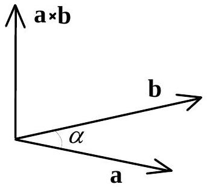
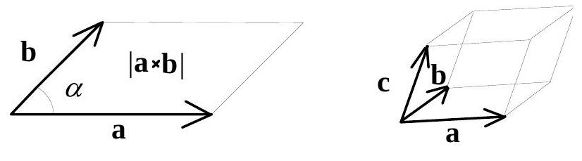

Векторное произведение имеет простой геометрический смысл и по модулю равно площади параллелограмма, образованного векторами $\mathbf{a}$ и b. Соответственно, смешанное произведение $\mathbf{c} \cdot(\mathbf{a} \times \mathbf{b})$ по модулю равно объему параллелепипеда, построенного на векторах $\mathbf{a}, \mathbf{b}$ и $\mathbf{c}$.

- При помощи векторов можно описывать различные геометрические объекты в пространстве. Так, параметрическое уравнение прямой имеет вид:

$$
\mathbf{r}=\mathbf{r}_{0}+\mathbf{n} t,
$$

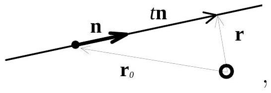

где вектор $\mathbf{n}$ направлен вдоль прямой, а $\mathbf{r}_{0}$ - некоторая точка, лежащая на ней. Действительно, пусть вектор $\mathbf{r}$ выходит из начала координат (кружок на схеме) в направлении произвольной точки на прямой, положение которой нас интересует. Радиус-вектор $\mathbf{r}_{0}$ направлен в фиксированную точку, через которую проходит прямая. Прямая полностью задаётся этой точкой и направлением $\mathbf{n}$. Всегда можно подобрать такой скалярный параметр $t$, чтобы вектор $t \mathbf{n}$ оказался в точности между точками $\mathbf{r}$ и $\mathbf{r}_{0}$. Из геометрического сложения этих векторов и получается параметрическое уравнение прямой. Его также можно переписать в явном координатном виде:

$$
\frac{x-x_{0}}{n_{x}}=\frac{y-y_{0}}{n_{y}}=\frac{z-z_{0}}{n_{z}}=t,
$$

где $x, y, z$ - компоненты вектора $\mathbf{r}$ (координаты точки на прямой).
Плоскость задаётся при помощи фиксированной точки $\mathbf{r}_{0}$, через которую она проходит, и перпендикулярного к ней вектора $\mathbf{n}$. Разница вектора к произвольной точке на плоскости $\mathbf{r}$ и $\mathbf{r}_{0}$ лежит в этой плоскости, поэтому перпендикулярна к $\mathbf{n}$. Следовательно, уравнение плоскости можно представить следующим образом:

$$
\left(\mathbf{r}-\mathbf{r}_{0}\right) \cdot \mathbf{n}=0,
$$

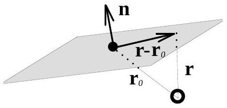

Соответственно, уравнение плоскости в координатном виде может быть записано, как $x n_{x}+y n_{y}+z n_{z}=d$, где $d=\mathbf{r}_{\mathbf{0}} \mathbf{n}$.

Сфера радиуса $R$ - это множество точек, равноудалённых от центра:

$$
\left(\mathbf{r}-\mathbf{r}_{0}\right)^{2}=R^{2},
$$

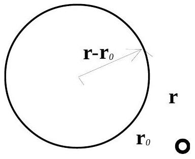

Её уравнение в векторных обозначениях задаётся числом $R$ и вектором положения центра окружности $\mathbf{r}_{0}$.

## III Тензорная и матричная алгебра

Матрица - это набор чисел, упорядоченных в виде прямоугольной таблицы. Компоненты вектора имеют только один индекс $a_{i}$, тогда как у матрицы их два: $a_{i j}$.

Рассмотрим квадратную матрицу А:

$$
\mathbf{A}=\left(\begin{array}{cccc}
a_{11} & a_{12} & \ldots & a_{1 n} \\
a_{21} & a_{22} & \ldots & a_{2 n} \\
\vdots & \vdots & \ddots & \vdots \\
a_{n 1} & a_{n 2} & \ldots & a_{n n}
\end{array}\right) .
$$

Заметим, что первый индекс чисел $a_{i j}$ увеличивается при переходе к следующей строке, а второй - к следующему столбцу. Числа $a_{i j}$ называют элементами матриц,b, а числа, имеющие одинаковые значения индексов $a_{i i}$, - диагональными элементами.

Как и в случае с векторами, матрицы можно поэлементно складывать и умножать на число:

$$
\mathbf{C}=\alpha \mathbf{A}+\beta \mathbf{B} \quad \Rightarrow \quad c_{i j}=\alpha a_{i j}+\beta b_{i j} .
$$

Кроме этого, вводится операция умножения матриц друг на друга, в результате которой опять получается матрица. Для матриц $\mathbf{A}$ и $\mathbf{B}$ с элементами $a_{i j}$ и $b_{i j}$ матрица $\mathbf{C}$, равная их произведению, имеет элементы:

$$
\begin{equation*}
c_{i j}=\sum_{k=1}^{n} a_{i k} b_{k j} . \tag{7}
\end{equation*}
$$

В табличной форме умножение матриц можно представить в виде "npaвила лома". Чтобы получить $c_{i j}$, необходимо взять $i$-ю строку матрицы $\mathbf{A}$ (лом) и пробить им дыру в стенке из $j$-го столбика матрицы $\mathbf{B}$ :

$$
\mathbf{C}=\mathbf{A} \cdot \mathbf{B}=\left(\begin{array}{cccc}
a_{11} & a_{12} & \ldots & a_{1 n} \\
\mathbf{a}_{\mathbf{2 1}} & \mathbf{a}_{\mathbf{2 2}} & \ldots & \mathbf{a}_{\mathbf{2 n}} \\
\vdots & \vdots & \ddots & \vdots \\
a_{n 1} & a_{n 2} & \ldots & a_{n n}
\end{array}\right) \cdot\left(\begin{array}{cccc}
b_{11} & \mathbf{b}_{\mathbf{1 2}} & \ldots & b_{1 n} \\
b_{21} & \mathbf{b}_{\mathbf{2 2}} & \ldots & b_{2 n} \\
\vdots & \vdots & \ddots & \vdots \\
b_{n 1} & \mathbf{b}_{\mathbf{n 2}} & \ldots & b_{n n}
\end{array}\right) .
$$

После этого на месте дыры в матрице $\mathbf{C}$ записать сумму произведений элементов лома и стенки: $c_{i j}=a_{i 1} b_{1 j}+a_{i 2} b_{2 j}+\ldots+a_{i n} b_{n j}$.

- Из определения (7) видно, что при перемножении матриц их можно группировать произвольным образом (умножение ассоциативно):

$$
(\mathbf{A} \cdot \mathbf{B}) \cdot \mathbf{C}=\mathbf{A} \cdot(\mathbf{B} \cdot \mathbf{C})
$$

но нельзя переставлять местами (умножение не коммутативно):

$$
\mathbf{A} \cdot \mathbf{B} \neq \mathbf{B} \cdot \mathbf{A} .
$$

Т.е. всё с точностью до наоборот по сравнению со скалярным умножением векторов! Необходимо помнить, что произведение матриц не является обычным арифметическим умножением. Это сокращение для достаточно специфического способа вычисления (7) элементов $c_{i j}$ из $a_{i j}$ и $b_{i j}$.

- Из матрицы А можно получить новую, транспонированную матрицу $\mathbf{A}^{T}$, в которой столбцы и строчки переставлены местами:

$$
\mathbf{A}^{T}=\left(\begin{array}{cccc}
a_{11} & a_{21} & \ldots & a_{n 1} \\
a_{12} & a_{22} & \ldots & a_{n 2} \\
\vdots & \vdots & \ddots & \vdots \\
a_{1 n} & a_{2 n} & \ldots & a_{n n}
\end{array}\right) .
$$

Таким образом, если элементы матрицы $\mathbf{A}$ равны $a_{i j}$, то в транспонированной матрице $\mathbf{A}^{T}$ они будут получены перестановкой индексов: $a_{i j}^{T}= a_{j i}$. Матрица, которая не меняется при транспонировании $a_{i j}=a_{j i}$, называется симметричной. Такой тип матриц встречается в финансах и экономике очень часто.

- Особое значение имеет единичная матрица, в которой все элементы равны нулю, за исключением диагональных, равных единице. Так, для $n=3$ имеем:

$$
\mathbf{1}=\left(\begin{array}{lll}
1 & 0 & 0 \\
0 & 1 & 0 \\
0 & 0 & 1
\end{array}\right) .
$$

Умножение единичной матрицы на любую $\mathbf{A}$ не меняет эту матрицу:

$$
\mathbf{1} \cdot \mathbf{A}=\mathbf{A} \cdot \mathbf{1}=\mathbf{A} .
$$

Заметим, что единичная матрица может быть переставлена местами с любой матрицей. Это легко проверить напрямую, умножая произвольную матрицу на единичную слева или справа. Вообще говорят, что две матрицы коммутируют, если результат их умножения не зависит от их порядка. Еще раз подчеркнём, что в общем случае это не так, и за порядком произведения матриц необходимо внимательно следить.

- Для элементов единичной матрицы существует специальное обозначение, придуманное Кронекером:

$$
\delta_{i j}= \begin{cases}1 & i=j \\ 0 & i \neq j .\end{cases}
$$

Символ $\delta_{i j}$ "съедает" сумму, в которой участвует, и после этого "гибнет", заменяя везде суммационный индекс на свой второй:

$$
\sum_{j=1}^{n} \delta_{i j} a_{j}=a_{i} .
$$

Действительно, в сумме по $j$ окажутся равными нулю все слагаемые, за исключением случая, когда $j=i$. На месте символа $a_{j}$ может стоять любая матрица $a_{j p}$ или тензорнью выражения типа $a_{j p q}$.

- Матрица $\mathbf{A}$ имеет обратную матрицу $\mathbf{A}^{-1}$, если выполняется следующее уравнение:

$$
\mathbf{A}^{-1} \cdot \mathbf{A}=\mathbf{A} \cdot \mathbf{A}^{-1}=\mathbf{1}
$$

Обратная матрица $\mathbf{A}^{-1}$ при перемножении может быть переставлена местами с $\mathbf{A}$, следовательно, они коммутируют друг с другом. Действительно, будем считать, что $\mathbf{A} \cdot \mathbf{A}^{-1}=\mathbf{1}$. Докажем выражение для переставленных матриц $\mathbf{A}^{-1} \cdot \mathbf{A}=\mathbf{1}$. Умножим его слева на матрицу $\mathbf{A}$ :

$$
\mathbf{A} \cdot \mathbf{A}^{-1} \cdot \mathbf{A}=\mathbf{A} \cdot \mathbf{1}=\mathbf{A} \quad=>\quad\left(\mathbf{A} \cdot \mathbf{A}^{-1}\right) \cdot \mathbf{A}=\mathbf{1} \cdot \mathbf{A}=\mathbf{A} .
$$

Так как умножение единичной матрицы на любую матрицу даёт её же, мы приходим к тождеству. Другое важное тождество:

$$
(\mathbf{A} \cdot \mathbf{B})^{-1}=\mathbf{B}^{-1} \cdot \mathbf{A}^{-1}
$$

проверяется умножением слева или справа на $\mathbf{A} \cdot \mathbf{B}$.

- В матричных обозначениях можно записать и вектор $\mathbf{w}$, представив его в виде столбика из $n$ чисел. При умножении матрицы на вектор получается другой вектор, равный:

$$
w_{i}^{\prime}=\sum_{k=1}^{n} a_{i k} w_{k}, \quad\left(\begin{array}{c}
w_{1}^{\prime} \\
\vdots \\
w_{n}^{\prime}
\end{array}\right)=\left(\begin{array}{ccc}
a_{11} & \ldots & a_{1 n} \\
\vdots & \ddots & \vdots \\
a_{n 1} & \ldots & a_{n n}
\end{array}\right) \cdot\left(\begin{array}{c}
w_{1} \\
\vdots \\
w_{n}
\end{array}\right) .
$$

Обратим внимание, что правило лома действует и в этом случае, только стенкой является единственный столбик вектора w.

Удобно и для вектора вводить также понятие транспонирования, при котором столбик превращается в строчку: $\mathbf{w}^{T}=\left(\begin{array}{lll}w_{1} & \ldots & w_{n}\end{array}\right)$.

- Транспонированные векторы позволяют компактно записывать квадратичные формы:

$$
\sum_{i, j=1}^{n} w_{i} a_{i j} w_{j}=\left(\begin{array}{lll}
w_{1} & \ldots & w_{n}
\end{array}\right) \cdot\left(\begin{array}{ccc}
a_{11} & \ldots & a_{1 n} \\
\vdots & \ddots & \vdots \\
a_{n 1} & \ldots & a_{n n}
\end{array}\right) \cdot\left(\begin{array}{c}
w_{1} \\
\vdots \\
w_{n}
\end{array}\right)=\mathbf{w}^{T} \cdot \mathbf{A} \cdot \mathbf{w} .
$$

Умножение строки на матрицу выполняется по тому же правилу лома, только лом теперь является единственной строкой. Квадратичная форма - это число, и её можно вычислять в любом порядке:

$$
w^{T} \cdot \mathbf{A} \cdot w=\left(w^{T} \cdot \mathbf{A}\right) \cdot w=w^{T} \cdot(\mathbf{A} \cdot w)
$$

Квадратичная форма не изменяется при перестановке $w_{i}$ и $w_{j}$, поэтому матрица $a_{i j}$ является симметричной: $a_{i j}=a_{j i}$. Точнее, любую матрицу $m_{i j}$ можно представить в виде суммы симметричной $a_{i j}=\left(m_{i j}+m_{j i}\right) / 2$ и антисимметричной матриц $b_{i j}=\left(m_{i j}-m_{j i}\right) / 2$, так что:

$$
m_{i j}=a_{i j}+b_{i j}
$$

В квадратичной форме антисимметричная $b_{i j}=-b_{j i}$ составляющая произвольной матрицы сокращается.

- Функция от матрицы понимается в смысле степенного ряда. Например, экспонента - это сокращённая запись бесконечного ряда:

$$
e^{\mathbf{A}}=\mathbf{1}+\frac{\mathbf{A}}{1!}+\frac{\mathbf{A}^{2}}{2!}+\ldots
$$

Интеграл от матричной экспоненты можно вычислить следующим образом:

$$
\int_{0}^{t} e^{\mathbf{A} \tau} d \tau=\sum_{k=0}^{\infty} \int_{0}^{t} \frac{\mathbf{A}^{k} \tau^{k}}{k!} d \tau=\sum_{k=0}^{\infty} \frac{\mathbf{A}^{k} t^{k+1}}{(k+1)!}=\mathbf{A}^{-1} \cdot\left[e^{\mathbf{A} t}-\mathbf{1}\right]
$$

где $\mathbf{A}^{-1}$ - обратная к $\mathbf{A}$ матрица, а $\mathbf{A}^{0}=\mathbf{1}$ - единичная.

- Важной характеристикой матрицы является сумма её диагональных элементов:

$$
\operatorname{Tr} \mathbf{A}=a_{11}+a_{22}+\ldots+a_{n n}
$$

Это число называют следом матрицы и обозначают при помощи символа $\operatorname{Tr}$ или Sp.

## IV Определители и собственные значения

- Для квадратной матрицы размером $2 \times 2$ введём число, которое называется определителем матрицы:

$$
\operatorname{det} \mathbf{A}=\operatorname{det}\left(\begin{array}{ll}
a_{11} & a_{12} \\
a_{21} & a_{22}
\end{array}\right)=a_{11} a_{22}-a_{12} a_{21} .
$$

Для вычисления определителя $\operatorname{det} \mathbf{A}$ необходимо взять произведение элементов матрицы "крест - накрест" и вычесть их друг из друга. В качестве упражнения стоит проверить, что определитель произведения любых двух матриц равен произведению определителей каждой из них:

$$
\begin{equation*}
\operatorname{det}(\mathbf{A} \cdot \mathbf{B})=\operatorname{det} \mathbf{A} \cdot \operatorname{det} \mathbf{B} . \tag{8}
\end{equation*}
$$

Это очень любопытное свойство. Умножение матриц является специфической процедурой (правило "лома"). Поэтому существование для каждой матрицы числа, удовлетворяющего обычному арифметическому правилу перемножения (8), является достаточно неожиданным.

Определитель с тем же свойством можно ввести и для матрицы $3 \times 3$ :

$$
\operatorname{det} \mathbf{A}=a_{11} \operatorname{det}\left(\begin{array}{ll}
a_{22} & a_{23} \\
a_{32} & a_{33}
\end{array}\right)-a_{12} \operatorname{det}\left(\begin{array}{ll}
a_{21} & a_{23} \\
a_{31} & a_{33}
\end{array}\right)+a_{13} \operatorname{det}\left(\begin{array}{ll}
a_{21} & a_{22} \\
a_{31} & a_{32}
\end{array}\right) .
$$

Чтобы его вычислить, необходимо взять элементы первой строки и для каждого из них вычеркнуть из матрицы строку и столбец, в котором этот элемент стоял. Затем найти определитель получившейся матрицы $2 \times 2$ и умножить его на этот элемент. Все такие произведения необходимо сложить со знаком плюс, если сумма номера строки и столбика, в котором стоит элемент, чётная, и со знаком минус, если нечётная.

Это определение можно распространить на матрицу произвольной размерности, вычисляя её определитель рекуррентным образом, сводя его к сумме (разности) определителей матриц с размерностью на единицу меньше. Определитель матрицы 2 x 2 тоже вычисляется по этому правилу, если считать, что определитель "матрицы" 1 x 1 равен её элементу.

Понятно, что для любой диагональной матрицы определитель равен произведению диагональных элементов:

$$
\operatorname{det}\left(\begin{array}{ccc}
a_{1} & 0 & 0 \\
0 & a_{2} & 0 \\
0 & 0 & \ddots
\end{array}\right)=a_{1} \cdot a_{2} \cdot \ldots
$$

Произведение двух диагональных матриц снова даёт диагональную. Понятно, что при этом выполняется правило (8).

- Определители обладают рядом полезных для их вычисления свойств:

□ Транспонирование не изменяет определителя $\operatorname{det} \mathbf{A}^{T}=\operatorname{det} \mathbf{A}$.

- Перестановка двух строк или столбцов меняет знак определителя.

△ Определитель не изменится, если к любой строке поэлементно прибавить другую строку, умноженную на произвольное число $\lambda$. То же и для столбцов.

- В различных задачах часто возникают системы линейных уравнений относительно $n$ неизвестных:

$$
\left(\begin{array}{cccc}
a_{11} & a_{12} & \ldots & a_{1 n} \\
a_{21} & a_{22} & \ldots & a_{2 n} \\
\vdots & \vdots & \ddots & \vdots \\
a_{n 1} & a_{n 2} & \ldots & a_{n n}
\end{array}\right) \cdot\left(\begin{array}{c}
x_{1} \\
x_{2} \\
\vdots \\
x_{n}
\end{array}\right)=\left(\begin{array}{c}
b_{1} \\
b_{2} \\
\vdots \\
b_{n}
\end{array}\right) .
$$

Эту систему можно переписать в матричных обозначениях и даже сразу получить её матричное решение (умножив слева на $\mathbf{A}^{-1}$ ):

$$
\mathbf{A} \cdot x=b \quad \Rightarrow \quad x=\mathbf{A}^{-1} \cdot b .
$$

Естественно, для реального решения необходимо уметь находить обратную матрицу $\mathbf{A}^{-1}$ к исходной матрице системы $\mathbf{A}$. Решения системы можно выразить при помощи формул Краммера:

$$
x_{i}=\frac{\Delta_{i}}{\Delta},
$$

где $\Delta=\operatorname{det} \mathbf{A}$ - определитель матрицы $\mathbf{A}$, а $\Delta_{i}$ - определители матриц, полученных из $\mathbf{A}$ в результате замены $i$-го столбика на столбик $b$.

Если правая часть системы уравнений равна нулю: $\mathbf{A} \cdot x=0$, то решение, отличное от нуля, существует только в случае, если $\operatorname{det} \mathbf{A}=0$. Такая система уравнений называется однородной.

- Определители позволяют находить обратную матрицу. Для этого необходимо каждый элемент исходной матрицы заменить на определитель матрицы, полученной вычёркиванием строки и столбца, на пересечении которых он стоит. Затем умножить его на -1 , если сумма номера столбика и строки нечётная. После этого каждый элемент получившейся матрицы делят на определитель исходной и транспонируют.

Пример: Найти обратную матрицу:

$$
\mathbf{A}=\left(\begin{array}{ccc}
2 & 1 & 0 \\
6 & 4 & 2 \\
1 & 0 & 0
\end{array}\right), \quad \mathbf{A}^{-1}=\frac{1}{2}\left(\begin{array}{ccc}
0 & 2 & -4 \\
0 & 0 & 1 \\
2 & -4 & 2
\end{array}\right)^{T}=\left(\begin{array}{ccc}
0 & 0 & 1 \\
1 & 0 & -2 \\
-2 & 0.5 & 1
\end{array}\right) .
$$

- Для матрицы $\mathbf{A}$ решим систему линейных уравнений вида:

$$
\begin{equation*}
\mathbf{A} \cdot u=\lambda u, \tag{9}
\end{equation*}
$$

где $\lambda$ - некоторое число, называемое собственным значением матрицы, а $u^{T}=\left(u_{1}, \ldots, u_{n}\right)$ - соответствующий ему собственный вектор.

Уравнение (9) - это система однородных уравнений с нулевой правой частью: $(\mathbf{A}-\lambda \mathbf{1}) \cdot u=0$. Она имеет отличное от нуля решение, только если её определитель равен нулю:

$$
\operatorname{det}\left(\begin{array}{cccc}
a_{11}-\lambda & a_{12} & \ldots & a_{1 n} \\
a_{21} & a_{22}-\lambda & \ldots & a_{2 n} \\
\vdots & \vdots & \ddots & \vdots \\
a_{n 1} & a_{n 2} & \ldots & a_{n n}-\lambda
\end{array}\right)=0 .
$$

В результате получается характеристическое уравнение $n$-й степени относительно $\lambda$, имеющее, вообще говоря, $n$ решений: $\lambda_{1}, \lambda_{2}, \ldots, \lambda_{n}$.

Для каждого собственного значения $\lambda_{\alpha}$ после решения (9) получается соответствующий ему собственный вектор $u^{(\alpha)}=\left(u_{1}^{(\alpha)}, \ldots, u_{n}^{(\alpha)}\right)$. Верхний индекс - это номер собственного вектора, а не его компонента!

- Важный для приложений случай - действительные симметричные матрицы, для которых $\mathbf{A}^{T}=\mathbf{A}$ или $a_{i j}=a_{j i}$. Собственные значения действительной симметричной матрицы всегда действительны, а собственные векторы - ортогональны. Ортогональность означает, что скалярное произведение различных собственных векторов равно нулю:

$$
\begin{equation*}
u^{(\alpha)} u^{(\beta)}=\sum_{i=1}^{n} u_{i}^{(\alpha)} u_{i}^{(\beta)}=\delta_{\alpha \beta} . \tag{10}
\end{equation*}
$$

Так как уравнения (9) линейны, собственный вектор всегда можно умножить на константу, выбрав её таким образом, чтобы он стал единичным.

Пример: Найти собственные значения и вектора для матрицы А:
$\mathbf{A}=\left(\begin{array}{cc}1 & 2 \\ 2 & -2\end{array}\right) \quad \Rightarrow \quad \operatorname{det}\left(\begin{array}{cc}1-\lambda & 2 \\ 2 & -2-\lambda\end{array}\right)=\lambda^{2}+\lambda-6=0 \quad \Rightarrow \quad \lambda_{1}=-3, \lambda_{2}=2$.
Для каждого собственного значения решим систему уравнений:

$$
\left(\begin{array}{cc}
1 & 2 \\
2 & -2
\end{array}\right) \cdot\binom{u_{1}^{(1)}}{u_{2}^{(1)}}=-3\binom{u_{1}^{(1)}}{u_{2}^{(1)}} \quad=>\quad u_{2}^{(1)}=-2 u_{1}^{(1)} .
$$

Аналогично $u_{1}^{(2)}=2 u_{2}^{(2)}$. Поэтому, с учётом (10), имеем:

$$
u^{(1)}=\frac{1}{\sqrt{5}}\binom{1}{-2}, \quad u^{(2)}=\frac{1}{\sqrt{5}}\binom{2}{1}
$$

- Собственные вектора и собственные значения используются для диагонализации квадратичных форм. Предположим, что мы имеем выражение вида:

$$
F=x^{T} \cdot \mathbf{A} \cdot x=\sum_{i, j=1}^{n} x_{i} a_{i j} x_{j}
$$

Сделаем замену переменных и перейдём к величинам $y_{i}$ :

$$
\begin{equation*}
x_{i}=\sum_{\alpha=1}^{n} u_{i}^{(\alpha)} y_{\alpha} \tag{11}
\end{equation*}
$$

где $u_{i}^{(\alpha)}$ - собственные вектора матрицы А. Тогда:

$$
F=\sum_{i, j, \alpha, \beta=1}^{n} y_{\beta} u_{i}^{(\beta)} a_{i j} u_{j}^{(\alpha)} y_{\alpha}=\sum_{i, \alpha, \beta=1}^{n} y_{\beta} u_{i}^{(\beta)} \lambda_{\alpha} u_{i}^{(\alpha)} y_{\alpha}=\sum_{\alpha=1}^{n} \lambda_{\alpha} y_{\alpha}^{2}
$$

где мы сначала воспользовались уравнением на собственные значения, а затем ортогональностью собственных функций и свёрткой с символом Кронекера.

Таким образом, если нам известны собственные значения и вектора матрицы $\mathbf{A}$, мы всегда можем найти такое преобразование координат, которое диагонализирует квадратичную форму $x^{T} \cdot \mathbf{A} \cdot x$.

- Ещё одно замечательное свойство собственных значений состоит в том, что их произведение даёт определитель матрицы:

$$
\begin{equation*}
\operatorname{det} \mathbf{A}=\prod_{i=1}^{n} \lambda_{i}=\lambda_{1} \cdot \lambda_{2} \cdot \ldots \cdot \lambda_{n} \tag{12}
\end{equation*}
$$

Докажем это, введя матрицу $\mathbf{C}=c_{\alpha \beta}=u_{\alpha}^{(\beta)}$. Для неё справедливо соотношение:

$$
\left(\mathbf{C}^{T} \cdot \mathbf{C}\right)_{\alpha \beta}=\sum_{i=1}^{n} c_{\alpha i}^{T} c_{i \beta}=\sum_{i=1}^{n} c_{i \alpha} c_{i \beta}=\sum_{i=1}^{n} u_{i}^{(\alpha)} u_{i}^{(\beta)}=\delta_{\alpha \beta}
$$

Так как детерминант произведения матриц равен произведению их детерминантов, то $\operatorname{det} \mathbf{C}^{T} \operatorname{det} \mathbf{C}=1$. Введём матрицу $\mathbf{A}^{\prime}=\mathbf{C}^{T} \cdot \mathbf{A} \cdot \mathbf{C}$. Её определитель равен: $\operatorname{det} \mathbf{A}^{\prime}=\operatorname{det} \mathbf{C}^{T} \operatorname{det} \mathbf{A} \operatorname{det} \mathbf{C}=\operatorname{det} \mathbf{A}$. Матрицу $\mathbf{A}^{\prime}$ можно представить в виде:

$$
\mathbf{A}_{\alpha \beta}^{\prime}=\sum_{i, j=1}^{n} C_{i \alpha} A_{i j} C_{j \beta}=\sum_{i, j=1}^{n} u_{i}^{(\alpha)} A_{i j} u_{j}^{(\beta)}=\sum_{i=1}^{n} \lambda_{\beta} u_{i}^{(\alpha)} u_{i}^{(\beta)}=\lambda_{\beta} \delta_{\alpha \beta},
$$

где мы воспользовались уравнением на собственные значения и соотношением ортогональности. Так как $\mathbf{A}^{\prime}$ диагональна и $\operatorname{det} \mathbf{A}=\operatorname{det} \mathbf{A}^{\prime}$, мы приходим к (12).

## V Полезные интегралы

- Рассмотрим гауссовый интеграл (или интеграл Эйлера-Пуассона):

$$
I=\int_{-\infty}^{\infty} e^{-x^{2}} d x
$$

Он вычисляется в координатах $(r, \phi): x=r \cos \phi, y=r \sin \phi$, как двойной интеграл.

$$
I^{2}=\int_{-\infty}^{\infty} \int_{-\infty}^{\infty} e^{-x^{2}-y^{2}} d x d y=\int_{0}^{2 \pi} \int_{0}^{\infty} e^{-r^{2}} r d r d \phi=2 \pi \int_{0}^{\infty} e^{-r^{2}} d \frac{r^{2}}{2}=\pi
$$

где мы воспользовались тем, что в полярных координатах ( $r, \phi$ ) элемент площади равен произведению дуги $r d \phi$ на изменение радиуса $d r$ : $d x d y=r d \phi d r$. Это следует из якобиана или геометрических соображений (элемент дуги равен $r d \phi$, так как для полного изменения $\phi=[0 . .2 \pi]$ получается длина окружности $2 \pi r$ ).
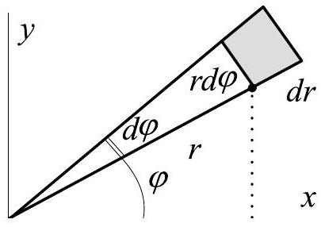

$$
\begin{aligned}
& x=r \cos \phi \\
& y=r \sin \phi
\end{aligned} \quad x^{2}+y^{2}=r^{2}
$$

$$
d x d y=r d r d \phi
$$

Извлекая квадратный корень и делая замену $x \rightarrow x \sqrt{\alpha}$, получаем:

$$
\begin{equation*}
I(\alpha)=\int_{-\infty}^{\infty} e^{-\alpha x^{2}} d x=\sqrt{\frac{\pi}{\alpha}} \tag{13}
\end{equation*}
$$

Полезный приём - взятие производных правой и левой частей по параметру для получения интегралов от чётных степеней $x^{2 n}$. Интеграл от нечетных степеней $x$, в силу антисимметричности подынтегральной функции, равен нулю. Если выделить полный квадрат в выражении $-\alpha x^{2}+\beta x$, получим $-\alpha \cdot\left[(x-\beta / 2 \alpha)^{2}-\beta^{2} / 4 \alpha^{2}\right]$. В результате легко вычисляется следующий интеграл:

$$
\begin{equation*}
\int_{-\infty}^{\infty} e^{-\alpha x^{2}+\beta x} d x=\sqrt{\frac{\pi}{\alpha}} e^{\beta^{2} / 4 \alpha} \tag{14}
\end{equation*}
$$

При помощи замены $x^{\prime}=x-\beta / 2 \alpha$ он сводится к (13).

- Ещё одну полезную формулу можно получить на основе интеграла:

$$
I(\alpha)=\int_{0}^{\infty} e^{-\alpha x} d x=-\left.\frac{1}{\alpha} e^{-\alpha x}\right|_{0} ^{\infty}=\frac{1}{\alpha}
$$

Взяв $n$ раз производную по $\alpha$ и определив факториал числа $n!=1 \cdot 2 \cdot . . \cdot n$, получаем:

$$
\begin{equation*}
\int_{0}^{\infty} x^{n} e^{-\alpha x} d x=\frac{n!}{\alpha^{n+1}} \tag{15}
\end{equation*}
$$

Интегралы такого типа встречаются достаточно часто, поэтому для них введено специальное обозначение в виде гамма-функи,ии:

$$
\begin{equation*}
\Gamma(z)=\int_{0}^{\infty} x^{z-1} e^{-x} d x \tag{16}
\end{equation*}
$$

Интегрируя по частям, убеждаемся, что $\Gamma(z+1)=z \Gamma(z)$. В частности, для целых аргументов: $\Gamma(n+1)=n!$. Для полуцелых аргументов гаммафункция сводится к гауссовым интегралам. Так, $\Gamma(1 / 2)=\sqrt{\pi}$.

При помощи (15) можно получить формулу, позволяющую вычислять факториал при больших $n$. Представим $x^{n} e^{-x}$ в виде $e^{f(x)}$. Функция $f(x)=-x+n \ln x$ имеет максимум в точке $x_{0}=n$, так как $f^{\prime}\left(x_{0}\right)= -1+n / x_{0}=0$. Разложим её в ряд в окрестности этой точки $\left(f^{\prime}(n)=0\right)$ :

$$
f(x)=f(n)+f^{\prime \prime}(n)(x-n)^{2} / 2+. .=-n+n \ln n-(x-n)^{2} / 2 n+. . .
$$

Поэтому

$$
n!\approx e^{-n+n \ln n} \int_{0}^{\infty} e^{-\frac{(x-n)^{2}}{2 n}} d x \approx e^{-n+n \ln n} \int_{-\infty}^{\infty} e^{-\frac{(x-n)^{2}}{2 n}} d x=e^{-n+n \ln n} \sqrt{2 \pi n}
$$

Во втором интеграле нижний предел заменён на $-\infty$, так как при большом $n$ максимум экспоненты уходит далеко вправо и становится всё более узким, поэтому интеграл от $-\infty$ до 0 практически равен нулю. Таким образом, мы получили формулу Стирлинга:

$$
n!\approx \sqrt{2 \pi n}\left(\frac{n}{e}\right)^{n}
$$

которая уже при $n=10$ дает относительную ошибку, меньшую $1 \%$.

## VI Интегралы и ряды Фурье

- Для целых чисел $n, m$ и $\imath^{2}=-1$ справедлива формула:

$$
\int_{a}^{b} e^{\imath 2 \pi(n-m) t / T} \frac{d t}{T}=\delta_{n m}= \begin{cases}1 & n=m  \tag{17}\\ 0 & n \neq m\end{cases}
$$

где $T=b-a$, а $\delta_{n m}$ - символ Кронекера. Рассмотрим периодическую функцию с периодом $T: f(t+T)=f(t)$. Представим её на интервале $t=[a \ldots b]$ в виде следующего ряда:

$$
\begin{equation*}
f(t)=\sum_{k=-\infty}^{\infty} c_{k} e^{\imath 2 \pi k t / T}=c_{0}+c_{1} e^{\imath 2 \pi t / T}+c_{-1} e^{-\imath 2 \pi t / T}+\ldots \tag{18}
\end{equation*}
$$

Чтобы $f(t)$ была действительна $f^{*}(t)=f(t)$, должны выполняться соотношения: $c_{k}^{*}=c_{-k}$. Для функции $f(t)$, при помощи (17), можно найти коэффициенты $c_{k}$ и тем самым определить Фурье-разложение:

$$
\int_{a}^{b} f(t) e^{-\imath 2 \pi n t / T} \frac{d t}{T}=\sum_{m=-\infty}^{\infty} c_{m} \int_{a}^{b} e^{\imath 2 \pi(m-n) t / T} \frac{d t}{T}=\sum_{m=-\infty}^{\infty} c_{m} \delta_{m n}=c_{n} .
$$

Если записать $c_{k}=\left(a_{k}-i b_{k}\right) / 2$, то разложение действительной функции можно представить в виде бесконечной суммы вида:

$$
f(t)=c_{0}+\sum_{k=1}^{\infty}\left[a_{k} \cos \left(w_{k} t\right)+b_{k} \sin \left(w_{k} t\right)\right]
$$

Частоты $w_{k}=2 \pi k / T$ называют гармониками.

- Рассмотрим симметричный интервал $[a, b]=[-T / 2, T / 2]$ и введём коэффициенты $\phi_{k}=T c_{k}$. Обозначив $t_{k}=2 \pi k / T$, запишем ряд Фурье:

$$
f(x)=\sum_{k=-\infty}^{\infty} \phi_{k} e^{\imath t_{k} x} \frac{1}{T}, \quad \quad \phi_{k}=\int_{-T / 2}^{T / 2} f(x) e^{-\imath t_{k} x} d x
$$

Устремим $T \rightarrow \infty$. Величину $t_{k}$ можно рассматривать, как непрерывную переменную, изменение которой равно $\Delta t=t_{k}-t_{k-1}=2 \pi / T$. По определению интеграла выражение для $f(x)$ можно записать в виде:

$$
\begin{equation*}
f(x)=\frac{1}{2 \pi} \int_{-\infty}^{\infty} \phi(t) e^{\imath t x} d t, \quad \phi(t)=\int_{-\infty}^{\infty} f(x) e^{-\imath t x} d x \tag{19}
\end{equation*}
$$

где $\phi(t)$ становится функцией параметра $t=t_{k}$. Соотношения (19) называются интегральным фурье-преобразованием.

- Понятно, что подстановка одного уравнения (19) в другое должно приводить к тождественному результату:

$$
\phi(t)=\int_{-\infty}^{\infty}\left[\int_{-\infty}^{\infty} \phi(s) e^{\imath s x} \frac{d s}{2 \pi}\right] e^{-\imath t x} d x=\int_{-\infty}^{\infty}\left[\int_{-\infty}^{\infty} e^{\imath x \cdot(s-t)} \frac{d x}{2 \pi}\right] \phi(s) d s
$$

Обозначим выражение в квадратных скобках во втором равенстве в виде следующей функции:

$$
\begin{equation*}
\delta(s-t)=\frac{1}{2 \pi} \int_{-\infty}^{\infty} e^{\imath x \cdot(s-t)} d x \tag{20}
\end{equation*}
$$

Тогда тождественное преобразование принимает форму:

$$
\begin{equation*}
\phi(t)=\int_{-\infty}^{\infty} \phi(s) \delta(s-t) d s \tag{21}
\end{equation*}
$$

Функция (20) со свойством (21) называется $\delta$ - функицей Дирака. Воспользуемся (17) на интервале $[-T / 2, T / 2]$, обозначив переменную интегрирования через $x$ :

$$
\frac{1}{2 \pi} \int_{-T / 2}^{T / 2} e^{\imath\left(t_{n}-t_{m}\right) x} d x=\frac{T}{2 \pi} \delta_{n m}
$$

При $T \rightarrow \infty$ это выражение стремится к функции Дирака. С другой стороны, если $t_{n} \neq t_{m}$ он равен нулю. Поэтому:

$$
\delta(s-t)= \begin{cases}\infty & s=t \\ 0 & s \neq t\end{cases}
$$

Это существенно разрывная функция, являющаяся непрерывным аналогом символа Кронекера. В силу её общего свойства (21) можно также записать условие "нормировки":

$$
\int_{-\infty}^{\infty} \delta(s-t) d s=1
$$

Другими словами, несмотря на то, что $\delta(0)=\infty$, интеграл (площадь) от этой функции равен единице. Так как $\delta$-функция равна нулю везде, за исключением $\delta(0)$, интеграл на самом деле может быть по любым пределам, включающим точку особенности функции Дирака. Отметим также очевидное свойство симметричности: $\delta(-x)=\delta(x)$.

## VII Метод характеристик

Достаточно часто возникают линейные уравнения в частных производных первого порядка:

$$
\begin{equation*}
\sum_{i=1}^{n} Y_{i}\left(x_{1}, \ldots, x_{n}\right) \frac{\partial \phi}{\partial x_{i}}=0 \tag{22}
\end{equation*}
$$

где $Y_{i}\left(x_{1}, \ldots, x_{n}\right)$ - заданные функции $n$ переменных, а $\phi=\phi\left(x_{1}, \ldots, x_{n}\right)$ неизвестная функция.

Так как это уравнение линейное, то для него справедлив npuницип $c y$ перпозиции. Если $\phi_{1}=\phi_{1}\left(x_{1}, \ldots, x_{n}\right)$ и $\phi_{2}=\phi_{2}\left(x_{1}, \ldots, x_{n}\right)$ - два решения (22), то их линейная комбинация $\phi=C_{1} \phi_{1}+C_{2} \phi_{2}$ с постоянными коэффициентами тоже будет решением дифференциального уравнения.

Если уравнение неоднородное и содержит в правой части функцию:

$$
\sum_{i=1}^{n} Y_{i}\left(x_{1}, \ldots, x_{n}\right) \frac{\partial \phi}{\partial x_{i}}=Y_{n+1}\left(x_{1}, . ., x_{n}\right),
$$

его можно свести к однородному. Для этого рассмотрим функцию $n+1$ аргументов $w\left(x_{1}, \ldots, x_{n}, \phi\right)=C=$ const, равную константе. Соответственно, её дифференциал будет равен нулю:

$$
d C=0=\sum_{i=1}^{n} \frac{\partial w}{\partial x_{i}} d x_{i}+\frac{\partial w}{\partial \phi} d \phi .
$$

Запишем в явном виде дифференциал для $d \phi$ :

$$
d C=0=\sum_{i=1}^{n} \frac{\partial w}{\partial x_{i}} d x_{i}+\frac{\partial w}{\partial \phi} \sum_{i=1}^{n} \frac{\partial \phi}{\partial x_{i}} d x_{i} \quad \Rightarrow \quad \frac{\partial \phi}{\partial x_{i}}=-\frac{\partial w}{\partial x_{i}} / \frac{\partial w}{\partial \phi} .
$$

Подставляя в неоднородное уравнение производную $\partial \phi / \partial x_{i}$ получаем однородное уравнение:

$$
\sum_{i=1}^{n} Y_{i} \frac{\partial \phi}{\partial x_{i}}=Y_{n+1} \quad \Rightarrow \quad \sum_{i=1}^{n} Y_{i} \frac{\partial w}{\partial x_{i}}+Y_{n+1} \frac{\partial w}{\partial \phi}=0 .
$$

Если неоднородность вида $Y_{n+1} \phi$, то она устраняется заменой $\phi=e^{\psi}$.
Решение уравнения в частных производных (22) может быть сведено к решению систем обыкновенных дифференциальных уравнений. Для этого используется метод характеристик.

- Метод характеристик. Рассмотрим $n$ переменных $x_{1}, \ldots, x_{n}$. Запишем систему дифференциальных уравнений в симметричном виде:

$$
\begin{equation*}
\frac{d x_{1}}{Y_{1}}=\frac{d x_{2}}{Y_{2}}=\ldots=\frac{d x_{n}}{Y_{n}} \tag{23}
\end{equation*}
$$

где $Y_{i}=Y_{i}\left(x_{1}, \ldots, x_{n}\right)$ - произвольные функции. Пусть зависимой переменной будет $x_{1}$. Тогда (23) соответствует $n-1$ дифференциальным уравнениям:

$$
\frac{d x_{2}}{d x_{1}}=\frac{Y_{2}}{Y_{1}}, \quad \frac{d x_{3}}{d x_{1}}=\frac{Y_{3}}{Y_{1}}, \quad \ldots, \quad \frac{d x_{n}}{d x_{1}}=\frac{Y_{n}}{Y_{1}} .
$$

Для решения $n-1$ уравнений потребуется $n-1$ начальных условий, и, следовательно, $n-1$ независимьх констант. Решения будут выглядеть в следующем виде $x_{i}=f_{i}\left(x_{1}, C_{1}, \ldots, C_{n-1}\right)$. Их можно разрешить относительно $C_{i}$, записав $C_{i}=g_{i}\left(x_{1}, \ldots, x_{n}\right)$. Подобные постоянные функции называются интегралами системь. Если мы возьмём произвольную функцию $F\left(g_{1}, \ldots, g_{n-1}\right)=C=$ const, то она будет общим интегралом системы, если $g_{i}$ - интегралы.

Рассмотрим теперь некоторый интеграл системы:

$$
C=\phi\left(x_{1}, \ldots, x_{n}\right) .
$$

Дифференциал константы равен нулю, поэтому:

$$
\begin{equation*}
\sum_{i=1}^{n} \frac{\partial \phi}{\partial x_{i}} d x_{i}=0 . \tag{24}
\end{equation*}
$$

Уравнения (23) можно записать в векторном виде: $d \mathbf{x}=\lambda \mathbf{Y}$, где $\lambda$ - произвольная константа, а $\mathbf{x}=\left(x_{1}, \ldots, x_{n}\right), \mathbf{Y}=\left(Y_{1}, \ldots, Y_{n}\right)$. Другими словами, вектора $d \mathbf{x}$ и $\mathbf{Y}$ являются параллельными. Выражение (24) эквивалентно утверждению о перпендикулярности двух векторов - градиента $\partial \phi / \partial x_{i}$ и $d \mathbf{x}$. Так как $d \mathbf{x}$ и $\mathbf{Y}$ параллельны, то перпендикулярными будут также градиент и Y. Поэтому:

$$
\begin{equation*}
\sum_{i=1}^{n} Y_{i}\left(x_{1}, \ldots, x_{n}\right) \frac{\partial \phi}{\partial x_{i}}=0 . \tag{25}
\end{equation*}
$$

Таким образом, чтобы решить уравнение в частных производных (25), необходимо найти интегралы системы дифференциальных уравнений (23) и с их помощью построить общий интеграл $C=\phi\left(x_{1}, \ldots, x_{n}\right)$, который и будет решением (25).

## VIII Экстремум и множители Лагранжа

- Экстремум (минимум или максимум) функции многих переменных $F\left(x_{1}, \ldots, x_{n}\right)$ находится так же, как и в одномерном случае. Для этого необходимо взять частные производные по каждой переменной и приравнять их к нулю. Решение получившейся системы $n$ уравнений и будет соответствовать экстремуму функции.

Чтобы понять, как ведёт себя функция в точке экстремума $\left\{\bar{x}_{1}, \ldots, \bar{x}_{n}\right\}$, можно записать ряд Тейлора в её окрестности:

$$
F\left(x_{1}, \ldots, x_{n}\right)=F\left(\bar{x}_{1}, \ldots, \bar{x}_{n}\right)+\sum_{i, j=1}^{n} a_{i j}\left(x_{i}-\bar{x}_{i}\right)\left(x_{j}-\bar{x}_{j}\right)+\ldots
$$

Первые производные $F$ равны нулю (условие экстремума), поэтому разложение представляет собой квадратичную форму. Знаки собственных значений матрицы $a_{i j}$ определяют характер экстремума. Так как $a_{i j}$ является симметричной матрицей, то с помощью линейного преобразования её всегда можно сделать диагональной (стр. 311) и проанализировать по каждой координате, минимум это или максимум.

Например, если $F(x, y)=x^{2}+y^{2}$, то это минимум, $F(x, y)=-x^{2}-y^{2}$ - максимум, а $F(x, y)=x^{2}-y^{2}$ - это поверхность, похожая на седло (вдоль оси $x$ функция возрастает, а вдоль $y$ - уменьшается).

- Иногда возникают задачи, в которых необходимо найти максимум или минимум при наличии ограничений. Например, нас интересует точка ( $x_{1}, \ldots, x_{n}$ ), максимизирующая функцию $F\left(x_{1}, \ldots, x_{n}\right)$ и одновременно находящаяся на поверхности $G\left(x_{1}, \ldots, x_{n}\right)=0$. Условия ограничений называют связями.

Рассмотрим сначала случай двух переменных $F(x, y)$ при ограничении $G(x, y)=0$. Предположим, что уравнение связи $G(x, y)=0$ позволяет выразить $y$ через $x: y=g(x)$. Тогда мы получим обычную одномерную задачу оптимизации, для решения которой необходимо взять производную функции $F(x, g(x))$ по $x$ и приравнять её к нулю:

$$
\begin{equation*}
\frac{\partial F}{\partial x}+\frac{\partial F}{\partial y} g^{\prime}(x)=0 . \tag{26}
\end{equation*}
$$

Решив это уравнение, мы получим точку экстремума $\left\{x_{0}, y_{0}=g\left(x_{0}\right)\right\}$.

- На практике не всегда удаётся решить уравнение $G(x, y)=0$. В этом случае можно взять дифференциал его левой и правой части и выразить производную $g(x)$ :

$$
d G=\frac{\partial G}{\partial x} d x+\frac{\partial G}{\partial y} d y=0 \quad=>\quad g^{\prime}(x)=\frac{d y}{d x}=-\frac{\partial G / \partial x}{\partial G / \partial y}
$$

Подставляя её в (26), получаем уравнение только для функций $F$ и $G$ :

$$
\begin{equation*}
\frac{\partial F}{\partial x} \frac{\partial G}{\partial y}=\frac{\partial F}{\partial y} \frac{\partial G}{\partial x} . \tag{27}
\end{equation*}
$$

Это же уравнение можно получить, минимизируя следующую функцию трех переменных:

$$
\begin{equation*}
L(x, y, \lambda)=F(x, y)+\lambda G(x, y) \tag{28}
\end{equation*}
$$

Действительно, взяв производные по $x$ и $y$ и приравняв их к нулю, получим уравнения:

$$
\frac{\partial F}{\partial x}+\lambda \frac{\partial G}{\partial x}=0, \quad \frac{\partial F}{\partial y}+\lambda \frac{\partial G}{\partial y}=0
$$

Исключая из них $\lambda$, мы приходим к уравнению (27). Если же взять производную $L$ по $\lambda$ и приравнять её к нулю, то получится связь $G(x, y)=0$.

Таким образом, в случае двух переменных имеется три способа поиска экстремума при наличии ограничения. Если одна переменная выражается через другую при помощи уравнения связи, то решается уравнение (26). Иначе - (27) или оптимизируется функиция Лагранжа (28).

- В многомерном случае оказывается более удобным третий способ. Если нам необходимо найти экстремум функции $F\left(x_{1}, \ldots, x_{n}\right)$ при наличии $m$-ограничений $G_{k}\left(x_{1}, \ldots, x_{n}\right)=0$, то вычисляется экстремум функции Лагранжа от $n+m$ переменных:

$$
L\left(x_{1}, \ldots, x_{n}, \lambda_{1}, \ldots, \lambda_{m}\right)=F\left(x_{1}, \ldots, x_{n}\right)+\sum_{k=1}^{m} \lambda_{k} G_{k}\left(x_{1}, \ldots, x_{n}\right)
$$

Производные по $\lambda_{i}$ приводят к связям $G_{k}\left(x_{1}, \ldots, x_{n}\right)=0$, а производные по $x_{i}$ можно записать в виде векторных уравнений при помощи градиента $\nabla=\left\{\partial / \partial x_{1}, \ldots, \partial / \partial x_{n}\right\}$ :

$$
\nabla F+\sum_{k=1}^{m} \lambda_{k} \nabla G_{k}=0
$$

Порядок действий обычно следующий. Сначала решают эти $n$ уравнений и находят положение экстремума, как функцию $\lambda_{k}: x_{i}=f_{i}\left(\lambda_{1}, \ldots, \lambda_{m}\right), i= 1, \ldots, n$. Затем подставляют их в уравнения связи и получают $m$ уравнений, из которых определяются $\lambda_{k}$.

## IX Вариация функционала

Функиионалом мы называем объект, при помощи которого каждой функции ставится в соответствие некоторое число. Простейшим примером функционала является определённый интеграл:

$$
F[f]=\int_{a}^{b} f(x) d x
$$

При подстановке в интеграл различных функций после интегрирования будут получаться некоторые числа - значения интеграла.

Переходя к дискретному представлению интеграла, подобные функционалы можно рассматривать как функции большого числа переменных:

$$
F\left(f_{1}, \ldots, f_{n}\right)=\sum_{i=1}^{n} f_{i} \Delta x
$$

где $\Delta x=(b-a) / n$, a $f_{i}=f(a+i \Delta x)$.
Аналогично обычным функциям решается задача поиска экстремума (максимума или минимума) функционала. Для этого необходимо найти функцию, для которой функционал даёт, например, наибольшее значение. В дискретном приближении задача эквивалентна поиску экстремума функции $n$ переменных $f_{1}, \ldots, f_{n}$. Необходимо взять производные по $f_{k}$ и приравнять их к нулю. Взятие производной от функционала называется его вариацией и в непрерывном пределе обозначается следующим образом:

$$
\frac{\partial F\left(f_{1}, \ldots, f_{n}\right)}{\partial f_{k}} \rightarrow \frac{\delta F[f]}{\delta f(x)} .
$$

В большинстве случаев взятие вариации достаточно тривиально, однако, если встречаются двойные интегралы, то необходима определённая осторожность. Например, для
$\int_{0}^{1} f^{2}(y) \int_{0}^{y} f^{4}(z) d z d y \approx\left[f_{1}^{2}\left(f_{1}^{4}\right)+f_{2}^{2}\left(f_{1}^{4}+f_{2}^{4}\right)+f_{3}^{2}\left(f_{1}^{4}+f_{2}^{4}+f_{3}^{4}\right)+\ldots\right] \Delta z \Delta y$
вариация по $f(x)$ будет равна:

$$
2 f(x) \int_{0}^{x} f^{4}(z) d z+4 f^{3}(x) \int_{x}^{1} f^{2}(y) d y .
$$

Обращаем внимание на нижний предел во втором интеграле. Проверить это соотношение проще всего, взяв производную ряда по некоторому конкретному значению $f_{k}$, например, по $f_{5}$.

Естественно, представлять каждый раз функционалы в виде интегральных сумм - достаточно утомительное занятие. Удобнее использовать функции Дирака $\delta(x)$ и Хэвисайда $\Theta(x)$ :

$$
\delta(x)=\left\{\begin{array}{ll}
\infty & x=0 \\
0 & x \neq 0,
\end{array} \quad \Theta(x)= \begin{cases}0 & x<0 \\
1 & x \geq 0\end{cases}\right.
$$

Функция Дирака обобщает на непрерывный случай символ Кронекера:

$$
\frac{\partial f_{i}}{\partial f_{j}}=\delta_{i j} \quad \rightarrow \quad \frac{\delta f(y)}{\delta f(x)}=\delta(y-x)
$$

Ступенчатая функция Хэвисайда позволяет бороться с пределами интегрирования, зависящими от времени. Предыдущий пример можно записать в следующем виде:

$$
I[f]=\int_{0}^{1} \int_{0}^{1} f^{2}(y) f^{4}(z) \Theta(y-z) d z d y
$$

Вычисляя вариацию произведения аналогично производной произведения, получаем:

$$
\frac{\delta I}{\delta f(x)}=\int_{0}^{1} \int_{0}^{1}\left[2 f(y) \delta(y-x) f^{4}(z)+f^{2}(y) 4 f^{3}(z) \delta(z-x)\right] \Theta(y-z) d z d y
$$

Проинтегрируем с функцией Дирака (стр. 315):

$$
\frac{\delta I}{\delta f(x)}=\int_{0}^{1} 2 f(x) f^{4}(z) \Theta(x-z) d z+\int_{0}^{1} f^{2}(y) 4 f^{3}(x) \Theta(y-x) d y
$$

Функция Хэвисайда ограничивает пределы интегрирования, и окончательный результат имеет вид:

$$
\frac{\delta I}{\delta f(x)}=2 f(x) \int_{0}^{x} f^{4}(z) d z+4 f^{3}(x) \int_{x}^{1} f^{2}(y) d y
$$

Подобная техника применима и тогда, когда функционал зависит от производной функции. В этом случае:

$$
\frac{\delta f^{\prime}(y)}{\delta f(x)}=\frac{d}{d y} \frac{\delta f(y)}{\delta f(x)}=\delta^{\prime}(y-x)
$$

Дальнейшее интегрирование с производной от дельта-функции $\delta^{\prime}(x-y)$ осуществляется "по частям".

## Н: Помощь

В этой главе приведены решения задач, которые в основном тексте были помечены символом ( $\lessdot \mathrm{H}_{i}$ ).

- $\mathbf{H}_{1}$ Решение логистического уравнения.

Сделав замену $x(t)=1 / y(t)$ для $y(t)$, получаем линейное уравнение:

$$
\dot{y}=-\alpha y+\beta .
$$

Решим сначала однородное уравнение $\dot{y}=-\alpha y \quad=>\quad y=A e^{-\alpha t}$, где $A$ - константа интегрирования. Решение неоднородного уравнения ищем в виде $y=A(t) e^{-\alpha t}$, и для функции $A(t)$ получаем уравнение:

$$
\dot{A}=\beta e^{\alpha t} .
$$

Разделяя переменные и интегрируя, находим $A(t)=A_{0}+(\beta / \alpha) e^{\alpha t} . \mathrm{B}$ результате $y(t)=A_{0} e^{-\alpha t}+\beta / \alpha$. Начальное условие $y(0)=1 / x_{0}=A_{0}+ \beta / \alpha$ позволяет определить константу $A_{0}=1 / x_{0}-\beta / \alpha$.

- $\mathbf{H}_{2}$ Решение осцилляторного уравнения.

Взяв производную по времени от определения импульса $\dot{x}=p / m$ и подставив в неё уравнение Ньютона для упругой силы $\dot{p}=-k x$, имеем:

$$
\ddot{x}+\omega^{2} x=0,
$$

где две точки над $x$ - вторая производная по времени, а $\omega=\sqrt{k / m}$. Подобные линейные уравнения с постоянными коэффициентами решаются подстановкой $x(t)=e^{\imath k t}$, где $\imath$ - мнимая единица, а $k$ - константа, определяемая из квадратного характеристического уравнения $k^{2}=\omega^{2}$ или $k= \pm \omega$. В результате получаются два частных решения, сумма которых с произвольными константами даёт общее решение:

$$
x(t)=C_{1} e^{\imath \omega t}+C_{2} e^{-\imath \omega t} .
$$

Воспользовавшись формулой Эйлера $e^{i \alpha}=\cos \alpha+\imath \sin \alpha$, получаем решение в виде суммы косинуса и синуса с частотой $\omega$. Осталось задать начальные условия.

- $\mathbf{H}_{3}$ Эксцесс и другие моменты распределения Гаусса.

Воспользуемся средним от экспоненты (1.11), стр. 16:

$$
\left\langle e^{\alpha \varepsilon}\right\rangle=e^{\alpha^{2} / 2}
$$

Разложим в ряд по $\alpha$ левую и правую части соотношения:

$$
1+\langle\varepsilon\rangle \alpha+\left\langle\varepsilon^{2}\right\rangle \frac{\alpha^{2}}{2!}+\left\langle\varepsilon^{3}\right\rangle \frac{\alpha^{3}}{3!}+\left\langle\varepsilon^{4}\right\rangle \frac{\alpha^{4}}{4!}+. .=1+\alpha^{2} / 2+\frac{\alpha^{4} / 2^{2}}{2!}+\ldots
$$

Приравнивая слагаемые с одинаковыми степенями $\alpha$, получаем:

$$
\langle\varepsilon\rangle=0, \quad\left\langle\varepsilon^{2}\right\rangle=1, \quad\left\langle\varepsilon^{3}\right\rangle=0, \quad\left\langle\varepsilon^{4}\right\rangle=3 .
$$

- $\mathbf{H}_{4}$ Среднее логнормального распределения.

Вычислим среднее значение

$$
\langle x\rangle=x_{0}\left\langle e^{r}\right\rangle=x_{0} e^{\mu}\left\langle e^{\sigma \varepsilon}\right\rangle=x_{0} e^{\mu+\sigma^{2} / 2}
$$

где использована формула (1.11) на стр. 16. Получается любопытный и важный результат. Если $\mu=-\sigma^{2} / 2$, то среднее значение $\langle x\rangle=x_{0}$. При этом среднее логарифма - отрицательно: $\left\langle\ln \left(x / x_{0}\right)\right\rangle=\langle r\rangle=\mu<0$.

- $\mathbf{H}_{5}$ Регрессионная прямая.

Взяв производные $\left\langle(\alpha+\beta \cdot x-y)^{2}\right\rangle$ по $\alpha, \beta$ и приравняв их к нулю:

$$
\begin{aligned}
& 2\langle\alpha+\beta x-y\rangle=0, \\
& 2\langle x \cdot(\alpha+\beta x-y)\rangle=0,
\end{aligned}
$$

получим систему линейных уравнений относительно параметров $\alpha$ и $\beta$ :

$$
\left\{\begin{array}{l}
\alpha+\beta\langle x\rangle=\langle y\rangle \\
\alpha\langle x\rangle+\beta\left\langle x^{2}\right\rangle=\langle x y\rangle
\end{array}\right.
$$

Она легко решается и даёт наклон прямой, равный:

$$
\beta=\frac{\langle x y\rangle-\langle x\rangle\langle y\rangle}{\left\langle x^{2}\right\rangle-\langle x\rangle^{2}}=\frac{\langle(x-\bar{x})(y-\bar{y})\rangle}{\sigma_{x}^{2}}=\rho(x, y) \frac{\sigma_{y}}{\sigma_{x}},
$$

и $\alpha=\bar{y}-\beta \bar{x}$.

- $\mathbf{H}_{6}$ Бесконечная делимость Гаусса, Коши и гамма.

Характеристическая функция для $n$ гауссовых чисел равна:

$$
\phi_{z}(k)=\left[e^{i x_{0} k-\sigma^{2} k^{2} / 2}\right]^{n}=e^{i n x_{0} k-n \sigma^{2} k^{2} / 2} .
$$

Поэтому среднее суммы равно $n x_{0}$, где $x_{0}$ - среднее каждого слагаемого, а волатильность $\sigma_{z}=\sqrt{n} \sigma$.

Для распределения Коши:

$$
\phi_{z}(k)=e^{i n x_{0} k-n a|k|}
$$

в $n$ раз увеличиваются и среднее значение, и ширина распределения $a$.
Для гамма-распределения:

$$
\phi_{z}(k)=\frac{1}{(1-i \gamma k)^{n \mu}}
$$

параметр $\gamma$ не изменяется, а $\mu$ увеличивается в $n$ раз.
Заметим, что, если для Гаусса и Коши сумма двух распределений с любыми параметрами снова даёт исходное распределения, то для гаммараспределения у них должны быть одинаковые $\gamma(!)$.

- $\mathbf{H}_{7}$ Эксцесс суммы $z=x_{1}+\ldots+x_{n}$.

Будем вычислять средние $\left\langle z^{m}\right\rangle$ при помощи характеристической функции $\phi_{z}(k)=\phi^{n}(k)$. Для этого возьмём её производные (опуская аргумент $k)$ :

$$
\begin{aligned}
\phi_{z}^{\prime} & =n \phi^{n-1} \phi^{\prime} \\
\phi_{z}^{\prime \prime} & =n(n-1) \phi^{n-2} \phi^{\prime 2}+n \phi^{n-1} \phi^{\prime \prime} \\
\phi_{z}^{\prime \prime \prime} & =n(n-1)(n-2) \phi^{n-3} \phi^{\prime 3}+3 n(n-1) \phi^{n-2} \phi^{\prime} \phi^{\prime \prime}+n \phi^{n-1} \phi^{\prime \prime \prime} \\
\phi_{z}^{\prime \prime \prime \prime} & =n(n-1)(n-2)(n-3) \phi^{n-4} \phi^{\prime 4}+6 n(n-1)(n-2) \phi^{n-3} \phi^{\prime 2} \phi^{\prime \prime} \\
& +3 n(n-1) \phi^{n-2} \phi^{\prime \prime 2}+4 n(n-1) \phi^{n-2} \phi^{\prime} \phi^{\prime \prime \prime}+n \phi^{n-1} \phi^{\prime \prime \prime \prime} .
\end{aligned}
$$

Будем считать, для простоты, что средние $\left\langle x_{i}\right\rangle=0$ (что всегда можно сделать соответствующим сдвигом). Поэтому $\phi^{\prime}(0)=0$. Кроме этого, $\left\langle z^{m}\right\rangle=\phi_{z}^{(m)}(0) / i^{m},\left\langle x^{m}\right\rangle=\phi^{(m)}(0) / i^{m}$ и $\phi(0)=1$. В результате:

$$
\begin{aligned}
& \left\langle z^{2}\right\rangle=n\left\langle x^{2}\right\rangle \\
& \left\langle z^{3}\right\rangle=n\left\langle x^{3}\right\rangle \\
& \left\langle z^{4}\right\rangle=n\left\langle x^{4}\right\rangle+3 n(n-1)\left\langle x^{2}\right\rangle^{2} .
\end{aligned}
$$

Эксцесс распределения $z$ равен:

$$
\text { excess }=\frac{\left\langle z^{4}\right\rangle}{\left\langle z^{2}\right\rangle^{2}}-3=\frac{1}{n} \frac{\left\langle x^{4}\right\rangle}{\left\langle x^{2}\right\rangle^{2}}+3 \frac{n-1}{n}-3 \rightarrow 0 .
$$

В пределе $n \rightarrow \infty$ эксцесс становится равным нулю. Несложно видеть, что и асимметрия также стремится к нулю. Именно гауссово распределение обладает нулевой асимметрией (оно симметрично) и нулевым эксцессом.

- $\mathbf{H}_{8}$ Детерминированность $d x=\varepsilon^{m} d t$.

Решаем итерациями:

$$
x(t)=x_{0}+u t, \quad u=\frac{\varepsilon_{1}^{m}+\ldots+\varepsilon_{n}^{m}}{n} .
$$

Статистические свойства случайной величины $u$ выясняются, как и в случае $m=1,2$. Её среднее равно нулю для нечётных $m$ и $\left\langle\varepsilon^{m}\right\rangle$ для чётных. Для квадрата получаем:

$$
\left\langle u^{2}\right\rangle=\frac{1}{n^{2}} \sum_{i, j=1}^{n}\left\langle\varepsilon_{i}^{m} \varepsilon_{j}^{m}\right\rangle=\frac{1}{n^{2}}\left[n\left\langle\varepsilon^{2 m}\right\rangle+\left(n^{2}-n\right)\left\langle\varepsilon^{m}\right\rangle^{2}\right] .
$$

Поэтому дисперсия $\left\langle u^{2}\right\rangle-\langle u\rangle^{2}=\left(\left\langle\varepsilon^{2 m}\right\rangle-\left\langle\varepsilon^{m}\right\rangle^{2}\right) / n \rightarrow 0$ при $n \rightarrow \infty$.

- $\mathbf{H}_{9}$ Решение нестационарного уравнения.

$$
\sqrt{s_{0}^{2}+\ldots+s_{n-1}^{2}} \sqrt{\Delta t}=\sqrt{\left(s_{0}^{2}+\ldots+s_{n-1}^{2}\right) \Delta t}
$$

В пределе $\Delta t \rightarrow 0$ сумма под корнем превращается в интеграл от $s^{2}(t)$.

- $\mathbf{H}_{10}$ Точное решение стохастического уравнения.

$$
\frac{\partial F}{\partial x}=\frac{s(t)}{b(x, t)} \quad=>\quad \frac{\partial^{2} F}{\partial x^{2}}=-\frac{s(t)}{b^{2}(x, t)} \frac{\partial b(x, t)}{\partial x}=-\frac{s}{b^{2}} \frac{\partial b}{\partial x} .
$$

Подставляя эти производные в детерминированную часть формулы Ито и приравнивая её к $f(t)$, получим второе уравнение (2.21) на стр. 57

- $\mathbf{H}_{11}$ Логарифмический процесс Орнитейна-Уленбека.

$$
s(t)=\sigma e^{\beta t}, \quad F(x, t)=e^{\beta t} \ln x, \quad f(t)=\left[\beta(1+\ln \alpha)-\frac{\sigma^{2}}{2}\right] e^{\beta t} .
$$

После элементарного интегрирования получаем решение уравнения (2.28):

$$
\ln \frac{x(t)}{\alpha}=1-\frac{\sigma^{2}}{2 \beta}+\left[\ln \frac{x_{0}}{\alpha}-1+\frac{\sigma^{2}}{2 \beta}\right] e^{-\beta t}+\frac{\sigma}{\sqrt{2 \beta}} \sqrt{1-e^{-2 \beta t}} \varepsilon .
$$

Обратим внимание на член $\sigma^{2} / 2 \beta$ в сносе. Среднее значение цены получается при помощи формулы (1.11), стр. 16:

$$
\bar{x}(t)=\alpha \exp \left\{1-\frac{\sigma^{2}}{2 \beta}+\left(\ln \frac{x_{0}}{\alpha}-1+\frac{\sigma^{2}}{2 \beta}\right) e^{-\beta t}+\frac{\sigma^{2}}{4 \beta}\left(1-e^{-2 \beta t}\right)\right\} .
$$

В асимптотическом пределе $t \rightarrow \infty$ среднее стремится к уровню $\alpha e^{1-\sigma^{2} / 4 \beta}$.
Решение можно также получить, сделав при помощи формулы Ито замену $y=\ln x$. Стохастическое уравнение для $y$ имеет форму обычного процесса Орнштейна-Уленбека.

- $\mathbf{H}_{12}$ Броуновская ловушка.

$$
s(t)=\sigma, \quad F(x, t)=\ln |x-\alpha|, \quad f(t)=-\beta-\sigma^{2} / 2,
$$

и, соответственно, решение записывается в следующем виде:

$$
\begin{equation*}
x=\alpha+\left(x_{0}-\alpha\right) e^{-\left(\beta+\sigma^{2} / 2\right) t+\sigma \sqrt{t} \varepsilon} \tag{29}
\end{equation*}
$$

Это решение можно получить сразу из (2.25), стр. 58, заменами $x \rightarrow x-\alpha$, $x_{0} \rightarrow x_{0}-\alpha$. Среднее значение и волатильность равны:

$$
\bar{x}(t)=\alpha+\left(x_{0}-\alpha\right) e^{-\beta t}, \quad \sigma(t)=\left|x_{0}-\alpha\right| e^{-\beta t} \sqrt{e^{\sigma^{2} t}-1}
$$

Видно, что среднее значение стремится к $\alpha$, а $\sigma-$ к нулю, если $\beta>\sigma^{2} / 2$.

- $\mathbf{H}_{13}$ Автоковариация логарифмического блуждания.

Мы уже вычисляли среднее случайного процесса и среднее квадрата:

$$
\left\langle x_{t}\right\rangle=x_{0}\left\langle e^{\left(\mu-\sigma^{2} / 2\right) t+\sigma \sqrt{t} \varepsilon}\right\rangle=x_{0} e^{\mu t}, \quad\left\langle x_{t}^{2}\right\rangle=x_{0}^{2} e^{\left(2 \mu+\sigma^{2}\right) t} .
$$

Решение в момент времени $t+\tau$ мы записываем в виде:

$$
x_{t+\tau}=x_{t} e^{\left(\mu-\sigma^{2} / 2\right) \tau+\sigma \sqrt{\tau} \varepsilon}
$$

где случайная величина $\varepsilon$ не зависит от $x_{t}=x(t)$. Поэтому:

$$
\left\langle x_{t+\tau} x_{t}\right\rangle=\left\langle x_{t}^{2}\right\rangle\left\langle e^{\left(\mu-\sigma^{2} / 2\right) \tau+\sigma \sqrt{\tau} \varepsilon}\right\rangle=\left\langle x_{t}^{2}\right\rangle x_{0} e^{\mu \tau} .
$$

Автоковариация окончательно равна :

$$
\operatorname{cov}(t, t+\tau)=x_{0}^{2} e^{\mu \cdot(2 t+\tau)}\left[e^{\sigma^{2} t}-1\right]
$$

- $\mathbf{H}_{14}$ Автоковариация броуновского моста.

Запишем решение в момент времени $t+\tau$ в следующем виде:

$$
x_{t+\tau}=\alpha+\left(x_{t}-\alpha\right) \frac{T-t-\tau}{T-t}+\sigma \sqrt{\frac{\tau \cdot(T-t-\tau)}{T-t}} \varepsilon .
$$

Поэтому:

$$
\left\langle x_{t+\tau} x_{t}\right\rangle=\frac{T-t-\tau}{T-t}\left[\left\langle x^{2}(t)\right\rangle-\langle x(t)\rangle^{2}\right] .
$$

Окончательно:

$$
\operatorname{cov}(t, t+\tau)=\sigma^{2}(T-t-\tau) \frac{t-t_{0}}{T-t_{0}}
$$

- $\mathbf{H}_{15}$ Автоковариация процесса Орнитейна - Уленбека. Запишем решение относительно момента $t$ :

$$
x_{t+\tau}=\alpha+\left(x_{t}-\alpha\right) e^{-\beta \tau}+\frac{\sigma}{\sqrt{2 \beta}} \sqrt{1-e^{-2 \beta \tau}} \varepsilon .
$$

Среднее произведения, в силу независимости $x_{t}$ и $\varepsilon$, равно:

$$
\left\langle x_{t+\tau} x_{t}\right\rangle=\alpha\left\langle x_{t}\right\rangle+\left(\left\langle x_{t}^{2}\right\rangle-\alpha\left\langle x_{t}\right\rangle\right) e^{-\beta \tau} .
$$

Поэтому

$$
\operatorname{cov}(t, t+\tau)=\left\langle x_{t+\tau} x_{t}\right\rangle-\left\langle x_{t+\tau}\right\rangle\left\langle x_{t}\right\rangle=\left(\left\langle x_{t}^{2}\right\rangle-\left\langle x_{t}\right\rangle^{2}\right) e^{-\beta \tau} .
$$

- $\mathbf{H}_{16}$ Фурье-разложение $f(t)=t-t^{2} / T$ на интервале $t=[0 . . T]$. Воспользуемся формулами приложения М на стр. 314:

$$
f(t)=\sum_{k=-\infty}^{\infty} c_{k} e^{i 2 \pi k t / T}, \quad c_{n}=\int_{0}^{T} f(t) e^{-i 2 \pi n t / T} \frac{d t}{T}
$$

Для вычисления интегралов с $f(t)=t^{m}$ удобно сначала вычислить следующую "производящую функцию":

$$
\int_{0}^{T} e^{\alpha t-i 2 \pi n t / T} \frac{d t}{T}=\frac{e^{\alpha T}-1}{\alpha T-i 2 \pi n}
$$

Взяв производные левой и правой части по $\alpha$ при значении $\alpha=0$, мы получим необходимые нам интегралы:

$$
\int_{0}^{T} t e^{-i 2 \pi n t / T} \frac{d t}{T}=\frac{i T}{2 \pi n}, \quad \int_{0}^{T} t^{2} e^{-i 2 \pi n t / T} \frac{d t}{T}=\frac{T^{2}}{2 \pi n}\left(\frac{1}{\pi n}+i\right)
$$

Они справедливы для $n \neq 0$. Коэффициент при $n=0$ вычисляется прямым интегрированием:

$$
\int_{0}^{T}\left(t-\frac{t^{2}}{T}\right) \frac{d t}{T}=\frac{T}{6}
$$

Поэтому разложение в ряд Фурье имеет вид:

$$
t-\frac{t^{2}}{T}=\frac{T}{\pi^{2}}\left[\frac{\pi^{2}}{6}-\sum_{k=1}^{\infty} \frac{\cos (2 \pi k t / T)}{k^{2}}\right]
$$

Часть в сумме, пропорциональная синусам, сокращается в силу её нечётности и чётности $c_{k}$. Остаются только косинусы. Заметим, что, если $t=0$, то получается следующий ряд:

$$
\sum_{k=1}^{\infty} \frac{1}{k^{2}}=\frac{\pi^{2}}{6}
$$

Представим теперь по формуле $\cos (2 \alpha)=1-2 \sin ^{2}(\alpha)$ косинус двойного угла и учтём значение этого ряда. В результате:

$$
t-\frac{t^{2}}{T}=\frac{2 T}{\pi^{2}} \sum_{k=1}^{\infty} \frac{\sin ^{2}(\pi k t / T)}{k^{2}}
$$

- $\mathbf{H}_{17}$ Решение системы связанных уравнений итерациями.

$$
\left\{\begin{array}{l}
d x=\delta W \\
d y=x \delta W
\end{array}\right.
$$

Итерационная схема имеет вид:

$$
\left\{\begin{array}{l}
x_{k}=x_{k-1}+\varepsilon_{k} \sqrt{\Delta t} \\
y_{k}=y_{k-1}+x_{k-1} \varepsilon_{k} \sqrt{\Delta t}
\end{array}\right.
$$

Для переменной $x, n-$ я итерация $x_{n}=x_{0}+\left(\varepsilon_{1}+\ldots+\varepsilon_{k}\right) \sqrt{\Delta t}$ сворачивается в одно гауссово число $x_{k}=x_{0}+\varepsilon \sqrt{t}$, где $t=n \Delta t$. Для $y_{n}$ :
$y_{n}=y_{0}+x_{0} \cdot\left(\varepsilon_{1}+\ldots+\varepsilon_{n}\right) \sqrt{\Delta t}+\left[\varepsilon_{1} \varepsilon_{2}+\left(\varepsilon_{1}+\varepsilon_{2}\right) \varepsilon_{3}+\left(\varepsilon_{1}+\varepsilon_{2}+\varepsilon_{3}\right) \varepsilon_{4}+\ldots\right] \Delta t$.
Множитель при $x_{0}-$ снова $\varepsilon \sqrt{t}$. В квадратных скобках стоят все неповторяющиеся произведения $\varepsilon_{i} \varepsilon_{j}$ с $i<j$. Этот ряд можно переписать:
$\varepsilon_{1} \varepsilon_{2}+\left(\varepsilon_{1}+\varepsilon_{2}\right) \varepsilon_{3}+\left(\varepsilon_{1}+\varepsilon_{2}+\varepsilon_{3}\right) \varepsilon_{4}+\ldots=\frac{1}{2}\left(\varepsilon_{1}+\ldots+\varepsilon_{n}\right)^{2}-\frac{1}{2}\left(\varepsilon_{1}^{2}+\ldots+\varepsilon_{n}^{2}\right)$.
Вводя случайное число $u=\left(\varepsilon_{1}^{2}+\ldots+\varepsilon_{n}^{2}\right) / n$, получаем решение:

$$
y_{n}=y_{0}+x_{0} \varepsilon \sqrt{t}+\left(\varepsilon^{2}-u^{2}\right) \frac{t}{2}
$$

В разделе §2.2, стр. 52 мы видели, что величина $u$ не является случайной и фактически равна единице $u=1$ при $n \rightarrow \infty$ и $\Delta t \rightarrow 0$.

- $\mathbf{H}_{18}$ Вычисление средних для системь связанных уравнений.

Запишем решение при помощи гауссовой случайной величины:

$$
y=y_{0}+x_{0} W+\frac{1}{2}\left(W^{2}-t\right)=y_{0}+x_{0} \varepsilon \sqrt{t}+\frac{1}{2}\left(\varepsilon^{2}-1\right) t
$$

Так как $\langle\varepsilon\rangle=0,\left\langle\varepsilon^{2}\right\rangle=1$, очевидно, что $\langle y\rangle=y_{0}$. Найдём дисперсию:

$$
\left\langle\left(y-y_{0}\right)^{2}\right\rangle=x_{0}^{2} t\left\langle\varepsilon^{2}\right\rangle+x_{0} t^{3 / 2}\left\langle\varepsilon^{3}-\varepsilon\right\rangle+\frac{t^{2}}{4}\left\langle\varepsilon^{4}-2 \varepsilon^{2}+1\right\rangle .
$$

Учитывая, что $\left\langle\varepsilon^{4}\right\rangle=3$, получаем $\left\langle\left(y-y_{0}\right)^{2}\right\rangle=x_{0}^{2} t+t^{2} / 2$. С другой стороны, при помощи (2.44), стр. 74, имеем:

$$
\left\langle\left(y(t)-y_{0}\right)^{2}\right\rangle=\int_{0}^{t}\left\langle\left(x_{0}+\varepsilon \sqrt{\tau}\right)^{2}\right\rangle d \tau=\int_{0}^{t}\left[x_{0}^{2}+\tau\right] d \tau
$$

что приводит к тому же результату.

- $\mathbf{H}_{19}$ Средние значения для линейного по $x$ процесса.

Рассмотрим уравнение:

$$
d x=(\alpha+\beta x) d t+(\sigma+\gamma x) \delta W .
$$

Выбирая $F(x)=x^{k}, k=1,2, \ldots$, имеем:

$$
\dot{\overline{x^{k}}}=k\left[\beta+\frac{k-1}{2} \gamma^{2}\right] \overline{x^{k}}+k[\alpha+\sigma \cdot(k-1) \gamma] \overline{x^{k-1}}+\frac{k(k-1) \sigma^{2}}{2} \overline{x^{k-2}} .
$$

Это простое неоднородное уравнение относительно $\overline{x^{k}}(t)$ с функциями времени $\overline{x^{k-1}}(t)$ и $\overline{x^{k-2}}(t)$, вид которых получается из предыдущих уравнений. Например, для $k=1$ справедливо (3.2), стр. 78, поэтому

$$
\dot{\bar{x}}=\alpha+\beta \bar{x} \quad=>\quad \bar{x}(t)=-\frac{\alpha}{\beta}+\left(x_{0}+\frac{\alpha}{\beta}\right) e^{\beta t} .
$$

Для квадрата $(k=2)$ :

$$
\dot{\overline{x^{2}}}=\left(2 \beta+\gamma^{2}\right) \overline{x^{2}}+2(\alpha+\sigma \gamma) \bar{x}+\sigma^{2} .
$$

Так как $\bar{x}(t)$ нам известна, уравнение легко интегрируется. Получим сначала решение однородного уравнения $\overline{x^{2}}=\left(2 \beta+\gamma^{2}\right) \overline{x^{2}}$ в виде $\overline{x^{2}}= A e^{\left(2 \beta+\gamma^{2}\right) t}$. Считая, что константа $A$ является функцией времени, подставляя в неоднородное уравнение, найдём для $A(t)$ интегрируемое уравнение. В результате:

$$
\overline{x^{2}}(t)=\frac{2 \tilde{\alpha} \alpha-\beta \sigma^{2}}{\beta \beta_{2}}-\frac{2 \tilde{\alpha}\left(\alpha+\beta x_{0}\right)}{\beta \beta_{1}} e^{\beta t}+\left[x_{0}^{2}+\frac{2 \tilde{\alpha} x_{0}}{\beta_{1}}+\frac{2 \tilde{\alpha} \alpha+\beta_{1} \sigma^{2}}{\beta_{1} \beta_{2}}\right] e^{\beta_{2} t},
$$

где $\tilde{\alpha}=\alpha+\sigma \gamma, \beta_{n}=n \beta+\gamma^{2}$, и в качестве начального условия выбрано $\overline{x^{2}}(0)=x_{0}^{2}$. Для средних более высоких степеней будут появляться всё новые экспоненты.

- $\mathbf{H}_{20}$ Асимптотическая плотность вероятностей.

$$
d x=-\beta \cdot(x-\alpha) d t+\sigma x^{\nu} \delta W .
$$

В этом случае ( $\lambda=2 \beta / \sigma^{2}, \gamma=\alpha \lambda$ ) также возможно стационарное решение с плотностью вероятностей:

$$
P(x) \sim \begin{cases}x^{\gamma-1} \exp [-\lambda x] & \nu=1 / 2, \\ x^{-2 \nu} \exp \left[-\lambda x^{2-2 \nu} /(2-2 \nu)+\gamma x^{1-2 \nu} /(1-2 \nu)\right] & \nu \neq 1 / 2,1 \\ x^{-2-\lambda} \exp [-\gamma / x] & \nu=1 .\end{cases}
$$

При $\nu=1$ всегда $P(0)=0$, и нормировочный интеграл имеет конечное значение, хотя подынтегральная функция убывает достаточно медленно.

- $\mathbf{H}_{21}$ Процесс Феллера.

Ищем решение уравнения для $\left\langle x^{2}\right\rangle$ в виде $\left\langle x^{2}\right\rangle=A(t) e^{-2 \beta t}$. Для функции $A(t)$ получаем уравнение:

$$
\dot{A}=\left(2 \alpha \beta+\sigma^{2}\right)\left[\alpha e^{2 \beta t}+(x-\alpha) e^{\beta t}\right] .
$$

Учитывая начальное условие $\left\langle x^{2}\right\rangle=x_{0}^{2}$ при $t_{0}=0$, получаем:

$$
\left\langle x^{2}\right\rangle=x_{0}^{2} e^{-2 \beta t}+\left(2 \alpha \beta+\sigma^{2}\right)\left[\frac{\alpha}{2 \beta}\left(1-e^{-2 \beta t}\right)+\frac{x_{0}-\alpha}{\beta}\left(e^{-\beta t}-e^{-2 \beta t}\right)\right] .
$$

Теперь несложно найти дисперсию.

- $\mathbf{H}_{22}$ Стационарное распределение для уравнения Феллера.

Выбирая в динамическом уравнении для средних (3.2), стр. 78, функцию $F=x^{n}$, получаем систему уравнений с $n=1,2, \ldots$ :

$$
\left\langle\dot{x^{n}}\right\rangle=-n \beta\left\langle x^{n}\right\rangle+n \alpha \beta\left\langle x^{n-1}\right\rangle+\frac{n(n-1)}{2} \sigma^{2}\left\langle x^{n-1}\right\rangle .
$$

В асимптотическом пределе $t \rightarrow \infty$ производная по времени от $\left\langle x^{n}\right\rangle$ равна нулю, поэтому:

$$
\left\langle x^{n}\right\rangle=\gamma(\mu-1+n)\left\langle x^{n-1}\right\rangle,
$$

где $\gamma=\sigma^{2} / 2 \beta, \mu=\alpha / \gamma$. Пусть $f(x)=f_{0}+f_{1} x+f_{2} x^{2}+.$. произвольная функция. Используя соотношения для средних, можно записать:

$$
\langle f(x)\rangle=\gamma(\mu-1)\langle f(x) / x\rangle+\gamma\left\langle f^{\prime}(x)\right\rangle .
$$

Среднее - это интеграл с плотностью вероятности. Поэтому:

$$
\int_{0}^{\infty}\left[f(x)-\gamma \frac{\mu-1}{x} f(x)-\gamma f^{\prime}(x)\right] P(x) d x=0
$$

Пределы интегрирования выбраны в соответствии с положительностью $x$. Если волатильность $\sigma$ невелика и $\beta>0, \alpha>0$, снос $-\beta \cdot(x-\alpha)$ не будет "подпускать" $x$ к нулю, где динамика квазидетерминирована. Поэтому положим в качестве граничных условий для плотности вероятности $P(0)=0, P(\infty)=0$. Интегрируя по частям последнее слагаемое под интегралом и требуя в силу произвольности $f(x)$, чтобы множитель при ней был равен нулю, получаем:

$$
\frac{P^{\prime}(x)}{P(x)}=\frac{\mu-1}{x}-\frac{1}{\gamma} \quad \Rightarrow \quad P(x)=\frac{(x / \gamma)^{\mu-1}}{\gamma \Gamma(\mu)} e^{-x / \gamma} .
$$

- $\mathbf{H}_{23}$ Решение уравнения для производящей функции.

Уравнение

$$
\frac{1}{\beta} \frac{\partial \phi}{\partial t}+\left(p-\gamma p^{2}\right) \frac{\partial \phi}{\partial p}=\alpha p \phi
$$

необходимо сделать однородным при помощи замены $\phi=e^{\psi}$. В результате оно оказывается эквивалентным системе обыкновенных дифференциальных уравнений:

$$
\frac{\beta d t}{1}=\frac{d p}{p-\gamma p^{2}}=\frac{d \ln \phi}{\alpha p} .
$$

Их решения имеют вид:

$$
\frac{p e^{\beta t}}{1-\gamma p}=C_{1}, \quad \ln \phi+\frac{\alpha}{\gamma} \ln (1-\gamma p)=C_{2},
$$

где $C_{1}$ и $C_{2}$ - константы интегрирования. Общее решение записывается в виде произвольной функции $\omega\left(C_{1}, C_{2}\right)=C$, равной константе. Выражая из неё $\phi$, перепишем решение в виде:

$$
\phi(t, p)=(1-\gamma p)^{-\alpha / \gamma} \Phi\left(\frac{p e^{-\beta t}}{1-\gamma p}\right) .
$$

Определим функцию $\Phi(z)$ при помощи начального условия $\phi(0, p)=e^{p x_{0}}$ (среднее при $t_{0}=0$ равно $x_{0}=x(0)$ ):

$$
\Phi\left(\frac{p}{1-\gamma p}\right)=(1-\gamma p)^{\alpha / \gamma} e^{p x_{0}} .
$$

Вводя $z=p /(1-\gamma p)$, несложно получить:

$$
\Phi(z)=(1+\gamma z)^{-\alpha / \gamma} \exp \left\{\frac{z x_{0}}{1+\gamma z}\right\} .
$$

Поэтому окончательное решение имеет вид:

$$
\phi(t, p)=\left[1-\gamma p\left(1-e^{-\beta t}\right)\right]^{-\alpha / \gamma} \exp \left\{\frac{x_{0} p e^{-\beta t}}{1-\gamma p\left(1-e^{-\beta t}\right)}\right\} .
$$

Видно, что $\phi(0, p)=e^{p x_{0}}$. Кроме этого, $\phi(t, 0)=1$. Это следует из представления $\phi(t, p)$ в виде среднего $\phi(t, p)=e^{p x}$.

- $\mathbf{H}_{24}$ Марковость гауссовой плотности.

При подстановке гауссовых плотностей вероятности в уравнение Чепмена - Колмогорова в показателе экспоненты возникнут слагаемые следующего вида:

$$
\frac{\left(x_{1}-x_{0}\right)^{2}}{t_{1}-t_{0}}+\frac{\left(x-x_{1}\right)^{2}}{t-t_{1}} .
$$

Раскрывая скобки и собирая члены с $x_{1}$, несложно выделить полный квадрат, содержащий $x_{1}$. В результате получим:

$$
\frac{t-t_{0}}{\left(t_{1}-t_{0}\right)\left(t-t_{1}\right)}\left[x_{1}-\frac{x_{0} \cdot\left(t-t_{1}\right)+x \cdot\left(t_{1}-t_{0}\right)}{t-t_{0}}\right]^{2}+\frac{\left(x-x_{0}\right)^{2}}{t-t_{0}} .
$$

Интегрирование по $x_{1}$ сводится к обычному гауссовому интегралу, и опять получается условная вероятность, зависящая только от $x_{0}, t_{0}$ и $x, t$.

- $\mathbf{H}_{25}$ Марковость распределения Коши.

Пусть

$$
P\left(x_{0}, t_{0} \Rightarrow x, t\right)=P\left(x-x_{0}, t-t_{0}\right)=\int_{-\infty}^{\infty} e^{i k\left(x-x_{0}\right)} \phi\left(k, t-t_{0}\right) \frac{d k}{2 \pi} .
$$

Умножим уравнение Чепмена - Колмогорова (4.5), стр. 103, на $e^{-i k\left(x_{3}-x_{1}\right)}$ и проинтегрируем по $x_{3}$ :
$\phi\left(k, t_{3}-t_{1}\right)=\int_{-\infty}^{\infty} e^{-i k\left(x_{2}-x_{1}\right)} P\left(x_{2}-x_{1}, t_{2}-t_{1}\right) e^{-i k\left(x_{3}-x_{2}\right)} P\left(x_{3}-x_{2}, t_{3}-t_{2}\right) d x_{2} d x_{3}$,

откуда:

$$
\phi\left(k, t_{3}-t_{1}\right)=\phi\left(k, t_{3}-t_{2}\right) \phi\left(k, t_{2}-t_{1}\right) .
$$

Теперь, воспользовавшись характеристической функцией распределения Коши (стр. 26), несложно проверить, что оно удовлетворяет уравнению Чепмена-Колмогорова.

- $\mathbf{H}_{26}$ Решение уравнение Фоккера-Планка для $d x=f(t) d t+s(t) \delta W$. Уравнение Фоккера - Планка имеет вид:

$$
\frac{\partial P}{\partial t}+f(t) \frac{\partial P}{\partial x}-\frac{s^{2}(t)}{2} \frac{\partial^{2} P}{\partial x^{2}}=0 .
$$

Представим $P(x, t)$ в виде фурье-интеграла. Для функции $\phi(k, t)$ имеем уравнение:

$$
\frac{\partial \phi(k, t)}{\partial t}-i k f(t) \phi(k, t)+\frac{s^{2}(t)}{2} k^{2} \phi(k, t)=0 .
$$

Разделим переменные:

$$
\frac{d \phi}{\phi}=\left[\imath k f(t)-\frac{s^{2}(t)}{2} k^{2}\right] d t .
$$

Проинтегрировав, получаем:

$$
\phi(k, t)=\exp \left\{\imath k x_{0}+i k \int_{t_{0}}^{t} f(\tau) d \tau-\frac{k^{2}}{2} \int_{t_{0}}^{t} s^{2}(\tau) d \tau\right\} .
$$

Сравнивая $\phi(k, t)$ с характеристической функцией на стр. 26, мы видим, что результирующее распределение $P(x, t)$ является гауссовым с соответствующими средним и волатильностью, зависящими от времени. Этот результат мы уже получали итерационными методами (2.18) на стр. 56.

- $\mathbf{H}_{27}$ Время достижения грании, при винеровском блуждании.

$$
\mu T^{\prime}+\frac{\sigma^{2}}{2} T^{\prime \prime}=-1 \quad \Rightarrow \quad \mu T+\frac{\sigma^{2}}{2} T^{\prime}=A-x_{0},
$$

где $A$ - некоторая константа. Решаем сперва однородное уравнение с нулевой правой частью, и ищем решение в виде $T\left(x_{0}\right)=C\left(x_{0}\right) e^{-2 \mu x_{0} / \sigma^{2}}$. В результате:

$$
T\left(x_{0}\right)=\frac{\sigma^{2}}{2 \mu^{2}}+\frac{A-x_{0}}{\mu}+B e^{-2 \mu x_{0} / \sigma^{2}}=A^{\prime}-\frac{1}{\mu} x_{0}+B e^{-2 \mu x_{0} / \sigma^{2}},
$$

где $B$ - ещё одна константа интегрирования. Пусть поглощающие границы находятся в точках $x=0, L$. Тогда граничные условия $T(0)= T(L)=0$ приводят к:

$$
T\left(x_{0}\right)=\frac{L}{\mu} \frac{e^{-2 \mu x_{0} / \sigma^{2}}-1}{e^{-2 \mu L / \sigma^{2}}-1}-\frac{x_{0}}{\mu} .
$$

Предел больших $L$ необходимо отдельно рассматривать для случая $\mu>0$ и $\mu<0$. В частности, если снос направлен к началу координат, то среднее время конечно $T=x_{0} /|\mu|$.

- $\mathbf{H}_{28}$ Уравнение Фоккера - Планка процесса Орнитейна - Уленбека.

Для сокращения формул проделаем сдвиг переменной $x \rightarrow x-\alpha$. В конечном решении мы сделаем обратный сдвиг. Дифференциальное уравнение Фоккера-Планка имеет вид:

$$
\begin{equation*}
\frac{\partial P}{\partial t}=\beta \frac{\partial(x P)}{\partial x}+\frac{\sigma^{2}}{2} \frac{\partial^{2} P}{\partial x^{2}} . \tag{30}
\end{equation*}
$$

Перейдём от условной вероятности $P(x, t)$ к характеристической функции $\phi(s, t)$ :

$$
\phi(x, t)=\int_{-\infty}^{\infty} e^{i s x} P(x, t) d x
$$

Умножим уравнение (30) на $e^{i s x}$ и проинтегрируем от минус до плюс бесконечности:

$$
\frac{\partial \phi}{\partial t}=\beta \int_{-\infty}^{\infty} e^{i s x} \frac{\partial(x P)}{\partial x} d x+\frac{\sigma^{2}}{2} \int_{-\infty}^{\infty} e^{i s x} \frac{\partial^{2} P}{\partial x^{2}} d x
$$

Так как функция $P(x, t)$ на границах интегрирования ( $\pm \infty$ ) равна нулю, мы можем проинтегрировать по частям один раз первый интеграл и два раза - второй:

$$
\frac{\partial \phi}{\partial t}=-i s \beta \int_{-\infty}^{\infty} e^{i s x} x P d x-\frac{\sigma^{2} s^{2}}{2} \int_{-\infty}^{\infty} e^{i s x} P d x
$$

Интеграл в последнем слагаемом в правой части равен $\phi$, а в первом производной $\phi$ по $s$, которая "опускает" вниз из экспоненты требуемый множитель $x$. В результате функция $\phi(s, t)$ удовлетворяет следующему уравнению:

$$
\begin{equation*}
\frac{\partial \phi}{\partial t}+\beta s \frac{\partial \phi}{\partial s}=-\frac{\sigma^{2} s^{2}}{2} \phi . \tag{31}
\end{equation*}
$$

Это дифференциальное уравнение первого порядка решается при помощи метода характеристик (см. Приложение М, стр. 316). Для этого сделаем замену $\phi=e^{w}$. Так как $d \phi=e^{w} d w$, или $d w=d \phi / \phi$, несложно получить соответствующие уравнения:

$$
d t=\frac{d s}{\beta s}, \quad \frac{d \phi}{\phi}=-\frac{\sigma^{2}}{2 \beta} s d s
$$

для характеристик.

Их решения сводятся к табличным производным и имеют вид:

$$
s=C_{1} e^{\beta t}, \quad \phi=C_{2} e^{-\sigma^{2} s^{2} / 4 \beta},
$$

где $C_{1}$ и $C_{2}$ - произвольные константы. Общим интегралом этой системы уравнений будет произвольная функция:

$$
F\left(C_{1}, C_{2}\right)=F\left(s e^{-\beta t}, \phi e^{\sigma^{2} s^{2} / 4 \beta}\right)=C=\mathrm{const},
$$

которую можно разрешить относительно $\phi$, введя произвольную функцию $f$. В результате решение можно записать в виде:

$$
\phi(s, t)=e^{-\sigma^{2} s^{2} / 4 \beta} f\left(s e^{-\beta t}\right) .
$$

Начальное условие, в силу интегрального представления $\delta$ - функции Дирака (20, стр. 315), приводит к характеристической функции: $\phi\left(s, t_{0}\right)=e^{i x_{0} s}$ в момент времени $t_{0}$. Поэтому, обозначая $z=s e^{-\beta t_{0}}$, можно найти функцию $f$ :

$$
e^{i x_{0} s}=e^{-\frac{\sigma^{2} s^{2}}{4 \beta}} f\left(s e^{-\beta t_{0}}\right) \quad=>\quad f(z)=\exp \left[\frac{\sigma^{2} z^{2} e^{2 \beta t_{0}}}{4 \beta}+i x_{0} z e^{\beta t_{0}}\right] .
$$

Окончательно фурье-образ плотности вероятности равен:

$$
\phi(s, t)=\exp \left[-\frac{\sigma^{2} s^{2}}{4 \beta}\left(1-e^{-2 \beta \cdot\left(t-t_{0}\right)}\right)+i x_{0} s e^{-\beta \cdot\left(t-t_{0}\right)}\right] .
$$

Его интегрирование с $e^{-i s x} / 2 \pi$ для восстановления условной вероятности $P$ приводит к гауссовому распределению с соответствущими дисперсиями и средним.

$$
P\left(x_{0}, t_{0} \Rightarrow x, t\right)=\frac{1}{\sqrt{2 \pi D\left(t, t_{0}\right)}} \exp \left\{-\frac{1}{2} \frac{\left[x-\bar{x}\left(t, t_{0}\right)\right]^{2}}{D\left(t, t_{0}\right)}\right\},
$$

где:

$$
\bar{x}\left(t, t_{0}\right)=\alpha+\left(x_{0}-\alpha\right) e^{-\beta\left(t-t_{0}\right)}, \quad D\left(t, t_{0}\right)=\frac{\sigma^{2}}{2 \beta}\left(1-e^{-2 \beta \cdot\left(t-t_{0}\right)}\right) .
$$

Стоит обратить внимание, что прямое решение соответствущего дифференциального уравнения Ито для процесса Орнштейна-Уленбека выглядит существенно проще, чем решение уравнения Фоккера-Планка. Тем не менее, совпадение результатов должно нас радовать $\underset{-}{\ddot{C}}$.

- $\mathbf{H}_{29}$ Уравнения осциллятора с учётом корреляции.

$$
\left\{\begin{array}{l}
d x=-\lambda x-\omega y+\sigma \delta W_{x} \\
d y=+\omega x-\lambda y+\rho \sigma \delta W_{x}+\sigma \sqrt{1-\rho^{2}} \delta W_{y} .
\end{array}\right.
$$

В стохастической части проведено перемешивание винеровских переменных $\delta W_{x}=\varepsilon_{x} \sqrt{t}$ и $\delta W_{y}=\varepsilon_{y} \sqrt{t}$ с коэффициентом $\rho$ для возникновения корреляции. Сами гауссовые переменные $\varepsilon_{x}$ и $\varepsilon_{y}$ по-прежнему считаем независимыми. Для получения матрицы $\mathbf{b}$ мы взяли диагональную матрицу скоррелированных величин и умножили её на (1.37), стр. 33:

$$
\mathbf{b}=\left(\begin{array}{ll}
\sigma & 0 \\
0 & \sigma
\end{array}\right) \cdot\left(\begin{array}{cc}
1 & 0 \\
\rho & \sqrt{1-\rho^{2}}
\end{array}\right)=\left(\begin{array}{cc}
\sigma & 0 \\
\rho \sigma & \sigma \sqrt{1-\rho^{2}}
\end{array}\right) .
$$

- $\mathbf{H}_{30}$ Асимптотическое решение для средних осииллятора.

В уравнениях (6.17), стр. 159, последовательно положим $\mu=\nu=1$, $\mu=\nu=2$ и $\mu=1, \nu=2$. В результате получается следующая система:

$$
\left\{\begin{array}{l}
\dot{\overline{x^{2}}}=-2 \lambda \overline{x^{2}}-2 \omega \overline{x y}+\sigma^{2} \\
\dot{\overline{y^{2}}}=-2 \lambda \overline{y^{2}}+2 \omega \overline{x y}+\sigma^{2} \\
\dot{\overline{x y}}=-2 \lambda \overline{x y}+\omega \cdot\left(\overline{x^{2}}-\overline{y^{2}}\right)+\rho \sigma^{2} .
\end{array}\right.
$$

Когда средние перестают изменяться, их производная становится равной нулю:

$$
\left\{\begin{array}{l}
-2 \lambda \overline{x^{2}}-2 \omega \overline{x y}+\sigma^{2}=0 \\
-2 \lambda \overline{y^{2}}+2 \omega \overline{x y}+\sigma^{2}=0 \\
-2 \lambda \overline{x y}+\omega \cdot\left(\overline{x^{2}}-\overline{y^{2}}\right)+\rho \sigma^{2}=0 .
\end{array}\right.
$$

Её решением являются следующие асимптотические значения средних:

$$
\overline{x y} \rightarrow \frac{1}{2} \frac{\rho \sigma^{2} \lambda}{\omega^{2}+\lambda^{2}}, \quad \overline{x^{2}} \rightarrow \frac{\sigma^{2}}{2 \lambda}-\frac{1}{2} \frac{\rho \sigma^{2} \omega}{\omega^{2}+\lambda^{2}}, \quad \overline{y^{2}} \rightarrow \frac{\sigma^{2}}{2 \lambda}+\frac{1}{2} \frac{\rho \sigma^{2} \omega}{\omega^{2}+\lambda^{2}} .
$$

- $\mathbf{H}_{31}$ Средние моменты для осциллятора.

Средние значения квадрат координат равны:

$$
\begin{aligned}
& \overline{x^{2}}(t)=\bar{x}^{2}(t)+\frac{\sigma^{2}}{2 \lambda}\left(1-e^{-2 \lambda t}\right), \\
& \overline{y^{2}}(t)=\bar{y}^{2}(t)+\frac{\sigma^{2}}{2 \lambda}\left(1-e^{-2 \lambda t}\right) .
\end{aligned}
$$

Для смешанного среднего:

$$
\overline{x y}(t)=\bar{x}(t) \bar{y}(t) .
$$

Проверка уравнений для средних проводится прямой подстановкой в ( や $\left.\mathrm{H}_{30}\right)$ при $\rho=0$, с использованием уравнений $\dot{\bar{x}}=-\lambda \bar{x}-\omega \bar{y}, \dot{\bar{y}}=-\lambda \bar{y}+\omega \bar{x}$.

- $\mathbf{H}_{32}$ Комплексная ковариация для затухающего осциллятора.

Вычислим комплексную ковариационную функцию $\left\langle z_{t} z_{t+\tau}^{*}\right\rangle$, равную следующей комбинации: $\left\langle x_{t} x_{t+\tau}\right\rangle-\left\langle y_{t} y_{t+\tau}\right\rangle+i\left(\left\langle x_{t} y_{t+\tau}\right\rangle-\left\langle y_{t} x_{t+\tau}\right\rangle\right)$. Запишем:

$$
z_{t+\tau}=z_{t} e^{-\lambda \tau+i \omega \tau}+\frac{\sigma}{\sqrt{2 \lambda}} \sqrt{1-e^{-2 \lambda \tau}} \varepsilon
$$

Так как $\left\langle\varepsilon z_{t}\right\rangle=\langle\varepsilon\rangle\left\langle z_{t}\right\rangle=0$, получаем:

$$
\left.\left.\left\langle z_{t} z_{t+\tau}^{*}\right\rangle=\left.\langle | z_{t}\right|^{2}\right\rangle e^{-\lambda \tau-i \omega \tau}=\left.\langle | z_{t}\right|^{2}\right\rangle e^{-\lambda \tau}(\cos \omega \tau-i \sin \omega \tau)
$$

Автоковариация является периодической функцией. Это приводит к тому, что в системе возникают квазипериодические колебания с "плавающей" частотой.

- $\mathbf{H}_{33}$ Матрица с $A_{12}=A_{22}=0$.

Прямыми вычислениями проверяем:

$$
\mathbf{A}=\left(\begin{array}{ll}
\alpha & 0 \\
\beta & 0
\end{array}\right) \quad=\quad \mathbf{A}^{m}=\alpha^{m-1} \mathbf{A} .
$$

Поэтому:
$e^{\mathbf{A} t}=\mathbf{1}+\mathbf{A} t+\frac{\alpha \mathbf{A} t^{2}}{2!}+\frac{\alpha^{2} \mathbf{A} t^{3}}{3!}+. .=\mathbf{1}+\frac{1}{\alpha} \mathbf{A}\left(\alpha t+\frac{(\alpha t)^{2}}{2!}+\frac{(\alpha t)^{3}}{3!}+\ldots\right)$,
или окончательно:

$$
e^{\mathbf{A} t}=\mathbf{1}+\frac{e^{\alpha t}-1}{\alpha} \mathbf{A} .
$$

Таким образом, бесконечный ряд, которым является формальная матричная запись $e^{\mathbf{A} t}$, пропорционален первой степени матрицы.

Вычисление при помощи собственных значений выглядит следующим образом:

$$
\operatorname{det}\left(\begin{array}{cc}
\alpha-a & 0 \\
\beta & -a
\end{array}\right)=a \cdot(a-\alpha)=0 .
$$

Поэтому имеется два собственных значения $a_{1}=0$ и $a_{2}=\alpha$. Уравнения на собственные функции приводят к следующим решениям:

$$
\mathbf{u}^{(1)}=\binom{0}{1}, \quad \mathbf{u}^{(2)}=\binom{\alpha}{\beta}
$$

Запишем начальное условие:

$$
\mu_{1}\binom{0}{1}+\mu_{2}\binom{\alpha}{\beta}=\binom{x_{0}}{y_{0}}
$$

откуда $\mu_{2}=x_{0} / \alpha, \mu_{1}=y_{0}-x_{0} \beta / \alpha$. Поэтому:

$$
\overline{\mathbf{x}}=\binom{\bar{x}}{\bar{y}}=\frac{y_{0} \alpha-x_{0} \beta}{\alpha}\binom{0}{1}+\frac{x_{0} e^{\alpha t}}{\alpha}\binom{\alpha}{\beta} .
$$

Теперь можно записать:

$$
\left[e^{\mathbf{A} t}\right]_{i j}=\frac{\partial \bar{x}_{i}}{\partial x_{0 j}}=\left(\begin{array}{cc}
e^{\alpha t} & 0 \\
\left(e^{\alpha t}-1\right) \beta / \alpha & 1
\end{array}\right)
$$

что совпадает с полученным выше прямым разложением экспоненты.

- $\mathbf{H}_{34}$ Двухмерный осциллятор из собственных значений.

Характеристическое уравнение приводит к двум различным собственным значениям:

$$
\operatorname{det}\left(\begin{array}{cc}
-\lambda-a & -\omega \\
\omega & -\lambda-a
\end{array}\right)=0, \quad=>\quad a=-\lambda \pm i \omega .
$$

Решаем теперь уравнение на собственные функции. Например, для первого собственного значения:

$$
\left(\begin{array}{cc}
-\lambda & -\omega \\
\omega & -\lambda
\end{array}\right) \cdot\binom{u_{1}}{u_{2}}=\binom{-\lambda u_{1}-\omega u_{2}}{\omega u_{1}-\lambda u_{2}}=(-\lambda+i \omega)\binom{u_{1}}{u_{2}} .
$$

Откуда $u_{2}=-i u_{1}$. Аналогично поступаем со вторым собственным значением. В результате собственные векторы имеют вид:

$$
\mathbf{u}^{(1)}=\frac{1}{\sqrt{2}}\binom{1}{-i}, \quad \mathbf{u}^{(2)}=\frac{1}{\sqrt{2}}\binom{1}{i} .
$$

Произвольные множители при векторах выбраны таким образом, чтобы выполнялось условие нормировки $\mathbf{u} \cdot \mathbf{u}^{*}=1$. Хотя матрица $\mathbf{A}$ не является симметричной, легко видеть, что собственные вектора ортогональны, поэтому:

$$
e^{\mathbf{A} t}=\sum_{k=1}^{2} u_{\alpha}^{(k)} u_{\beta}^{*(k)} e^{a_{k} t}=\frac{1}{2}\left(\begin{array}{cc}
1 & i \\
-i & 1
\end{array}\right) e^{-\lambda t+i \omega t}+\frac{1}{2}\left(\begin{array}{cc}
1 & -i \\
i & 1
\end{array}\right) e^{-\lambda t-i \omega t} .
$$

Воспользовавшись формулой Эйлера $e^{i \omega t}=\cos (\omega t)+i \sin (\omega t)$, получаем уже известное нам представление:

$$
e^{\mathbf{A} t}=e^{-\lambda t}\left(\begin{array}{rr}
\cos \omega t & -\sin \omega t \\
\sin \omega t & \cos \omega t
\end{array}\right) .
$$

Откуда несложно получить среднее значение (6.22) со стр. 164. Найдём теперь матрицу $\mathbf{S}$. Так как $\mathbf{B}$ диагональна, то $\mathbf{B B}^{T}=\mathbf{1} \sigma^{2}$

$$
\mathbf{S} \cdot \mathbf{S}^{T}=\mathbf{1} \sigma^{2} \int_{0}^{t} e^{2 \lambda \tau} d \tau \quad=>\quad \mathbf{S}=\mathbf{1} \frac{\sigma}{\sqrt{2 \lambda}} \sqrt{e^{2 \lambda t}-1}
$$

(матрица $\mathbf{A}^{T}$ получается из $\mathbf{A}$ заменой $\omega \rightarrow-\omega$ ). Окончательно:

$$
\mathbf{x}(t)=\overline{\mathbf{x}}(t)+\frac{\sigma}{\sqrt{2 \lambda}}\left(\begin{array}{rr}
\cos \omega t & -\sin \omega t \\
\sin \omega t & \cos \omega t
\end{array}\right)\binom{\varepsilon_{1}}{\varepsilon_{2}} \sqrt{1-e^{-2 \lambda t}} .
$$

Так как ортогональное перемешивание независимых гауссовых чисел даёт снова пару независимых гауссовых чисел, матрицу в решении можно опустить.

- $\mathbf{H}_{35}$ Характеристическая функция $n$-мерного распределения Гаусса. Самый простой способ вычисления при помощи (6.27), (6.28), стр. 166:

$$
\phi(\mathbf{p})=\left\langle e^{\imath \mathbf{p} \cdot \mathbf{x}}\right\rangle=e^{\imath \mathbf{p} \cdot \overline{\mathbf{x}}}\left\langle e^{\imath \mathbf{p} \cdot \mathbf{S} \cdot \epsilon}\right\rangle,=e^{\imath \mathbf{p} \overline{\mathbf{x}}-\frac{1}{2} \mathbf{p D} \mathbf{p}}
$$

где в силу независимости $\varepsilon_{i}$ среднее разбивается на произведение средних, каждое из которых вычисляется при помощи (1.11), стр. 16.

Можно также выполнить прямое интегрирование:

$$
\phi(\mathbf{p})=\int \exp \left[\imath \mathbf{p} \cdot \mathbf{x}-\frac{1}{2}(\mathbf{x}-\overline{\mathbf{x}}) \cdot \mathbf{D}^{-1} \cdot(\mathbf{x}-\overline{\mathbf{x}})\right] \frac{d x_{1 .} . d x_{n}}{(2 \pi)^{n / 2} \sqrt{\operatorname{det} \mathbf{D}(t)}}
$$

Сделаем замену переменных $\mathbf{x}=\overline{\mathbf{x}}+\mathbf{R} \cdot \mathbf{y}$. Якобиан преобразования $\operatorname{det}(\partial \mathbf{x} / \partial \mathbf{y})=\operatorname{det} \mathbf{R}=1\left(\mathbf{R}-\right.$ ортогональна $\left.\mathbf{R} \cdot \mathbf{R}^{T}=\mathbf{1}\right)$. Поэтому:

$$
\phi(\mathbf{p})=e^{i \mathbf{p} \overline{\mathbf{x}}} \int \exp \left[\imath \mathbf{p} \mathbf{R} \mathbf{y}-\frac{1}{2} \mathbf{y} \cdot \mathbf{R}^{T} \mathbf{D}^{-1} \mathbf{R} \cdot \mathbf{y}\right] \frac{d y_{1} . . d y_{n}}{(2 \pi)^{n / 2} \sqrt{\operatorname{det} \mathbf{D}(t)}}
$$

Симметричную матрицу $\mathbf{D}$ всегда можно диагонализовать. Для $n=3$ :

$$
\tilde{\mathbf{D}}=\mathbf{R}^{T} \cdot \mathbf{D} \cdot \mathbf{R}=\left(\begin{array}{ccc}
D_{1} & 0 & 0 \\
0 & D_{2} & 0 \\
0 & 0 & D_{3}
\end{array}\right)
$$

Интеграл распадается на произведение $n$ одномерных гауссовых интегралов вида (1.11) стр. 16. Детерминант не изменяется при ортогональном преобразовании и равен $\operatorname{det} \mathbf{D}=D_{1} \cdot D_{2} \cdot \ldots \cdot D_{n}$. Например для $y_{1}$ :

$$
\int_{-\infty}^{\infty} e^{i p_{\alpha} R_{\alpha 1} y_{1}-\frac{1}{2} y_{1}^{2} D_{1}^{-1}} \frac{d y_{1}}{\sqrt{2 \pi D_{1}}}=\int_{-\infty}^{\infty} e^{i p_{\alpha} R_{\alpha 1} \sqrt{D_{1}} \varepsilon-\frac{1}{2} \varepsilon^{2}} \frac{d \varepsilon}{\sqrt{2 \pi}}=e^{-\frac{1}{2}\left(p_{\alpha} D_{\alpha 1}\right)^{2} D_{1}}
$$

В результате произведение интегралов равно:

$$
\prod_{k=1}^{n} \exp \left\{-\frac{1}{2} p_{\alpha} R_{\alpha k} D_{k} p_{\beta} R_{\beta k}\right\}=\exp \left\{-\frac{1}{2} \mathbf{p} \cdot \mathbf{R} \tilde{\mathbf{D}} \mathbf{R}^{T} \cdot \mathbf{p}\right\}
$$

Умножив $\tilde{\mathbf{D}}=\mathbf{R}^{T} \cdot \mathbf{D} \cdot \mathbf{R}$ слева на $\mathbf{R}$, а справа на $\mathbf{R}^{T}$, получим $\mathbf{D}= \mathbf{R} \cdot \tilde{\mathbf{D}} \cdot \mathbf{R}^{T}$.

Матрица $\mathbf{R}$, диагонализирующая $\mathbf{D}$, позволяет записать решение системы линейных уравнений в следующем виде ( $\lessdot \mathrm{H}_{36}$ ):

$$
x_{\alpha}(t)=\bar{x}_{\alpha}(t)+S_{\alpha \beta}(t) \varepsilon_{\beta}, \quad \mathbf{S}_{\alpha \beta}=\mathbf{R} \cdot\left(\begin{array}{ccc}
\sqrt{D_{1}} & 0 & 0  \tag{32}\\
0 & \sqrt{D_{2}} & 0 \\
0 & 0 & \sqrt{D_{3}}
\end{array}\right) \cdot \mathbf{R}^{T}
$$

Столбики матрицы $R_{\alpha \beta}=u_{\alpha}^{(\beta)}$ равны собственным векторам ( $\lessdot \mathrm{H}_{37}$ ), а $D_{i}$ - собственные значения матрицы дисперсий $\mathbf{D} \cdot \mathbf{u}^{(\beta)}=d_{\hat{\beta}} \mathbf{u}^{(\beta)}$.

- $\mathbf{H}_{36}$ Волатильность решения системы линейных уравнений.

Проще всего проверить соотношение (32), стр. 342, вычислив дисперсию решения:

$$
D_{\alpha \beta}=S_{\alpha i} S_{\beta j}\left\langle\varepsilon_{i} \varepsilon_{j}\right\rangle=S_{\alpha i} S_{\beta i},
$$

поэтому: $\mathbf{D}=\mathbf{S} \cdot \mathbf{S}^{T}=\mathbf{R} \cdot \tilde{D} \cdot \mathbf{R}^{T}=\mathbf{D}$, где учтено, что

$$
\left(\begin{array}{ccc}
\sqrt{D_{1}} & 0 & 0 \\
0 & \sqrt{D_{2}} & 0 \\
0 & 0 & \sqrt{D_{3}}
\end{array}\right) \cdot\left(\begin{array}{ccc}
\sqrt{D_{1}} & 0 & 0 \\
0 & \sqrt{D_{2}} & 0 \\
0 & 0 & \sqrt{D_{3}}
\end{array}\right)=\left(\begin{array}{ccc}
D_{1} & 0 & 0 \\
0 & D_{2} & 0 \\
0 & 0 & D_{3}
\end{array}\right)=\tilde{\mathbf{D}} .
$$

- $\mathbf{H}_{37}$ Матрица ортогонального преобразования.

Рассмотрим действительную симметричную матрицу $\mathbf{D}$. Запишем уравнение на собственные значения $\mathbf{D} \cdot \mathbf{u}^{(\beta)}=d_{\hat{\beta}} \mathbf{u}^{(\beta)}$ и условие ортогональности собственных векторов $\mathbf{u}^{(\alpha)} \cdot \mathbf{u}^{(\beta)}=\delta_{\alpha \beta}$. Шляпка над индексом означает, что, несмотря на то, что он повторяется, по нему нет суммирования. Рассмотрим матрицу $R_{\alpha \beta}=u_{\alpha}^{(\beta)}$, составленную из столбиков собственных векторов. Для неё справедливо соотношение:

$$
R_{i \alpha} D_{i j} R_{j \beta}=u_{i}^{(\alpha)} D_{i j} u_{j}^{(\beta)}=d_{\hat{\beta}} u_{i}^{(\alpha)} u_{i}^{(\beta)}=d_{\hat{\beta}} \delta_{\alpha \beta} .
$$

Поэтому матрица $\mathbf{R}^{T} \mathbf{D R}$ является диагональной. На её диагоналях находятся собственные значения матрицы D.

- $\mathbf{H}_{38}$ Уравнение для волатильности.

Воспользуемся уравнением уравнения для средних (6.17), стр. 159:

$$
\left\langle x_{\mu} x_{\nu}\right\rangle=\left\langle x_{\mu} A_{\nu \alpha} x_{\alpha}+x_{\nu} A_{\mu \alpha} x_{\alpha}+B_{\nu \alpha} B_{\mu \alpha}\right\rangle .
$$

Учитывая $\left\langle\dot{x_{\mu}}\right\rangle=A_{\mu \alpha}\left\langle x_{\alpha}\right\rangle$, несложно записать дифференциальное уравнение для симметричной матрицы $D_{\mu \nu}=\left\langle x_{\mu} x_{\nu}\right\rangle-\left\langle x_{\mu}\right\rangle\left\langle x_{\nu}\right\rangle$ :

$$
\dot{\mathbf{D}}=\mathbf{A} \cdot \mathbf{D}+\mathbf{D} \cdot \mathbf{A}^{T}+\mathbf{B} \cdot \mathbf{B}^{T} .
$$

Его решение ищется в виде $\mathbf{D}(t)=e^{\mathbf{A} t} \mathbf{S}(t) e^{\mathbf{A}^{T} t}$, что приводит к (6.28).

- $\mathbf{H}_{39}$ Автоковариация линейного процесса.

Запишем решение относительно момента $t$ :

$$
x_{\beta}(t+\tau)=\left[e^{\mathbf{A} \tau} \mathbf{x}(t)\right]_{\beta}+\sigma_{\beta i}(\tau) \varepsilon_{i} .
$$

Чтобы получить ковариацию, вычисляем средние и вычитаем их:

$$
\begin{aligned}
\left\langle x_{\alpha}(t) x_{\beta}(t+\tau)\right\rangle & =\left[e^{\mathbf{A} \tau}\right]_{\beta \gamma}\left\langle x_{\alpha}(t) x_{\gamma}(t)\right\rangle, \\
\left\langle x_{\alpha}(t)\right\rangle\left\langle x_{\beta}(t+\tau)\right\rangle & =\left[e^{\mathbf{A} \tau}\right]_{\beta \gamma}\left\langle x_{\alpha}(t)\right\rangle\left\langle x_{\gamma}(t)\right\rangle .
\end{aligned}
$$

- $\mathbf{H}_{40}$ Связь двух площадей под винеровской траекторией.

Пусть $n=t / \Delta s, m=\tau / \Delta s$, тогда:

$$
\begin{aligned}
S_{t+\tau} & =\left[\varepsilon_{1}+\left(\varepsilon_{1}+\varepsilon_{2}\right)+\ldots+\left(\varepsilon_{1}+\ldots+\varepsilon_{n}\right)\right](%5Cvarepsilon_{1}+%5Cvarepsilon_{2}%5Cright)+%5Cldots+%5Cleft(%5Cvarepsilon_{1}+%5Cldots+%5Cvarepsilon_{n}%5Cright)%5Cright)^{3 / 2} \\
& +\left[\left(\varepsilon_{1}+\ldots+\varepsilon_{n}+\varepsilon_{n+1}\right)+\ldots+\left(\varepsilon_{1}+\ldots+\varepsilon_{n+m}\right)\right](%5Cvarepsilon_{1}+%5Cldots+%5Cvarepsilon_{n}+%5Cvarepsilon_{n+1}%5Cright)+%5Cldots+%5Cleft(%5Cvarepsilon_{1}+%5Cldots+%5Cvarepsilon_{n+m}%5Cright)%5Cright)^{3 / 2} .
\end{aligned}
$$

Свернём сумму в первой строке в $S_{t}$, а во второй строке вынесем сумму $\varepsilon_{1}+\ldots+\varepsilon_{n}$ которая встречается $m$ раз:
$S_{t+\tau}=S_{t}+m \cdot\left(\varepsilon_{1}+\ldots+\varepsilon_{n}\right)(\Delta s)^{3 / 2}+\left[\varepsilon_{n+1}+\ldots+\left(\varepsilon_{n+1}+\ldots+\varepsilon_{n+m}\right)\right](%5Cvarepsilon_{n+1}+%5Cldots+%5Cvarepsilon_{n+m}%5Cright)%5Cright)^{3 / 2}$.
Вводя $W_{t}$ и независимый от $S_{t}$ и $W_{t}$ процесс $\tilde{S}_{\tau}$, окончательно получаем:

$$
S_{t+\tau}=S_{t}+W_{t} \tau+\tilde{S}_{\tau} .
$$

- $\mathbf{H}_{41}$ Обнуление стохастической части леммы Ито.

Уравнение для $F(x, W)$ :

$$
b(x) \frac{\partial F}{\partial x}+\frac{\partial F}{\partial W}=0 .
$$

легко решается методом характеристик стр. 316:

$$
\frac{d x}{b(x)}=\frac{d W}{1} \quad \Rightarrow \quad \int \frac{d x}{b(x)}-W=C=\text { const. }
$$

Поэтому общее решение равно:

$$
F(x, W)=f\left(\int \frac{d x}{b(x)}-W\right)
$$

где $f$ - произвольная функция. Если мы учитываем зависимость от времени, функцию $F(t, x, W)$ можно представить в виде:

$$
F(t, x, W)=f\left(t, \int \frac{d x}{b(x)}-W\right) .
$$

- $\mathbf{H}_{42}$ Уравнения для $g(x, t)$ и Фоккера-Планка.

Среднее от произвольной функции можно вычислить как при помощи плотности вероятности $P(x, t)=P\left(x_{0}, t_{0} \Rightarrow x, t\right)$, так и усредняя по $\varepsilon$ с плотностью $P(\varepsilon)$ :

$$
\int F(x) P(x, t) d x=\int F(f(t, \varepsilon)) P(\varepsilon) d \varepsilon=\int F(x) P(g) \frac{\partial g}{\partial x} d x
$$

где в последнем равенстве сделана замена $\varepsilon=g(x, t)$ и $f(t, g(x, t))=x$. Поэтому плотность вероятности равна:

$$
P(x, t)=P(g) g^{\prime}(x, t) .
$$

Подставляя это соотношение в уравнение Фоккера-Планка:

$$
\dot{P}+(a P)^{\prime}-\frac{1}{2}(D P)^{\prime \prime}=0,
$$

получаем уравнение для $g$ :

$$
\begin{aligned}
& \dot{g}^{\prime}-\dot{g} g^{\prime} \psi+a^{\prime} g^{\prime}-a g^{2} \psi+a g^{\prime \prime} \\
- & \frac{1}{2} D^{\prime \prime} g^{\prime}+D^{\prime} g^{2} \psi-D^{\prime} g^{\prime \prime}-\frac{D}{2}\left(\left(\psi^{2}-\psi^{\prime}\right) g^{\prime 3}-3 g^{\prime \prime} g^{\prime} \psi+g^{\prime \prime \prime}\right)=0 .
\end{aligned}
$$

Воспользуемся уравнением для $g$ :

$$
\dot{g}=\frac{1}{2} D^{\prime} g^{\prime}-a g^{\prime}-\frac{D}{2}\left[\psi(g) g^{2}-g^{\prime \prime}\right] .
$$

Возьмём производную по $x$

$$
\dot{g}^{\prime}=\frac{D^{\prime \prime}}{2} g^{\prime}+\frac{D^{\prime}}{2} g^{\prime \prime}-a^{\prime} g^{\prime}-a g^{\prime \prime}-\frac{D^{\prime}}{2}\left[\psi g^{2}-g^{\prime \prime}\right]-\frac{D}{2}\left[\psi^{\prime} g^{3}+2 \psi g^{\prime} g^{\prime \prime}-g^{\prime \prime \prime}\right] .
$$

Подставляя два последних соотношения в уравнение Фоккера-Планка, приходим к тождеству.

- $\mathbf{H}_{43}$ Перемножение матриц стохастического осциллятора.

$$
\frac{\partial^{2} F}{\partial \mathbf{x}^{2}} \cdot \mathbf{b}=\left(\begin{array}{cc}
F_{x x} & F_{x p} \\
F_{p x} & F_{p p}
\end{array}\right) \cdot\left(\begin{array}{ccc}
0 & 0 & 0 \\
\sigma_{1} x & \sigma_{2} p & \sigma_{3}
\end{array}\right)=\left(\begin{array}{ccc}
\sigma_{1} x F_{x p} & \sigma_{2} p F_{x p} & \sigma_{3} F_{x p} \\
\sigma_{1} x F_{p p} & \sigma_{2} p F_{p p} & \sigma_{3} F_{p p}
\end{array}\right)
$$

Произведение матриц

$$
\mathbf{b}^{T} \cdot\left(\frac{\partial^{2} F}{\partial \mathbf{x}^{2}} \cdot \mathbf{b}\right)=\left(\begin{array}{cc}
0 & \sigma_{1} x \\
0 & \sigma_{2} p \\
0 & \sigma_{3}
\end{array}\right) \cdot\left(\begin{array}{ccc}
\sigma_{1} x F_{x p} & \sigma_{2} p F_{x p} & \sigma_{3} F_{x p} \\
\sigma_{1} x F_{p p} & \sigma_{2} p F_{p p} & \sigma_{3} F_{p p}
\end{array}\right)
$$

даёт матрицу 3 x 3 с диагональными элементами $\sigma_{1}^{2} x^{2} F_{p p}, \sigma_{2}^{2} p^{2} F_{p p}, \sigma_{3}^{2} F_{p p}$, сумма которых является следом.

- $\mathbf{H}_{44}$ Решение уравнений для средних стохастического осциллятора

$$
\left\{\begin{array}{l}
\langle\dot{x}\rangle=\langle p\rangle \\
\langle\dot{p}\rangle=-\langle x\rangle-2 \lambda\langle p\rangle .
\end{array}\right.
$$

Возьмём производную первого уравнения по времени и подставим $\langle\dot{p}\rangle$ из второго уравнения, а $\langle p\rangle=\langle\dot{x}\rangle$ выразим из первого. В результате получим уравнение второго порядка:

$$
\langle\ddot{x}\rangle+2 \lambda\langle\dot{x}\rangle+\langle x\rangle=0 .
$$

Ищем решение в виде $\langle x\rangle=e^{\gamma t}$. Для $\gamma$ получаем квадратное уравнение $\gamma^{2}+2 \lambda \gamma+1=0$ с решением $\gamma=-\lambda \pm \imath \sqrt{1-\lambda^{2}}$, если $\lambda<1$. Общее решение будет суммой двух независимых частных с произвольными коэффициентами. Так как по формуле Эйлера $e^{\imath \phi}=\cos \phi+\imath \sin \phi$, имеем:

$$
\langle x\rangle=[A \cos (\omega t)+B \sin (\omega t)] e^{-\lambda t},
$$

где $\omega=\sqrt{1-\lambda^{2}}$. Начальное условие для $x_{0}=x(0)$ даёт $A=x_{0}$.
Найдём теперь среднее значение импульса:

$$
\langle p\rangle=\langle\dot{x}\rangle=[(B \omega-A \lambda) \cos (\omega t)-(A \omega+B \lambda) \sin (\omega t)] e^{-\lambda t} .
$$

Так как $p_{0}=p(0)$, получаем значение второй константы $B \omega-A \lambda=p_{0}$.

- $\mathbf{H}_{45}$ Матрица дисперсий колебательного контура.

Явный вид для матрицы дисперсии при произвольном $t$ :

$$
\begin{gathered}
D_{Q Q}=\frac{\sigma^{2}}{4 \alpha \beta}\left[1-\frac{e^{-2 \beta t}}{\omega^{2}}\left(\alpha-\beta^{2} \cos (2 \omega t)+\beta \omega \sin (2 \omega t)\right)\right] \\
D_{I I}=\frac{\sigma^{2}}{4 \beta}\left[1-\frac{e^{-2 \beta t}}{\omega^{2}}\left(\alpha-\beta^{2} \cos (2 \omega t)-\beta \omega \sin (2 \omega t)\right)\right] \\
D_{Q I}=D_{I Q}=\frac{\sigma^{2}}{2 \omega^{2}} e^{-2 \beta t} \sin ^{2}(\omega t) .
\end{gathered}
$$

При $t \rightarrow \infty$ дисперсии стремятся к (7.10), стр. 196.

- $\mathbf{H}_{46}$ Ковариация и спектральная функция колебательного контура.

Уравнения (7.7), стр. 195, дают нам $e^{\mathbf{A} t}$. С его помощью запишем автоковариационную матрицу процесса (6.30), стр. 167, в стационарном режиме:
$\operatorname{cov}(\tau)=\mathbf{D} e^{\mathbf{A}^{T} \tau}=\frac{\sigma^{2} e^{-\beta \tau}}{4 \alpha \beta}\left(\begin{array}{cc}\omega \cos \omega t+\beta \sin \omega t & -\alpha \sin \omega t \\ \alpha \sin \omega t & \alpha \omega \cos \omega t-\alpha \beta \sin \omega t\end{array}\right)$.
Спектральная функция, например, для тока равна:

$$
\mathcal{S}(\Omega)=\frac{2}{\pi} \int_{0}^{\infty} \operatorname{cov}_{22}(\tau) \cos (\Omega \tau) d \tau=\frac{\sigma^{2}}{\pi} \frac{\Omega^{2}}{\left(\Omega^{2}-\alpha\right)^{2}+4 \beta^{2} \Omega^{2}}
$$

Она достигает максимума при резонансной частоте $\Omega=\sqrt{\alpha}=1 / \sqrt{L C}$, и тем уже, чем меньше параметр $\beta$ (сопротивление).

- $\mathbf{H}_{47}$ Варьирование функичонала по $\omega_{k}(t)$.

Вычислим сначала вариацию по скалярной функции $\omega(t)$ от:

$$
I=\int_{0}^{T} A(\tau) e^{\int_{0}^{\tau} B\left(\omega\left(\tau_{1}\right)\right) d \tau_{1}} d \tau=A_{2} e^{B_{1}}+A_{3} e^{B_{1}+B_{2}}+A_{4} e^{B_{1}+B_{2}+B_{3}}+\ldots
$$

Интегральные суммы представлены в символическом виде, и индекс соответствует моменту времени. Возьмём производную, например, по $\omega\left(t_{3}\right)$ :

$$
\frac{\partial I}{\partial \omega\left(t_{3}\right)}=\left[A_{4} e^{B_{1}+B_{2}+B_{3}}+A_{5} e^{B_{1}+B_{2}+B_{3}+B_{4}}+\ldots\right] \frac{\partial B_{3}}{\partial \omega\left(t_{3}\right)} .
$$

Поэтому вариация этого функционала равна:

$$
\frac{\delta I}{\delta w(t)}=\frac{\partial B(\omega)}{\partial \omega} \int_{t}^{T} A(\tau) e^{\int_{0}^{\tau} B\left(\omega\left(\tau_{1}\right)\right) d \tau_{1}} d \tau
$$

В нашем случае:

$$
\frac{\delta}{\delta w_{k}(t)} \int_{0}^{T} e^{-\rho \tau} U_{\tau} d \tau=\frac{\partial S}{\partial \omega_{k}(t)} \int_{t}^{T} e^{-\rho \tau} U_{\tau} d \tau
$$

где

$$
S=\gamma\left[\sum_{i=1}^{n} \mu_{i} \omega_{i}(t)-c(t)-\frac{1-\gamma}{2} \sum_{i, j=1}^{n} w_{i}(t) D_{i j} w_{j}(t)\right] .
$$

Равная нулю вариация всех трёх слагаемых приводит к:

$$
\frac{\partial S}{\partial \omega_{k}(t)} \psi(t)-\lambda(t)=0
$$

где $\psi(t)$ содержит интегралы, зависящие от $\omega$. Так как в методе Лагранжа $\lambda$ - независимая от $\omega$ функция, введя новую независимую переменную $\alpha=\lambda / \psi$, получаем необходимое уравнение.

- $\mathbf{H}_{48}$ Варьирование функицонала по $c(t)$.

Взятие вариации по $c(t)$ проводится аналогично предыдущей задаче. Обратим внимание на второе слагаемое результата, в котором нижний предел интеграла равен $t$. Для него вариация произведения равна

$$
\int_{0}^{T} e^{-\rho \tau} \frac{\delta c^{\gamma}(\tau)}{\delta c(t)} e^{\int_{0}^{\tau} S\left(\tau_{1}\right) d \tau_{1}} d \tau+\int_{0}^{T} e^{-\rho \tau} c^{\gamma} \frac{\delta}{\delta c(t)}\left[e^{\int_{0}^{\tau} S\left(\tau_{1}\right) d \tau_{1}}\right] d \tau
$$

Второе слагаемое имеет вид:

$$
\int_{0}^{T} e^{-\rho \tau} c^{\gamma} \frac{\delta}{\delta c(t)}\left[e^{\int_{0}^{\tau} S\left(\tau_{1}\right) d \tau_{1}}\right] d \tau=\frac{\partial S}{\partial c(t)} \int_{t}^{T} e^{-\rho \tau} U_{\tau} d \tau=-\gamma \int_{t}^{T} e^{-\rho \tau} U_{\tau} d \tau
$$

Варьирование можно проводить и при помощи дельта-функции Дирака: $\delta c(\tau) / \delta c(t)=\delta(\tau-t)$ и ступеньки $\Theta(\tau-t)$ (функция Хэвисайда) для устранения зависимости от времени в пределах интегрирования.

## - $\mathbf{H}_{49}$ Формула Блэка-Шоулза.

Средняя цена call-опциона в момент истечения равна:

$$
\langle C\rangle=\int_{x_{s}}^{\infty}\left(x-x_{s}\right) \exp \left[-\frac{\left(\ln \left(x / x_{0}\right)-\mu\right)^{2}}{2 \sigma^{2}}\right] \frac{d x}{x \sigma \sqrt{2 \pi}}
$$

Сделаем замену $\varepsilon=\left[\ln \left(x / x_{0}\right)-\mu\right] / \sigma, \sigma d \varepsilon=d x / x$.

$$
\langle C\rangle=\int_{a}^{\infty}\left(x_{0} e^{\mu+\sigma \varepsilon}-x_{s}\right) e^{-\varepsilon^{2} / 2} \frac{d \varepsilon}{\sqrt{2 \pi}}
$$

где $a=\left[\ln \left(x_{s} / x_{0}\right)-\mu\right] / \sigma$. Разобьём интеграл на два. Второе слагаемое равно интегральному гауссовому распределению:

$$
\int_{a}^{\infty} e^{-\varepsilon^{2} / 2} \frac{d \varepsilon}{\sqrt{2 \pi}}=1-F(a)=F(-a), \quad F(a)=\int_{-\infty}^{a} e^{-\varepsilon^{2} / 2} \frac{d \varepsilon}{\sqrt{2 \pi}}
$$

Первое слагаемое сводится также к интегральному распределению после выделения полного квадрата $\sigma ε-\varepsilon^{2} / 2=-(\varepsilon-\sigma)^{2} / 2+\sigma^{2} / 2$. В результате:

$$
\langle C\rangle=x_{0} e^{\mu+\sigma^{2} / 2} F(-a+\sigma)-x_{s} F(-a) .
$$

Учитывая, что для логарифмического блуждания среднее значение цены равно $\bar{x}=x_{0} e^{\mu+\sigma^{2} / 2}$, получаем соотношение (8.15), стр. 224 .

- $\mathbf{H}_{50}$ Решение уравнения Блэка-Шоулза для европейского опичона. Решим уравнение Блэка-Шоулза

$$
\frac{\partial C}{\partial \tau}+r C=\frac{\sigma^{2}}{2} x^{2} \frac{\partial^{2} C}{\partial x^{2}}+r x \frac{\partial C}{\partial x}
$$

для опционов европейского типа. "Начальные условия" при $\tau=0$ (точнее, "конечные" в момент истечения) имеют вид:

$$
\begin{equation*}
C(x, 0)=\max \left(x-x_{s}, 0\right) . \tag{33}
\end{equation*}
$$

Прежде всего избавимся в уравнении от множителей $x$ при производных. Для этого перейдём к новой переменной $y=\ln (x), x=e^{y}$ :

$$
\frac{\partial C}{\partial \tau}+r C=\frac{\sigma^{2}}{2} \frac{\partial^{2} C}{\partial y^{2}}+R \frac{\partial C}{\partial y}
$$

где $R=r-\sigma^{2} / 2$. Следующей заменой избавимся от члена с первой производной по $y$. Для этого введём новую функцию $C=e^{\alpha y+\beta \tau} U(y, \tau)$, где $\alpha$ и $\beta$ - некоторые константы:

$$
\frac{\partial U}{\partial \tau}+\beta U+r U=\frac{\sigma^{2}}{2}\left(\frac{\partial^{2} U}{\partial y^{2}}+2 \alpha \frac{\partial U}{\partial y}+\alpha^{2} U\right)+R\left(\frac{\partial U}{\partial y}+\alpha U\right)
$$

Выберем $\alpha=-R / \sigma^{2}, \beta=-r-R^{2} / 2 \sigma^{2}$ так, чтобы слагаемые, содержащие первую производную по $y$ и член, пропорциональный $U$, сократились. В результате получаем уравнение теплопроводности:

$$
\frac{\partial U}{\partial \tau}=\frac{\sigma^{2}}{2} \frac{\partial^{2} U}{\partial y^{2}} .
$$

Мы видели (стр. 108), что его частным решением является гауссиана:

$$
P\left(y, \tau ; y_{0}\right)=\frac{1}{\sigma \sqrt{2 \pi \tau}} \exp \left(-\frac{\left(y-y_{0}\right)^{2}}{2 \sigma^{2} \tau}\right)
$$

Так как уравнение линейное, то его общее решение получается в виде суммы частных решений, соответствующих различным значениям $y_{0}$ :

$$
U(y, \tau)=\int_{-\infty}^{\infty} u\left(y_{0}\right) P\left(y, \tau ; y_{0}\right) d y_{0}
$$

Функция $P\left(y, \tau ; y_{0}\right)$ имеет единственный максимум в точке $y=y_{0}$. Его значение $P\left(y_{0}, \tau ; y_{0}\right)=1 / \sigma \sqrt{2 \pi \tau}$ стремится к бесконечности при $\tau \rightarrow 0$. Ширина "колокола" $P\left(y, \tau ; y_{0}\right)$ при этом стремится к нулю ( $\delta$ - функция Дирака, стр. 315).

Следовательно, общее решение в начальный момент (при $\tau=0$ ) совпадает с функцией $u(y)$ :

$$
U(y, 0)=\int_{-\infty}^{\infty} u\left(y_{0}\right) \delta\left(y-y_{0}\right) d y_{0}=u(y)
$$

Поэтому $u(y)$ имеет смысл начального значения функции $U(y, \tau=0)$.
С учётом проделанных нами замен: $U(y, \tau)=e^{-\alpha y-\beta \tau} C\left(e^{y}, \tau\right)$ начальные условия (33) выглядят следующим образом:

$$
u(y)=U(y, 0)=e^{-\alpha y} \max \left(e^{y}-x_{s}, 0\right) .
$$

Поэтому общее решение равно:

$$
U(y, \tau)=\int_{\ln x_{s}}^{\infty}\left(e^{y_{0}}-x_{s}\right) \frac{e^{-\alpha y_{0}}}{\sigma \sqrt{2 \pi \tau}} \exp \left(-\frac{\left(y-y_{0}\right)^{2}}{2 \sigma^{2} \tau}\right) d y_{0} .
$$

Нижний предел даёт функция max, отличная от нуля при $e^{y_{0}}>x_{s}$ или $y_{0}>\ln x_{s}$. Сделаем замену $z=\left(y_{0}-y\right) / \sigma \sqrt{\tau}$ :

$$
U(y, \tau)=\int_{\left(\ln x_{s}-y\right) / \sigma \sqrt{\tau}}^{\infty}\left[e^{(1-\alpha)(y+\sigma \sqrt{\tau} z)}-x_{s} e^{-\alpha(y+\sigma \sqrt{\tau} z)}\right] \frac{e^{-z^{2} / 2}}{\sqrt{2 \pi}} d z .
$$

В показателе экспоненты возникают выражения вида $-z^{2} / 2+a z$, которые можно преобразовать к эквивалентному виду $-(z-a)^{2} / 2+a^{2} / 2$. После замены $z \rightarrow z-a$ интеграл становится равным:

$$
U(y, \tau)=e^{(1-\alpha) y+(1-\alpha)^{2} \sigma^{2} \tau / 2} F\left(d_{1}\right)-x_{s} e^{-\alpha y+\alpha^{2} \sigma^{2} \tau / 2} F\left(d_{2}\right),
$$

где:

$$
d_{1,2}=\frac{y-\ln x_{s}}{\sigma \sqrt{\tau}} \pm(1-\alpha) \sigma \sqrt{\tau}, \quad \quad \int_{x}^{\infty} \frac{e^{-z^{2} / 2}}{\sqrt{2 \pi}} d z=F(-x) .
$$

Учитывая сделанные замены $C(x, \tau)=e^{\alpha y+\beta \tau} U(y, \tau)$ и $y=e^{x}$, мы получим формулу Блэка-Шоулза. Для премии put-опциона всегда можно воспользоваться соотношением call-put паритета $P=C-x_{0}+x_{s} e^{-r \tau}$.

## C: Примечания

В тексте символом ( $\lessdot \mathrm{C}_{i}$ ) отмечены примечания под номером $i$. Их имеет смысл просматривать, только если к моменту появления этого символа возникло непонимание или несогласие с Автором. Вполне возможно, что под соответствующим номером будет находиться ответ или более или менее убедительные дополнительные аргументы. Если всё ясно, то к Примечаниям можно обратиться в самом конце, для получения более детальной картины природы нашего стохастического Мира.

Я очень надеюсь, что примечания не подменяют и не отвлекают от основного изложения, а помогают уникально мыслящим существам, при необходимости, согласовывать их ментальное пространство с аналогичным пространством Автора.

Естественно, что ответы на BCE вопросы нельзя найти даже в Примечаниях....

- $\mathbf{C}_{1}$ Асимптотическое решение логистического уравнения (стр. 10). Если при больших временах решение уравнения:

$$
\frac{d x}{d t}=a(x)
$$

стремится к константе $x_{\infty}$, её можно найти, положив $d x / d t=0$ или $a\left(x_{\infty}\right)=0$. Решения этого уравнения называются особыми точками. Чтобы выяснить, устойчиво или нет решение в окрестности особой точки, необходимо разложить в ряд Тейлора правую часть уравнения:

$$
\frac{d x}{d t}=a^{\prime}(\infty)\left(x-x_{\infty}\right)+\ldots
$$

Если $a^{\prime}(\infty)<0$, то точка $x=x_{\infty}$ устойчива, так как при небольших отклонениях от неё изменение $d x$ будет иметь знак, возвращающий $x$ обратно к $x_{\infty}$. Действительно, если $x>x_{\infty}$, производная отрицательна, и $x$ начинает уменьшаться. При $x<x_{\infty}$ производная положительна, и $x$ увеличивается. В случае логистического уравнения $a^{\prime}(\infty)=-\alpha$, поэтому $x_{\infty}=\alpha / \beta$ является точкой устойчивого равновесия.

Подобный путь исследования свойств решения оказывается особенно полезным в случае систем дифференциальных уравнений. Он даёт важную информацию, когда точное решение получить не удаётся.

- $\mathbf{C}_{2}$ Кролики-каннибаль (стр. 10). Если говорить о логистическом уравнении более детально, то его интерпретация менее романтична. В случае нехватки пищи мы должны были бы записать некоторую систему уравнений, описывающих и динамику "количества" травы. В одномерном виде уравнение более естественно описывает кроликов-каннибалов, которые, к тому же, активно путешествуют. Пусть при каждой встрече двух кроликов существует вероятность поедания одной особью другой (или убийство неприглянувшегося собрата). Смертность будет пропорциональна числу таких встреч. При активной миграции и общении кроликов-убийц она будет как раз пропорциональна числу возможных пар, т.е. $x^{2}$.

Заметим также, что параметр $\alpha$ является на самом деле чистой разницей между рождаемостью и смертностью особей от "естественных" причин. Если он положителен, то рождается кроликов больше, чем умирает за то же время. Рождаемость и смертность не взаимодействующих друг с другом особей пропорциональна их количеству.

- $\mathbf{C}_{3}$ Разновидности стохастики (стр. 12). Сравнительно недавним осознанием природы дифференциальных уравнений явился тот факт, что нерегулярное, случайное поведение решения может возникать и у абсолютно детерминированных уравнений, без какого-либо внешнего "шумового" воздействия. Этот эффект типичен для некоторых систем нелинейных дифференциальных уравнений. Их решение быстро "забывает" начальные условия и начинает "притягиваться" к определённым кривым в пространстве состояний. Это очень красивый и неожиданный результат. Подобная детерминированная динамика обычно не имеет точных аналитических решений и требует численного моделирования. Похожее поведение возможно и в линейных системах, но со случайным "внешним" воздействием. В этом случае иногда можно получить достаточно простые стохастические решения.

Таким образом, существует два вида случайности в поведении системы - "нелинейная", но гладкая по своей природе, и изначально "изломанно"стохастичная. Очевидно, что более общим будет путь их объединения в единой нелинейной стохастической динамике. Именно этот случай мы имеем на практике в сложных системах. Описывающие их уравнения являются нелинейными и, кроме этого, существуют "внешние" случайные воздействия, возникающие или в результате действительно внешних факторов, или по причине "огрубления", неучитывания некоторых важных особенностей внутренней динамики системы.

- $\mathbf{C}_{4}$ Гауссово распределение с произвольной волатильностью (стр. 16). Пусть мы используем нормированную случайную гауссову величину $\varepsilon$ с нулевым средним и единичной дисперсией. Тогда случайная величина $x=\mu+\sigma \varepsilon$ имеет среднее $\mu$ и волатильность $\sigma$. В этом легко убедиться прямым вычислением:

$$
\langle x\rangle=\mu+\sigma\langle\varepsilon\rangle=\mu, \quad\left\langle x^{2}\right\rangle=\mu^{2}+2 \mu \sigma\langle\varepsilon\rangle+\sigma^{2}\left\langle\varepsilon^{2}\right\rangle=\mu^{2}+\sigma^{2},
$$

где мы учли, что $\langle\varepsilon\rangle=0$, и $\left\langle\varepsilon^{2}\right\rangle=1$. Поэтому дисперсия $\left\langle x^{2}\right\rangle-\langle x\rangle^{2}=\sigma^{2}$.

- $\mathrm{C}_{5}$ Статистическая значимость матрицы вероятностей (стр. 21). Пример носит иллюстративный характер. Мы не будем обсуждать статистической значимости сделанного вывода о различии вероятностей переходов из спокойного и не спокойного состояний. Заметим только, что, если истинная вероятность равна $p$, то выборочная вероятность $\tilde{p}$ при $t=1,2,3$ с вероятностями $0.683,0.955,0.997$ попадает в диапазон $\mid \tilde{p}- p \mid \leqslant t \sqrt{p \cdot(1-p) / n}$, где $n$ число всех наблюдений. Для $p$, близких к нулю или единице, и малых $n$ необходимо, для оценки статистической значимости, использовать распределение Бернулли.
- $\mathbf{C}_{6}$ Логарифмическая доходность (стр. 21, 206).

При рассмотрении динамики цен финансовых инструментов важной характеристикой является их относительное изменение. Пусть $x_{1}$ и $x_{2}-$ котировки (цены) при закрытии торгов в конце двух последовательных дней. Тогда относительное изменение цены равно

$$
r=\frac{x_{2}-x_{1}}{x_{1}} \quad=>\quad x_{2}=(1+r) x_{1}
$$

и обычно выражается в процентах. Если некто купил вчера финансовый инструмент по цене $x_{1}$, то на сегодня его доход от изменения этой цены на вложенные деньги как раз и составит величину $r$, которую поэтому называют доходностью.

Иногда оказывается более удобной логарифмическая доходность, вычисляемая как разность натуральных логарифмов цен:

$$
\tilde{r}=\ln x_{2}-\ln x_{1}=\ln \left(\frac{x_{2}}{x_{1}}\right) \quad=>\quad x_{2}=e^{\tilde{r}} x_{1}
$$

И в первом, и во втором случае начальная цена $x_{1}$ умножается на фактор $(1+r)$ или $e^{\tilde{r}}$. Понятно, что эти две доходности между собой связаны $\tilde{r}=\ln (1+r)$. При колебаниях менее $10 \%$ относительное и логарифмическое изменения численно близки, а при малых значениях $r$ асимптотически равны. Для натурального логарифма справедлива приближённая формула $\ln (1+r) \approx r$, поэтому:

$$
\ln \left(\frac{x_{2}}{x_{1}}\right)=\ln \left(1+\frac{x_{2}-x_{1}}{x_{1}}\right) \approx \frac{x_{2}-x_{1}}{x_{1}} .
$$

Отличия между двумя способами измерения доходности сказываются лишь при больших колебаниях, усиливая падение и занижая рост:

$$
\begin{array}{lllllllll}
\left(x_{2}-x_{1}\right) / x_{1} & -32 \% & -16 \% & -8.0 \% & -4.0 \% & 4.0 \% & 8.0 \% & 16 \% & 32 \% \\
\ln \left(x_{2} / x_{1}\right) & -39 \% & -17 \% & -8.3 \% & -4.1 \% & 3.9 \% & 7.7 \% & 15 \% & 28 \%
\end{array}
$$

Логарифмическая мера $r=\ln \left(x_{2} / x_{1}\right)$ обычно лучше, чем мультипликативная $r=\left(x_{2}-x_{1}\right) / x_{1}$, так как она устраняет присущую процентам неаддитивность. Как известно, $(x+1 \%)-1 \% \neq x$, поэтому, если сегодня цена выросла на $1 \%$, а на следующий день упала на $1 \%$, то итоговое относительное изменение будет меньше нуля.

Сложение же логарифмических доходностей в точности равно отношению конечной и начальной цен:

$$
\ln \frac{x_{1}}{x_{0}}+\ln \frac{x_{2}}{x_{1}}+\ldots+\ln \frac{x_{n}}{x_{n-1}}=\ln \frac{x_{n}}{x_{0}} .
$$

Поэтому корректнее вычислять, например, среднюю доходность именно в логарифмических величинах.

- $\mathbf{C}_{7}$ Зависимость при нулевой корреляици (стр. 22). Рассмотрим простой частный пример. Пусть $x=\varepsilon$ и $y=\varepsilon^{2}-1$. Гауссово случайное число $\varepsilon$ имеет нулевое среднее и единичную дисперсию. Несложно видеть, что $x$ и $y$ имеют нулевые средние. Более того:

$$
\langle x y\rangle=\left\langle\varepsilon^{3}-\varepsilon\right\rangle=0
$$

Однако это не означает, что величины $x$ и $y$ независимы. Например,

$$
\left\langle x^{2} y^{2}\right\rangle=\left\langle\varepsilon^{6}-2 \varepsilon^{4}+\varepsilon^{2}\right\rangle=15-2 \cdot 3+1=10 \quad \neq \quad\left\langle x^{2}\right\rangle\left\langle y^{2}\right\rangle=2 .
$$

В данном случае случайные величины связаны функциональной зависимостью $y=x^{2}-1$, которая представляет собой симметричную параболу.

- $\mathrm{C}_{8}$ Ложная корреляция (стр. 24). Термин "ложная", возможно, несколько неудачный. Однако он подчёркивает разницу между скоррелированными $x$ и $y$ при существовании причинной связи и при её отсутствии. Если между ценой товара и спросом на него существует корреляция, то она обусловлена связью $y=f(x)$, в которой $x$ (цена) является причиной, а $y$ (спрос) - следствием. Когда же в двух различных лабораториях исследуют динамику размножения мушек дрозофил, то скоррелированность численности их популяций $x(t)$ и $y(t)$ не имеет прямой причинной связи и является "ложной".
- $\mathbf{C}_{9}$ Корреляция не эквивалентна линейной модели. (стр. 36) Хотя коэффициент корреляции естественным образом возникает в рамках линейной модели (стр. 24), он имеет более общий смысл. Даже если зависимость нелинейна, наличие коэффициента корреляции ( $\rho \neq 0$ ) свидетельствует о существовании статистической связи между величинами. При любой $y=f(x)$, если известна их совместная плотность вероятности $P(x, y)$, мы можем вычислить корреляционный коэффициент. Для независимых величин $P(x, y)=P(x) P(y)$ и корреляция равна нулю. Естественно, обратное иногда не верно. Нулевая корреляция не обязательно свидетельствует об отсутствии связи ( $\lessdot \mathrm{C}_{7}$ ), и необходимо исследовать моменты более высоких порядков: $\left\langle x^{n} y^{m}\right\rangle$.

В ситуации, когда истинная связь $y=f(x)$ неизвестна, мы, тем не менее, можем использовать линейную модель с коэффициентом корреляции в качестве параметра. Естественно, она будет иметь большую ошибку, но это лучше, чем полное отсутствие прогноза.

В случае блуждания связь между накопленной суммой в момент времени $s$ и $t$ является линейной. Поэтому в этом смысле линейная модель оказывается точной. Вообще говоря, этого могло и не быть.

- $\mathrm{C}_{10}$ Манипулирование с суммами гауссовых величин (стр. 36) Для $W_{k}$ необходимо записать $W_{k}=\varepsilon_{a} \sqrt{i}+\varepsilon_{b} \sqrt{j-i}+\varepsilon_{c} \sqrt{k-j}$. Три случайных числа $\varepsilon_{a}, \varepsilon_{b}$ и $\varepsilon_{c}$ являются независимыми изменениями на каждом этапе.

Стоит отметить, что соотношения типа $\varepsilon_{1}+\ldots+\varepsilon_{t}=\varepsilon \sqrt{t}$ являются не тождествами, а статистически эквивалентными подстановками. В частности, $\varepsilon_{1} \sin t+\varepsilon_{2} \cos t=\varepsilon$ нельзя продифференцировать по времени.

- $\mathbf{C}_{11}$ Условная вероятность с длинной историей (стр. 37) определяется, как обычно, через совместную вероятность:

$$
P\left(x_{1}, \ldots, x_{t} \Rightarrow x_{t+1}\right)=\frac{P\left(x_{1}, \ldots, x_{t+1}\right)}{P\left(x_{1}, \ldots, x_{t}\right)}
$$

Если все значения $x$ независимы, то совместная плотность равна произведению $P\left(x_{1}, \ldots, x_{t}\right)=P\left(x_{1}\right) \cdot \ldots \cdot P\left(x_{t}\right)$, и, следовательно, условная вероятность зависит только от последнего аргумента. В случае с винеровским блужданием это выполняется для независимых величин $\varepsilon$.

- $\mathrm{C}_{12}$ Почему одинаковы волатильности? (стр. 40). Может показаться, что более изломанный процесс на правом рисунке стр. 40 является "более волатильным". Это не так. Изломанность сама по себе является признаком волатильности не $x(t)$, а его изменения. Напомню, что, когда говорится о волатильности случайного процесса, мы фиксируем значение $t$ и изучаем статистические свойства случайной величины $x$ в этот момент времени. При этом изломанность уже не играет никакой роли. Волатильным будет процесс, имеющий большие разбросы вокруг среднего. На обеих картинках эти разбросы практически одинаковы (точечные линии). Поэтому динамика среднего и волатильности может быть абсолютно одинаковой, но процессы - существенно различными.
- $\mathbf{C}_{13}$ Непринципиальность гауссового распределения (стр. 48). При описании стохастических процессов мы постоянно используем случайное число с нормальным распределением. Может сложиться ошибочное впечатление о некоторой ограниченности теории. Это не так. Мы рассматриваем непрерывные процессы, и, следовательно, оперируем с бесконечно малыми. Сумма случайных чисел при большом числе слагаемых имеет нормальное распределение. Поэтому к нему очень быстро будет стремиться стохастическое изменение случайной функции даже для небольшого интервала времени. На самом деле, главным ограничением стохастических уравнений в форме Ито является ограниченность шума, то есть существование его средних в произвольных степенях. Так, для плотности вероятности Коши это уже несправедливо, и подобные случайные процессы называют процессами со скачками.
- $\mathbf{C}_{14}$ Уравнение Ито - это деформация процесса Винера (стр. 49). Записывая уравнения (как обычные, так и стохастические), мы в большинстве случаев используем гладкие, дифференцируемые функции сноса и волатильности. В окрестности текущих значений $x$ и $t$ их всегда можно разложить в ряд Тейлора. Поэтому в нулевом приближении (при "большом увеличении") уравнение Ито является винеровским изменением случайной величины $x$ с постоянным сносом и волатильностью. При других $x$ и $t$ снос и волатильность будут другими. В этом смысле происходит деформация статистических параметров винеровского блуждания, что позволяет нам описать очень широкий класс случайных процессов с поведением, существенно отличающимся от простого аддитивного блуждания. Распределение $P(x, t)$ случайной величины $x$ в момент времени $t$ в общем случае может оказаться уже не гауссовым.
- $\mathrm{C}_{15}$ Усреднение суммы $\varepsilon_{i} \varepsilon_{j}$ (стр. 53). Наглядно все слагаемые в сумме можно перечислить при помощи матрицы $n \times n$ :

$$
\left(\begin{array}{cccc}
\varepsilon_{1} \varepsilon_{1} & \varepsilon_{1} \varepsilon_{2} & \ldots & \varepsilon_{1} \varepsilon_{n} \\
\varepsilon_{2} \varepsilon_{1} & \varepsilon_{2} \varepsilon_{2} & \ldots & \varepsilon_{2} \varepsilon_{n} \\
\vdots & \ddots & \vdots & \\
\varepsilon_{n} \varepsilon_{1} & \varepsilon_{n} \varepsilon_{2} & \ldots & \varepsilon_{n} \varepsilon_{n}
\end{array}\right)
$$

На диагонали расположены члены суммы с одинаковыми индексами. Все остальные имеют различные индексы. В матрице $n^{2}$ элементов, $n$ из которых диагональные. Остальные $n^{2}-n$ имеют различные индексы.

- $\mathrm{C}_{16}$ Единственность уравнения Ито (стр. 53). Сделанное утверждение на самом деле означает следующее. Если мы рассмотрим бесконечно малое изменение $x$ в виде:

$$
d x=a_{0}(x, t) d t+\sum_{k=1}^{\infty} a_{k}(x, t) \varepsilon^{k} d t+b(x, t) \varepsilon \sqrt{d t}
$$

то его итерационное решение будет эквивалентно стохастическому уравнению в форме Ито:

$$
d x=a(x, t) d t+b(x, t) \varepsilon \sqrt{d t}
$$

где $a(x, t)$ - некоторая комбинация функций $a_{k}(x, t)$. Члены вида $\varepsilon^{m} \sqrt{d t}$ будут приводить к расходящимся итерационным решениям, поэтому вообще недопустимы.

- $\mathrm{C}_{17}$ Мало ли $\varepsilon \sqrt{\Delta t}$ ? (стр. 54). Существует определённая сложность, связанная с бесконечно малыми величинами вида $\varepsilon \sqrt{\Delta t}$. Понятно, что $\Delta t$ стремится к нулю. Однако этого нельзя сказать о случайной величине ε. Потенциально она может быть сколь угодно большой. Тем не менее, распределение Гаусса убывает с ростом $\varepsilon$ очень быстро. Поэтому вероятность заметных значений $\varepsilon$ крайне низка. Таким образом, разложение, в котором участвуют случайные числа, необходимо рассматривать в смысле очень высокой вероятности того, что $\varepsilon \sqrt{\Delta t}$ окажется бесконечно малой .
- $\mathrm{C}_{18}$ Что такое $d F$ ? (стр. 55). Несмотря на аналогии, не стоит забывать, что обычная функция $F(x, t)$ после того, как в неё подставили вместо $x$ случайный процесс $x(t)$, перестаёт быть обычной функцией. Теперь это случайная величина, а точнее, процесс. Поэтому её изменение $d F$ необходимо понимать в смысле дискретной итерационной процедуры со стремлением $\Delta t$ к нулю. При этом связывается случайная величина $F(t+\Delta t)$ с также случайными $F(t)$ и $\varepsilon$.
- $\mathbf{C}_{19}$ Нелинейность итерационного процесса (стр. 56). Проще всего в этом убедиться, попытавшись решить какую-нибудь "простую" задачу. Пусть, например $d x=x^{2} \delta W$. Тогда:

$$
\begin{aligned}
x_{1} & =x_{0}+x_{0}^{2} \varepsilon_{1} \sqrt{\Delta t} \\
x_{2} & =x_{1}+x_{1}^{2} \varepsilon_{2} \sqrt{\Delta t} \\
& =x_{0}+x_{0}^{2}\left(\varepsilon_{1}+\varepsilon_{2}\right) \sqrt{\Delta t}+2 x_{0}^{3} \varepsilon_{1} \varepsilon_{2} \Delta t+x_{0}^{4} \varepsilon_{1}^{2} \varepsilon_{2}(\Delta t)^{3 / 2}, \ldots
\end{aligned}
$$

- $\mathrm{C}_{20}$ Поиск точного решения (стр. 57). Использование формулы (2.22) на стр. 57 сводит поиск подходящей замены в уравнении Ито к простому алгоритму подбора функции $s(t)$. В тех случаях, когда решение может быть записано в неявной форме (2.23), этот подбор является абсолютно тривиальной процедурой. Зная $s(t)$, затем по формулам (2.21) последовательно находятся $F(x, t)$ и $f(t)$, в результате чего получается решение. Примеры применения этого алгоритма приведены в разделе §2.5.
- $\mathbf{C}_{21}$ Паритет покупательной способности (стр. 61) - это отношение цен однотипных товаров в двух странах, выраженных в национальных валютах. Стоимость чашки кофе в Америке в долларах США будет отличаться от цены такой же чашки в Европе. Если в Америке кофе стоит 2 USD, а в Европе 1.8 EUR, то можно сказать, что "справедливым кофейным кросс-курсом" ( $2 \mathrm{USD}=1.8 \mathrm{EUR}$ ) должен быть $\mathrm{EUR} / \mathrm{USD}=1.1=2$ / 1.8. Естественно, обычно рассматривают корзину (набор) однотипных товаров.
- $\mathrm{C}_{22}$ Почему нельзя решить итерациями уравнение без $\delta W$ ? (стр. 75). Итерационная версия (2.46), стр. 75:

$$
y_{k}-y_{k-1}=x_{k-1}\left(x_{k}-x_{k-1}\right)
$$

не может быть последовательно решена, так как не представляется в виде $y_{k}=f\left(y_{k-1}\right)$. Когда $x(t)$ - детерминированная величина, мы можем считать её изменения $x_{k}-x_{k-1}=\Delta x$ равными некоторой константе. Задавая её и начальное положение $x_{0}, y_{0}$, мы получим стандартную схему Эйлера для численного решения дифференциального уравнения. В стохастическом случае $x_{k}-x_{k-1}$ не является константой. Это случайная функция, в нашем примере равная изменению винеровской переменной $\varepsilon \sqrt{d t}$.

- $\mathbf{C}_{23}$ Уравнение Фоккера-Планка (стр. 107). Если нет особых граничных условий, плотность вероятности на бесконечности должна быстро убывать, так, чтобы существовали конечные значения средних произвольной степени $\left\langle x^{k}\right\rangle$.
- $\mathrm{C}_{24}$ Что первично, уравнение или интеграл? (стр. 141). В этом месте стоит обратить внимание на отличие подхода, развиваемого в этих лекциях, от традиционных учебников по стохастическим дифференциальным уравнениям. Обычно считается, что сначала необходимо определить стохастический интеграл и его свойства, а затем на этой основе работать со стохастическими дифференциальными уравнениями.

В нашем подходе мы исходим из итерационной интерпретации стохастического дифференциального уравнения. Поэтому в большинстве случаев необходимость в стохастическом интегрировании не возникает. Какой путь проще и строже - судить Читателю.

- $\mathrm{C}_{25}$ Почему существуют неоднозначные решения? (стр. 145). Если рассуждение о флуктуации, объясняющей неоднозначность решения, показалось слишком легковесным, то стоит попробовать ответить на вопросы - "Откуда Земле известно, что она должна двигаться вокруг Солнца в соответствии с уравнениями Ньютона?" и "Как она их peшает?" . При всей видимой несерьёзности этих вопросов они, на самом деле, очень глубокие и заставляют задуматься над соотношением объективных сущностей окружающего мира (планеты) и субъективных концепций (уравнения), порождаемых нашим интеллектом.
- $\mathbf{C}_{26} \chi^{2}$ - распределение (стр. 171,131). Пусть $n$ случайных независимых величин распределены нормально с нулевым средним и единичной волатильностью. Найдём плотность вероятности для следующей их комбинации ( $0 \leqslant u<\infty$ ):

$$
u=x_{1}^{2}+\ldots+x_{n}^{2}
$$

Вычислим среднее произвольной функции $F(u)$ :

$$
\langle F(u)\rangle=\int_{0}^{\infty} F(u) P_{n}(u) d u=\int_{-\infty}^{\infty} \ldots \int_{-\infty}^{\infty} F\left(x_{1}^{2}+\ldots+x_{n}^{2}\right) e^{-\frac{1}{2}\left(x_{1}^{2}+\ldots+x_{n}^{2}\right)} \frac{d x_{1} . . d x_{n}}{(2 \pi)^{n / 2}}
$$

Первый интеграл является общей формулой для вычисления среднего всегда положительной случайной величины $u>0$, для которой $P_{n}(u< 0)=0$. Второе выражение вычисляет то же среднее при помощи $n$ гауссовых интегралов для каждой из величин $x_{i}$.

Введём длину радиус-вектора $r=\sqrt{x_{1}^{2}+\ldots+x_{n}^{2}}$ в $n$-мерном пространстве. Из соображений размерности понятно, что объём $n$-мерного шара будет пропорционален $V \sim r^{n}$. В частности, площадь круга ( $n=2$ ) равна $S=\pi r^{2}$, а объём шара $(n=3): V=(4 \pi / 3) r^{3}$. Поэтому элемент объёма $d V=d x_{1} . . d x_{n}$ в $n$-мерных сферических координатах равен $d V=r^{n-1} d r d \Omega$, где $d \Omega$ - элемент объема, определяемый остальными, "угловыми" координатами. Так как подынтегральная функция зависит только от $r$, то интеграл по $d \Omega$ будет равен некоторой константе. Поэтому, учитывая, что $r^{2}=u$, а $d r=d u / 2 \sqrt{u}$, приходим к следующему выражению:

$$
P_{n}(u)=C u^{n / 2-1} e^{-u / 2} .
$$

Константа $C$ находится из условия нормировки. В результате окончательно получаем:

$$
\begin{equation*}
P_{n}(u)=\frac{1}{2^{n / 2} \Gamma(n / 2)} u^{n / 2-1} e^{-u / 2} \tag{34}
\end{equation*}
$$

где $\Gamma(z)$ - гамма-функция (стр. 313). Эту плотность вероятности называют $\chi^{2}$-распределением (хи-квадрат), а параметр $n$ - числом степеней свободы.
$\chi^{2}$-распределение является частным случаем гамма-распределения. Его среднее $\langle u\rangle=n$ и волатильность $\sigma_{u}=\sqrt{2 n}$.

Численное значение площади под $\chi^{2}$-распределением на интервале $u= [x . . . \infty]$ можно найти, вызвав в Excel функцию "ХИ2РАСП $(x, n)$ ". В частности, "ХИ2РАСП $(0, n)=1$ ".

- $\mathrm{C}_{27}$ Временные масштабы броуновского движения (стр. 183). Вообще говоря, мы имеем два вида движения, и, следовательно, два временных масштаба броуновской частицы. Так, скорость, связанная с температурой $\left\langle\mathbf{v}^{2}\right\rangle^{1 / 2} \sim 2 \cdot 10^{-3} \mathrm{~m} / \mathrm{c}$, возникает между соударениями молекул воды и очень быстро изменяет своё направление. Фактически, оптическими методами она не наблюдаема. Скорость дрожания, приводящая к расплыванию дисперсии в значения координаты, имеет порядок равный размеру частицы, делённой на одну секунду $\tau_{\sigma}=\pi \eta a^{3} / k T$. Именно она регистрируется, когда наблюдают в микроскоп броуновскую частицу.
- $\mathrm{C}_{28}$ Системы единии, стохастического осциллятора (стр. 186). Будем считать, что исходные уравнения имеют следующий вид:

$$
\left\{\begin{aligned}
m d x & =p d t \\
d p & =-k x d t-2 \lambda p d t+\sigma_{1} x \delta W_{1}+\sigma_{2} p \delta W_{2}+\sigma_{3} \delta W_{3}
\end{aligned}\right.
$$

Пусть $M$ - единица измерения массы, $L$ - длины, а $T$ - времени. Так как $\delta W \sim \sqrt{T}$, то константы имеют следующие размерности:
$m \sim M, \quad k \sim \frac{M}{T^{2}}, \quad \lambda \sim \frac{1}{T}, \quad \sigma_{1} \sim \frac{M}{T^{3 / 2}}, \quad \sigma_{2} \sim \frac{1}{T^{1 / 2}}, \quad \sigma_{3} \sim \frac{M L}{T^{3 / 2}}$.
Из них возможно составить, по меньшей мере, четыре комбинации, имеющие размерность времени $T$. Однако наиболее естественным будет отношение $\sqrt{m / k} \sim T$, так как в нашем анализе мы считаем, что $m$ и $k$, в отличие от других констант, всегда имеют ненулевое значение. Любопытно, что размерность длины возможно обеспечить только при помощи волатильности $\sigma_{3}$. Для детерминированной осцилляторной системы, в силу её линейности, естественной единицы длины нет, и она определяется только начальными условиями (амплитуда колебаний).

- $\mathrm{C}_{29}$ Графом нормальной вероятности (стр. 209) является зависимость $y=f(r)$, получаемая из уравнения $F_{\mathbf{N}}(y)=F\left((r-\bar{r}) / \sigma_{r}\right)$, где $F_{\mathbf{N}}(y)$ - интегральное нормальное распределение, а $F(r)$ - эмпирическое интегральное распределение для доходностей. Если эмпирическое распределение $F(r)$ является гауссовым, то этот граф должен быть прямой линией.

Строить эмпирическую плотность распределения достаточно просто. Пусть все наблюдаемые доходности $r_{1}, \ldots, r_{n}$ различны. Отсортируем их в порядке возрастания. Тогда $F\left(r_{i}\right)$ равняется $i / n$. Интегральное распределение вычисляется по формуле:

$$
F_{\mathbf{N}}(y)=\int_{-\infty}^{y} e^{-\varepsilon^{2} / 2} \frac{d \varepsilon}{\sqrt{2 \pi}}
$$

- $\mathrm{C}_{30}$ Графическое представление финансовых данных (стр. 210).

Человек лучше воспринимает визуальную информацию, чем числовую, поэтому на финансовых рынках очень популярно графическое представление цен. Чаще всего используют следующие три способа:

- Линейная диаграмма (line) представляет собой ломаную линию, в которой цены закрытия (Close) соединены отрезками.
- Cтолбики (bars) отражают каждый период, например, день, в виде вертикальной линии, соединяющей минимальную и максимальную цены, а также небольшой чёрточки на ней, соответствующей цене закрытия. Иногда ставятся две чёрточки для цены открытия (влево) и цены закрытия (вправо).
- Cвечки (candles) представляют собой прямоугольники между ценой открытия и закрытия рынка. Если цена за период выросла, то свечка имеет светлый цвет, если упала - то тёмный. Дополнительно вверх и вниз от свечки отходят вертикальные отрезки, показывающие минимальное и максимальное значение цены за период.

Ниже представлены все три способа отражения результатов ежедневных торгов акциями компании Microsoft в течение недели:
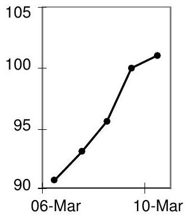
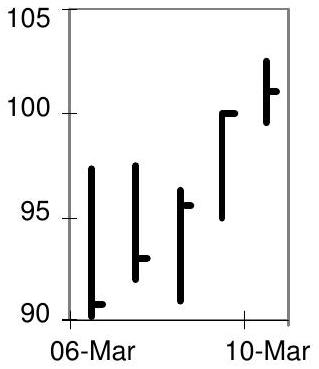
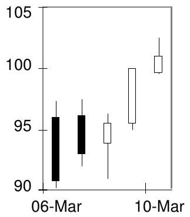

Естественно, в качестве временного периода может быть выбран не только день. Популярными являются часовые или минутные графики для детализации внутридневной торговли, а также недельные и месячные для получения представления о долгосрочной динамике. Обычно цены закрытия и открытия для минутных и часовых интервалов времени практически совпадают, тогда как у дневных и недельных могут наблюдаться щели (gaps).

Существует обширный пласт "эзотерических" знаний, претендующих на то, что по внешнему виду графиков можно прогнозировать будущие значения цен финансовых инструментов. Специалисты по техническому анализу рисуют тренды, линии поддержки, сопротивления, треугольники и другие фигуры, на основании которых делается вывод о дальнейшем направлении случайного процесса.

- $\mathrm{C}_{31}$ Стоимость денег (стр. 218,222,224).

Доллар, полученный сегодня, и доллар, полученный завтра, - это два разных доллара. Деньги имеют свою временную стоимость. При размещении на депозите суммы $S_{0}$ под годовую процентную ставку $r$ мы через год получим $S_{1}=(1+r) S_{0}$. Если эту сумму можно снова разместить на депозите (реинвестировать) под $m y$ же процентную ставку, то через два года активы будут равны $S_{2}=(1+r) S_{1}=(1+r)^{2} S_{0}$, и т.д. Таким образом, если время $t$ измерять в годах, то через $t=1,2,3, \ldots$ лет мы имеем:

$$
S_{t}=S_{0} \cdot(1+r)^{t}=S_{0} e^{\tilde{r} t}
$$

где $\tilde{r}=\ln (1+r)$. Эту формулу удобно рассматривать не только при целых $t$, но и при дробных, считая, что она определяет непрерывное возрастание депозитного вклада между датами начисления процентов. При расчётах можно использовать как мультипликативную ( $r$ ), так и логарифмическую ( $\tilde{r}$ ) ставку.

Рассмотрим теперь обратную к депозиту ситуацию. Если через время $t$ мы получим сумму $S_{t}$, то сколько мы готовы заплатить сегодня за такую возможность? Другими словами, какова временная стоимость будущих денежных поступлений? Выразив в депозитной формуле стоимость денег $S_{0}$ сегодня через их будущую стоимость $S_{t}$, получим:

$$
S_{0}=\frac{S_{t}}{(1+r)^{t}}=\frac{S_{t}}{e^{\tilde{r} t}} .
$$

Говорят, что будущие выплаты дисконтируются (уменьшаются) для получения их текущей цены. Для выбора между несколькими инвестиционными возможностями их приводят к сегодняшней стоимости и сравнивают с альтернативной возможностью размещения средств на депозите.

Предположим, что некоторый актив на протяжении $n$ лет ежегодно даёт суммы (финансовые потоки) $C_{1}, \ldots, C_{n}$. Какова справедливая стоимость такого актива сегодня? Идея её вычисления основана на методе аналогий. Если будет сформирован набор депозитов, которые генерят эквивалентный денежный поток, то его величина должна равняться стоимости актива, так как они будут неразличимы. Чтобы через год получить $C_{1}$, сегодня в банке необходимо разместить годовой депозит на сумму $C_{1} /(1+r)$. Чтобы через два года получить $C_{2}$, потребуется ещё один депозитный договор с правом реинвестирования процентов и начальной суммой $C_{2} /(1+r)^{2}$, и т.д. Все эти депозитные контракты дают начальную сумму, которая и будет генерить потоки $C_{1}, \ldots, C_{n}$. Поэтому будущие денежные потоки необходимо дисконтировать и сложить.

- $\mathbf{C}_{32}$ Европейские опционы в картинках (стр. 227). Рассмотрим стоимость call-опциона по формуле Блэка-Шоулза, как функцию текущей цены актива $x_{0}$ при фиксированном страйке $x_{s}=150$ и годовой волатильности $\sigma=15 \%$. На каждом рисунке сверху вниз приведено по пять контрактов с числом календарных дней $360,180,90,30$ и 0 до истечения опциона.
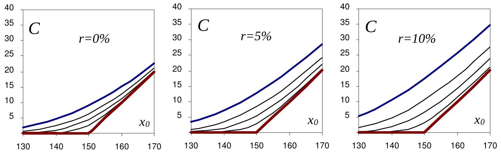

Если распределение вероятностей будущей цены $W(x)$ имеет максимум при $x=x_{0}$ и достаточно быстро убывает при отклонениях от него, то сильный сдвиг $x_{0}$ вправо приводит (8.11) для премии опциона к выражению $C=\langle x\rangle-x_{s} e^{-r t} \sim x_{0}-x_{s} e^{-r t}$. Поэтому асимптотическая временная стоимость опциона выше его внутренней стоимости $x_{0}-x_{s}$. При нулевой процентной ставке и очень значительных отклонениях текущей котировки от страйковой временная стоимость опциона равна нулю. Слева от страйка временная стоимость call-опциона всегда стремится к нулю.

Цена call-опциона при прочих равных условиях повышается с увеличением процентной ставки. Для европейского put-опциона, наоборот, величина премии падает при увеличении процентной ставки и может оказаться ниже его внутренней стоимости:
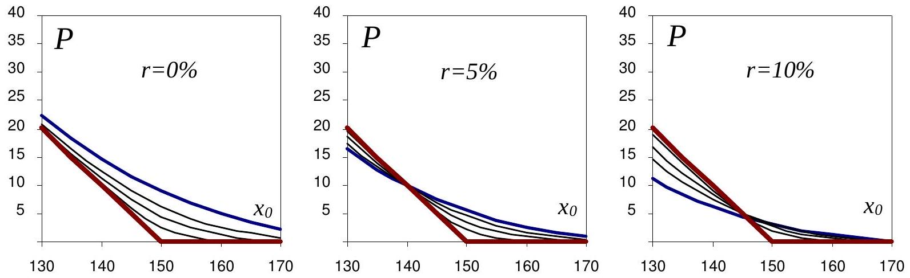

Важно помнить, что $n p u$ росте цены $x_{0}$ премии call-опционов растут, а премии put-опционов падают, и наоборот; рост процентной ставки увеличивает цену call-опциона и уменьшает put.

- $\mathrm{C}_{33}$ Начальное или конечное условие? (стр. 231). Обратим внимание на некоторую лингвистическую особенность термина "начальное условие". На самом деле оно не начальное, а конечное, так как время развивается от произвольного момента $t<t_{e}$ к финальному $t=t_{e}$. Однако всегда можно перейти к переменной $\tau=t_{e}-t$, для которой начальное значение $\tau=0$ действительно будет начальным условием $B(\tau=0)=1$ при решении дифференциального уравнения. Переменная $\tau=t_{e}-t$ имеет смысл времени, оставшегося до истечения облигации. По своему смыслу оно уменьшается, стремясь к нулю.


## Рекомендуемая литература

## Стохастические дифференциальные уравнения:

□ Allen E. "Modeling with Ito Stochastic Differential Equation", Springer, (2007).

- Henderson D., Plaschko P. - "Stochastic differential equations in science and engineering", 2006. Близкая по духу к настоящим лекциям книга, хотя, как и в большинстве других, в основу изложения положены стохастические интегралы.
- Mikosch T. - "Elementary stochastic calculus with finance in View", 1998. Достаточно чёткое, ясное и простое изложение основ стохастических вычислений на базе стохастического интегрирования.
- Бородин А., Салминен П. "Справочник по броуновскому движению. Факты и формульи", Санкт-Петербург, "Лань", (2000).
- Гардинер K.B. - "Стохастические методы в естественных науках", (1983-ru) 2-е издание - одновременно учебник и монография с очень широким охватом прикладных аспектов теории стохастических процессов и ясным изложением их основ. Особенно подробно рассмотрены вопросы, связанные с уравнением Фоккера-Планка.
- Гихман И.И., Скороход А.В. "Введение в теорию случайных процессов", (1977) Наука, 2-е издание
- Маккин Г. "Стохастические интеграль", Мир, Москва (1972)
- Оксендаль Б. - "Стохастические дифференицальные уравнения введение в теорию и приложения", 2003. По праву считается лучшим учебником, однако требует достаточно высокой математической культуры.


## Математика в целом:

△ Камке Э. - Справочник по обыкновенным дифференицальным уравнениям. Наука, Москва, (1976)

△ Курант Р., Роббинс Г. - Что такое математика? (2001-ru) 3-е издание - замечательная книга, дающая ряд ответов на поставленный в названии вопрос

- "Справочник по специальным функииям" под ред. Абрамовица М., Стиган И, (1979) - чудный справочник почти на все случаи жизни.


## Теория вероятности:

- Феллер - "Введение в теорию вероятности и её приложения", в $2-\mathrm{x}$ томах, (1984) - Один из лучших учебников по теории вероятности.
- Пугачев В.С. - "Теория вероятностей и математическая статистика", ДНУ, (2002) - хоршая книга по математической статистике.
- Турчин В.Н. "Теория вероятностей и математическая статисти$κ a ",(2008)$ - Блестящий баланс математической строгости и наглядности.
- Тюрин Ю.Н., Макаров А.А. - "Анализ данных на компьютере", (2003), 3-е издание - неплохое введение в использование профессиональных программ STADIA и SPSS при проведении статистических исследований.


## Финансовые рынки:

- Мандельброт Б. Хадсон Р.Л. - "(Не) послушные рынки. Фрактальная револючия в финансах" (2006-ru), (2004-en) - развлекательная, очень личностная книга от создателя фракталов. Приведено множество исторических фактов о финансистах-теоретиках и, конечно, о самом Мандельброте, "самом выдающимся не экономисте".

△ Уотшем Т.Дж., Паррамоу К. - "Количественные методы в финанcax", 2-тома, (1999-ru), (1996-en) - очень щадящее в математическом плане, тем не менее детальное изложение достаточно сложных вопросов современной теории финансов.

▷ Шарп У., Александер Г., Бэйли Дж. - "Инвестиции", 5-е издание. (2001-ru), (1995-en) - классический учебник по финансам.

- Ширяев А.Н. - "Основы стохастической финансовой математики", 2-тома, (1998) - великолепное описание современных стохастических подходов к анализу финансов.
$\mathrm{C}++$ :
▷ Шильд Г. - Справочник программиста по $C / C++$, (2000).
- Седжвик P. - "Фундаментальные алгоритмы на $C++$ ". Множество дискретных алгоритмов с очень лаконичными примерами на $\mathrm{C}++$


## Предметный указатель

call-put parity, 222
call-put паритет, 222
efficient set, 213
expiry date, 220
feasible set, 213
futures, 205
in-the money, 222
initial ..., 204
intrinsic value, 222
IPO, 204
IV, 222
out-of-the money, 222
set
efficient, 213
feasible, 213
strike price, 205
time value, 222
TV, 222
utility, 217
ёмкость, 194
американский опцион, 205
арифметическое среднее, 239
асимметрия, 15
ассоциативность, 305
базис, 301
бесконечная делимость, 23
валютный рынок, 204
вариация, 15

вариация функционала, 320
вектор, 300
векторное произведение, 302
вероятность, 14
Гаусса, 16
винеровская переменная, 34
винеровский процесс, 48
внутренняя стоимость опциона, 220 , 222

волатильность, 15
волатильность выборочного среднего, 240

временная
стоимость денег, 365
стоимость опциона, 222
выборочное среднее, 239
гамма-распределение, 83
гамма-функция, 313
гармоника, 314
граничные условия, 110
декартова система координат, 301
дериватив, 205
диагональная матрица, 308
диагональный элемент, 304
дисконтирование, 365
дисперсия, 15
диффузия, 49
длина вектора, 300
длинная позиция, 205
достижимое множество, 213
достоверное событие, 14
европейский опцион, 205

единичная матрица, 305
инвестиционный портфель, 212
интеграл
Гаусса, 312
Римана - Стилтьеса, 130
Фурье, 314
гамма, 313
интегральное распределение, 16
историческая волатильность, 227
итерационная схема, 11,49
каноническое разложение, 70
касательный портфель, 214
квадратная матрица, 304
ковариационный коэффициент, 212
ковариация, 24
коммутативность, 305
коммутирование матриц, 306
комплексное сопряжение, 162
конденсатор, 194
короткая позиция, 205
корреляция, 24
ложная, 24
коэффициент
Шарпа, 214
детерминации, 25
ковариации, 212
кривая
доходности, 228
улыбки, 227
лемма Ито, 55
линейная модель, 24
линейно независимые векторы, 301
логарифмическое блуждание, 206
логистическая функция, 10
логистическое уравнение, 10
ложная корреляция, 24
максимум, 318
марковские процессы, 37

марковский процесс, 39
мартингал, 42
массив $C++, 237$
матрица, 304
диагональная, 308
дисперсий, 167
единичная, 305
квадратная, 304
обратная, 306, 309
симметричная, 310
транспонированная, 305
минимум, 318
множество
достижимое, 213
эффективное, 213
модель
Коломогорова, 192
Лотка-Вольтерры, 198
хищник-жертва, 198
момент, 15
начальная маржа, 205
начальное размещение акций, 204
независимость, 22
независимые события, 299
немой индекс, 30
неравенство
Липшица, 144
несмещенная оценка, 241
несовместные события, 297
неустойчивый узел, 179
нутация, 191
оборонительная акция, 215
обратная
матрица, 306, 309
объединение событий, 298
однородная
система, 309
определитель матрицы, 308
опцион, 205
call, 205
put, 205
в деньгах, 222
вне денег, 222
ортогональность, 310
особая точка уравнения, 354
относительная ошибка, 25
пересечение событий, 298
плотность вероятности, 14
совместная, 18
условная, 19
подразумеваемая волатильность, 227
полезность, 217
полная группа, 297
поток вероятности, 111
правило
лома, 304
штопора, 302
предельная теорема, 29
прецессия, 191
принцип суперпозиции, 316
произведение
векторное, 302
скалярное, 300
смешанное, 302
производящая
функция, 26
производящая функция, 16
процесс
Феллера, 82
винеровский, 48
марковский, 39
разложение Палея-Винера, 65
размерность пространства, 301
распределение
$\chi^{2}, 362$
Гаусса, 16
Гаусса $n$-мерное, 167, 342
Гиббса, 184, 196

гамма, 83
интегральное, 16
логнормальное, 17
нормальное, 16
хи-квадрат, 362
регрессионная прямая, 24
резистор, 194
реинвестирование, 365
рынок
акций, 204
валютный, 204
облигаций, 204
ряд
Фурье, 314
связь, 318
седло, 179, 318
символ
Кронекера, 306
симметричная матрица, 310
система
однородная, 309
уравнений, 309
система координат
декартова, 301
скаляр, 300
скалярное произведение, 300
след матрицы, 307
случайная
величина, 14
функция, 37
случайная функция, 38
случайный процесс
дискретный, 38
непрерывный, 38
смешанное произведение, 302
снос, 49
собственное значение, 310
собственные значения, 318
собственный вектор, 310

сопротивление, 194
составное событие, 297
спотовая цена, 205
спотовый инструмент, 205
среднее
арифметическое, 239
выборочное, 239
значение, 14
стандартная ошибка, 240
статический массив, 238
стационарное уравнение, 62
стационарное уравнение Фоккера Планка, 80

стоимость опциона
внутренняя, 220, 222
временная, 222
стохастическое уравнение, 13
субмартингал, 45
супермартингал, 45
схема
Милстейна, 149
Эйлера, 148
товарные рынки, 204
транспонированная матрица, 305
тренд, 24

узел
неустойчивый, 179
устойчивый, 179
уравнение
логистическое, 10
плоскости, 303
прямой, 303
распада, 10
роста, 10
стационарное, 62
теплопроводности, 185
характеристическое, 178, 310
уравнения
динамики, 11

условие
нормировки, 14
ортогональности, 118
условная вероятность, 299
устойчивый узел, 179
факториал числа, 313
финансовый
актив, 205
инструмент, 205
фокус, 179
формула Блэка-Шоулза, 224
функционал, 320
функция
Дирака, 315
Лагранжа, 319
логистическая, 10
производящая, 26
случайная, 38
характеристическая, 26
фьючерс, 205
фьючерсная цена, 205
характеристическое уравнение, 165, 178, 310
хи-квадрат распределение, 362

цена
исполнения, 205
на споте, 205
центр, 179
частота, 14
число
степеней свободы, 362
экстремум, 318
эксцесс, 15
элементарное событие, 297
элементы матрицы, 304
эффективное множество, 213

