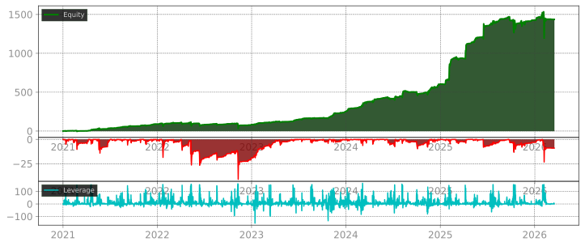

# Test file 1
Some text

## Report data

$\frac{1}{\alpha}$

**Chat node** — an agent conversation terminal embedded in the canvas:
1. file1
2. file2

$\frac{1}{\alpha}$

[some-external-link](http://xyz.com)


```python
def foo():
    print("")
```

---

---

**Technical Logic:**

This indicator tracks trend direction using ATR-based volatility bands combined with volume and macro filtering.

- **Trend Detection:** Uses ATR (default 25) and a Multiplier (3.2) to create dynamic support/resistance levels.
- **Volume Filter:** A trend flip (BUY/SELL) is only triggered if the current volume's percentile rank (500-bar lookback) is above 40%.
- **Main Trend Filter:** Uses a Hull Moving Average (HMA 500). Signals are filtered based on price position relative to this HMA.

**Visuals:**

- **Line Color:** Teal (Bullish) or Rose (Bearish).
- **Grey Line:** Appears when the local trend is in conflict with the HMA 500 baseline.
- **Background:** Tints according to the HMA 500 bias (Teal/Rose).
- **Shapes:** "BUY" and "SELL" labels plot only when trend, volume, and HMA filter conditions are all met.

**How to use:**

1. **BUY:** Price crosses above the trend line + High Volume + Price is above HMA 500.
2. **SELL:** Price crosses below the trend line + High Volume + Price is below HMA 500.
3. **Grey Line:** Indicates a counter-trend move relative to the HMA 500.

